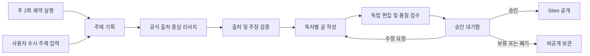

# WAVE AI Networks 공식 블로그 자동화 설계

- 작성일: 2026-07-13
- 상태: 사용자 설계 승인 완료
- 변경 분류: docs
- 대상 플랫폼: OpenAI Sites

## 1. 목표

WAVE AI Networks 공식 블로그를 OpenAI Sites에 구축하고, 정기 및 수시 콘텐츠를 기획·리서치·출처 검증·작성·검수한다. 모든 콘텐츠는 사용자 최종 승인을 받은 뒤에만 공개한다.

자동화의 성공 기준은 다음과 같다.

- 4개 카테고리를 순환하며 전체 합계 주 2편을 준비한다.
- 사용자가 주제를 입력하면 정기 편성과 별도로 수시 작업을 시작한다.
- 승인 전 콘텐츠는 외부에 공개하지 않는다.
- 주요 주장은 추적 가능한 출처와 검증 결과를 가진다.
- 수정 후에는 기존 승인을 무효화하고 재승인을 요구한다.
- 배포 실패 시 승인된 원고와 이력을 보존하고 재배포할 수 있다.

## 2. 범위

### 포함

- Sites 기반 공개 블로그
- 비공개 승인 대기함
- 정기 주 2편 생성
- 사용자 주제 입력에 따른 수시 생성
- 기획, 리서치, 출처 검증, 작성, 독립 검수
- 승인, 수정 요청, 보류, 공개 상태 관리
- 대표 이미지 및 검색 노출용 메타데이터 준비
- 발행 이력과 수정 이력 보관

### 제외

- 투자 분석 카테고리
- 승인 없는 자동 공개
- 사용자 계정·구독·댓글·결제 기능
- 외부 CMS 동시 발행
- 근거 없는 AI 추정 또는 출처 요약문만을 이용한 주장

## 3. 콘텐츠 구조

공식 카테고리는 다음 4개다.

1. AI 자동화
2. 교회 사역
3. 시대 분석
4. 청소년 인성·정체성 교육

독자는 교회 리더·교사, 학부모, 청소년, AI와 시대 변화에 관심 있는 일반 독자를 모두 포함한다. 다만 글마다 주 독자 한 그룹을 지정하고, 나머지 독자를 보조 독자로 태깅한다.

## 4. 운영 흐름

기본 예약은 화요일과 금요일 오전 9시(Asia/Seoul)다. 카테고리는 최근 발행 이력을 기준으로 순환하되, 동일 카테고리가 연속되지 않도록 한다. 수시 작업은 정기 편성을 대체하지 않는다.

## 5. 모듈 경계

기존 5개 콘텐츠 Skill의 역할 경계를 유지한다.

| 모듈 | 책임 | 입력 | 출력 |
|---|---|---|---|
| 기획 | 주제·독자·목적·조사 질문 구체화 | 정기 편성 또는 사용자 주제 | 콘텐츠 브리프 |
| 리서치 | 브리프에 필요한 자료 수집 | 콘텐츠 브리프 | 리서치 자료집 |
| 출처 검증 | 자료 존재, 주장 일치, 최신성, 인용 정확성 검증 | 리서치 자료집 | 검증 보고서 |
| 작성 | 검증된 자료만으로 초안 작성 | 브리프, 검증 보고서 | 글 초안 |
| 편집·검수 | 논리, 구조, 문체, 안전성, 공개 적합성 판정 | 글 초안, 검증 보고서 | 최종 원고, 검수표 |
| 승인 관리 | 승인·수정·보류 결정과 이력 보관 | 최종 원고, 검수표 | 승인 기록 |
| 배포 | 승인된 버전만 Sites에 공개 | 승인 기록, 최종 원고 | 공개 URL, 배포 기록 |

각 모듈은 자신의 책임 밖 작업을 수행하지 않는다. 특히 작성 모듈은 새로운 리서치를 하지 않고, 편집 모듈은 출처가 없는 주장을 새로 만들지 않는다.

## 6. 단계별 규칙

### 6.1 기획

기획안은 제목 후보, 핵심 질문, 주 독자, 보조 독자, 카테고리, 목적, 예상 핵심 주장, 필요한 출처 유형, 기존 글과의 중복 여부를 포함한다. 수시 주제가 지나치게 넓으면 원래 의도를 보존하는 범위에서 한 편의 글로 좁힌다.

### 6.2 리서치

- 정부기관, 학술자료, 공식 보고서, 원문 자료를 우선한다.
- 검색 결과의 요약문만으로 주장하지 않는다.
- 주요 사실마다 URL, 발행일, 확인일을 기록한다.
- 최신성이 중요한 정보는 작성 직전에 다시 확인한다.
- 교회 사역은 성경 본문, 역사적 배경, 신학적 해석, 적용을 구분한다.
- 청소년 교육은 연령 적합성, 낙인, 과도한 일반화, 개인정보 위험을 확인한다.

### 6.3 출처 검증

핵심 주장은 다음 네 상태 중 하나로 판정한다.

- 확인: 출처가 주장을 직접 뒷받침한다.
- 부분 확인: 표현을 제한하거나 조건을 명시하면 사용할 수 있다.
- 해석: 사실이 아니라 WAVE AI Networks의 분석임을 밝혀야 한다.
- 사용 금지: 근거가 부족하거나 출처와 일치하지 않는다.

`사용 금지` 주장이 남아 있으면 작성 단계로 진행하지 않는다.

### 6.4 작성

기본 글 구조는 다음과 같다.

1. 독자의 현실적인 문제
2. 핵심 요약
3. 근거와 배경
4. WAVE AI Networks의 분석
5. 실제 적용 방법
6. 결론과 독자 질문
7. 출처

전문용어는 첫 등장 때 설명한다. 사실, 의견, 신학적 해석, 실천 제안을 문장 수준에서 구분한다.

### 6.5 독립 검수

검수자는 다음 항목을 확인한다.

- 제목과 본문의 일치
- 사실 및 인용 정확성
- 출처 누락과 링크 유효성
- 과장, 단정, 공포 조장
- 신학적 왜곡과 성경 본문 오용
- 청소년에게 부적절하거나 낙인적인 표현
- 표절성 문장과 저작권 침해
- 개인정보 노출
- 문장 가독성
- 검색 제목, 설명, 주소

판정은 `통과`, `수정 필요`, `승인 불가`로 나눈다. 자동 수정은 최대 2회 허용하며, 이후에도 통과하지 못하면 사용자에게 보고하고 중단한다.

## 7. 승인 대기함

승인 화면은 다음 정보를 한 번에 보여준다.

- 최종 제목과 요약
- 카테고리, 주 독자, 보조 독자
- 예상 읽기 시간
- 핵심 주장과 출처
- 검수 결과와 남은 주의사항
- 최종 본문과 대표 이미지
- 승인, 수정 요청, 보류 버튼

승인은 특정 원고 버전에 귀속된다. 승인 후 본문, 제목, 출처, 대표 이미지, 검색 메타데이터가 바뀌면 승인 상태를 자동으로 취소하고 재승인을 요구한다.

## 8. 공개 블로그 정보 구조

- 홈: 최신 글, 4개 카테고리, WAVE AI Networks 소개
- 카테고리 목록: 카테고리별 글과 대상 독자 필터
- 글 상세: 핵심 요약, 본문, 출처, 대상 독자, 관련 글
- 소개: 운영 목적, 편집 원칙, 콘텐츠 책임 범위
- 승인 대기함: 공개 영역과 분리된 비공개 관리 화면

## 9. 상태와 데이터

콘텐츠 상태는 다음 흐름을 따른다.

`기획 중 → 리서치 중 → 검증 중 → 작성 중 → 검수 중 → 승인 대기 → 승인됨 → 공개됨`

예외 상태는 `수정 필요`, `보류`, `실패`, `폐기`다. 각 글에는 기획안, 리서치 자료, 출처 검증표, 초안, 수정 이력, 검수표, 승인자와 승인 시각, 공개 URL과 공개 시각을 보관한다.

## 10. 오류 처리

- 출처 부족: `리서치 보완 필요`로 중단한다.
- 출처 충돌: 충돌 내용을 병기하고 사용자 판단을 요청한다.
- 작업 중단: 마지막 완료 단계부터 재개한다.
- 대표 이미지 실패: 원고는 보존하되 승인·배포를 진행하지 않는다.
- Sites 배포 실패: 승인 상태를 보존하고 동일 버전을 재배포할 수 있게 한다.
- 중복 실행: 동일하거나 의미상 같은 주제의 진행 중 작업이 있으면 새 작업을 만들지 않는다.
- 예약 실행 누락: 자동으로 공개하지 않고 누락 사실과 재실행 가능 상태를 보고한다.

## 11. 보안과 권한

- 공개 배포는 사용자 승인 기록이 있을 때만 허용한다.
- 승인 대기 원고와 조사 자료는 공개 경로에서 제공하지 않는다.
- 배포 자격 증명은 콘텐츠 파일이나 로그에 저장하지 않는다.
- 관리 화면에는 최소 권한 접근 제어를 적용한다.
- 운영 초기에는 private 배포로 검증한 뒤, 사용자가 공개 전환을 별도로 승인한다.

인증 및 외부 공개는 구현 전 별도 위험 검토 대상이다.

## 12. 검증 기준

### 콘텐츠 검증

- 주요 주장에 확인 가능한 출처가 있다.
- 사실과 분석이 구분된다.
- 사용 금지 또는 미검증 주장이 없다.
- 지정 독자와 연령에 적합하다.
- 신학 및 청소년 안전 기준을 통과한다.

### 기능 검증

- 화요일·금요일 예약이 중복 없이 각각 한 번 실행된다.
- 4개 카테고리가 순환되고 전체 합계 주 2편만 생성된다.
- 수시 실행은 정기 편성을 변경하지 않는다.
- 승인하지 않은 글은 공개되지 않는다.
- 승인된 버전이 수정되면 재승인이 요구된다.
- 실패한 작업은 마지막 완료 단계에서 재개된다.
- 모바일과 데스크톱에서 공개 글을 읽을 수 있다.
- 공개 성공 시 URL과 배포 시각이 기록된다.

## 13. 구현 순서

1. Sites 블로그의 공개 화면과 콘텐츠 모델을 구축한다.
2. 기존 5개 Skill을 현재 운영 규칙에 맞게 연결한다.
3. 승인 대기함과 버전별 승인 게이트를 추가한다.
4. 화요일·금요일 예약 실행과 수시 주제 입력을 연결한다.
5. 대표 이미지와 검색 메타데이터 생성을 연결한다.
6. 비공개 환경에서 전체 흐름을 검증한다.
7. 사용자 최종 확인 후 공개 배포를 활성화한다.

## 14. 구현 전 결정 사항

다음 세부 선택은 구현 계획에서 기본값을 제안하고, 외부 공개 또는 권한에 영향을 주는 시점에 사용자 확인을 받는다.

- 승인 대기함의 인증 방식
- 공개 도메인 또는 Sites 기본 주소 사용 여부
- 대표 이미지의 시각 스타일
- 승인 알림을 표시할 Codex 작업 표면

