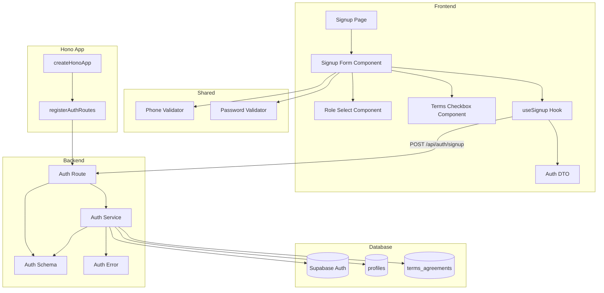

# 역할 선택 & 온보딩 구현 계획

## 개요

### Backend Modules

| 모듈 | 위치 | 설명 |
|------|------|------|
| Auth Route | `src/features/auth/backend/route.ts` | 회원가입 API 엔드포인트 (`POST /api/auth/signup`) |
| Auth Service | `src/features/auth/backend/service.ts` | 회원가입 비즈니스 로직 (Auth 계정 생성, 프로필 생성, 약관 이력 저장) |
| Auth Schema | `src/features/auth/backend/schema.ts` | 회원가입 요청/응답 zod 스키마 정의 |
| Auth Error | `src/features/auth/backend/error.ts` | Auth 관련 에러 코드 정의 |

### Frontend Modules

| 모듈 | 위치 | 설명 |
|------|------|------|
| Signup Page | `src/app/signup/page.tsx` | 회원가입 페이지 (기존 파일 수정) |
| Signup Form Component | `src/features/auth/components/signup-form.tsx` | 회원가입 폼 컴포넌트 (react-hook-form 사용) |
| Role Select Component | `src/features/auth/components/role-select.tsx` | 역할 선택 UI 컴포넌트 |
| Terms Checkbox Component | `src/features/auth/components/terms-checkbox.tsx` | 약관 동의 체크박스 컴포넌트 |
| Auth DTO | `src/features/auth/lib/dto.ts` | 프론트엔드에서 사용할 스키마 재노출 |
| Signup Hook | `src/features/auth/hooks/useSignup.ts` | 회원가입 API 호출 React Query mutation |

### Shared Modules

| 모듈 | 위치 | 설명 |
|------|------|------|
| Phone Validator | `src/lib/validators/phone.ts` | 휴대폰번호 유효성 검사 유틸 (공통) |
| Password Validator | `src/lib/validators/password.ts` | 비밀번호 규칙 검증 유틸 (공통) |

### Database

| 모듈 | 위치 | 설명 |
|------|------|------|
| Terms Agreement Migration | `supabase/migrations/0003_create_terms_agreements.sql` | 약관 동의 이력 테이블 생성 |

## Diagram



## Implementation Plan

### 1. Database Layer

#### 1.1 Create Terms Agreements Table

**File:** `supabase/migrations/0003_create_terms_agreements.sql`

**구현 내용:**
- `terms_agreements` 테이블 생성
- 컬럼: `id`, `user_id`, `terms_type`, `agreed_at`, `ip_address`, `user_agent`
- `terms_type` enum: `service`, `privacy` (필수 약관)
- 외래 키 제약: `user_id` → `auth.users(id)` (CASCADE)
- 인덱스: `user_id`, `terms_type`, `agreed_at`

**Unit Test (SQL):**
```sql
-- 테이블 존재 확인
SELECT EXISTS (
  SELECT FROM information_schema.tables
  WHERE table_schema = 'public'
  AND table_name = 'terms_agreements'
);

-- 제약 조건 확인
SELECT constraint_name, constraint_type
FROM information_schema.table_constraints
WHERE table_name = 'terms_agreements';
```

---

### 2. Backend Layer

#### 2.1 Auth Schema

**File:** `src/features/auth/backend/schema.ts`

**구현 내용:**
```typescript
// SignupRequestSchema
- email: string (email format)
- password: string (min 8 chars)
- role: 'learner' | 'instructor'
- name: string (min 1, max 100)
- phone: string (pattern: /^01[0-9]-?[0-9]{3,4}-?[0-9]{4}$/)
- termsAgreed: { service: boolean, privacy: boolean } (both must be true)

// SignupResponseSchema
- userId: string (uuid)
- role: 'learner' | 'instructor'
- redirectTo: string (url)

// ProfileRowSchema (DB 매핑용)
- id: uuid
- role: string
- name: string
- phone: string
- terms_agreed_at: string (timestamp)
```

**Unit Test:**
```typescript
describe('SignupRequestSchema', () => {
  it('should validate correct signup data', () => {
    const valid = {
      email: 'test@example.com',
      password: 'password123',
      role: 'learner',
      name: '홍길동',
      phone: '010-1234-5678',
      termsAgreed: { service: true, privacy: true }
    };
    expect(SignupRequestSchema.safeParse(valid).success).toBe(true);
  });

  it('should reject invalid email', () => {
    const invalid = { ...validData, email: 'invalid' };
    expect(SignupRequestSchema.safeParse(invalid).success).toBe(false);
  });

  it('should reject short password', () => {
    const invalid = { ...validData, password: '1234567' };
    expect(SignupRequestSchema.safeParse(invalid).success).toBe(false);
  });

  it('should reject invalid phone format', () => {
    const invalid = { ...validData, phone: '123-4567' };
    expect(SignupRequestSchema.safeParse(invalid).success).toBe(false);
  });

  it('should reject when terms not agreed', () => {
    const invalid = { ...validData, termsAgreed: { service: true, privacy: false } };
    expect(SignupRequestSchema.safeParse(invalid).success).toBe(false);
  });
});
```

---

#### 2.2 Auth Error

**File:** `src/features/auth/backend/error.ts`

**구현 내용:**
```typescript
export const authErrorCodes = {
  invalidRequest: 'AUTH_INVALID_REQUEST',
  emailAlreadyExists: 'AUTH_EMAIL_ALREADY_EXISTS',
  weakPassword: 'AUTH_WEAK_PASSWORD',
  invalidPhone: 'AUTH_INVALID_PHONE',
  termsNotAgreed: 'AUTH_TERMS_NOT_AGREED',
  authCreationFailed: 'AUTH_CREATION_FAILED',
  profileCreationFailed: 'AUTH_PROFILE_CREATION_FAILED',
  termsRecordFailed: 'AUTH_TERMS_RECORD_FAILED',
  validationError: 'AUTH_VALIDATION_ERROR',
} as const;

export type AuthServiceError = (typeof authErrorCodes)[keyof typeof authErrorCodes];
```

---

#### 2.3 Auth Service

**File:** `src/features/auth/backend/service.ts`

**구현 내용:**
- `signupUser` 함수: 회원가입 전체 플로우 처리
  1. Supabase Auth 계정 생성 (`supabase.auth.admin.createUser`)
  2. 이메일 중복 체크 (Supabase Auth 에러 핸들링)
  3. 프로필 레코드 생성 (`INSERT INTO profiles`)
  4. 약관 동의 이력 저장 (`INSERT INTO terms_agreements` 2건)
  5. 역할에 따른 리다이렉트 URL 반환
- 트랜잭션 고려: Supabase Auth 생성 실패 시 롤백 불필요 (아직 DB 작업 전)
- 프로필/약관 저장 실패 시: Auth 계정 삭제 고려 (또는 추후 정리 작업)

**Unit Test:**
```typescript
describe('signupUser', () => {
  it('should create user with learner role', async () => {
    const result = await signupUser(mockSupabaseClient, {
      email: 'learner@test.com',
      password: 'password123',
      role: 'learner',
      name: '학습자',
      phone: '010-1234-5678',
      termsAgreed: { service: true, privacy: true }
    });

    expect(result.ok).toBe(true);
    expect(result.data.role).toBe('learner');
    expect(result.data.redirectTo).toBe('/courses');
  });

  it('should create user with instructor role', async () => {
    const result = await signupUser(mockSupabaseClient, {
      email: 'instructor@test.com',
      password: 'password123',
      role: 'instructor',
      name: '강사',
      phone: '010-9876-5432',
      termsAgreed: { service: true, privacy: true }
    });

    expect(result.ok).toBe(true);
    expect(result.data.role).toBe('instructor');
    expect(result.data.redirectTo).toBe('/dashboard');
  });

  it('should return error when email already exists', async () => {
    mockSupabaseClient.auth.admin.createUser.mockResolvedValue({
      error: { message: 'User already registered' }
    });

    const result = await signupUser(mockSupabaseClient, validRequest);

    expect(result.ok).toBe(false);
    expect(result.error.code).toBe('AUTH_EMAIL_ALREADY_EXISTS');
  });

  it('should save both terms agreements', async () => {
    await signupUser(mockSupabaseClient, validRequest);

    expect(mockSupabaseClient.from).toHaveBeenCalledWith('terms_agreements');
    expect(mockInsert).toHaveBeenCalledTimes(2);
  });
});
```

---

#### 2.4 Auth Route

**File:** `src/features/auth/backend/route.ts`

**구현 내용:**
- `POST /api/auth/signup` 엔드포인트 등록
- 요청 body 파싱 (`SignupRequestSchema`)
- `signupUser` 서비스 호출
- 성공/실패 응답 반환 (`respond` 헬퍼 사용)

**Integration Test (수동 QA 시트 참고):**
```typescript
describe('POST /api/auth/signup', () => {
  it('should return 201 on successful signup', async () => {
    const response = await request(app)
      .post('/api/auth/signup')
      .send(validSignupRequest);

    expect(response.status).toBe(201);
    expect(response.body.userId).toBeDefined();
    expect(response.body.role).toBe('learner');
  });

  it('should return 400 on invalid request', async () => {
    const response = await request(app)
      .post('/api/auth/signup')
      .send({ email: 'invalid' });

    expect(response.status).toBe(400);
    expect(response.body.error.code).toBe('AUTH_INVALID_REQUEST');
  });

  it('should return 409 when email exists', async () => {
    // 먼저 계정 생성
    await request(app).post('/api/auth/signup').send(validSignupRequest);

    // 동일 이메일로 재시도
    const response = await request(app)
      .post('/api/auth/signup')
      .send(validSignupRequest);

    expect(response.status).toBe(409);
    expect(response.body.error.code).toBe('AUTH_EMAIL_ALREADY_EXISTS');
  });
});
```

---

#### 2.5 Register Auth Routes in Hono App

**File:** `src/backend/hono/app.ts`

**구현 내용:**
```typescript
import { registerAuthRoutes } from '@/features/auth/backend/route';

export const createHonoApp = () => {
  // ... existing code

  registerAuthRoutes(app);
  registerExampleRoutes(app);

  // ... rest
};
```

---

### 3. Shared Layer

#### 3.1 Phone Validator

**File:** `src/lib/validators/phone.ts`

**구현 내용:**
```typescript
export const PHONE_REGEX = /^01[0-9]-?[0-9]{3,4}-?[0-9]{4}$/;

export const isValidPhoneNumber = (phone: string): boolean => {
  return PHONE_REGEX.test(phone);
};

export const normalizePhoneNumber = (phone: string): string => {
  return phone.replace(/-/g, '');
};
```

**Unit Test:**
```typescript
describe('phone validator', () => {
  it('should validate correct phone numbers', () => {
    expect(isValidPhoneNumber('010-1234-5678')).toBe(true);
    expect(isValidPhoneNumber('01012345678')).toBe(true);
    expect(isValidPhoneNumber('011-123-4567')).toBe(true);
  });

  it('should reject invalid phone numbers', () => {
    expect(isValidPhoneNumber('123-4567')).toBe(false);
    expect(isValidPhoneNumber('010-12-5678')).toBe(false);
    expect(isValidPhoneNumber('02-1234-5678')).toBe(false);
  });

  it('should normalize phone number', () => {
    expect(normalizePhoneNumber('010-1234-5678')).toBe('01012345678');
  });
});
```

---

#### 3.2 Password Validator

**File:** `src/lib/validators/password.ts`

**구현 내용:**
```typescript
export const MIN_PASSWORD_LENGTH = 8;

export const isValidPassword = (password: string): boolean => {
  return password.length >= MIN_PASSWORD_LENGTH;
};

export const getPasswordErrorMessage = (password: string): string | null => {
  if (password.length < MIN_PASSWORD_LENGTH) {
    return `비밀번호는 최소 ${MIN_PASSWORD_LENGTH}자 이상이어야 합니다.`;
  }
  return null;
};
```

**Unit Test:**
```typescript
describe('password validator', () => {
  it('should accept password with 8+ chars', () => {
    expect(isValidPassword('password123')).toBe(true);
    expect(isValidPassword('12345678')).toBe(true);
  });

  it('should reject password with less than 8 chars', () => {
    expect(isValidPassword('1234567')).toBe(false);
    expect(isValidPassword('pass')).toBe(false);
  });

  it('should return error message for short password', () => {
    expect(getPasswordErrorMessage('short')).toContain('8자');
  });
});
```

---

### 4. Frontend Layer

#### 4.1 Auth DTO

**File:** `src/features/auth/lib/dto.ts`

**구현 내용:**
```typescript
export {
  SignupRequestSchema,
  SignupResponseSchema,
  type SignupRequest,
  type SignupResponse,
} from '@/features/auth/backend/schema';
```

---

#### 4.2 Signup Hook

**File:** `src/features/auth/hooks/useSignup.ts`

**구현 내용:**
```typescript
'use client';

import { useMutation } from '@tanstack/react-query';
import { apiClient, extractApiErrorMessage } from '@/lib/remote/api-client';
import { SignupRequestSchema, SignupResponseSchema } from '../lib/dto';
import type { SignupRequest, SignupResponse } from '../lib/dto';

const signupUser = async (data: SignupRequest): Promise<SignupResponse> => {
  try {
    const validated = SignupRequestSchema.parse(data);
    const { data: response } = await apiClient.post('/api/auth/signup', validated);
    return SignupResponseSchema.parse(response);
  } catch (error) {
    const message = extractApiErrorMessage(error, '회원가입에 실패했습니다.');
    throw new Error(message);
  }
};

export const useSignup = () =>
  useMutation({
    mutationFn: signupUser,
  });
```

---

#### 4.3 Role Select Component

**File:** `src/features/auth/components/role-select.tsx`

**구현 내용:**
- 역할 선택 라디오 버튼 UI (Learner / Instructor)
- react-hook-form Controller 통합
- 선택된 역할에 대한 설명 표시

**QA Sheet:**
| 시나리오 | 입력 | 예상 결과 |
|---------|------|----------|
| Learner 선택 | Learner 라디오 버튼 클릭 | Learner 선택 상태, "코스를 탐색하고 학습합니다" 설명 표시 |
| Instructor 선택 | Instructor 라디오 버튼 클릭 | Instructor 선택 상태, "코스를 개설하고 관리합니다" 설명 표시 |
| 선택 없이 진행 | 선택 안 함 | 폼 제출 시 "역할을 선택해주세요" 오류 표시 |

---

#### 4.4 Terms Checkbox Component

**File:** `src/features/auth/components/terms-checkbox.tsx`

**구현 내용:**
- 서비스 이용약관 체크박스 (필수)
- 개인정보 처리방침 체크박스 (필수)
- 약관 상세 보기 링크
- 전체 동의 체크박스 (선택)
- react-hook-form Controller 통합

**QA Sheet:**
| 시나리오 | 입력 | 예상 결과 |
|---------|------|----------|
| 개별 체크 | 서비스 약관 체크 | 서비스 약관만 체크 상태 |
| 전체 동의 체크 | 전체 동의 체크박스 클릭 | 모든 약관 체크 상태 |
| 필수 약관 미동의 | 개인정보 약관 미체크 | 폼 제출 시 "필수 약관에 동의해주세요" 오류 표시 |
| 약관 상세 보기 | "자세히 보기" 링크 클릭 | 약관 상세 모달/페이지 표시 |

---

#### 4.5 Signup Form Component

**File:** `src/features/auth/components/signup-form.tsx`

**구현 내용:**
- react-hook-form + zod 통합
- 필드: 이메일, 비밀번호, 비밀번호 확인, 이름, 휴대폰번호
- RoleSelect, TermsCheckbox 컴포넌트 통합
- useSignup 훅 사용
- 성공 시 리다이렉트 처리
- 오류 메시지 표시 (toast 또는 inline)

**QA Sheet:**
| 시나리오 | 입력 | 예상 결과 |
|---------|------|----------|
| 정상 회원가입 (Learner) | 모든 필드 올바르게 입력 + Learner 선택 | 회원가입 성공, `/courses`로 리다이렉트 |
| 정상 회원가입 (Instructor) | 모든 필드 올바르게 입력 + Instructor 선택 | 회원가입 성공, `/dashboard`로 리다이렉트 |
| 이메일 형식 오류 | 이메일: "invalid" | "올바른 이메일 형식을 입력해주세요" 오류 |
| 비밀번호 짧음 | 비밀번호: "1234567" | "비밀번호는 8자 이상이어야 합니다" 오류 |
| 비밀번호 불일치 | 비밀번호: "password123", 확인: "password456" | "비밀번호가 일치하지 않습니다" 오류 |
| 휴대폰번호 형식 오류 | 휴대폰: "123-4567" | "유효한 휴대폰번호를 입력해주세요" 오류 |
| 역할 미선택 | 역할 선택 안 함 | "역할을 선택해주세요" 오류 |
| 약관 미동의 | 개인정보 약관 미체크 | "필수 약관에 동의해주세요" 오류 |
| 이메일 중복 | 기존 이메일 입력 | "이미 가입된 이메일입니다" 오류 메시지 표시 |
| 네트워크 오류 | 네트워크 끊김 상태에서 제출 | "일시적인 오류가 발생했습니다" 오류 메시지, 재시도 가능 |
| 제출 중 버튼 비활성화 | 제출 버튼 클릭 | "가입 중..." 로딩 상태, 버튼 비활성화 |

---

#### 4.6 Signup Page

**File:** `src/app/signup/page.tsx`

**구현 내용:**
- 기존 페이지 수정
- SignupForm 컴포넌트 통합
- 레이아웃 유지 (이미지 + 폼)
- 로그인 페이지 링크

**QA Sheet:**
| 시나리오 | 입력 | 예상 결과 |
|---------|------|----------|
| 페이지 접근 | `/signup` 접근 | 회원가입 폼 표시 |
| 이미 로그인 상태 | 로그인 상태에서 `/signup` 접근 | `/` 또는 대시보드로 리다이렉트 |
| 로그인 링크 클릭 | "로그인으로 이동" 클릭 | `/login` 페이지로 이동 |

---

### 5. Integration & E2E Testing

#### 5.1 Full Flow Test

**시나리오:**
1. 회원가입 페이지 접근
2. 모든 필드 입력 (Learner 선택)
3. 약관 동의
4. 제출
5. DB 확인: `auth.users`, `profiles`, `terms_agreements` 레코드 생성 확인
6. 리다이렉트 확인: `/courses` 페이지 이동

**수동 QA:**
- 브라우저에서 실제 플로우 테스트
- 개발자 도구 네트워크 탭에서 API 요청/응답 확인
- Supabase 대시보드에서 데이터 생성 확인

---

## Implementation Order

1. **Database**: `0003_create_terms_agreements.sql` 마이그레이션 생성 및 적용
2. **Shared**: Phone/Password Validator 구현 및 테스트
3. **Backend Schema**: `auth/backend/schema.ts` 구현 및 테스트
4. **Backend Error**: `auth/backend/error.ts` 구현
5. **Backend Service**: `auth/backend/service.ts` 구현 및 테스트
6. **Backend Route**: `auth/backend/route.ts` 구현 및 테스트
7. **Backend Integration**: Hono App에 라우터 등록
8. **Frontend DTO**: `auth/lib/dto.ts` 재노출
9. **Frontend Hook**: `useSignup.ts` 구현
10. **Frontend Components**: RoleSelect, TermsCheckbox 구현
11. **Frontend Form**: SignupForm 구현
12. **Frontend Page**: Signup Page 수정
13. **Integration Test**: Full flow 수동 QA

---

## Notes

- **트랜잭션 처리**: Supabase Auth 계정 생성 실패 시 롤백 불필요. 프로필/약관 저장 실패 시 Auth 계정 삭제는 추후 정리 작업으로 처리 (또는 에러만 반환)
- **보안**: 비밀번호는 Supabase Auth에서 자동 해시 처리
- **약관**: 약관 상세 내용은 별도 페이지 또는 모달로 제공 (현재 범위 외)
- **이메일 인증**: Supabase 설정에 따라 이메일 인증 필요 여부 결정 (현재 기본 설정 사용)
- **토큰 관리**: Supabase Auth SDK가 자동으로 세션 토큰 관리
- **리다이렉트**: Learner → `/courses`, Instructor → `/dashboard` (페이지는 추후 구현)
