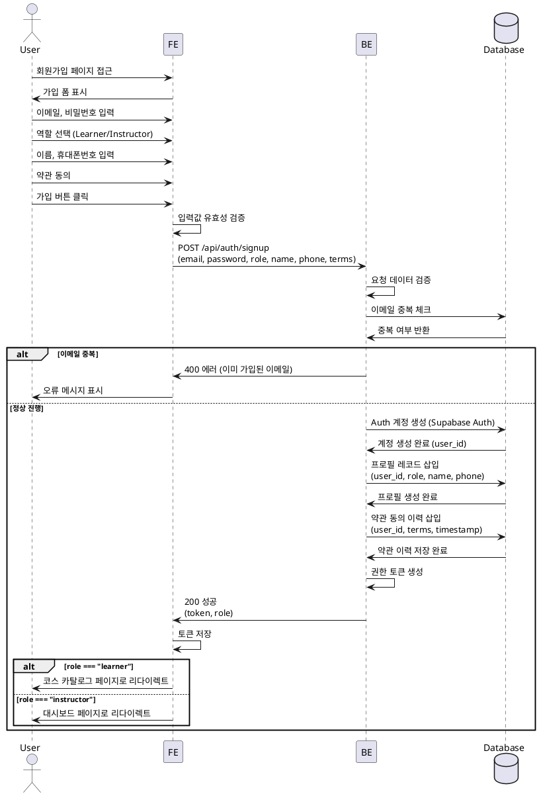

# 역할 선택 & 온보딩

## Primary Actor
- 신규 사용자 (미가입 상태)

## Precondition
- 사용자가 회원가입 페이지에 접근 가능
- 유효한 이메일과 비밀번호를 입력할 수 있음

## Trigger
- 사용자가 회원가입 페이지에서 가입 절차를 시작

## Main Scenario

1. 사용자가 이메일과 비밀번호를 입력
2. 사용자가 역할(Learner 또는 Instructor)을 선택
3. 사용자가 공통 프로필 정보(이름, 휴대폰번호) 입력
4. 사용자가 약관에 동의
5. 시스템이 입력값 유효성을 검증
6. 시스템이 Supabase Auth 계정을 생성
7. 시스템이 사용자 프로필 레코드 생성 (선택한 역할 포함)
8. 시스템이 약관 동의 이력을 저장
9. 시스템이 기본 권한 토큰을 발급
10. Learner는 코스 카탈로그 페이지로 이동
11. Instructor는 대시보드 페이지로 이동

## Edge Cases

### 이메일 중복
- 이미 존재하는 이메일로 가입 시도 시 "이미 가입된 이메일입니다" 오류 메시지 표시

### 비밀번호 규칙 위반
- 비밀번호가 최소 요구사항을 충족하지 않으면 "비밀번호는 8자 이상이어야 합니다" 등의 오류 메시지 표시

### 휴대폰번호 형식 오류
- 휴대폰번호가 올바른 형식이 아닐 경우 "유효한 휴대폰번호를 입력해주세요" 오류 메시지 표시

### 약관 미동의
- 필수 약관에 동의하지 않은 경우 가입 진행 불가, "필수 약관에 동의해주세요" 메시지 표시

### 네트워크 오류
- Auth 계정 생성 중 네트워크 오류 발생 시 "일시적인 오류가 발생했습니다. 다시 시도해주세요" 메시지 표시 및 재시도 옵션 제공

### DB 저장 실패
- 프로필 또는 약관 이력 저장 실패 시 트랜잭션 롤백 및 "회원가입 처리 중 오류가 발생했습니다" 메시지 표시

## Business Rules

1. 이메일은 유일해야 하며, 중복 가입 불가
2. 비밀번호는 최소 8자 이상이어야 함
3. 역할은 Learner 또는 Instructor 중 하나를 필수 선택
4. 이름과 휴대폰번호는 필수 입력 항목
5. 필수 약관(서비스 이용약관, 개인정보 처리방침)에 반드시 동의해야 함
6. 약관 동의 이력은 감사를 위해 영구 보관
7. 역할에 따라 초기 랜딩 페이지가 다름 (Learner: 코스 카탈로그, Instructor: 대시보드)
8. 토큰 발급은 가입 완료 시 자동으로 이루어지며, 이후 자동 로그인 처리

## Sequence Diagram

