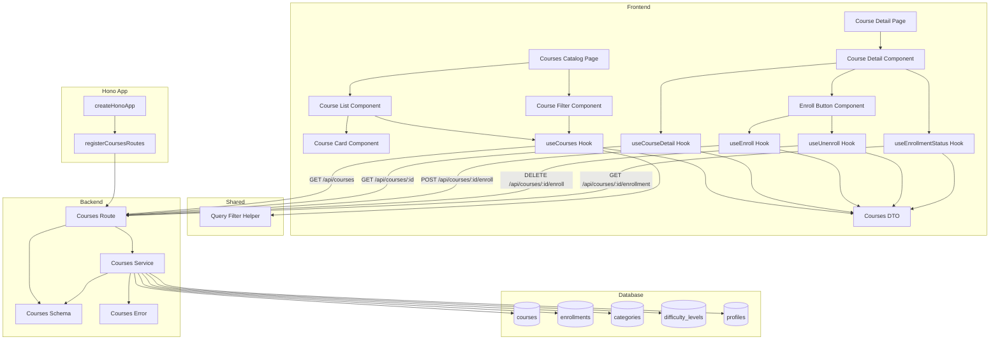

# 코스 탐색 & 수강신청/취소 구현 계획

## 개요

### Backend Modules

| 모듈 | 위치 | 설명 |
|------|------|------|
| Courses Route | `src/features/courses/backend/route.ts` | 코스 목록 조회, 코스 상세 조회, 수강신청/취소 API 엔드포인트 |
| Courses Service | `src/features/courses/backend/service.ts` | 코스 탐색, 수강신청/취소 비즈니스 로직 (Supabase 접근) |
| Courses Schema | `src/features/courses/backend/schema.ts` | 코스 목록/상세/수강신청 요청/응답 zod 스키마 정의 |
| Courses Error | `src/features/courses/backend/error.ts` | 코스 관련 에러 코드 정의 |

### Frontend Modules

| 모듈 | 위치 | 설명 |
|------|------|------|
| Courses Catalog Page | `src/app/courses/page.tsx` | 코스 카탈로그 페이지 |
| Course Detail Page | `src/app/courses/[courseId]/page.tsx` | 코스 상세 페이지 |
| Course List Component | `src/features/courses/components/course-list.tsx` | 코스 목록 표시 컴포넌트 |
| Course Card Component | `src/features/courses/components/course-card.tsx` | 개별 코스 카드 컴포넌트 |
| Course Filter Component | `src/features/courses/components/course-filter.tsx` | 검색/필터/정렬 UI 컴포넌트 |
| Course Detail Component | `src/features/courses/components/course-detail.tsx` | 코스 상세 정보 표시 컴포넌트 |
| Enroll Button Component | `src/features/courses/components/enroll-button.tsx` | 수강신청/취소 버튼 컴포넌트 |
| Courses DTO | `src/features/courses/lib/dto.ts` | 프론트엔드에서 사용할 스키마 재노출 |
| Courses Hooks | `src/features/courses/hooks/useCourses.ts` | 코스 목록 조회 React Query hook |
| Course Detail Hook | `src/features/courses/hooks/useCourseDetail.ts` | 코스 상세 조회 React Query hook |
| Enroll Hook | `src/features/courses/hooks/useEnroll.ts` | 수강신청 React Query mutation |
| Unenroll Hook | `src/features/courses/hooks/useUnenroll.ts` | 수강취소 React Query mutation |
| Enrollment Status Hook | `src/features/courses/hooks/useEnrollmentStatus.ts` | 수강 여부 확인 React Query hook |

### Shared Modules

| 모듈 | 위치 | 설명 |
|------|------|------|
| Query Helper | `src/lib/query/filter.ts` | 검색/필터/정렬 쿼리 빌더 유틸 (공통) |

---

## Diagram



---

## Implementation Plan

### 1. Backend Layer

#### 1.1 Courses Error

**File:** `src/features/courses/backend/error.ts`

**구현 내용:**
```typescript
export const coursesErrorCodes = {
  invalidRequest: 'COURSES_INVALID_REQUEST',
  courseNotFound: 'COURSES_NOT_FOUND',
  courseNotPublished: 'COURSES_NOT_PUBLISHED',
  alreadyEnrolled: 'COURSES_ALREADY_ENROLLED',
  notEnrolled: 'COURSES_NOT_ENROLLED',
  enrollmentFailed: 'COURSES_ENROLLMENT_FAILED',
  unenrollmentFailed: 'COURSES_UNENROLLMENT_FAILED',
  unauthorized: 'COURSES_UNAUTHORIZED',
} as const;

export type CoursesServiceError = (typeof coursesErrorCodes)[keyof typeof coursesErrorCodes];
```

---

#### 1.2 Courses Schema

**File:** `src/features/courses/backend/schema.ts`

**구현 내용:**
```typescript
// CourseListQuerySchema
- search?: string (optional)
- categoryId?: string (uuid, optional)
- difficultyId?: string (uuid, optional)
- sort?: 'latest' | 'popular' (default: 'latest')
- limit?: number (default: 20, max: 100)
- offset?: number (default: 0)

// CourseListResponseSchema
- courses: Array<{
    id: uuid
    title: string
    description: string
    instructor: { id: uuid, name: string }
    category: { id: uuid, name: string }
    difficulty: { id: uuid, name: string, level: number }
    enrollmentsCount: number
    status: 'published'
    createdAt: string (ISO)
  }>
- total: number
- limit: number
- offset: number

// CourseDetailResponseSchema
- id: uuid
- title: string
- description: string
- curriculum: string | null
- instructor: { id: uuid, name: string }
- category: { id: uuid, name: string }
- difficulty: { id: uuid, name: string, level: number }
- enrollmentsCount: number
- status: 'published'
- createdAt: string (ISO)
- updatedAt: string (ISO)

// EnrollResponseSchema
- enrolled: boolean
- courseId: uuid
- enrolledAt: string (ISO)

// EnrollmentStatusResponseSchema
- enrolled: boolean
- enrolledAt: string | null (ISO)
- cancelledAt: string | null (ISO)

// CourseRowSchema (DB 매핑용)
- id: uuid
- instructor_id: uuid
- category_id: uuid
- difficulty_id: uuid
- title: string
- description: string
- curriculum: string | null
- enrollments_count: number
- status: 'draft' | 'published' | 'archived'
- created_at: string
- updated_at: string
```

**Unit Test:**
```typescript
describe('CourseListQuerySchema', () => {
  it('should validate correct query params', () => {
    const valid = {
      search: 'React',
      categoryId: '123e4567-e89b-12d3-a456-426614174000',
      difficultyId: '123e4567-e89b-12d3-a456-426614174001',
      sort: 'popular',
      limit: 20,
      offset: 0,
    };
    expect(CourseListQuerySchema.safeParse(valid).success).toBe(true);
  });

  it('should use default values for optional fields', () => {
    const minimal = {};
    const result = CourseListQuerySchema.parse(minimal);
    expect(result.sort).toBe('latest');
    expect(result.limit).toBe(20);
    expect(result.offset).toBe(0);
  });

  it('should reject invalid sort value', () => {
    const invalid = { sort: 'invalid' };
    expect(CourseListQuerySchema.safeParse(invalid).success).toBe(false);
  });

  it('should reject limit exceeding max', () => {
    const invalid = { limit: 101 };
    expect(CourseListQuerySchema.safeParse(invalid).success).toBe(false);
  });
});
```

---

#### 1.3 Courses Service

**File:** `src/features/courses/backend/service.ts`

**구현 내용:**

##### 1.3.1 `getCourses` 함수
- 코스 목록 조회 (published 상태만)
- 검색어 필터링 (title, description ILIKE)
- 카테고리/난이도 필터링
- 정렬 (최신순/인기순)
- 페이지네이션 (limit, offset)
- JOIN으로 instructor, category, difficulty 정보 포함

##### 1.3.2 `getCourseDetail` 함수
- 특정 코스 상세 조회 (published 상태만)
- JOIN으로 instructor, category, difficulty 정보 포함
- 존재하지 않거나 published가 아니면 에러 반환

##### 1.3.3 `enrollCourse` 함수
- 수강신청 처리
- 검증:
  1. 코스 존재 여부
  2. 코스 상태 (published만 허용)
  3. 중복 수강 여부 (enrollments 테이블 조회)
- 트랜잭션:
  1. enrollments 레코드 생성
  2. courses.enrollments_count +1 업데이트
- 에러 처리: 중복 신청, 코스 미존재, 상태 불일치

##### 1.3.4 `unenrollCourse` 함수
- 수강취소 처리
- 검증:
  1. 수강 여부 확인 (enrollments 조회)
  2. 이미 취소되었는지 확인 (cancelled_at IS NULL)
- 트랜잭션:
  1. enrollments.cancelled_at 업데이트
  2. courses.enrollments_count -1 업데이트
- 에러 처리: 수강 중이 아님, 이미 취소됨

##### 1.3.5 `getEnrollmentStatus` 함수
- 특정 코스의 수강 여부 조회
- enrollments 테이블 조회 (learner_id, course_id)
- enrolled, enrolledAt, cancelledAt 반환

**Unit Test:**
```typescript
describe('getCourses', () => {
  it('should return published courses with default sorting', async () => {
    const result = await getCourses(mockSupabaseClient, {
      sort: 'latest',
      limit: 20,
      offset: 0,
    });

    expect(result.ok).toBe(true);
    expect(result.data.courses).toHaveLength(10);
    expect(result.data.courses[0].status).toBe('published');
  });

  it('should filter by search query', async () => {
    const result = await getCourses(mockSupabaseClient, {
      search: 'React',
      sort: 'latest',
      limit: 20,
      offset: 0,
    });

    expect(result.ok).toBe(true);
    expect(result.data.courses[0].title).toContain('React');
  });

  it('should sort by enrollments_count (popular)', async () => {
    const result = await getCourses(mockSupabaseClient, {
      sort: 'popular',
      limit: 20,
      offset: 0,
    });

    expect(result.ok).toBe(true);
    expect(result.data.courses[0].enrollmentsCount).toBeGreaterThanOrEqual(
      result.data.courses[1].enrollmentsCount
    );
  });
});

describe('getCourseDetail', () => {
  it('should return course detail for published course', async () => {
    const result = await getCourseDetail(mockSupabaseClient, 'course-id');

    expect(result.ok).toBe(true);
    expect(result.data.id).toBe('course-id');
    expect(result.data.status).toBe('published');
  });

  it('should return error when course not found', async () => {
    mockSupabaseClient.from.mockReturnValue({
      select: jest.fn().mockReturnValue({
        eq: jest.fn().mockReturnValue({
          single: jest.fn().mockResolvedValue({ data: null, error: null }),
        }),
      }),
    });

    const result = await getCourseDetail(mockSupabaseClient, 'invalid-id');

    expect(result.ok).toBe(false);
    expect(result.error.code).toBe('COURSES_NOT_FOUND');
  });

  it('should return error when course is not published', async () => {
    mockSupabaseClient.from.mockReturnValue({
      select: jest.fn().mockReturnValue({
        eq: jest.fn().mockReturnValue({
          single: jest.fn().mockResolvedValue({
            data: { status: 'draft' },
            error: null,
          }),
        }),
      }),
    });

    const result = await getCourseDetail(mockSupabaseClient, 'draft-course-id');

    expect(result.ok).toBe(false);
    expect(result.error.code).toBe('COURSES_NOT_PUBLISHED');
  });
});

describe('enrollCourse', () => {
  it('should enroll learner to course', async () => {
    const result = await enrollCourse(
      mockSupabaseClient,
      'learner-id',
      'course-id'
    );

    expect(result.ok).toBe(true);
    expect(result.data.enrolled).toBe(true);
    expect(result.data.courseId).toBe('course-id');
  });

  it('should return error when already enrolled', async () => {
    mockSupabaseClient.from.mockReturnValue({
      select: jest.fn().mockReturnValue({
        eq: jest.fn().mockReturnValue({
          eq: jest.fn().mockReturnValue({
            maybeSingle: jest.fn().mockResolvedValue({
              data: { id: 'enrollment-id' },
              error: null,
            }),
          }),
        }),
      }),
    });

    const result = await enrollCourse(
      mockSupabaseClient,
      'learner-id',
      'course-id'
    );

    expect(result.ok).toBe(false);
    expect(result.error.code).toBe('COURSES_ALREADY_ENROLLED');
  });

  it('should return error when course is not published', async () => {
    mockSupabaseClient.from.mockReturnValue({
      select: jest.fn().mockReturnValue({
        eq: jest.fn().mockReturnValue({
          single: jest.fn().mockResolvedValue({
            data: { status: 'archived' },
            error: null,
          }),
        }),
      }),
    });

    const result = await enrollCourse(
      mockSupabaseClient,
      'learner-id',
      'archived-course-id'
    );

    expect(result.ok).toBe(false);
    expect(result.error.code).toBe('COURSES_NOT_PUBLISHED');
  });

  it('should increment enrollments_count', async () => {
    const mockUpdate = jest.fn().mockResolvedValue({ error: null });
    mockSupabaseClient.from.mockReturnValue({
      update: jest.fn().mockReturnValue({
        eq: jest.fn().mockReturnValue({ mockUpdate }),
      }),
    });

    await enrollCourse(mockSupabaseClient, 'learner-id', 'course-id');

    expect(mockUpdate).toHaveBeenCalled();
  });
});

describe('unenrollCourse', () => {
  it('should unenroll learner from course', async () => {
    const result = await unenrollCourse(
      mockSupabaseClient,
      'learner-id',
      'course-id'
    );

    expect(result.ok).toBe(true);
  });

  it('should return error when not enrolled', async () => {
    mockSupabaseClient.from.mockReturnValue({
      select: jest.fn().mockReturnValue({
        eq: jest.fn().mockReturnValue({
          eq: jest.fn().mockReturnValue({
            is: jest.fn().mockReturnValue({
              maybeSingle: jest.fn().mockResolvedValue({
                data: null,
                error: null,
              }),
            }),
          }),
        }),
      }),
    });

    const result = await unenrollCourse(
      mockSupabaseClient,
      'learner-id',
      'course-id'
    );

    expect(result.ok).toBe(false);
    expect(result.error.code).toBe('COURSES_NOT_ENROLLED');
  });

  it('should decrement enrollments_count', async () => {
    const mockUpdate = jest.fn().mockResolvedValue({ error: null });
    mockSupabaseClient.from.mockReturnValue({
      update: jest.fn().mockReturnValue({
        eq: jest.fn().mockReturnValue({ mockUpdate }),
      }),
    });

    await unenrollCourse(mockSupabaseClient, 'learner-id', 'course-id');

    expect(mockUpdate).toHaveBeenCalled();
  });
});

describe('getEnrollmentStatus', () => {
  it('should return enrolled status', async () => {
    const result = await getEnrollmentStatus(
      mockSupabaseClient,
      'learner-id',
      'course-id'
    );

    expect(result.ok).toBe(true);
    expect(result.data.enrolled).toBe(true);
  });

  it('should return not enrolled when no record found', async () => {
    mockSupabaseClient.from.mockReturnValue({
      select: jest.fn().mockReturnValue({
        eq: jest.fn().mockReturnValue({
          eq: jest.fn().mockReturnValue({
            maybeSingle: jest.fn().mockResolvedValue({
              data: null,
              error: null,
            }),
          }),
        }),
      }),
    });

    const result = await getEnrollmentStatus(
      mockSupabaseClient,
      'learner-id',
      'course-id'
    );

    expect(result.ok).toBe(true);
    expect(result.data.enrolled).toBe(false);
  });
});
```

---

#### 1.4 Courses Route

**File:** `src/features/courses/backend/route.ts`

**구현 내용:**
- `GET /courses` 엔드포인트: 코스 목록 조회
- `GET /courses/:id` 엔드포인트: 코스 상세 조회
- `POST /courses/:id/enroll` 엔드포인트: 수강신청
- `DELETE /courses/:id/enroll` 엔드포인트: 수강취소
- `GET /courses/:id/enrollment` 엔드포인트: 수강 여부 확인
- 쿼리 파라미터 파싱 (`CourseListQuerySchema`)
- `getCourses`, `getCourseDetail`, `enrollCourse`, `unenrollCourse`, `getEnrollmentStatus` 서비스 호출
- 성공/실패 응답 반환 (`respond` 헬퍼 사용)

**Integration Test:**
```typescript
describe('GET /api/courses', () => {
  it('should return 200 with course list', async () => {
    const response = await request(app).get('/api/courses');

    expect(response.status).toBe(200);
    expect(response.body.courses).toBeDefined();
    expect(response.body.total).toBeGreaterThanOrEqual(0);
  });

  it('should filter by category', async () => {
    const response = await request(app).get(
      '/api/courses?categoryId=123e4567-e89b-12d3-a456-426614174000'
    );

    expect(response.status).toBe(200);
    expect(response.body.courses[0].category.id).toBe(
      '123e4567-e89b-12d3-a456-426614174000'
    );
  });

  it('should sort by popularity', async () => {
    const response = await request(app).get('/api/courses?sort=popular');

    expect(response.status).toBe(200);
    expect(response.body.courses[0].enrollmentsCount).toBeGreaterThanOrEqual(
      response.body.courses[1].enrollmentsCount
    );
  });
});

describe('GET /api/courses/:id', () => {
  it('should return 200 with course detail', async () => {
    const response = await request(app).get('/api/courses/course-id');

    expect(response.status).toBe(200);
    expect(response.body.id).toBe('course-id');
  });

  it('should return 404 when course not found', async () => {
    const response = await request(app).get('/api/courses/invalid-id');

    expect(response.status).toBe(404);
    expect(response.body.error.code).toBe('COURSES_NOT_FOUND');
  });
});

describe('POST /api/courses/:id/enroll', () => {
  it('should return 201 on successful enrollment', async () => {
    const response = await request(app)
      .post('/api/courses/course-id/enroll')
      .set('Authorization', 'Bearer learner-token');

    expect(response.status).toBe(201);
    expect(response.body.enrolled).toBe(true);
  });

  it('should return 409 when already enrolled', async () => {
    await request(app)
      .post('/api/courses/course-id/enroll')
      .set('Authorization', 'Bearer learner-token');

    const response = await request(app)
      .post('/api/courses/course-id/enroll')
      .set('Authorization', 'Bearer learner-token');

    expect(response.status).toBe(409);
    expect(response.body.error.code).toBe('COURSES_ALREADY_ENROLLED');
  });

  it('should return 400 when course is not published', async () => {
    const response = await request(app)
      .post('/api/courses/draft-course-id/enroll')
      .set('Authorization', 'Bearer learner-token');

    expect(response.status).toBe(400);
    expect(response.body.error.code).toBe('COURSES_NOT_PUBLISHED');
  });
});

describe('DELETE /api/courses/:id/enroll', () => {
  it('should return 200 on successful unenrollment', async () => {
    await request(app)
      .post('/api/courses/course-id/enroll')
      .set('Authorization', 'Bearer learner-token');

    const response = await request(app)
      .delete('/api/courses/course-id/enroll')
      .set('Authorization', 'Bearer learner-token');

    expect(response.status).toBe(200);
  });

  it('should return 400 when not enrolled', async () => {
    const response = await request(app)
      .delete('/api/courses/course-id/enroll')
      .set('Authorization', 'Bearer learner-token');

    expect(response.status).toBe(400);
    expect(response.body.error.code).toBe('COURSES_NOT_ENROLLED');
  });
});

describe('GET /api/courses/:id/enrollment', () => {
  it('should return enrollment status', async () => {
    const response = await request(app)
      .get('/api/courses/course-id/enrollment')
      .set('Authorization', 'Bearer learner-token');

    expect(response.status).toBe(200);
    expect(response.body.enrolled).toBeDefined();
  });
});
```

---

#### 1.5 Register Courses Routes in Hono App

**File:** `src/backend/hono/app.ts`

**구현 내용:**
```typescript
import { registerCoursesRoutes } from '@/features/courses/backend/route';

export const createHonoApp = () => {
  // ... existing code

  registerAuthRoutes(app);
  registerCoursesRoutes(app);
  registerExampleRoutes(app);

  // ... rest
};
```

---

### 2. Shared Layer

#### 2.1 Query Filter Helper

**File:** `src/lib/query/filter.ts`

**구현 내용:**
```typescript
type FilterConfig = {
  search?: string;
  searchFields?: string[];
  filters?: Record<string, any>;
  sort?: string;
  sortMap?: Record<string, string>;
  limit?: number;
  offset?: number;
};

export const buildQuery = (
  baseQuery: PostgrestFilterBuilder,
  config: FilterConfig
) => {
  let query = baseQuery;

  // Search
  if (config.search && config.searchFields) {
    const searchConditions = config.searchFields
      .map((field) => `${field}.ilike.%${config.search}%`)
      .join(',');
    query = query.or(searchConditions);
  }

  // Filters
  if (config.filters) {
    Object.entries(config.filters).forEach(([key, value]) => {
      if (value !== undefined && value !== null) {
        query = query.eq(key, value);
      }
    });
  }

  // Sort
  if (config.sort && config.sortMap) {
    const sortColumn = config.sortMap[config.sort];
    if (sortColumn) {
      query = query.order(sortColumn);
    }
  }

  // Pagination
  if (config.limit !== undefined) {
    query = query.limit(config.limit);
  }
  if (config.offset !== undefined) {
    query = query.range(config.offset, config.offset + (config.limit || 10) - 1);
  }

  return query;
};
```

**Unit Test:**
```typescript
describe('buildQuery', () => {
  it('should apply search filter', () => {
    const mockQuery = { or: jest.fn() };
    buildQuery(mockQuery as any, {
      search: 'React',
      searchFields: ['title', 'description'],
    });

    expect(mockQuery.or).toHaveBeenCalledWith(
      'title.ilike.%React%,description.ilike.%React%'
    );
  });

  it('should apply filters', () => {
    const mockQuery = { eq: jest.fn().mockReturnThis() };
    buildQuery(mockQuery as any, {
      filters: { category_id: 'cat-id', difficulty_id: 'diff-id' },
    });

    expect(mockQuery.eq).toHaveBeenCalledWith('category_id', 'cat-id');
    expect(mockQuery.eq).toHaveBeenCalledWith('difficulty_id', 'diff-id');
  });

  it('should apply sort', () => {
    const mockQuery = { order: jest.fn() };
    buildQuery(mockQuery as any, {
      sort: 'popular',
      sortMap: { popular: 'enrollments_count.desc' },
    });

    expect(mockQuery.order).toHaveBeenCalledWith('enrollments_count.desc');
  });
});
```

---

### 3. Frontend Layer

#### 3.1 Courses DTO

**File:** `src/features/courses/lib/dto.ts`

**구현 내용:**
```typescript
export {
  CourseListQuerySchema,
  CourseListResponseSchema,
  CourseDetailResponseSchema,
  EnrollResponseSchema,
  EnrollmentStatusResponseSchema,
  type CourseListQuery,
  type CourseListResponse,
  type CourseDetailResponse,
  type EnrollResponse,
  type EnrollmentStatusResponse,
} from '@/features/courses/backend/schema';
```

---

#### 3.2 Courses Hooks

**File:** `src/features/courses/hooks/useCourses.ts`

**구현 내용:**
```typescript
'use client';

import { useQuery } from '@tanstack/react-query';
import { apiClient, extractApiErrorMessage } from '@/lib/remote/api-client';
import {
  CourseListQuerySchema,
  CourseListResponseSchema,
  type CourseListQuery,
  type CourseListResponse,
} from '../lib/dto';

const fetchCourses = async (
  params: CourseListQuery
): Promise<CourseListResponse> => {
  try {
    const validated = CourseListQuerySchema.parse(params);
    const { data } = await apiClient.get('/api/courses', { params: validated });
    return CourseListResponseSchema.parse(data);
  } catch (error) {
    const message = extractApiErrorMessage(error, '코스 목록을 불러오지 못했습니다.');
    throw new Error(message);
  }
};

export const useCourses = (params: CourseListQuery) =>
  useQuery({
    queryKey: ['courses', params],
    queryFn: () => fetchCourses(params),
    staleTime: 60 * 1000,
  });
```

---

**File:** `src/features/courses/hooks/useCourseDetail.ts`

**구현 내용:**
```typescript
'use client';

import { useQuery } from '@tanstack/react-query';
import { apiClient, extractApiErrorMessage } from '@/lib/remote/api-client';
import {
  CourseDetailResponseSchema,
  type CourseDetailResponse,
} from '../lib/dto';

const fetchCourseDetail = async (
  courseId: string
): Promise<CourseDetailResponse> => {
  try {
    const { data } = await apiClient.get(`/api/courses/${courseId}`);
    return CourseDetailResponseSchema.parse(data);
  } catch (error) {
    const message = extractApiErrorMessage(error, '코스 정보를 불러오지 못했습니다.');
    throw new Error(message);
  }
};

export const useCourseDetail = (courseId: string) =>
  useQuery({
    queryKey: ['course', courseId],
    queryFn: () => fetchCourseDetail(courseId),
    enabled: Boolean(courseId),
    staleTime: 60 * 1000,
  });
```

---

**File:** `src/features/courses/hooks/useEnroll.ts`

**구현 내용:**
```typescript
'use client';

import { useMutation, useQueryClient } from '@tanstack/react-query';
import { apiClient, extractApiErrorMessage } from '@/lib/remote/api-client';
import { EnrollResponseSchema, type EnrollResponse } from '../lib/dto';

const enrollCourse = async (courseId: string): Promise<EnrollResponse> => {
  try {
    const { data } = await apiClient.post(`/api/courses/${courseId}/enroll`);
    return EnrollResponseSchema.parse(data);
  } catch (error) {
    const message = extractApiErrorMessage(error, '수강신청에 실패했습니다.');
    throw new Error(message);
  }
};

export const useEnroll = () => {
  const queryClient = useQueryClient();

  return useMutation({
    mutationFn: enrollCourse,
    onSuccess: (data) => {
      queryClient.invalidateQueries({ queryKey: ['course', data.courseId] });
      queryClient.invalidateQueries({ queryKey: ['courses'] });
      queryClient.invalidateQueries({ queryKey: ['enrollment', data.courseId] });
    },
  });
};
```

---

**File:** `src/features/courses/hooks/useUnenroll.ts`

**구현 내용:**
```typescript
'use client';

import { useMutation, useQueryClient } from '@tanstack/react-query';
import { apiClient, extractApiErrorMessage } from '@/lib/remote/api-client';

const unenrollCourse = async (courseId: string): Promise<void> => {
  try {
    await apiClient.delete(`/api/courses/${courseId}/enroll`);
  } catch (error) {
    const message = extractApiErrorMessage(error, '수강취소에 실패했습니다.');
    throw new Error(message);
  }
};

export const useUnenroll = () => {
  const queryClient = useQueryClient();

  return useMutation({
    mutationFn: unenrollCourse,
    onSuccess: (_, courseId) => {
      queryClient.invalidateQueries({ queryKey: ['course', courseId] });
      queryClient.invalidateQueries({ queryKey: ['courses'] });
      queryClient.invalidateQueries({ queryKey: ['enrollment', courseId] });
    },
  });
};
```

---

**File:** `src/features/courses/hooks/useEnrollmentStatus.ts`

**구현 내용:**
```typescript
'use client';

import { useQuery } from '@tanstack/react-query';
import { apiClient, extractApiErrorMessage } from '@/lib/remote/api-client';
import {
  EnrollmentStatusResponseSchema,
  type EnrollmentStatusResponse,
} from '../lib/dto';

const fetchEnrollmentStatus = async (
  courseId: string
): Promise<EnrollmentStatusResponse> => {
  try {
    const { data } = await apiClient.get(`/api/courses/${courseId}/enrollment`);
    return EnrollmentStatusResponseSchema.parse(data);
  } catch (error) {
    const message = extractApiErrorMessage(
      error,
      '수강 여부를 확인하지 못했습니다.'
    );
    throw new Error(message);
  }
};

export const useEnrollmentStatus = (courseId: string) =>
  useQuery({
    queryKey: ['enrollment', courseId],
    queryFn: () => fetchEnrollmentStatus(courseId),
    enabled: Boolean(courseId),
    staleTime: 30 * 1000,
  });
```

---

#### 3.3 Course Filter Component

**File:** `src/features/courses/components/course-filter.tsx`

**구현 내용:**
- 검색어 입력 필드
- 카테고리 선택 드롭다운 (카테고리 목록은 별도 API 또는 하드코딩)
- 난이도 선택 드롭다운 (난이도 목록은 별도 API 또는 하드코딩)
- 정렬 선택 (최신순/인기순)
- 필터 변경 시 `useCourses` 훅 파라미터 업데이트

**QA Sheet:**
| 시나리오 | 입력 | 예상 결과 |
|---------|------|----------|
| 검색어 입력 | "React" 입력 | "React" 포함 코스만 표시 |
| 카테고리 선택 | "프로그래밍" 선택 | 해당 카테고리 코스만 표시 |
| 난이도 선택 | "초급" 선택 | 초급 코스만 표시 |
| 정렬 변경 | "인기순" 선택 | 수강생 수 내림차순 정렬 |
| 필터 초기화 | "초기화" 버튼 클릭 | 모든 필터 제거, 전체 코스 표시 |

---

#### 3.4 Course Card Component

**File:** `src/features/courses/components/course-card.tsx`

**구현 내용:**
- 코스 제목, 설명 (truncate)
- 강사 이름
- 카테고리, 난이도 뱃지
- 수강생 수
- 클릭 시 코스 상세 페이지로 이동

**QA Sheet:**
| 시나리오 | 입력 | 예상 결과 |
|---------|------|----------|
| 코스 카드 클릭 | 카드 클릭 | `/courses/[courseId]` 페이지로 이동 |
| 긴 설명 표시 | 설명이 100자 이상 | "..." 으로 truncate |

---

#### 3.5 Course List Component

**File:** `src/features/courses/components/course-list.tsx`

**구현 내용:**
- `useCourses` 훅 사용하여 코스 목록 조회
- 로딩 상태 표시 (스켈레톤 또는 스피너)
- 에러 상태 표시
- CourseCard 컴포넌트 렌더링 (Grid 레이아웃)
- 페이지네이션 (Load More 또는 페이지 번호)

**QA Sheet:**
| 시나리오 | 입력 | 예상 결과 |
|---------|------|----------|
| 정상 로딩 | 페이지 접근 | 코스 카드 목록 표시 |
| 로딩 중 | 데이터 로딩 중 | 스켈레톤/스피너 표시 |
| 네트워크 오류 | 네트워크 끊김 | 에러 메시지 표시, 재시도 버튼 |
| 빈 목록 | 검색 결과 없음 | "코스가 없습니다" 메시지 표시 |

---

#### 3.6 Enroll Button Component

**File:** `src/features/courses/components/enroll-button.tsx`

**구현 내용:**
- `useEnrollmentStatus` 훅으로 수강 여부 확인
- 수강 중이면 "수강취소" 버튼, 아니면 "수강신청" 버튼
- `useEnroll`, `useUnenroll` mutation 훅 사용
- 로딩 중 버튼 비활성화
- 성공/실패 메시지 표시 (toast 또는 inline)
- 수강취소 시 확인 다이얼로그 표시

**QA Sheet:**
| 시나리오 | 입력 | 예상 결과 |
|---------|------|----------|
| 수강신청 | "수강신청" 버튼 클릭 | 수강신청 성공, "수강취소" 버튼으로 변경 |
| 수강취소 | "수강취소" 버튼 클릭 | 확인 다이얼로그 표시 |
| 수강취소 확인 | 다이얼로그에서 "확인" 클릭 | 수강취소 성공, "수강신청" 버튼으로 변경 |
| 중복 신청 시도 | 이미 수강 중인 코스에 신청 | "이미 수강 중입니다" 오류 표시 |
| 로딩 중 | 요청 진행 중 | 버튼 비활성화, "처리 중..." 표시 |
| 네트워크 오류 | 네트워크 끊김 | 에러 메시지 표시 |

---

#### 3.7 Course Detail Component

**File:** `src/features/courses/components/course-detail.tsx`

**구현 내용:**
- `useCourseDetail` 훅 사용하여 코스 상세 조회
- 코스 제목, 설명, 커리큘럼, 강사 정보, 카테고리, 난이도, 수강생 수 표시
- EnrollButton 컴포넌트 포함
- 로딩/에러 상태 처리

**QA Sheet:**
| 시나리오 | 입력 | 예상 결과 |
|---------|------|----------|
| 정상 로딩 | 코스 상세 페이지 접근 | 코스 정보 표시 |
| 로딩 중 | 데이터 로딩 중 | 스켈레톤 표시 |
| 코스 미존재 | 존재하지 않는 코스 ID | "코스를 찾을 수 없습니다" 메시지, 카탈로그로 리다이렉트 |
| 네트워크 오류 | 네트워크 끊김 | 에러 메시지 표시, 재시도 버튼 |

---

#### 3.8 Courses Catalog Page

**File:** `src/app/courses/page.tsx`

**구현 내용:**
- CourseFilter 컴포넌트 포함
- CourseList 컴포넌트 포함
- 레이아웃 (헤더, 사이드바 필터, 메인 리스트)
- SEO 메타데이터

**QA Sheet:**
| 시나리오 | 입력 | 예상 결과 |
|---------|------|----------|
| 페이지 접근 | `/courses` 접근 | 코스 카탈로그 페이지 표시 |
| 로그인 상태 확인 | 비로그인 상태 | 코스 목록은 보이지만 수강신청 시 로그인 필요 메시지 |

---

#### 3.9 Course Detail Page

**File:** `src/app/courses/[courseId]/page.tsx`

**구현 내용:**
- CourseDetail 컴포넌트 포함
- 동적 라우트 파라미터 (`courseId`) 처리
- SEO 메타데이터 (코스 제목, 설명)

**QA Sheet:**
| 시나리오 | 입력 | 예상 결과 |
|---------|------|----------|
| 페이지 접근 | `/courses/[courseId]` 접근 | 코스 상세 페이지 표시 |
| 존재하지 않는 코스 | 잘못된 ID로 접근 | 404 페이지 또는 카탈로그로 리다이렉트 |

---

### 4. Integration & E2E Testing

#### 4.1 Full Flow Test

**시나리오:**
1. 코스 카탈로그 페이지 접근
2. 검색어 입력 (예: "React")
3. 정렬 변경 (인기순)
4. 코스 카드 클릭
5. 코스 상세 페이지 이동
6. 수강신청 버튼 클릭
7. DB 확인: `enrollments` 레코드 생성, `courses.enrollments_count` 증가
8. 버튼이 "수강취소"로 변경
9. 수강취소 버튼 클릭
10. 확인 다이얼로그에서 "확인" 클릭
11. DB 확인: `enrollments.cancelled_at` 업데이트, `courses.enrollments_count` 감소
12. 버튼이 "수강신청"으로 변경

**수동 QA:**
- 브라우저에서 실제 플로우 테스트
- 개발자 도구 네트워크 탭에서 API 요청/응답 확인
- Supabase 대시보드에서 데이터 생성/업데이트 확인

---

## Implementation Order

1. **Shared**: Query Filter Helper 구현 및 테스트
2. **Backend Error**: `courses/backend/error.ts` 구현
3. **Backend Schema**: `courses/backend/schema.ts` 구현 및 테스트
4. **Backend Service**: `courses/backend/service.ts` 구현 및 테스트
   - `getCourses` 구현
   - `getCourseDetail` 구현
   - `enrollCourse` 구현
   - `unenrollCourse` 구현
   - `getEnrollmentStatus` 구현
5. **Backend Route**: `courses/backend/route.ts` 구현 및 테스트
6. **Backend Integration**: Hono App에 라우터 등록
7. **Frontend DTO**: `courses/lib/dto.ts` 재노출
8. **Frontend Hooks**: Courses 관련 훅 구현
   - `useCourses`
   - `useCourseDetail`
   - `useEnroll`
   - `useUnenroll`
   - `useEnrollmentStatus`
9. **Frontend Components**: 컴포넌트 구현
   - `CourseCard`
   - `CourseFilter`
   - `CourseList`
   - `EnrollButton`
   - `CourseDetail`
10. **Frontend Pages**: 페이지 구현
    - Courses Catalog Page
    - Course Detail Page
11. **Integration Test**: Full flow 수동 QA

---

## Notes

- **인증**: 수강신청/취소는 로그인된 사용자만 가능. JWT 토큰 또는 세션 기반 인증 필요. 현재는 미들웨어로 사용자 ID를 추출하는 것으로 가정.
- **트랜잭션**: `enrollCourse`, `unenrollCourse`에서 `enrollments` 레코드 생성/업데이트와 `courses.enrollments_count` 업데이트는 트랜잭션으로 처리. Supabase는 기본적으로 단일 쿼리만 트랜잭션으로 처리하므로, RPC 함수 사용 고려.
- **동시성**: 동일 사용자가 짧은 시간 내에 중복 클릭 시 첫 번째 요청만 처리. 프론트엔드에서 버튼 비활성화로 대응.
- **에러 처리**: 모든 API 호출에서 에러 메시지를 사용자에게 표시. Toast 라이브러리 사용 권장.
- **페이지네이션**: 초기 구현에서는 Load More 방식으로 구현. 추후 페이지 번호 방식으로 변경 가능.
- **카테고리/난이도 목록**: 초기 구현에서는 하드코딩. 추후 별도 API로 분리.
- **검색 최적화**: 현재는 ILIKE 사용. 추후 Full-Text Search 또는 검색 인덱스 구현 고려.
