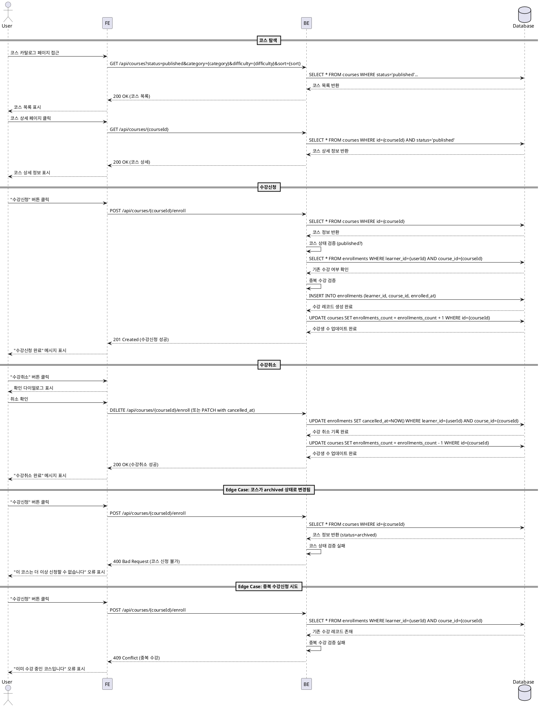

# 코스 탐색 & 수강신청/취소 (Learner) - Use Case Specification

## Primary Actor

**Learner** (학습자)

---

## Precondition

- 사용자가 Learner 역할로 로그인되어 있다.
- 코스 카탈로그 페이지에 접근할 수 있다.

---

## Trigger

- 학습자가 코스 카탈로그 페이지에 접근한다.
- 학습자가 검색어를 입력하거나 필터(카테고리, 난이도)를 적용한다.
- 학습자가 코스 상세 페이지에서 "수강신청" 또는 "수강취소" 버튼을 클릭한다.

---

## Main Scenario

### UC-002-1: 코스 탐색

1. 학습자가 코스 카탈로그 페이지(`/courses`)에 접근한다.
2. 시스템은 `published` 상태의 코스 목록을 표시한다.
3. 학습자는 검색어를 입력하거나 필터(카테고리, 난이도)를 선택한다.
4. 학습자는 정렬 기준(최신순/인기순)을 선택한다.
5. 시스템은 필터링된 코스 목록을 표시한다.
6. 학습자가 특정 코스를 클릭하면 코스 상세 페이지(`/courses/[courseId]`)로 이동한다.

### UC-002-2: 수강신청

1. 학습자가 코스 상세 페이지에서 "수강신청" 버튼을 클릭한다.
2. 시스템은 다음을 검증한다:
   - 코스 상태가 `published`인지 확인
   - 해당 학습자가 이미 수강 중인지 확인 (중복 신청 불가)
3. 검증 통과 시, 시스템은 `enrollments` 테이블에 새 레코드를 생성한다.
4. 시스템은 해당 코스의 `enrollments_count`를 1 증가시킨다.
5. 시스템은 "수강신청 완료" 메시지를 표시하고, 버튼을 "수강취소"로 변경한다.
6. 학습자 대시보드에 해당 코스가 추가된다.

### UC-002-3: 수강취소

1. 학습자가 코스 상세 페이지 또는 대시보드에서 "수강취소" 버튼을 클릭한다.
2. 시스템은 확인 다이얼로그를 표시한다.
3. 학습자가 취소를 확인하면, 시스템은 `enrollments` 테이블에서 `cancelled_at` 타임스탬프를 기록한다.
4. 시스템은 해당 코스의 `enrollments_count`를 1 감소시킨다.
5. 시스템은 "수강취소 완료" 메시지를 표시하고, 버튼을 "수강신청"으로 변경한다.
6. 학습자 대시보드에서 해당 코스가 제거되고, 성적 집계에서 제외된다.

---

## Edge Cases

### E1. 코스가 `archived` 상태로 변경된 경우
- **조건**: 학습자가 수강신청 버튼을 클릭하는 시점에 코스 상태가 `published`에서 `archived`로 변경됨
- **처리**: "이 코스는 더 이상 신청할 수 없습니다" 오류 메시지를 표시하고, 버튼을 비활성화한다.

### E2. 중복 수강신청 시도
- **조건**: 학습자가 이미 수강 중인 코스에 다시 수강신청을 시도함
- **처리**: "이미 수강 중인 코스입니다" 오류 메시지를 표시하고, 수강신청을 차단한다.

### E3. 네트워크 오류 또는 서버 오류
- **조건**: 수강신청/취소 요청 중 네트워크 또는 서버 오류 발생
- **처리**: "일시적인 오류가 발생했습니다. 다시 시도해주세요" 오류 메시지를 표시하고, 재시도 버튼을 제공한다.

### E4. 동시성 문제 (Race Condition)
- **조건**: 동일 사용자가 짧은 시간 내에 수강신청 버튼을 여러 번 클릭함
- **처리**: 첫 번째 요청만 처리하고, 이후 요청은 무시한다. 버튼을 로딩 상태로 비활성화하여 중복 클릭을 방지한다.

### E5. 코스 삭제됨
- **조건**: 학습자가 코스 상세 페이지를 보는 중 해당 코스가 삭제됨
- **처리**: "코스를 찾을 수 없습니다" 오류 메시지를 표시하고, 코스 카탈로그 페이지로 리다이렉트한다.

---

## Business Rules

### BR-002-1: 코스 공개 정책
- `published` 상태의 코스만 학습자에게 표시된다.
- `draft` 상태의 코스는 강사에게만 표시된다.
- `archived` 상태의 코스는 신규 수강신청이 불가능하다.

### BR-002-2: 수강신청 중복 방지
- 학습자는 동일 코스에 대해 중복 수강신청할 수 없다.
- `enrollments` 테이블의 `UNIQUE(learner_id, course_id)` 제약으로 보장된다.
- 수강취소 후 재신청은 가능하다 (새로운 `enrollments` 레코드 생성).

### BR-002-3: 수강생 수 카운트
- `courses.enrollments_count`는 현재 활성 수강생 수를 나타낸다.
- 수강신청 시 +1, 수강취소 시 -1 업데이트된다.
- 이 값은 인기순 정렬의 기준으로 사용된다.

### BR-002-4: 수강취소 정책
- 수강취소 시 `enrollments.cancelled_at` 타임스탬프가 기록된다.
- 수강취소된 코스는 학습자 대시보드에서 제거된다.
- 수강취소된 코스의 과제 및 성적은 집계에서 제외된다.

### BR-002-5: 검색 및 필터링
- 검색어는 코스 제목(`title`)과 설명(`description`)에서 검색된다.
- 카테고리 필터는 `courses.category_id`를 기준으로 적용된다.
- 난이도 필터는 `courses.difficulty_id`를 기준으로 적용된다.
- 정렬 기준:
  - **최신순**: `courses.created_at DESC`
  - **인기순**: `courses.enrollments_count DESC`

---

## Sequence Diagram

