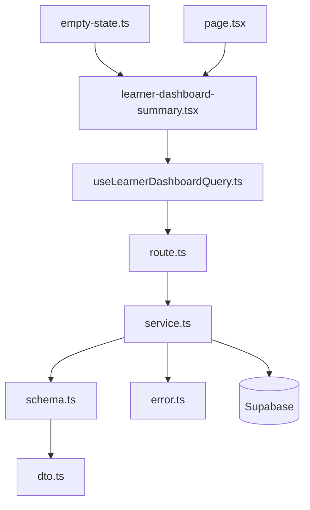

# Learner 대시보드 모듈화 설계

## 개요
- LearnerDashboardRoute (`src/features/dashboard/backend/route.ts`): Hono 라우터로 `/dashboard/learner` 엔드포인트를 노출하며 서비스 결과를 HTTP 응답으로 변환.
- LearnerDashboardService (`src/features/dashboard/backend/service.ts`): Supabase 질의와 비즈니스 규칙(진행률, 마감 임박, 최근 피드백)을 계산.
- LearnerDashboardSchema (`src/features/dashboard/backend/schema.ts`): 요청/응답 zod 스키마와 Supabase 행 파서를 정의.
- LearnerDashboardError (`src/features/dashboard/backend/error.ts`): 에러 코드 상수 및 타입을 관리.
- LearnerDashboardDto (`src/features/dashboard/lib/dto.ts`): 프런트엔드 공유용 DTO/파서를 재노출.
- useLearnerDashboardQuery (`src/features/dashboard/hooks/useLearnerDashboardQuery.ts`): React Query 훅으로 대시보드 데이터를 가져오고 에러 메시지를 포맷.
- LearnerDashboardSummary (`src/features/dashboard/components/learner-dashboard-summary.tsx`): Learner 대시보드 UI 컴포넌트로 상태별 렌더링을 담당.
- LearnerDashboardPage (`src/app/(learner)/dashboard/page.tsx`): Next.js 페이지 엔트리, 클라이언트 컴포넌트를 렌더링하고 params promise 규약을 준수.
- dashboardEmptyState (`src/features/dashboard/lib/empty-state.ts`): 빈 상태 메시지/CTA 구성을 반환하는 순수 유틸.

## Diagram

## Implementation Plan
- LearnerDashboardSchema
  - Supabase `enrollments`, `assignments`, `submissions`, `feedbacks` 레코드에 대한 입력 스키마와 응답 DTO(`courses`, `progress`, `dueAssignments`, `recentFeedback`)를 zod로 정의.
  - 단위 테스트: `schema.spec.ts`에서 정상 데이터 파싱, 필수 필드 누락, 잘못된 타입 등의 실패 케이스를 검증.
- LearnerDashboardError
  - `fetch-error`, `not-found`, `validation-error`, `permission-denied` 등 에러 코드를 상수로 선언하고 타입 가드를 제공.
  - 테스트: 상수 모듈 특성상 별도 테스트는 생략.
- LearnerDashboardService
  - Supabase 클라이언트를 인자로 받아 등록 코스/과제/피드백을 병렬 조회하는 헬퍼(`fetchEnrollments`, `fetchAssignments`, `fetchFeedbacks`)를 분리.
  - 진행률(완료 과제 수/전체 과제 수 × 100), 마감 임박(72시간 이내), 피드백 상한(최신 3건) 로직을 순수 함수로 추출하여 재사용.
  - 실패 상황에서 `failure()`를 이용해 에러 코드와 메시지를 반환, 성공 시 `success()`로 DTO 응답을 전달.
  - 단위 테스트: `service.spec.ts`에서 mock Supabase 클라이언트를 사용해 데이터 조회 성공/에러/빈 데이터/시간대 이슈를 시뮬레이션하고 계산 함수의 정확성을 검증.
- LearnerDashboardRoute
  - `createLearnerDashboardRoute(app)` 형태로 정의하여 `app.get('/dashboard/learner', ...)`에서 세션 검증 후 서비스를 호출.
  - 서비스 결과의 성공/실패를 `respond()` 헬퍼로 매핑하고, 실패 시 적절한 HTTP status를 전달.
  - 단위 테스트: `route.spec.ts`에서 서비스 mock으로 성공/실패 응답을 검증.
- LearnerDashboardDto
  - 백엔드 `LearnerDashboardResponseSchema`를 재노출하여 프런트엔드에서 파싱/타입을 일관되게 사용.
  - 테스트: 타입 재노출만 수행하므로 생략.
- dashboardEmptyState
  - 빈 코스 상태, API 에러 상태 등에서 사용할 텍스트/CTA를 함수로 제공.
  - 단위 테스트: `empty-state.spec.ts`에서 함수가 시나리오별 예상 객체를 반환하는지 검증.
- useLearnerDashboardQuery
  - `apiClient.get('/api/dashboard/learner')`로 데이터를 가져오고 DTO 스키마로 파싱, 에러 메시지는 `extractApiErrorMessage`로 정제.
  - React Query 옵션(stale time, retry, refetchOnWindowFocus)을 Learner UX에 맞게 조정.
  - QA Sheet:
    | 시나리오 | 기대 결과 |
    | --- | --- |
    | 정상 응답 | 대시보드 데이터 캐시 및 `query.status === 'success'` 유지 |
    | 빈 데이터 | 빈 상태 DTO 반환 후 컴포넌트 Empty UI 노출 |
    | 401/403 에러 | `query.error.message`에 권한 오류 메시지 포함, 재시도 버튼 노출 |
    | 네트워크 실패 후 재시도 | 자동/수동 재시도 시 API 재호출 및 상태 업데이트 |
- LearnerDashboardSummary
  - Loading/Empty/Error/Success 상태 컴포넌트를 분리하고 Tailwind로 반응형 레이아웃 구성.
  - 진행률 바, 마감 임박 카드, 최근 피드백 섹션을 모듈화하고 공통 Empty State 유틸을 사용.
  - QA Sheet:
    | 시나리오 | 기대 결과 |
    | --- | --- |
    | 로딩 상태 | Skeleton 또는 로더 노출, 기존 데이터 숨김 |
    | 빈 코스 | Empty state 메시지 + CTA 버튼 활성 |
    | 진행률 0% | 0% 프로그레스 바, 숫자 포맷 0.0% |
    | 마감 임박 없음 | 해당 섹션 숨김 또는 "없음" 표기 |
    | 피드백 3개 초과 | 최신 3개만 노출, 나머지 숨김 |
    | API 에러 | 에러 배너와 재시도 버튼 노출 |
- LearnerDashboardPage
  - `"use client"` 지시문을 사용해 클라이언트 컴포넌트를 로드하고, `export default async function Page(propsPromise: Promise<PageProps>)` 형태로 params promise 규칙을 준수.
  - React Query Provider 및 필요한 레이아웃 래퍼와 결합하여 `LearnerDashboardSummary`를 렌더링.
  - QA Sheet:
    | 시나리오 | 기대 결과 |
    | --- | --- |
    | 인증된 Learner | 대시보드 컴포넌트 렌더링 및 데이터 요청 시작 |
    | 비로그인 | 리다이렉트 또는 게스트 가드 동작(추후 정책에 따라) |
    | 모바일 뷰 | 주요 섹션이 세로 스택으로 렌더링되고 스크롤 가능 |
- 추가 고려 사항
  - 국제화 또는 타임존 이슈 발생 시 `date-fns`의 타임존 유틸을 활용하는 방안을 검토.
  - Supabase 질의 최적화 및 인덱스 설계는 추후 데이터 볼륨 증가 시 별도 PR에서 다룬다.
