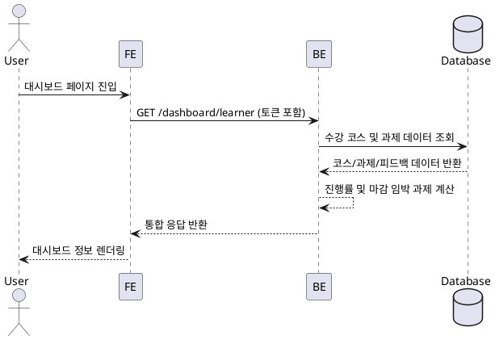

# Learner 대시보드 상세 유스케이스

## Primary Actor
- 수강 중인 Learner

## Precondition (사용자 관점)
- Learner 계정으로 로그인되어 있다.
- 최소 한 번 이상 대시보드에 접근 가능한 코스에 수강 신청을 완료했다.

## Trigger
- Learner가 대시보드 진입 버튼 또는 URL을 통해 대시보드 페이지를 연다.

## Main Scenario
1. Learner가 대시보드 페이지에 접근한다.
2. 프런트엔드가 React Query를 통해 Learner 대시보드 데이터 API를 호출한다.
3. 백엔드가 인증 토큰으로 Learner 권한을 검증한다.
4. 백엔드가 Learner의 수강 코스, 과제 진행률, 마감 임박 과제, 최근 피드백 데이터를 수집한다.
5. 백엔드가 통합 응답을 생성하여 반환한다.
6. 프런트엔드가 수신한 데이터를 레이아웃에 바인딩하고 진행률을 시각화한다.
7. Learner가 대시보드에서 정보를 확인하고 후속 행동(과제 열람, 수강 취소 등)을 선택한다.

## Edge Cases
- 등록된 코스가 없을 경우 → 공백 상태 UI와 수강 신청 CTA를 노출한다.
- 백엔드 응답 에러 → 에러 배너를 표시하고 재시도 버튼을 제공한다.
- 진행률 계산 중 데이터 불일치 → 0%로 초기화하고 오류 로거에 기록한다.
- 마감 임박 과제 계산 시 타임존 차이 → 서버 시간 기준으로 통일하고 안내 툴팁을 노출한다.

## Business Rules
- Learner는 본인이 등록한 `published` 코스만 조회할 수 있다.
- 진행률은 `완료 과제 수 / 전체 과제 수`의 백분율로 소수점 첫째 자리까지 계산한다.
- 마감 임박 과제는 현재 시간으로부터 72시간 이내 마감되는 과제만 포함한다.
- 최근 피드백은 최신 제출물 기준 최대 3개까지만 노출한다.
- 모든 데이터는 Learner의 권한 토큰으로 필터링된 결과여야 한다.

