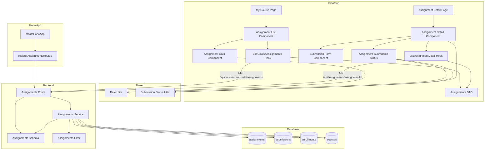

# 과제 상세 열람 (Learner) 구현 계획

## 개요

### Backend Modules

| 모듈 | 위치 | 설명 |
|------|------|------|
| Assignments Route | `src/features/assignments/backend/route.ts` | 과제 목록/상세 조회 API 엔드포인트 |
| Assignments Service | `src/features/assignments/backend/service.ts` | 과제 조회 및 제출 가능 여부 판단 비즈니스 로직 |
| Assignments Schema | `src/features/assignments/backend/schema.ts` | 과제 관련 요청/응답 zod 스키마 정의 |
| Assignments Error | `src/features/assignments/backend/error.ts` | 과제 관련 에러 코드 정의 |

### Frontend Modules

| 모듈 | 위치 | 설명 |
|------|------|------|
| My Course Page | `src/app/(learner)/courses/my/[courseId]/page.tsx` | 수강 중인 코스 페이지 (과제 목록 포함) |
| Assignment Detail Page | `src/app/(learner)/courses/my/[courseId]/assignments/[assignmentId]/page.tsx` | 과제 상세 페이지 |
| Assignment List Component | `src/features/assignments/components/assignment-list.tsx` | 과제 목록 표시 컴포넌트 |
| Assignment Card Component | `src/features/assignments/components/assignment-card.tsx` | 개별 과제 카드 컴포넌트 |
| Assignment Detail Component | `src/features/assignments/components/assignment-detail.tsx` | 과제 상세 정보 표시 컴포넌트 |
| Assignment Submission Status | `src/features/assignments/components/assignment-submission-status.tsx` | 제출 상태 표시 컴포넌트 |
| Submission Form Component | `src/features/assignments/components/submission-form.tsx` | 과제 제출 폼 컴포넌트 (추후 구현) |
| Assignments DTO | `src/features/assignments/lib/dto.ts` | 프론트엔드에서 사용할 스키마 재노출 |
| Course Assignments Hook | `src/features/assignments/hooks/useCourseAssignments.ts` | 코스별 과제 목록 조회 React Query hook |
| Assignment Detail Hook | `src/features/assignments/hooks/useAssignmentDetail.ts` | 과제 상세 조회 React Query hook |

### Shared Modules

| 모듈 | 위치 | 설명 |
|------|------|------|
| Date Utils | `src/lib/utils/date.ts` | 날짜 포맷팅 및 마감일 계산 유틸 (date-fns 활용) |
| Submission Status Utils | `src/features/assignments/lib/submission-status.ts` | 제출 가능 여부 판단 순수 함수 |

---

## Diagram



---

## Implementation Plan

### 1. Backend Layer

#### 1.1 Assignments Error

**File:** `src/features/assignments/backend/error.ts`

**구현 내용:**
```typescript
export const assignmentsErrorCodes = {
  invalidRequest: 'ASSIGNMENTS_INVALID_REQUEST',
  assignmentNotFound: 'ASSIGNMENTS_NOT_FOUND',
  assignmentNotPublished: 'ASSIGNMENTS_NOT_PUBLISHED',
  notEnrolled: 'ASSIGNMENTS_NOT_ENROLLED',
  unauthorized: 'ASSIGNMENTS_UNAUTHORIZED',
} as const;

export type AssignmentsServiceError = (typeof assignmentsErrorCodes)[keyof typeof assignmentsErrorCodes];
```

---

#### 1.2 Assignments Schema

**File:** `src/features/assignments/backend/schema.ts`

**구현 내용:**
```typescript
// AssignmentItemSchema - 과제 목록 아이템
- id: uuid
- title: string
- dueDate: string (ISO timestamp)
- weight: number (decimal)
- status: 'published' | 'closed'
- submissionStatus: 'not_submitted' | 'submitted' | 'graded' | 'resubmission_required'
- submittedAt: string | null (ISO timestamp)
- isLate: boolean | null
- score: number | null (decimal)

// AssignmentListResponseSchema - 코스별 과제 목록
- assignments: Array<AssignmentItemSchema>
- courseId: uuid
- courseTitle: string

// AssignmentDetailResponseSchema - 과제 상세 정보
- id: uuid
- courseId: uuid
- courseTitle: string
- title: string
- description: string
- dueDate: string (ISO timestamp)
- weight: number (decimal)
- allowLate: boolean
- allowResubmit: boolean
- status: 'published' | 'closed'
- createdAt: string (ISO timestamp)
- submission: {
    id: uuid | null
    submissionText: string | null
    submissionLink: string | null
    submittedAt: string | null (ISO timestamp)
    isLate: boolean | null
    score: number | null (decimal)
    feedback: string | null
    status: 'submitted' | 'graded' | 'resubmission_required' | null
    gradedAt: string | null (ISO timestamp)
  } | null
- canSubmit: boolean (계산된 필드)

// AssignmentRowSchema (DB 매핑용)
- id: uuid
- course_id: uuid
- title: string
- description: string
- due_date: string (timestamp)
- weight: number (decimal)
- allow_late: boolean
- allow_resubmit: boolean
- status: 'draft' | 'published' | 'closed'
- created_at: string (timestamp)
- updated_at: string (timestamp)

// SubmissionRowSchema (DB 매핑용)
- id: uuid
- assignment_id: uuid
- learner_id: uuid
- submission_text: string
- submission_link: string | null
- submission_file_url: string | null
- is_late: boolean
- score: number | null (decimal)
- feedback: string | null
- status: 'submitted' | 'graded' | 'resubmission_required'
- submitted_at: string (timestamp)
- graded_at: string | null (timestamp)
- created_at: string (timestamp)
- updated_at: string (timestamp)
```

**Unit Test:**
```typescript
describe('AssignmentListResponseSchema', () => {
  it('should validate correct assignment list data', () => {
    const valid = {
      assignments: [
        {
          id: '123e4567-e89b-12d3-a456-426614174000',
          title: 'Week 1 Assignment',
          dueDate: '2024-12-31T23:59:59Z',
          weight: 20,
          status: 'published',
          submissionStatus: 'submitted',
          submittedAt: '2024-12-30T10:00:00Z',
          isLate: false,
          score: 95,
        },
      ],
      courseId: '123e4567-e89b-12d3-a456-426614174001',
      courseTitle: 'React Fundamentals',
    };
    expect(AssignmentListResponseSchema.safeParse(valid).success).toBe(true);
  });

  it('should reject invalid submission status', () => {
    const invalid = { ...validData, assignments: [{ ...validData.assignments[0], submissionStatus: 'invalid' }] };
    expect(AssignmentListResponseSchema.safeParse(invalid).success).toBe(false);
  });
});

describe('AssignmentDetailResponseSchema', () => {
  it('should validate assignment with no submission', () => {
    const valid = {
      id: '123e4567-e89b-12d3-a456-426614174000',
      courseId: '123e4567-e89b-12d3-a456-426614174001',
      courseTitle: 'React Fundamentals',
      title: 'Week 1 Assignment',
      description: 'Complete the exercises',
      dueDate: '2024-12-31T23:59:59Z',
      weight: 20,
      allowLate: true,
      allowResubmit: false,
      status: 'published',
      createdAt: '2024-01-01T00:00:00Z',
      submission: null,
      canSubmit: true,
    };
    expect(AssignmentDetailResponseSchema.safeParse(valid).success).toBe(true);
  });

  it('should validate assignment with submission', () => {
    const valid = {
      id: '123e4567-e89b-12d3-a456-426614174000',
      courseId: '123e4567-e89b-12d3-a456-426614174001',
      courseTitle: 'React Fundamentals',
      title: 'Week 1 Assignment',
      description: 'Complete the exercises',
      dueDate: '2024-12-31T23:59:59Z',
      weight: 20,
      allowLate: true,
      allowResubmit: true,
      status: 'published',
      createdAt: '2024-01-01T00:00:00Z',
      submission: {
        id: '123e4567-e89b-12d3-a456-426614174002',
        submissionText: 'My submission',
        submissionLink: 'https://example.com',
        submittedAt: '2024-12-30T10:00:00Z',
        isLate: false,
        score: 95,
        feedback: 'Great work!',
        status: 'graded',
        gradedAt: '2024-12-31T12:00:00Z',
      },
      canSubmit: false,
    };
    expect(AssignmentDetailResponseSchema.safeParse(valid).success).toBe(true);
  });
});
```

---

#### 1.3 Assignments Service

**File:** `src/features/assignments/backend/service.ts`

**구현 내용:**

##### 1.3.1 `getCourseAssignments` 함수
- 특정 코스의 과제 목록 조회 (학습자용)
- 검증:
  1. 학습자가 해당 코스에 수강 등록되어 있는지 확인
  2. `cancelled_at IS NULL` 조건 확인
- 쿼리:
  1. `assignments` 테이블에서 `course_id` 필터링, `status='published'` 또는 `status='closed'` 조건
  2. LEFT JOIN `submissions` 테이블로 학습자의 제출 이력 결합
  3. `due_date` 오름차순 정렬
- 응답:
  - 각 과제의 기본 정보 (id, title, dueDate, weight, status)
  - 제출 상태 (submissionStatus, submittedAt, isLate, score)
  - 코스 정보 (courseId, courseTitle)

##### 1.3.2 `getAssignmentDetail` 함수
- 특정 과제의 상세 정보 조회 (학습자용)
- 검증:
  1. 과제 존재 여부 확인
  2. 과제 상태가 `published` 또는 `closed`인지 확인 (`draft`는 거부)
  3. 학습자가 해당 코스에 수강 등록되어 있는지 확인
- 쿼리:
  1. `assignments` 테이블에서 과제 정보 조회
  2. JOIN `courses` 테이블로 코스 제목 가져오기
  3. LEFT JOIN `submissions` 테이블로 학습자의 제출 이력 조회
- 제출 가능 여부 계산:
  - `canSubmit = (status === 'published' AND (미제출 OR (재제출 허용 AND 재제출 요청됨)) AND (마감일 전 OR 지각 허용))`
- 응답:
  - 과제 상세 정보 (모든 필드)
  - 제출 이력 (있는 경우)
  - 제출 가능 여부 (canSubmit)

##### 1.3.3 헬퍼 함수
- `checkEnrollment(supabase, learnerId, courseId)`: 수강 여부 확인
- `calculateCanSubmit(assignment, submission, now)`: 제출 가능 여부 계산 순수 함수

**Unit Test:**
```typescript
describe('getCourseAssignments', () => {
  it('should return assignments for enrolled learner', async () => {
    const result = await getCourseAssignments(
      mockSupabaseClient,
      'learner-id',
      'course-id'
    );

    expect(result.ok).toBe(true);
    expect(result.data.assignments).toHaveLength(3);
    expect(result.data.courseTitle).toBe('React Fundamentals');
  });

  it('should return error when not enrolled', async () => {
    mockSupabaseClient.from.mockReturnValue({
      select: jest.fn().mockReturnValue({
        eq: jest.fn().mockReturnValue({
          eq: jest.fn().mockReturnValue({
            is: jest.fn().mockReturnValue({
              maybeSingle: jest.fn().mockResolvedValue({ data: null, error: null }),
            }),
          }),
        }),
      }),
    });

    const result = await getCourseAssignments(
      mockSupabaseClient,
      'learner-id',
      'course-id'
    );

    expect(result.ok).toBe(false);
    expect(result.error.code).toBe('ASSIGNMENTS_NOT_ENROLLED');
  });

  it('should include submission status for each assignment', async () => {
    const result = await getCourseAssignments(
      mockSupabaseClient,
      'learner-id',
      'course-id'
    );

    expect(result.ok).toBe(true);
    expect(result.data.assignments[0].submissionStatus).toBe('submitted');
    expect(result.data.assignments[1].submissionStatus).toBe('not_submitted');
  });
});

describe('getAssignmentDetail', () => {
  it('should return assignment detail for enrolled learner', async () => {
    const result = await getAssignmentDetail(
      mockSupabaseClient,
      'learner-id',
      'assignment-id'
    );

    expect(result.ok).toBe(true);
    expect(result.data.id).toBe('assignment-id');
    expect(result.data.canSubmit).toBe(true);
  });

  it('should return error when assignment not found', async () => {
    mockSupabaseClient.from.mockReturnValue({
      select: jest.fn().mockReturnValue({
        eq: jest.fn().mockReturnValue({
          single: jest.fn().mockResolvedValue({ data: null, error: null }),
        }),
      }),
    });

    const result = await getAssignmentDetail(
      mockSupabaseClient,
      'learner-id',
      'invalid-id'
    );

    expect(result.ok).toBe(false);
    expect(result.error.code).toBe('ASSIGNMENTS_NOT_FOUND');
  });

  it('should return error when assignment is draft', async () => {
    mockSupabaseClient.from.mockReturnValue({
      select: jest.fn().mockReturnValue({
        eq: jest.fn().mockReturnValue({
          single: jest.fn().mockResolvedValue({
            data: { status: 'draft' },
            error: null,
          }),
        }),
      }),
    });

    const result = await getAssignmentDetail(
      mockSupabaseClient,
      'learner-id',
      'draft-assignment-id'
    );

    expect(result.ok).toBe(false);
    expect(result.error.code).toBe('ASSIGNMENTS_NOT_PUBLISHED');
  });

  it('should return error when learner not enrolled', async () => {
    const result = await getAssignmentDetail(
      mockSupabaseClient,
      'unenrolled-learner-id',
      'assignment-id'
    );

    expect(result.ok).toBe(false);
    expect(result.error.code).toBe('ASSIGNMENTS_NOT_ENROLLED');
  });

  it('should calculate canSubmit correctly for closed assignment', async () => {
    mockSupabaseClient.from.mockReturnValue({
      select: jest.fn().mockReturnValue({
        eq: jest.fn().mockReturnValue({
          single: jest.fn().mockResolvedValue({
            data: { status: 'closed' },
            error: null,
          }),
        }),
      }),
    });

    const result = await getAssignmentDetail(
      mockSupabaseClient,
      'learner-id',
      'closed-assignment-id'
    );

    expect(result.ok).toBe(true);
    expect(result.data.canSubmit).toBe(false);
  });

  it('should calculate canSubmit correctly for past due with allow_late=false', async () => {
    const pastDate = new Date(Date.now() - 24 * 60 * 60 * 1000).toISOString();
    mockSupabaseClient.from.mockReturnValue({
      select: jest.fn().mockReturnValue({
        eq: jest.fn().mockReturnValue({
          single: jest.fn().mockResolvedValue({
            data: {
              due_date: pastDate,
              allow_late: false,
              status: 'published',
            },
            error: null,
          }),
        }),
      }),
    });

    const result = await getAssignmentDetail(
      mockSupabaseClient,
      'learner-id',
      'assignment-id'
    );

    expect(result.ok).toBe(true);
    expect(result.data.canSubmit).toBe(false);
  });

  it('should allow submission for resubmission_required status', async () => {
    mockSupabaseClient.from.mockReturnValue({
      select: jest.fn().mockReturnValue({
        eq: jest.fn().mockReturnValue({
          single: jest.fn().mockResolvedValue({
            data: {
              status: 'published',
              allow_resubmit: true,
              submissions: [{ status: 'resubmission_required' }],
            },
            error: null,
          }),
        }),
      }),
    });

    const result = await getAssignmentDetail(
      mockSupabaseClient,
      'learner-id',
      'assignment-id'
    );

    expect(result.ok).toBe(true);
    expect(result.data.canSubmit).toBe(true);
  });
});

describe('calculateCanSubmit', () => {
  it('should return true for published assignment before due date', () => {
    const assignment = {
      status: 'published',
      due_date: new Date(Date.now() + 24 * 60 * 60 * 1000).toISOString(),
      allow_late: false,
      allow_resubmit: false,
    };
    const submission = null;
    const now = new Date();

    expect(calculateCanSubmit(assignment, submission, now)).toBe(true);
  });

  it('should return false for closed assignment', () => {
    const assignment = {
      status: 'closed',
      due_date: new Date(Date.now() + 24 * 60 * 60 * 1000).toISOString(),
      allow_late: true,
      allow_resubmit: false,
    };
    const submission = null;
    const now = new Date();

    expect(calculateCanSubmit(assignment, submission, now)).toBe(false);
  });

  it('should return false for past due with allow_late=false', () => {
    const assignment = {
      status: 'published',
      due_date: new Date(Date.now() - 24 * 60 * 60 * 1000).toISOString(),
      allow_late: false,
      allow_resubmit: false,
    };
    const submission = null;
    const now = new Date();

    expect(calculateCanSubmit(assignment, submission, now)).toBe(false);
  });

  it('should return true for past due with allow_late=true', () => {
    const assignment = {
      status: 'published',
      due_date: new Date(Date.now() - 24 * 60 * 60 * 1000).toISOString(),
      allow_late: true,
      allow_resubmit: false,
    };
    const submission = null;
    const now = new Date();

    expect(calculateCanSubmit(assignment, submission, now)).toBe(true);
  });

  it('should return false for graded submission without resubmit', () => {
    const assignment = {
      status: 'published',
      due_date: new Date(Date.now() + 24 * 60 * 60 * 1000).toISOString(),
      allow_late: false,
      allow_resubmit: false,
    };
    const submission = { status: 'graded' };
    const now = new Date();

    expect(calculateCanSubmit(assignment, submission, now)).toBe(false);
  });

  it('should return true for resubmission_required with allow_resubmit', () => {
    const assignment = {
      status: 'published',
      due_date: new Date(Date.now() + 24 * 60 * 60 * 1000).toISOString(),
      allow_late: false,
      allow_resubmit: true,
    };
    const submission = { status: 'resubmission_required' };
    const now = new Date();

    expect(calculateCanSubmit(assignment, submission, now)).toBe(true);
  });
});
```

---

#### 1.4 Assignments Route

**File:** `src/features/assignments/backend/route.ts`

**구현 내용:**
- `GET /api/courses/:courseId/assignments` 엔드포인트: 코스별 과제 목록 조회
- `GET /api/assignments/:assignmentId` 엔드포인트: 과제 상세 조회
- 사용자 인증 확인 (`x-user-id` 헤더)
- `getCourseAssignments`, `getAssignmentDetail` 서비스 호출
- 성공/실패 응답 반환 (`respond` 헬퍼 사용)

**Integration Test:**
```typescript
describe('GET /api/courses/:courseId/assignments', () => {
  it('should return 200 with assignment list for enrolled learner', async () => {
    const response = await request(app)
      .get('/api/courses/course-id/assignments')
      .set('x-user-id', 'learner-id');

    expect(response.status).toBe(200);
    expect(response.body.assignments).toBeDefined();
    expect(response.body.courseTitle).toBeDefined();
  });

  it('should return 401 when not authenticated', async () => {
    const response = await request(app).get('/api/courses/course-id/assignments');

    expect(response.status).toBe(401);
    expect(response.body.error.code).toBe('ASSIGNMENTS_UNAUTHORIZED');
  });

  it('should return 403 when not enrolled', async () => {
    const response = await request(app)
      .get('/api/courses/course-id/assignments')
      .set('x-user-id', 'unenrolled-learner-id');

    expect(response.status).toBe(403);
    expect(response.body.error.code).toBe('ASSIGNMENTS_NOT_ENROLLED');
  });

  it('should only include published and closed assignments', async () => {
    const response = await request(app)
      .get('/api/courses/course-id/assignments')
      .set('x-user-id', 'learner-id');

    expect(response.status).toBe(200);
    response.body.assignments.forEach((assignment: any) => {
      expect(['published', 'closed']).toContain(assignment.status);
    });
  });
});

describe('GET /api/assignments/:assignmentId', () => {
  it('should return 200 with assignment detail', async () => {
    const response = await request(app)
      .get('/api/assignments/assignment-id')
      .set('x-user-id', 'learner-id');

    expect(response.status).toBe(200);
    expect(response.body.id).toBe('assignment-id');
    expect(response.body.canSubmit).toBeDefined();
  });

  it('should return 401 when not authenticated', async () => {
    const response = await request(app).get('/api/assignments/assignment-id');

    expect(response.status).toBe(401);
    expect(response.body.error.code).toBe('ASSIGNMENTS_UNAUTHORIZED');
  });

  it('should return 404 when assignment not found', async () => {
    const response = await request(app)
      .get('/api/assignments/invalid-id')
      .set('x-user-id', 'learner-id');

    expect(response.status).toBe(404);
    expect(response.body.error.code).toBe('ASSIGNMENTS_NOT_FOUND');
  });

  it('should return 404 when assignment is draft', async () => {
    const response = await request(app)
      .get('/api/assignments/draft-assignment-id')
      .set('x-user-id', 'learner-id');

    expect(response.status).toBe(404);
    expect(response.body.error.code).toBe('ASSIGNMENTS_NOT_PUBLISHED');
  });

  it('should return 403 when learner not enrolled', async () => {
    const response = await request(app)
      .get('/api/assignments/assignment-id')
      .set('x-user-id', 'unenrolled-learner-id');

    expect(response.status).toBe(403);
    expect(response.body.error.code).toBe('ASSIGNMENTS_NOT_ENROLLED');
  });

  it('should include submission data when exists', async () => {
    const response = await request(app)
      .get('/api/assignments/assignment-with-submission-id')
      .set('x-user-id', 'learner-id');

    expect(response.status).toBe(200);
    expect(response.body.submission).toBeDefined();
    expect(response.body.submission.submissionText).toBeDefined();
  });
});
```

---

#### 1.5 Register Assignments Routes in Hono App

**File:** `src/backend/hono/app.ts`

**구현 내용:**
```typescript
import { registerAssignmentsRoutes } from '@/features/assignments/backend/route';

export const createHonoApp = () => {
  // ... existing code

  registerAuthRoutes(app);
  registerCoursesRoutes(app);
  registerDashboardRoutes(app);
  registerAssignmentsRoutes(app);  // 추가
  registerExampleRoutes(app);

  // ... rest
};
```

---

### 2. Shared Layer

#### 2.1 Date Utils

**File:** `src/lib/utils/date.ts`

**구현 내용:**
```typescript
import { format, formatDistanceToNow, isPast, isFuture, differenceInHours } from 'date-fns';
import { ko } from 'date-fns/locale';

// 날짜 포맷팅
export const formatDate = (date: string | Date, formatStr: string = 'yyyy-MM-dd HH:mm'): string => {
  return format(new Date(date), formatStr, { locale: ko });
};

// 상대 시간 표시 (예: "3일 전", "2시간 후")
export const formatRelativeTime = (date: string | Date): string => {
  return formatDistanceToNow(new Date(date), { addSuffix: true, locale: ko });
};

// 마감일 임박 여부 (72시간 이내)
export const isDueSoon = (dueDate: string | Date, hoursThreshold: number = 72): boolean => {
  const now = new Date();
  const due = new Date(dueDate);
  return isFuture(due) && differenceInHours(due, now) <= hoursThreshold;
};

// 마감일 지남 여부
export const isPastDue = (dueDate: string | Date): boolean => {
  return isPast(new Date(dueDate));
};

// 마감일까지 남은 시간 표시 (예: "2일 3시간 남음", "3시간 지남")
export const formatDueStatus = (dueDate: string | Date): string => {
  const due = new Date(dueDate);
  const now = new Date();

  if (isPast(due)) {
    return `${formatRelativeTime(due).replace('전', '지남')}`;
  }

  return `${formatRelativeTime(due).replace('후', '남음')}`;
};
```

**Unit Test:**
```typescript
describe('Date Utils', () => {
  describe('formatDate', () => {
    it('should format date correctly', () => {
      const date = new Date('2024-12-31T23:59:59Z');
      expect(formatDate(date)).toBe('2025-01-01 08:59'); // KST +9
    });
  });

  describe('isDueSoon', () => {
    it('should return true for date within 72 hours', () => {
      const futureDate = new Date(Date.now() + 48 * 60 * 60 * 1000).toISOString();
      expect(isDueSoon(futureDate)).toBe(true);
    });

    it('should return false for date beyond 72 hours', () => {
      const futureDate = new Date(Date.now() + 100 * 60 * 60 * 1000).toISOString();
      expect(isDueSoon(futureDate)).toBe(false);
    });

    it('should return false for past date', () => {
      const pastDate = new Date(Date.now() - 24 * 60 * 60 * 1000).toISOString();
      expect(isDueSoon(pastDate)).toBe(false);
    });
  });

  describe('isPastDue', () => {
    it('should return true for past date', () => {
      const pastDate = new Date(Date.now() - 1000).toISOString();
      expect(isPastDue(pastDate)).toBe(true);
    });

    it('should return false for future date', () => {
      const futureDate = new Date(Date.now() + 1000).toISOString();
      expect(isPastDue(futureDate)).toBe(false);
    });
  });

  describe('formatDueStatus', () => {
    it('should format future due date', () => {
      const futureDate = new Date(Date.now() + 48 * 60 * 60 * 1000).toISOString();
      const result = formatDueStatus(futureDate);
      expect(result).toContain('남음');
    });

    it('should format past due date', () => {
      const pastDate = new Date(Date.now() - 24 * 60 * 60 * 1000).toISOString();
      const result = formatDueStatus(pastDate);
      expect(result).toContain('지남');
    });
  });
});
```

---

#### 2.2 Submission Status Utils

**File:** `src/features/assignments/lib/submission-status.ts`

**구현 내용:**
```typescript
type AssignmentStatus = 'published' | 'closed' | 'draft';
type SubmissionStatus = 'submitted' | 'graded' | 'resubmission_required' | null;

export type CanSubmitResult = {
  canSubmit: boolean;
  reason?: string;
};

// 제출 가능 여부 판단
export const canSubmitAssignment = (
  assignmentStatus: AssignmentStatus,
  dueDate: string,
  allowLate: boolean,
  allowResubmit: boolean,
  submissionStatus: SubmissionStatus,
): CanSubmitResult => {
  // 1. 과제가 closed 상태
  if (assignmentStatus === 'closed') {
    return { canSubmit: false, reason: '마감된 과제입니다.' };
  }

  // 2. 과제가 published 상태가 아님
  if (assignmentStatus !== 'published') {
    return { canSubmit: false, reason: '과제를 찾을 수 없습니다.' };
  }

  // 3. 마감일 지남 & 지각 불허
  const isPastDue = new Date(dueDate) < new Date();
  if (isPastDue && !allowLate) {
    return { canSubmit: false, reason: '제출 기한이 지났습니다.' };
  }

  // 4. 제출 이력이 없으면 제출 가능
  if (!submissionStatus) {
    return { canSubmit: true };
  }

  // 5. 재제출 요청된 경우
  if (submissionStatus === 'resubmission_required') {
    if (!allowResubmit) {
      return { canSubmit: false, reason: '재제출이 허용되지 않습니다.' };
    }
    // 재제출도 마감일 제약 적용
    if (isPastDue && !allowLate) {
      return { canSubmit: false, reason: '재제출 기한이 지났습니다.' };
    }
    return { canSubmit: true };
  }

  // 6. 이미 제출됨 또는 채점됨
  if (submissionStatus === 'submitted' || submissionStatus === 'graded') {
    return { canSubmit: false, reason: '이미 제출된 과제입니다.' };
  }

  return { canSubmit: false, reason: '제출할 수 없습니다.' };
};

// 제출 상태 표시용 텍스트
export const getSubmissionStatusText = (
  status: SubmissionStatus,
  score: number | null,
): string => {
  if (!status) return '미제출';
  if (status === 'submitted') return '제출 완료';
  if (status === 'graded' && score !== null) return `채점 완료 (${score}점)`;
  if (status === 'graded') return '채점 완료';
  if (status === 'resubmission_required') return '재제출 요청';
  return '알 수 없음';
};

// 제출 상태별 색상 (Tailwind classes)
export const getSubmissionStatusColor = (status: SubmissionStatus): string => {
  if (!status) return 'text-gray-500';
  if (status === 'submitted') return 'text-blue-600';
  if (status === 'graded') return 'text-green-600';
  if (status === 'resubmission_required') return 'text-orange-600';
  return 'text-gray-500';
};
```

**Unit Test:**
```typescript
describe('Submission Status Utils', () => {
  describe('canSubmitAssignment', () => {
    it('should allow submission for published assignment before due date', () => {
      const futureDate = new Date(Date.now() + 24 * 60 * 60 * 1000).toISOString();
      const result = canSubmitAssignment('published', futureDate, false, false, null);
      expect(result.canSubmit).toBe(true);
    });

    it('should deny submission for closed assignment', () => {
      const futureDate = new Date(Date.now() + 24 * 60 * 60 * 1000).toISOString();
      const result = canSubmitAssignment('closed', futureDate, true, false, null);
      expect(result.canSubmit).toBe(false);
      expect(result.reason).toContain('마감');
    });

    it('should deny submission for past due with allow_late=false', () => {
      const pastDate = new Date(Date.now() - 24 * 60 * 60 * 1000).toISOString();
      const result = canSubmitAssignment('published', pastDate, false, false, null);
      expect(result.canSubmit).toBe(false);
      expect(result.reason).toContain('기한이 지났습니다');
    });

    it('should allow submission for past due with allow_late=true', () => {
      const pastDate = new Date(Date.now() - 24 * 60 * 60 * 1000).toISOString();
      const result = canSubmitAssignment('published', pastDate, true, false, null);
      expect(result.canSubmit).toBe(true);
    });

    it('should deny submission for already submitted', () => {
      const futureDate = new Date(Date.now() + 24 * 60 * 60 * 1000).toISOString();
      const result = canSubmitAssignment('published', futureDate, false, false, 'submitted');
      expect(result.canSubmit).toBe(false);
      expect(result.reason).toContain('이미 제출');
    });

    it('should allow resubmission when requested', () => {
      const futureDate = new Date(Date.now() + 24 * 60 * 60 * 1000).toISOString();
      const result = canSubmitAssignment('published', futureDate, false, true, 'resubmission_required');
      expect(result.canSubmit).toBe(true);
    });

    it('should deny resubmission when not allowed', () => {
      const futureDate = new Date(Date.now() + 24 * 60 * 60 * 1000).toISOString();
      const result = canSubmitAssignment('published', futureDate, false, false, 'resubmission_required');
      expect(result.canSubmit).toBe(false);
      expect(result.reason).toContain('재제출이 허용되지 않습니다');
    });
  });

  describe('getSubmissionStatusText', () => {
    it('should return correct text for each status', () => {
      expect(getSubmissionStatusText(null, null)).toBe('미제출');
      expect(getSubmissionStatusText('submitted', null)).toBe('제출 완료');
      expect(getSubmissionStatusText('graded', 95)).toBe('채점 완료 (95점)');
      expect(getSubmissionStatusText('resubmission_required', null)).toBe('재제출 요청');
    });
  });

  describe('getSubmissionStatusColor', () => {
    it('should return correct color class for each status', () => {
      expect(getSubmissionStatusColor(null)).toBe('text-gray-500');
      expect(getSubmissionStatusColor('submitted')).toBe('text-blue-600');
      expect(getSubmissionStatusColor('graded')).toBe('text-green-600');
      expect(getSubmissionStatusColor('resubmission_required')).toBe('text-orange-600');
    });
  });
});
```

---

### 3. Frontend Layer

#### 3.1 Assignments DTO

**File:** `src/features/assignments/lib/dto.ts`

**구현 내용:**
```typescript
export {
  AssignmentItemSchema,
  AssignmentListResponseSchema,
  AssignmentDetailResponseSchema,
  type AssignmentItem,
  type AssignmentListResponse,
  type AssignmentDetailResponse,
} from '@/features/assignments/backend/schema';
```

---

#### 3.2 Assignments Hooks

**File:** `src/features/assignments/hooks/useCourseAssignments.ts`

**구현 내용:**
```typescript
'use client';

import { useQuery } from '@tanstack/react-query';
import { apiClient, extractApiErrorMessage } from '@/lib/remote/api-client';
import {
  AssignmentListResponseSchema,
  type AssignmentListResponse,
} from '../lib/dto';

const fetchCourseAssignments = async (
  courseId: string
): Promise<AssignmentListResponse> => {
  try {
    const { data } = await apiClient.get(`/api/courses/${courseId}/assignments`);
    return AssignmentListResponseSchema.parse(data);
  } catch (error) {
    const message = extractApiErrorMessage(error, '과제 목록을 불러오지 못했습니다.');
    throw new Error(message);
  }
};

export const useCourseAssignments = (courseId: string) =>
  useQuery({
    queryKey: ['assignments', 'course', courseId],
    queryFn: () => fetchCourseAssignments(courseId),
    enabled: Boolean(courseId),
    staleTime: 60 * 1000,
  });
```

---

**File:** `src/features/assignments/hooks/useAssignmentDetail.ts`

**구현 내용:**
```typescript
'use client';

import { useQuery } from '@tanstack/react-query';
import { apiClient, extractApiErrorMessage } from '@/lib/remote/api-client';
import {
  AssignmentDetailResponseSchema,
  type AssignmentDetailResponse,
} from '../lib/dto';

const fetchAssignmentDetail = async (
  assignmentId: string
): Promise<AssignmentDetailResponse> => {
  try {
    const { data } = await apiClient.get(`/api/assignments/${assignmentId}`);
    return AssignmentDetailResponseSchema.parse(data);
  } catch (error) {
    const message = extractApiErrorMessage(error, '과제 정보를 불러오지 못했습니다.');
    throw new Error(message);
  }
};

export const useAssignmentDetail = (assignmentId: string) =>
  useQuery({
    queryKey: ['assignment', assignmentId],
    queryFn: () => fetchAssignmentDetail(assignmentId),
    enabled: Boolean(assignmentId),
    staleTime: 60 * 1000,
  });
```

---

#### 3.3 Assignment Card Component

**File:** `src/features/assignments/components/assignment-card.tsx`

**구현 내용:**
- 과제 제목, 마감일, 제출 상태 표시
- 마감 임박 여부 뱃지 표시 (72시간 이내)
- 제출 상태별 색상 표시
- 클릭 시 과제 상세 페이지로 이동

**QA Sheet:**
| 시나리오 | 입력 | 예상 결과 |
|---------|------|----------|
| 과제 카드 클릭 | 카드 클릭 | `/courses/my/[courseId]/assignments/[assignmentId]` 페이지로 이동 |
| 마감 임박 표시 | 마감 72시간 이내 | "마감 임박" 뱃지 표시 |
| 제출 상태 표시 | 제출 완료 | "제출 완료" 텍스트, 파란색 |
| 채점 완료 표시 | 채점 완료 | "채점 완료 (95점)" 텍스트, 초록색 |
| 재제출 요청 표시 | 재제출 요청됨 | "재제출 요청" 텍스트, 주황색 |

---

#### 3.4 Assignment List Component

**File:** `src/features/assignments/components/assignment-list.tsx`

**구현 내용:**
- `useCourseAssignments` 훅 사용하여 과제 목록 조회
- 로딩 상태 표시 (스켈레톤)
- 에러 상태 표시
- AssignmentCard 컴포넌트 렌더링 (리스트 레이아웃)
- 빈 목록 처리 ("과제가 아직 없습니다" 메시지)

**QA Sheet:**
| 시나리오 | 입력 | 예상 결과 |
|---------|------|----------|
| 정상 로딩 | 페이지 접근 | 과제 카드 목록 표시 |
| 로딩 중 | 데이터 로딩 중 | 스켈레톤 표시 |
| 네트워크 오류 | 네트워크 끊김 | 에러 메시지 표시, 재시도 버튼 |
| 빈 목록 | 과제 없음 | "과제가 아직 없습니다" 메시지 표시 |
| 수강하지 않은 코스 | 수강 등록 안 된 코스 | "수강 중인 코스가 아닙니다" 오류 표시 |

---

#### 3.5 Assignment Submission Status Component

**File:** `src/features/assignments/components/assignment-submission-status.tsx`

**구현 내용:**
- 제출 상태 표시 (미제출/제출 완료/채점 완료/재제출 요청)
- 제출 내용 표시 (텍스트, 링크)
- 제출 일시, 지각 여부 표시
- 채점 정보 표시 (점수, 피드백)
- 제출 가능 여부 메시지 표시

**QA Sheet:**
| 시나리오 | 입력 | 예상 결과 |
|---------|------|----------|
| 미제출 상태 | submission = null | "아직 제출하지 않았습니다" 메시지 |
| 제출 완료 | status = 'submitted' | 제출 내용, 제출 일시 표시 |
| 채점 완료 | status = 'graded' | 점수, 피드백 표시 |
| 재제출 요청 | status = 'resubmission_required' | "재제출이 요청되었습니다" 메시지, 이전 제출 내용 표시 |
| 지각 제출 | isLate = true | "지각 제출" 뱃지 표시 |

---

#### 3.6 Assignment Detail Component

**File:** `src/features/assignments/components/assignment-detail.tsx`

**구현 내용:**
- `useAssignmentDetail` 훅 사용하여 과제 상세 조회
- 과제 제목, 설명, 마감일, 점수 비중 표시
- 지각 허용 여부, 재제출 허용 여부 표시
- AssignmentSubmissionStatus 컴포넌트 포함
- SubmissionForm 컴포넌트 조건부 렌더링 (제출 가능 시)
- 제출 불가 메시지 표시 (canSubmit = false인 경우)
- 로딩/에러 상태 처리

**QA Sheet:**
| 시나리오 | 입력 | 예상 결과 |
|---------|------|----------|
| 정상 로딩 | 과제 상세 페이지 접근 | 과제 정보 표시 |
| 로딩 중 | 데이터 로딩 중 | 스켈레톤 표시 |
| 과제 미존재 | 존재하지 않는 과제 ID | "과제를 찾을 수 없습니다" 메시지, 코스 페이지로 리다이렉트 |
| Draft 과제 접근 | draft 상태 과제 | "과제를 찾을 수 없습니다" 메시지, 코스 페이지로 리다이렉트 |
| 제출 가능 | canSubmit = true | 제출 폼 표시 |
| 제출 불가 (마감) | canSubmit = false, closed | "마감된 과제입니다" 메시지, 제출 폼 숨김 |
| 제출 불가 (기한 초과) | canSubmit = false, 기한 초과 | "제출 기한이 지났습니다" 메시지, 제출 폼 숨김 |
| 제출 불가 (이미 제출) | canSubmit = false, 제출 완료 | "이미 제출된 과제입니다" 메시지, 제출 내용 표시 |
| 재제출 가능 | canSubmit = true, resubmission_required | 재제출 폼 표시 |

---

#### 3.7 Submission Form Component (Placeholder)

**File:** `src/features/assignments/components/submission-form.tsx`

**구현 내용:**
- 텍스트 입력 필드 (필수)
- 링크 입력 필드 (선택)
- 제출 버튼 (비활성화 상태로 표시, 실제 기능은 추후 구현)
- "제출 기능은 추후 구현 예정입니다" 안내 메시지

**QA Sheet:**
| 시나리오 | 입력 | 예상 결과 |
|---------|------|----------|
| 폼 표시 | 제출 가능 상태 | 텍스트/링크 입력 필드, 비활성화된 제출 버튼 표시 |
| 제출 시도 | 제출 버튼 클릭 | "추후 구현 예정" 메시지 표시, 실제 제출 안 됨 |

---

#### 3.8 My Course Page

**File:** `src/app/(learner)/courses/my/[courseId]/page.tsx`

**구현 내용:**
- 코스 정보 표시 (제목, 설명)
- AssignmentList 컴포넌트 포함
- 동적 라우트 파라미터 (`courseId`) 처리
- `params` promise 규약 준수
- SEO 메타데이터

**QA Sheet:**
| 시나리오 | 입력 | 예상 결과 |
|---------|------|----------|
| 페이지 접근 | `/courses/my/[courseId]` 접근 | 코스 정보 및 과제 목록 표시 |
| 수강하지 않은 코스 | 수강 등록 안 된 코스 | "수강 중인 코스가 아닙니다" 오류, 코스 카탈로그로 리다이렉트 |

---

#### 3.9 Assignment Detail Page

**File:** `src/app/(learner)/courses/my/[courseId]/assignments/[assignmentId]/page.tsx`

**구현 내용:**
- AssignmentDetail 컴포넌트 포함
- 동적 라우트 파라미터 (`courseId`, `assignmentId`) 처리
- `params` promise 규약 준수
- SEO 메타데이터 (과제 제목)

**QA Sheet:**
| 시나리오 | 입력 | 예상 결과 |
|---------|------|----------|
| 페이지 접근 | `/courses/my/[courseId]/assignments/[assignmentId]` 접근 | 과제 상세 페이지 표시 |
| 존재하지 않는 과제 | 잘못된 ID로 접근 | 404 페이지 또는 코스 페이지로 리다이렉트 |
| Draft 과제 접근 | draft 상태 과제 URL | 404 페이지 또는 코스 페이지로 리다이렉트 |

---

### 4. Integration & E2E Testing

#### 4.1 Full Flow Test

**시나리오:**
1. 학습자 로그인
2. 내 코스 페이지 접근
3. 과제 목록 확인
4. 특정 과제 클릭
5. 과제 상세 페이지 이동
6. 과제 정보 확인 (제목, 설명, 마감일 등)
7. 제출 상태 확인 (미제출/제출 완료)
8. 제출 가능 여부 확인
9. 제출 폼 표시 확인 (canSubmit = true인 경우)

**수동 QA:**
- 브라우저에서 실제 플로우 테스트
- 개발자 도구 네트워크 탭에서 API 요청/응답 확인
- 다양한 제출 상태 시나리오 테스트 (미제출, 제출 완료, 채점 완료, 재제출 요청)
- 마감일 경과 시나리오 테스트
- 수강하지 않은 코스 접근 시나리오 테스트

---

## Implementation Order

1. **Shared**: Date Utils, Submission Status Utils 구현 및 테스트
2. **Backend Error**: `assignments/backend/error.ts` 구현
3. **Backend Schema**: `assignments/backend/schema.ts` 구현 및 테스트
4. **Backend Service**: `assignments/backend/service.ts` 구현 및 테스트
   - `checkEnrollment` 헬퍼
   - `calculateCanSubmit` 헬퍼
   - `getCourseAssignments` 구현
   - `getAssignmentDetail` 구현
5. **Backend Route**: `assignments/backend/route.ts` 구현 및 테스트
6. **Backend Integration**: Hono App에 라우터 등록
7. **Frontend DTO**: `assignments/lib/dto.ts` 재노출
8. **Frontend Hooks**: Assignments 관련 훅 구현
   - `useCourseAssignments`
   - `useAssignmentDetail`
9. **Frontend Components**: 컴포넌트 구현
   - `AssignmentCard`
   - `AssignmentList`
   - `AssignmentSubmissionStatus`
   - `SubmissionForm` (placeholder)
   - `AssignmentDetail`
10. **Frontend Pages**: 페이지 구현
    - My Course Page
    - Assignment Detail Page
11. **Integration Test**: Full flow 수동 QA

---

## Notes

- **인증**: 모든 과제 조회 API는 로그인된 사용자만 접근 가능. `x-user-id` 헤더로 사용자 ID 추출.
- **권한 검증**: 학습자는 본인이 수강 등록한 코스의 과제만 조회 가능. 각 API에서 `enrollments` 테이블 조회로 검증.
- **과제 상태**: `draft` 상태의 과제는 학습자에게 표시되지 않음. `published` 또는 `closed` 상태만 조회 가능.
- **제출 가능 여부**: 과제 상태, 마감일, 지각 허용, 재제출 허용, 제출 이력을 종합적으로 고려하여 계산. 프론트엔드는 백엔드의 `canSubmit` 필드를 신뢰.
- **제출 기능**: 현재 구현 범위는 과제 열람까지. 실제 제출 기능(POST API)은 추후 구현.
- **에러 처리**: 모든 API 호출에서 에러 메시지를 사용자에게 표시. Toast 또는 inline 메시지 사용.
- **날짜 표시**: 한국어 로케일 사용 (`date-fns/locale/ko`).
- **마감 임박**: 72시간 이내를 기본값으로 사용 (조정 가능).
- **재제출 정책**: 재제출도 원래 마감일 기준으로 지각 여부 판단.
- **Supabase JOIN**: `assignments`와 `submissions`를 LEFT JOIN하여 제출 이력 포함. `courses`도 JOIN하여 코스 제목 가져오기.
- **캐싱**: React Query의 `staleTime`을 60초로 설정하여 불필요한 API 호출 최소화.
- **타입 안전성**: 백엔드 스키마를 프론트엔드에서 재사용하여 타입 일관성 유지.
