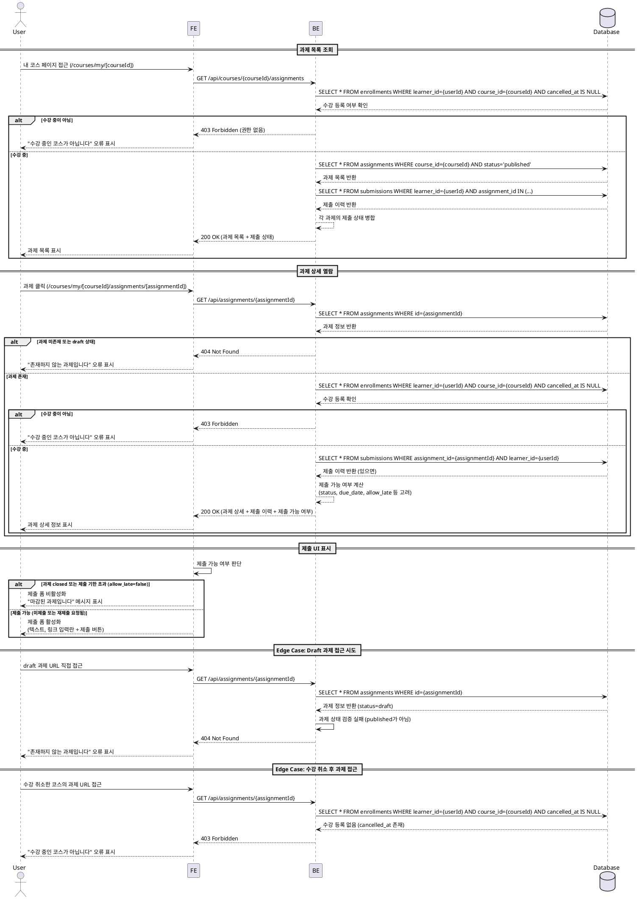

# 과제 상세 열람 (Learner) - Use Case Specification

## Primary Actor

**Learner** (학습자)

---

## Precondition

- 사용자가 Learner 역할로 로그인되어 있다.
- 사용자가 최소 하나 이상의 코스에 수강 신청을 완료한 상태이다.
- 수강 중인 코스에 과제가 게시되어 있다.

---

## Trigger

- 학습자가 내 코스 목록에서 특정 코스를 선택한다.
- 학습자가 해당 코스의 Assignment 목록을 조회한다.
- 학습자가 특정 Assignment의 상세 페이지를 클릭한다.

---

## Main Scenario

### UC-004-1: 과제 목록 조회

1. 학습자가 내 코스 페이지(`/courses/my/[courseId]`)에 접근한다.
2. 시스템은 해당 코스에 속한 `published` 상태의 과제 목록을 표시한다.
3. 각 과제 항목에는 제목, 마감일, 제출 상태가 표시된다.
4. 학습자가 과제를 클릭하면 과제 상세 페이지(`/courses/my/[courseId]/assignments/[assignmentId]`)로 이동한다.

### UC-004-2: 과제 상세 열람

1. 학습자가 과제 상세 페이지에 접근한다.
2. 시스템은 다음을 검증한다:
   - 학습자가 해당 코스에 수강 등록되어 있는지 확인
   - 과제 상태가 `published`인지 확인
3. 검증 통과 시, 시스템은 다음 정보를 표시한다:
   - 과제 제목 (`title`)
   - 과제 설명 (`description`)
   - 마감일 (`due_date`)
   - 점수 비중 (`weight`)
   - 지각 허용 여부 (`allow_late`)
   - 재제출 허용 여부 (`allow_resubmit`)
   - 과제 상태 (`status`)
4. 시스템은 학습자의 제출 이력을 조회하여 제출 상태를 표시한다:
   - 미제출: "제출하기" 버튼 활성화
   - 제출 완료: 제출 내용(텍스트/링크) 및 상태 표시
   - 채점 완료: 점수, 피드백 표시
   - 재제출 요청됨: "재제출하기" 버튼 활성화
5. 과제 상태가 `closed`인 경우, 제출 버튼을 비활성화하고 "마감된 과제입니다" 메시지를 표시한다.

### UC-004-3: 제출 UI 표시

1. 학습자가 미제출 상태의 과제 또는 재제출 요청된 과제를 열람한다.
2. 시스템은 제출 폼을 표시한다:
   - 텍스트 입력란 (필수)
   - 링크 입력란 (선택, URL 형식)
   - "제출하기" 또는 "재제출하기" 버튼
3. 과제가 `closed` 상태이거나, 마감일이 지났고 `allow_late=false`인 경우:
   - 제출 폼을 비활성화한다.
   - "제출 기한이 지났습니다" 또는 "마감된 과제입니다" 메시지를 표시한다.

---

## Edge Cases

### E1. 수강하지 않은 코스의 과제에 접근

- **조건**: 학습자가 수강하지 않은 코스의 과제 URL에 직접 접근 시도
- **처리**: "수강 중인 코스가 아닙니다" 오류 메시지를 표시하고, 코스 카탈로그 페이지로 리다이렉트한다.

### E2. Draft 상태의 과제에 접근

- **조건**: 학습자가 아직 게시되지 않은 `draft` 상태의 과제 URL에 접근 시도
- **처리**: "존재하지 않는 과제입니다" 오류 메시지를 표시하고, 해당 코스의 과제 목록 페이지로 리다이렉트한다.

### E3. 과제가 삭제된 경우

- **조건**: 학습자가 과제 상세 페이지를 보는 중 해당 과제가 삭제됨
- **처리**: "과제를 찾을 수 없습니다" 오류 메시지를 표시하고, 코스 과제 목록 페이지로 리다이렉트한다.

### E4. 수강 취소 후 과제 접근

- **조건**: 학습자가 코스 수강을 취소한 후 과제 URL을 다시 방문
- **처리**: "수강 중인 코스가 아닙니다" 오류 메시지를 표시하고, 코스 카탈로그 페이지로 리다이렉트한다.

### E5. 네트워크 오류 또는 서버 오류

- **조건**: 과제 상세 정보를 불러오는 중 네트워크 또는 서버 오류 발생
- **처리**: "일시적인 오류가 발생했습니다. 다시 시도해주세요" 오류 메시지를 표시하고, 재시도 버튼을 제공한다.

### E6. 과제 상태가 실시간으로 변경됨

- **조건**: 학습자가 과제를 보는 중 강사가 과제를 `closed` 상태로 변경
- **처리**: 제출 버튼을 비활성화하고, "이 과제는 마감되었습니다" 메시지를 표시한다. 페이지 새로고침 안내를 제공한다.

---

## Business Rules

### BR-004-1: 과제 열람 권한

- 학습자는 본인이 수강 등록한 코스의 과제만 열람할 수 있다.
- 과제 상태가 `published`인 과제만 학습자에게 표시된다.
- `draft` 상태의 과제는 강사에게만 표시된다.
- `closed` 상태의 과제는 열람 가능하지만 제출/재제출은 불가능하다.

### BR-004-2: 제출 가능 여부 판단

- 과제가 `published` 상태이고, `closed` 상태가 아니어야 제출 가능하다.
- 마감일(`due_date`) 전: 정상 제출 가능
- 마감일 후:
  - `allow_late=true`: 지각 제출 가능 (제출 시 `is_late=true`로 기록됨)
  - `allow_late=false`: 제출 불가, "제출 기한이 지났습니다" 메시지 표시

### BR-004-3: 재제출 정책

- 재제출은 `allow_resubmit=true`이고, 강사가 재제출을 요청한 경우(`status=resubmission_required`)에만 가능하다.
- 재제출 시에도 최초 마감일(`due_date`)을 기준으로 지각 여부가 판단된다.
- 재제출은 기존 제출물을 업데이트하는 방식으로 처리된다 (새로운 레코드 생성이 아님).

### BR-004-4: 과제 정보 표시

- 과제 상세 페이지에는 다음 정보가 반드시 표시되어야 한다:
  - 과제 제목, 설명, 마감일, 점수 비중
  - 지각 허용 여부, 재제출 허용 여부
  - 제출 상태 (미제출/제출됨/채점완료/재제출요청)
  - 제출 이력 (텍스트, 링크, 제출 일시, 지각 여부)
  - 채점 결과 (점수, 피드백) - 채점 완료 시에만

### BR-004-5: 제출 상태 우선순위

- 제출 상태는 다음 우선순위로 표시된다:
  1. `resubmission_required`: "재제출 요청됨" + 재제출 버튼 활성화
  2. `graded`: "채점 완료" + 점수/피드백 표시
  3. `submitted`: "제출 완료" + 제출 내용 표시
  4. 미제출: "미제출" + 제출 버튼 활성화 (과제가 `closed`가 아닌 경우)

### BR-004-6: Closed 과제 처리

- `closed` 상태의 과제는 열람 가능하지만, 모든 제출 UI가 비활성화된다.
- "마감된 과제입니다" 또는 "제출이 마감되었습니다" 메시지를 명확히 표시한다.
- 이미 제출된 내용 및 채점 결과는 계속 조회 가능하다.

---

## Sequence Diagram

