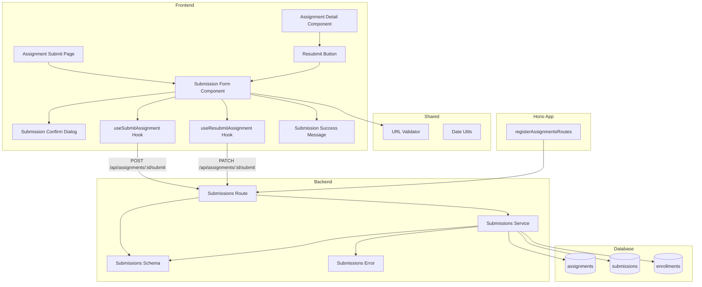

# 과제 제출/재제출 (Learner) 구현 계획

## 개요

### Backend Modules

| 모듈 | 위치 | 설명 |
|------|------|------|
| Submissions Route | `src/features/assignments/backend/route.ts` | 과제 제출/재제출 API 엔드포인트 (기존 파일 확장) |
| Submissions Service | `src/features/assignments/backend/service.ts` | 제출/재제출 비즈니스 로직 (기존 파일 확장) |
| Submissions Schema | `src/features/assignments/backend/schema.ts` | 제출 요청/응답 zod 스키마 정의 (기존 파일 확장) |
| Submissions Error | `src/features/assignments/backend/error.ts` | 제출 관련 에러 코드 추가 (기존 파일 확장) |

### Frontend Modules

| 모듈 | 위치 | 설명 |
|------|------|------|
| Assignment Submit Page | `src/app/(learner)/courses/my/[courseId]/assignments/[assignmentId]/submit/page.tsx` | 과제 제출 페이지 |
| Submission Form Component | `src/features/assignments/components/submission-form.tsx` | 과제 제출 폼 컴포넌트 (기존 placeholder 대체) |
| Submission Confirm Dialog | `src/features/assignments/components/submission-confirm-dialog.tsx` | 제출 확인 대화상자 |
| Submission Success Message | `src/features/assignments/components/submission-success-message.tsx` | 제출 성공 메시지 컴포넌트 |
| Assignments DTO | `src/features/assignments/lib/dto.ts` | 제출 스키마 재노출 (기존 파일 확장) |
| Submit Assignment Hook | `src/features/assignments/hooks/useSubmitAssignment.ts` | 과제 제출 React Query mutation |
| Resubmit Assignment Hook | `src/features/assignments/hooks/useResubmitAssignment.ts` | 과제 재제출 React Query mutation |

### Shared Modules

| 모듈 | 위치 | 설명 |
|------|------|------|
| URL Validator | `src/lib/validators/url.ts` | URL 유효성 검증 유틸 (공통) |
| Date Utils | `src/lib/utils/date.ts` | 날짜 계산 유틸 (기존 파일, 필요시 확장) |

---

## Diagram



---

## Implementation Plan

### 1. Backend Layer

#### 1.1 Submissions Error (기존 파일 확장)

**File:** `src/features/assignments/backend/error.ts`

**구현 내용:**
```typescript
export const assignmentsErrorCodes = {
  // ... 기존 에러 코드
  invalidRequest: 'ASSIGNMENTS_INVALID_REQUEST',
  assignmentNotFound: 'ASSIGNMENTS_NOT_FOUND',
  assignmentNotPublished: 'ASSIGNMENTS_NOT_PUBLISHED',
  notEnrolled: 'ASSIGNMENTS_NOT_ENROLLED',
  unauthorized: 'ASSIGNMENTS_UNAUTHORIZED',

  // 제출 관련 에러 코드 추가
  submissionNotAllowed: 'ASSIGNMENTS_SUBMISSION_NOT_ALLOWED',
  assignmentClosed: 'ASSIGNMENTS_CLOSED',
  pastDueNotAllowed: 'ASSIGNMENTS_PAST_DUE_NOT_ALLOWED',
  alreadySubmitted: 'ASSIGNMENTS_ALREADY_SUBMITTED',
  resubmitNotAllowed: 'ASSIGNMENTS_RESUBMIT_NOT_ALLOWED',
  invalidUrl: 'ASSIGNMENTS_INVALID_URL',
  submissionTextRequired: 'ASSIGNMENTS_SUBMISSION_TEXT_REQUIRED',
  submissionNotFound: 'ASSIGNMENTS_SUBMISSION_NOT_FOUND',
} as const;
```

---

#### 1.2 Submissions Schema (기존 파일 확장)

**File:** `src/features/assignments/backend/schema.ts`

**구현 내용:**
```typescript
// 제출 요청 스키마 추가
export const SubmitAssignmentRequestSchema = z.object({
  submissionText: z.string().min(1, '제출 텍스트는 필수 항목입니다.'),
  submissionLink: z.string().url('올바른 URL 형식을 입력해주세요.').optional().nullable(),
});

// 재제출 요청 스키마 (동일한 구조)
export const ResubmitAssignmentRequestSchema = SubmitAssignmentRequestSchema;

// 제출 응답 스키마
export const SubmitAssignmentResponseSchema = z.object({
  submissionId: z.string().uuid(),
  assignmentId: z.string().uuid(),
  status: z.enum(['submitted', 'graded', 'resubmission_required']),
  isLate: z.boolean(),
  submittedAt: z.string(),
  message: z.string(),
});

// TypeScript 타입 추출
export type SubmitAssignmentRequest = z.infer<typeof SubmitAssignmentRequestSchema>;
export type ResubmitAssignmentRequest = z.infer<typeof ResubmitAssignmentRequestSchema>;
export type SubmitAssignmentResponse = z.infer<typeof SubmitAssignmentResponseSchema>;
```

**Unit Test:**
```typescript
describe('SubmitAssignmentRequestSchema', () => {
  it('should validate correct submission data', () => {
    const valid = {
      submissionText: 'My submission content',
      submissionLink: 'https://github.com/user/repo',
    };
    expect(SubmitAssignmentRequestSchema.safeParse(valid).success).toBe(true);
  });

  it('should allow null submission link', () => {
    const valid = {
      submissionText: 'My submission content',
      submissionLink: null,
    };
    expect(SubmitAssignmentRequestSchema.safeParse(valid).success).toBe(true);
  });

  it('should reject empty submission text', () => {
    const invalid = {
      submissionText: '',
      submissionLink: null,
    };
    expect(SubmitAssignmentRequestSchema.safeParse(invalid).success).toBe(false);
  });

  it('should reject invalid URL format', () => {
    const invalid = {
      submissionText: 'My submission',
      submissionLink: 'invalid-url',
    };
    expect(SubmitAssignmentRequestSchema.safeParse(invalid).success).toBe(false);
  });
});
```

---

#### 1.3 Submissions Service (기존 파일 확장)

**File:** `src/features/assignments/backend/service.ts`

**구현 내용:**

##### 1.3.1 `submitAssignment` 함수 (최초 제출)
- 과제 최초 제출 처리
- 검증:
  1. 과제 존재 및 상태 확인 (`published`)
  2. 수강 등록 확인
  3. 제출 텍스트 유효성 검증
  4. 링크 형식 검증 (입력된 경우)
  5. 이미 제출된 이력 확인 (중복 제출 방지)
  6. 마감일 확인 및 지각 허용 여부 검증
- 비즈니스 로직:
  1. 현재 시각과 `due_date` 비교하여 `is_late` 계산
  2. `submissions` 테이블에 INSERT (`status='submitted'`)
  3. 성공 메시지 반환
- 응답:
  - `submissionId`, `assignmentId`, `status`, `isLate`, `submittedAt`, `message`

##### 1.3.2 `resubmitAssignment` 함수 (재제출)
- 과제 재제출 처리
- 검증:
  1. 과제 존재 및 상태 확인 (`published`)
  2. 수강 등록 확인
  3. 제출 텍스트 유효성 검증
  4. 링크 형식 검증 (입력된 경우)
  5. 기존 제출 이력 확인 (`resubmission_required` 상태)
  6. `allow_resubmit` 확인
  7. 마감일 확인 (재제출도 마감일 제약 적용)
- 비즈니스 로직:
  1. **최초 과제의 `due_date`를 기준**으로 `is_late` 재계산
     - 재제출 시점이 아닌, 원래 마감일과 비교
     - 예: 마감일 2025-10-01, 최초 제출 2025-10-05 (late=true) → 재제출 2025-10-10이어도 `late=true` 유지
     - 단, 최초 제출이 마감일 전이었고 재제출이 마감일 후라면 `late=false` 유지
  2. 기존 `submissions` 레코드 UPDATE
     - `submission_text`, `submission_link` 갱신
     - `submitted_at` 갱신 (재제출 시각)
     - `status='submitted'`로 변경
     - `is_late` 값은 위 규칙에 따라 유지 또는 갱신
  3. 성공 메시지 반환
- 응답:
  - `submissionId`, `assignmentId`, `status`, `isLate`, `submittedAt`, `message`

##### 1.3.3 헬퍼 함수
- `calculateIsLate(dueDate: string, submittedAt: Date): boolean`: 지각 여부 계산
- `validateSubmissionAllowed(assignment, submission, now): boolean`: 제출 가능 여부 검증

**Unit Test:**
```typescript
describe('submitAssignment', () => {
  it('should create submission for valid request before due date', async () => {
    const futureDate = new Date(Date.now() + 24 * 60 * 60 * 1000).toISOString();
    mockSupabaseClient.from.mockReturnValue({
      select: jest.fn().mockReturnValue({
        eq: jest.fn().mockReturnValue({
          single: jest.fn().mockResolvedValue({
            data: {
              id: 'assignment-id',
              course_id: 'course-id',
              status: 'published',
              due_date: futureDate,
              allow_late: false,
            },
            error: null,
          }),
        }),
      }),
      insert: jest.fn().mockReturnValue({
        select: jest.fn().mockReturnValue({
          single: jest.fn().mockResolvedValue({
            data: {
              id: 'submission-id',
              status: 'submitted',
              is_late: false,
              submitted_at: new Date().toISOString(),
            },
            error: null,
          }),
        }),
      }),
    });

    const result = await submitAssignment(
      mockSupabaseClient,
      'learner-id',
      'assignment-id',
      {
        submissionText: 'My submission',
        submissionLink: 'https://github.com/user/repo',
      },
    );

    expect(result.ok).toBe(true);
    expect(result.data.status).toBe('submitted');
    expect(result.data.isLate).toBe(false);
  });

  it('should mark as late when submitted after due date with allow_late=true', async () => {
    const pastDate = new Date(Date.now() - 24 * 60 * 60 * 1000).toISOString();
    mockSupabaseClient.from.mockReturnValue({
      select: jest.fn().mockReturnValue({
        eq: jest.fn().mockReturnValue({
          single: jest.fn().mockResolvedValue({
            data: {
              id: 'assignment-id',
              course_id: 'course-id',
              status: 'published',
              due_date: pastDate,
              allow_late: true,
            },
            error: null,
          }),
        }),
      }),
      insert: jest.fn().mockReturnValue({
        select: jest.fn().mockReturnValue({
          single: jest.fn().mockResolvedValue({
            data: {
              id: 'submission-id',
              status: 'submitted',
              is_late: true,
              submitted_at: new Date().toISOString(),
            },
            error: null,
          }),
        }),
      }),
    });

    const result = await submitAssignment(
      mockSupabaseClient,
      'learner-id',
      'assignment-id',
      {
        submissionText: 'Late submission',
        submissionLink: null,
      },
    );

    expect(result.ok).toBe(true);
    expect(result.data.isLate).toBe(true);
  });

  it('should return error when submitted after due date with allow_late=false', async () => {
    const pastDate = new Date(Date.now() - 24 * 60 * 60 * 1000).toISOString();
    mockSupabaseClient.from.mockReturnValue({
      select: jest.fn().mockReturnValue({
        eq: jest.fn().mockReturnValue({
          single: jest.fn().mockResolvedValue({
            data: {
              id: 'assignment-id',
              course_id: 'course-id',
              status: 'published',
              due_date: pastDate,
              allow_late: false,
            },
            error: null,
          }),
        }),
      }),
    });

    const result = await submitAssignment(
      mockSupabaseClient,
      'learner-id',
      'assignment-id',
      {
        submissionText: 'Late submission',
        submissionLink: null,
      },
    );

    expect(result.ok).toBe(false);
    expect(result.error.code).toBe('ASSIGNMENTS_PAST_DUE_NOT_ALLOWED');
  });

  it('should return error when assignment is closed', async () => {
    mockSupabaseClient.from.mockReturnValue({
      select: jest.fn().mockReturnValue({
        eq: jest.fn().mockReturnValue({
          single: jest.fn().mockResolvedValue({
            data: {
              id: 'assignment-id',
              course_id: 'course-id',
              status: 'closed',
              due_date: new Date().toISOString(),
              allow_late: true,
            },
            error: null,
          }),
        }),
      }),
    });

    const result = await submitAssignment(
      mockSupabaseClient,
      'learner-id',
      'assignment-id',
      {
        submissionText: 'My submission',
        submissionLink: null,
      },
    );

    expect(result.ok).toBe(false);
    expect(result.error.code).toBe('ASSIGNMENTS_CLOSED');
  });

  it('should return error when already submitted', async () => {
    mockSupabaseClient.from.mockReturnValue({
      select: jest.fn().mockReturnValue({
        eq: jest.fn().mockReturnValue({
          single: jest.fn().mockResolvedValue({
            data: {
              id: 'assignment-id',
              course_id: 'course-id',
              status: 'published',
              due_date: new Date(Date.now() + 24 * 60 * 60 * 1000).toISOString(),
              allow_late: false,
            },
            error: null,
          }),
          maybeSingle: jest.fn().mockResolvedValue({
            data: { id: 'existing-submission-id', status: 'submitted' },
            error: null,
          }),
        }),
      }),
    });

    const result = await submitAssignment(
      mockSupabaseClient,
      'learner-id',
      'assignment-id',
      {
        submissionText: 'My submission',
        submissionLink: null,
      },
    );

    expect(result.ok).toBe(false);
    expect(result.error.code).toBe('ASSIGNMENTS_ALREADY_SUBMITTED');
  });

  it('should return error when not enrolled', async () => {
    // checkEnrollment이 false 반환하도록 mock 설정
    const result = await submitAssignment(
      mockSupabaseClient,
      'unenrolled-learner-id',
      'assignment-id',
      {
        submissionText: 'My submission',
        submissionLink: null,
      },
    );

    expect(result.ok).toBe(false);
    expect(result.error.code).toBe('ASSIGNMENTS_NOT_ENROLLED');
  });
});

describe('resubmitAssignment', () => {
  it('should update submission for resubmission_required status', async () => {
    const futureDate = new Date(Date.now() + 24 * 60 * 60 * 1000).toISOString();
    mockSupabaseClient.from.mockReturnValue({
      select: jest.fn().mockReturnValue({
        eq: jest.fn().mockReturnValue({
          single: jest.fn().mockResolvedValue({
            data: {
              id: 'assignment-id',
              course_id: 'course-id',
              status: 'published',
              due_date: futureDate,
              allow_late: false,
              allow_resubmit: true,
            },
            error: null,
          }),
          maybeSingle: jest.fn().mockResolvedValue({
            data: {
              id: 'submission-id',
              status: 'resubmission_required',
              is_late: false,
            },
            error: null,
          }),
        }),
      }),
      update: jest.fn().mockReturnValue({
        eq: jest.fn().mockReturnValue({
          select: jest.fn().mockReturnValue({
            single: jest.fn().mockResolvedValue({
              data: {
                id: 'submission-id',
                status: 'submitted',
                is_late: false,
                submitted_at: new Date().toISOString(),
              },
              error: null,
            }),
          }),
        }),
      }),
    });

    const result = await resubmitAssignment(
      mockSupabaseClient,
      'learner-id',
      'assignment-id',
      {
        submissionText: 'Updated submission',
        submissionLink: 'https://github.com/user/repo-v2',
      },
    );

    expect(result.ok).toBe(true);
    expect(result.data.status).toBe('submitted');
  });

  it('should maintain is_late=true when originally submitted late', async () => {
    const pastDate = new Date(Date.now() - 10 * 24 * 60 * 60 * 1000).toISOString();
    mockSupabaseClient.from.mockReturnValue({
      select: jest.fn().mockReturnValue({
        eq: jest.fn().mockReturnValue({
          single: jest.fn().mockResolvedValue({
            data: {
              id: 'assignment-id',
              course_id: 'course-id',
              status: 'published',
              due_date: pastDate,
              allow_late: true,
              allow_resubmit: true,
            },
            error: null,
          }),
          maybeSingle: jest.fn().mockResolvedValue({
            data: {
              id: 'submission-id',
              status: 'resubmission_required',
              is_late: true,
              submitted_at: new Date(Date.now() - 5 * 24 * 60 * 60 * 1000).toISOString(),
            },
            error: null,
          }),
        }),
      }),
      update: jest.fn().mockReturnValue({
        eq: jest.fn().mockReturnValue({
          select: jest.fn().mockReturnValue({
            single: jest.fn().mockResolvedValue({
              data: {
                id: 'submission-id',
                status: 'submitted',
                is_late: true,
                submitted_at: new Date().toISOString(),
              },
              error: null,
            }),
          }),
        }),
      }),
    });

    const result = await resubmitAssignment(
      mockSupabaseClient,
      'learner-id',
      'assignment-id',
      {
        submissionText: 'Resubmission after late',
        submissionLink: null,
      },
    );

    expect(result.ok).toBe(true);
    expect(result.data.isLate).toBe(true);
  });

  it('should return error when allow_resubmit=false', async () => {
    mockSupabaseClient.from.mockReturnValue({
      select: jest.fn().mockReturnValue({
        eq: jest.fn().mockReturnValue({
          single: jest.fn().mockResolvedValue({
            data: {
              id: 'assignment-id',
              course_id: 'course-id',
              status: 'published',
              due_date: new Date(Date.now() + 24 * 60 * 60 * 1000).toISOString(),
              allow_late: false,
              allow_resubmit: false,
            },
            error: null,
          }),
        }),
      }),
    });

    const result = await resubmitAssignment(
      mockSupabaseClient,
      'learner-id',
      'assignment-id',
      {
        submissionText: 'Resubmission',
        submissionLink: null,
      },
    );

    expect(result.ok).toBe(false);
    expect(result.error.code).toBe('ASSIGNMENTS_RESUBMIT_NOT_ALLOWED');
  });

  it('should return error when submission not found', async () => {
    mockSupabaseClient.from.mockReturnValue({
      select: jest.fn().mockReturnValue({
        eq: jest.fn().mockReturnValue({
          single: jest.fn().mockResolvedValue({
            data: {
              id: 'assignment-id',
              course_id: 'course-id',
              status: 'published',
              due_date: new Date(Date.now() + 24 * 60 * 60 * 1000).toISOString(),
              allow_late: false,
              allow_resubmit: true,
            },
            error: null,
          }),
          maybeSingle: jest.fn().mockResolvedValue({
            data: null,
            error: null,
          }),
        }),
      }),
    });

    const result = await resubmitAssignment(
      mockSupabaseClient,
      'learner-id',
      'assignment-id',
      {
        submissionText: 'Resubmission',
        submissionLink: null,
      },
    );

    expect(result.ok).toBe(false);
    expect(result.error.code).toBe('ASSIGNMENTS_SUBMISSION_NOT_FOUND');
  });

  it('should return error when submission status is not resubmission_required', async () => {
    mockSupabaseClient.from.mockReturnValue({
      select: jest.fn().mockReturnValue({
        eq: jest.fn().mockReturnValue({
          single: jest.fn().mockResolvedValue({
            data: {
              id: 'assignment-id',
              course_id: 'course-id',
              status: 'published',
              due_date: new Date(Date.now() + 24 * 60 * 60 * 1000).toISOString(),
              allow_late: false,
              allow_resubmit: true,
            },
            error: null,
          }),
          maybeSingle: jest.fn().mockResolvedValue({
            data: {
              id: 'submission-id',
              status: 'graded',
            },
            error: null,
          }),
        }),
      }),
    });

    const result = await resubmitAssignment(
      mockSupabaseClient,
      'learner-id',
      'assignment-id',
      {
        submissionText: 'Resubmission',
        submissionLink: null,
      },
    );

    expect(result.ok).toBe(false);
    expect(result.error.code).toBe('ASSIGNMENTS_SUBMISSION_NOT_ALLOWED');
  });
});

describe('calculateIsLate', () => {
  it('should return false when submitted before due date', () => {
    const dueDate = new Date(Date.now() + 24 * 60 * 60 * 1000).toISOString();
    const submittedAt = new Date();
    expect(calculateIsLate(dueDate, submittedAt)).toBe(false);
  });

  it('should return true when submitted after due date', () => {
    const dueDate = new Date(Date.now() - 24 * 60 * 60 * 1000).toISOString();
    const submittedAt = new Date();
    expect(calculateIsLate(dueDate, submittedAt)).toBe(true);
  });
});
```

---

#### 1.4 Submissions Route (기존 파일 확장)

**File:** `src/features/assignments/backend/route.ts`

**구현 내용:**
- `POST /api/assignments/:assignmentId/submit` 엔드포인트: 최초 과제 제출
- `PATCH /api/assignments/:assignmentId/submit` 엔드포인트: 과제 재제출
- 요청 body 파싱 (`SubmitAssignmentRequestSchema`, `ResubmitAssignmentRequestSchema`)
- 사용자 인증 확인 (`x-user-id` 헤더)
- `submitAssignment`, `resubmitAssignment` 서비스 호출
- 성공/실패 응답 반환 (`respond` 헬퍼 사용)

**Integration Test:**
```typescript
describe('POST /api/assignments/:assignmentId/submit', () => {
  it('should return 201 on successful submission', async () => {
    const response = await request(app)
      .post('/api/assignments/assignment-id/submit')
      .set('x-user-id', 'learner-id')
      .send({
        submissionText: 'My submission content',
        submissionLink: 'https://github.com/user/repo',
      });

    expect(response.status).toBe(201);
    expect(response.body.submissionId).toBeDefined();
    expect(response.body.status).toBe('submitted');
  });

  it('should return 400 on missing submission text', async () => {
    const response = await request(app)
      .post('/api/assignments/assignment-id/submit')
      .set('x-user-id', 'learner-id')
      .send({
        submissionText: '',
        submissionLink: null,
      });

    expect(response.status).toBe(400);
    expect(response.body.error.code).toBe('ASSIGNMENTS_INVALID_REQUEST');
  });

  it('should return 400 on invalid URL format', async () => {
    const response = await request(app)
      .post('/api/assignments/assignment-id/submit')
      .set('x-user-id', 'learner-id')
      .send({
        submissionText: 'My submission',
        submissionLink: 'invalid-url',
      });

    expect(response.status).toBe(400);
    expect(response.body.error.code).toBe('ASSIGNMENTS_INVALID_URL');
  });

  it('should return 401 when not authenticated', async () => {
    const response = await request(app)
      .post('/api/assignments/assignment-id/submit')
      .send({
        submissionText: 'My submission',
        submissionLink: null,
      });

    expect(response.status).toBe(401);
    expect(response.body.error.code).toBe('ASSIGNMENTS_UNAUTHORIZED');
  });

  it('should return 403 when assignment is closed', async () => {
    const response = await request(app)
      .post('/api/assignments/closed-assignment-id/submit')
      .set('x-user-id', 'learner-id')
      .send({
        submissionText: 'My submission',
        submissionLink: null,
      });

    expect(response.status).toBe(403);
    expect(response.body.error.code).toBe('ASSIGNMENTS_CLOSED');
  });

  it('should return 403 when past due with allow_late=false', async () => {
    const response = await request(app)
      .post('/api/assignments/past-due-assignment-id/submit')
      .set('x-user-id', 'learner-id')
      .send({
        submissionText: 'Late submission',
        submissionLink: null,
      });

    expect(response.status).toBe(403);
    expect(response.body.error.code).toBe('ASSIGNMENTS_PAST_DUE_NOT_ALLOWED');
  });

  it('should return 409 when already submitted', async () => {
    const response = await request(app)
      .post('/api/assignments/submitted-assignment-id/submit')
      .set('x-user-id', 'learner-id')
      .send({
        submissionText: 'Duplicate submission',
        submissionLink: null,
      });

    expect(response.status).toBe(409);
    expect(response.body.error.code).toBe('ASSIGNMENTS_ALREADY_SUBMITTED');
  });
});

describe('PATCH /api/assignments/:assignmentId/submit', () => {
  it('should return 200 on successful resubmission', async () => {
    const response = await request(app)
      .patch('/api/assignments/assignment-id/submit')
      .set('x-user-id', 'learner-id')
      .send({
        submissionText: 'Updated submission content',
        submissionLink: 'https://github.com/user/repo-v2',
      });

    expect(response.status).toBe(200);
    expect(response.body.submissionId).toBeDefined();
    expect(response.body.status).toBe('submitted');
  });

  it('should return 401 when not authenticated', async () => {
    const response = await request(app)
      .patch('/api/assignments/assignment-id/submit')
      .send({
        submissionText: 'Updated submission',
        submissionLink: null,
      });

    expect(response.status).toBe(401);
    expect(response.body.error.code).toBe('ASSIGNMENTS_UNAUTHORIZED');
  });

  it('should return 403 when allow_resubmit=false', async () => {
    const response = await request(app)
      .patch('/api/assignments/no-resubmit-assignment-id/submit')
      .set('x-user-id', 'learner-id')
      .send({
        submissionText: 'Resubmission attempt',
        submissionLink: null,
      });

    expect(response.status).toBe(403);
    expect(response.body.error.code).toBe('ASSIGNMENTS_RESUBMIT_NOT_ALLOWED');
  });

  it('should return 404 when submission not found', async () => {
    const response = await request(app)
      .patch('/api/assignments/no-submission-assignment-id/submit')
      .set('x-user-id', 'learner-id')
      .send({
        submissionText: 'Resubmission',
        submissionLink: null,
      });

    expect(response.status).toBe(404);
    expect(response.body.error.code).toBe('ASSIGNMENTS_SUBMISSION_NOT_FOUND');
  });

  it('should return 403 when submission status is not resubmission_required', async () => {
    const response = await request(app)
      .patch('/api/assignments/graded-assignment-id/submit')
      .set('x-user-id', 'learner-id')
      .send({
        submissionText: 'Resubmission attempt',
        submissionLink: null,
      });

    expect(response.status).toBe(403);
    expect(response.body.error.code).toBe('ASSIGNMENTS_SUBMISSION_NOT_ALLOWED');
  });
});
```

---

### 2. Shared Layer

#### 2.1 URL Validator

**File:** `src/lib/validators/url.ts`

**구현 내용:**
```typescript
export const isValidUrl = (url: string): boolean => {
  try {
    new URL(url);
    return true;
  } catch {
    return false;
  }
};

export const getUrlErrorMessage = (url: string): string | null => {
  if (!url) return null;
  if (!isValidUrl(url)) {
    return '올바른 URL 형식을 입력해주세요.';
  }
  return null;
};
```

**Unit Test:**
```typescript
describe('URL Validator', () => {
  it('should accept valid URLs', () => {
    expect(isValidUrl('https://github.com/user/repo')).toBe(true);
    expect(isValidUrl('http://example.com')).toBe(true);
    expect(isValidUrl('https://www.example.com/path?query=value')).toBe(true);
  });

  it('should reject invalid URLs', () => {
    expect(isValidUrl('invalid-url')).toBe(false);
    expect(isValidUrl('htp://example.com')).toBe(false);
    expect(isValidUrl('example.com')).toBe(false);
  });

  it('should return error message for invalid URL', () => {
    expect(getUrlErrorMessage('invalid-url')).toContain('올바른 URL');
  });

  it('should return null for valid URL', () => {
    expect(getUrlErrorMessage('https://example.com')).toBeNull();
  });
});
```

---

### 3. Frontend Layer

#### 3.1 Assignments DTO (기존 파일 확장)

**File:** `src/features/assignments/lib/dto.ts`

**구현 내용:**
```typescript
export {
  // ... 기존 재노출
  AssignmentItemSchema,
  AssignmentListResponseSchema,
  AssignmentDetailResponseSchema,
  type AssignmentItem,
  type AssignmentListResponse,
  type AssignmentDetailResponse,

  // 제출 관련 스키마 재노출
  SubmitAssignmentRequestSchema,
  ResubmitAssignmentRequestSchema,
  SubmitAssignmentResponseSchema,
  type SubmitAssignmentRequest,
  type ResubmitAssignmentRequest,
  type SubmitAssignmentResponse,
} from '@/features/assignments/backend/schema';
```

---

#### 3.2 Submit Assignment Hook

**File:** `src/features/assignments/hooks/useSubmitAssignment.ts`

**구현 내용:**
```typescript
'use client';

import { useMutation, useQueryClient } from '@tanstack/react-query';
import { apiClient, extractApiErrorMessage } from '@/lib/remote/api-client';
import {
  SubmitAssignmentRequestSchema,
  SubmitAssignmentResponseSchema,
  type SubmitAssignmentRequest,
  type SubmitAssignmentResponse,
} from '../lib/dto';

const submitAssignment = async (
  assignmentId: string,
  data: SubmitAssignmentRequest,
): Promise<SubmitAssignmentResponse> => {
  try {
    const validated = SubmitAssignmentRequestSchema.parse(data);
    const { data: response } = await apiClient.post(
      `/api/assignments/${assignmentId}/submit`,
      validated,
    );
    return SubmitAssignmentResponseSchema.parse(response);
  } catch (error) {
    const message = extractApiErrorMessage(error, '과제 제출에 실패했습니다.');
    throw new Error(message);
  }
};

export const useSubmitAssignment = (assignmentId: string) => {
  const queryClient = useQueryClient();

  return useMutation({
    mutationFn: (data: SubmitAssignmentRequest) => submitAssignment(assignmentId, data),
    onSuccess: () => {
      // 과제 상세 정보 캐시 무효화
      queryClient.invalidateQueries({ queryKey: ['assignment', assignmentId] });
      // 코스 과제 목록 캐시 무효화
      queryClient.invalidateQueries({ queryKey: ['assignments', 'course'] });
    },
  });
};
```

---

#### 3.3 Resubmit Assignment Hook

**File:** `src/features/assignments/hooks/useResubmitAssignment.ts`

**구현 내용:**
```typescript
'use client';

import { useMutation, useQueryClient } from '@tanstack/react-query';
import { apiClient, extractApiErrorMessage } from '@/lib/remote/api-client';
import {
  ResubmitAssignmentRequestSchema,
  SubmitAssignmentResponseSchema,
  type ResubmitAssignmentRequest,
  type SubmitAssignmentResponse,
} from '../lib/dto';

const resubmitAssignment = async (
  assignmentId: string,
  data: ResubmitAssignmentRequest,
): Promise<SubmitAssignmentResponse> => {
  try {
    const validated = ResubmitAssignmentRequestSchema.parse(data);
    const { data: response } = await apiClient.patch(
      `/api/assignments/${assignmentId}/submit`,
      validated,
    );
    return SubmitAssignmentResponseSchema.parse(response);
  } catch (error) {
    const message = extractApiErrorMessage(error, '과제 재제출에 실패했습니다.');
    throw new Error(message);
  }
};

export const useResubmitAssignment = (assignmentId: string) => {
  const queryClient = useQueryClient();

  return useMutation({
    mutationFn: (data: ResubmitAssignmentRequest) => resubmitAssignment(assignmentId, data),
    onSuccess: () => {
      // 과제 상세 정보 캐시 무효화
      queryClient.invalidateQueries({ queryKey: ['assignment', assignmentId] });
      // 코스 과제 목록 캐시 무효화
      queryClient.invalidateQueries({ queryKey: ['assignments', 'course'] });
    },
  });
};
```

---

#### 3.4 Submission Confirm Dialog Component

**File:** `src/features/assignments/components/submission-confirm-dialog.tsx`

**구현 내용:**
- 제출/재제출 확인 대화상자
- 제출 내용 미리보기 (텍스트, 링크)
- 마감일 지각 여부 경고 표시
- "확인" / "취소" 버튼
- shadcn-ui Dialog 컴포넌트 활용

**QA Sheet:**
| 시나리오 | 입력 | 예상 결과 |
|---------|------|----------|
| 마감일 전 제출 확인 | 제출 버튼 클릭 | "과제를 제출하시겠습니까?" 대화상자 표시 |
| 마감일 후 제출 확인 | 제출 버튼 클릭 (지각) | "지각 제출로 처리됩니다" 경고 메시지 포함 |
| 재제출 확인 | 재제출 버튼 클릭 | "과제를 재제출하시겠습니까?" 대화상자 표시 |
| 확인 버튼 클릭 | 확인 클릭 | 제출 API 호출, 대화상자 닫힘 |
| 취소 버튼 클릭 | 취소 클릭 | 대화상자 닫힘, 제출 안 됨 |

---

#### 3.5 Submission Success Message Component

**File:** `src/features/assignments/components/submission-success-message.tsx`

**구현 내용:**
- 제출 성공 메시지 표시
- 제출 일시, 지각 여부 표시
- "과제 목록으로" 버튼
- "과제 상세 보기" 버튼
- shadcn-ui Alert 컴포넌트 활용

**QA Sheet:**
| 시나리오 | 입력 | 예상 결과 |
|---------|------|----------|
| 제출 성공 | 제출 완료 | "과제가 제출되었습니다" 메시지, 제출 일시 표시 |
| 지각 제출 성공 | 지각 제출 완료 | "과제가 지각 제출되었습니다" 메시지, 경고 아이콘 |
| 재제출 성공 | 재제출 완료 | "과제가 재제출되었습니다" 메시지 |
| 과제 목록으로 버튼 | 버튼 클릭 | `/courses/my/[courseId]` 페이지로 이동 |
| 과제 상세 보기 버튼 | 버튼 클릭 | `/courses/my/[courseId]/assignments/[assignmentId]` 페이지로 이동 |

---

#### 3.6 Submission Form Component (기존 placeholder 대체)

**File:** `src/features/assignments/components/submission-form.tsx`

**구현 내용:**
- react-hook-form + zod 통합
- 필드:
  - 제출 텍스트 (Textarea, 필수)
  - 제출 링크 (Input, 선택)
- 유효성 검증:
  - 제출 텍스트: 최소 1자 이상
  - 링크: URL 형식 (입력된 경우)
- `useSubmitAssignment` 또는 `useResubmitAssignment` 훅 사용
- 제출 전 SubmissionConfirmDialog 표시
- 성공 시 SubmissionSuccessMessage 표시
- 오류 메시지 표시 (toast 또는 inline)
- 로딩 상태 처리 (버튼 비활성화)
- 중복 제출 방지

**QA Sheet:**
| 시나리오 | 입력 | 예상 결과 |
|---------|------|----------|
| 정상 제출 | 모든 필드 올바르게 입력 후 제출 | 확인 대화상자 → 제출 성공 메시지 |
| 제출 텍스트 누락 | 텍스트 미입력 후 제출 | "제출 텍스트는 필수 항목입니다" 오류 표시 |
| 잘못된 링크 형식 | 링크: "invalid-url" | "올바른 URL 형식을 입력해주세요" 오류 표시 |
| 링크 없이 제출 | 링크 필드 비움 | 정상 제출 (링크는 선택 항목) |
| 제출 중 버튼 비활성화 | 제출 버튼 클릭 | "제출 중..." 로딩 상태, 버튼 비활성화 |
| 중복 클릭 방지 | 짧은 시간 내 여러 번 클릭 | 첫 번째 요청만 처리, 이후 무시 |
| 네트워크 오류 | 네트워크 끊김 상태에서 제출 | "일시적인 오류가 발생했습니다" 오류 메시지, 재시도 가능 |
| 마감일 후 제출 시도 | 지각 불허 과제에 마감일 후 제출 | "제출 기한이 지났습니다" 오류 메시지 (API에서 반환) |
| 재제출 | resubmission_required 상태에서 폼 작성 | "재제출" 버튼 표시, 기존 제출 내용 pre-fill |

---

#### 3.7 Assignment Submit Page

**File:** `src/app/(learner)/courses/my/[courseId]/assignments/[assignmentId]/submit/page.tsx`

**구현 내용:**
- `useAssignmentDetail` 훅으로 과제 정보 조회
- 과제 제목, 설명, 마감일 표시
- 제출 가능 여부 확인 (`canSubmit`)
- 제출 불가 시 안내 메시지 및 리다이렉트
- SubmissionForm 컴포넌트 렌더링
- 동적 라우트 파라미터 (`courseId`, `assignmentId`) 처리
- `params` promise 규약 준수
- SEO 메타데이터

**QA Sheet:**
| 시나리오 | 입력 | 예상 결과 |
|---------|------|----------|
| 제출 가능 상태 | `/courses/my/[courseId]/assignments/[assignmentId]/submit` 접근 | 과제 정보 및 제출 폼 표시 |
| 제출 불가 상태 (마감) | 마감된 과제 제출 페이지 접근 | "마감된 과제입니다" 메시지, 과제 상세 페이지로 리다이렉트 |
| 제출 불가 상태 (이미 제출) | 제출 완료된 과제 제출 페이지 접근 | "이미 제출된 과제입니다" 메시지, 과제 상세 페이지로 리다이렉트 |
| 재제출 페이지 | resubmission_required 상태에서 접근 | 재제출 폼 표시, 기존 제출 내용 pre-fill |
| 존재하지 않는 과제 | 잘못된 ID로 접근 | 404 페이지 또는 코스 페이지로 리다이렉트 |
| 수강하지 않은 코스 | 수강 등록 안 된 코스의 과제 | "수강 중인 코스가 아닙니다" 오류, 코스 카탈로그로 리다이렉트 |

---

#### 3.8 Assignment Detail Component (기존 컴포넌트 수정)

**File:** `src/features/assignments/components/assignment-detail.tsx`

**구현 내용 (추가):**
- 제출 가능 시 "제출하기" 버튼 표시 (제출 페이지로 이동)
- 재제출 가능 시 "재제출하기" 버튼 표시 (제출 페이지로 이동)
- 제출 불가 시 안내 메시지만 표시 (기존 로직 유지)

**QA Sheet:**
| 시나리오 | 입력 | 예상 결과 |
|---------|------|----------|
| 제출 가능 | canSubmit = true | "제출하기" 버튼 표시 |
| 재제출 가능 | canSubmit = true, resubmission_required | "재제출하기" 버튼 표시 |
| 제출 불가 | canSubmit = false | 제출 버튼 숨김, 안내 메시지만 표시 |
| 제출하기 버튼 클릭 | 버튼 클릭 | `/courses/my/[courseId]/assignments/[assignmentId]/submit` 페이지로 이동 |
| 재제출하기 버튼 클릭 | 버튼 클릭 | `/courses/my/[courseId]/assignments/[assignmentId]/submit` 페이지로 이동 (재제출 모드) |

---

### 4. Integration & E2E Testing

#### 4.1 Full Flow Test - 최초 제출

**시나리오:**
1. 학습자 로그인
2. 내 코스 페이지 접근
3. 과제 목록에서 미제출 과제 클릭
4. 과제 상세 페이지에서 "제출하기" 버튼 클릭
5. 제출 페이지로 이동
6. 제출 텍스트 입력 (필수)
7. 제출 링크 입력 (선택)
8. "제출" 버튼 클릭
9. 확인 대화상자에서 "확인" 클릭
10. 제출 성공 메시지 확인
11. DB 확인: `submissions` 테이블에 레코드 생성 확인
12. 과제 목록에서 상태 "제출 완료"로 업데이트 확인

**수동 QA:**
- 브라우저에서 실제 플로우 테스트
- 개발자 도구 네트워크 탭에서 API 요청/응답 확인
- Supabase 대시보드에서 `submissions` 테이블 데이터 확인

---

#### 4.2 Full Flow Test - 지각 제출

**시나리오:**
1. 마감일이 지난 과제에 접근 (allow_late=true)
2. "제출하기" 버튼 클릭
3. 제출 페이지에서 "마감일이 지났습니다. 지각 제출로 처리됩니다" 경고 메시지 확인
4. 제출 내용 입력
5. 제출 버튼 클릭
6. 확인 대화상자에서 지각 경고 확인
7. "확인" 클릭
8. 제출 성공 메시지에서 "지각 제출" 표시 확인
9. DB 확인: `is_late=true` 확인

**수동 QA:**
- 마감일 지난 과제 데이터 준비
- 지각 경고 메시지 표시 확인
- `is_late` 플래그 정확성 검증

---

#### 4.3 Full Flow Test - 재제출

**시나리오:**
1. 강사가 `status=resubmission_required`로 설정한 과제에 접근
2. 과제 상세 페이지에서 "강사가 재제출을 요청했습니다" 메시지 확인
3. 피드백 내용 확인
4. "재제출하기" 버튼 클릭
5. 제출 페이지에서 기존 제출 내용 pre-fill 확인
6. 제출 내용 수정
7. "재제출" 버튼 클릭
8. 확인 대화상자에서 "확인" 클릭
9. 재제출 성공 메시지 확인
10. DB 확인: 기존 `submissions` 레코드 UPDATE 확인 (`status='submitted'`)
11. 과제 목록에서 상태 "제출 완료"로 업데이트 확인

**수동 QA:**
- 재제출 요청된 과제 데이터 준비
- 기존 제출 내용 pre-fill 확인
- UPDATE 쿼리 실행 확인 (새 레코드 생성 아님)

---

#### 4.4 Edge Case Test

**시나리오:**
1. **마감일 후 지각 불허 과제 제출 시도**: "제출 기한이 지났습니다" 오류 메시지, 제출 차단
2. **재제출 불허 과제 재제출 시도**: "이 과제는 재제출이 허용되지 않습니다" 오류 메시지, 재제출 차단
3. **수강 취소된 코스의 과제 제출 시도**: "수강 중인 코스가 아닙니다" 권한 오류 메시지, 제출 차단
4. **중복 제출 시도**: 첫 번째 요청만 처리, 이후 무시 (버튼 비활성화로 방지)
5. **네트워크 오류**: "일시적인 오류가 발생했습니다" 오류 메시지, 재시도 가능
6. **잘못된 링크 형식**: "올바른 URL 형식을 입력해주세요" 유효성 검증 오류

**수동 QA:**
- 각 edge case 시나리오 테스트
- 오류 메시지 정확성 확인
- 사용자 경험 검증

---

## Implementation Order

1. **Shared**: URL Validator 구현 및 테스트
2. **Backend Error**: `assignments/backend/error.ts` 확장 (제출 관련 에러 코드 추가)
3. **Backend Schema**: `assignments/backend/schema.ts` 확장 (제출/재제출 스키마 추가)
4. **Backend Service**: `assignments/backend/service.ts` 확장
   - `calculateIsLate` 헬퍼 구현
   - `submitAssignment` 구현 및 테스트
   - `resubmitAssignment` 구현 및 테스트
5. **Backend Route**: `assignments/backend/route.ts` 확장
   - `POST /api/assignments/:assignmentId/submit` 엔드포인트 추가
   - `PATCH /api/assignments/:assignmentId/submit` 엔드포인트 추가
   - Integration 테스트
6. **Frontend DTO**: `assignments/lib/dto.ts` 확장 (제출 스키마 재노출)
7. **Frontend Hooks**: 제출 관련 훅 구현
   - `useSubmitAssignment`
   - `useResubmitAssignment`
8. **Frontend Components**: 컴포넌트 구현
   - `SubmissionConfirmDialog`
   - `SubmissionSuccessMessage`
   - `SubmissionForm` (기존 placeholder 대체)
9. **Frontend Pages**: 페이지 구현
   - Assignment Submit Page
   - Assignment Detail Component 수정 (제출 버튼 추가)
10. **Integration Test**: Full flow 수동 QA (최초 제출, 지각 제출, 재제출, edge cases)

---

## Notes

### 비즈니스 규칙

- **제출 필드 정책**: 제출 텍스트는 필수, 제출 링크는 선택. 파일 업로드는 MVP 범위 외.
- **마감일 및 지각 정책**:
  - 제출 시점이 `due_date`보다 늦으면 `is_late=true`
  - `allow_late=true`: 마감일 이후에도 제출 가능
  - `allow_late=false`: 마감일 이후 제출 차단
- **재제출 정책**:
  - `allow_resubmit=true`: 강사가 `resubmission_required`로 설정한 경우에만 재제출 가능
  - `allow_resubmit=false`: 재제출 불가
  - 재제출 시 기존 레코드 UPDATE (새 레코드 생성 아님)
  - **재제출 시 지각 여부 판단**: 재제출 시에도 `is_late` 값은 **최초 과제의 `due_date`를 기준**으로 계산
    - 예: 마감일 2025-10-01, 최초 제출 2025-10-05 (late=true) → 재제출 2025-10-10이어도 `late=true` 유지
    - 단, 최초 제출이 마감일 전이었고 재제출이 마감일 후라면 `late=false` 유지
- **제출 권한 검증**:
  - 학습자는 수강 중인 코스의 과제만 제출 가능
  - 과제 상태가 `published`일 때만 제출 가능
  - 과제 상태가 `closed`이면 제출 차단
- **제출 중복 방지**: `submissions` 테이블의 `UNIQUE(assignment_id, learner_id)` 제약으로 과제당 1개 제출만 허용

### 기술적 고려사항

- **인증**: 모든 API는 `x-user-id` 헤더로 사용자 ID 추출 (추후 JWT로 전환 예정)
- **트랜잭션**: Supabase에서 트랜잭션 미지원, 에러 발생 시 롤백 대신 명시적 에러 처리
- **에러 처리**: 모든 API 호출에서 에러 메시지를 사용자에게 표시 (toast 또는 inline)
- **날짜 표시**: 한국어 로케일 사용 (`date-fns/locale/ko`)
- **캐싱**: React Query의 `invalidateQueries`로 제출 후 캐시 무효화
- **타입 안전성**: 백엔드 스키마를 프론트엔드에서 재사용하여 타입 일관성 유지
- **중복 제출 방지**: React Query의 mutation 상태로 버튼 비활성화 처리

### 기존 코드와의 통합

- `assignments` feature는 이미 구현되어 있으므로, 기존 파일에 제출 관련 로직 추가
- `getAssignmentDetail` 서비스에서 이미 `canSubmit` 계산 로직 존재, 제출 API에서 재사용
- `checkEnrollment` 헬퍼 함수 재사용
- `calculateCanSubmit` 헬퍼 함수 확장하여 제출 가능 여부 검증에 활용

### 추후 확장

- 파일 업로드 기능 (`submission_file_url` 컬럼 활용)
- 제출 이력 버전 관리 (재제출 시 이전 버전 보관)
- 제출 알림 (이메일, 푸시)
- 제출 통계 (코스별 제출률, 지각률)
