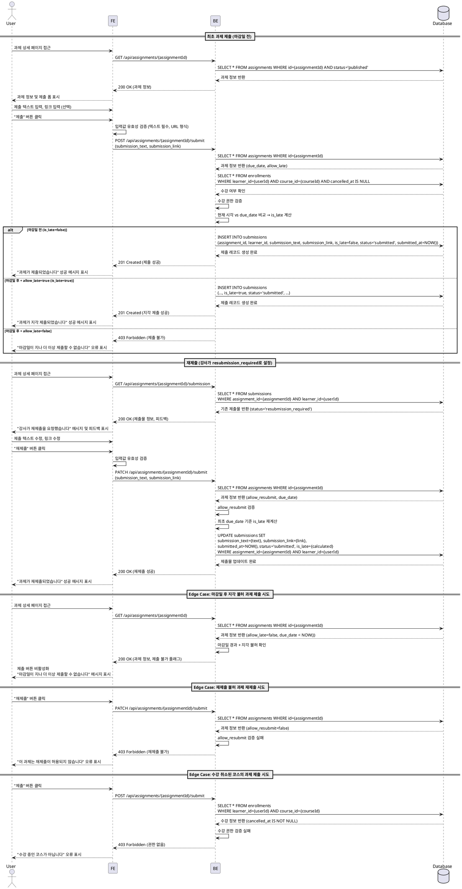

# 과제 제출/재제출 (Learner) - Use Case Specification

## Primary Actor

**Learner** (학습자)

---

## Precondition

- 사용자가 Learner 역할로 로그인되어 있다.
- 학습자가 해당 코스에 수강 신청(`enrollments`)되어 있다.
- 과제가 `published` 상태이다.

---

## Trigger

- 학습자가 과제 상세 페이지에서 "제출" 버튼을 클릭한다.
- 또는, 강사가 재제출을 요청한 과제(`status=resubmission_required`)에 대해 학습자가 "재제출" 버튼을 클릭한다.

---

## Main Scenario

### UC-005-1: 최초 과제 제출 (마감일 전)

1. 학습자가 과제 상세 페이지(`/courses/my/[courseId]/assignments/[assignmentId]/submit`)에 접근한다.
2. 시스템은 과제 정보(제목, 설명, 마감일, 점수 비중, 지각 허용 여부, 재제출 허용 여부)를 표시한다.
3. 학습자가 제출 텍스트(필수)를 입력하고, 선택적으로 링크(URL)를 입력한다.
4. 학습자가 "제출" 버튼을 클릭한다.
5. 시스템은 다음을 검증한다:
   - 과제 상태가 `published`인지 확인
   - 제출 텍스트가 비어있지 않은지 확인
   - 링크가 입력된 경우, 유효한 URL 형식인지 확인
   - 학습자가 해당 코스에 수강 중인지 확인
6. 시스템은 현재 시각과 과제의 `due_date`를 비교하여 `is_late` 값을 결정한다:
   - 현재 시각 ≤ `due_date`: `is_late=false`
   - 현재 시각 > `due_date`: 지각 여부 판단 (UC-005-2 참조)
7. 시스템은 `submissions` 테이블에 새 레코드를 생성한다 (`status=submitted`).
8. 시스템은 "과제가 제출되었습니다" 성공 메시지를 표시한다.
9. 학습자 대시보드에서 해당 과제의 상태가 "제출됨"으로 업데이트된다.

### UC-005-2: 최초 과제 제출 (마감일 후, 지각 허용)

1. 학습자가 과제 상세 페이지에 접근한다.
2. 시스템은 현재 시각이 `due_date`를 경과했음을 감지한다.
3. 시스템은 과제의 `allow_late` 값을 확인한다.
4. `allow_late=true`인 경우:
   - 시스템은 "마감일이 지났습니다. 지각 제출로 처리됩니다" 경고 메시지를 표시한다.
   - 학습자가 제출 텍스트 및 링크를 입력하고 "제출" 버튼을 클릭한다.
   - 시스템은 `submissions` 테이블에 `is_late=true`, `status=submitted`로 레코드를 생성한다.
   - 시스템은 "과제가 지각 제출되었습니다" 성공 메시지를 표시한다.
5. `allow_late=false`인 경우:
   - 시스템은 "제출" 버튼을 비활성화하고, "마감일이 지나 더 이상 제출할 수 없습니다" 오류 메시지를 표시한다.

### UC-005-3: 재제출 (강사가 재제출 요청한 경우)

1. 강사가 제출물에 대해 `status=resubmission_required`로 설정한다.
2. 학습자가 과제 상세 페이지에 접근하면, 시스템은 "강사가 재제출을 요청했습니다" 메시지와 함께 피드백을 표시한다.
3. 학습자가 제출 텍스트 및 링크를 수정하고 "재제출" 버튼을 클릭한다.
4. 시스템은 다음을 검증한다:
   - 과제의 `allow_resubmit` 값이 `true`인지 확인
   - 제출 텍스트가 비어있지 않은지 확인
   - 링크가 입력된 경우, 유효한 URL 형식인지 확인
5. 시스템은 **최초 과제의 `due_date`**를 기준으로 `is_late` 값을 재계산한다:
   - 재제출 시점이 아닌, 최초 설정된 `assignments.due_date`와 **최초 제출 시각** 또는 **재제출 시각**을 비교
   - 예: 마감일이 2025-10-01이고, 최초 제출이 2025-10-05였다면, 재제출 시에도 `is_late=true` 유지
6. 시스템은 기존 `submissions` 레코드를 업데이트한다:
   - `submission_text`, `submission_link` 갱신
   - `submitted_at` 갱신 (재제출 시각)
   - `status=submitted`로 변경
   - `is_late` 값은 위 5번 규칙에 따라 유지 또는 갱신
7. 시스템은 "과제가 재제출되었습니다" 성공 메시지를 표시한다.
8. 강사 대시보드에서 해당 제출물이 "제출됨" 상태로 다시 표시되어 재채점 대기 목록에 포함된다.

---

## Edge Cases

### E1. 과제 상태가 `closed`로 변경됨

- **조건**: 학습자가 제출 폼을 작성하는 중 과제가 `closed` 상태로 변경됨
- **처리**: "과제가 마감되어 더 이상 제출할 수 없습니다" 오류 메시지를 표시하고, 제출 버튼을 비활성화한다.

### E2. 마감일 후 지각 불허 과제에 제출 시도

- **조건**: `allow_late=false`인 과제에 대해 마감일 이후 제출 시도
- **처리**: "마감일이 지나 더 이상 제출할 수 없습니다" 오류 메시지를 표시하고, 제출을 차단한다.

### E3. 재제출 불허 과제에 재제출 시도

- **조건**: `allow_resubmit=false`인 과제에 대해 재제출 시도
- **처리**: "이 과제는 재제출이 허용되지 않습니다" 오류 메시지를 표시하고, 재제출을 차단한다.

### E4. 제출 텍스트 누락

- **조건**: 학습자가 제출 텍스트를 입력하지 않고 제출 버튼을 클릭
- **처리**: "제출 텍스트는 필수 항목입니다" 유효성 검증 오류 메시지를 표시한다.

### E5. 잘못된 링크 형식

- **조건**: 학습자가 유효하지 않은 URL을 링크 필드에 입력
- **처리**: "올바른 URL 형식을 입력해주세요" 유효성 검증 오류 메시지를 표시한다.

### E6. 수강 취소된 코스의 과제 제출 시도

- **조건**: 학습자가 수강 취소(`enrollments.cancelled_at IS NOT NULL`)한 코스의 과제에 제출 시도
- **처리**: "수강 중인 코스가 아닙니다" 권한 오류 메시지를 표시하고, 제출을 차단한다.

### E7. 네트워크 오류 또는 서버 오류

- **조건**: 제출 요청 중 네트워크 또는 서버 오류 발생
- **처리**: "일시적인 오류가 발생했습니다. 다시 시도해주세요" 오류 메시지를 표시하고, 재시도 버튼을 제공한다.

### E8. 동시성 문제 (중복 제출)

- **조건**: 학습자가 짧은 시간 내에 제출 버튼을 여러 번 클릭함
- **처리**: 첫 번째 요청만 처리하고, 이후 요청은 무시한다. 버튼을 로딩 상태로 비활성화하여 중복 클릭을 방지한다.

---

## Business Rules

### BR-005-1: 제출 필드 정책

- **제출 텍스트(`submission_text`)**: 필수 입력 항목. 비어있을 수 없음.
- **제출 링크(`submission_link`)**: 선택 항목. 입력 시 유효한 URL 형식이어야 함.
- **파일 업로드**: 현재 MVP 범위에서 미지원. `submission_file_url` 컬럼은 향후 확장용.

### BR-005-2: 마감일 및 지각 정책

- 제출 시점(`submitted_at`)이 과제의 `due_date`보다 늦으면 지각으로 처리된다.
- `allow_late=true`: 마감일 이후에도 제출 가능, `is_late=true`로 기록.
- `allow_late=false`: 마감일 이후 제출 차단.
- 지각 여부는 점수에 직접 영향을 주지 않지만, 강사가 채점 시 참고할 수 있다.

### BR-005-3: 재제출 정책

- `allow_resubmit=true`: 강사가 `status=resubmission_required`로 설정한 경우에만 재제출 가능.
- `allow_resubmit=false`: 재제출 불가. 1회 제출 후 수정 불가.
- 재제출 시, 기존 `submissions` 레코드를 UPDATE (새 레코드 생성 아님).
- **재제출 시 지각 여부 판단**: 재제출 시에도 `is_late` 값은 **최초 과제의 `due_date`를 기준**으로 계산된다.
  - 예: 마감일 2025-10-01, 최초 제출 2025-10-05 (late=true) → 재제출 2025-10-10이어도 `late=true` 유지.
  - 단, 최초 제출이 마감일 전이었고 재제출이 마감일 후라면, 재제출 시에도 `late=false` 유지.

### BR-005-4: 제출 권한 검증

- 학습자는 본인이 수강 중인(`enrollments.cancelled_at IS NULL`) 코스의 과제만 제출 가능.
- 과제 상태가 `published`일 때만 제출 가능.
- 과제 상태가 `closed`이면 제출 차단.

### BR-005-5: 제출 중복 방지

- `submissions` 테이블의 `UNIQUE(assignment_id, learner_id)` 제약으로 과제당 1개 제출만 허용.
- 재제출은 기존 레코드의 UPDATE로 처리.

### BR-005-6: 제출 상태 전이

- 최초 제출: `status=submitted`
- 강사 채점 완료: `status=graded`
- 강사 재제출 요청: `status=resubmission_required`
- 학습자 재제출: `status=submitted` (다시 채점 대기)

---

## Sequence Diagram

