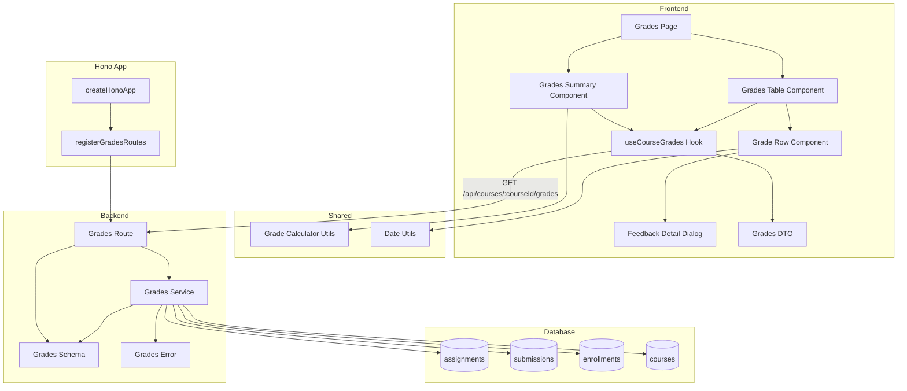

# 성적 & 피드백 열람 (Learner) 구현 계획

## 개요

### Backend Modules

| 모듈 | 위치 | 설명 |
|------|------|------|
| Grades Route | `src/features/grades/backend/route.ts` | 성적 및 피드백 조회 API 엔드포인트 |
| Grades Service | `src/features/grades/backend/service.ts` | 제출물/점수/피드백 조회 및 총점 계산 비즈니스 로직 |
| Grades Schema | `src/features/grades/backend/schema.ts` | 성적 관련 요청/응답 zod 스키마 정의 |
| Grades Error | `src/features/grades/backend/error.ts` | 성적 관련 에러 코드 정의 |

### Frontend Modules

| 모듈 | 위치 | 설명 |
|------|------|------|
| Grades Page | `src/app/(learner)/courses/my/[courseId]/grades/page.tsx` | 코스별 성적 페이지 |
| Grades Summary Component | `src/features/grades/components/grades-summary.tsx` | 성적 요약 정보 표시 컴포넌트 |
| Grades Table Component | `src/features/grades/components/grades-table.tsx` | 과제별 성적 테이블 컴포넌트 |
| Grade Row Component | `src/features/grades/components/grade-row.tsx` | 개별 과제 성적 행 컴포넌트 |
| Feedback Detail Dialog | `src/features/grades/components/feedback-detail-dialog.tsx` | 피드백 상세 보기 대화상자 |
| Grades DTO | `src/features/grades/lib/dto.ts` | 프론트엔드에서 사용할 스키마 재노출 |
| Course Grades Hook | `src/features/grades/hooks/useCourseGrades.ts` | 코스별 성적 조회 React Query hook |

### Shared Modules

| 모듈 | 위치 | 설명 |
|------|------|------|
| Grade Calculator Utils | `src/features/grades/lib/grade-calculator.ts` | 코스 총점 계산 순수 함수 |
| Date Utils | `src/lib/utils/date.ts` | 날짜 포맷팅 유틸 (기존 파일 활용) |

---

## Diagram



---

## Implementation Plan

### 1. Backend Layer

#### 1.1 Grades Error

**File:** `src/features/grades/backend/error.ts`

**구현 내용:**
```typescript
export const gradesErrorCodes = {
  invalidRequest: 'GRADES_INVALID_REQUEST',
  courseNotFound: 'GRADES_COURSE_NOT_FOUND',
  notEnrolled: 'GRADES_NOT_ENROLLED',
  unauthorized: 'GRADES_UNAUTHORIZED',
  enrollmentCancelled: 'GRADES_ENROLLMENT_CANCELLED',
} as const;

export type GradesServiceError = (typeof gradesErrorCodes)[keyof typeof gradesErrorCodes];
```

---

#### 1.2 Grades Schema

**File:** `src/features/grades/backend/schema.ts`

**구현 내용:**
```typescript
// 과제별 성적 아이템 스키마
export const GradeItemSchema = z.object({
  assignmentId: z.string().uuid(),
  assignmentTitle: z.string(),
  dueDate: z.string(), // ISO timestamp
  weight: z.number(), // 0-100 decimal
  submittedAt: z.string().nullable(), // ISO timestamp
  isLate: z.boolean().nullable(),
  status: z.enum(['not_submitted', 'submitted', 'graded', 'resubmission_required']),
  score: z.number().nullable(), // 0-100 decimal
  feedback: z.string().nullable(),
  gradedAt: z.string().nullable(), // ISO timestamp
});

// 성적 요약 스키마
export const GradesSummarySchema = z.object({
  totalAssignments: z.number().int(), // 전체 과제 수
  gradedAssignments: z.number().int(), // 채점 완료된 과제 수
  totalScore: z.number(), // 총점 (점수 × 비중 합계)
  averageScore: z.number().nullable(), // 평균 점수 (선택 사항)
});

// 코스별 성적 응답 스키마
export const CourseGradesResponseSchema = z.object({
  courseId: z.string().uuid(),
  courseTitle: z.string(),
  grades: z.array(GradeItemSchema),
  summary: GradesSummarySchema,
});

// TypeScript 타입 추출
export type GradeItem = z.infer<typeof GradeItemSchema>;
export type GradesSummary = z.infer<typeof GradesSummarySchema>;
export type CourseGradesResponse = z.infer<typeof CourseGradesResponseSchema>;
```

**Unit Test:**
```typescript
describe('CourseGradesResponseSchema', () => {
  it('should validate correct grades data', () => {
    const valid = {
      courseId: '123e4567-e89b-12d3-a456-426614174001',
      courseTitle: 'React Fundamentals',
      grades: [
        {
          assignmentId: '123e4567-e89b-12d3-a456-426614174000',
          assignmentTitle: 'Week 1 Assignment',
          dueDate: '2024-12-31T23:59:59Z',
          weight: 20,
          submittedAt: '2024-12-30T10:00:00Z',
          isLate: false,
          status: 'graded',
          score: 95,
          feedback: 'Great work!',
          gradedAt: '2024-12-31T12:00:00Z',
        },
      ],
      summary: {
        totalAssignments: 5,
        gradedAssignments: 3,
        totalScore: 57.0,
        averageScore: 95.0,
      },
    };
    expect(CourseGradesResponseSchema.safeParse(valid).success).toBe(true);
  });

  it('should allow null values for optional fields', () => {
    const valid = {
      courseId: '123e4567-e89b-12d3-a456-426614174001',
      courseTitle: 'React Fundamentals',
      grades: [
        {
          assignmentId: '123e4567-e89b-12d3-a456-426614174000',
          assignmentTitle: 'Week 1 Assignment',
          dueDate: '2024-12-31T23:59:59Z',
          weight: 20,
          submittedAt: null,
          isLate: null,
          status: 'not_submitted',
          score: null,
          feedback: null,
          gradedAt: null,
        },
      ],
      summary: {
        totalAssignments: 1,
        gradedAssignments: 0,
        totalScore: 0,
        averageScore: null,
      },
    };
    expect(CourseGradesResponseSchema.safeParse(valid).success).toBe(true);
  });

  it('should reject invalid status', () => {
    const invalid = {
      courseId: '123e4567-e89b-12d3-a456-426614174001',
      courseTitle: 'React Fundamentals',
      grades: [
        {
          assignmentId: '123e4567-e89b-12d3-a456-426614174000',
          assignmentTitle: 'Week 1 Assignment',
          dueDate: '2024-12-31T23:59:59Z',
          weight: 20,
          submittedAt: null,
          isLate: null,
          status: 'invalid_status',
          score: null,
          feedback: null,
          gradedAt: null,
        },
      ],
      summary: {
        totalAssignments: 1,
        gradedAssignments: 0,
        totalScore: 0,
        averageScore: null,
      },
    };
    expect(CourseGradesResponseSchema.safeParse(invalid).success).toBe(false);
  });
});
```

---

#### 1.3 Grades Service

**File:** `src/features/grades/backend/service.ts`

**구현 내용:**

##### 1.3.1 `getCourseGrades` 함수
- 특정 코스의 학습자 성적 조회
- 검증:
  1. 코스 존재 여부 확인
  2. 학습자가 해당 코스에 수강 등록되어 있는지 확인
  3. 수강 취소되지 않았는지 확인 (`cancelled_at IS NULL`)
- 쿼리:
  1. `assignments` 테이블에서 코스의 모든 과제 조회 (draft 제외)
  2. LEFT JOIN `submissions` 테이블로 학습자의 제출 이력 결합
  3. `due_date` 오름차순 정렬
- 응답:
  - 각 과제의 성적 정보 (과제 제목, 마감일, 비중, 제출 일시, 지각 여부, 상태, 점수, 피드백, 채점 일시)
  - 성적 요약 (전체 과제 수, 채점 완료 과제 수, 총점, 평균 점수)
  - 코스 정보 (코스 ID, 제목)

##### 1.3.2 헬퍼 함수
- `checkEnrollment(supabase, learnerId, courseId)`: 수강 여부 확인 (assignments service와 공통 로직이므로 공통 모듈로 분리 고려)
- `calculateTotalScore(grades)`: 총점 계산 (채점 완료된 과제의 점수 × 비중 / 100 합계)
- `calculateAverageScore(grades)`: 평균 점수 계산 (채점 완료된 과제의 평균)

**Unit Test:**
```typescript
describe('getCourseGrades', () => {
  it('should return grades for enrolled learner', async () => {
    const result = await getCourseGrades(
      mockSupabaseClient,
      'learner-id',
      'course-id'
    );

    expect(result.ok).toBe(true);
    expect(result.data.grades).toHaveLength(3);
    expect(result.data.summary.totalAssignments).toBe(3);
    expect(result.data.summary.gradedAssignments).toBe(2);
    expect(result.data.summary.totalScore).toBeCloseTo(38.0); // 95*0.2 + 90*0.2 = 19 + 18 = 37
  });

  it('should return error when not enrolled', async () => {
    mockSupabaseClient.from.mockReturnValue({
      select: jest.fn().mockReturnValue({
        eq: jest.fn().mockReturnValue({
          eq: jest.fn().mockReturnValue({
            is: jest.fn().mockReturnValue({
              maybeSingle: jest.fn().mockResolvedValue({ data: null, error: null }),
            }),
          }),
        }),
      }),
    });

    const result = await getCourseGrades(
      mockSupabaseClient,
      'learner-id',
      'course-id'
    );

    expect(result.ok).toBe(false);
    expect(result.error.code).toBe('GRADES_NOT_ENROLLED');
  });

  it('should return error when enrollment is cancelled', async () => {
    mockSupabaseClient.from.mockReturnValue({
      select: jest.fn().mockReturnValue({
        eq: jest.fn().mockReturnValue({
          eq: jest.fn().mockReturnValue({
            is: jest.fn().mockReturnValue({
              maybeSingle: jest.fn().mockResolvedValue({
                data: null, // cancelled_at이 NULL이 아닌 경우
                error: null,
              }),
            }),
          }),
        }),
      }),
    });

    const result = await getCourseGrades(
      mockSupabaseClient,
      'learner-id',
      'course-id'
    );

    expect(result.ok).toBe(false);
    expect(result.error.code).toBe('GRADES_ENROLLMENT_CANCELLED');
  });

  it('should calculate total score correctly', async () => {
    // Mock: 과제 3개, 채점 완료 2개
    // 과제1: score=95, weight=20 → 95 * 20 / 100 = 19
    // 과제2: score=90, weight=20 → 90 * 20 / 100 = 18
    // 총점: 19 + 18 = 37

    const result = await getCourseGrades(
      mockSupabaseClient,
      'learner-id',
      'course-id'
    );

    expect(result.ok).toBe(true);
    expect(result.data.summary.totalScore).toBeCloseTo(37.0);
  });

  it('should calculate average score correctly', async () => {
    // Mock: 채점 완료 2개 (95, 90)
    // 평균: (95 + 90) / 2 = 92.5

    const result = await getCourseGrades(
      mockSupabaseClient,
      'learner-id',
      'course-id'
    );

    expect(result.ok).toBe(true);
    expect(result.data.summary.averageScore).toBeCloseTo(92.5);
  });

  it('should return null average when no graded assignments', async () => {
    // Mock: 채점 완료 0개

    const result = await getCourseGrades(
      mockSupabaseClient,
      'learner-id',
      'course-id'
    );

    expect(result.ok).toBe(true);
    expect(result.data.summary.averageScore).toBeNull();
  });

  it('should include all assignment statuses', async () => {
    // Mock: not_submitted, submitted, graded, resubmission_required

    const result = await getCourseGrades(
      mockSupabaseClient,
      'learner-id',
      'course-id'
    );

    expect(result.ok).toBe(true);
    expect(result.data.grades[0].status).toBe('not_submitted');
    expect(result.data.grades[1].status).toBe('submitted');
    expect(result.data.grades[2].status).toBe('graded');
    expect(result.data.grades[3].status).toBe('resubmission_required');
  });

  it('should exclude draft assignments', async () => {
    // Mock: published, closed 과제만 포함

    const result = await getCourseGrades(
      mockSupabaseClient,
      'learner-id',
      'course-id'
    );

    expect(result.ok).toBe(true);
    result.data.grades.forEach((grade: any) => {
      // 여기서는 assignment status가 grades에 포함되지 않지만,
      // service에서 draft 제외 로직 검증 필요
    });
  });
});

describe('calculateTotalScore', () => {
  it('should calculate total score correctly', () => {
    const grades: GradeItem[] = [
      { score: 95, weight: 20, status: 'graded', /* ... */ },
      { score: 90, weight: 30, status: 'graded', /* ... */ },
      { score: null, weight: 10, status: 'submitted', /* ... */ },
    ];

    // 95 * 20 / 100 + 90 * 30 / 100 = 19 + 27 = 46
    expect(calculateTotalScore(grades)).toBeCloseTo(46.0);
  });

  it('should return 0 when no graded assignments', () => {
    const grades: GradeItem[] = [
      { score: null, weight: 20, status: 'submitted', /* ... */ },
      { score: null, weight: 30, status: 'not_submitted', /* ... */ },
    ];

    expect(calculateTotalScore(grades)).toBe(0);
  });

  it('should ignore non-graded assignments', () => {
    const grades: GradeItem[] = [
      { score: 95, weight: 20, status: 'graded', /* ... */ },
      { score: 90, weight: 30, status: 'submitted', /* ... */ }, // 무시
      { score: 85, weight: 10, status: 'resubmission_required', /* ... */ }, // 무시
    ];

    // 95 * 20 / 100 = 19
    expect(calculateTotalScore(grades)).toBeCloseTo(19.0);
  });
});

describe('calculateAverageScore', () => {
  it('should calculate average score correctly', () => {
    const grades: GradeItem[] = [
      { score: 95, status: 'graded', /* ... */ },
      { score: 90, status: 'graded', /* ... */ },
      { score: null, status: 'submitted', /* ... */ },
    ];

    // (95 + 90) / 2 = 92.5
    expect(calculateAverageScore(grades)).toBeCloseTo(92.5);
  });

  it('should return null when no graded assignments', () => {
    const grades: GradeItem[] = [
      { score: null, status: 'submitted', /* ... */ },
      { score: null, status: 'not_submitted', /* ... */ },
    ];

    expect(calculateAverageScore(grades)).toBeNull();
  });
});
```

---

#### 1.4 Grades Route

**File:** `src/features/grades/backend/route.ts`

**구현 내용:**
- `GET /api/courses/:courseId/grades` 엔드포인트: 코스별 성적 조회
- 사용자 인증 확인 (`x-user-id` 헤더)
- 역할 확인 (Learner만 접근 가능)
- `getCourseGrades` 서비스 호출
- 성공/실패 응답 반환 (`respond` 헬퍼 사용)

**Integration Test:**
```typescript
describe('GET /api/courses/:courseId/grades', () => {
  it('should return 200 with grades for enrolled learner', async () => {
    const response = await request(app)
      .get('/api/courses/course-id/grades')
      .set('x-user-id', 'learner-id')
      .set('x-user-role', 'learner');

    expect(response.status).toBe(200);
    expect(response.body.grades).toBeDefined();
    expect(response.body.summary).toBeDefined();
    expect(response.body.courseTitle).toBeDefined();
  });

  it('should return 401 when not authenticated', async () => {
    const response = await request(app).get('/api/courses/course-id/grades');

    expect(response.status).toBe(401);
    expect(response.body.error.code).toBe('GRADES_UNAUTHORIZED');
  });

  it('should return 403 when not enrolled', async () => {
    const response = await request(app)
      .get('/api/courses/course-id/grades')
      .set('x-user-id', 'unenrolled-learner-id')
      .set('x-user-role', 'learner');

    expect(response.status).toBe(403);
    expect(response.body.error.code).toBe('GRADES_NOT_ENROLLED');
  });

  it('should return 403 when enrollment is cancelled', async () => {
    const response = await request(app)
      .get('/api/courses/cancelled-course-id/grades')
      .set('x-user-id', 'learner-id')
      .set('x-user-role', 'learner');

    expect(response.status).toBe(403);
    expect(response.body.error.code).toBe('GRADES_ENROLLMENT_CANCELLED');
  });

  it('should return 403 when accessed by instructor', async () => {
    const response = await request(app)
      .get('/api/courses/course-id/grades')
      .set('x-user-id', 'instructor-id')
      .set('x-user-role', 'instructor');

    expect(response.status).toBe(403);
    expect(response.body.error.code).toBe('GRADES_UNAUTHORIZED');
  });

  it('should include all grade items sorted by due date', async () => {
    const response = await request(app)
      .get('/api/courses/course-id/grades')
      .set('x-user-id', 'learner-id')
      .set('x-user-role', 'learner');

    expect(response.status).toBe(200);
    expect(response.body.grades).toBeInstanceOf(Array);

    // due_date 오름차순 정렬 확인
    const dueDates = response.body.grades.map((g: any) => new Date(g.dueDate).getTime());
    expect(dueDates).toEqual([...dueDates].sort((a, b) => a - b));
  });

  it('should calculate summary correctly', async () => {
    const response = await request(app)
      .get('/api/courses/course-id/grades')
      .set('x-user-id', 'learner-id')
      .set('x-user-role', 'learner');

    expect(response.status).toBe(200);
    expect(response.body.summary.totalAssignments).toBeGreaterThanOrEqual(0);
    expect(response.body.summary.gradedAssignments).toBeLessThanOrEqual(
      response.body.summary.totalAssignments
    );
    expect(response.body.summary.totalScore).toBeGreaterThanOrEqual(0);
  });
});
```

---

#### 1.5 Register Grades Routes in Hono App

**File:** `src/backend/hono/app.ts`

**구현 내용:**
```typescript
import { registerGradesRoutes } from '@/features/grades/backend/route';

export const createHonoApp = () => {
  // ... existing code

  registerAuthRoutes(app);
  registerCoursesRoutes(app);
  registerDashboardRoutes(app);
  registerAssignmentsRoutes(app);
  registerGradesRoutes(app);  // 추가
  registerExampleRoutes(app);

  // ... rest
};
```

---

### 2. Shared Layer

#### 2.1 Grade Calculator Utils

**File:** `src/features/grades/lib/grade-calculator.ts`

**구현 내용:**
```typescript
import type { GradeItem } from '../backend/schema';

// 총점 계산: Σ(채점 완료된 과제의 점수 × 비중 / 100)
export const calculateTotalScore = (grades: GradeItem[]): number => {
  return grades.reduce((total, grade) => {
    if (grade.status === 'graded' && grade.score !== null) {
      return total + (grade.score * grade.weight) / 100;
    }
    return total;
  }, 0);
};

// 평균 점수 계산: 채점 완료된 과제의 평균
export const calculateAverageScore = (grades: GradeItem[]): number | null => {
  const gradedScores = grades
    .filter((g) => g.status === 'graded' && g.score !== null)
    .map((g) => g.score as number);

  if (gradedScores.length === 0) {
    return null;
  }

  const sum = gradedScores.reduce((acc, score) => acc + score, 0);
  return sum / gradedScores.length;
};

// 채점 완료율 계산
export const calculateCompletionRate = (
  totalAssignments: number,
  gradedAssignments: number,
): number => {
  if (totalAssignments === 0) return 0;
  return (gradedAssignments / totalAssignments) * 100;
};
```

**Unit Test:**
```typescript
describe('Grade Calculator Utils', () => {
  describe('calculateTotalScore', () => {
    it('should calculate total score correctly', () => {
      const grades: GradeItem[] = [
        { score: 95, weight: 20, status: 'graded' } as GradeItem,
        { score: 90, weight: 30, status: 'graded' } as GradeItem,
        { score: null, weight: 10, status: 'submitted' } as GradeItem,
      ];

      expect(calculateTotalScore(grades)).toBeCloseTo(46.0);
    });

    it('should return 0 when no graded assignments', () => {
      const grades: GradeItem[] = [
        { score: null, weight: 20, status: 'submitted' } as GradeItem,
      ];

      expect(calculateTotalScore(grades)).toBe(0);
    });
  });

  describe('calculateAverageScore', () => {
    it('should calculate average score correctly', () => {
      const grades: GradeItem[] = [
        { score: 95, status: 'graded' } as GradeItem,
        { score: 90, status: 'graded' } as GradeItem,
        { score: null, status: 'submitted' } as GradeItem,
      ];

      expect(calculateAverageScore(grades)).toBeCloseTo(92.5);
    });

    it('should return null when no graded assignments', () => {
      const grades: GradeItem[] = [
        { score: null, status: 'submitted' } as GradeItem,
      ];

      expect(calculateAverageScore(grades)).toBeNull();
    });
  });

  describe('calculateCompletionRate', () => {
    it('should calculate completion rate correctly', () => {
      expect(calculateCompletionRate(5, 3)).toBeCloseTo(60);
    });

    it('should return 0 when total is 0', () => {
      expect(calculateCompletionRate(0, 0)).toBe(0);
    });
  });
});
```

---

### 3. Frontend Layer

#### 3.1 Grades DTO

**File:** `src/features/grades/lib/dto.ts`

**구현 내용:**
```typescript
export {
  GradeItemSchema,
  GradesSummarySchema,
  CourseGradesResponseSchema,
  type GradeItem,
  type GradesSummary,
  type CourseGradesResponse,
} from '@/features/grades/backend/schema';

export {
  calculateTotalScore,
  calculateAverageScore,
  calculateCompletionRate,
} from './grade-calculator';
```

---

#### 3.2 Course Grades Hook

**File:** `src/features/grades/hooks/useCourseGrades.ts`

**구현 내용:**
```typescript
'use client';

import { useQuery } from '@tanstack/react-query';
import { apiClient, extractApiErrorMessage } from '@/lib/remote/api-client';
import {
  CourseGradesResponseSchema,
  type CourseGradesResponse,
} from '../lib/dto';

const fetchCourseGrades = async (
  courseId: string
): Promise<CourseGradesResponse> => {
  try {
    const { data } = await apiClient.get(`/api/courses/${courseId}/grades`);
    return CourseGradesResponseSchema.parse(data);
  } catch (error) {
    const message = extractApiErrorMessage(error, '성적 정보를 불러오지 못했습니다.');
    throw new Error(message);
  }
};

export const useCourseGrades = (courseId: string) =>
  useQuery({
    queryKey: ['grades', 'course', courseId],
    queryFn: () => fetchCourseGrades(courseId),
    enabled: Boolean(courseId),
    staleTime: 30 * 1000, // 30초 (성적 정보는 자주 변경되므로 짧게 설정)
  });
```

---

#### 3.3 Grades Summary Component

**File:** `src/features/grades/components/grades-summary.tsx`

**구현 내용:**
- 성적 요약 카드 표시
- 전체 과제 수 / 채점 완료 과제 수
- 총점 표시 (점수 × 비중 합계)
- 평균 점수 표시 (선택 사항)
- 채점 완료율 프로그레스 바
- shadcn-ui Card 컴포넌트 활용

**QA Sheet:**
| 시나리오 | 입력 | 예상 결과 |
|---------|------|----------|
| 정상 데이터 | summary 데이터 존재 | 전체 과제 수, 채점 완료 수, 총점, 평균 점수 표시 |
| 채점 완료 0개 | gradedAssignments = 0 | "아직 채점된 과제가 없습니다" 메시지 표시 |
| 평균 점수 없음 | averageScore = null | 평균 점수 영역 숨김 또는 "-" 표시 |
| 총점 소수점 처리 | totalScore = 37.5 | "37.5" 또는 "37.5점" 표시 (소수점 첫째자리까지) |

---

#### 3.4 Grade Row Component

**File:** `src/features/grades/components/grade-row.tsx`

**구현 내용:**
- 과제별 성적 행 표시
- 과제 제목 (클릭 시 과제 상세 페이지로 이동)
- 제출 일시 (상대 시간 표시)
- 마감일 표시
- 지각 여부 뱃지
- 상태 표시 (미제출/제출 완료/채점 완료/재제출 요청)
- 점수 표시 (채점 완료 시)
- 피드백 보기 버튼 (채점 완료 시, FeedbackDetailDialog 열기)
- 상태별 색상 구분

**QA Sheet:**
| 시나리오 | 입력 | 예상 결과 |
|---------|------|----------|
| 미제출 과제 | status = 'not_submitted' | "미제출" 표시, 점수/피드백 영역 빈 상태 |
| 제출 완료 과제 | status = 'submitted' | "제출 완료" 표시, 제출 일시 표시, 점수/피드백 영역 "채점 대기 중" |
| 채점 완료 과제 | status = 'graded' | "채점 완료" 표시, 점수/피드백 표시 |
| 재제출 요청 과제 | status = 'resubmission_required' | "재제출 요청" 표시, 기존 점수/피드백 표시, 재제출 버튼 활성화 |
| 지각 제출 | isLate = true | "지각" 뱃지 표시 (빨간색) |
| 피드백 보기 클릭 | 버튼 클릭 | FeedbackDetailDialog 열림 |
| 과제 제목 클릭 | 제목 클릭 | `/courses/my/[courseId]/assignments/[assignmentId]` 페이지로 이동 |

---

#### 3.5 Grades Table Component

**File:** `src/features/grades/components/grades-table.tsx`

**구현 내용:**
- `useCourseGrades` 훅 사용하여 성적 데이터 조회
- 로딩 상태 표시 (스켈레톤)
- 에러 상태 표시
- GradeRow 컴포넌트 렌더링 (테이블 레이아웃)
- 빈 목록 처리 ("등록된 과제가 없습니다" 메시지)
- 테이블 헤더 (과제명, 제출일, 마감일, 상태, 점수, 피드백)
- shadcn-ui Table 컴포넌트 활용

**QA Sheet:**
| 시나리오 | 입력 | 예상 결과 |
|---------|------|----------|
| 정상 로딩 | 페이지 접근 | 성적 테이블 표시 |
| 로딩 중 | 데이터 로딩 중 | 스켈레톤 표시 |
| 네트워크 오류 | 네트워크 끊김 | 에러 메시지 표시, 재시도 버튼 |
| 빈 목록 | 과제 없음 | "등록된 과제가 없습니다" 메시지 표시 |
| 수강하지 않은 코스 | 수강 등록 안 된 코스 | "수강 중인 코스가 아닙니다" 오류 표시 |
| 수강 취소된 코스 | cancelled_at != NULL | "수강 취소된 코스입니다" 오류 표시 |

---

#### 3.6 Feedback Detail Dialog Component

**File:** `src/features/grades/components/feedback-detail-dialog.tsx`

**구현 내용:**
- 피드백 상세 보기 대화상자
- 과제 제목 표시
- 점수 표시
- 피드백 내용 표시 (긴 텍스트 스크롤 가능)
- 채점 일시 표시
- "닫기" 버튼
- shadcn-ui Dialog 컴포넌트 활용

**QA Sheet:**
| 시나리오 | 입력 | 예상 결과 |
|---------|------|----------|
| 대화상자 열기 | 피드백 보기 버튼 클릭 | 피드백 상세 대화상자 표시 |
| 긴 피드백 | 피드백 텍스트 긴 경우 | 스크롤 가능, 레이아웃 깨지지 않음 |
| 닫기 버튼 | 버튼 클릭 | 대화상자 닫힘 |
| ESC 키 | ESC 키 누름 | 대화상자 닫힘 |

---

#### 3.7 Grades Page

**File:** `src/app/(learner)/courses/my/[courseId]/grades/page.tsx`

**구현 내용:**
- GradesSummary 컴포넌트 포함
- GradesTable 컴포넌트 포함
- 동적 라우트 파라미터 (`courseId`) 처리
- `params` promise 규약 준수
- SEO 메타데이터
- "use client" 지시문

**QA Sheet:**
| 시나리오 | 입력 | 예상 결과 |
|---------|------|----------|
| 페이지 접근 | `/courses/my/[courseId]/grades` 접근 | 성적 페이지 표시 |
| 수강하지 않은 코스 | 수강 등록 안 된 코스 | "수강 중인 코스가 아닙니다" 오류, 코스 카탈로그로 리다이렉트 |
| 수강 취소된 코스 | cancelled_at != NULL | "수강 취소된 코스입니다" 오류 표시 |
| 모바일 뷰 | 모바일 화면 | 반응형 레이아웃, 테이블 스크롤 가능 |

---

### 4. Integration & E2E Testing

#### 4.1 Full Flow Test

**시나리오:**
1. 학습자 로그인
2. 내 코스 페이지 접근
3. "성적 보기" 버튼 클릭
4. 성적 페이지로 이동
5. 성적 요약 정보 확인 (전체 과제 수, 채점 완료 수, 총점, 평균)
6. 과제별 성적 테이블 확인
7. 채점 완료된 과제의 점수 확인
8. "피드백 보기" 버튼 클릭
9. 피드백 상세 대화상자 확인
10. 재제출 요청된 과제의 경우, 과제 상세 페이지로 이동 가능

**수동 QA:**
- 브라우저에서 실제 플로우 테스트
- 개발자 도구 네트워크 탭에서 API 요청/응답 확인
- 다양한 상태 시나리오 테스트 (미제출, 제출 완료, 채점 완료, 재제출 요청)
- 총점 계산 정확성 검증 (점수 × 비중 / 100 합계)

---

## Implementation Order

1. **Shared**: Grade Calculator Utils 구현 및 테스트
2. **Backend Error**: `grades/backend/error.ts` 구현
3. **Backend Schema**: `grades/backend/schema.ts` 구현 및 테스트
4. **Backend Service**: `grades/backend/service.ts` 구현 및 테스트
   - `checkEnrollment` 헬퍼 (assignments service와 공통 로직이므로 공통 모듈로 분리 고려)
   - `calculateTotalScore` 헬퍼
   - `calculateAverageScore` 헬퍼
   - `getCourseGrades` 구현
5. **Backend Route**: `grades/backend/route.ts` 구현 및 테스트
6. **Backend Integration**: Hono App에 라우터 등록
7. **Frontend DTO**: `grades/lib/dto.ts` 재노출
8. **Frontend Hook**: `useCourseGrades` 구현
9. **Frontend Components**: 컴포넌트 구현
   - `GradesSummary`
   - `GradeRow`
   - `GradesTable`
   - `FeedbackDetailDialog`
10. **Frontend Page**: Grades Page 구현
11. **Integration Test**: Full flow 수동 QA

---

## Notes

### 비즈니스 규칙

- **본인 제출물만 조회**: 로그인한 사용자의 `learner_id`와 일치하는 제출물만 조회 가능
- **수강 중인 코스만 접근**: `enrollments` 테이블에서 `cancelled_at`이 NULL인 활성 수강 레코드가 있는 코스만 접근 가능
- **코스 총점 계산 공식**: 총점 = Σ (채점 완료된 과제의 점수 × 과제 비중 / 100)
  - `status=graded`인 제출물만 총점 계산에 포함
- **과제별 상태 표시**:
  - `not_submitted`: 미제출 (점수/피드백 미표시)
  - `submitted`: 제출 완료, 채점 대기 중 (점수/피드백 미표시)
  - `graded`: 채점 완료 (점수/피드백 표시)
  - `resubmission_required`: 재제출 요청됨 (기존 점수/피드백 표시 + 재제출 버튼 활성화)
- **지각 여부 표시**: `is_late=true`인 제출물은 "지각" 뱃지 표시
- **재제출 정책**:
  - `allow_resubmit=true`이고 `status=resubmission_required`인 과제만 재제출 가능
  - 재제출 시에도 최초 `assignments.due_date`를 기준으로 `is_late` 판단 (이미 구현됨)
- **피드백 필수**: 강사가 채점 완료 시 피드백은 필수 입력 사항
- **점수 범위**: 모든 점수는 0~100점 범위 내
- **비중 합계**: 과제별 비중(`weight`)은 코스별로 합산 시 100을 초과할 수 있음 (유연한 설계)
- **Draft/Closed 과제 포함**: `status=draft`인 과제는 성적 페이지에 표시하지 않음. `status=closed` 또는 `status=published`인 과제만 표시

### 기술적 고려사항

- **인증**: 모든 API는 `x-user-id` 헤더로 사용자 ID 추출 (추후 JWT로 전환 예정)
- **권한 검증**: Learner 역할만 성적 페이지 접근 가능
- **에러 처리**: 모든 API 호출에서 에러 메시지를 사용자에게 표시 (toast 또는 inline)
- **날짜 표시**: 한국어 로케일 사용 (`date-fns/locale/ko`)
- **캐싱**: React Query의 `staleTime`을 30초로 설정 (성적 정보는 자주 변경되므로 짧게 설정)
- **타입 안전성**: 백엔드 스키마를 프론트엔드에서 재사용하여 타입 일관성 유지
- **소수점 처리**: 점수와 총점은 소수점 첫째자리까지 표시 (예: 95.5, 37.3)

### 기존 코드와의 통합

- `assignments` feature에서 이미 `submissions` 테이블 조회 로직 존재, 참고하여 일관성 유지
- `checkEnrollment` 헬퍼 함수는 assignments service와 공통 로직이므로, 향후 `src/features/shared/enrollment-utils.ts` 등으로 공통 모듈로 분리 고려
- `date-fns` 기반 날짜 유틸리티는 기존 `src/lib/utils/date.ts` 파일 활용
- `respond` 헬퍼는 `src/backend/http/response.ts`에서 제공하는 공통 헬퍼 사용

### 추후 확장

- 성적 내보내기 기능 (CSV, PDF)
- 성적 추이 그래프 (시간별 점수 변화)
- 코스별 성적 분포 비교 (다른 학습자와 비교)
- 성적 알림 (채점 완료 시 이메일, 푸시)
- 성적 통계 (과목별 평균, 중간값, 표준편차)
