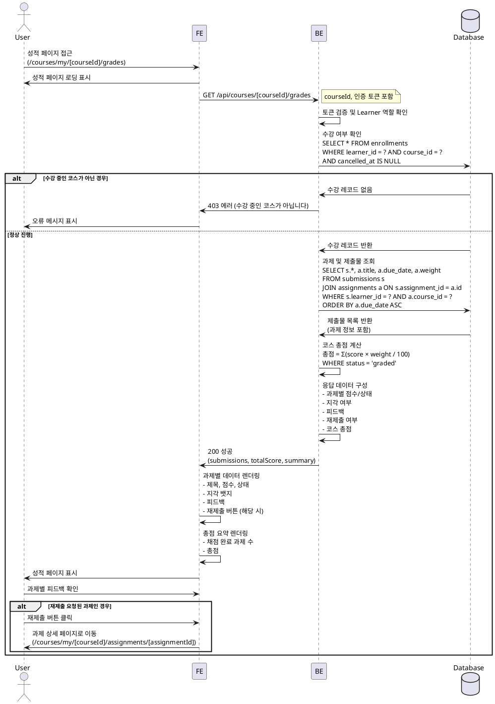

# 성적 & 피드백 열람 (Learner)

## Primary Actor
- Learner (학습자)

## Precondition
- 사용자가 Learner 역할로 로그인되어 있음
- 사용자가 최소 1개 이상의 코스를 수강 중임
- 수강 중인 코스에 최소 1개 이상의 과제가 게시되어 있음

## Trigger
- 사용자가 성적 페이지에 접근 (예: `/courses/my/[courseId]/grades`)

## Main Scenario

1. 사용자가 특정 코스의 성적 페이지로 이동
2. 시스템이 사용자 권한을 검증 (Learner 역할 확인)
3. 시스템이 해당 코스의 수강 여부를 확인
4. 시스템이 사용자의 제출물 목록을 조회
   - 제출물이 연결된 과제 정보 포함
   - 과제별 점수, 지각 여부, 재제출 여부, 피드백 정보 조회
5. 시스템이 과제별 점수 × 비중을 계산하여 코스 총점 산출
6. 시스템이 과제별 상태를 분류
   - `submitted`: 제출 완료 (채점 대기)
   - `graded`: 채점 완료
   - `resubmission_required`: 재제출 요청됨
7. 시스템이 과제별 정보를 화면에 표시
   - 과제 제목
   - 제출 일시
   - 마감일
   - 지각 여부 (`is_late`)
   - 현재 상태 (`status`)
   - 점수 (채점 완료 시)
   - 피드백 (채점 완료 시)
   - 재제출 요청 여부
8. 시스템이 코스 총점 요약 정보를 표시
   - 채점 완료된 과제 수 / 전체 과제 수
   - 총점 (점수 × 비중 합계)
   - 평균 점수 (선택 사항)
9. 사용자가 과제별 상세 피드백을 확인
10. 사용자가 재제출 요청된 과제의 경우, 과제 상세 페이지로 이동 가능

## Edge Cases

### 수강하지 않은 코스 접근
- 수강하지 않은 코스의 성적 페이지 접근 시 "수강 중인 코스가 아닙니다" 오류 메시지 표시 및 403 에러 반환

### 제출물이 없는 경우
- 아직 제출하지 않은 과제가 있을 경우 "미제출" 상태로 표시하며, 점수 및 피드백 영역은 빈 상태로 표시

### 채점 대기 중인 과제
- `status=submitted`인 과제는 "채점 대기 중" 상태로 표시하며, 점수와 피드백은 표시하지 않음

### 코스에 과제가 없는 경우
- 코스에 게시된 과제가 없는 경우 "등록된 과제가 없습니다" 메시지 표시

### 수강 취소된 경우
- 수강 취소(`cancelled_at`이 NULL이 아닌 경우) 시 성적 페이지 접근 차단 및 "수강 취소된 코스입니다" 메시지 표시

### 네트워크 오류
- 데이터 조회 중 네트워크 오류 발생 시 "일시적인 오류가 발생했습니다. 다시 시도해주세요" 메시지 표시

### 권한 오류
- Instructor 또는 Operator가 Learner 성적 페이지에 접근 시 "권한이 없습니다" 오류 메시지 표시 및 403 에러 반환

## Business Rules

1. **본인 제출물만 조회**: 로그인한 사용자의 `learner_id`와 일치하는 제출물만 조회 가능
2. **수강 중인 코스만 접근**: `enrollments` 테이블에서 `cancelled_at`이 NULL인 활성 수강 레코드가 있는 코스만 접근 가능
3. **코스 총점 계산 공식**:
   - 총점 = Σ (채점 완료된 과제의 점수 × 과제 비중 / 100)
   - `status=graded`인 제출물만 총점 계산에 포함
4. **과제별 상태 표시**:
   - `submitted`: 채점 대기 중 (점수/피드백 미표시)
   - `graded`: 채점 완료 (점수/피드백 표시)
   - `resubmission_required`: 재제출 요청됨 (기존 점수/피드백 표시 + 재제출 버튼 활성화)
5. **지각 여부 표시**: `is_late=true`인 제출물은 "지각" 뱃지 표시
6. **재제출 정책**:
   - `allow_resubmit=true`이고 `status=resubmission_required`인 과제만 재제출 가능
   - 재제출 시에도 최초 `assignments.due_date`를 기준으로 `is_late` 판단
7. **피드백 필수**: 강사가 채점 완료 시 피드백은 필수 입력 사항
8. **점수 범위**: 모든 점수는 0~100점 범위 내
9. **비중 합계**: 과제별 비중(`weight`)은 코스별로 합산 시 100을 초과할 수 있음 (유연한 설계)
10. **Draft/Closed 과제 제외**: `status=draft` 또는 `status=closed`인 과제는 성적 페이지에 표시하지 않음 (단, 제출물이 있는 경우 표시 가능)

## Sequence Diagram

