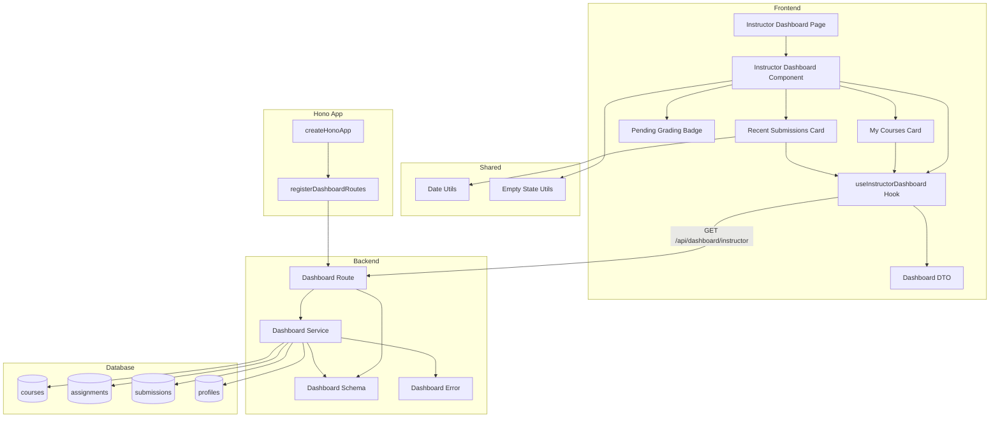

# Instructor 대시보드 구현 계획

## 개요

### Backend Modules

| 모듈 | 위치 | 설명 |
|------|------|------|
| Instructor Dashboard Route | `src/features/dashboard/backend/route.ts` | Instructor 대시보드 API 엔드포인트 추가 (기존 파일 확장) |
| Instructor Dashboard Service | `src/features/dashboard/backend/service.ts` | Instructor 대시보드 비즈니스 로직 (기존 파일 확장) |
| Instructor Dashboard Schema | `src/features/dashboard/backend/schema.ts` | 응답 DTO zod 스키마 정의 (기존 파일 확장) |
| Dashboard Error | `src/features/dashboard/backend/error.ts` | 에러 코드 정의 (기존 파일 활용) |

### Frontend Modules

| 모듈 | 위치 | 설명 |
|------|------|------|
| Instructor Dashboard Page | `src/app/(instructor)/dashboard/page.tsx` | Instructor 대시보드 페이지 (신규) |
| Instructor Dashboard Component | `src/features/dashboard/components/instructor-dashboard.tsx` | Instructor 대시보드 UI 컴포넌트 (신규) |
| My Courses Card | `src/features/dashboard/components/my-courses-card.tsx` | 내 코스 목록 카드 컴포넌트 (신규) |
| Pending Grading Badge | `src/features/dashboard/components/pending-grading-badge.tsx` | 채점 대기 수 배지 컴포넌트 (신규) |
| Recent Submissions Card | `src/features/dashboard/components/recent-submissions-card.tsx` | 최근 제출물 목록 카드 컴포넌트 (신규) |
| Dashboard DTO | `src/features/dashboard/lib/dto.ts` | 프론트엔드 공유용 스키마 재노출 (기존 파일 확장) |
| Instructor Dashboard Hook | `src/features/dashboard/hooks/useInstructorDashboard.ts` | Instructor 대시보드 조회 React Query hook (신규) |

### Shared Modules

| 모듈 | 위치 | 설명 |
|------|------|------|
| Date Utils | `src/lib/utils/date.ts` | 날짜 포맷팅 유틸 (기존 파일 활용) |
| Empty State Utils | `src/features/dashboard/lib/empty-state.ts` | 빈 상태 메시지 구성 유틸 (기존 파일 활용, 필요시 확장) |

---

## Diagram



---

## Implementation Plan

### 1. Backend Layer

#### 1.1 Dashboard Schema (기존 파일 확장)

**File:** `src/features/dashboard/backend/schema.ts`

**구현 내용:**

```typescript
// 기존 Learner 스키마는 유지하고, Instructor용 스키마 추가

// Instructor: 내 코스 아이템
export const MyCourseItemSchema = z.object({
  courseId: z.string().uuid(),
  courseTitle: z.string(),
  status: z.enum(['draft', 'published', 'archived']),
  enrollmentsCount: z.number().int().min(0),
  createdAt: z.string(), // ISO timestamp
});

// Instructor: 최근 제출물 아이템
export const RecentSubmissionItemSchema = z.object({
  submissionId: z.string().uuid(),
  assignmentId: z.string().uuid(),
  assignmentTitle: z.string(),
  courseId: z.string().uuid(),
  courseTitle: z.string(),
  learnerName: z.string(),
  status: z.enum(['submitted', 'graded', 'resubmission_required']),
  submittedAt: z.string(), // ISO timestamp
  isLate: z.boolean(),
});

// Instructor 대시보드 응답 스키마
export const InstructorDashboardResponseSchema = z.object({
  courses: z.array(MyCourseItemSchema),
  pendingGradingCount: z.number().int().min(0),
  recentSubmissions: z.array(RecentSubmissionItemSchema),
});

export type MyCourseItem = z.infer<typeof MyCourseItemSchema>;
export type RecentSubmissionItem = z.infer<typeof RecentSubmissionItemSchema>;
export type InstructorDashboardResponse = z.infer<typeof InstructorDashboardResponseSchema>;
```

**Unit Test:**

```typescript
describe('InstructorDashboardResponseSchema', () => {
  it('should validate correct instructor dashboard data', () => {
    const valid = {
      courses: [
        {
          courseId: '123e4567-e89b-12d3-a456-426614174000',
          courseTitle: 'React Fundamentals',
          status: 'published',
          enrollmentsCount: 25,
          createdAt: '2024-10-01T12:00:00Z',
        },
      ],
      pendingGradingCount: 5,
      recentSubmissions: [
        {
          submissionId: '123e4567-e89b-12d3-a456-426614174001',
          assignmentId: '123e4567-e89b-12d3-a456-426614174002',
          assignmentTitle: 'Week 1 Assignment',
          courseId: '123e4567-e89b-12d3-a456-426614174000',
          courseTitle: 'React Fundamentals',
          learnerName: 'John Doe',
          status: 'submitted',
          submittedAt: '2024-10-08T10:00:00Z',
          isLate: false,
        },
      ],
    };
    expect(InstructorDashboardResponseSchema.safeParse(valid).success).toBe(true);
  });

  it('should allow empty arrays', () => {
    const valid = {
      courses: [],
      pendingGradingCount: 0,
      recentSubmissions: [],
    };
    expect(InstructorDashboardResponseSchema.safeParse(valid).success).toBe(true);
  });

  it('should reject invalid course status', () => {
    const invalid = {
      courses: [
        {
          courseId: '123e4567-e89b-12d3-a456-426614174000',
          courseTitle: 'React Fundamentals',
          status: 'invalid_status',
          enrollmentsCount: 25,
          createdAt: '2024-10-01T12:00:00Z',
        },
      ],
      pendingGradingCount: 0,
      recentSubmissions: [],
    };
    expect(InstructorDashboardResponseSchema.safeParse(invalid).success).toBe(false);
  });

  it('should reject negative pending grading count', () => {
    const invalid = {
      courses: [],
      pendingGradingCount: -1,
      recentSubmissions: [],
    };
    expect(InstructorDashboardResponseSchema.safeParse(invalid).success).toBe(false);
  });
});
```

---

#### 1.2 Dashboard Service (기존 파일 확장)

**File:** `src/features/dashboard/backend/service.ts`

**구현 내용:**

##### 1.2.1 `getInstructorDashboard` 함수

- Instructor의 대시보드 데이터를 조회
- 검증:
  1. `instructorId` 파라미터 필수
- 쿼리:
  1. `courses` 테이블에서 본인이 개설한 코스 목록 조회 (모든 상태: draft/published/archived)
  2. 각 코스의 `enrollments_count` 포함
  3. `assignments` + `submissions` 테이블 JOIN하여 채점 대기 수 계산 (status='submitted')
  4. `submissions` 테이블에서 최근 제출물 조회 (최신순 10개, profiles JOIN하여 learner 이름 포함)
- 응답:
  - 내 코스 목록 (코스 ID, 제목, 상태, 수강생 수, 생성일시)
  - 채점 대기 수
  - 최근 제출물 목록 (제출물 ID, 과제 ID, 과제명, 코스 ID, 코스명, 제출자 이름, 상태, 제출일시, 지각 여부)

**구현 코드:**

```typescript
export const getInstructorDashboard = async (
  supabase: SupabaseClient,
  instructorId: string,
): Promise<HandlerResult<InstructorDashboardResponse, DashboardServiceError>> => {
  try {
    // 1. 본인이 개설한 코스 목록 조회
    const { data: courses, error: coursesError } = await supabase
      .from('courses')
      .select('id, title, status, enrollments_count, created_at')
      .eq('instructor_id', instructorId)
      .order('created_at', { ascending: false });

    if (coursesError) {
      return failure(
        500,
        dashboardErrorCodes.fetchError,
        `코스 목록을 가져오는 중 오류가 발생했습니다: ${coursesError.message}`,
      );
    }

    if (!courses || courses.length === 0) {
      return success({
        courses: [],
        pendingGradingCount: 0,
        recentSubmissions: [],
      });
    }

    const courseIds = courses.map((c: any) => c.id);

    // 2. 채점 대기 수 계산 (본인 코스의 과제 중 status='submitted'인 제출물)
    const { data: pendingSubmissions, error: pendingError } = await supabase
      .from('submissions')
      .select('id, assignment_id')
      .eq('status', 'submitted')
      .in(
        'assignment_id',
        supabase
          .from('assignments')
          .select('id')
          .in('course_id', courseIds)
      );

    if (pendingError) {
      return failure(
        500,
        dashboardErrorCodes.fetchError,
        `채점 대기 수를 계산하는 중 오류가 발생했습니다: ${pendingError.message}`,
      );
    }

    const pendingGradingCount = pendingSubmissions?.length || 0;

    // 3. 최근 제출물 조회 (최신순 10개)
    const { data: recentSubmissionsData, error: submissionsError } = await supabase
      .from('submissions')
      .select(
        `
        id,
        assignment_id,
        learner_id,
        status,
        submitted_at,
        is_late,
        assignments!inner(id, title, course_id),
        profiles!inner(id, name)
      `,
      )
      .in('assignment_id',
        supabase
          .from('assignments')
          .select('id')
          .in('course_id', courseIds)
      )
      .order('submitted_at', { ascending: false })
      .limit(10);

    if (submissionsError) {
      return failure(
        500,
        dashboardErrorCodes.fetchError,
        `최근 제출물을 가져오는 중 오류가 발생했습니다: ${submissionsError.message}`,
      );
    }

    // 4. 응답 DTO 변환
    const myCourses: MyCourseItem[] = courses.map((c: any) => ({
      courseId: c.id,
      courseTitle: c.title,
      status: c.status,
      enrollmentsCount: c.enrollments_count || 0,
      createdAt: c.created_at,
    }));

    const recentSubmissions: RecentSubmissionItem[] = (recentSubmissionsData || []).map(
      (s: any) => {
        const assignment = s.assignments;
        const profile = s.profiles;
        const course = courses.find((c: any) => c.id === assignment.course_id);

        return {
          submissionId: s.id,
          assignmentId: assignment.id,
          assignmentTitle: assignment.title,
          courseId: assignment.course_id,
          courseTitle: course?.title || '',
          learnerName: profile?.name || 'Unknown',
          status: s.status,
          submittedAt: s.submitted_at,
          isLate: s.is_late,
        };
      },
    );

    return success({
      courses: myCourses,
      pendingGradingCount,
      recentSubmissions,
    });
  } catch (err) {
    return failure(
      500,
      dashboardErrorCodes.fetchError,
      err instanceof Error ? err.message : 'Unknown error',
    );
  }
};
```

**Unit Test:**

```typescript
describe('getInstructorDashboard', () => {
  it('should return dashboard data for instructor with courses', async () => {
    const mockCourses = [
      {
        id: 'course-1',
        title: 'React Fundamentals',
        status: 'published',
        enrollments_count: 25,
        created_at: '2024-10-01T12:00:00Z',
      },
    ];

    const mockPendingSubmissions = [
      { id: 'sub-1', assignment_id: 'assign-1' },
      { id: 'sub-2', assignment_id: 'assign-2' },
    ];

    const mockRecentSubmissions = [
      {
        id: 'sub-1',
        assignment_id: 'assign-1',
        learner_id: 'learner-1',
        status: 'submitted',
        submitted_at: '2024-10-08T10:00:00Z',
        is_late: false,
        assignments: { id: 'assign-1', title: 'Week 1', course_id: 'course-1' },
        profiles: { id: 'learner-1', name: 'John Doe' },
      },
    ];

    mockSupabaseClient.from.mockImplementation((table: string) => {
      if (table === 'courses') {
        return {
          select: jest.fn().mockReturnValue({
            eq: jest.fn().mockReturnValue({
              order: jest.fn().mockResolvedValue({ data: mockCourses, error: null }),
            }),
          }),
        };
      }
      if (table === 'submissions') {
        return {
          select: jest.fn().mockReturnValue({
            eq: jest.fn().mockReturnValue({
              in: jest.fn().mockResolvedValue({ data: mockPendingSubmissions, error: null }),
            }),
            in: jest.fn().mockReturnValue({
              order: jest.fn().mockReturnValue({
                limit: jest.fn().mockResolvedValue({ data: mockRecentSubmissions, error: null }),
              }),
            }),
          }),
        };
      }
      return {} as any;
    });

    const result = await getInstructorDashboard(mockSupabaseClient, 'instructor-1');

    expect(result.ok).toBe(true);
    expect(result.data.courses).toHaveLength(1);
    expect(result.data.pendingGradingCount).toBe(2);
    expect(result.data.recentSubmissions).toHaveLength(1);
  });

  it('should return empty data when instructor has no courses', async () => {
    mockSupabaseClient.from.mockImplementation(() => ({
      select: jest.fn().mockReturnValue({
        eq: jest.fn().mockReturnValue({
          order: jest.fn().mockResolvedValue({ data: [], error: null }),
        }),
      }),
    }));

    const result = await getInstructorDashboard(mockSupabaseClient, 'instructor-1');

    expect(result.ok).toBe(true);
    expect(result.data.courses).toEqual([]);
    expect(result.data.pendingGradingCount).toBe(0);
    expect(result.data.recentSubmissions).toEqual([]);
  });

  it('should return error when database query fails', async () => {
    mockSupabaseClient.from.mockImplementation(() => ({
      select: jest.fn().mockReturnValue({
        eq: jest.fn().mockReturnValue({
          order: jest.fn().mockResolvedValue({
            data: null,
            error: { message: 'Database error' },
          }),
        }),
      }),
    }));

    const result = await getInstructorDashboard(mockSupabaseClient, 'instructor-1');

    expect(result.ok).toBe(false);
    expect(result.error.code).toBe(dashboardErrorCodes.fetchError);
  });
});
```

---

#### 1.3 Dashboard Route (기존 파일 확장)

**File:** `src/features/dashboard/backend/route.ts`

**구현 내용:**

- `GET /api/dashboard/instructor` 엔드포인트 추가
- 사용자 인증 확인 (`x-user-id` 헤더)
- 역할 확인 (Instructor만 접근 가능, 선택적으로 `x-user-role` 헤더 검증)
- `getInstructorDashboard` 서비스 호출
- 성공/실패 응답 반환 (`respond` 헬퍼 사용)

**구현 코드:**

```typescript
export const registerDashboardRoutes = (app: Hono<AppEnv>) => {
  // 기존 Learner 라우트 유지
  app.get('/api/dashboard/learner', async (c) => {
    // ... 기존 코드
  });

  // Instructor 라우트 추가
  app.get('/api/dashboard/instructor', async (c) => {
    const logger = getLogger(c);
    logger.info('Get instructor dashboard request received at /api/dashboard/instructor');

    const userId = c.req.header('x-user-id');

    if (!userId) {
      logger.error('[Dashboard Route] Permission denied - x-user-id header missing');
      return respond(
        c,
        failure(401, dashboardErrorCodes.permissionDenied, '인증이 필요합니다.'),
      );
    }

    // 선택적: 역할 검증 (필요시 주석 해제)
    // const userRole = c.req.header('x-user-role');
    // if (userRole !== 'instructor') {
    //   logger.error('[Dashboard Route] Permission denied - not an instructor');
    //   return respond(
    //     c,
    //     failure(403, dashboardErrorCodes.permissionDenied, '강사 권한이 필요합니다.'),
    //   );
    // }

    const supabase = getSupabase(c);
    const result = await getInstructorDashboard(supabase, userId);

    return respond(c, result);
  });
};
```

**Integration Test:**

```typescript
describe('GET /api/dashboard/instructor', () => {
  it('should return 200 with dashboard data for authenticated instructor', async () => {
    const response = await request(app)
      .get('/api/dashboard/instructor')
      .set('x-user-id', 'instructor-1')
      .set('x-user-role', 'instructor');

    expect(response.status).toBe(200);
    expect(response.body.courses).toBeDefined();
    expect(response.body.pendingGradingCount).toBeDefined();
    expect(response.body.recentSubmissions).toBeDefined();
  });

  it('should return 401 when not authenticated', async () => {
    const response = await request(app).get('/api/dashboard/instructor');

    expect(response.status).toBe(401);
    expect(response.body.error.code).toBe(dashboardErrorCodes.permissionDenied);
  });

  it('should return empty data when instructor has no courses', async () => {
    const response = await request(app)
      .get('/api/dashboard/instructor')
      .set('x-user-id', 'new-instructor-id')
      .set('x-user-role', 'instructor');

    expect(response.status).toBe(200);
    expect(response.body.courses).toEqual([]);
    expect(response.body.pendingGradingCount).toBe(0);
    expect(response.body.recentSubmissions).toEqual([]);
  });

  it('should include all course statuses (draft, published, archived)', async () => {
    const response = await request(app)
      .get('/api/dashboard/instructor')
      .set('x-user-id', 'instructor-1')
      .set('x-user-role', 'instructor');

    expect(response.status).toBe(200);

    const statuses = response.body.courses.map((c: any) => c.status);
    expect(statuses).toContain('draft');
    expect(statuses).toContain('published');
    expect(statuses).toContain('archived');
  });
});
```

---

### 2. Frontend Layer

#### 2.1 Dashboard DTO (기존 파일 확장)

**File:** `src/features/dashboard/lib/dto.ts`

**구현 내용:**

```typescript
export {
  // 기존 Learner DTO 유지
  CourseProgressSchema,
  DueAssignmentSchema,
  RecentFeedbackSchema,
  LearnerDashboardResponseSchema,
  type CourseProgress,
  type DueAssignment,
  type RecentFeedback,
  type LearnerDashboardResponse,

  // Instructor DTO 추가
  MyCourseItemSchema,
  RecentSubmissionItemSchema,
  InstructorDashboardResponseSchema,
  type MyCourseItem,
  type RecentSubmissionItem,
  type InstructorDashboardResponse,
} from '@/features/dashboard/backend/schema';
```

---

#### 2.2 Instructor Dashboard Hook

**File:** `src/features/dashboard/hooks/useInstructorDashboard.ts`

**구현 내용:**

```typescript
'use client';

import { useQuery } from '@tanstack/react-query';
import { apiClient, extractApiErrorMessage } from '@/lib/remote/api-client';
import {
  InstructorDashboardResponseSchema,
  type InstructorDashboardResponse,
} from '../lib/dto';

const fetchInstructorDashboard = async (): Promise<InstructorDashboardResponse> => {
  try {
    const { data } = await apiClient.get('/api/dashboard/instructor');
    return InstructorDashboardResponseSchema.parse(data);
  } catch (error) {
    const message = extractApiErrorMessage(
      error,
      '대시보드 정보를 불러오지 못했습니다.',
    );
    throw new Error(message);
  }
};

export const useInstructorDashboard = () =>
  useQuery({
    queryKey: ['dashboard', 'instructor'],
    queryFn: fetchInstructorDashboard,
    staleTime: 60 * 1000, // 1분 (대시보드는 자주 변경되므로 짧게 설정)
    refetchOnWindowFocus: true,
  });
```

---

#### 2.3 My Courses Card Component

**File:** `src/features/dashboard/components/my-courses-card.tsx`

**구현 내용:**

- 내 코스 목록 카드 표시
- 코스 제목, 상태 (draft/published/archived), 수강생 수 표시
- 각 코스 클릭 시 코스 관리 페이지로 이동
- 빈 상태 처리 ("아직 개설한 코스가 없습니다" + "코스 생성하기" 버튼)
- 상태별 색상 구분 (draft: 회색, published: 녹색, archived: 주황색)
- shadcn-ui Card 컴포넌트 활용

**QA Sheet:**

| 시나리오 | 입력 | 예상 결과 |
|---------|------|----------|
| 코스 목록 표시 | courses 데이터 존재 | 코스 목록 카드 표시 (제목, 상태, 수강생 수) |
| 빈 코스 목록 | courses = [] | "아직 개설한 코스가 없습니다" 메시지 + "코스 생성하기" 버튼 |
| 코스 클릭 | 코스 카드 클릭 | `/instructor/courses/[courseId]/manage` 페이지로 이동 |
| 상태별 색상 | status = 'draft' | 회색 뱃지 표시 |
| 상태별 색상 | status = 'published' | 녹색 뱃지 표시 |
| 상태별 색상 | status = 'archived' | 주황색 뱃지 표시 |
| 코스 생성 버튼 클릭 | 버튼 클릭 | `/instructor/courses/new` 페이지로 이동 |

---

#### 2.4 Pending Grading Badge Component

**File:** `src/features/dashboard/components/pending-grading-badge.tsx`

**구현 내용:**

- 채점 대기 수 배지 표시
- 0보다 클 경우 시각적으로 강조 (빨간색 배지)
- 0일 경우 "모든 제출물이 채점 완료되었습니다" 메시지
- 클릭 시 채점 대기 목록 페이지로 이동 (선택적)
- shadcn-ui Badge 컴포넌트 활용

**QA Sheet:**

| 시나리오 | 입력 | 예상 결과 |
|---------|------|----------|
| 채점 대기 있음 | pendingGradingCount > 0 | 빨간색 배지 표시 (숫자 강조) |
| 채점 대기 없음 | pendingGradingCount = 0 | "모든 제출물이 채점 완료되었습니다" 메시지 |
| 배지 클릭 | 배지 클릭 (pendingGradingCount > 0) | 채점 대기 목록 페이지로 이동 (향후 구현) |

---

#### 2.5 Recent Submissions Card Component

**File:** `src/features/dashboard/components/recent-submissions-card.tsx`

**구현 내용:**

- 최근 제출물 목록 카드 표시 (최대 10개)
- 과제명, 제출자, 제출일시, 상태 표시
- 각 제출물 클릭 시 제출물 상세/채점 페이지로 이동
- 빈 상태 처리 ("최근 제출된 과제가 없습니다")
- 상태별 색상 구분 (submitted: 주황색, graded: 녹색, resubmission_required: 파란색)
- 지각 여부 뱃지 표시
- 제출일시는 상대 시간 표시 (예: "2시간 전", "1일 전")
- shadcn-ui Card, Table 컴포넌트 활용

**QA Sheet:**

| 시나리오 | 입력 | 예상 결과 |
|---------|------|----------|
| 제출물 목록 표시 | recentSubmissions 데이터 존재 | 제출물 목록 카드 표시 (과제명, 제출자, 제출일시, 상태) |
| 빈 제출물 목록 | recentSubmissions = [] | "최근 제출된 과제가 없습니다" 메시지 |
| 제출물 클릭 | 제출물 행 클릭 | `/instructor/courses/[courseId]/assignments/[assignmentId]/submissions/[submissionId]` 페이지로 이동 (향후 구현) |
| 상태별 색상 | status = 'submitted' | 주황색 뱃지 표시 |
| 상태별 색상 | status = 'graded' | 녹색 뱃지 표시 |
| 상태별 색상 | status = 'resubmission_required' | 파란색 뱃지 표시 |
| 지각 여부 | isLate = true | "지각" 빨간색 뱃지 표시 |
| 제출일시 표시 | submittedAt = 2시간 전 | "2시간 전" 상대 시간 표시 |

---

#### 2.6 Instructor Dashboard Component

**File:** `src/features/dashboard/components/instructor-dashboard.tsx`

**구현 내용:**

- `useInstructorDashboard` 훅 사용하여 대시보드 데이터 조회
- Loading/Error/Success 상태 처리
- MyCoursesCard, PendingGradingBadge, RecentSubmissionsCard 컴포넌트 렌더링
- 반응형 레이아웃 (2열 그리드)
- shadcn-ui 컴포넌트 활용

**QA Sheet:**

| 시나리오 | 입력 | 예상 결과 |
|---------|------|----------|
| 로딩 상태 | 데이터 로딩 중 | 스켈레톤 또는 로더 표시 |
| 에러 상태 | API 에러 | 에러 메시지 표시, 재시도 버튼 |
| 성공 상태 | 데이터 로딩 성공 | 대시보드 UI 렌더링 (내 코스, 채점 대기, 최근 제출물) |
| 빈 데이터 | 모든 데이터 빈 상태 | 각 영역별 빈 상태 메시지 표시 |
| 모바일 뷰 | 모바일 화면 | 세로 스택 레이아웃, 스크롤 가능 |

---

#### 2.7 Instructor Dashboard Page

**File:** `src/app/(instructor)/dashboard/page.tsx`

**구현 내용:**

- InstructorDashboard 컴포넌트 렌더링
- `"use client"` 지시문 사용
- `params` promise 규약 준수 (동적 라우트 없으므로 단순 구조)
- SEO 메타데이터

**구현 코드:**

```typescript
'use client';

import { InstructorDashboard } from '@/features/dashboard/components/instructor-dashboard';

export default function InstructorDashboardPage() {
  return (
    <div className="container mx-auto py-8">
      <h1 className="text-3xl font-bold mb-6">강사 대시보드</h1>
      <InstructorDashboard />
    </div>
  );
}
```

**QA Sheet:**

| 시나리오 | 입력 | 예상 결과 |
|---------|------|----------|
| 페이지 접근 | `/instructor/dashboard` 접근 | 대시보드 페이지 표시 |
| 비로그인 | 로그인하지 않은 상태 | 로그인 페이지로 리다이렉트 (추후 인증 미들웨어에서 처리) |
| Instructor 아닌 사용자 | Learner 역할로 접근 | 403 에러 또는 홈 페이지로 리다이렉트 (추후 역할 검증 미들웨어에서 처리) |

---

### 3. Integration & E2E Testing

#### 3.1 Full Flow Test

**시나리오:**

1. Instructor 로그인
2. 대시보드 페이지 접근 (`/instructor/dashboard`)
3. 내 코스 목록 확인 (draft/published/archived 상태 포함)
4. 채점 대기 수 확인
5. 최근 제출물 목록 확인 (제출자, 제출일시, 상태)
6. 코스 클릭 → 코스 관리 페이지로 이동 확인
7. 제출물 클릭 → 제출물 상세 페이지로 이동 확인 (향후 구현)
8. DB 확인: 본인이 개설한 코스만 표시되는지 확인

**수동 QA:**

- 브라우저에서 실제 플로우 테스트
- 개발자 도구 네트워크 탭에서 API 요청/응답 확인
- 다양한 상태 시나리오 테스트 (빈 코스, 채점 대기 없음, 제출물 없음)

---

#### 3.2 Edge Case Test

**시나리오:**

1. **개설한 코스 없음**: "아직 개설한 코스가 없습니다" 메시지, "코스 생성하기" 버튼
2. **채점 대기 없음**: "모든 제출물이 채점 완료되었습니다" 메시지
3. **최근 제출물 없음**: "최근 제출된 과제가 없습니다" 메시지
4. **권한 없음 (Learner 접근)**: 403 에러, 홈 페이지로 리다이렉트
5. **비로그인 접근**: 로그인 페이지로 리다이렉트
6. **네트워크 오류**: "일시적인 오류가 발생했습니다" 오류 메시지, 재시도 버튼

**수동 QA:**

- 각 edge case 시나리오 테스트
- 오류 메시지 정확성 확인
- 사용자 경험 검증

---

## Implementation Order

1. **Backend Schema**: `dashboard/backend/schema.ts` 확장 (Instructor DTO 추가)
2. **Backend Service**: `dashboard/backend/service.ts` 확장 (`getInstructorDashboard` 구현)
3. **Backend Route**: `dashboard/backend/route.ts` 확장 (`GET /api/dashboard/instructor` 엔드포인트 추가)
4. **Backend Integration Test**: API 엔드포인트 테스트
5. **Frontend DTO**: `dashboard/lib/dto.ts` 확장 (Instructor 스키마 재노출)
6. **Frontend Hook**: `useInstructorDashboard` 구현
7. **Frontend Components**: 컴포넌트 구현
   - `PendingGradingBadge`
   - `MyCoursesCard`
   - `RecentSubmissionsCard`
   - `InstructorDashboard`
8. **Frontend Page**: Instructor Dashboard Page 구현
9. **Integration Test**: Full flow 수동 QA (정상 플로우, edge cases)

---

## Notes

### 비즈니스 규칙

- **본인 코스만 표시**: `courses.instructor_id = userId`로 필터링
- **모든 상태 포함**: draft/published/archived 상태 모두 표시
- **채점 대기 수 계산**: 본인이 개설한 코스의 과제 중 `submissions.status='submitted'`인 제출물 카운트
- **최근 제출물 제한**: 최대 10개, `submitted_at` 기준 최신순 정렬
- **수강생 수**: `courses.enrollments_count` 컬럼 값 사용 (실시간 계산 없음, 트리거 또는 배치로 갱신 필요)
- **코스 클릭 동작**: 코스 관리 페이지로 이동 (향후 구현, 경로: `/instructor/courses/[courseId]/manage`)
- **제출물 클릭 동작**: 제출물 상세/채점 페이지로 이동 (향후 구현, 경로: `/instructor/courses/[courseId]/assignments/[assignmentId]/submissions/[submissionId]`)
- **채점 대기 수 강조**: 0보다 클 경우 빨간색 배지로 시각적 강조

### 기술적 고려사항

- **인증**: 모든 API는 `x-user-id` 헤더로 사용자 ID 추출 (추후 JWT로 전환 예정)
- **권한 검증**: Instructor 역할만 대시보드 접근 가능 (선택적으로 `x-user-role` 헤더 검증, 또는 프론트엔드 라우팅으로 처리)
- **에러 처리**: 모든 API 호출에서 에러 메시지를 사용자에게 표시 (toast 또는 inline)
- **날짜 표시**: 한국어 로케일 사용 (`date-fns/locale/ko`), 상대 시간 표시 (`formatDistanceToNow`)
- **캐싱**: React Query의 `staleTime`을 1분으로 설정 (대시보드는 자주 변경되므로 짧게 설정)
- **타입 안전성**: 백엔드 스키마를 프론트엔드에서 재사용하여 타입 일관성 유지

### 기존 코드와의 통합

- `dashboard` feature는 이미 Learner용으로 구현되어 있으므로, 기존 파일에 Instructor 로직 추가
- `respond` 헬퍼는 `src/backend/http/response.ts`에서 제공하는 공통 헬퍼 사용
- `date-fns` 기반 날짜 유틸리티는 기존 `src/lib/utils/date.ts` 파일 활용
- `empty-state.ts` 유틸은 기존 파일 활용, 필요시 Instructor용 메시지 추가

### 추후 확장

- 코스별 상세 통계 (과제별 제출률, 평균 점수)
- 채점 대기 목록 필터링 및 정렬
- 제출물 일괄 채점 기능
- 대시보드 차트 및 그래프 추가 (수강생 증가 추이, 과제 제출 추이)
- 알림 기능 (새 제출물 알림, 질문 알림)

### 데이터베이스 관련

- `courses.enrollments_count` 컬럼은 실시간 계산이 아닌 캐시된 값으로, 수강 신청/취소 시 트리거 또는 배치로 갱신 필요 (추후 구현)
- 채점 대기 수 계산 시 서브쿼리 또는 JOIN을 사용하므로 성능 이슈 발생 시 인덱스 추가 또는 쿼리 최적화 필요

### 컴포넌트 구조

- 대시보드 컴포넌트는 재사용 가능한 작은 컴포넌트로 분리 (MyCoursesCard, PendingGradingBadge, RecentSubmissionsCard)
- 각 카드 컴포넌트는 독립적으로 동작하며, 데이터는 상위 컴포넌트(InstructorDashboard)에서 props로 전달
- 빈 상태 처리는 각 컴포넌트 내부에서 처리

### 라우팅 규칙

- Instructor 페이지는 `/instructor/*` 경로 사용
- Learner 페이지는 `/learner/*` 또는 `/courses/my/*` 경로 사용
- 역할별 라우팅은 Next.js 라우트 그룹 `(instructor)`, `(learner)` 활용

### 향후 구현 필요 항목

- 코스 관리 페이지 (`/instructor/courses/[courseId]/manage`)
- 제출물 상세/채점 페이지 (`/instructor/courses/[courseId]/assignments/[assignmentId]/submissions/[submissionId]`)
- 채점 대기 목록 페이지 (선택적)
- 코스 생성 페이지 (`/instructor/courses/new`)
