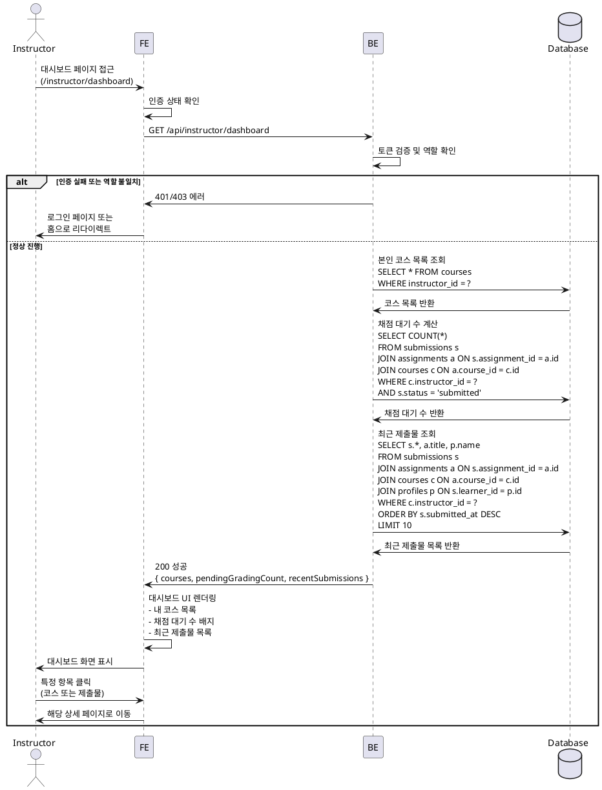

# Instructor 대시보드

## Primary Actor
- Instructor (강사 역할의 로그인 사용자)

## Precondition
- 사용자가 Instructor 역할로 로그인된 상태
- 대시보드 페이지 접근 권한이 있음

## Trigger
- Instructor가 대시보드 페이지에 접근

## Main Scenario

1. Instructor가 대시보드 페이지(/instructor/dashboard)에 접근
2. 시스템이 Instructor의 인증 상태 및 역할을 확인
3. 시스템이 해당 Instructor가 개설한 코스 목록을 조회 (draft/published/archived 상태 포함)
4. 시스템이 채점 대기 중인 제출물 수를 계산
   - 조건: 본인이 개설한 코스의 과제 중 status='submitted'인 제출물
5. 시스템이 최근 제출된 제출물 목록을 조회 (최신순, 상위 10개)
   - 조건: 본인이 개설한 코스의 과제에 제출된 제출물
6. 시스템이 대시보드 UI를 렌더링
   - 내 코스 목록 (코스 제목, 상태, 수강생 수)
   - 채점 대기 수 (숫자 배지)
   - 최근 제출물 목록 (과제명, 제출자, 제출일시, 상태)
7. Instructor가 대시보드에서 각 항목을 확인

## Edge Cases

### 개설한 코스가 없는 경우
- "아직 개설한 코스가 없습니다" 안내 메시지 표시
- "코스 생성하기" 버튼 제공하여 코스 생성 페이지로 이동 유도

### 채점 대기 제출물이 없는 경우
- 채점 대기 수를 "0"으로 표시
- "모든 제출물이 채점 완료되었습니다" 메시지 표시

### 최근 제출물이 없는 경우
- "최근 제출된 과제가 없습니다" 안내 메시지 표시

### 권한 오류
- Instructor 역할이 아닌 사용자가 접근 시 "접근 권한이 없습니다" 오류 메시지 표시 및 홈 페이지로 리다이렉트

### 인증 오류
- 로그인하지 않은 상태로 접근 시 로그인 페이지로 리다이렉트

### 데이터 조회 실패
- DB 조회 중 오류 발생 시 "일시적인 오류가 발생했습니다. 다시 시도해주세요" 메시지 표시
- 부분 데이터라도 표시 가능한 경우 표시하고, 실패한 영역은 오류 표시

## Business Rules

1. Instructor 역할을 가진 사용자만 Instructor 대시보드에 접근 가능
2. 본인이 개설한 코스만 목록에 표시
3. 코스는 상태(draft/published/archived)에 관계없이 모두 표시
4. 채점 대기 수는 본인 코스의 과제 중 status='submitted'인 제출물만 카운트
5. 최근 제출물은 최대 10개까지 표시하며, submitted_at 기준 최신순으로 정렬
6. 각 코스 항목에는 수강생 수(enrollments_count)가 표시됨
7. 대시보드의 각 항목은 클릭 시 해당 상세 페이지로 이동 가능
   - 코스 클릭 → 코스 관리 페이지
   - 제출물 클릭 → 제출물 채점 페이지
8. 채점 대기 수 배지는 0보다 클 경우 시각적으로 강조 표시

## Sequence Diagram

