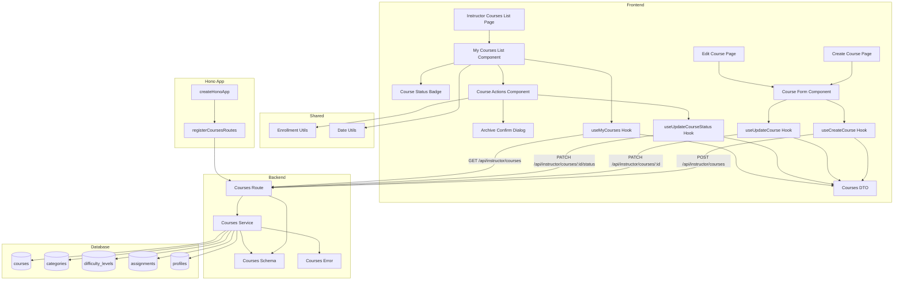

# 코스 관리 (Instructor) 구현 계획

## 개요

### Backend Modules

| 모듈 | 위치 | 설명 |
|------|------|------|
| Instructor Courses Route | `src/features/courses/backend/route.ts` | Instructor 코스 생성/수정/상태전환 API 엔드포인트 (기존 파일 확장) |
| Instructor Courses Service | `src/features/courses/backend/service.ts` | 코스 생성/수정/상태전환 비즈니스 로직 (기존 파일 확장) |
| Instructor Courses Schema | `src/features/courses/backend/schema.ts` | 코스 생성/수정 요청/응답 zod 스키마 정의 (기존 파일 확장) |
| Courses Error | `src/features/courses/backend/error.ts` | 코스 관리 관련 에러 코드 추가 (기존 파일 확장) |

### Frontend Modules

| 모듈 | 위치 | 설명 |
|------|------|------|
| Instructor Courses List Page | `src/app/(instructor)/courses/page.tsx` | 강사 코스 목록 페이지 (신규) |
| Create Course Page | `src/app/(instructor)/courses/new/page.tsx` | 코스 생성 페이지 (신규) |
| Edit Course Page | `src/app/(instructor)/courses/[courseId]/edit/page.tsx` | 코스 편집 페이지 (신규) |
| Course Form Component | `src/features/courses/components/course-form.tsx` | 코스 생성/수정 폼 컴포넌트 (신규) |
| Course Status Badge | `src/features/courses/components/course-status-badge.tsx` | 코스 상태 뱃지 컴포넌트 (신규) |
| Course Actions Component | `src/features/courses/components/course-actions.tsx` | 코스 상태 전환 액션 컴포넌트 (신규) |
| Archive Confirm Dialog | `src/features/courses/components/archive-confirm-dialog.tsx` | 코스 보관 확인 대화상자 (신규) |
| My Courses List Component | `src/features/courses/components/my-courses-list.tsx` | 내 코스 목록 컴포넌트 (신규) |
| Courses DTO | `src/features/courses/lib/dto.ts` | 프론트엔드 공유용 스키마 재노출 (기존 파일 확장) |
| Create Course Hook | `src/features/courses/hooks/useCreateCourse.ts` | 코스 생성 React Query mutation (신규) |
| Update Course Hook | `src/features/courses/hooks/useUpdateCourse.ts` | 코스 수정 React Query mutation (신규) |
| Update Course Status Hook | `src/features/courses/hooks/useUpdateCourseStatus.ts` | 코스 상태 전환 React Query mutation (신규) |
| My Courses Hook | `src/features/courses/hooks/useMyCourses.ts` | 내 코스 목록 조회 React Query hook (신규) |

### Shared Modules

| 모듈 | 위치 | 설명 |
|------|------|------|
| Enrollment Utils | `src/features/shared/enrollment-utils.ts` | 수강 관련 공통 유틸 (기존 또는 신규) |
| Date Utils | `src/lib/utils/date.ts` | 날짜 포맷팅 유틸 (기존 파일 활용) |

---

## Diagram



---

## Implementation Plan

### 1. Backend Layer

#### 1.1 Courses Error (기존 파일 확장)

**File:** `src/features/courses/backend/error.ts`

**구현 내용:**
```typescript
export const coursesErrorCodes = {
  // ... 기존 에러 코드
  invalidRequest: 'COURSES_INVALID_REQUEST',
  courseNotFound: 'COURSES_NOT_FOUND',
  courseNotPublished: 'COURSES_NOT_PUBLISHED',
  notEnrolled: 'COURSES_NOT_ENROLLED',
  unauthorized: 'COURSES_UNAUTHORIZED',
  enrollmentFailed: 'COURSES_ENROLLMENT_FAILED',
  unenrollmentFailed: 'COURSES_UNENROLLMENT_FAILED',
  alreadyEnrolled: 'COURSES_ALREADY_ENROLLED',

  // Instructor 관리 관련 에러 코드 추가
  notInstructor: 'COURSES_NOT_INSTRUCTOR',
  notOwner: 'COURSES_NOT_OWNER',
  categoryNotFound: 'COURSES_CATEGORY_NOT_FOUND',
  difficultyNotFound: 'COURSES_DIFFICULTY_NOT_FOUND',
  categoryInactive: 'COURSES_CATEGORY_INACTIVE',
  difficultyInactive: 'COURSES_DIFFICULTY_INACTIVE',
  invalidStatus: 'COURSES_INVALID_STATUS',
  cannotReactivate: 'COURSES_CANNOT_REACTIVATE_ARCHIVED',
  createFailed: 'COURSES_CREATE_FAILED',
  updateFailed: 'COURSES_UPDATE_FAILED',
  statusUpdateFailed: 'COURSES_STATUS_UPDATE_FAILED',
  assignmentsUpdateFailed: 'COURSES_ASSIGNMENTS_UPDATE_FAILED',
} as const;
```

---

#### 1.2 Courses Schema (기존 파일 확장)

**File:** `src/features/courses/backend/schema.ts`

**구현 내용:**

```typescript
// 코스 생성 요청 스키마
export const CreateCourseRequestSchema = z.object({
  title: z.string().min(1, '제목은 필수 항목입니다.'),
  description: z.string().min(1, '소개는 필수 항목입니다.'),
  categoryId: z.string().uuid('올바른 카테고리를 선택해주세요.'),
  difficultyId: z.string().uuid('올바른 난이도를 선택해주세요.'),
  curriculum: z.string().optional().nullable(),
});

// 코스 수정 요청 스키마
export const UpdateCourseRequestSchema = z.object({
  title: z.string().min(1, '제목은 필수 항목입니다.').optional(),
  description: z.string().min(1, '소개는 필수 항목입니다.').optional(),
  categoryId: z.string().uuid('올바른 카테고리를 선택해주세요.').optional(),
  difficultyId: z.string().uuid('올바른 난이도를 선택해주세요.').optional(),
  curriculum: z.string().optional().nullable(),
});

// 코스 상태 전환 요청 스키마
export const UpdateCourseStatusRequestSchema = z.object({
  status: z.enum(['draft', 'published', 'archived']),
});

// 코스 생성 응답 스키마
export const CreateCourseResponseSchema = z.object({
  courseId: z.string().uuid(),
  title: z.string(),
  status: z.enum(['draft', 'published', 'archived']),
  createdAt: z.string(),
  message: z.string(),
});

// 코스 수정 응답 스키마
export const UpdateCourseResponseSchema = z.object({
  courseId: z.string().uuid(),
  title: z.string(),
  updatedAt: z.string(),
  message: z.string(),
});

// 코스 상태 전환 응답 스키마
export const UpdateCourseStatusResponseSchema = z.object({
  courseId: z.string().uuid(),
  status: z.enum(['draft', 'published', 'archived']),
  archivedAssignmentsCount: z.number().int().optional(),
  message: z.string(),
});

// 내 코스 아이템 스키마
export const MyCourseItemSchema = z.object({
  id: z.string().uuid(),
  title: z.string(),
  description: z.string(),
  status: z.enum(['draft', 'published', 'archived']),
  enrollmentsCount: z.number().int(),
  createdAt: z.string(),
  updatedAt: z.string(),
  category: z.object({
    id: z.string().uuid(),
    name: z.string(),
  }),
  difficulty: z.object({
    id: z.string().uuid(),
    name: z.string(),
    level: z.number().int(),
  }),
});

// 내 코스 목록 응답 스키마
export const MyCoursesResponseSchema = z.object({
  courses: z.array(MyCourseItemSchema),
  total: z.number().int(),
});

// TypeScript 타입 추출
export type CreateCourseRequest = z.infer<typeof CreateCourseRequestSchema>;
export type UpdateCourseRequest = z.infer<typeof UpdateCourseRequestSchema>;
export type UpdateCourseStatusRequest = z.infer<typeof UpdateCourseStatusRequestSchema>;
export type CreateCourseResponse = z.infer<typeof CreateCourseResponseSchema>;
export type UpdateCourseResponse = z.infer<typeof UpdateCourseResponseSchema>;
export type UpdateCourseStatusResponse = z.infer<typeof UpdateCourseStatusResponseSchema>;
export type MyCourseItem = z.infer<typeof MyCourseItemSchema>;
export type MyCoursesResponse = z.infer<typeof MyCoursesResponseSchema>;
```

**Unit Test:**
```typescript
describe('CreateCourseRequestSchema', () => {
  it('should validate correct course data', () => {
    const valid = {
      title: 'React Fundamentals',
      description: 'Learn React from scratch',
      categoryId: '123e4567-e89b-12d3-a456-426614174000',
      difficultyId: '123e4567-e89b-12d3-a456-426614174001',
      curriculum: 'Week 1: Introduction',
    };
    expect(CreateCourseRequestSchema.safeParse(valid).success).toBe(true);
  });

  it('should allow null curriculum', () => {
    const valid = {
      title: 'React Fundamentals',
      description: 'Learn React',
      categoryId: '123e4567-e89b-12d3-a456-426614174000',
      difficultyId: '123e4567-e89b-12d3-a456-426614174001',
      curriculum: null,
    };
    expect(CreateCourseRequestSchema.safeParse(valid).success).toBe(true);
  });

  it('should reject empty title', () => {
    const invalid = {
      title: '',
      description: 'Learn React',
      categoryId: '123e4567-e89b-12d3-a456-426614174000',
      difficultyId: '123e4567-e89b-12d3-a456-426614174001',
    };
    expect(CreateCourseRequestSchema.safeParse(invalid).success).toBe(false);
  });

  it('should reject invalid UUID', () => {
    const invalid = {
      title: 'React',
      description: 'Learn React',
      categoryId: 'invalid-uuid',
      difficultyId: '123e4567-e89b-12d3-a456-426614174001',
    };
    expect(CreateCourseRequestSchema.safeParse(invalid).success).toBe(false);
  });
});

describe('UpdateCourseStatusRequestSchema', () => {
  it('should validate valid status', () => {
    expect(UpdateCourseStatusRequestSchema.safeParse({ status: 'draft' }).success).toBe(true);
    expect(UpdateCourseStatusRequestSchema.safeParse({ status: 'published' }).success).toBe(true);
    expect(UpdateCourseStatusRequestSchema.safeParse({ status: 'archived' }).success).toBe(true);
  });

  it('should reject invalid status', () => {
    expect(UpdateCourseStatusRequestSchema.safeParse({ status: 'invalid' }).success).toBe(false);
  });
});
```

---

#### 1.3 Courses Service (기존 파일 확장)

**File:** `src/features/courses/backend/service.ts`

**구현 내용:**

##### 1.3.1 `createCourse` 함수

- 강사가 새 코스 생성
- 검증:
  1. `instructorId` 파라미터 필수
  2. 카테고리 존재 및 활성 상태 확인
  3. 난이도 존재 및 활성 상태 확인
  4. 필수 항목(제목, 소개, 카테고리, 난이도) 검증
- 비즈니스 로직:
  1. `courses` 테이블에 INSERT
     - `instructor_id`: 현재 사용자
     - `status`: 'draft' (초기 상태)
     - `enrollments_count`: 0 (초기값)
  2. 생성 성공 메시지 반환
- 응답:
  - `courseId`, `title`, `status`, `createdAt`, `message`

##### 1.3.2 `updateCourse` 함수

- 코스 정보 수정
- 검증:
  1. 코스 존재 확인
  2. 코스 소유자 검증 (`instructor_id === userId`)
  3. 카테고리/난이도 변경 시 활성 상태 확인
- 비즈니스 로직:
  1. `courses` 테이블 UPDATE
  2. `updated_at`는 트리거로 자동 갱신
- 응답:
  - `courseId`, `title`, `updatedAt`, `message`

##### 1.3.3 `updateCourseStatus` 함수

- 코스 상태 전환 (draft → published, published → archived)
- 검증:
  1. 코스 존재 및 소유자 확인
  2. 상태 전환 가능 여부 확인
     - draft → published: 허용
     - published → archived: 허용
     - archived → published: **불허** (일방향 전환)
     - archived → draft: **불허**
- 비즈니스 로직:
  1. published → archived 전환 시:
     - 트랜잭션 시작
     - `courses.status` → 'archived' 업데이트
     - 해당 코스의 모든 `published` 상태 과제 조회
     - 과제들의 `status`를 'closed'로 일괄 변경
     - 트랜잭션 커밋 (Supabase는 트랜잭션 미지원이므로, 순차 실행 후 에러 시 명시적 처리)
  2. draft → published 전환 시:
     - `courses.status` → 'published' 업데이트
- 응답:
  - `courseId`, `status`, `archivedAssignmentsCount` (archived 전환 시), `message`

##### 1.3.4 `getMyCourses` 함수

- 강사 본인이 개설한 코스 목록 조회
- 검증:
  1. `instructorId` 파라미터 필수
- 쿼리:
  1. `courses` 테이블에서 `instructor_id = userId` 조건으로 조회
  2. 모든 상태(draft/published/archived) 포함
  3. JOIN: `categories`, `difficulty_levels`
  4. 정렬: `created_at` DESC (최신순)
- 응답:
  - 코스 목록 (id, title, description, status, enrollmentsCount, createdAt, updatedAt, category, difficulty)
  - 전체 코스 수 (total)

##### 1.3.5 헬퍼 함수

- `checkCategoryActive(supabase, categoryId)`: 카테고리 활성 상태 확인
- `checkDifficultyActive(supabase, difficultyId)`: 난이도 활성 상태 확인
- `checkCourseOwnership(supabase, courseId, instructorId)`: 코스 소유자 확인

**구현 코드:**

```typescript
export const createCourse = async (
  supabase: SupabaseClient,
  instructorId: string,
  data: CreateCourseRequest,
): Promise<HandlerResult<CreateCourseResponse, CoursesServiceError>> => {
  try {
    // 1. 카테고리 활성 상태 확인
    const { data: category, error: categoryError } = await supabase
      .from('categories')
      .select('id, is_active')
      .eq('id', data.categoryId)
      .single();

    if (categoryError || !category) {
      return failure(
        404,
        coursesErrorCodes.categoryNotFound,
        '선택한 카테고리를 찾을 수 없습니다.',
      );
    }

    if (!category.is_active) {
      return failure(
        400,
        coursesErrorCodes.categoryInactive,
        '선택한 카테고리는 더 이상 사용할 수 없습니다.',
      );
    }

    // 2. 난이도 활성 상태 확인
    const { data: difficulty, error: difficultyError } = await supabase
      .from('difficulty_levels')
      .select('id, is_active')
      .eq('id', data.difficultyId)
      .single();

    if (difficultyError || !difficulty) {
      return failure(
        404,
        coursesErrorCodes.difficultyNotFound,
        '선택한 난이도를 찾을 수 없습니다.',
      );
    }

    if (!difficulty.is_active) {
      return failure(
        400,
        coursesErrorCodes.difficultyInactive,
        '선택한 난이도는 더 이상 사용할 수 없습니다.',
      );
    }

    // 3. 코스 생성
    const { data: course, error: createError } = await supabase
      .from('courses')
      .insert({
        instructor_id: instructorId,
        category_id: data.categoryId,
        difficulty_id: data.difficultyId,
        title: data.title,
        description: data.description,
        curriculum: data.curriculum || null,
        status: 'draft',
        enrollments_count: 0,
      })
      .select('id, title, status, created_at')
      .single();

    if (createError || !course) {
      return failure(
        500,
        coursesErrorCodes.createFailed,
        createError?.message || '코스 생성 중 오류가 발생했습니다.',
      );
    }

    return success(
      {
        courseId: course.id,
        title: course.title,
        status: course.status as 'draft' | 'published' | 'archived',
        createdAt: course.created_at,
        message: '코스가 성공적으로 생성되었습니다.',
      },
      201,
    );
  } catch (err) {
    return failure(
      500,
      coursesErrorCodes.createFailed,
      err instanceof Error ? err.message : 'Unknown error',
    );
  }
};

export const updateCourse = async (
  supabase: SupabaseClient,
  instructorId: string,
  courseId: string,
  data: UpdateCourseRequest,
): Promise<HandlerResult<UpdateCourseResponse, CoursesServiceError>> => {
  try {
    // 1. 코스 소유자 확인
    const { data: course, error: checkError } = await supabase
      .from('courses')
      .select('id, instructor_id, title')
      .eq('id', courseId)
      .single();

    if (checkError || !course) {
      return failure(404, coursesErrorCodes.courseNotFound, '코스를 찾을 수 없습니다.');
    }

    if (course.instructor_id !== instructorId) {
      return failure(403, coursesErrorCodes.notOwner, '권한이 없습니다.');
    }

    // 2. 카테고리 변경 시 활성 상태 확인
    if (data.categoryId) {
      const { data: category, error: categoryError } = await supabase
        .from('categories')
        .select('id, is_active')
        .eq('id', data.categoryId)
        .single();

      if (categoryError || !category) {
        return failure(
          404,
          coursesErrorCodes.categoryNotFound,
          '선택한 카테고리를 찾을 수 없습니다.',
        );
      }

      if (!category.is_active) {
        return failure(
          400,
          coursesErrorCodes.categoryInactive,
          '선택한 카테고리는 더 이상 사용할 수 없습니다.',
        );
      }
    }

    // 3. 난이도 변경 시 활성 상태 확인
    if (data.difficultyId) {
      const { data: difficulty, error: difficultyError } = await supabase
        .from('difficulty_levels')
        .select('id, is_active')
        .eq('id', data.difficultyId)
        .single();

      if (difficultyError || !difficulty) {
        return failure(
          404,
          coursesErrorCodes.difficultyNotFound,
          '선택한 난이도를 찾을 수 없습니다.',
        );
      }

      if (!difficulty.is_active) {
        return failure(
          400,
          coursesErrorCodes.difficultyInactive,
          '선택한 난이도는 더 이상 사용할 수 없습니다.',
        );
      }
    }

    // 4. 코스 업데이트
    const updateData: any = {};
    if (data.title !== undefined) updateData.title = data.title;
    if (data.description !== undefined) updateData.description = data.description;
    if (data.categoryId !== undefined) updateData.category_id = data.categoryId;
    if (data.difficultyId !== undefined) updateData.difficulty_id = data.difficultyId;
    if (data.curriculum !== undefined) updateData.curriculum = data.curriculum;

    const { data: updated, error: updateError } = await supabase
      .from('courses')
      .update(updateData)
      .eq('id', courseId)
      .select('id, title, updated_at')
      .single();

    if (updateError || !updated) {
      return failure(
        500,
        coursesErrorCodes.updateFailed,
        updateError?.message || '코스 수정 중 오류가 발생했습니다.',
      );
    }

    return success({
      courseId: updated.id,
      title: updated.title,
      updatedAt: updated.updated_at,
      message: '코스가 성공적으로 수정되었습니다.',
    });
  } catch (err) {
    return failure(
      500,
      coursesErrorCodes.updateFailed,
      err instanceof Error ? err.message : 'Unknown error',
    );
  }
};

export const updateCourseStatus = async (
  supabase: SupabaseClient,
  instructorId: string,
  courseId: string,
  newStatus: 'draft' | 'published' | 'archived',
): Promise<HandlerResult<UpdateCourseStatusResponse, CoursesServiceError>> => {
  try {
    // 1. 코스 소유자 및 현재 상태 확인
    const { data: course, error: checkError } = await supabase
      .from('courses')
      .select('id, instructor_id, status')
      .eq('id', courseId)
      .single();

    if (checkError || !course) {
      return failure(404, coursesErrorCodes.courseNotFound, '코스를 찾을 수 없습니다.');
    }

    if (course.instructor_id !== instructorId) {
      return failure(403, coursesErrorCodes.notOwner, '권한이 없습니다.');
    }

    // 2. 상태 전환 가능 여부 확인
    if (course.status === 'archived') {
      return failure(
        400,
        coursesErrorCodes.cannotReactivate,
        '보관된 코스는 다시 활성화할 수 없습니다. 새 코스를 생성해주세요.',
      );
    }

    // 3. published → archived 전환 시 과제 일괄 마감
    let archivedAssignmentsCount = 0;
    if (course.status === 'published' && newStatus === 'archived') {
      // 3-1. 코스의 published 상태 과제 조회
      const { data: publishedAssignments, error: assignmentsError } = await supabase
        .from('assignments')
        .select('id')
        .eq('course_id', courseId)
        .eq('status', 'published');

      if (assignmentsError) {
        return failure(
          500,
          coursesErrorCodes.assignmentsUpdateFailed,
          assignmentsError.message,
        );
      }

      archivedAssignmentsCount = publishedAssignments?.length || 0;

      // 3-2. 과제들 상태 일괄 변경 (published → closed)
      if (archivedAssignmentsCount > 0) {
        const { error: closeError } = await supabase
          .from('assignments')
          .update({ status: 'closed' })
          .eq('course_id', courseId)
          .eq('status', 'published');

        if (closeError) {
          return failure(
            500,
            coursesErrorCodes.assignmentsUpdateFailed,
            closeError.message,
          );
        }
      }
    }

    // 4. 코스 상태 업데이트
    const { data: updated, error: updateError } = await supabase
      .from('courses')
      .update({ status: newStatus })
      .eq('id', courseId)
      .select('id, status')
      .single();

    if (updateError || !updated) {
      return failure(
        500,
        coursesErrorCodes.statusUpdateFailed,
        updateError?.message || '코스 상태 변경 중 오류가 발생했습니다.',
      );
    }

    const messages = {
      draft: '코스가 초안 상태로 변경되었습니다.',
      published: '코스가 게시되었습니다.',
      archived: `코스가 보관되었습니다.${archivedAssignmentsCount > 0 ? ` ${archivedAssignmentsCount}개의 과제가 마감되었습니다.` : ''}`,
    };

    return success({
      courseId: updated.id,
      status: updated.status as 'draft' | 'published' | 'archived',
      archivedAssignmentsCount: newStatus === 'archived' ? archivedAssignmentsCount : undefined,
      message: messages[newStatus],
    });
  } catch (err) {
    return failure(
      500,
      coursesErrorCodes.statusUpdateFailed,
      err instanceof Error ? err.message : 'Unknown error',
    );
  }
};

export const getMyCourses = async (
  supabase: SupabaseClient,
  instructorId: string,
): Promise<HandlerResult<MyCoursesResponse, CoursesServiceError>> => {
  try {
    const { data, error, count } = await supabase
      .from('courses')
      .select(
        `
        id,
        title,
        description,
        status,
        enrollments_count,
        created_at,
        updated_at,
        category_id,
        categories(name),
        difficulty_id,
        difficulty_levels(name, level)
      `,
        { count: 'exact' },
      )
      .eq('instructor_id', instructorId)
      .order('created_at', { ascending: false });

    if (error) {
      return failure(500, coursesErrorCodes.invalidRequest, error.message);
    }

    const courses: MyCourseItem[] = (data || []).map((row: any) => ({
      id: row.id,
      title: row.title,
      description: row.description,
      status: row.status,
      enrollmentsCount: row.enrollments_count,
      createdAt: row.created_at,
      updatedAt: row.updated_at,
      category: {
        id: row.category_id,
        name: row.categories?.name || '',
      },
      difficulty: {
        id: row.difficulty_id,
        name: row.difficulty_levels?.name || '',
        level: row.difficulty_levels?.level || 0,
      },
    }));

    return success({
      courses,
      total: count || 0,
    });
  } catch (err) {
    return failure(
      500,
      coursesErrorCodes.invalidRequest,
      err instanceof Error ? err.message : 'Unknown error',
    );
  }
};
```

**Unit Test:**
```typescript
describe('createCourse', () => {
  it('should create course with valid data', async () => {
    const mockCategory = { id: 'cat-1', is_active: true };
    const mockDifficulty = { id: 'diff-1', is_active: true };
    const mockCourse = {
      id: 'course-1',
      title: 'React Fundamentals',
      status: 'draft',
      created_at: '2025-10-09T00:00:00Z',
    };

    mockSupabaseClient.from.mockImplementation((table: string) => {
      if (table === 'categories') {
        return {
          select: jest.fn().mockReturnValue({
            eq: jest.fn().mockReturnValue({
              single: jest.fn().mockResolvedValue({ data: mockCategory, error: null }),
            }),
          }),
        };
      }
      if (table === 'difficulty_levels') {
        return {
          select: jest.fn().mockReturnValue({
            eq: jest.fn().mockReturnValue({
              single: jest.fn().mockResolvedValue({ data: mockDifficulty, error: null }),
            }),
          }),
        };
      }
      if (table === 'courses') {
        return {
          insert: jest.fn().mockReturnValue({
            select: jest.fn().mockReturnValue({
              single: jest.fn().mockResolvedValue({ data: mockCourse, error: null }),
            }),
          }),
        };
      }
      return {} as any;
    });

    const result = await createCourse(mockSupabaseClient, 'instructor-1', {
      title: 'React Fundamentals',
      description: 'Learn React',
      categoryId: 'cat-1',
      difficultyId: 'diff-1',
      curriculum: null,
    });

    expect(result.ok).toBe(true);
    expect(result.data.courseId).toBe('course-1');
    expect(result.data.status).toBe('draft');
  });

  it('should return error when category is inactive', async () => {
    mockSupabaseClient.from.mockImplementation(() => ({
      select: jest.fn().mockReturnValue({
        eq: jest.fn().mockReturnValue({
          single: jest.fn().mockResolvedValue({
            data: { id: 'cat-1', is_active: false },
            error: null,
          }),
        }),
      }),
    }));

    const result = await createCourse(mockSupabaseClient, 'instructor-1', {
      title: 'React',
      description: 'Learn React',
      categoryId: 'cat-1',
      difficultyId: 'diff-1',
    });

    expect(result.ok).toBe(false);
    expect(result.error.code).toBe(coursesErrorCodes.categoryInactive);
  });
});

describe('updateCourseStatus', () => {
  it('should update status from draft to published', async () => {
    const mockCourse = {
      id: 'course-1',
      instructor_id: 'instructor-1',
      status: 'draft',
    };

    mockSupabaseClient.from.mockImplementation((table: string) => {
      if (table === 'courses') {
        return {
          select: jest.fn().mockReturnValue({
            eq: jest.fn().mockReturnValue({
              single: jest.fn().mockResolvedValue({ data: mockCourse, error: null }),
            }),
          }),
          update: jest.fn().mockReturnValue({
            eq: jest.fn().mockReturnValue({
              select: jest.fn().mockReturnValue({
                single: jest.fn().mockResolvedValue({
                  data: { id: 'course-1', status: 'published' },
                  error: null,
                }),
              }),
            }),
          }),
        };
      }
      return {} as any;
    });

    const result = await updateCourseStatus(
      mockSupabaseClient,
      'instructor-1',
      'course-1',
      'published',
    );

    expect(result.ok).toBe(true);
    expect(result.data.status).toBe('published');
  });

  it('should close assignments when archiving published course', async () => {
    const mockCourse = {
      id: 'course-1',
      instructor_id: 'instructor-1',
      status: 'published',
    };

    const mockAssignments = [{ id: 'assign-1' }, { id: 'assign-2' }];

    mockSupabaseClient.from.mockImplementation((table: string) => {
      if (table === 'courses') {
        return {
          select: jest.fn().mockReturnValue({
            eq: jest.fn().mockReturnValue({
              single: jest.fn().mockResolvedValue({ data: mockCourse, error: null }),
            }),
          }),
          update: jest.fn().mockReturnValue({
            eq: jest.fn().mockReturnValue({
              select: jest.fn().mockReturnValue({
                single: jest.fn().mockResolvedValue({
                  data: { id: 'course-1', status: 'archived' },
                  error: null,
                }),
              }),
            }),
          }),
        };
      }
      if (table === 'assignments') {
        return {
          select: jest.fn().mockReturnValue({
            eq: jest.fn().mockReturnValue({
              eq: jest.fn().mockResolvedValue({ data: mockAssignments, error: null }),
            }),
          }),
          update: jest.fn().mockReturnValue({
            eq: jest.fn().mockReturnValue({
              eq: jest.fn().mockResolvedValue({ error: null }),
            }),
          }),
        };
      }
      return {} as any;
    });

    const result = await updateCourseStatus(
      mockSupabaseClient,
      'instructor-1',
      'course-1',
      'archived',
    );

    expect(result.ok).toBe(true);
    expect(result.data.status).toBe('archived');
    expect(result.data.archivedAssignmentsCount).toBe(2);
  });

  it('should reject reactivation of archived course', async () => {
    mockSupabaseClient.from.mockImplementation(() => ({
      select: jest.fn().mockReturnValue({
        eq: jest.fn().mockReturnValue({
          single: jest.fn().mockResolvedValue({
            data: { id: 'course-1', instructor_id: 'instructor-1', status: 'archived' },
            error: null,
          }),
        }),
      }),
    }));

    const result = await updateCourseStatus(
      mockSupabaseClient,
      'instructor-1',
      'course-1',
      'published',
    );

    expect(result.ok).toBe(false);
    expect(result.error.code).toBe(coursesErrorCodes.cannotReactivate);
  });
});

describe('getMyCourses', () => {
  it('should return instructor courses', async () => {
    const mockCourses = [
      {
        id: 'course-1',
        title: 'React',
        description: 'Learn React',
        status: 'published',
        enrollments_count: 25,
        created_at: '2025-10-01T00:00:00Z',
        updated_at: '2025-10-05T00:00:00Z',
        category_id: 'cat-1',
        categories: { name: 'Programming' },
        difficulty_id: 'diff-1',
        difficulty_levels: { name: 'Beginner', level: 1 },
      },
    ];

    mockSupabaseClient.from.mockImplementation(() => ({
      select: jest.fn().mockReturnValue({
        eq: jest.fn().mockReturnValue({
          order: jest.fn().mockResolvedValue({ data: mockCourses, error: null, count: 1 }),
        }),
      }),
    }));

    const result = await getMyCourses(mockSupabaseClient, 'instructor-1');

    expect(result.ok).toBe(true);
    expect(result.data.courses).toHaveLength(1);
    expect(result.data.total).toBe(1);
  });
});
```

---

#### 1.4 Courses Route (기존 파일 확장)

**File:** `src/features/courses/backend/route.ts`

**구현 내용:**

- `POST /api/instructor/courses` 엔드포인트: 코스 생성
- `GET /api/instructor/courses` 엔드포인트: 내 코스 목록 조회
- `GET /api/instructor/courses/:id` 엔드포인트: 내 코스 상세 조회 (소유자 검증 추가)
- `PATCH /api/instructor/courses/:id` 엔드포인트: 코스 수정
- `PATCH /api/instructor/courses/:id/status` 엔드포인트: 코스 상태 전환
- 모든 엔드포인트에서 사용자 인증 확인 (`x-user-id` 헤더)
- 요청 body 파싱 및 검증
- 성공/실패 응답 반환 (`respond` 헬퍼 사용)

**구현 코드:**

```typescript
// 기존 코드 유지하고 Instructor 라우트 추가

export const registerCoursesRoutes = (app: Hono<AppEnv>) => {
  // ... 기존 Learner 라우트 유지

  // Instructor: 코스 생성
  app.post('/api/instructor/courses', async (c) => {
    const logger = getLogger(c);
    logger.info('Create course request received');

    const userId = c.req.header('x-user-id');
    if (!userId) {
      return respond(
        c,
        failure(401, coursesErrorCodes.unauthorized, '인증이 필요합니다.'),
      );
    }

    const body = await c.req.json();
    const parsed = CreateCourseRequestSchema.safeParse(body);

    if (!parsed.success) {
      return respond(
        c,
        failure(
          400,
          coursesErrorCodes.invalidRequest,
          '요청 데이터가 올바르지 않습니다.',
          parsed.error.format(),
        ),
      );
    }

    const supabase = getSupabase(c);
    const result = await createCourse(supabase, userId, parsed.data);

    return respond(c, result);
  });

  // Instructor: 내 코스 목록 조회
  app.get('/api/instructor/courses', async (c) => {
    const logger = getLogger(c);
    logger.info('Get my courses request received');

    const userId = c.req.header('x-user-id');
    if (!userId) {
      return respond(
        c,
        failure(401, coursesErrorCodes.unauthorized, '인증이 필요합니다.'),
      );
    }

    const supabase = getSupabase(c);
    const result = await getMyCourses(supabase, userId);

    return respond(c, result);
  });

  // Instructor: 코스 수정
  app.patch('/api/instructor/courses/:id', async (c) => {
    const logger = getLogger(c);
    const courseId = c.req.param('id');
    logger.info(`Update course request received for ${courseId}`);

    const userId = c.req.header('x-user-id');
    if (!userId) {
      return respond(
        c,
        failure(401, coursesErrorCodes.unauthorized, '인증이 필요합니다.'),
      );
    }

    const body = await c.req.json();
    const parsed = UpdateCourseRequestSchema.safeParse(body);

    if (!parsed.success) {
      return respond(
        c,
        failure(
          400,
          coursesErrorCodes.invalidRequest,
          '요청 데이터가 올바르지 않습니다.',
          parsed.error.format(),
        ),
      );
    }

    const supabase = getSupabase(c);
    const result = await updateCourse(supabase, userId, courseId, parsed.data);

    return respond(c, result);
  });

  // Instructor: 코스 상태 전환
  app.patch('/api/instructor/courses/:id/status', async (c) => {
    const logger = getLogger(c);
    const courseId = c.req.param('id');
    logger.info(`Update course status request received for ${courseId}`);

    const userId = c.req.header('x-user-id');
    if (!userId) {
      return respond(
        c,
        failure(401, coursesErrorCodes.unauthorized, '인증이 필요합니다.'),
      );
    }

    const body = await c.req.json();
    const parsed = UpdateCourseStatusRequestSchema.safeParse(body);

    if (!parsed.success) {
      return respond(
        c,
        failure(
          400,
          coursesErrorCodes.invalidRequest,
          '요청 데이터가 올바르지 않습니다.',
          parsed.error.format(),
        ),
      );
    }

    const supabase = getSupabase(c);
    const result = await updateCourseStatus(
      supabase,
      userId,
      courseId,
      parsed.data.status,
    );

    return respond(c, result);
  });
};
```

**Integration Test:**
```typescript
describe('POST /api/instructor/courses', () => {
  it('should return 201 on successful course creation', async () => {
    const response = await request(app)
      .post('/api/instructor/courses')
      .set('x-user-id', 'instructor-1')
      .send({
        title: 'React Fundamentals',
        description: 'Learn React',
        categoryId: 'cat-1',
        difficultyId: 'diff-1',
        curriculum: null,
      });

    expect(response.status).toBe(201);
    expect(response.body.courseId).toBeDefined();
    expect(response.body.status).toBe('draft');
  });

  it('should return 401 when not authenticated', async () => {
    const response = await request(app)
      .post('/api/instructor/courses')
      .send({
        title: 'React',
        description: 'Learn React',
        categoryId: 'cat-1',
        difficultyId: 'diff-1',
      });

    expect(response.status).toBe(401);
  });

  it('should return 400 for invalid category', async () => {
    const response = await request(app)
      .post('/api/instructor/courses')
      .set('x-user-id', 'instructor-1')
      .send({
        title: 'React',
        description: 'Learn React',
        categoryId: 'invalid-uuid',
        difficultyId: 'diff-1',
      });

    expect(response.status).toBe(400);
  });
});

describe('PATCH /api/instructor/courses/:id/status', () => {
  it('should archive course and close assignments', async () => {
    const response = await request(app)
      .patch('/api/instructor/courses/course-1/status')
      .set('x-user-id', 'instructor-1')
      .send({ status: 'archived' });

    expect(response.status).toBe(200);
    expect(response.body.status).toBe('archived');
    expect(response.body.archivedAssignmentsCount).toBeGreaterThanOrEqual(0);
  });

  it('should reject archived course reactivation', async () => {
    const response = await request(app)
      .patch('/api/instructor/courses/archived-course/status')
      .set('x-user-id', 'instructor-1')
      .send({ status: 'published' });

    expect(response.status).toBe(400);
    expect(response.body.error.code).toBe(coursesErrorCodes.cannotReactivate);
  });
});
```

---

### 2. Frontend Layer

#### 2.1 Courses DTO (기존 파일 확장)

**File:** `src/features/courses/lib/dto.ts`

**구현 내용:**

```typescript
export {
  // 기존 Learner DTO 유지
  CourseListQuerySchema,
  CourseItemSchema,
  CourseListResponseSchema,
  CourseDetailResponseSchema,
  EnrollResponseSchema,
  EnrollmentStatusResponseSchema,
  type CourseListQuery,
  type CourseItem,
  type CourseListResponse,
  type CourseDetailResponse,
  type EnrollResponse,
  type EnrollmentStatusResponse,

  // Instructor DTO 추가
  CreateCourseRequestSchema,
  UpdateCourseRequestSchema,
  UpdateCourseStatusRequestSchema,
  CreateCourseResponseSchema,
  UpdateCourseResponseSchema,
  UpdateCourseStatusResponseSchema,
  MyCourseItemSchema,
  MyCoursesResponseSchema,
  type CreateCourseRequest,
  type UpdateCourseRequest,
  type UpdateCourseStatusRequest,
  type CreateCourseResponse,
  type UpdateCourseResponse,
  type UpdateCourseStatusResponse,
  type MyCourseItem,
  type MyCoursesResponse,
} from '@/features/courses/backend/schema';
```

---

#### 2.2 Create Course Hook

**File:** `src/features/courses/hooks/useCreateCourse.ts`

**구현 내용:**

```typescript
'use client';

import { useMutation, useQueryClient } from '@tanstack/react-query';
import { useRouter } from 'next/navigation';
import { apiClient, extractApiErrorMessage } from '@/lib/remote/api-client';
import {
  CreateCourseRequestSchema,
  CreateCourseResponseSchema,
  type CreateCourseRequest,
  type CreateCourseResponse,
} from '../lib/dto';

const createCourse = async (
  data: CreateCourseRequest,
): Promise<CreateCourseResponse> => {
  try {
    const validated = CreateCourseRequestSchema.parse(data);
    const { data: response } = await apiClient.post(
      '/api/instructor/courses',
      validated,
    );
    return CreateCourseResponseSchema.parse(response);
  } catch (error) {
    const message = extractApiErrorMessage(error, '코스 생성에 실패했습니다.');
    throw new Error(message);
  }
};

export const useCreateCourse = () => {
  const queryClient = useQueryClient();
  const router = useRouter();

  return useMutation({
    mutationFn: createCourse,
    onSuccess: (data) => {
      queryClient.invalidateQueries({ queryKey: ['instructor', 'courses'] });
      router.push(`/instructor/courses/${data.courseId}/edit`);
    },
  });
};
```

---

#### 2.3 Update Course Hook

**File:** `src/features/courses/hooks/useUpdateCourse.ts`

**구현 내용:**

```typescript
'use client';

import { useMutation, useQueryClient } from '@tanstack/react-query';
import { apiClient, extractApiErrorMessage } from '@/lib/remote/api-client';
import {
  UpdateCourseRequestSchema,
  UpdateCourseResponseSchema,
  type UpdateCourseRequest,
  type UpdateCourseResponse,
} from '../lib/dto';

const updateCourse = async (
  courseId: string,
  data: UpdateCourseRequest,
): Promise<UpdateCourseResponse> => {
  try {
    const validated = UpdateCourseRequestSchema.parse(data);
    const { data: response } = await apiClient.patch(
      `/api/instructor/courses/${courseId}`,
      validated,
    );
    return UpdateCourseResponseSchema.parse(response);
  } catch (error) {
    const message = extractApiErrorMessage(error, '코스 수정에 실패했습니다.');
    throw new Error(message);
  }
};

export const useUpdateCourse = (courseId: string) => {
  const queryClient = useQueryClient();

  return useMutation({
    mutationFn: (data: UpdateCourseRequest) => updateCourse(courseId, data),
    onSuccess: () => {
      queryClient.invalidateQueries({ queryKey: ['instructor', 'courses'] });
      queryClient.invalidateQueries({ queryKey: ['course', courseId] });
    },
  });
};
```

---

#### 2.4 Update Course Status Hook

**File:** `src/features/courses/hooks/useUpdateCourseStatus.ts`

**구현 내용:**

```typescript
'use client';

import { useMutation, useQueryClient } from '@tanstack/react-query';
import { apiClient, extractApiErrorMessage } from '@/lib/remote/api-client';
import {
  UpdateCourseStatusRequestSchema,
  UpdateCourseStatusResponseSchema,
  type UpdateCourseStatusRequest,
  type UpdateCourseStatusResponse,
} from '../lib/dto';

const updateCourseStatus = async (
  courseId: string,
  data: UpdateCourseStatusRequest,
): Promise<UpdateCourseStatusResponse> => {
  try {
    const validated = UpdateCourseStatusRequestSchema.parse(data);
    const { data: response } = await apiClient.patch(
      `/api/instructor/courses/${courseId}/status`,
      validated,
    );
    return UpdateCourseStatusResponseSchema.parse(response);
  } catch (error) {
    const message = extractApiErrorMessage(error, '코스 상태 변경에 실패했습니다.');
    throw new Error(message);
  }
};

export const useUpdateCourseStatus = (courseId: string) => {
  const queryClient = useQueryClient();

  return useMutation({
    mutationFn: (data: UpdateCourseStatusRequest) => updateCourseStatus(courseId, data),
    onSuccess: () => {
      queryClient.invalidateQueries({ queryKey: ['instructor', 'courses'] });
      queryClient.invalidateQueries({ queryKey: ['course', courseId] });
    },
  });
};
```

---

#### 2.5 My Courses Hook

**File:** `src/features/courses/hooks/useMyCourses.ts`

**구현 내용:**

```typescript
'use client';

import { useQuery } from '@tanstack/react-query';
import { apiClient, extractApiErrorMessage } from '@/lib/remote/api-client';
import {
  MyCoursesResponseSchema,
  type MyCoursesResponse,
} from '../lib/dto';

const fetchMyCourses = async (): Promise<MyCoursesResponse> => {
  try {
    const { data } = await apiClient.get('/api/instructor/courses');
    return MyCoursesResponseSchema.parse(data);
  } catch (error) {
    const message = extractApiErrorMessage(error, '코스 목록을 불러오지 못했습니다.');
    throw new Error(message);
  }
};

export const useMyCourses = () =>
  useQuery({
    queryKey: ['instructor', 'courses'],
    queryFn: fetchMyCourses,
    staleTime: 30 * 1000, // 30초
  });
```

---

#### 2.6 Course Status Badge Component

**File:** `src/features/courses/components/course-status-badge.tsx`

**구현 내용:**

- 코스 상태별 배지 표시 (draft/published/archived)
- 색상 구분:
  - draft: 회색
  - published: 녹색
  - archived: 주황색
- shadcn-ui Badge 컴포넌트 활용

**QA Sheet:**

| 시나리오 | 입력 | 예상 결과 |
|---------|------|----------|
| Draft 상태 | status = 'draft' | 회색 "초안" 배지 |
| Published 상태 | status = 'published' | 녹색 "게시됨" 배지 |
| Archived 상태 | status = 'archived' | 주황색 "보관됨" 배지 |

---

#### 2.7 Course Actions Component

**File:** `src/features/courses/components/course-actions.tsx`

**구현 내용:**

- 코스 상태별 액션 버튼 표시
- Draft: "게시" 버튼
- Published: "보관" 버튼 (Archive Confirm Dialog 표시)
- Archived: 액션 버튼 없음 (재활성화 불가 안내)
- `useUpdateCourseStatus` 훅 사용
- 로딩 상태 처리
- shadcn-ui Button 컴포넌트 활용

**QA Sheet:**

| 시나리오 | 입력 | 예상 결과 |
|---------|------|----------|
| Draft 상태 | status = 'draft' | "게시" 버튼 표시 |
| 게시 버튼 클릭 | 버튼 클릭 | 즉시 published 상태로 변경 |
| Published 상태 | status = 'published' | "보관" 버튼 표시 |
| 보관 버튼 클릭 | 버튼 클릭 | Archive Confirm Dialog 표시 |
| Archived 상태 | status = 'archived' | "보관된 코스는 재활성화할 수 없습니다" 안내 |
| 로딩 중 | 상태 변경 중 | 버튼 비활성화, 로딩 스피너 |

---

#### 2.8 Archive Confirm Dialog Component

**File:** `src/features/courses/components/archive-confirm-dialog.tsx`

**구현 내용:**

- 코스 보관 확인 대화상자
- "N개의 과제가 자동으로 마감됩니다" 경고 메시지 (published 과제가 있을 경우)
- "확인" / "취소" 버튼
- 확인 시 `useUpdateCourseStatus` 호출
- shadcn-ui Dialog 컴포넌트 활용

**QA Sheet:**

| 시나리오 | 입력 | 예상 결과 |
|---------|------|----------|
| 보관 버튼 클릭 | 버튼 클릭 | 대화상자 표시 |
| 과제 있음 | published 과제 3개 | "3개의 과제가 마감됩니다" 경고 표시 |
| 과제 없음 | published 과제 0개 | 경고 없이 확인 메시지만 표시 |
| 확인 버튼 | 버튼 클릭 | 코스 보관 API 호출, 대화상자 닫힘 |
| 취소 버튼 | 버튼 클릭 | 대화상자 닫힘, 상태 변경 없음 |

---

#### 2.9 Course Form Component

**File:** `src/features/courses/components/course-form.tsx`

**구현 내용:**

- react-hook-form + zod 통합
- 필드:
  - 제목 (Input, 필수)
  - 소개 (Textarea, 필수)
  - 카테고리 (Select, 필수)
  - 난이도 (Select, 필수)
  - 커리큘럼 (Textarea, 선택)
- 유효성 검증 (CreateCourseRequestSchema 또는 UpdateCourseRequestSchema)
- `useCreateCourse` 또는 `useUpdateCourse` 훅 사용
- 성공/실패 메시지 표시
- 로딩 상태 처리
- 기존 코스 데이터 pre-fill (수정 모드)

**QA Sheet:**

| 시나리오 | 입력 | 예상 결과 |
|---------|------|----------|
| 정상 생성 | 모든 필드 올바르게 입력 | 코스 생성 성공, 편집 페이지로 이동 |
| 제목 누락 | 제목 비움 | "제목은 필수 항목입니다" 오류 |
| 소개 누락 | 소개 비움 | "소개는 필수 항목입니다" 오류 |
| 카테고리 미선택 | 카테고리 비움 | "올바른 카테고리를 선택해주세요" 오류 |
| 수정 모드 | 기존 코스 데이터 | 필드 pre-fill 확인 |
| 네트워크 오류 | 네트워크 끊김 | "일시적인 오류가 발생했습니다" 오류 메시지 |

---

#### 2.10 My Courses List Component

**File:** `src/features/courses/components/my-courses-list.tsx`

**구현 내용:**

- `useMyCourses` 훅 사용하여 코스 목록 조회
- 코스 카드 표시 (제목, 설명, 상태, 수강생 수, 생성일)
- 각 코스 클릭 시 편집 페이지로 이동
- Course Status Badge 및 Course Actions 컴포넌트 포함
- 빈 목록 처리 ("아직 개설한 코스가 없습니다" + "코스 생성하기" 버튼)
- 로딩/에러 상태 처리
- shadcn-ui Card 컴포넌트 활용

**QA Sheet:**

| 시나리오 | 입력 | 예상 결과 |
|---------|------|----------|
| 코스 목록 표시 | 코스 3개 | 3개 카드 표시 |
| 빈 목록 | 코스 0개 | "아직 개설한 코스가 없습니다" + "코스 생성하기" 버튼 |
| 코스 클릭 | 카드 클릭 | `/instructor/courses/[courseId]/edit` 페이지로 이동 |
| 로딩 중 | 데이터 로딩 | 스켈레톤 표시 |
| 네트워크 오류 | API 에러 | 에러 메시지, 재시도 버튼 |

---

#### 2.11 Instructor Courses List Page

**File:** `src/app/(instructor)/courses/page.tsx`

**구현 내용:**

- My Courses List 컴포넌트 렌더링
- "코스 생성" 버튼 (Create Course Page로 이동)
- `"use client"` 지시문
- SEO 메타데이터

**QA Sheet:**

| 시나리오 | 입력 | 예상 결과 |
|---------|------|----------|
| 페이지 접근 | `/instructor/courses` | 코스 목록 페이지 표시 |
| 코스 생성 버튼 | 버튼 클릭 | `/instructor/courses/new` 페이지로 이동 |

---

#### 2.12 Create Course Page

**File:** `src/app/(instructor)/courses/new/page.tsx`

**구현 내용:**

- Course Form 컴포넌트 렌더링 (생성 모드)
- `"use client"` 지시문
- SEO 메타데이터

**QA Sheet:**

| 시나리오 | 입력 | 예상 결과 |
|---------|------|----------|
| 페이지 접근 | `/instructor/courses/new` | 코스 생성 폼 표시 |
| 폼 제출 | 데이터 입력 후 제출 | 코스 생성, 편집 페이지로 리다이렉트 |

---

#### 2.13 Edit Course Page

**File:** `src/app/(instructor)/courses/[courseId]/edit/page.tsx`

**구현 내용:**

- Course Form 컴포넌트 렌더링 (수정 모드)
- 기존 코스 데이터 로드 및 pre-fill
- Course Actions 컴포넌트 포함 (상태 전환 버튼)
- 동적 라우트 파라미터 (`courseId`) 처리
- `params` promise 규약 준수
- `"use client"` 지시문
- SEO 메타데이터

**QA Sheet:**

| 시나리오 | 입력 | 예상 결과 |
|---------|------|----------|
| 페이지 접근 | `/instructor/courses/[courseId]/edit` | 코스 편집 폼 표시, 기존 데이터 pre-fill |
| 폼 제출 | 데이터 수정 후 제출 | 코스 수정 성공 메시지 |
| 상태 전환 | 게시/보관 버튼 클릭 | 상태 전환 성공 메시지 |
| 권한 없음 | 다른 강사 코스 | "권한이 없습니다" 오류, 리다이렉트 |

---

### 3. Integration & E2E Testing

#### 3.1 Full Flow Test - 코스 생성

**시나리오:**

1. Instructor 로그인
2. `/instructor/courses` 페이지 접근
3. "코스 생성" 버튼 클릭
4. 코스 생성 페이지로 이동
5. 코스 정보 입력 (제목, 소개, 카테고리, 난이도, 커리큘럼)
6. "생성" 버튼 클릭
7. 코스 생성 성공 메시지 확인
8. 코스 편집 페이지로 리다이렉트
9. DB 확인: `courses` 테이블에 레코드 생성, `status='draft'` 확인

**수동 QA:**
- 브라우저에서 실제 플로우 테스트
- Supabase 대시보드에서 코스 데이터 확인

---

#### 3.2 Full Flow Test - 코스 수정

**시나리오:**

1. Instructor 로그인
2. 내 코스 목록에서 코스 선택
3. 코스 편집 페이지로 이동
4. 코스 정보 수정 (제목, 소개 등)
5. "저장" 버튼 클릭
6. 코스 수정 성공 메시지 확인
7. DB 확인: `updated_at` 갱신, 변경된 정보 반영

---

#### 3.3 Full Flow Test - 코스 상태 전환 (Published → Archived)

**시나리오:**

1. Instructor 로그인
2. Published 상태 코스 선택
3. "보관" 버튼 클릭
4. Archive Confirm Dialog 표시
5. "N개의 과제가 마감됩니다" 경고 확인
6. "확인" 클릭
7. 코스 보관 성공 메시지 확인
8. DB 확인:
   - `courses.status='archived'`
   - 해당 코스의 `published` 과제들이 `closed` 상태로 변경됨

---

#### 3.4 Edge Case Test

**시나리오:**

1. **비활성화된 카테고리 선택**: "선택한 카테고리는 더 이상 사용할 수 없습니다" 오류
2. **다른 강사 코스 수정 시도**: "권한이 없습니다" 오류, 접근 차단
3. **Archived 코스 재게시 시도**: "보관된 코스는 재활성화할 수 없습니다" 오류
4. **필수 항목 누락**: "필수 항목을 입력해주세요" 유효성 검증 오류
5. **네트워크 오류**: "일시적인 오류가 발생했습니다" 메시지, 재시도 가능

---

## Implementation Order

1. **Backend Error**: `courses/backend/error.ts` 확장 (Instructor 관련 에러 코드 추가)
2. **Backend Schema**: `courses/backend/schema.ts` 확장 (생성/수정/상태전환 스키마 추가)
3. **Backend Service**: `courses/backend/service.ts` 확장
   - `createCourse` 구현 및 테스트
   - `updateCourse` 구현 및 테스트
   - `updateCourseStatus` 구현 및 테스트 (과제 일괄 마감 포함)
   - `getMyCourses` 구현 및 테스트
4. **Backend Route**: `courses/backend/route.ts` 확장
   - `POST /api/instructor/courses`
   - `GET /api/instructor/courses`
   - `PATCH /api/instructor/courses/:id`
   - `PATCH /api/instructor/courses/:id/status`
   - Integration 테스트
5. **Frontend DTO**: `courses/lib/dto.ts` 확장 (Instructor 스키마 재노출)
6. **Frontend Hooks**: 훅 구현
   - `useCreateCourse`
   - `useUpdateCourse`
   - `useUpdateCourseStatus`
   - `useMyCourses`
7. **Frontend Components**: 컴포넌트 구현
   - `CourseStatusBadge`
   - `ArchiveConfirmDialog`
   - `CourseActions`
   - `CourseForm`
   - `MyCoursesList`
8. **Frontend Pages**: 페이지 구현
   - Instructor Courses List Page
   - Create Course Page
   - Edit Course Page
9. **Integration Test**: Full flow 수동 QA (생성, 수정, 상태 전환, edge cases)

---

## Notes

### 비즈니스 규칙

- **코스 소유권**: 강사는 본인이 생성한 코스만 수정/상태 전환 가능
- **초기 상태**: 코스 생성 시 `status='draft'`, `enrollments_count=0`
- **상태 전환 규칙**:
  - draft → published: 허용
  - published → archived: 허용 (과제 일괄 마감)
  - archived → published/draft: **불허** (일방향 전환)
- **과제 일괄 마감**: published → archived 전환 시 해당 코스의 모든 `published` 상태 과제를 `closed`로 변경
- **필수 항목**: 제목, 소개, 카테고리, 난이도
- **선택 항목**: 커리큘럼
- **메타데이터 검증**: 카테고리와 난이도는 `is_active=true`인 항목만 선택 가능

### 기술적 고려사항

- **인증**: 모든 API는 `x-user-id` 헤더로 사용자 ID 추출
- **트랜잭션**: Supabase는 트랜잭션 미지원, 순차 실행 후 에러 시 명시적 처리
  - published → archived 전환 시 코스 상태 변경 후 과제 상태 변경
  - 과제 상태 변경 실패 시 에러 반환 (롤백 불가, 사용자에게 재시도 요청)
- **에러 처리**: 모든 API 호출에서 에러 메시지 사용자에게 표시
- **날짜 표시**: 한국어 로케일 사용 (`date-fns/locale/ko`)
- **캐싱**: React Query의 `invalidateQueries`로 생성/수정 후 캐시 무효화
- **타입 안전성**: 백엔드 스키마를 프론트엔드에서 재사용

### 기존 코드와의 통합

- `courses` feature는 이미 Learner용으로 구현되어 있으므로, 기존 파일에 Instructor 로직 추가
- `respond` 헬퍼는 `src/backend/http/response.ts`에서 제공하는 공통 헬퍼 사용
- `date-fns` 기반 날짜 유틸리티는 기존 `src/lib/utils/date.ts` 파일 활용

### 추후 확장

- 코스 복제 기능 (Archived 코스를 기반으로 새 코스 생성)
- 코스별 상세 통계 (수강생 증가 추이, 과제 제출률)
- 코스 미리보기 기능 (게시 전 Learner 관점에서 확인)
- 코스 썸네일 이미지 업로드
- 커리큘럼 마크다운 에디터

### 데이터베이스 관련

- `courses` 테이블은 이미 존재하며, 추가 마이그레이션 불필요
- `updated_at` 트리거는 이미 설정되어 있음
- `enrollments_count`는 수강 신청/취소 시 자동 갱신 (기존 로직 활용)

### 컴포넌트 구조

- 코스 관리 페이지는 재사용 가능한 작은 컴포넌트로 분리
- Course Form은 생성/수정 모드 모두 지원 (mode prop으로 구분)
- 상태 전환 로직은 Course Actions 컴포넌트에 캡슐화

### 라우팅 규칙

- Instructor 페이지는 `/instructor/*` 경로 사용
- Next.js 라우트 그룹 `(instructor)` 활용

### 향후 구현 필요 항목

- 코스 관리 페이지 (`/instructor/courses/[courseId]/manage`) - 과제, 수강생 관리 통합 대시보드
- 코스 삭제 기능 (draft 상태만 삭제 가능)
