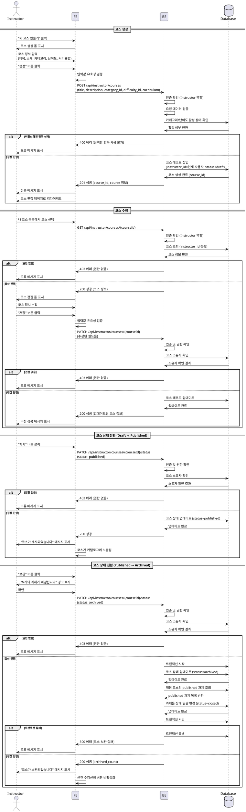

# 코스 관리 (Instructor)

## Primary Actor
- Instructor (강사)

## Precondition
- 사용자가 Instructor 역할로 로그인된 상태
- 강사 대시보드 또는 코스 관리 페이지에 접근 가능

## Trigger
- 강사가 새 코스를 생성하거나 기존 코스를 수정/상태 전환하려고 시도

## Main Scenario

### 코스 생성
1. 강사가 "새 코스 만들기" 버튼 클릭
2. 강사가 코스 정보 입력
   - 제목 (필수)
   - 소개 (필수)
   - 카테고리 선택 (필수)
   - 난이도 선택 (필수)
   - 커리큘럼 (선택)
3. 시스템이 입력값 유효성 검증
4. 시스템이 코스 레코드 생성 (status: draft, instructor_id: 현재 사용자)
5. 시스템이 생성 성공 메시지 표시
6. 강사를 코스 편집 페이지로 리다이렉트

### 코스 수정
1. 강사가 내 코스 목록에서 수정할 코스 선택
2. 시스템이 코스 소유자 검증 (instructor_id === 현재 사용자)
3. 강사가 코스 정보 수정
4. 강사가 "저장" 버튼 클릭
5. 시스템이 입력값 유효성 검증
6. 시스템이 코스 레코드 업데이트
7. 시스템이 수정 성공 메시지 표시

### 코스 상태 전환
1. 강사가 코스 편집 페이지에서 상태 전환 버튼 클릭
   - Draft → Published: "게시" 버튼
   - Published → Archived: "보관" 버튼
2. 시스템이 코스 소유자 검증
3. 시스템이 상태 전환 가능 여부 확인
4. 시스템이 코스 상태 업데이트
5. Published로 전환 시:
   - 코스가 Learner에게 노출됨
   - 코스 카탈로그에 표시됨
6. Archived로 전환 시:
   - 신규 수강신청 차단
   - 해당 코스의 모든 published 상태 과제를 closed로 일괄 변경
   - 기존 수강생은 계속 열람 가능하지만 과제 제출 불가
7. 시스템이 상태 전환 성공 메시지 표시

## Edge Cases

### 권한 없음
- 다른 강사의 코스를 수정하려고 시도 시 "권한이 없습니다" 오류 메시지 표시 및 접근 차단

### 필수 항목 누락
- 제목, 소개, 카테고리, 난이도 중 하나라도 누락 시 "필수 항목을 입력해주세요" 오류 메시지 표시

### 카테고리/난이도 비활성화
- 선택한 카테고리 또는 난이도가 비활성화된 경우 "선택한 항목이 더 이상 사용할 수 없습니다" 오류 메시지 표시

### Draft 상태가 아닌 코스 수정
- Published 또는 Archived 상태의 코스도 수정 가능하지만, 주요 정보 변경 시 주의 메시지 표시

### Archived 코스 재게시 불가
- Archived 상태의 코스는 Published로 재전환 불가
- 새 코스를 생성하여 복제하는 방법 안내

### 코스에 과제가 있는 상태에서 Archive
- Published 상태의 과제가 있는 경우 "N개의 과제가 자동으로 마감됩니다" 경고 메시지 표시 후 확인 필요

### 네트워크 오류
- 코스 생성/수정 중 네트워크 오류 발생 시 "일시적인 오류가 발생했습니다. 다시 시도해주세요" 메시지 표시

### DB 저장 실패
- 코스 저장 실패 시 "코스 저장 중 오류가 발생했습니다" 메시지 표시 및 재시도 옵션 제공

### 과제 일괄 Close 실패
- Archive 시 과제 상태 변경 실패 시 트랜잭션 롤백 및 "코스 보관 중 오류가 발생했습니다" 메시지 표시

## Business Rules

1. 코스는 반드시 Instructor가 소유해야 하며, 본인이 생성한 코스만 수정/상태 전환 가능
2. 코스 생성 시 초기 상태는 draft
3. draft 상태의 코스는 Learner에게 노출되지 않음
4. published 상태의 코스만 수강신청 가능
5. published → archived 전환 시:
   - 신규 수강신청 즉시 차단
   - 해당 코스의 모든 published 상태 과제를 closed로 자동 변경
   - 기존 수강생은 학습 내용 열람 가능, 과제 제출 불가
6. archived 상태의 코스는 published로 재전환 불가 (일방향 상태 전환)
7. 제목, 소개, 카테고리, 난이도는 필수 입력 항목
8. 커리큘럼은 선택 사항이며, 텍스트 또는 JSON 형식으로 저장 가능
9. 카테고리와 난이도는 메타데이터 테이블에서 is_active=true인 항목만 선택 가능
10. 코스 수정 시 updated_at 필드 자동 갱신 (트리거)
11. 코스 상태 전환은 원자적 트랜잭션으로 처리 (과제 일괄 변경 포함)

## Sequence Diagram

