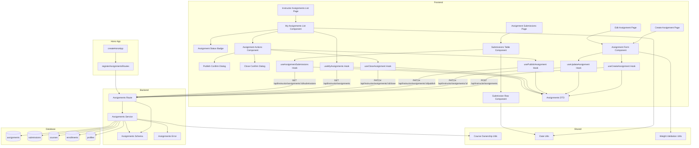

# 과제 관리 (Instructor) 구현 계획

## 개요

### Backend Modules

| 모듈 | 위치 | 설명 |
|------|------|------|
| Instructor Assignments Route | `src/features/assignments/backend/route.ts` | Instructor 과제 생성/수정/상태전환/제출물 조회 API 엔드포인트 (기존 파일 확장) |
| Instructor Assignments Service | `src/features/assignments/backend/service.ts` | 과제 생성/수정/상태전환/제출물 조회 비즈니스 로직 (기존 파일 확장) |
| Instructor Assignments Schema | `src/features/assignments/backend/schema.ts` | 과제 생성/수정 요청/응답 zod 스키마 정의 (기존 파일 확장) |
| Assignments Error | `src/features/assignments/backend/error.ts` | 과제 관리 관련 에러 코드 추가 (기존 파일 확장) |

### Frontend Modules

| 모듈 | 위치 | 설명 |
|------|------|------|
| Instructor Assignments List Page | `src/app/(instructor)/assignments/page.tsx` | 강사 과제 목록 페이지 (신규) |
| Create Assignment Page | `src/app/(instructor)/assignments/new/page.tsx` | 과제 생성 페이지 (신규) |
| Edit Assignment Page | `src/app/(instructor)/assignments/[assignmentId]/edit/page.tsx` | 과제 편집 페이지 (신규) |
| Assignment Submissions Page | `src/app/(instructor)/assignments/[assignmentId]/submissions/page.tsx` | 제출물 목록 페이지 (신규) |
| Assignment Form Component | `src/features/assignments/components/assignment-form.tsx` | 과제 생성/수정 폼 컴포넌트 (신규) |
| Assignment Status Badge | `src/features/assignments/components/assignment-status-badge.tsx` | 과제 상태 뱃지 컴포넌트 (신규) |
| Assignment Actions Component | `src/features/assignments/components/assignment-actions.tsx` | 과제 상태 전환 액션 컴포넌트 (신규) |
| Publish Confirm Dialog | `src/features/assignments/components/publish-confirm-dialog.tsx` | 과제 게시 확인 대화상자 (신규) |
| Close Confirm Dialog | `src/features/assignments/components/close-confirm-dialog.tsx` | 과제 마감 확인 대화상자 (신규) |
| My Assignments List Component | `src/features/assignments/components/my-assignments-list.tsx` | 내 과제 목록 컴포넌트 (신규) |
| Submissions Table Component | `src/features/assignments/components/submissions-table.tsx` | 제출물 테이블 컴포넌트 (신규) |
| Submission Row Component | `src/features/assignments/components/submission-row.tsx` | 제출물 행 컴포넌트 (신규) |
| Assignments DTO | `src/features/assignments/lib/dto.ts` | 프론트엔드 공유용 스키마 재노출 (기존 파일 확장) |
| Create Assignment Hook | `src/features/assignments/hooks/useCreateAssignment.ts` | 과제 생성 React Query mutation (신규) |
| Update Assignment Hook | `src/features/assignments/hooks/useUpdateAssignment.ts` | 과제 수정 React Query mutation (신규) |
| Publish Assignment Hook | `src/features/assignments/hooks/usePublishAssignment.ts` | 과제 게시 React Query mutation (신규) |
| Close Assignment Hook | `src/features/assignments/hooks/useCloseAssignment.ts` | 과제 마감 React Query mutation (신규) |
| My Assignments Hook | `src/features/assignments/hooks/useMyAssignments.ts` | 내 과제 목록 조회 React Query hook (신규) |
| Assignment Submissions Hook | `src/features/assignments/hooks/useAssignmentSubmissions.ts` | 제출물 목록 조회 React Query hook (신규) |

### Shared Modules

| 모듈 | 위치 | 설명 |
|------|------|------|
| Course Ownership Utils | `src/features/shared/course-utils.ts` | 코스 소유권 확인 헬퍼 함수 (신규, assignments/courses service에서 공통 사용) |
| Date Utils | `src/lib/utils/date.ts` | 날짜 포맷팅 유틸 (기존 파일 활용) |
| Weight Validation Utils | `src/features/assignments/lib/weight-calculator.ts` | 점수 비중 합계 계산 및 경고 생성 (신규) |

---

## Diagram



---

## Implementation Plan

### 1. Backend Layer

#### 1.1 Assignments Error (기존 파일 확장)

**File:** `src/features/assignments/backend/error.ts`

**구현 내용:**
```typescript
export const assignmentsErrorCodes = {
  // ... 기존 Learner 에러 코드 유지
  invalidRequest: 'ASSIGNMENTS_INVALID_REQUEST',
  assignmentNotFound: 'ASSIGNMENTS_NOT_FOUND',
  assignmentNotPublished: 'ASSIGNMENTS_NOT_PUBLISHED',
  notEnrolled: 'ASSIGNMENTS_NOT_ENROLLED',
  alreadySubmitted: 'ASSIGNMENTS_ALREADY_SUBMITTED',
  assignmentClosed: 'ASSIGNMENTS_CLOSED',
  pastDueNotAllowed: 'ASSIGNMENTS_PAST_DUE_NOT_ALLOWED',
  resubmitNotAllowed: 'ASSIGNMENTS_RESUBMIT_NOT_ALLOWED',
  submissionNotFound: 'ASSIGNMENTS_SUBMISSION_NOT_FOUND',
  submissionNotAllowed: 'ASSIGNMENTS_SUBMISSION_NOT_ALLOWED',

  // Instructor 관리 관련 에러 코드 추가
  notInstructor: 'ASSIGNMENTS_NOT_INSTRUCTOR',
  notOwner: 'ASSIGNMENTS_NOT_OWNER',
  courseNotFound: 'ASSIGNMENTS_COURSE_NOT_FOUND',
  courseArchived: 'ASSIGNMENTS_COURSE_ARCHIVED',
  invalidDueDate: 'ASSIGNMENTS_INVALID_DUE_DATE',
  invalidWeight: 'ASSIGNMENTS_INVALID_WEIGHT',
  cannotModifyPublished: 'ASSIGNMENTS_CANNOT_MODIFY_PUBLISHED',
  createFailed: 'ASSIGNMENTS_CREATE_FAILED',
  updateFailed: 'ASSIGNMENTS_UPDATE_FAILED',
  publishFailed: 'ASSIGNMENTS_PUBLISH_FAILED',
  closeFailed: 'ASSIGNMENTS_CLOSE_FAILED',
  missingRequiredFields: 'ASSIGNMENTS_MISSING_REQUIRED_FIELDS',
  weightWarning: 'ASSIGNMENTS_WEIGHT_WARNING',
} as const;
```

---

#### 1.2 Assignments Schema (기존 파일 확장)

**File:** `src/features/assignments/backend/schema.ts`

**구현 내용:**

```typescript
// 과제 생성 요청 스키마
export const CreateAssignmentRequestSchema = z.object({
  courseId: z.string().uuid('올바른 코스 ID를 선택해주세요.'),
  title: z.string().min(1, '제목은 필수 항목입니다.'),
  description: z.string().min(1, '설명은 필수 항목입니다.'),
  dueDate: z.string(), // ISO timestamp
  weight: z.number().min(0, '점수 비중은 0 이상이어야 합니다.').max(100, '점수 비중은 100 이하여야 합니다.'),
  allowLate: z.boolean(),
  allowResubmit: z.boolean(),
});

// 과제 수정 요청 스키마
export const UpdateAssignmentRequestSchema = z.object({
  title: z.string().min(1, '제목은 필수 항목입니다.').optional(),
  description: z.string().min(1, '설명은 필수 항목입니다.').optional(),
  // published/closed 상태에서는 마감일/정책 수정 불가이므로 optional 처리
});

// 과제 게시 응답 스키마
export const PublishAssignmentResponseSchema = z.object({
  assignmentId: z.string().uuid(),
  status: z.literal('published'),
  message: z.string(),
});

// 과제 마감 응답 스키마
export const CloseAssignmentResponseSchema = z.object({
  assignmentId: z.string().uuid(),
  status: z.literal('closed'),
  message: z.string(),
});

// 과제 생성 응답 스키마
export const CreateAssignmentResponseSchema = z.object({
  assignmentId: z.string().uuid(),
  title: z.string(),
  status: z.enum(['draft', 'published', 'closed']),
  courseId: z.string().uuid(),
  createdAt: z.string(),
  message: z.string(),
  weightWarning: z.string().optional(), // 점수 비중 합계 100 초과 경고
});

// 과제 수정 응답 스키마
export const UpdateAssignmentResponseSchema = z.object({
  assignmentId: z.string().uuid(),
  title: z.string(),
  updatedAt: z.string(),
  message: z.string(),
});

// 내 과제 아이템 스키마
export const MyAssignmentItemSchema = z.object({
  id: z.string().uuid(),
  courseId: z.string().uuid(),
  courseTitle: z.string(),
  title: z.string(),
  dueDate: z.string(),
  weight: z.number(),
  status: z.enum(['draft', 'published', 'closed']),
  submissionsCount: z.number().int(), // 제출물 수
  gradedCount: z.number().int(), // 채점 완료 수
  createdAt: z.string(),
});

// 내 과제 목록 응답 스키마
export const MyAssignmentsResponseSchema = z.object({
  assignments: z.array(MyAssignmentItemSchema),
  total: z.number().int(),
});

// 제출물 아이템 스키마
export const SubmissionItemSchema = z.object({
  id: z.string().uuid(),
  learnerId: z.string().uuid(),
  learnerName: z.string(),
  submissionText: z.string(),
  submissionLink: z.string().nullable(),
  submittedAt: z.string(),
  isLate: z.boolean(),
  score: z.number().nullable(),
  feedback: z.string().nullable(),
  status: z.enum(['submitted', 'graded', 'resubmission_required']),
  gradedAt: z.string().nullable(),
});

// 제출물 목록 쿼리 스키마
export const SubmissionsQuerySchema = z.object({
  filter: z.enum(['all', 'ungraded', 'late', 'resubmission_required']).optional().default('all'),
});

// 제출물 목록 응답 스키마
export const AssignmentSubmissionsResponseSchema = z.object({
  assignmentId: z.string().uuid(),
  assignmentTitle: z.string(),
  submissions: z.array(SubmissionItemSchema),
  total: z.number().int(),
});

// TypeScript 타입 추출
export type CreateAssignmentRequest = z.infer<typeof CreateAssignmentRequestSchema>;
export type UpdateAssignmentRequest = z.infer<typeof UpdateAssignmentRequestSchema>;
export type PublishAssignmentResponse = z.infer<typeof PublishAssignmentResponseSchema>;
export type CloseAssignmentResponse = z.infer<typeof CloseAssignmentResponseSchema>;
export type CreateAssignmentResponse = z.infer<typeof CreateAssignmentResponseSchema>;
export type UpdateAssignmentResponse = z.infer<typeof UpdateAssignmentResponseSchema>;
export type MyAssignmentItem = z.infer<typeof MyAssignmentItemSchema>;
export type MyAssignmentsResponse = z.infer<typeof MyAssignmentsResponseSchema>;
export type SubmissionItem = z.infer<typeof SubmissionItemSchema>;
export type SubmissionsQuery = z.infer<typeof SubmissionsQuerySchema>;
export type AssignmentSubmissionsResponse = z.infer<typeof AssignmentSubmissionsResponseSchema>;
```

**Unit Test:**
```typescript
describe('CreateAssignmentRequestSchema', () => {
  it('should validate correct assignment data', () => {
    const valid = {
      courseId: '123e4567-e89b-12d3-a456-426614174000',
      title: 'Week 1 Assignment',
      description: 'Complete the exercises',
      dueDate: '2025-12-31T23:59:59Z',
      weight: 20,
      allowLate: true,
      allowResubmit: false,
    };
    expect(CreateAssignmentRequestSchema.safeParse(valid).success).toBe(true);
  });

  it('should reject invalid weight', () => {
    const invalid = {
      courseId: '123e4567-e89b-12d3-a456-426614174000',
      title: 'Week 1',
      description: 'Test',
      dueDate: '2025-12-31T23:59:59Z',
      weight: 150, // 100 초과
      allowLate: false,
      allowResubmit: false,
    };
    expect(CreateAssignmentRequestSchema.safeParse(invalid).success).toBe(false);
  });

  it('should reject empty title', () => {
    const invalid = {
      courseId: '123e4567-e89b-12d3-a456-426614174000',
      title: '',
      description: 'Test',
      dueDate: '2025-12-31T23:59:59Z',
      weight: 20,
      allowLate: false,
      allowResubmit: false,
    };
    expect(CreateAssignmentRequestSchema.safeParse(invalid).success).toBe(false);
  });
});
```

---

#### 1.3 Assignments Service (기존 파일 확장)

**File:** `src/features/assignments/backend/service.ts`

**구현 내용:**

##### 1.3.1 `createAssignment` 함수

- 강사가 새 과제 생성
- 검증:
  1. 코스 존재 확인
  2. 강사가 코스 소유자인지 확인 (`checkCourseOwnership` 헬퍼 사용)
  3. 코스가 `archived` 상태가 아닌지 확인
  4. 마감일이 현재 시점 이후인지 확인
  5. 필수 항목(제목, 설명, 마감일, 점수 비중) 검증
  6. 점수 비중 범위(0~100) 검증
- 비즈니스 로직:
  1. 코스의 기존 과제들의 점수 비중 합계 계산
  2. 새 과제 포함 시 합계가 100 초과하면 경고 메시지 생성 (차단하지는 않음)
  3. `assignments` 테이블에 INSERT (`status='draft'`)
- 응답:
  - `assignmentId`, `title`, `status`, `courseId`, `createdAt`, `message`, `weightWarning` (선택)

##### 1.3.2 `updateAssignment` 함수

- 과제 정보 수정
- 검증:
  1. 과제 존재 확인
  2. 강사가 과제 소유자인지 확인 (과제의 코스 소유자)
  3. `published` 또는 `closed` 상태에서는 제목/설명만 수정 가능 (마감일/정책 수정 불가)
- 비즈니스 로직:
  1. 상태에 따라 수정 가능 필드 제한
  2. `assignments` 테이블 UPDATE
- 응답:
  - `assignmentId`, `title`, `updatedAt`, `message`

##### 1.3.3 `publishAssignment` 함수

- 과제 게시 (draft → published)
- 검증:
  1. 과제 존재 및 소유자 확인
  2. 현재 상태가 `draft`인지 확인
  3. 모든 필수 정보 입력 여부 확인
  4. 코스가 `archived` 상태가 아닌지 확인
- 비즈니스 로직:
  1. `assignments.status` → 'published' 업데이트
- 응답:
  - `assignmentId`, `status`, `message`

##### 1.3.4 `closeAssignment` 함수

- 과제 마감 (published → closed)
- 검증:
  1. 과제 존재 및 소유자 확인
  2. 현재 상태가 `published`인지 확인
- 비즈니스 로직:
  1. `assignments.status` → 'closed' 업데이트
- 응답:
  - `assignmentId`, `status`, `message`

##### 1.3.5 `getMyAssignments` 함수

- 강사 본인이 생성한 과제 목록 조회
- 검증:
  1. `instructorId` 파라미터 필수
- 쿼리:
  1. 강사가 소유한 모든 코스 조회
  2. 해당 코스들의 과제 조회 (모든 상태 포함)
  3. LEFT JOIN `submissions` 로 제출물 개수 계산
  4. 정렬: `created_at` DESC (최신순)
- 응답:
  - 과제 목록 (id, courseId, courseTitle, title, dueDate, weight, status, submissionsCount, gradedCount, createdAt)
  - 전체 과제 수 (total)

##### 1.3.6 `getAssignmentSubmissions` 함수

- 특정 과제의 제출물 목록 조회
- 검증:
  1. 과제 존재 확인
  2. 강사가 과제 소유자인지 확인
- 쿼리:
  1. `submissions` 테이블에서 `assignment_id` 기준으로 조회
  2. JOIN `profiles` 로 학습자 이름 포함
  3. 필터 적용 (미채점/지각/재제출 요청)
  4. 정렬: `submitted_at` DESC (최신순)
- 응답:
  - 제출물 목록 (id, learnerId, learnerName, submissionText, submissionLink, submittedAt, isLate, score, feedback, status, gradedAt)
  - 전체 제출물 수 (total)

##### 1.3.7 헬퍼 함수

- `checkCourseOwnership(supabase, courseId, instructorId)`: 코스 소유자 확인 (공통 모듈로 분리 고려)
- `calculateWeightSum(supabase, courseId, excludeAssignmentId?)`: 코스의 과제 점수 비중 합계 계산
- `checkCourseStatus(supabase, courseId)`: 코스 상태 확인

**구현 코드:**

```typescript
// 헬퍼: 코스 소유권 확인
export const checkCourseOwnership = async (
  supabase: SupabaseClient,
  courseId: string,
  instructorId: string,
): Promise<boolean> => {
  const { data, error } = await supabase
    .from('courses')
    .select('id, instructor_id')
    .eq('id', courseId)
    .eq('instructor_id', instructorId)
    .maybeSingle();

  return !error && !!data;
};

// 헬퍼: 점수 비중 합계 계산
export const calculateWeightSum = async (
  supabase: SupabaseClient,
  courseId: string,
  excludeAssignmentId?: string,
): Promise<number> => {
  let query = supabase
    .from('assignments')
    .select('weight')
    .eq('course_id', courseId)
    .in('status', ['draft', 'published', 'closed']);

  if (excludeAssignmentId) {
    query = query.neq('id', excludeAssignmentId);
  }

  const { data, error } = await query;

  if (error || !data) {
    return 0;
  }

  return data.reduce((sum, row) => sum + (row.weight || 0), 0);
};

export const createAssignment = async (
  supabase: SupabaseClient,
  instructorId: string,
  data: CreateAssignmentRequest,
): Promise<HandlerResult<CreateAssignmentResponse, AssignmentsServiceError>> => {
  try {
    // 1. 코스 소유권 및 상태 확인
    const { data: course, error: courseError } = await supabase
      .from('courses')
      .select('id, instructor_id, title, status')
      .eq('id', data.courseId)
      .single();

    if (courseError || !course) {
      return failure(
        404,
        assignmentsErrorCodes.courseNotFound,
        '코스를 찾을 수 없습니다.',
      );
    }

    if (course.instructor_id !== instructorId) {
      return failure(403, assignmentsErrorCodes.notOwner, '권한이 없습니다.');
    }

    if (course.status === 'archived') {
      return failure(
        400,
        assignmentsErrorCodes.courseArchived,
        '보관된 코스에는 과제를 생성할 수 없습니다.',
      );
    }

    // 2. 마감일 검증 (현재 시점 이후)
    if (new Date(data.dueDate) <= new Date()) {
      return failure(
        400,
        assignmentsErrorCodes.invalidDueDate,
        '마감일은 현재 시점 이후로 설정해야 합니다.',
      );
    }

    // 3. 점수 비중 합계 계산
    const currentWeightSum = await calculateWeightSum(supabase, data.courseId);
    const newWeightSum = currentWeightSum + data.weight;

    let weightWarning: string | undefined;
    if (newWeightSum > 100) {
      weightWarning = `현재 코스의 과제 점수 비중 합계가 ${newWeightSum.toFixed(1)}%로 100%를 초과합니다.`;
    }

    // 4. 과제 생성
    const { data: assignment, error: createError } = await supabase
      .from('assignments')
      .insert({
        course_id: data.courseId,
        title: data.title,
        description: data.description,
        due_date: data.dueDate,
        weight: data.weight,
        allow_late: data.allowLate,
        allow_resubmit: data.allowResubmit,
        status: 'draft',
      })
      .select('id, title, status, course_id, created_at')
      .single();

    if (createError || !assignment) {
      return failure(
        500,
        assignmentsErrorCodes.createFailed,
        createError?.message || '과제 생성 중 오류가 발생했습니다.',
      );
    }

    return success(
      {
        assignmentId: assignment.id,
        title: assignment.title,
        status: assignment.status as 'draft' | 'published' | 'closed',
        courseId: assignment.course_id,
        createdAt: assignment.created_at,
        message: '과제가 성공적으로 임시 저장되었습니다.',
        weightWarning,
      },
      201,
    );
  } catch (err) {
    return failure(
      500,
      assignmentsErrorCodes.createFailed,
      err instanceof Error ? err.message : 'Unknown error',
    );
  }
};

export const updateAssignment = async (
  supabase: SupabaseClient,
  instructorId: string,
  assignmentId: string,
  data: UpdateAssignmentRequest,
): Promise<HandlerResult<UpdateAssignmentResponse, AssignmentsServiceError>> => {
  try {
    // 1. 과제 소유자 및 상태 확인
    const { data: assignment, error: checkError } = await supabase
      .from('assignments')
      .select('id, course_id, status, title')
      .eq('id', assignmentId)
      .single();

    if (checkError || !assignment) {
      return failure(
        404,
        assignmentsErrorCodes.assignmentNotFound,
        '과제를 찾을 수 없습니다.',
      );
    }

    const isOwner = await checkCourseOwnership(
      supabase,
      assignment.course_id,
      instructorId,
    );

    if (!isOwner) {
      return failure(403, assignmentsErrorCodes.notOwner, '권한이 없습니다.');
    }

    // 2. published/closed 상태에서는 제목/설명만 수정 가능
    if (['published', 'closed'].includes(assignment.status)) {
      // 제목/설명만 허용
      const updateData: Record<string, unknown> = {};
      if (data.title !== undefined) updateData.title = data.title;
      if (data.description !== undefined) updateData.description = data.description;

      const { data: updated, error: updateError } = await supabase
        .from('assignments')
        .update(updateData)
        .eq('id', assignmentId)
        .select('id, title, updated_at')
        .single();

      if (updateError || !updated) {
        return failure(
          500,
          assignmentsErrorCodes.updateFailed,
          updateError?.message || '과제 수정 중 오류가 발생했습니다.',
        );
      }

      return success({
        assignmentId: updated.id,
        title: updated.title,
        updatedAt: updated.updated_at,
        message: '과제가 성공적으로 수정되었습니다.',
      });
    }

    // 3. draft 상태에서는 모든 필드 수정 가능
    const updateData: Record<string, unknown> = {};
    if (data.title !== undefined) updateData.title = data.title;
    if (data.description !== undefined) updateData.description = data.description;

    const { data: updated, error: updateError } = await supabase
      .from('assignments')
      .update(updateData)
      .eq('id', assignmentId)
      .select('id, title, updated_at')
      .single();

    if (updateError || !updated) {
      return failure(
        500,
        assignmentsErrorCodes.updateFailed,
        updateError?.message || '과제 수정 중 오류가 발생했습니다.',
      );
    }

    return success({
      assignmentId: updated.id,
      title: updated.title,
      updatedAt: updated.updated_at,
      message: '과제가 성공적으로 수정되었습니다.',
    });
  } catch (err) {
    return failure(
      500,
      assignmentsErrorCodes.updateFailed,
      err instanceof Error ? err.message : 'Unknown error',
    );
  }
};

export const publishAssignment = async (
  supabase: SupabaseClient,
  instructorId: string,
  assignmentId: string,
): Promise<HandlerResult<PublishAssignmentResponse, AssignmentsServiceError>> => {
  try {
    // 1. 과제 소유자 및 상태 확인
    const { data: assignment, error: checkError } = await supabase
      .from('assignments')
      .select('id, course_id, status, title, description, due_date, weight')
      .eq('id', assignmentId)
      .single();

    if (checkError || !assignment) {
      return failure(
        404,
        assignmentsErrorCodes.assignmentNotFound,
        '과제를 찾을 수 없습니다.',
      );
    }

    const isOwner = await checkCourseOwnership(
      supabase,
      assignment.course_id,
      instructorId,
    );

    if (!isOwner) {
      return failure(403, assignmentsErrorCodes.notOwner, '권한이 없습니다.');
    }

    // 2. 현재 상태 확인 (draft만 게시 가능)
    if (assignment.status !== 'draft') {
      return failure(
        400,
        assignmentsErrorCodes.publishFailed,
        '이미 게시된 과제입니다.',
      );
    }

    // 3. 필수 정보 입력 여부 확인
    if (!assignment.title || !assignment.description || !assignment.due_date) {
      return failure(
        400,
        assignmentsErrorCodes.missingRequiredFields,
        '필수 정보를 모두 입력해주세요.',
      );
    }

    // 4. 코스 상태 확인
    const { data: course, error: courseError } = await supabase
      .from('courses')
      .select('status')
      .eq('id', assignment.course_id)
      .single();

    if (courseError || !course) {
      return failure(
        404,
        assignmentsErrorCodes.courseNotFound,
        '코스를 찾을 수 없습니다.',
      );
    }

    if (course.status === 'archived') {
      return failure(
        400,
        assignmentsErrorCodes.courseArchived,
        '보관된 코스의 과제는 게시할 수 없습니다.',
      );
    }

    // 5. 과제 게시
    const { data: updated, error: updateError } = await supabase
      .from('assignments')
      .update({ status: 'published' })
      .eq('id', assignmentId)
      .select('id, status')
      .single();

    if (updateError || !updated) {
      return failure(
        500,
        assignmentsErrorCodes.publishFailed,
        updateError?.message || '과제 게시 중 오류가 발생했습니다.',
      );
    }

    return success({
      assignmentId: updated.id,
      status: 'published' as const,
      message: '과제가 게시되었습니다.',
    });
  } catch (err) {
    return failure(
      500,
      assignmentsErrorCodes.publishFailed,
      err instanceof Error ? err.message : 'Unknown error',
    );
  }
};

export const closeAssignment = async (
  supabase: SupabaseClient,
  instructorId: string,
  assignmentId: string,
): Promise<HandlerResult<CloseAssignmentResponse, AssignmentsServiceError>> => {
  try {
    // 1. 과제 소유자 및 상태 확인
    const { data: assignment, error: checkError } = await supabase
      .from('assignments')
      .select('id, course_id, status')
      .eq('id', assignmentId)
      .single();

    if (checkError || !assignment) {
      return failure(
        404,
        assignmentsErrorCodes.assignmentNotFound,
        '과제를 찾을 수 없습니다.',
      );
    }

    const isOwner = await checkCourseOwnership(
      supabase,
      assignment.course_id,
      instructorId,
    );

    if (!isOwner) {
      return failure(403, assignmentsErrorCodes.notOwner, '권한이 없습니다.');
    }

    // 2. 현재 상태 확인 (published만 마감 가능)
    if (assignment.status !== 'published') {
      return failure(
        400,
        assignmentsErrorCodes.closeFailed,
        '게시된 과제만 마감할 수 있습니다.',
      );
    }

    // 3. 과제 마감
    const { data: updated, error: updateError } = await supabase
      .from('assignments')
      .update({ status: 'closed' })
      .eq('id', assignmentId)
      .select('id, status')
      .single();

    if (updateError || !updated) {
      return failure(
        500,
        assignmentsErrorCodes.closeFailed,
        updateError?.message || '과제 마감 중 오류가 발생했습니다.',
      );
    }

    return success({
      assignmentId: updated.id,
      status: 'closed' as const,
      message: '과제가 마감되었습니다.',
    });
  } catch (err) {
    return failure(
      500,
      assignmentsErrorCodes.closeFailed,
      err instanceof Error ? err.message : 'Unknown error',
    );
  }
};

export const getMyAssignments = async (
  supabase: SupabaseClient,
  instructorId: string,
): Promise<HandlerResult<MyAssignmentsResponse, AssignmentsServiceError>> => {
  try {
    // 1. 강사가 소유한 코스 조회
    const { data: courses, error: coursesError } = await supabase
      .from('courses')
      .select('id')
      .eq('instructor_id', instructorId);

    if (coursesError) {
      return failure(500, assignmentsErrorCodes.invalidRequest, coursesError.message);
    }

    const courseIds = (courses || []).map((c) => c.id);

    if (courseIds.length === 0) {
      return success({
        assignments: [],
        total: 0,
      });
    }

    // 2. 해당 코스들의 과제 조회
    const { data: assignmentsData, error: assignmentsError, count } = await supabase
      .from('assignments')
      .select(
        `
        id,
        course_id,
        title,
        due_date,
        weight,
        status,
        created_at,
        courses!inner(title)
      `,
        { count: 'exact' },
      )
      .in('course_id', courseIds)
      .order('created_at', { ascending: false });

    if (assignmentsError) {
      return failure(
        500,
        assignmentsErrorCodes.invalidRequest,
        assignmentsError.message,
      );
    }

    // 3. 각 과제의 제출물 통계 조회
    const assignments = await Promise.all(
      (assignmentsData || []).map(async (row: any) => {
        const { data: submissionsData } = await supabase
          .from('submissions')
          .select('id, status')
          .eq('assignment_id', row.id);

        const submissionsCount = submissionsData?.length || 0;
        const gradedCount = submissionsData?.filter((s) => s.status === 'graded').length || 0;

        return {
          id: row.id,
          courseId: row.course_id,
          courseTitle: row.courses?.title || '',
          title: row.title,
          dueDate: row.due_date,
          weight: row.weight,
          status: row.status,
          submissionsCount,
          gradedCount,
          createdAt: row.created_at,
        };
      }),
    );

    return success({
      assignments,
      total: count || 0,
    });
  } catch (err) {
    return failure(
      500,
      assignmentsErrorCodes.invalidRequest,
      err instanceof Error ? err.message : 'Unknown error',
    );
  }
};

export const getAssignmentSubmissions = async (
  supabase: SupabaseClient,
  instructorId: string,
  assignmentId: string,
  filter: 'all' | 'ungraded' | 'late' | 'resubmission_required',
): Promise<HandlerResult<AssignmentSubmissionsResponse, AssignmentsServiceError>> => {
  try {
    // 1. 과제 소유자 확인
    const { data: assignment, error: assignmentError } = await supabase
      .from('assignments')
      .select('id, course_id, title')
      .eq('id', assignmentId)
      .single();

    if (assignmentError || !assignment) {
      return failure(
        404,
        assignmentsErrorCodes.assignmentNotFound,
        '과제를 찾을 수 없습니다.',
      );
    }

    const isOwner = await checkCourseOwnership(
      supabase,
      assignment.course_id,
      instructorId,
    );

    if (!isOwner) {
      return failure(403, assignmentsErrorCodes.notOwner, '권한이 없습니다.');
    }

    // 2. 제출물 조회 (필터 적용)
    let query = supabase
      .from('submissions')
      .select(
        `
        id,
        learner_id,
        submission_text,
        submission_link,
        submitted_at,
        is_late,
        score,
        feedback,
        status,
        graded_at,
        profiles!submissions_learner_id_fkey(name)
      `,
        { count: 'exact' },
      )
      .eq('assignment_id', assignmentId);

    if (filter === 'ungraded') {
      query = query.eq('status', 'submitted');
    } else if (filter === 'late') {
      query = query.eq('is_late', true);
    } else if (filter === 'resubmission_required') {
      query = query.eq('status', 'resubmission_required');
    }

    query = query.order('submitted_at', { ascending: false });

    const { data, error, count } = await query;

    if (error) {
      return failure(500, assignmentsErrorCodes.invalidRequest, error.message);
    }

    const submissions: SubmissionItem[] = (data || []).map((row: any) => ({
      id: row.id,
      learnerId: row.learner_id,
      learnerName: row.profiles?.name || '',
      submissionText: row.submission_text,
      submissionLink: row.submission_link,
      submittedAt: row.submitted_at,
      isLate: row.is_late,
      score: row.score,
      feedback: row.feedback,
      status: row.status,
      gradedAt: row.graded_at,
    }));

    return success({
      assignmentId: assignment.id,
      assignmentTitle: assignment.title,
      submissions,
      total: count || 0,
    });
  } catch (err) {
    return failure(
      500,
      assignmentsErrorCodes.invalidRequest,
      err instanceof Error ? err.message : 'Unknown error',
    );
  }
};
```

**Unit Test:**
```typescript
describe('createAssignment', () => {
  it('should create assignment with valid data', async () => {
    // Mock implementation
    const result = await createAssignment(mockSupabaseClient, 'instructor-1', {
      courseId: 'course-1',
      title: 'Week 1 Assignment',
      description: 'Complete exercises',
      dueDate: '2025-12-31T23:59:59Z',
      weight: 20,
      allowLate: true,
      allowResubmit: false,
    });

    expect(result.ok).toBe(true);
    expect(result.data.status).toBe('draft');
  });

  it('should return error when course is archived', async () => {
    // Mock archived course
    const result = await createAssignment(mockSupabaseClient, 'instructor-1', {
      courseId: 'archived-course',
      title: 'Test',
      description: 'Test',
      dueDate: '2025-12-31T23:59:59Z',
      weight: 20,
      allowLate: false,
      allowResubmit: false,
    });

    expect(result.ok).toBe(false);
    expect(result.error.code).toBe(assignmentsErrorCodes.courseArchived);
  });

  it('should return warning when weight sum exceeds 100', async () => {
    // Mock: 기존 과제 합계 85, 새 과제 20 → 105
    const result = await createAssignment(mockSupabaseClient, 'instructor-1', {
      courseId: 'course-1',
      title: 'Test',
      description: 'Test',
      dueDate: '2025-12-31T23:59:59Z',
      weight: 20,
      allowLate: false,
      allowResubmit: false,
    });

    expect(result.ok).toBe(true);
    expect(result.data.weightWarning).toContain('105');
  });

  it('should reject past due date', async () => {
    const result = await createAssignment(mockSupabaseClient, 'instructor-1', {
      courseId: 'course-1',
      title: 'Test',
      description: 'Test',
      dueDate: '2020-01-01T00:00:00Z', // 과거 날짜
      weight: 20,
      allowLate: false,
      allowResubmit: false,
    });

    expect(result.ok).toBe(false);
    expect(result.error.code).toBe(assignmentsErrorCodes.invalidDueDate);
  });
});

describe('publishAssignment', () => {
  it('should publish draft assignment', async () => {
    const result = await publishAssignment(
      mockSupabaseClient,
      'instructor-1',
      'assignment-1',
    );

    expect(result.ok).toBe(true);
    expect(result.data.status).toBe('published');
  });

  it('should reject if course is archived', async () => {
    // Mock: 과제의 코스가 archived
    const result = await publishAssignment(
      mockSupabaseClient,
      'instructor-1',
      'assignment-1',
    );

    expect(result.ok).toBe(false);
    expect(result.error.code).toBe(assignmentsErrorCodes.courseArchived);
  });

  it('should reject if not owner', async () => {
    const result = await publishAssignment(
      mockSupabaseClient,
      'other-instructor',
      'assignment-1',
    );

    expect(result.ok).toBe(false);
    expect(result.error.code).toBe(assignmentsErrorCodes.notOwner);
  });
});

describe('getAssignmentSubmissions', () => {
  it('should return all submissions', async () => {
    const result = await getAssignmentSubmissions(
      mockSupabaseClient,
      'instructor-1',
      'assignment-1',
      'all',
    );

    expect(result.ok).toBe(true);
    expect(result.data.submissions).toBeInstanceOf(Array);
  });

  it('should filter ungraded submissions', async () => {
    const result = await getAssignmentSubmissions(
      mockSupabaseClient,
      'instructor-1',
      'assignment-1',
      'ungraded',
    );

    expect(result.ok).toBe(true);
    result.data.submissions.forEach((s) => {
      expect(s.status).toBe('submitted');
    });
  });
});
```

---

#### 1.4 Assignments Route (기존 파일 확장)

**File:** `src/features/assignments/backend/route.ts`

**구현 내용:**

- `POST /api/instructor/assignments` 엔드포인트: 과제 생성
- `GET /api/instructor/assignments` 엔드포인트: 내 과제 목록 조회
- `PATCH /api/instructor/assignments/:id` 엔드포인트: 과제 수정
- `PATCH /api/instructor/assignments/:id/publish` 엔드포인트: 과제 게시
- `PATCH /api/instructor/assignments/:id/close` 엔드포인트: 과제 마감
- `GET /api/instructor/assignments/:id/submissions` 엔드포인트: 제출물 목록 조회
- 모든 엔드포인트에서 사용자 인증 확인 (`x-user-id` 헤더)
- 요청 body 파싱 및 검증
- 성공/실패 응답 반환 (`respond` 헬퍼 사용)

**Integration Test:**
```typescript
describe('POST /api/instructor/assignments', () => {
  it('should return 201 on successful creation', async () => {
    const response = await request(app)
      .post('/api/instructor/assignments')
      .set('x-user-id', 'instructor-1')
      .send({
        courseId: 'course-1',
        title: 'Week 1 Assignment',
        description: 'Complete exercises',
        dueDate: '2025-12-31T23:59:59Z',
        weight: 20,
        allowLate: true,
        allowResubmit: false,
      });

    expect(response.status).toBe(201);
    expect(response.body.assignmentId).toBeDefined();
    expect(response.body.status).toBe('draft');
  });

  it('should return warning when weight exceeds 100', async () => {
    const response = await request(app)
      .post('/api/instructor/assignments')
      .set('x-user-id', 'instructor-1')
      .send({
        courseId: 'course-1',
        title: 'Week 5',
        description: 'Test',
        dueDate: '2025-12-31T23:59:59Z',
        weight: 50, // 기존 합계 85 + 50 = 135
        allowLate: false,
        allowResubmit: false,
      });

    expect(response.status).toBe(201);
    expect(response.body.weightWarning).toBeDefined();
  });
});

describe('PATCH /api/instructor/assignments/:id/publish', () => {
  it('should publish assignment', async () => {
    const response = await request(app)
      .patch('/api/instructor/assignments/assignment-1/publish')
      .set('x-user-id', 'instructor-1');

    expect(response.status).toBe(200);
    expect(response.body.status).toBe('published');
  });

  it('should reject if course is archived', async () => {
    const response = await request(app)
      .patch('/api/instructor/assignments/assignment-archived/publish')
      .set('x-user-id', 'instructor-1');

    expect(response.status).toBe(400);
    expect(response.body.error.code).toBe(assignmentsErrorCodes.courseArchived);
  });
});

describe('GET /api/instructor/assignments/:id/submissions', () => {
  it('should return submissions list', async () => {
    const response = await request(app)
      .get('/api/instructor/assignments/assignment-1/submissions')
      .set('x-user-id', 'instructor-1');

    expect(response.status).toBe(200);
    expect(response.body.submissions).toBeInstanceOf(Array);
  });

  it('should filter ungraded submissions', async () => {
    const response = await request(app)
      .get('/api/instructor/assignments/assignment-1/submissions?filter=ungraded')
      .set('x-user-id', 'instructor-1');

    expect(response.status).toBe(200);
    response.body.submissions.forEach((s: any) => {
      expect(s.status).toBe('submitted');
    });
  });
});
```

---

### 2. Shared Layer

#### 2.1 Weight Validation Utils

**File:** `src/features/assignments/lib/weight-calculator.ts`

**구현 내용:**
```typescript
export interface WeightInfo {
  sum: number;
  exceeds100: boolean;
  warning: string | null;
}

export const calculateWeightInfo = (
  existingWeights: number[],
  newWeight: number,
): WeightInfo => {
  const sum = existingWeights.reduce((acc, w) => acc + w, 0) + newWeight;
  const exceeds100 = sum > 100;
  const warning = exceeds100
    ? `현재 코스의 과제 점수 비중 합계가 ${sum.toFixed(1)}%로 100%를 초과합니다.`
    : null;

  return { sum, exceeds100, warning };
};
```

**Unit Test:**
```typescript
describe('calculateWeightInfo', () => {
  it('should return warning when exceeds 100', () => {
    const result = calculateWeightInfo([30, 40, 20], 15); // 105
    expect(result.exceeds100).toBe(true);
    expect(result.warning).toContain('105');
  });

  it('should return no warning when under 100', () => {
    const result = calculateWeightInfo([30, 40, 20], 10); // 100
    expect(result.exceeds100).toBe(false);
    expect(result.warning).toBeNull();
  });
});
```

---

### 3. Frontend Layer

#### 3.1 Assignments DTO (기존 파일 확장)

**File:** `src/features/assignments/lib/dto.ts`

**구현 내용:**
```typescript
export {
  // 기존 Learner DTO 유지
  AssignmentItemSchema,
  AssignmentListResponseSchema,
  AssignmentDetailResponseSchema,
  SubmitAssignmentRequestSchema,
  ResubmitAssignmentRequestSchema,
  SubmitAssignmentResponseSchema,
  type AssignmentItem,
  type AssignmentListResponse,
  type AssignmentDetailResponse,
  type SubmitAssignmentRequest,
  type ResubmitAssignmentRequest,
  type SubmitAssignmentResponse,

  // Instructor DTO 추가
  CreateAssignmentRequestSchema,
  UpdateAssignmentRequestSchema,
  PublishAssignmentResponseSchema,
  CloseAssignmentResponseSchema,
  CreateAssignmentResponseSchema,
  UpdateAssignmentResponseSchema,
  MyAssignmentItemSchema,
  MyAssignmentsResponseSchema,
  SubmissionItemSchema,
  SubmissionsQuerySchema,
  AssignmentSubmissionsResponseSchema,
  type CreateAssignmentRequest,
  type UpdateAssignmentRequest,
  type PublishAssignmentResponse,
  type CloseAssignmentResponse,
  type CreateAssignmentResponse,
  type UpdateAssignmentResponse,
  type MyAssignmentItem,
  type MyAssignmentsResponse,
  type SubmissionItem,
  type SubmissionsQuery,
  type AssignmentSubmissionsResponse,
} from '@/features/assignments/backend/schema';
```

---

#### 3.2 Create Assignment Hook

**File:** `src/features/assignments/hooks/useCreateAssignment.ts`

**구현 내용:**
```typescript
'use client';

import { useMutation, useQueryClient } from '@tanstack/react-query';
import { useRouter } from 'next/navigation';
import { apiClient, extractApiErrorMessage } from '@/lib/remote/api-client';
import {
  CreateAssignmentRequestSchema,
  CreateAssignmentResponseSchema,
  type CreateAssignmentRequest,
  type CreateAssignmentResponse,
} from '../lib/dto';

const createAssignment = async (
  data: CreateAssignmentRequest,
): Promise<CreateAssignmentResponse> => {
  try {
    const validated = CreateAssignmentRequestSchema.parse(data);
    const { data: response } = await apiClient.post(
      '/api/instructor/assignments',
      validated,
    );
    return CreateAssignmentResponseSchema.parse(response);
  } catch (error) {
    const message = extractApiErrorMessage(error, '과제 생성에 실패했습니다.');
    throw new Error(message);
  }
};

export const useCreateAssignment = () => {
  const queryClient = useQueryClient();
  const router = useRouter();

  return useMutation({
    mutationFn: createAssignment,
    onSuccess: (data) => {
      queryClient.invalidateQueries({ queryKey: ['instructor', 'assignments'] });
      router.push(`/instructor/assignments/${data.assignmentId}/edit`);
    },
  });
};
```

---

#### 3.3 Frontend Components & Pages QA Sheets

**Assignment Form Component QA Sheet:**
| 시나리오 | 입력 | 예상 결과 |
|---------|------|----------|
| 정상 생성 | 모든 필드 올바르게 입력 | 과제 생성 성공, 편집 페이지로 이동 |
| 제목 누락 | 제목 비움 | "제목은 필수 항목입니다" 오류 |
| 마감일 과거 | 과거 날짜 선택 | "마감일은 현재 시점 이후로 설정해야 합니다" 오류 |
| 점수 비중 초과 | 기존 합계 85 + 새 과제 20 | 경고 메시지 표시 "현재 105%로 100% 초과" |
| 보관된 코스 | archived 코스 선택 | "보관된 코스에는 과제를 생성할 수 없습니다" 오류 |

**Assignment Actions Component QA Sheet:**
| 시나리오 | 입력 | 예상 결과 |
|---------|------|----------|
| Draft 상태 | status = 'draft' | "게시" 버튼 표시 |
| 게시 버튼 클릭 | 버튼 클릭 | Publish Confirm Dialog 표시 |
| Published 상태 | status = 'published' | "마감" 버튼 표시 |
| 마감 버튼 클릭 | 버튼 클릭 | Close Confirm Dialog 표시 |
| Closed 상태 | status = 'closed' | "마감된 과제입니다" 안내 |

**Submissions Table Component QA Sheet:**
| 시나리오 | 입력 | 예상 결과 |
|---------|------|----------|
| 전체 제출물 | filter = 'all' | 모든 제출물 표시 |
| 미채점 필터 | filter = 'ungraded' | status = 'submitted'인 제출물만 표시 |
| 지각 필터 | filter = 'late' | is_late = true인 제출물만 표시 |
| 재제출 요청 필터 | filter = 'resubmission_required' | status = 'resubmission_required'인 제출물만 표시 |
| 빈 목록 | 제출물 0개 | "아직 제출된 과제가 없습니다" 메시지 |

---

## Implementation Order

1. **Shared**: Weight Validation Utils 구현 및 테스트
2. **Backend Error**: `assignments/backend/error.ts` 확장 (Instructor 관련 에러 코드 추가)
3. **Backend Schema**: `assignments/backend/schema.ts` 확장 (생성/수정/상태전환 스키마 추가)
4. **Backend Service**: `assignments/backend/service.ts` 확장
   - `checkCourseOwnership` 헬퍼 (공통 모듈로 분리 고려)
   - `calculateWeightSum` 헬퍼
   - `createAssignment` 구현 및 테스트
   - `updateAssignment` 구현 및 테스트
   - `publishAssignment` 구현 및 테스트
   - `closeAssignment` 구현 및 테스트
   - `getMyAssignments` 구현 및 테스트
   - `getAssignmentSubmissions` 구현 및 테스트
5. **Backend Route**: `assignments/backend/route.ts` 확장
   - `POST /api/instructor/assignments`
   - `GET /api/instructor/assignments`
   - `PATCH /api/instructor/assignments/:id`
   - `PATCH /api/instructor/assignments/:id/publish`
   - `PATCH /api/instructor/assignments/:id/close`
   - `GET /api/instructor/assignments/:id/submissions`
   - Integration 테스트
6. **Frontend DTO**: `assignments/lib/dto.ts` 확장 (Instructor 스키마 재노출)
7. **Frontend Hooks**: 훅 구현
   - `useCreateAssignment`
   - `useUpdateAssignment`
   - `usePublishAssignment`
   - `useCloseAssignment`
   - `useMyAssignments`
   - `useAssignmentSubmissions`
8. **Frontend Components**: 컴포넌트 구현
   - `AssignmentStatusBadge`
   - `PublishConfirmDialog`
   - `CloseConfirmDialog`
   - `AssignmentActions`
   - `AssignmentForm`
   - `MyAssignmentsList`
   - `SubmissionsTable`
   - `SubmissionRow`
9. **Frontend Pages**: 페이지 구현
   - Instructor Assignments List Page
   - Create Assignment Page
   - Edit Assignment Page
   - Assignment Submissions Page
10. **Integration Test**: Full flow 수동 QA (생성, 수정, 상태 전환, 제출물 조회, edge cases)

---

## Notes

### 비즈니스 규칙

- **과제 소유권**: 강사는 본인이 소유한 코스의 과제만 생성/수정/상태 전환 가능
- **초기 상태**: 과제 생성 시 `status='draft'`
- **상태 전환 규칙**:
  - draft → published: 허용 (모든 필수 정보 입력 완료, 코스가 archived 아님)
  - published → closed: 허용
  - 역방향 전환 불가
- **수정 제한**:
  - draft: 모든 필드 수정 가능
  - published/closed: 제목, 설명만 수정 가능 (마감일, 점수 비중, 정책 수정 불가)
- **마감일 자동 마감**: 마감일 지난 published 과제는 배치 작업 또는 트리거로 자동 closed 처리 (추후 구현)
- **점수 비중 경고**: 코스 내 과제 점수 비중 합계가 100 초과 시 경고 메시지 표시 (차단하지는 않음)
- **코스 Archive 시 과제 자동 마감**: 코스가 archived 상태로 변경되면 해당 코스의 모든 published 과제는 closed로 전환 (이미 구현됨, courses service 참고)
- **제출물 필터링**: 미채점/지각/재제출 요청 필터 지원

### 기술적 고려사항

- **인증**: 모든 API는 `x-user-id` 헤더로 사용자 ID 추출
- **권한 검증**: Instructor 역할만 과제 관리 페이지 접근 가능
- **에러 처리**: 모든 API 호출에서 에러 메시지 사용자에게 표시
- **날짜 표시**: 한국어 로케일 사용 (`date-fns/locale/ko`)
- **캐싱**: React Query의 `invalidateQueries`로 생성/수정 후 캐시 무효화
- **타입 안전성**: 백엔드 스키마를 프론트엔드에서 재사용

### 기존 코드와의 통합

- `assignments` feature는 이미 Learner용으로 구현되어 있으므로, 기존 파일에 Instructor 로직 추가
- `checkEnrollment` 헬퍼는 이미 assignments service에 존재, `checkCourseOwnership` 추가 필요
- `respond` 헬퍼는 `src/backend/http/response.ts`에서 제공하는 공통 헬퍼 사용
- `date-fns` 기반 날짜 유틸리티는 기존 `src/lib/utils/date.ts` 파일 활용
- courses service의 `updateCourseStatus`에서 이미 과제 일괄 마감 로직 구현되어 있음

### 추후 확장

- 과제 복제 기능
- 과제별 통계 (평균 점수, 제출률)
- 과제 템플릿 기능
- 파일 첨부 기능 (현재는 텍스트/링크만 지원)
- 마감일 자동 마감 배치 작업 또는 데이터베이스 트리거

### 데이터베이스 관련

- `assignments`, `submissions` 테이블은 이미 존재하며, 추가 마이그레이션 불필요
- `updated_at` 트리거는 이미 설정되어 있음
- 제출물 개수는 실시간 조회로 계산 (캐싱 고려 X)

### 라우팅 규칙

- Instructor 페이지는 `/instructor/*` 경로 사용
- Next.js 라우트 그룹 `(instructor)` 활용
