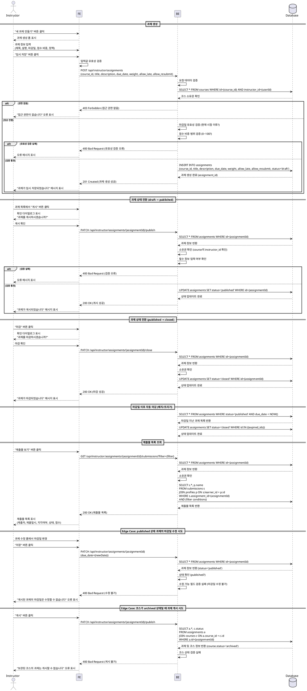

# 과제 관리 (Instructor) - Use Case Specification

## Primary Actor

**Instructor** (강사)

---

## Precondition

- 사용자가 Instructor 역할로 로그인되어 있다.
- 강사가 소유한 코스가 최소 1개 이상 존재한다.
- 강사가 과제 관리 페이지(`/instructor/assignments`)에 접근할 수 있다.

---

## Trigger

- 강사가 과제 생성 페이지에 접근하여 새 과제를 생성한다.
- 강사가 기존 과제를 수정하거나 상태를 변경한다.
- 강사가 과제 제출물 목록을 조회한다.

---

## Main Scenario

### UC-009-1: 과제 생성

1. 강사가 과제 관리 페이지에서 "새 과제 만들기" 버튼을 클릭한다.
2. 시스템은 과제 생성 폼을 표시한다.
3. 강사가 다음 정보를 입력한다:
   - 소속 코스 선택 (본인이 소유한 코스 목록에서 선택)
   - 과제 제목 (필수)
   - 과제 설명 (필수)
   - 마감일 (필수, 날짜 및 시간)
   - 점수 비중 (필수, 0~100 범위)
   - 지각 제출 허용 여부 (체크박스)
   - 재제출 허용 여부 (체크박스)
4. 강사가 "임시 저장" 버튼을 클릭한다.
5. 시스템은 입력값을 검증한다:
   - 제목, 설명, 마감일, 점수 비중 필수 입력 확인
   - 점수 비중이 0~100 범위 내인지 확인
   - 마감일이 현재 시점 이후인지 확인
   - 강사가 해당 코스의 소유자인지 확인
6. 시스템은 `assignments` 테이블에 새 레코드를 생성한다 (상태: `draft`).
7. 시스템은 "과제가 임시 저장되었습니다" 메시지를 표시한다.
8. 강사는 과제 목록 페이지로 이동한다.

### UC-009-2: 과제 수정

1. 강사가 과제 목록에서 수정할 과제를 선택한다.
2. 시스템은 과제 수정 폼을 표시한다 (기존 데이터 표시).
3. 강사가 과제 정보를 수정한다.
4. 강사가 "저장" 버튼을 클릭한다.
5. 시스템은 다음을 검증한다:
   - 강사가 해당 과제의 소유자인지 확인 (과제의 코스 소유자 확인)
   - 입력값 유효성 검증 (생성 시와 동일)
   - `published` 또는 `closed` 상태의 과제는 제한적으로만 수정 가능 (제목, 설명만 수정 가능, 마감일/정책은 수정 불가)
6. 시스템은 `assignments` 테이블의 해당 레코드를 업데이트한다.
7. 시스템은 "과제가 수정되었습니다" 메시지를 표시한다.

### UC-009-3: 과제 상태 전환 (draft → published)

1. 강사가 `draft` 상태의 과제를 선택한다.
2. 강사가 "게시" 버튼을 클릭한다.
3. 시스템은 다음을 검증한다:
   - 과제의 모든 필수 정보가 입력되었는지 확인
   - 강사가 해당 과제의 소유자인지 확인
4. 시스템은 확인 다이얼로그를 표시한다: "과제를 게시하시겠습니까? 게시 후에는 마감일과 정책을 수정할 수 없습니다."
5. 강사가 확인하면, 시스템은 `assignments` 테이블의 `status`를 `published`로 업데이트한다.
6. 시스템은 해당 코스를 수강 중인 모든 학습자에게 새 과제가 노출된다.
7. 시스템은 "과제가 게시되었습니다" 메시지를 표시한다.

### UC-009-4: 과제 상태 전환 (published → closed)

1. 강사가 `published` 상태의 과제를 선택한다.
2. 강사가 "마감" 버튼을 클릭한다.
3. 시스템은 확인 다이얼로그를 표시한다: "과제를 마감하시겠습니까? 마감 후에는 학생들이 더 이상 제출할 수 없습니다."
4. 강사가 확인하면, 시스템은 `assignments` 테이블의 `status`를 `closed`로 업데이트한다.
5. 학습자는 해당 과제를 더 이상 제출할 수 없다 (제출 버튼 비활성화).
6. 시스템은 "과제가 마감되었습니다" 메시지를 표시한다.

### UC-009-5: 마감일 이후 자동 마감

1. 시스템은 주기적으로 (예: 매 시간) 또는 트리거를 통해 마감일이 지난 과제를 확인한다.
2. 시스템은 `status = 'published'` AND `due_date < NOW()`인 과제를 조회한다.
3. 시스템은 해당 과제들의 `status`를 `closed`로 업데이트한다.
4. 학습자 화면에서 해당 과제의 제출 버튼이 비활성화된다.

### UC-009-6: 제출물 목록 조회

1. 강사가 특정 과제의 "제출물 보기" 버튼을 클릭한다.
2. 시스템은 해당 과제의 제출물 목록 페이지(`/instructor/assignments/[assignmentId]/submissions`)로 이동한다.
3. 시스템은 다음 정보를 표시한다:
   - 제출자 이름
   - 제출 일시
   - 지각 여부 (is_late)
   - 상태 (submitted/graded/resubmission_required)
   - 점수 (채점 완료 시)
4. 강사는 필터를 적용할 수 있다:
   - 미채점 (status = 'submitted')
   - 지각 제출 (is_late = true)
   - 재제출 요청됨 (status = 'resubmission_required')
5. 강사는 제출물을 선택하여 채점 페이지로 이동할 수 있다 (UC-010 참조).

---

## Edge Cases

### E1. 과제 생성 시 마감일이 과거인 경우
- **조건**: 강사가 과거 날짜를 마감일로 입력함
- **처리**: "마감일은 현재 시점 이후로 설정해야 합니다" 오류 메시지를 표시하고, 저장을 차단한다.

### E2. published 상태의 과제 수정 시도 (마감일/정책 변경)
- **조건**: 강사가 게시된 과제의 마감일이나 정책(지각/재제출 허용)을 변경하려고 함
- **처리**: "게시된 과제의 마감일과 정책은 수정할 수 없습니다. 제목과 설명만 수정 가능합니다" 오류 메시지를 표시하고, 해당 필드를 비활성화한다.

### E3. 다른 강사의 과제 접근 시도
- **조건**: 강사가 본인이 소유하지 않은 코스의 과제에 접근하려고 함
- **처리**: "접근 권한이 없습니다" 오류 메시지를 표시하고, 403 Forbidden 응답을 반환한다.

### E4. 코스가 archived 상태일 때 과제 게시 시도
- **조건**: 강사가 `archived` 상태의 코스에 속한 과제를 게시하려고 함
- **처리**: "보관된 코스의 과제는 게시할 수 없습니다" 오류 메시지를 표시하고, 게시를 차단한다.

### E5. 점수 비중 합계가 100을 초과하는 경우
- **조건**: 강사가 새 과제의 점수 비중을 입력할 때, 해당 코스의 기존 과제들과 합산하여 100을 초과함
- **처리**: 경고 메시지를 표시한다: "현재 코스의 과제 점수 비중 합계가 100을 초과합니다. 계속 진행하시겠습니까?" (차단하지는 않음, 경고만 표시)

### E6. 제출물이 없는 과제 마감
- **조건**: 강사가 제출물이 하나도 없는 과제를 마감하려고 함
- **처리**: 확인 다이얼로그에서 추가 경고를 표시한다: "아직 제출물이 없습니다. 그래도 마감하시겠습니까?"

### E7. 네트워크 오류 또는 서버 오류
- **조건**: 과제 생성/수정/상태 전환 요청 중 네트워크 또는 서버 오류 발생
- **처리**: "일시적인 오류가 발생했습니다. 다시 시도해주세요" 오류 메시지를 표시하고, 재시도 버튼을 제공한다.

---

## Business Rules

### BR-009-1: 과제 소유권 및 접근 권한
- 강사는 본인이 소유한 코스의 과제만 생성/수정/삭제할 수 있다.
- 과제의 소유권은 `assignments.course_id`를 통해 `courses.instructor_id`로 확인한다.

### BR-009-2: 과제 상태 전환 규칙
- 상태 전환 흐름: `draft` → `published` → `closed`
- `draft` 상태에서는 모든 필드 수정 가능
- `published` 상태에서는 제목과 설명만 수정 가능 (마감일, 점수 비중, 정책은 수정 불가)
- `closed` 상태에서는 수정 불가 (읽기 전용)
- 역방향 전환은 불가 (예: `published` → `draft` 불가)

### BR-009-3: 과제 게시 조건
- 과제를 게시하려면 다음 필드가 모두 입력되어야 한다:
  - 제목, 설명, 마감일, 점수 비중
- 과제가 속한 코스가 `published` 또는 `draft` 상태여야 한다 (`archived` 불가).

### BR-009-4: 마감일 자동 처리
- 마감일(`due_date`)이 지난 `published` 상태의 과제는 자동으로 `closed`로 전환된다.
- 이는 배치 작업 또는 데이터베이스 트리거를 통해 구현된다.

### BR-009-5: 지각 제출 정책
- `allow_late = true`인 경우, 마감일 이후에도 제출 가능하며 `is_late = true`로 기록된다.
- `allow_late = false`인 경우, 마감일 이후 제출이 차단된다.

### BR-009-6: 재제출 정책
- `allow_resubmit = true`인 경우, 강사가 재제출을 요청할 수 있다.
- 재제출 요청 시 `submissions.status`가 `resubmission_required`로 변경된다.
- 학생이 재제출하면 기존 제출물이 업데이트되며, 지각 여부는 최초 마감일 기준으로 유지된다.

### BR-009-7: 점수 비중 (Weight) 제한
- 각 과제의 점수 비중은 0~100 범위 내여야 한다.
- 코스 내 모든 과제의 점수 비중 합계가 100을 초과할 경우 경고를 표시하지만, 시스템 레벨에서 차단하지는 않는다.

### BR-009-8: 코스 Archive 시 과제 자동 마감
- 코스가 `archived` 상태로 변경되면, 해당 코스에 속한 모든 `published` 상태의 과제는 자동으로 `closed`로 전환된다.

### BR-009-9: 제출물 필터링
- 강사는 제출물 목록에서 다음 필터를 적용할 수 있다:
  - **미채점**: `status = 'submitted'`
  - **지각**: `is_late = true`
  - **재제출 요청됨**: `status = 'resubmission_required'`
- 필터는 AND 조건으로 결합 가능하다.

### BR-009-10: 학습자 노출 규칙
- `published` 상태의 과제만 학습자에게 표시된다.
- `draft` 상태의 과제는 강사에게만 표시된다.
- `closed` 상태의 과제는 학습자에게 표시되지만, 제출 버튼이 비활성화된다.

---

## Sequence Diagram

---

## 관련 테이블 및 필드

### assignments
- `id` (uuid, PK): 과제 ID
- `course_id` (uuid, FK → courses): 소속 코스 ID
- `title` (text): 과제 제목
- `description` (text): 과제 설명
- `due_date` (timestamptz): 마감일
- `weight` (decimal): 점수 비중 (0~100)
- `allow_late` (boolean): 지각 제출 허용 여부
- `allow_resubmit` (boolean): 재제출 허용 여부
- `status` (text): 과제 상태 (draft/published/closed)
- `created_at` (timestamptz): 생성 일시
- `updated_at` (timestamptz): 수정 일시

### courses
- `id` (uuid, PK): 코스 ID
- `instructor_id` (uuid, FK → profiles): 강사 ID
- `status` (text): 코스 상태 (draft/published/archived)

### submissions
- `id` (uuid, PK): 제출 ID
- `assignment_id` (uuid, FK → assignments): 과제 ID
- `learner_id` (uuid, FK → profiles): 학습자 ID
- `submission_text` (text): 제출 텍스트
- `submission_link` (text): 제출 링크
- `is_late` (boolean): 지각 여부
- `score` (decimal): 점수
- `feedback` (text): 피드백
- `status` (text): 제출 상태 (submitted/graded/resubmission_required)
- `submitted_at` (timestamptz): 제출 일시
- `graded_at` (timestamptz): 채점 일시

### 필요한 API 엔드포인트

- `POST /api/instructor/assignments`: 과제 생성
- `GET /api/instructor/assignments`: 과제 목록 조회
- `GET /api/instructor/assignments/{assignmentId}`: 과제 상세 조회
- `PATCH /api/instructor/assignments/{assignmentId}`: 과제 수정
- `PATCH /api/instructor/assignments/{assignmentId}/publish`: 과제 게시
- `PATCH /api/instructor/assignments/{assignmentId}/close`: 과제 마감
- `GET /api/instructor/assignments/{assignmentId}/submissions`: 제출물 목록 조회 (필터 지원)
- `DELETE /api/instructor/assignments/{assignmentId}`: 과제 삭제 (draft 상태만 가능)

### 필요한 페이지

- `/instructor/assignments`: 과제 목록 페이지
- `/instructor/assignments/new`: 과제 생성 페이지
- `/instructor/assignments/[assignmentId]/edit`: 과제 수정 페이지
- `/instructor/assignments/[assignmentId]/submissions`: 제출물 목록 페이지
