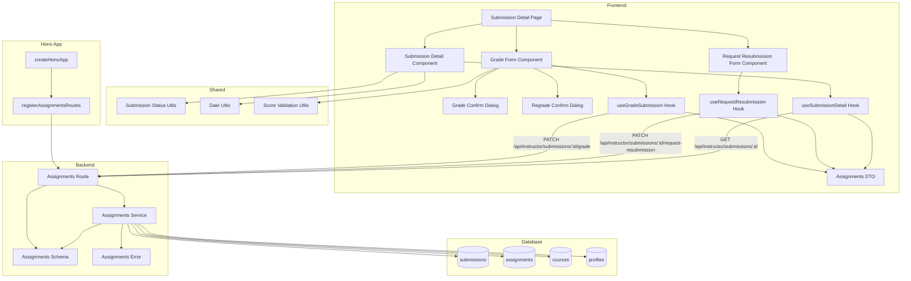

# 제출물 채점 & 피드백 (Instructor) 구현 계획

## 개요

### Backend Modules

| 모듈 | 위치 | 설명 |
|------|------|------|
| Submissions Route | `src/features/assignments/backend/route.ts` | 제출물 상세 조회 및 채점 API 엔드포인트 (기존 파일 확장) |
| Submissions Service | `src/features/assignments/backend/service.ts` | 제출물 조회, 채점, 재제출 요청 비즈니스 로직 (기존 파일 확장) |
| Submissions Schema | `src/features/assignments/backend/schema.ts` | 제출물 채점 요청/응답 zod 스키마 정의 (기존 파일 확장) |
| Assignments Error | `src/features/assignments/backend/error.ts` | 채점 관련 에러 코드 추가 (기존 파일 확장) |

### Frontend Modules

| 모듈 | 위치 | 설명 |
|------|------|------|
| Submission Detail Page | `src/app/(instructor)/assignments/[assignmentId]/submissions/[submissionId]/page.tsx` | 제출물 상세 & 채점 페이지 (신규) |
| Grade Form Component | `src/features/assignments/components/grade-form.tsx` | 채점 폼 컴포넌트 (신규) |
| Request Resubmission Form Component | `src/features/assignments/components/request-resubmission-form.tsx` | 재제출 요청 폼 컴포넌트 (신규) |
| Submission Detail Component | `src/features/assignments/components/submission-detail.tsx` | 제출물 정보 표시 컴포넌트 (신규) |
| Grade Confirm Dialog | `src/features/assignments/components/grade-confirm-dialog.tsx` | 채점 완료 확인 대화상자 (신규) |
| Regrade Confirm Dialog | `src/features/assignments/components/regrade-confirm-dialog.tsx` | 재채점 확인 대화상자 (신규) |
| Assignments DTO | `src/features/assignments/lib/dto.ts` | 프론트엔드 공유용 스키마 재노출 (기존 파일 확장) |
| Grade Submission Hook | `src/features/assignments/hooks/useGradeSubmission.ts` | 채점 완료 React Query mutation (신규) |
| Request Resubmission Hook | `src/features/assignments/hooks/useRequestResubmission.ts` | 재제출 요청 React Query mutation (신규) |
| Submission Detail Hook | `src/features/assignments/hooks/useSubmissionDetail.ts` | 제출물 상세 조회 React Query hook (신규) |

### Shared Modules

| 모듈 | 위치 | 설명 |
|------|------|------|
| Submission Status Utils | `src/features/assignments/lib/submission-status-utils.ts` | 제출물 상태 표시 헬퍼 (신규) |
| Date Utils | `src/lib/utils/date.ts` | 날짜 포맷팅 유틸 (기존 파일 활용) |
| Score Validation Utils | `src/lib/validators/score.ts` | 점수 범위 검증 유틸 (신규) |

---

## Diagram



---

## Implementation Plan

### 1. Backend Layer

#### 1.1 Assignments Error (기존 파일 확장)

**File:** `src/features/assignments/backend/error.ts`

**구현 내용:**
```typescript
export const assignmentsErrorCodes = {
  // ... 기존 에러 코드 유지
  invalidRequest: 'ASSIGNMENTS_INVALID_REQUEST',
  assignmentNotFound: 'ASSIGNMENTS_NOT_FOUND',
  assignmentNotPublished: 'ASSIGNMENTS_NOT_PUBLISHED',
  notEnrolled: 'ASSIGNMENTS_NOT_ENROLLED',
  alreadySubmitted: 'ASSIGNMENTS_ALREADY_SUBMITTED',
  assignmentClosed: 'ASSIGNMENTS_CLOSED',
  pastDueNotAllowed: 'ASSIGNMENTS_PAST_DUE_NOT_ALLOWED',
  resubmitNotAllowed: 'ASSIGNMENTS_RESUBMIT_NOT_ALLOWED',
  submissionNotFound: 'ASSIGNMENTS_SUBMISSION_NOT_FOUND',
  submissionNotAllowed: 'ASSIGNMENTS_SUBMISSION_NOT_ALLOWED',
  notInstructor: 'ASSIGNMENTS_NOT_INSTRUCTOR',
  notOwner: 'ASSIGNMENTS_NOT_OWNER',
  courseNotFound: 'ASSIGNMENTS_COURSE_NOT_FOUND',
  courseArchived: 'ASSIGNMENTS_COURSE_ARCHIVED',
  invalidDueDate: 'ASSIGNMENTS_INVALID_DUE_DATE',
  invalidWeight: 'ASSIGNMENTS_INVALID_WEIGHT',
  cannotModifyPublished: 'ASSIGNMENTS_CANNOT_MODIFY_PUBLISHED',
  createFailed: 'ASSIGNMENTS_CREATE_FAILED',
  updateFailed: 'ASSIGNMENTS_UPDATE_FAILED',
  publishFailed: 'ASSIGNMENTS_PUBLISH_FAILED',
  closeFailed: 'ASSIGNMENTS_CLOSE_FAILED',
  missingRequiredFields: 'ASSIGNMENTS_MISSING_REQUIRED_FIELDS',
  weightWarning: 'ASSIGNMENTS_WEIGHT_WARNING',

  // 채점 관련 에러 코드 추가
  invalidScore: 'ASSIGNMENTS_INVALID_SCORE',
  feedbackRequired: 'ASSIGNMENTS_FEEDBACK_REQUIRED',
  gradeFailed: 'ASSIGNMENTS_GRADE_FAILED',
  requestResubmissionFailed: 'ASSIGNMENTS_REQUEST_RESUBMISSION_FAILED',
  resubmitNotAllowedForAssignment: 'ASSIGNMENTS_RESUBMIT_NOT_ALLOWED_FOR_ASSIGNMENT',
  cannotGradeOwnSubmission: 'ASSIGNMENTS_CANNOT_GRADE_OWN_SUBMISSION',
} as const;
```

---

#### 1.2 Assignments Schema (기존 파일 확장)

**File:** `src/features/assignments/backend/schema.ts`

**구현 내용:**

```typescript
// 채점 요청 스키마
export const GradeSubmissionRequestSchema = z.object({
  score: z.number()
    .min(0, '점수는 0 이상이어야 합니다.')
    .max(100, '점수는 100 이하여야 합니다.'),
  feedback: z.string().min(1, '피드백은 필수 항목입니다.'),
});

// 재제출 요청 스키마
export const RequestResubmissionRequestSchema = z.object({
  score: z.number()
    .min(0, '점수는 0 이상이어야 합니다.')
    .max(100, '점수는 100 이하여야 합니다.')
    .optional()
    .nullable(),
  feedback: z.string().min(1, '피드백은 필수 항목입니다.'),
});

// 채점 응답 스키마
export const GradeSubmissionResponseSchema = z.object({
  submissionId: z.string().uuid(),
  assignmentId: z.string().uuid(),
  status: z.literal('graded'),
  score: z.number(),
  gradedAt: z.string(),
  message: z.string(),
});

// 재제출 요청 응답 스키마
export const RequestResubmissionResponseSchema = z.object({
  submissionId: z.string().uuid(),
  assignmentId: z.string().uuid(),
  status: z.literal('resubmission_required'),
  score: z.number().nullable(),
  gradedAt: z.string(),
  message: z.string(),
});

// 제출물 상세 조회 응답 스키마 (강사용)
export const SubmissionDetailResponseSchema = z.object({
  id: z.string().uuid(),
  assignmentId: z.string().uuid(),
  assignmentTitle: z.string(),
  assignmentDueDate: z.string(),
  assignmentAllowResubmit: z.boolean(),
  learnerId: z.string().uuid(),
  learnerName: z.string(),
  submissionText: z.string(),
  submissionLink: z.string().nullable(),
  submittedAt: z.string(),
  isLate: z.boolean(),
  score: z.number().nullable(),
  feedback: z.string().nullable(),
  status: z.enum(['submitted', 'graded', 'resubmission_required']),
  gradedAt: z.string().nullable(),
});

// TypeScript 타입 추출
export type GradeSubmissionRequest = z.infer<typeof GradeSubmissionRequestSchema>;
export type RequestResubmissionRequest = z.infer<typeof RequestResubmissionRequestSchema>;
export type GradeSubmissionResponse = z.infer<typeof GradeSubmissionResponseSchema>;
export type RequestResubmissionResponse = z.infer<typeof RequestResubmissionResponseSchema>;
export type SubmissionDetailResponse = z.infer<typeof SubmissionDetailResponseSchema>;
```

**Unit Test:**
```typescript
describe('GradeSubmissionRequestSchema', () => {
  it('should validate correct grade data', () => {
    const valid = {
      score: 85,
      feedback: '잘 작성했습니다.',
    };
    expect(GradeSubmissionRequestSchema.safeParse(valid).success).toBe(true);
  });

  it('should reject score out of range', () => {
    const invalid = {
      score: 120,
      feedback: '피드백',
    };
    expect(GradeSubmissionRequestSchema.safeParse(invalid).success).toBe(false);
  });

  it('should reject empty feedback', () => {
    const invalid = {
      score: 85,
      feedback: '',
    };
    expect(GradeSubmissionRequestSchema.safeParse(invalid).success).toBe(false);
  });
});

describe('RequestResubmissionRequestSchema', () => {
  it('should validate with optional score', () => {
    const valid = {
      feedback: '재제출 이유',
    };
    expect(RequestResubmissionRequestSchema.safeParse(valid).success).toBe(true);
  });

  it('should validate with score and feedback', () => {
    const valid = {
      score: 50,
      feedback: '재제출 이유',
    };
    expect(RequestResubmissionRequestSchema.safeParse(valid).success).toBe(true);
  });

  it('should reject empty feedback', () => {
    const invalid = {
      feedback: '',
    };
    expect(RequestResubmissionRequestSchema.safeParse(invalid).success).toBe(false);
  });
});
```

---

#### 1.3 Assignments Service (기존 파일 확장)

**File:** `src/features/assignments/backend/service.ts`

**구현 내용:**

##### 1.3.1 `getSubmissionDetail` 함수 (강사용)

- 강사가 특정 제출물 상세 정보 조회
- 검증:
  1. 제출물 존재 확인
  2. 제출물의 과제를 통해 코스 조회
  3. 강사가 코스 소유자인지 확인 (`checkCourseOwnership` 사용)
- 비즈니스 로직:
  1. `submissions` 테이블에서 제출물 조회
  2. JOIN `assignments`, `profiles` (학습자 이름)
  3. 제출물 상세 정보 반환
- 응답:
  - `id`, `assignmentId`, `assignmentTitle`, `assignmentDueDate`, `assignmentAllowResubmit`
  - `learnerId`, `learnerName`, `submissionText`, `submissionLink`
  - `submittedAt`, `isLate`, `score`, `feedback`, `status`, `gradedAt`

##### 1.3.2 `gradeSubmission` 함수

- 제출물 채점 완료
- 검증:
  1. 제출물 존재 확인
  2. 강사가 코스 소유자인지 확인
  3. 점수 범위 확인 (0~100)
  4. 피드백 필수 확인
  5. 강사가 본인 제출물을 채점하는지 확인 (자가 채점 방지)
- 비즈니스 로직:
  1. 이미 채점된 제출물인 경우 재채점 허용 (기존 점수/피드백 덮어쓰기)
  2. `submissions` 테이블 UPDATE:
     - `score`: 입력한 점수
     - `feedback`: 입력한 피드백
     - `status`: `'graded'`
     - `graded_at`: 현재 시각
- 응답:
  - `submissionId`, `assignmentId`, `status`, `score`, `gradedAt`, `message`

##### 1.3.3 `requestResubmission` 함수

- 재제출 요청
- 검증:
  1. 제출물 존재 확인
  2. 강사가 코스 소유자인지 확인
  3. 해당 과제의 재제출 허용 여부 (`assignments.allow_resubmit=true`) 확인
  4. 피드백 필수 확인
  5. 강사가 본인 제출물에 재제출 요청하는지 확인 (자가 요청 방지)
- 비즈니스 로직:
  1. `submissions` 테이블 UPDATE:
     - `feedback`: 입력한 피드백
     - `status`: `'resubmission_required'`
     - `score`: 입력한 경우 점수 저장, 입력하지 않은 경우 `NULL` 유지
     - `graded_at`: 현재 시각
- 응답:
  - `submissionId`, `assignmentId`, `status`, `score`, `gradedAt`, `message`

**구현 코드:**

```typescript
/**
 * 강사용: 제출물 상세 조회
 */
export const getSubmissionDetail = async (
  supabase: SupabaseClient,
  instructorId: string,
  submissionId: string,
): Promise<HandlerResult<SubmissionDetailResponse, AssignmentsServiceError>> => {
  try {
    // 1. 제출물 정보 조회
    const { data: submission, error: submissionError } = await supabase
      .from('submissions')
      .select(
        `
        id,
        assignment_id,
        learner_id,
        submission_text,
        submission_link,
        submitted_at,
        is_late,
        score,
        feedback,
        status,
        graded_at,
        assignments!inner(
          id,
          title,
          due_date,
          allow_resubmit,
          course_id
        ),
        profiles!submissions_learner_id_fkey(name)
      `,
      )
      .eq('id', submissionId)
      .single();

    if (submissionError || !submission) {
      return failure(
        404,
        assignmentsErrorCodes.submissionNotFound,
        '제출물을 찾을 수 없습니다.',
      );
    }

    // 2. 코스 소유권 확인
    const assignment = submission.assignments as any;
    const isOwner = await checkCourseOwnership(
      supabase,
      assignment.course_id,
      instructorId,
    );

    if (!isOwner) {
      return failure(403, assignmentsErrorCodes.notOwner, '권한이 없습니다.');
    }

    // 3. 응답 데이터 구성
    const profile = submission.profiles as any;

    return success({
      id: submission.id,
      assignmentId: submission.assignment_id,
      assignmentTitle: assignment.title,
      assignmentDueDate: assignment.due_date,
      assignmentAllowResubmit: assignment.allow_resubmit,
      learnerId: submission.learner_id,
      learnerName: profile?.name || '',
      submissionText: submission.submission_text,
      submissionLink: submission.submission_link,
      submittedAt: submission.submitted_at,
      isLate: submission.is_late,
      score: submission.score,
      feedback: submission.feedback,
      status: submission.status as 'submitted' | 'graded' | 'resubmission_required',
      gradedAt: submission.graded_at,
    });
  } catch (err) {
    return failure(
      500,
      assignmentsErrorCodes.invalidRequest,
      err instanceof Error ? err.message : 'Unknown error',
    );
  }
};

/**
 * 강사용: 채점 완료
 */
export const gradeSubmission = async (
  supabase: SupabaseClient,
  instructorId: string,
  submissionId: string,
  data: GradeSubmissionRequest,
): Promise<HandlerResult<GradeSubmissionResponse, AssignmentsServiceError>> => {
  try {
    // 1. 제출물 및 과제 정보 조회
    const { data: submission, error: submissionError } = await supabase
      .from('submissions')
      .select(
        `
        id,
        assignment_id,
        learner_id,
        status,
        assignments!inner(
          id,
          course_id
        )
      `,
      )
      .eq('id', submissionId)
      .single();

    if (submissionError || !submission) {
      return failure(
        404,
        assignmentsErrorCodes.submissionNotFound,
        '제출물을 찾을 수 없습니다.',
      );
    }

    // 2. 코스 소유권 확인
    const assignment = submission.assignments as any;
    const isOwner = await checkCourseOwnership(
      supabase,
      assignment.course_id,
      instructorId,
    );

    if (!isOwner) {
      return failure(403, assignmentsErrorCodes.notOwner, '권한이 없습니다.');
    }

    // 3. 자가 채점 방지
    if (submission.learner_id === instructorId) {
      return failure(
        403,
        assignmentsErrorCodes.cannotGradeOwnSubmission,
        '본인의 제출물은 채점할 수 없습니다.',
      );
    }

    // 4. 점수 범위 검증 (스키마에서도 검증하지만 추가 검증)
    if (data.score < 0 || data.score > 100) {
      return failure(
        400,
        assignmentsErrorCodes.invalidScore,
        '점수는 0에서 100 사이의 값이어야 합니다.',
      );
    }

    // 5. 피드백 필수 검증
    if (!data.feedback || data.feedback.trim().length === 0) {
      return failure(
        400,
        assignmentsErrorCodes.feedbackRequired,
        '피드백은 필수 입력 항목입니다.',
      );
    }

    // 6. 채점 처리
    const now = new Date().toISOString();
    const { data: updated, error: updateError } = await supabase
      .from('submissions')
      .update({
        score: data.score,
        feedback: data.feedback,
        status: 'graded',
        graded_at: now,
      })
      .eq('id', submissionId)
      .select('id, assignment_id, status, score, graded_at')
      .single();

    if (updateError || !updated) {
      return failure(
        500,
        assignmentsErrorCodes.gradeFailed,
        updateError?.message || '채점 중 오류가 발생했습니다.',
      );
    }

    return success({
      submissionId: updated.id,
      assignmentId: updated.assignment_id,
      status: 'graded' as const,
      score: updated.score as number,
      gradedAt: updated.graded_at as string,
      message: '채점이 완료되었습니다.',
    });
  } catch (err) {
    return failure(
      500,
      assignmentsErrorCodes.gradeFailed,
      err instanceof Error ? err.message : 'Unknown error',
    );
  }
};

/**
 * 강사용: 재제출 요청
 */
export const requestResubmission = async (
  supabase: SupabaseClient,
  instructorId: string,
  submissionId: string,
  data: RequestResubmissionRequest,
): Promise<HandlerResult<RequestResubmissionResponse, AssignmentsServiceError>> => {
  try {
    // 1. 제출물 및 과제 정보 조회
    const { data: submission, error: submissionError } = await supabase
      .from('submissions')
      .select(
        `
        id,
        assignment_id,
        learner_id,
        status,
        assignments!inner(
          id,
          course_id,
          allow_resubmit
        )
      `,
      )
      .eq('id', submissionId)
      .single();

    if (submissionError || !submission) {
      return failure(
        404,
        assignmentsErrorCodes.submissionNotFound,
        '제출물을 찾을 수 없습니다.',
      );
    }

    // 2. 코스 소유권 확인
    const assignment = submission.assignments as any;
    const isOwner = await checkCourseOwnership(
      supabase,
      assignment.course_id,
      instructorId,
    );

    if (!isOwner) {
      return failure(403, assignmentsErrorCodes.notOwner, '권한이 없습니다.');
    }

    // 3. 자가 재제출 요청 방지
    if (submission.learner_id === instructorId) {
      return failure(
        403,
        assignmentsErrorCodes.cannotGradeOwnSubmission,
        '본인의 제출물에는 재제출을 요청할 수 없습니다.',
      );
    }

    // 4. 재제출 허용 여부 확인
    if (!assignment.allow_resubmit) {
      return failure(
        403,
        assignmentsErrorCodes.resubmitNotAllowedForAssignment,
        '이 과제는 재제출이 허용되지 않습니다.',
      );
    }

    // 5. 피드백 필수 검증
    if (!data.feedback || data.feedback.trim().length === 0) {
      return failure(
        400,
        assignmentsErrorCodes.feedbackRequired,
        '피드백은 필수 입력 항목입니다.',
      );
    }

    // 6. 점수 범위 검증 (optional)
    if (data.score !== undefined && data.score !== null) {
      if (data.score < 0 || data.score > 100) {
        return failure(
          400,
          assignmentsErrorCodes.invalidScore,
          '점수는 0에서 100 사이의 값이어야 합니다.',
        );
      }
    }

    // 7. 재제출 요청 처리
    const now = new Date().toISOString();
    const updateData: any = {
      feedback: data.feedback,
      status: 'resubmission_required',
      graded_at: now,
    };

    if (data.score !== undefined && data.score !== null) {
      updateData.score = data.score;
    }

    const { data: updated, error: updateError } = await supabase
      .from('submissions')
      .update(updateData)
      .eq('id', submissionId)
      .select('id, assignment_id, status, score, graded_at')
      .single();

    if (updateError || !updated) {
      return failure(
        500,
        assignmentsErrorCodes.requestResubmissionFailed,
        updateError?.message || '재제출 요청 중 오류가 발생했습니다.',
      );
    }

    return success({
      submissionId: updated.id,
      assignmentId: updated.assignment_id,
      status: 'resubmission_required' as const,
      score: updated.score,
      gradedAt: updated.graded_at as string,
      message: '재제출 요청이 완료되었습니다.',
    });
  } catch (err) {
    return failure(
      500,
      assignmentsErrorCodes.requestResubmissionFailed,
      err instanceof Error ? err.message : 'Unknown error',
    );
  }
};
```

**Unit Test:**
```typescript
describe('getSubmissionDetail', () => {
  it('should return submission detail for instructor', async () => {
    const result = await getSubmissionDetail(
      mockSupabaseClient,
      'instructor-1',
      'submission-1',
    );

    expect(result.ok).toBe(true);
    expect(result.data.learnerId).toBeDefined();
    expect(result.data.learnerName).toBeDefined();
  });

  it('should reject if not owner', async () => {
    const result = await getSubmissionDetail(
      mockSupabaseClient,
      'other-instructor',
      'submission-1',
    );

    expect(result.ok).toBe(false);
    expect(result.error.code).toBe(assignmentsErrorCodes.notOwner);
  });
});

describe('gradeSubmission', () => {
  it('should grade submission with valid data', async () => {
    const result = await gradeSubmission(
      mockSupabaseClient,
      'instructor-1',
      'submission-1',
      {
        score: 85,
        feedback: '잘 작성했습니다.',
      },
    );

    expect(result.ok).toBe(true);
    expect(result.data.status).toBe('graded');
    expect(result.data.score).toBe(85);
  });

  it('should reject score out of range', async () => {
    const result = await gradeSubmission(
      mockSupabaseClient,
      'instructor-1',
      'submission-1',
      {
        score: 120,
        feedback: '피드백',
      },
    );

    expect(result.ok).toBe(false);
    expect(result.error.code).toBe(assignmentsErrorCodes.invalidScore);
  });

  it('should reject empty feedback', async () => {
    const result = await gradeSubmission(
      mockSupabaseClient,
      'instructor-1',
      'submission-1',
      {
        score: 85,
        feedback: '',
      },
    );

    expect(result.ok).toBe(false);
    expect(result.error.code).toBe(assignmentsErrorCodes.feedbackRequired);
  });

  it('should reject self grading', async () => {
    // Mock: learner_id === instructorId
    const result = await gradeSubmission(
      mockSupabaseClient,
      'instructor-1',
      'submission-self',
      {
        score: 85,
        feedback: '피드백',
      },
    );

    expect(result.ok).toBe(false);
    expect(result.error.code).toBe(assignmentsErrorCodes.cannotGradeOwnSubmission);
  });

  it('should allow regrading', async () => {
    // Mock: submission.status = 'graded'
    const result = await gradeSubmission(
      mockSupabaseClient,
      'instructor-1',
      'graded-submission',
      {
        score: 90,
        feedback: '재채점 완료',
      },
    );

    expect(result.ok).toBe(true);
    expect(result.data.score).toBe(90);
  });
});

describe('requestResubmission', () => {
  it('should request resubmission with feedback', async () => {
    const result = await requestResubmission(
      mockSupabaseClient,
      'instructor-1',
      'submission-1',
      {
        feedback: '재제출 이유',
      },
    );

    expect(result.ok).toBe(true);
    expect(result.data.status).toBe('resubmission_required');
  });

  it('should request resubmission with score and feedback', async () => {
    const result = await requestResubmission(
      mockSupabaseClient,
      'instructor-1',
      'submission-1',
      {
        score: 50,
        feedback: '재제출 이유',
      },
    );

    expect(result.ok).toBe(true);
    expect(result.data.score).toBe(50);
  });

  it('should reject if assignment does not allow resubmit', async () => {
    // Mock: assignment.allow_resubmit = false
    const result = await requestResubmission(
      mockSupabaseClient,
      'instructor-1',
      'submission-1',
      {
        feedback: '재제출 이유',
      },
    );

    expect(result.ok).toBe(false);
    expect(result.error.code).toBe(assignmentsErrorCodes.resubmitNotAllowedForAssignment);
  });

  it('should reject empty feedback', async () => {
    const result = await requestResubmission(
      mockSupabaseClient,
      'instructor-1',
      'submission-1',
      {
        feedback: '',
      },
    );

    expect(result.ok).toBe(false);
    expect(result.error.code).toBe(assignmentsErrorCodes.feedbackRequired);
  });
});
```

---

#### 1.4 Assignments Route (기존 파일 확장)

**File:** `src/features/assignments/backend/route.ts`

**구현 내용:**

- `GET /api/instructor/submissions/:id` 엔드포인트: 제출물 상세 조회 (강사용)
- `PATCH /api/instructor/submissions/:id/grade` 엔드포인트: 채점 완료
- `PATCH /api/instructor/submissions/:id/request-resubmission` 엔드포인트: 재제출 요청
- 모든 엔드포인트에서 사용자 인증 확인 (`x-user-id` 헤더)
- 요청 body 파싱 및 검증
- 성공/실패 응답 반환 (`respond` 헬퍼 사용)

**Integration Test:**
```typescript
describe('GET /api/instructor/submissions/:id', () => {
  it('should return submission detail', async () => {
    const response = await request(app)
      .get('/api/instructor/submissions/submission-1')
      .set('x-user-id', 'instructor-1');

    expect(response.status).toBe(200);
    expect(response.body.learnerId).toBeDefined();
    expect(response.body.learnerName).toBeDefined();
  });

  it('should return 403 if not owner', async () => {
    const response = await request(app)
      .get('/api/instructor/submissions/submission-1')
      .set('x-user-id', 'other-instructor');

    expect(response.status).toBe(403);
  });
});

describe('PATCH /api/instructor/submissions/:id/grade', () => {
  it('should grade submission', async () => {
    const response = await request(app)
      .patch('/api/instructor/submissions/submission-1/grade')
      .set('x-user-id', 'instructor-1')
      .send({
        score: 85,
        feedback: '잘 작성했습니다.',
      });

    expect(response.status).toBe(200);
    expect(response.body.status).toBe('graded');
    expect(response.body.score).toBe(85);
  });

  it('should return 400 for invalid score', async () => {
    const response = await request(app)
      .patch('/api/instructor/submissions/submission-1/grade')
      .set('x-user-id', 'instructor-1')
      .send({
        score: 120,
        feedback: '피드백',
      });

    expect(response.status).toBe(400);
  });

  it('should return 400 for empty feedback', async () => {
    const response = await request(app)
      .patch('/api/instructor/submissions/submission-1/grade')
      .set('x-user-id', 'instructor-1')
      .send({
        score: 85,
        feedback: '',
      });

    expect(response.status).toBe(400);
  });
});

describe('PATCH /api/instructor/submissions/:id/request-resubmission', () => {
  it('should request resubmission', async () => {
    const response = await request(app)
      .patch('/api/instructor/submissions/submission-1/request-resubmission')
      .set('x-user-id', 'instructor-1')
      .send({
        feedback: '재제출 이유',
      });

    expect(response.status).toBe(200);
    expect(response.body.status).toBe('resubmission_required');
  });

  it('should return 403 if assignment does not allow resubmit', async () => {
    const response = await request(app)
      .patch('/api/instructor/submissions/submission-no-resubmit/request-resubmission')
      .set('x-user-id', 'instructor-1')
      .send({
        feedback: '재제출 이유',
      });

    expect(response.status).toBe(403);
  });
});
```

---

### 2. Shared Layer

#### 2.1 Score Validation Utils

**File:** `src/lib/validators/score.ts`

**구현 내용:**
```typescript
export const MIN_SCORE = 0;
export const MAX_SCORE = 100;

export const isValidScore = (score: number): boolean => {
  return score >= MIN_SCORE && score <= MAX_SCORE;
};

export const getScoreErrorMessage = (score: number): string | null => {
  if (score < MIN_SCORE) {
    return `점수는 ${MIN_SCORE} 이상이어야 합니다.`;
  }
  if (score > MAX_SCORE) {
    return `점수는 ${MAX_SCORE} 이하여야 합니다.`;
  }
  return null;
};
```

**Unit Test:**
```typescript
describe('score validator', () => {
  it('should accept valid score', () => {
    expect(isValidScore(0)).toBe(true);
    expect(isValidScore(50)).toBe(true);
    expect(isValidScore(100)).toBe(true);
  });

  it('should reject invalid score', () => {
    expect(isValidScore(-1)).toBe(false);
    expect(isValidScore(101)).toBe(false);
  });

  it('should return error message for invalid score', () => {
    expect(getScoreErrorMessage(-1)).toContain('0 이상');
    expect(getScoreErrorMessage(101)).toContain('100 이하');
  });
});
```

---

#### 2.2 Submission Status Utils

**File:** `src/features/assignments/lib/submission-status-utils.ts`

**구현 내용:**
```typescript
export type SubmissionStatus = 'submitted' | 'graded' | 'resubmission_required';

export const getSubmissionStatusText = (status: SubmissionStatus): string => {
  const statusMap: Record<SubmissionStatus, string> = {
    submitted: '제출됨',
    graded: '채점 완료',
    resubmission_required: '재제출 요청',
  };
  return statusMap[status];
};

export const getSubmissionStatusColor = (
  status: SubmissionStatus,
): 'default' | 'success' | 'warning' => {
  const colorMap: Record<SubmissionStatus, 'default' | 'success' | 'warning'> = {
    submitted: 'default',
    graded: 'success',
    resubmission_required: 'warning',
  };
  return colorMap[status];
};
```

**Unit Test:**
```typescript
describe('submission status utils', () => {
  it('should return correct status text', () => {
    expect(getSubmissionStatusText('submitted')).toBe('제출됨');
    expect(getSubmissionStatusText('graded')).toBe('채점 완료');
    expect(getSubmissionStatusText('resubmission_required')).toBe('재제출 요청');
  });

  it('should return correct status color', () => {
    expect(getSubmissionStatusColor('submitted')).toBe('default');
    expect(getSubmissionStatusColor('graded')).toBe('success');
    expect(getSubmissionStatusColor('resubmission_required')).toBe('warning');
  });
});
```

---

### 3. Frontend Layer

#### 3.1 Assignments DTO (기존 파일 확장)

**File:** `src/features/assignments/lib/dto.ts`

**구현 내용:**
```typescript
export {
  // 기존 DTO 유지
  AssignmentItemSchema,
  AssignmentListResponseSchema,
  AssignmentDetailResponseSchema,
  SubmitAssignmentRequestSchema,
  ResubmitAssignmentRequestSchema,
  SubmitAssignmentResponseSchema,
  CreateAssignmentRequestSchema,
  UpdateAssignmentRequestSchema,
  PublishAssignmentResponseSchema,
  CloseAssignmentResponseSchema,
  CreateAssignmentResponseSchema,
  UpdateAssignmentResponseSchema,
  MyAssignmentItemSchema,
  MyAssignmentsResponseSchema,
  SubmissionItemSchema,
  SubmissionsQuerySchema,
  AssignmentSubmissionsResponseSchema,
  type AssignmentItem,
  type AssignmentListResponse,
  type AssignmentDetailResponse,
  type SubmitAssignmentRequest,
  type ResubmitAssignmentRequest,
  type SubmitAssignmentResponse,
  type CreateAssignmentRequest,
  type UpdateAssignmentRequest,
  type PublishAssignmentResponse,
  type CloseAssignmentResponse,
  type CreateAssignmentResponse,
  type UpdateAssignmentResponse,
  type MyAssignmentItem,
  type MyAssignmentsResponse,
  type SubmissionItem,
  type SubmissionsQuery,
  type AssignmentSubmissionsResponse,

  // 채점 관련 DTO 추가
  GradeSubmissionRequestSchema,
  RequestResubmissionRequestSchema,
  GradeSubmissionResponseSchema,
  RequestResubmissionResponseSchema,
  SubmissionDetailResponseSchema,
  type GradeSubmissionRequest,
  type RequestResubmissionRequest,
  type GradeSubmissionResponse,
  type RequestResubmissionResponse,
  type SubmissionDetailResponse,
} from '@/features/assignments/backend/schema';
```

---

#### 3.2 Grade Submission Hook

**File:** `src/features/assignments/hooks/useGradeSubmission.ts`

**구현 내용:**
```typescript
'use client';

import { useMutation, useQueryClient } from '@tanstack/react-query';
import { apiClient, extractApiErrorMessage } from '@/lib/remote/api-client';
import {
  GradeSubmissionRequestSchema,
  GradeSubmissionResponseSchema,
  type GradeSubmissionRequest,
  type GradeSubmissionResponse,
} from '../lib/dto';

const gradeSubmission = async (
  submissionId: string,
  data: GradeSubmissionRequest,
): Promise<GradeSubmissionResponse> => {
  try {
    const validated = GradeSubmissionRequestSchema.parse(data);
    const { data: response } = await apiClient.patch(
      `/api/instructor/submissions/${submissionId}/grade`,
      validated,
    );
    return GradeSubmissionResponseSchema.parse(response);
  } catch (error) {
    const message = extractApiErrorMessage(error, '채점에 실패했습니다.');
    throw new Error(message);
  }
};

export const useGradeSubmission = (submissionId: string) => {
  const queryClient = useQueryClient();

  return useMutation({
    mutationFn: (data: GradeSubmissionRequest) => gradeSubmission(submissionId, data),
    onSuccess: () => {
      queryClient.invalidateQueries({ queryKey: ['submission', submissionId] });
      queryClient.invalidateQueries({ queryKey: ['instructor', 'assignments'] });
    },
  });
};
```

---

#### 3.3 Request Resubmission Hook

**File:** `src/features/assignments/hooks/useRequestResubmission.ts`

**구현 내용:**
```typescript
'use client';

import { useMutation, useQueryClient } from '@tanstack/react-query';
import { apiClient, extractApiErrorMessage } from '@/lib/remote/api-client';
import {
  RequestResubmissionRequestSchema,
  RequestResubmissionResponseSchema,
  type RequestResubmissionRequest,
  type RequestResubmissionResponse,
} from '../lib/dto';

const requestResubmission = async (
  submissionId: string,
  data: RequestResubmissionRequest,
): Promise<RequestResubmissionResponse> => {
  try {
    const validated = RequestResubmissionRequestSchema.parse(data);
    const { data: response } = await apiClient.patch(
      `/api/instructor/submissions/${submissionId}/request-resubmission`,
      validated,
    );
    return RequestResubmissionResponseSchema.parse(response);
  } catch (error) {
    const message = extractApiErrorMessage(error, '재제출 요청에 실패했습니다.');
    throw new Error(message);
  }
};

export const useRequestResubmission = (submissionId: string) => {
  const queryClient = useQueryClient();

  return useMutation({
    mutationFn: (data: RequestResubmissionRequest) =>
      requestResubmission(submissionId, data),
    onSuccess: () => {
      queryClient.invalidateQueries({ queryKey: ['submission', submissionId] });
      queryClient.invalidateQueries({ queryKey: ['instructor', 'assignments'] });
    },
  });
};
```

---

#### 3.4 Submission Detail Hook

**File:** `src/features/assignments/hooks/useSubmissionDetail.ts`

**구현 내용:**
```typescript
'use client';

import { useQuery } from '@tanstack/react-query';
import { apiClient, extractApiErrorMessage } from '@/lib/remote/api-client';
import {
  SubmissionDetailResponseSchema,
  type SubmissionDetailResponse,
} from '../lib/dto';

const fetchSubmissionDetail = async (
  submissionId: string,
): Promise<SubmissionDetailResponse> => {
  try {
    const { data } = await apiClient.get(`/api/instructor/submissions/${submissionId}`);
    return SubmissionDetailResponseSchema.parse(data);
  } catch (error) {
    const message = extractApiErrorMessage(
      error,
      '제출물을 불러오지 못했습니다.',
    );
    throw new Error(message);
  }
};

export const useSubmissionDetail = (submissionId: string) =>
  useQuery({
    queryKey: ['submission', submissionId],
    queryFn: () => fetchSubmissionDetail(submissionId),
    staleTime: 30 * 1000, // 30초
  });
```

---

#### 3.5 Frontend Components & Pages QA Sheets

**Grade Form Component QA Sheet:**
| 시나리오 | 입력 | 예상 결과 |
|---------|------|----------|
| 정상 채점 | 점수 85, 피드백 입력 | 채점 완료 성공 메시지 |
| 점수 범위 초과 | 점수 120 | "점수는 0에서 100 사이의 값이어야 합니다" 오류 |
| 피드백 미입력 | 피드백 비움 | "피드백은 필수 입력 항목입니다" 오류 |
| 이미 채점된 제출물 | status = 'graded' | "기존 채점 내역이 삭제됩니다. 계속하시겠습니까?" 확인 대화상자 |
| 재채점 확인 | 확인 버튼 클릭 | 기존 점수/피드백 덮어쓰기, 채점 완료 |
| 재채점 취소 | 취소 버튼 클릭 | 대화상자 닫힘, 재채점 진행 안 됨 |

**Request Resubmission Form Component QA Sheet:**
| 시나리오 | 입력 | 예상 결과 |
|---------|------|----------|
| 정상 재제출 요청 | 피드백 입력 | 재제출 요청 완료 성공 메시지 |
| 점수와 함께 요청 | 점수 50, 피드백 입력 | 재제출 요청 완료, 점수 저장 |
| 피드백 미입력 | 피드백 비움 | "피드백은 필수 입력 항목입니다" 오류 |
| 재제출 불허 과제 | allow_resubmit = false | "이 과제는 재제출이 허용되지 않습니다" 오류, 버튼 비활성화 |
| 네트워크 오류 | 네트워크 끊김 | "일시적인 오류가 발생했습니다" 오류 메시지 |

**Submission Detail Component QA Sheet:**
| 시나리오 | 입력 | 예상 결과 |
|---------|------|----------|
| 제출물 정보 표시 | 제출물 로드 | 학습자 이름, 제출 내용, 제출 일시, 지각 여부 표시 |
| 링크 있음 | submission_link 존재 | 링크 클릭 시 새 탭에서 열림 |
| 링크 없음 | submission_link NULL | 링크 표시 안 됨 |
| 지각 제출 | is_late = true | "지각 제출" 뱃지 표시 |
| 채점 완료 상태 | status = 'graded' | 점수 및 피드백 표시 |
| 미채점 상태 | status = 'submitted' | 점수 및 피드백 미표시 |

**Submission Detail Page QA Sheet:**
| 시나리오 | 입력 | 예상 결과 |
|---------|------|----------|
| 페이지 접근 | `/instructor/assignments/[assignmentId]/submissions/[submissionId]` | 제출물 상세 페이지 표시 |
| 제출물 없음 | 존재하지 않는 submissionId | "제출물을 찾을 수 없습니다" 오류, 제출물 목록으로 리다이렉트 |
| 권한 없음 | 다른 강사 코스 제출물 | "접근 권한이 없습니다" 오류, 403 |
| 채점 완료 | 채점 폼 제출 | 채점 완료 메시지, 제출물 목록으로 리다이렉트 |
| 재제출 요청 | 재제출 요청 폼 제출 | 재제출 요청 완료 메시지, 제출물 목록으로 리다이렉트 |

---

## Implementation Order

1. **Shared**: Score Validation Utils, Submission Status Utils 구현 및 테스트
2. **Backend Error**: `assignments/backend/error.ts` 확장 (채점 관련 에러 코드 추가)
3. **Backend Schema**: `assignments/backend/schema.ts` 확장 (채점 요청/응답 스키마 추가)
4. **Backend Service**: `assignments/backend/service.ts` 확장
   - `getSubmissionDetail` (강사용) 구현 및 테스트
   - `gradeSubmission` 구현 및 테스트
   - `requestResubmission` 구현 및 테스트
5. **Backend Route**: `assignments/backend/route.ts` 확장
   - `GET /api/instructor/submissions/:id`
   - `PATCH /api/instructor/submissions/:id/grade`
   - `PATCH /api/instructor/submissions/:id/request-resubmission`
   - Integration 테스트
6. **Frontend DTO**: `assignments/lib/dto.ts` 확장 (채점 스키마 재노출)
7. **Frontend Hooks**: 훅 구현
   - `useGradeSubmission`
   - `useRequestResubmission`
   - `useSubmissionDetail`
8. **Frontend Components**: 컴포넌트 구현
   - `SubmissionDetail`
   - `GradeForm`
   - `RequestResubmissionForm`
   - `GradeConfirmDialog`
   - `RegradeConfirmDialog`
9. **Frontend Pages**: 페이지 구현
   - Submission Detail Page
10. **Integration Test**: Full flow 수동 QA (채점, 재제출 요청, edge cases)

---

## Notes

### 비즈니스 규칙

- **채점 권한**: 강사는 본인이 소유한 코스의 과제 제출물만 채점 가능
- **자가 채점 방지**: 강사는 본인의 제출물을 채점할 수 없음
- **재채점 허용**: 이미 채점된 제출물(`status='graded'`)도 재채점 가능하며, 기존 점수/피드백을 덮어씀
- **재채점 확인**: 재채점 시 "기존 채점 내역이 삭제됩니다. 계속하시겠습니까?" 확인 대화상자 표시
- **점수 범위**: 0~100 범위 내의 숫자, 소수점 둘째 자리까지 허용 (`decimal(5,2)`)
- **피드백 필수**: 채점 완료 또는 재제출 요청 시 피드백은 필수 입력 (최소 1자 이상)
- **상태 전환**:
  - **채점 완료**: `status='submitted'` 또는 `status='resubmission_required'` → `status='graded'`
  - **재제출 요청**: `status='submitted'` 또는 `status='graded'` → `status='resubmission_required'`
- **재제출 정책**:
  - 재제출 허용된 과제(`assignments.allow_resubmit=true`)에 한해 재제출 요청 가능
  - 재제출 시 `is_late` 값은 최초 `assignments.due_date`를 기준으로 계산
  - 재제출 요청 시 점수는 선택 항목 (입력하지 않으면 `NULL` 유지)
- **채점 일시**: 채점 완료 또는 재제출 요청 시 `graded_at` 타임스탬프가 현재 시각으로 업데이트
- **학습자 피드백**: 채점이 완료되거나 재제출이 요청되면 학습자는 즉시 피드백 확인 가능

### 기술적 고려사항

- **인증**: 모든 API는 `x-user-id` 헤더로 사용자 ID 추출
- **권한 검증**: Instructor 역할만 채점 페이지 접근 가능
- **에러 처리**: 모든 API 호출에서 에러 메시지 사용자에게 표시
- **날짜 표시**: 한국어 로케일 사용 (`date-fns/locale/ko`)
- **캐싱**: React Query의 `invalidateQueries`로 채점 후 캐시 무효화
- **타입 안전성**: 백엔드 스키마를 프론트엔드에서 재사용
- **리다이렉트**: 채점 완료 또는 재제출 요청 후 제출물 목록 페이지로 리다이렉트

### 기존 코드와의 통합

- `assignments` feature는 이미 Learner용, Instructor 과제 관리 기능이 구현되어 있으므로, 기존 파일에 채점 로직 추가
- `checkCourseOwnership` 헬퍼는 이미 assignments service에 구현되어 있음
- `respond` 헬퍼는 `src/backend/http/response.ts`에서 제공하는 공통 헬퍼 사용
- `date-fns` 기반 날짜 유틸리티는 기존 `src/lib/utils/date.ts` 파일 활용
- `submissions` 테이블은 이미 존재하며, 추가 마이그레이션 불필요
- `updated_at` 트리거는 이미 설정되어 있음

### 추후 확장

- 채점 일괄 처리 (여러 제출물 동시 채점)
- 채점 템플릿 (자주 사용하는 피드백 저장)
- 채점 루브릭 (평가 기준 세분화)
- 파일 첨부 피드백 (현재는 텍스트만 지원)
- 채점 통계 (과제별 평균 점수, 분포)

### 데이터베이스 관련

- `submissions` 테이블은 이미 존재하며, 추가 마이그레이션 불필요
- `score` 컬럼: `decimal(5,2)`, `NULL` 허용, `CHECK (score >= 0 AND score <= 100)`
- `feedback` 컬럼: `text`, `NULL` 허용
- `status` 컬럼: `text`, `CHECK (status IN ('submitted', 'graded', 'resubmission_required'))`
- `graded_at` 컬럼: `timestamptz`, `NULL` 허용

### 컴포넌트 구조

- 제출물 상세 페이지는 재사용 가능한 작은 컴포넌트로 분리
- Grade Form과 Request Resubmission Form은 별도 컴포넌트로 분리
- 재채점 시 확인 대화상자는 Grade Confirm Dialog 컴포넌트에 통합

### 라우팅 규칙

- Instructor 페이지는 `/instructor/*` 경로 사용
- Next.js 라우트 그룹 `(instructor)` 활용
- 제출물 상세 페이지: `/instructor/assignments/[assignmentId]/submissions/[submissionId]`

### 향후 구현 필요 항목

- 채점 이력 조회 (재채점 이력 추적)
- 채점 통지 (이메일 또는 알림)
- 학습자 대시보드에 "최근 피드백" 섹션 추가
