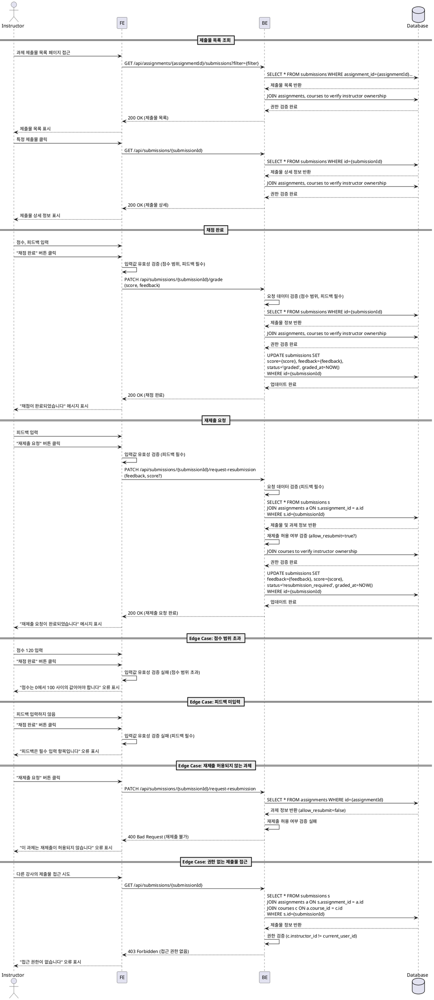

# 제출물 채점 & 피드백 (Instructor) - Use Case Specification

## Primary Actor

**Instructor** (강사)

---

## Precondition

- 강사가 Instructor 역할로 로그인되어 있다.
- 강사가 본인이 생성한 코스의 과제 제출물 목록 페이지에 접근할 수 있다.
- 학습자가 이미 과제를 제출한 상태이다 (`submissions.status = 'submitted'`).

---

## Trigger

- 강사가 제출물 목록에서 특정 제출물을 선택한다.
- 강사가 점수와 피드백을 입력하고 "채점 완료" 또는 "재제출 요청" 버튼을 클릭한다.

---

## Main Scenario

### UC-010-1: 제출물 목록 조회

1. 강사가 과제 관리 페이지(`/instructor/assignments/[assignmentId]/submissions`)에 접근한다.
2. 시스템은 해당 과제의 모든 제출물 목록을 표시한다.
3. 강사는 필터를 적용하여 제출물을 조회할 수 있다:
   - 미채점 제출물 (`status='submitted'`)
   - 지각 제출물 (`is_late=true`)
   - 재제출 요청된 제출물 (`status='resubmission_required'`)
4. 강사가 특정 제출물을 선택하면 제출물 상세 페이지로 이동한다.

### UC-010-2: 채점 및 피드백 작성

1. 강사가 제출물 상세 페이지에서 다음을 확인한다:
   - 학습자 정보
   - 제출 내용 (`submission_text`, `submission_link`)
   - 제출 일시 (`submitted_at`)
   - 지각 여부 (`is_late`)
2. 강사가 점수 입력란에 점수를 입력한다 (0~100).
3. 강사가 피드백 입력란에 피드백을 작성한다 (필수).
4. 강사가 "채점 완료" 버튼을 클릭한다.
5. 시스템은 다음을 검증한다:
   - 점수가 0~100 범위 내인지 확인
   - 피드백이 비어있지 않은지 확인
6. 검증 통과 시, 시스템은 `submissions` 테이블을 업데이트한다:
   - `score`: 입력한 점수
   - `feedback`: 입력한 피드백
   - `status`: `'graded'`
   - `graded_at`: 현재 시각
7. 시스템은 "채점이 완료되었습니다" 메시지를 표시한다.
8. 학습자 대시보드 및 성적 페이지에 채점 결과가 반영된다.

### UC-010-3: 재제출 요청

1. 강사가 제출물 상세 페이지에서 제출 내용을 확인한다.
2. 강사가 점수 입력란에 점수를 입력한다 (선택).
3. 강사가 피드백 입력란에 재제출 이유를 작성한다 (필수).
4. 강사가 "재제출 요청" 버튼을 클릭한다.
5. 시스템은 다음을 검증한다:
   - 해당 과제의 재제출 허용 여부 (`assignments.allow_resubmit=true`) 확인
   - 피드백이 비어있지 않은지 확인
6. 검증 통과 시, 시스템은 `submissions` 테이블을 업데이트한다:
   - `feedback`: 입력한 피드백
   - `status`: `'resubmission_required'`
   - `score`: 입력한 경우 점수 저장, 입력하지 않은 경우 `NULL` 유지
   - `graded_at`: 현재 시각
7. 시스템은 "재제출 요청이 완료되었습니다" 메시지를 표시한다.
8. 학습자는 과제 상세 페이지에서 재제출 요청 상태와 피드백을 확인할 수 있다.
9. 학습자는 과제를 다시 제출할 수 있다 (제출 시 `is_late`는 최초 `assignments.due_date` 기준으로 계산됨).

---

## Edge Cases

### E1. 점수 범위 초과

- **조건**: 강사가 0~100 범위를 벗어난 점수를 입력함
- **처리**: "점수는 0에서 100 사이의 값이어야 합니다" 오류 메시지를 표시하고, 제출을 차단한다.

### E2. 피드백 미입력

- **조건**: 강사가 피드백을 입력하지 않고 채점 완료 또는 재제출 요청 버튼을 클릭함
- **처리**: "피드백은 필수 입력 항목입니다" 오류 메시지를 표시하고, 제출을 차단한다.

### E3. 재제출 허용되지 않는 과제에 재제출 요청

- **조건**: 강사가 `assignments.allow_resubmit=false`인 과제에 대해 재제출 요청을 시도함
- **처리**: "이 과제는 재제출이 허용되지 않습니다" 오류 메시지를 표시하고, 재제출 요청 버튼을 비활성화한다.

### E4. 이미 채점된 제출물 재채점

- **조건**: 강사가 이미 `status='graded'` 상태인 제출물을 다시 채점함
- **처리**: 기존 점수와 피드백을 덮어쓸 수 있도록 허용하며, 확인 다이얼로그를 표시한다. "기존 채점 내역이 삭제됩니다. 계속하시겠습니까?"

### E5. 네트워크 오류 또는 서버 오류

- **조건**: 채점 완료 또는 재제출 요청 중 네트워크 또는 서버 오류 발생
- **처리**: "일시적인 오류가 발생했습니다. 다시 시도해주세요" 오류 메시지를 표시하고, 재시도 버튼을 제공한다.

### E6. 제출물이 삭제되거나 존재하지 않음

- **조건**: 강사가 제출물 상세 페이지를 보는 중 해당 제출물이 삭제됨
- **처리**: "제출물을 찾을 수 없습니다" 오류 메시지를 표시하고, 제출물 목록 페이지로 리다이렉트한다.

### E7. 권한 없는 제출물 접근

- **조건**: 강사가 본인이 생성하지 않은 코스의 과제 제출물에 접근 시도
- **처리**: "접근 권한이 없습니다" 오류 메시지를 표시하고, 403 Forbidden 에러를 반환한다.

---

## Business Rules

### BR-010-1: 점수 범위 제한

- 점수는 0~100 범위 내의 숫자여야 한다.
- 소수점 둘째 자리까지 허용된다 (`decimal(5,2)`).
- 점수가 입력되지 않은 경우 `NULL` 값으로 저장된다.

### BR-010-2: 피드백 필수

- 채점 완료 또는 재제출 요청 시 피드백은 필수 입력 항목이다.
- 피드백은 빈 문자열이 아니어야 한다 (최소 1자 이상).

### BR-010-3: 상태 전환 규칙

- **채점 완료**: `status='submitted'` 또는 `status='resubmission_required'` → `status='graded'`
- **재제출 요청**: `status='submitted'` 또는 `status='graded'` → `status='resubmission_required'`
- 재제출 요청 시 `assignments.allow_resubmit=true`여야 한다.

### BR-010-4: 재제출 정책

- 재제출이 허용된 과제(`assignments.allow_resubmit=true`)에 한해 재제출 요청이 가능하다.
- 재제출 시 `is_late` 값은 최초 `assignments.due_date`를 기준으로 계산된다 (재제출 시점 기준이 아님).
- 재제출된 제출물은 기존 제출물을 UPDATE한다 (새로운 레코드 생성 아님).

### BR-010-5: 채점 일시 기록

- 채점 완료 또는 재제출 요청 시 `graded_at` 타임스탬프가 현재 시각으로 업데이트된다.
- `graded_at`은 가장 최근 채점 일시를 나타낸다.

### BR-010-6: 학습자 피드백 노출

- 채점이 완료되거나 재제출이 요청되면, 학습자는 즉시 피드백을 확인할 수 있다.
- 학습자 대시보드의 "최근 피드백" 섹션에 표시된다.
- 과제 상세 페이지에서 점수, 피드백, 상태를 확인할 수 있다.

### BR-010-7: 제출물 필터링

- 강사는 다음 조건으로 제출물을 필터링할 수 있다:
  - **미채점**: `status='submitted'`
  - **지각**: `is_late=true`
  - **재제출 요청**: `status='resubmission_required'`
- 필터는 중복 적용 가능하다 (예: 미채점 + 지각).

### BR-010-8: 권한 검증

- 강사는 본인이 생성한 코스(`courses.instructor_id`)의 과제 제출물만 채점할 수 있다.
- 다른 강사의 코스 제출물에 접근 시도 시 403 Forbidden 에러를 반환한다.

---

## Sequence Diagram

