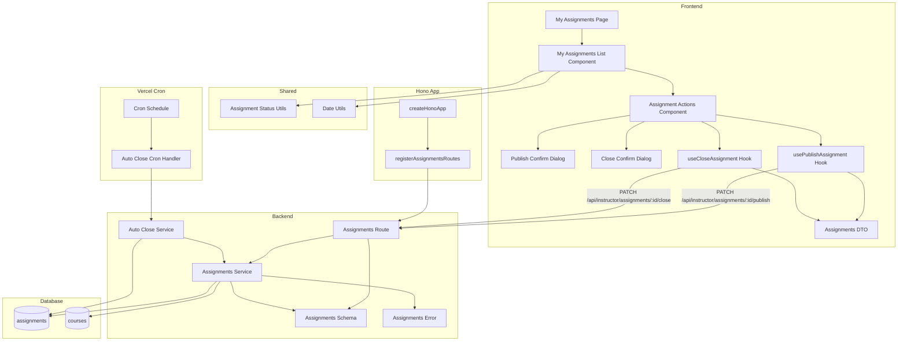

# Assignment 게시/마감 (Instructor) 구현 계획

## 개요

### Backend Modules

| 모듈 | 위치 | 설명 |
|------|------|------|
| Assignments Route | `src/features/assignments/backend/route.ts` | 과제 게시/마감 API 엔드포인트 (이미 구현됨) |
| Assignments Service | `src/features/assignments/backend/service.ts` | 과제 게시/마감 비즈니스 로직 (이미 구현됨) |
| Auto Close Service | `src/features/assignments/backend/auto-close.ts` | 과제 자동 마감 배치 처리 로직 (신규) |
| Assignments Schema | `src/features/assignments/backend/schema.ts` | 게시/마감 응답 스키마 (이미 구현됨) |
| Assignments Error | `src/features/assignments/backend/error.ts` | 게시/마감 관련 에러 코드 (이미 구현됨) |

### Frontend Modules

| 모듈 | 위치 | 설명 |
|------|------|------|
| Assignment Actions Component | `src/features/assignments/components/assignment-actions.tsx` | 게시/마감 버튼 컴포넌트 (이미 구현됨) |
| Publish Confirm Dialog | `src/features/assignments/components/publish-confirm-dialog.tsx` | 게시 확인 대화상자 (이미 구현됨) |
| Close Confirm Dialog | `src/features/assignments/components/close-confirm-dialog.tsx` | 마감 확인 대화상자 (이미 구현됨) |
| Publish Assignment Hook | `src/features/assignments/hooks/usePublishAssignment.ts` | 과제 게시 React Query mutation (이미 구현됨) |
| Close Assignment Hook | `src/features/assignments/hooks/useCloseAssignment.ts` | 과제 마감 React Query mutation (이미 구현됨) |
| Assignments DTO | `src/features/assignments/lib/dto.ts` | 프론트엔드 공유용 스키마 재노출 (기존 파일 활용) |

### API Route (Serverless Function)

| 모듈 | 위치 | 설명 |
|------|------|------|
| Auto Close Cron Handler | `src/app/api/cron/auto-close-assignments/route.ts` | Vercel Cron으로 호출되는 자동 마감 핸들러 (신규) |

### Shared Modules

| 모듈 | 위치 | 설명 |
|------|------|------|
| Assignment Status Utils | `src/features/assignments/lib/assignment-status-utils.ts` | 과제 상태 표시 헬퍼 (신규) |
| Date Utils | `src/lib/utils/date.ts` | 날짜 포맷팅 유틸 (기존 파일 활용) |

---

## Diagram



---

## Implementation Plan

### 1. Backend Layer (이미 구현됨)

#### 1.1 Assignments Error (이미 구현됨)

**File:** `src/features/assignments/backend/error.ts`

**현재 상태:**
- 게시/마감 관련 에러 코드 이미 정의됨:
  - `publishFailed`, `closeFailed`, `missingRequiredFields`, `courseArchived` 등

---

#### 1.2 Assignments Schema (이미 구현됨)

**File:** `src/features/assignments/backend/schema.ts`

**현재 상태:**
- `PublishAssignmentResponseSchema`: 게시 응답 스키마 정의됨
- `CloseAssignmentResponseSchema`: 마감 응답 스키마 정의됨

---

#### 1.3 Assignments Service (이미 구현됨)

**File:** `src/features/assignments/backend/service.ts`

**현재 상태:**

##### 1.3.1 `publishAssignment` 함수 (이미 구현됨)

- 검증:
  1. 과제 존재 확인
  2. 코스 소유권 확인 (`checkCourseOwnership`)
  3. 과제가 `draft` 상태인지 확인
  4. 필수 필드 확인 (title, description, due_date, weight)
  5. 코스가 `archived` 상태가 아닌지 확인
- 비즈니스 로직:
  1. `assignments` 테이블 UPDATE: `status = 'published'`
- 응답:
  - `assignmentId`, `status`, `message`

##### 1.3.2 `closeAssignment` 함수 (이미 구현됨)

- 검증:
  1. 과제 존재 확인
  2. 코스 소유권 확인
  3. 과제가 `published` 상태인지 확인
- 비즈니스 로직:
  1. `assignments` 테이블 UPDATE: `status = 'closed'`
- 응답:
  - `assignmentId`, `status`, `message`

**추가 개선 필요사항:**

없음. 기존 구현이 UC-011 요구사항을 만족함.

---

#### 1.4 Assignments Route (이미 구현됨)

**File:** `src/features/assignments/backend/route.ts`

**현재 상태:**
- `PATCH /api/instructor/assignments/:id/publish`: 과제 게시 엔드포인트 구현됨
- `PATCH /api/instructor/assignments/:id/close`: 과제 마감 엔드포인트 구현됨

**추가 개선 필요사항:**

없음. 기존 구현이 UC-011 요구사항을 만족함.

---

#### 1.5 Auto Close Service (신규)

**File:** `src/features/assignments/backend/auto-close.ts`

**구현 내용:**

자동 마감 배치 처리 로직을 별도 모듈로 분리하여 재사용성을 높임.

```typescript
import type { SupabaseClient } from '@supabase/supabase-js';
import type { HandlerResult } from '@/backend/http/response';
import { success, failure } from '@/backend/http/response';
import { assignmentsErrorCodes, type AssignmentsServiceError } from './error';

export interface AutoCloseResult {
  closedCount: number;
  closedAssignmentIds: string[];
  message: string;
}

/**
 * 마감일이 경과한 published 상태 과제를 자동으로 closed 상태로 변경
 */
export const autoCloseAssignments = async (
  supabase: SupabaseClient,
): Promise<HandlerResult<AutoCloseResult, AssignmentsServiceError>> => {
  try {
    const now = new Date().toISOString();

    // 1. 마감일 경과한 published 과제 조회
    const { data: assignments, error: fetchError } = await supabase
      .from('assignments')
      .select('id, title, due_date')
      .eq('status', 'published')
      .lt('due_date', now);

    if (fetchError) {
      return failure(
        500,
        assignmentsErrorCodes.invalidRequest,
        fetchError.message,
      );
    }

    if (!assignments || assignments.length === 0) {
      return success({
        closedCount: 0,
        closedAssignmentIds: [],
        message: '자동 마감할 과제가 없습니다.',
      });
    }

    const assignmentIds = assignments.map((a) => a.id);

    // 2. 일괄 업데이트
    const { data: updated, error: updateError } = await supabase
      .from('assignments')
      .update({ status: 'closed' })
      .in('id', assignmentIds)
      .select('id');

    if (updateError) {
      return failure(
        500,
        assignmentsErrorCodes.closeFailed,
        updateError.message,
      );
    }

    const closedIds = (updated || []).map((a: any) => a.id);

    return success({
      closedCount: closedIds.length,
      closedAssignmentIds: closedIds,
      message: `${closedIds.length}개의 과제가 자동으로 마감되었습니다.`,
    });
  } catch (err) {
    return failure(
      500,
      assignmentsErrorCodes.closeFailed,
      err instanceof Error ? err.message : 'Unknown error',
    );
  }
};
```

**Unit Test:**
```typescript
describe('autoCloseAssignments', () => {
  it('should close assignments past due date', async () => {
    // Mock: 2개의 마감일 경과 과제
    const result = await autoCloseAssignments(mockSupabaseClient);

    expect(result.ok).toBe(true);
    expect(result.data.closedCount).toBe(2);
    expect(result.data.closedAssignmentIds.length).toBe(2);
  });

  it('should return 0 if no assignments to close', async () => {
    // Mock: 마감일 경과 과제 없음
    const result = await autoCloseAssignments(mockSupabaseClient);

    expect(result.ok).toBe(true);
    expect(result.data.closedCount).toBe(0);
    expect(result.data.message).toContain('자동 마감할 과제가 없습니다');
  });

  it('should handle database error', async () => {
    // Mock: DB 에러
    mockSupabaseClient.from.mockImplementation(() => ({
      select: jest.fn().mockReturnValue({
        eq: jest.fn().mockReturnValue({
          lt: jest.fn().mockResolvedValue({
            data: null,
            error: { message: 'DB error' },
          }),
        }),
      }),
    }));

    const result = await autoCloseAssignments(mockSupabaseClient);

    expect(result.ok).toBe(false);
    expect(result.error.code).toBe(assignmentsErrorCodes.invalidRequest);
  });
});
```

---

### 2. API Route (Serverless Function) - 신규

#### 2.1 Auto Close Cron Handler

**File:** `src/app/api/cron/auto-close-assignments/route.ts`

**구현 내용:**

Vercel Cron Job으로 주기적으로 호출되는 serverless function.

```typescript
import { NextRequest, NextResponse } from 'next/server';
import { createSupabaseServerClient } from '@/backend/supabase/server';
import { autoCloseAssignments } from '@/features/assignments/backend/auto-close';
import { AppLogger } from '@/backend/logger';

export const runtime = 'nodejs';

/**
 * Vercel Cron으로 호출되는 자동 마감 핸들러
 *
 * vercel.json 설정 예시:
 * {
 *   "crons": [
 *     {
 *       "path": "/api/cron/auto-close-assignments",
 *       "schedule": "0 * * * *"
 *     }
 *   ]
 * }
 */
export async function GET(request: NextRequest) {
  const logger = new AppLogger('console');

  // Cron Secret 검증 (보안)
  const authHeader = request.headers.get('authorization');
  const cronSecret = process.env.CRON_SECRET;

  if (cronSecret && authHeader !== `Bearer ${cronSecret}`) {
    logger.warn('Unauthorized cron request');
    return NextResponse.json({ error: 'Unauthorized' }, { status: 401 });
  }

  logger.info('Auto close assignments cron job started');

  try {
    const supabase = createSupabaseServerClient();
    const result = await autoCloseAssignments(supabase);

    if (!result.ok) {
      logger.error('Auto close failed', { error: result.error });
      return NextResponse.json(
        { error: result.error.message },
        { status: result.error.httpStatus },
      );
    }

    logger.info('Auto close completed', {
      closedCount: result.data.closedCount,
      closedIds: result.data.closedAssignmentIds,
    });

    return NextResponse.json(
      {
        success: true,
        closedCount: result.data.closedCount,
        closedAssignmentIds: result.data.closedAssignmentIds,
        message: result.data.message,
      },
      { status: 200 },
    );
  } catch (err) {
    logger.error('Unexpected error in auto close cron', { error: err });
    return NextResponse.json(
      { error: 'Internal server error' },
      { status: 500 },
    );
  }
}
```

**vercel.json 설정:**

프로젝트 루트에 `vercel.json` 파일 추가 또는 수정:

```json
{
  "crons": [
    {
      "path": "/api/cron/auto-close-assignments",
      "schedule": "0 * * * *"
    }
  ]
}
```

- `schedule`: 매 시간 정각에 실행 (Cron 표현식)
- `CRON_SECRET`: 환경 변수로 설정하여 인증 강화

---

### 3. Shared Layer

#### 3.1 Assignment Status Utils (신규)

**File:** `src/features/assignments/lib/assignment-status-utils.ts`

**구현 내용:**

```typescript
export type AssignmentStatus = 'draft' | 'published' | 'closed';

export const getAssignmentStatusText = (status: AssignmentStatus): string => {
  const statusMap: Record<AssignmentStatus, string> = {
    draft: '임시 저장',
    published: '게시됨',
    closed: '마감됨',
  };
  return statusMap[status];
};

export const getAssignmentStatusColor = (
  status: AssignmentStatus,
): 'default' | 'success' | 'secondary' => {
  const colorMap: Record<AssignmentStatus, 'default' | 'success' | 'secondary'> = {
    draft: 'default',
    published: 'success',
    closed: 'secondary',
  };
  return colorMap[status];
};

/**
 * 과제가 게시 가능한 상태인지 확인
 */
export const canPublish = (assignment: {
  status: AssignmentStatus;
  title: string;
  description: string;
  dueDate: string;
  weight: number;
}): boolean => {
  return (
    assignment.status === 'draft' &&
    !!assignment.title &&
    !!assignment.description &&
    !!assignment.dueDate &&
    assignment.weight >= 0 &&
    assignment.weight <= 100
  );
};

/**
 * 과제가 마감 가능한 상태인지 확인
 */
export const canClose = (assignment: { status: AssignmentStatus }): boolean => {
  return assignment.status === 'published';
};
```

**Unit Test:**
```typescript
describe('assignment status utils', () => {
  it('should return correct status text', () => {
    expect(getAssignmentStatusText('draft')).toBe('임시 저장');
    expect(getAssignmentStatusText('published')).toBe('게시됨');
    expect(getAssignmentStatusText('closed')).toBe('마감됨');
  });

  it('should return correct status color', () => {
    expect(getAssignmentStatusColor('draft')).toBe('default');
    expect(getAssignmentStatusColor('published')).toBe('success');
    expect(getAssignmentStatusColor('closed')).toBe('secondary');
  });

  it('should correctly determine if assignment can be published', () => {
    const validAssignment = {
      status: 'draft' as const,
      title: '과제1',
      description: '설명',
      dueDate: '2025-12-31T23:59:59Z',
      weight: 10,
    };
    expect(canPublish(validAssignment)).toBe(true);

    const invalidAssignment = {
      ...validAssignment,
      title: '',
    };
    expect(canPublish(invalidAssignment)).toBe(false);
  });

  it('should correctly determine if assignment can be closed', () => {
    expect(canClose({ status: 'published' })).toBe(true);
    expect(canClose({ status: 'draft' })).toBe(false);
    expect(canClose({ status: 'closed' })).toBe(false);
  });
});
```

---

### 4. Frontend Layer (이미 구현됨)

#### 4.1 Assignments DTO (기존 파일 활용)

**File:** `src/features/assignments/lib/dto.ts`

**현재 상태:**
- `PublishAssignmentResponseSchema`, `CloseAssignmentResponseSchema` 이미 재노출됨

**추가 개선 필요사항:**

필요시 `assignment-status-utils.ts` 재노출:

```typescript
export {
  // ... 기존 DTO
  PublishAssignmentResponseSchema,
  CloseAssignmentResponseSchema,
  type PublishAssignmentResponse,
  type CloseAssignmentResponse,
} from '@/features/assignments/backend/schema';

export {
  getAssignmentStatusText,
  getAssignmentStatusColor,
  canPublish,
  canClose,
  type AssignmentStatus,
} from './assignment-status-utils';
```

---

#### 4.2 Publish Assignment Hook (이미 구현됨)

**File:** `src/features/assignments/hooks/usePublishAssignment.ts`

**현재 상태:**
- 이미 구현됨

**추가 개선 필요사항:**

없음.

---

#### 4.3 Close Assignment Hook (이미 구현됨)

**File:** `src/features/assignments/hooks/useCloseAssignment.ts`

**현재 상태:**
- 이미 구현됨

**추가 개선 필요사항:**

없음.

---

#### 4.4 Frontend Components QA Sheets

**Assignment Actions Component QA Sheet:**
| 시나리오 | 입력 | 예상 결과 |
|---------|------|----------|
| draft 상태 과제 "게시" 버튼 표시 | status = 'draft' | "게시" 버튼 활성화 |
| published 상태 과제 "마감" 버튼 표시 | status = 'published' | "마감" 버튼 활성화 |
| closed 상태 과제 버튼 비활성화 | status = 'closed' | 버튼 표시 안 됨 또는 비활성화 |
| 필수 필드 누락 시 게시 버튼 비활성화 | title 또는 description 비어있음 | "게시" 버튼 비활성화, 툴팁 표시 |
| 게시 버튼 클릭 | "게시" 클릭 | Publish Confirm Dialog 표시 |
| 마감 버튼 클릭 | "마감" 클릭 | Close Confirm Dialog 표시 |

**Publish Confirm Dialog QA Sheet:**
| 시나리오 | 입력 | 예상 결과 |
|---------|------|----------|
| 게시 확인 | "확인" 버튼 클릭 | 과제 게시 API 호출, "과제가 게시되었습니다" 메시지 |
| 게시 취소 | "취소" 버튼 클릭 | 대화상자 닫힘, 게시 진행 안 됨 |
| 필수 필드 누락 | title 비어있음 | "필수 항목을 모두 입력해주세요" 오류 |
| 코스 archived 상태 | 코스 status = 'archived' | "보관된 코스의 과제는 게시할 수 없습니다" 오류 |
| 이미 게시됨 | status = 'published' | "이미 게시된 과제입니다" 오류 |
| 네트워크 오류 | 네트워크 끊김 | "일시적인 오류가 발생했습니다" 오류 메시지 |

**Close Confirm Dialog QA Sheet:**
| 시나리오 | 입력 | 예상 결과 |
|---------|------|----------|
| 마감 확인 | "확인" 버튼 클릭 | 과제 마감 API 호출, "과제가 마감되었습니다" 메시지 |
| 마감 취소 | "취소" 버튼 클릭 | 대화상자 닫힘, 마감 진행 안 됨 |
| 게시되지 않은 과제 | status = 'draft' | "게시된 과제만 마감할 수 있습니다" 오류 |
| 이미 마감됨 | status = 'closed' | "게시된 과제만 마감할 수 있습니다" 오류 |
| 네트워크 오류 | 네트워크 끊김 | "일시적인 오류가 발생했습니다" 오류 메시지 |
| 확인 대화상자 메시지 | - | "과제를 마감하시겠습니까? 마감 후에는 학습자가 제출할 수 없습니다." 표시 |

---

## Implementation Order

1. **Shared**: Assignment Status Utils 구현 및 테스트
2. **Backend Service**: Auto Close Service (`auto-close.ts`) 구현 및 테스트
3. **API Route**: Auto Close Cron Handler (`/api/cron/auto-close-assignments/route.ts`) 구현
4. **Configuration**: `vercel.json` 파일에 Cron Job 설정 추가
5. **Environment**: `CRON_SECRET` 환경 변수 설정 (Vercel 대시보드)
6. **Frontend DTO**: `dto.ts`에서 assignment-status-utils 재노출 (필요시)
7. **Frontend Components**: 기존 컴포넌트 확인 및 개선 (필요시)
8. **Integration Test**: Full flow 수동 QA
   - 게시 플로우 테스트
   - 마감 플로우 테스트
   - 자동 마감 테스트 (Cron Job)

---

## Notes

### 비즈니스 규칙

- **과제 상태 전환 규칙**:
  - `draft` → `published`: 강사가 "게시" 버튼 클릭
  - `published` → `closed`: 강사가 "마감" 버튼 클릭 또는 시스템이 마감일 도래 시 자동 전환
  - `closed` 상태에서는 다른 상태로 전환할 수 없음
  - `draft` 상태에서는 바로 `closed`로 전환할 수 없음 (반드시 `published`를 거쳐야 함)

- **게시 가능 조건**:
  - 과제가 `draft` 상태여야 함
  - 필수 필드가 모두 입력되어야 함:
    - `title` (과제 제목)
    - `description` (과제 설명)
    - `due_date` (마감일)
    - `weight` (점수 비중, 0~100 범위)
  - 강사가 해당 과제의 소유 코스의 소유자여야 함
  - 해당 과제가 속한 코스가 `archived` 상태가 아니어야 함

- **마감 정책**:
  - `published` 상태의 과제만 마감할 수 있음
  - 마감된 과제는 학습자가 더 이상 제출할 수 없음
  - 마감된 과제도 강사는 기존 제출물을 채점할 수 있음
  - 마감일(`due_date`)이 경과한 과제는 자동으로 `closed` 상태로 전환됨
  - 수동 마감 시에도 마감일 전후에 관계없이 마감할 수 있음

- **학습자 노출 규칙**:
  - `draft` 상태 과제는 학습자에게 표시되지 않음
  - `published` 상태 과제만 학습자의 대시보드 및 과제 목록에 노출됨
  - `closed` 상태 과제도 학습자에게 표시되지만, 제출 버튼이 비활성화됨

- **권한 정책**:
  - 강사는 본인이 소유한 코스의 과제만 게시/마감할 수 있음
  - 다른 강사의 과제에 대한 게시/마감 시도는 차단됨
  - Learner 역할 사용자는 과제를 게시/마감할 수 없음

- **코스 Archive 연동**:
  - 코스가 `published` → `archived` 상태로 전환될 때, 해당 코스에 속한 모든 `published` 상태의 과제는 자동으로 `closed` 상태로 변경됨
  - 이는 비즈니스 로직 또는 데이터베이스 트리거를 통해 구현될 수 있음 (현재는 수동 처리 또는 추후 구현)

- **자동 마감 배치 처리**:
  - 시스템은 주기적으로(예: 매 시간) `published` 상태 과제를 확인함
  - `due_date < NOW()` 조건을 만족하는 과제를 `closed` 상태로 일괄 업데이트함
  - 배치 처리는 Vercel Cron Job을 통해 구현됨

### 기술적 고려사항

- **인증**: 모든 API는 `x-user-id` 헤더로 사용자 ID 추출
- **권한 검증**: Instructor 역할만 게시/마감 API 접근 가능
- **에러 처리**: 모든 API 호출에서 에러 메시지 사용자에게 표시
- **날짜 표시**: 한국어 로케일 사용 (`date-fns/locale/ko`)
- **캐싱**: React Query의 `invalidateQueries`로 게시/마감 후 캐시 무효화
- **타입 안전성**: 백엔드 스키마를 프론트엔드에서 재사용
- **Cron Job 보안**: `CRON_SECRET` 환경 변수로 인증 강화

### 기존 코드와의 통합

- `publishAssignment`, `closeAssignment` 함수는 이미 `assignments/backend/service.ts`에 구현되어 있음
- `checkCourseOwnership` 헬퍼는 이미 assignments service에 구현되어 있음
- `respond` 헬퍼는 `src/backend/http/response.ts`에서 제공하는 공통 헬퍼 사용
- `date-fns` 기반 날짜 유틸리티는 기존 `src/lib/utils/date.ts` 파일 활용
- `assignments` 테이블은 이미 존재하며, 추가 마이그레이션 불필요
- `updated_at` 트리거는 이미 설정되어 있음
- 프론트엔드 컴포넌트는 이미 구현되어 있음 (`assignment-actions.tsx`, `publish-confirm-dialog.tsx`, `close-confirm-dialog.tsx`)

### 추후 확장

- 코스 archive 시 과제 자동 마감 (데이터베이스 트리거 또는 비즈니스 로직)
- 게시 예약 (특정 시간에 자동 게시)
- 마감 예약 (특정 시간에 자동 마감)
- 알림 기능 (과제 게시/마감 시 학습자에게 알림)
- 통계 대시보드 (게시/마감된 과제 수, 제출률 등)

### 데이터베이스 관련

- `assignments` 테이블은 이미 존재하며, 추가 마이그레이션 불필요
- `status` 컬럼: `text`, `CHECK (status IN ('draft', 'published', 'closed'))`
- 인덱스: `idx_assignments_status`, `idx_assignments_due_date` 이미 설정됨

### Vercel Cron Job 설정

- **주기**: 매 시간 정각 (`0 * * * *`)
- **보안**: `CRON_SECRET` 환경 변수로 인증
- **로깅**: 자동 마감 결과를 로그에 기록
- **에러 처리**: Cron 실패 시 로그에 에러 기록

### 라우팅 규칙

- Instructor 페이지는 `/instructor/*` 경로 사용
- Next.js 라우트 그룹 `(instructor)` 활용
- Cron 엔드포인트: `/api/cron/auto-close-assignments`

### 향후 구현 필요 항목

- 코스 archive 시 과제 자동 마감 로직
- 게시/마감 이력 조회 (audit log)
- 게시/마감 알림 (이메일 또는 푸시)
- 대시보드에 "곧 마감되는 과제" 섹션 추가
