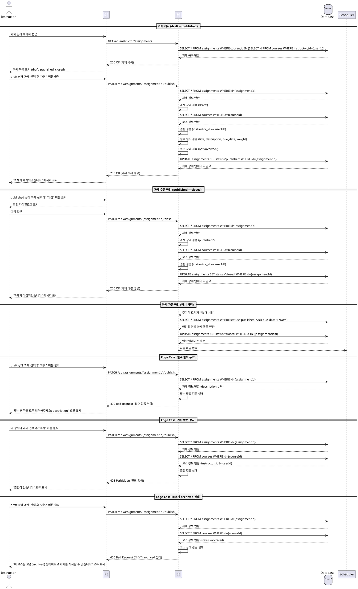

# Assignment 게시/마감 (Instructor) - Use Case Specification

## Primary Actor

**Instructor** (강사)

---

## Precondition

- 사용자가 Instructor 역할로 로그인되어 있다.
- 강사가 본인이 소유한 코스의 과제 관리 페이지에 접근할 수 있다.
- 최소 하나 이상의 과제가 `draft` 또는 `published` 상태로 존재한다.

---

## Trigger

- 강사가 과제 상태 변경 버튼("게시" 또는 "마감")을 클릭한다.
- 과제의 마감일(`due_date`)이 도래하여 시스템이 자동으로 상태를 `closed`로 변경한다.

---

## Main Scenario

### UC-011-1: 과제 게시 (draft → published)

1. 강사가 과제 관리 페이지(`/instructor/assignments`)에 접근한다.
2. 시스템은 본인이 소유한 코스의 과제 목록을 표시한다.
3. 강사가 `draft` 상태의 과제를 선택하고 "게시" 버튼을 클릭한다.
4. 시스템은 다음을 검증한다:
   - 과제가 `draft` 상태인지 확인
   - 강사가 해당 과제의 소유 코스(`course_id`)의 소유자인지 확인
   - 필수 필드(title, description, due_date, weight)가 모두 입력되었는지 확인
5. 검증 통과 시, 시스템은 `assignments` 테이블에서 해당 과제의 `status`를 `published`로 업데이트한다.
6. 시스템은 "과제가 게시되었습니다" 메시지를 표시한다.
7. 해당 코스를 수강 중인 학습자의 대시보드 및 과제 목록에 과제가 노출된다.

### UC-011-2: 과제 수동 마감 (published → closed)

1. 강사가 과제 관리 페이지에서 `published` 상태의 과제를 선택한다.
2. 강사가 "마감" 버튼을 클릭한다.
3. 시스템은 확인 다이얼로그를 표시한다: "과제를 마감하시겠습니까? 마감 후에는 학습자가 제출할 수 없습니다."
4. 강사가 마감을 확인한다.
5. 시스템은 다음을 검증한다:
   - 과제가 `published` 상태인지 확인
   - 강사가 해당 과제의 소유 코스의 소유자인지 확인
6. 검증 통과 시, 시스템은 `assignments` 테이블에서 해당 과제의 `status`를 `closed`로 업데이트한다.
7. 시스템은 "과제가 마감되었습니다" 메시지를 표시한다.
8. 학습자는 더 이상 해당 과제를 제출할 수 없으며, 강사는 기존 제출물을 채점만 할 수 있다.

### UC-011-3: 과제 자동 마감 (마감일 도래)

1. 시스템은 주기적으로(배치 작업 또는 트리거) `published` 상태의 과제를 확인한다.
2. 시스템은 현재 시각(`NOW()`)이 과제의 `due_date`를 경과한 과제를 조회한다.
3. 조회된 과제들의 `status`를 `closed`로 일괄 업데이트한다.
4. 학습자는 더 이상 해당 과제를 제출할 수 없다.
5. 강사는 마감된 과제의 제출물을 채점할 수 있다.

---

## Edge Cases

### E1. 필수 필드 누락 상태로 게시 시도

- **조건**: 강사가 `draft` 상태 과제를 게시하려 하지만 필수 필드(title, description, due_date, weight)가 누락된 경우
- **처리**: "필수 항목을 모두 입력해주세요" 오류 메시지를 표시하고, 게시를 차단한다. 누락된 필드를 명시적으로 안내한다.

### E2. 권한 없는 강사의 과제 게시/마감 시도

- **조건**: 강사가 본인이 소유하지 않은 코스의 과제를 게시/마감하려는 경우
- **처리**: "권한이 없습니다" 오류 메시지를 표시하고, 403 Forbidden 응답을 반환한다.

### E3. 이미 게시된 과제를 다시 게시 시도

- **조건**: 강사가 이미 `published` 상태인 과제에 대해 "게시" 버튼을 클릭한 경우
- **처리**: "이미 게시된 과제입니다" 오류 메시지를 표시하고, 요청을 차단한다. UI에서는 `published` 상태 과제에 "게시" 버튼이 표시되지 않도록 한다.

### E4. 이미 마감된 과제를 다시 마감 시도

- **조건**: 강사가 이미 `closed` 상태인 과제에 대해 "마감" 버튼을 클릭한 경우
- **처리**: "이미 마감된 과제입니다" 오류 메시지를 표시하고, 요청을 차단한다. UI에서는 `closed` 상태 과제에 "마감" 버튼이 표시되지 않도록 한다.

### E5. 과제가 속한 코스가 archived 상태인 경우

- **조건**: 강사가 과제를 게시하려는 시점에 해당 코스가 `archived` 상태로 변경된 경우
- **처리**: "이 코스는 보관(archived) 상태이므로 과제를 게시할 수 없습니다" 오류 메시지를 표시하고, 게시를 차단한다.

### E6. 네트워크 오류 또는 서버 오류

- **조건**: 게시/마감 요청 중 네트워크 또는 서버 오류 발생
- **처리**: "일시적인 오류가 발생했습니다. 다시 시도해주세요" 오류 메시지를 표시하고, 재시도 버튼을 제공한다.

### E7. 동시성 문제 (Race Condition)

- **조건**: 강사가 짧은 시간 내에 게시/마감 버튼을 여러 번 클릭하거나, 자동 마감 배치와 수동 마감 요청이 동시에 발생하는 경우
- **처리**: 첫 번째 요청만 처리하고, 이후 요청은 무시한다. 버튼을 로딩 상태로 비활성화하여 중복 클릭을 방지한다. 데이터베이스 트랜잭션 및 낙관적 잠금을 통해 동시성 문제를 방지한다.

---

## Business Rules

### BR-011-1: 과제 상태 전환 규칙

- `draft` → `published`: 강사가 "게시" 버튼을 클릭하여 수동으로 전환한다.
- `published` → `closed`: 다음 두 가지 경우에 전환된다:
  1. 강사가 "마감" 버튼을 클릭하여 수동으로 전환
  2. 시스템이 마감일(`due_date`) 도래 시 자동으로 전환
- `closed` 상태에서는 다른 상태로 전환할 수 없다.
- `draft` 상태에서는 바로 `closed`로 전환할 수 없다 (반드시 `published`를 거쳐야 함).

### BR-011-2: 게시 가능 조건

- 과제가 `draft` 상태여야 한다.
- 필수 필드가 모두 입력되어야 한다:
  - `title` (과제 제목)
  - `description` (과제 설명)
  - `due_date` (마감일)
  - `weight` (점수 비중, 0~100 범위)
- 강사가 해당 과제의 소유 코스의 소유자여야 한다.
- 해당 과제가 속한 코스가 `archived` 상태가 아니어야 한다.

### BR-011-3: 마감 정책

- `published` 상태의 과제만 마감할 수 있다.
- 마감된 과제는 학습자가 더 이상 제출할 수 없다.
- 마감된 과제도 강사는 기존 제출물을 채점할 수 있다.
- 마감일(`due_date`)이 경과한 과제는 자동으로 `closed` 상태로 전환된다.
- 수동 마감 시에도 마감일 전후에 관계없이 마감할 수 있다.

### BR-011-4: 학습자 노출 규칙

- `draft` 상태 과제는 학습자에게 표시되지 않는다.
- `published` 상태 과제만 학습자의 대시보드 및 과제 목록에 노출된다.
- `closed` 상태 과제도 학습자에게 표시되지만, 제출 버튼이 비활성화된다.

### BR-011-5: 권한 정책

- 강사는 본인이 소유한 코스의 과제만 게시/마감할 수 있다.
- 다른 강사의 과제에 대한 게시/마감 시도는 차단된다.
- Learner 역할 사용자는 과제를 게시/마감할 수 없다.

### BR-011-6: 코스 Archive 연동

- 코스가 `published` → `archived` 상태로 전환될 때, 해당 코스에 속한 모든 `published` 상태의 과제는 자동으로 `closed` 상태로 변경된다.
- 이는 비즈니스 로직 또는 데이터베이스 트리거를 통해 구현된다.

### BR-011-7: 자동 마감 배치 처리

- 시스템은 주기적으로(예: 매 시간 또는 매 10분) `published` 상태 과제를 확인한다.
- `due_date < NOW()` 조건을 만족하는 과제를 `closed` 상태로 일괄 업데이트한다.
- 배치 처리는 별도의 스케줄러(예: cron job, serverless function)를 통해 구현될 수 있다.

---

## Sequence Diagram

