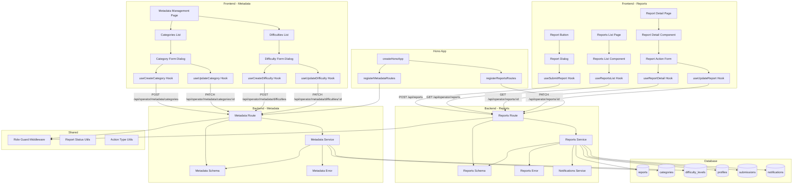

# 운영 (Operator) 구현 계획

## 개요

### Backend Modules

| 모듈 | 위치 | 설명 |
|------|------|------|
| Reports Route | `src/features/reports/backend/route.ts` | 신고 접수/조회/처리 API 엔드포인트 (신규) |
| Reports Service | `src/features/reports/backend/service.ts` | 신고 비즈니스 로직 (신규) |
| Reports Schema | `src/features/reports/backend/schema.ts` | 신고 요청/응답 zod 스키마 정의 (신규) |
| Reports Error | `src/features/reports/backend/error.ts` | 신고 관련 에러 코드 (신규) |
| Metadata Route | `src/features/metadata/backend/route.ts` | 메타데이터 관리 API 엔드포인트 (신규) |
| Metadata Service | `src/features/metadata/backend/service.ts` | 메타데이터 비즈니스 로직 (신규) |
| Metadata Schema | `src/features/metadata/backend/schema.ts` | 메타데이터 요청/응답 zod 스키마 정의 (신규) |
| Metadata Error | `src/features/metadata/backend/error.ts` | 메타데이터 관련 에러 코드 (신규) |
| Notifications Service | `src/features/notifications/backend/service.ts` | 알림 발송 로직 (신규, 공통 모듈) |
| Notifications Schema | `src/features/notifications/backend/schema.ts` | 알림 스키마 (신규, 공통 모듈) |

### Frontend Modules - Reports

| 모듈 | 위치 | 설명 |
|------|------|------|
| Report Button Component | `src/features/reports/components/report-button.tsx` | 신고 버튼 컴포넌트 (신규) |
| Report Dialog Component | `src/features/reports/components/report-dialog.tsx` | 신고 접수 대화상자 (신규) |
| Reports List Page | `src/app/(operator)/operator/reports/page.tsx` | 신고 목록 페이지 (신규) |
| Report Detail Page | `src/app/(operator)/operator/reports/[reportId]/page.tsx` | 신고 상세 및 처리 페이지 (신규) |
| Reports List Component | `src/features/reports/components/reports-list.tsx` | 신고 목록 컴포넌트 (신규) |
| Report Detail Component | `src/features/reports/components/report-detail.tsx` | 신고 상세 컴포넌트 (신규) |
| Report Action Form Component | `src/features/reports/components/report-action-form.tsx` | 신고 처리 폼 컴포넌트 (신규) |
| Reports DTO | `src/features/reports/lib/dto.ts` | 프론트엔드 스키마 재노출 (신규) |
| Submit Report Hook | `src/features/reports/hooks/useSubmitReport.ts` | 신고 접수 React Query mutation (신규) |
| Reports List Hook | `src/features/reports/hooks/useReportsList.ts` | 신고 목록 조회 React Query hook (신규) |
| Report Detail Hook | `src/features/reports/hooks/useReportDetail.ts` | 신고 상세 조회 React Query hook (신규) |
| Update Report Hook | `src/features/reports/hooks/useUpdateReport.ts` | 신고 처리 React Query mutation (신규) |

### Frontend Modules - Metadata

| 모듈 | 위치 | 설명 |
|------|------|------|
| Metadata Management Page | `src/app/(operator)/operator/metadata/page.tsx` | 메타데이터 관리 페이지 (신규) |
| Categories List Component | `src/features/metadata/components/categories-list.tsx` | 카테고리 목록 컴포넌트 (신규) |
| Difficulties List Component | `src/features/metadata/components/difficulties-list.tsx` | 난이도 목록 컴포넌트 (신규) |
| Category Form Dialog | `src/features/metadata/components/category-form-dialog.tsx` | 카테고리 추가/수정 대화상자 (신규) |
| Difficulty Form Dialog | `src/features/metadata/components/difficulty-form-dialog.tsx` | 난이도 추가/수정 대화상자 (신규) |
| Metadata DTO | `src/features/metadata/lib/dto.ts` | 프론트엔드 스키마 재노출 (신규) |
| Categories Hook | `src/features/metadata/hooks/useCategories.ts` | 카테고리 목록 조회 React Query hook (신규) |
| Difficulties Hook | `src/features/metadata/hooks/useDifficulties.ts` | 난이도 목록 조회 React Query hook (신규) |
| Create Category Hook | `src/features/metadata/hooks/useCreateCategory.ts` | 카테고리 추가 React Query mutation (신규) |
| Update Category Hook | `src/features/metadata/hooks/useUpdateCategory.ts` | 카테고리 수정 React Query mutation (신규) |
| Create Difficulty Hook | `src/features/metadata/hooks/useCreateDifficulty.ts` | 난이도 추가 React Query mutation (신규) |
| Update Difficulty Hook | `src/features/metadata/hooks/useUpdateDifficulty.ts` | 난이도 수정 React Query mutation (신규) |

### Shared Modules

| 모듈 | 위치 | 설명 |
|------|------|------|
| Role Guard Middleware | `src/backend/middleware/role-guard.ts` | 역할 기반 권한 검증 미들웨어 (신규) |
| Report Status Utils | `src/features/reports/lib/report-status-utils.ts` | 신고 상태 헬퍼 (신규) |
| Action Type Utils | `src/features/reports/lib/action-type-utils.ts` | 조치 유형 헬퍼 (신규) |

---

## Diagram



---

## Implementation Plan

### 1. Backend Layer - Reports

#### 1.1 Reports Error

**File:** `src/features/reports/backend/error.ts`

**구현 내용:**
```typescript
export const reportsErrorCodes = {
  invalidRequest: 'REPORTS_INVALID_REQUEST',
  unauthorized: 'REPORTS_UNAUTHORIZED',
  reportNotFound: 'REPORTS_NOT_FOUND',
  targetNotFound: 'REPORTS_TARGET_NOT_FOUND',
  invalidStatus: 'REPORTS_INVALID_STATUS',
  statusTransitionNotAllowed: 'REPORTS_STATUS_TRANSITION_NOT_ALLOWED',
  actionRequired: 'REPORTS_ACTION_REQUIRED',
  actionFailed: 'REPORTS_ACTION_FAILED',
  notificationFailed: 'REPORTS_NOTIFICATION_FAILED',
} as const;

export type ReportsServiceError = {
  code: typeof reportsErrorCodes[keyof typeof reportsErrorCodes];
  httpStatus: number;
  message: string;
};
```

---

#### 1.2 Reports Schema

**File:** `src/features/reports/backend/schema.ts`

**구현 내용:**
```typescript
import { z } from 'zod';

// 신고 대상 유형
export const TargetTypeSchema = z.enum(['course', 'assignment', 'submission', 'user']);

// 신고 상태
export const ReportStatusSchema = z.enum(['received', 'investigating', 'resolved']);

// 조치 유형
export const ActionTypeSchema = z.enum([
  'warning',
  'invalidate_submission',
  'suspend_account',
  'ban_account',
  'dismiss',
]);

// 신고 접수 요청
export const SubmitReportRequestSchema = z.object({
  targetType: TargetTypeSchema,
  targetId: z.string().uuid(),
  reason: z.string().min(1, '신고 사유는 필수 항목입니다.'),
  content: z.string().min(10, '신고 내용은 최소 10자 이상 입력해주세요.'),
});

// 신고 접수 응답
export const SubmitReportResponseSchema = z.object({
  reportId: z.string().uuid(),
  status: ReportStatusSchema,
  createdAt: z.string(),
  message: z.string(),
});

// 신고 목록 조회 쿼리
export const ReportsListQuerySchema = z.object({
  status: ReportStatusSchema.optional(),
  targetType: TargetTypeSchema.optional(),
  limit: z.number().int().min(1).max(100).default(20),
  offset: z.number().int().min(0).default(0),
});

// 신고 항목
export const ReportItemSchema = z.object({
  id: z.string().uuid(),
  reporter: z.object({
    id: z.string().uuid(),
    name: z.string(),
  }),
  targetType: TargetTypeSchema,
  targetId: z.string().uuid(),
  reason: z.string(),
  status: ReportStatusSchema,
  createdAt: z.string(),
  resolvedAt: z.string().nullable(),
});

// 신고 목록 응답
export const ReportsListResponseSchema = z.object({
  reports: z.array(ReportItemSchema),
  total: z.number(),
  limit: z.number(),
  offset: z.number(),
});

// 신고 상세 응답
export const ReportDetailResponseSchema = z.object({
  id: z.string().uuid(),
  reporter: z.object({
    id: z.string().uuid(),
    name: z.string(),
  }),
  targetType: TargetTypeSchema,
  targetId: z.string().uuid(),
  targetInfo: z.object({
    title: z.string().optional(),
    name: z.string().optional(),
  }).nullable(),
  reason: z.string(),
  content: z.string(),
  status: ReportStatusSchema,
  actionTaken: z.string().nullable(),
  createdAt: z.string(),
  updatedAt: z.string(),
  resolvedAt: z.string().nullable(),
});

// 신고 처리 요청
export const UpdateReportRequestSchema = z.object({
  status: ReportStatusSchema,
  actionType: ActionTypeSchema.optional(),
  actionNote: z.string().optional(),
  suspensionDays: z.number().int().min(1).max(365).optional(),
});

// 신고 처리 응답
export const UpdateReportResponseSchema = z.object({
  reportId: z.string().uuid(),
  status: ReportStatusSchema,
  resolvedAt: z.string().nullable(),
  message: z.string(),
});

// TypeScript 타입 추출
export type TargetType = z.infer<typeof TargetTypeSchema>;
export type ReportStatus = z.infer<typeof ReportStatusSchema>;
export type ActionType = z.infer<typeof ActionTypeSchema>;
export type SubmitReportRequest = z.infer<typeof SubmitReportRequestSchema>;
export type SubmitReportResponse = z.infer<typeof SubmitReportResponseSchema>;
export type ReportsListQuery = z.infer<typeof ReportsListQuerySchema>;
export type ReportItem = z.infer<typeof ReportItemSchema>;
export type ReportsListResponse = z.infer<typeof ReportsListResponseSchema>;
export type ReportDetailResponse = z.infer<typeof ReportDetailResponseSchema>;
export type UpdateReportRequest = z.infer<typeof UpdateReportRequestSchema>;
export type UpdateReportResponse = z.infer<typeof UpdateReportResponseSchema>;
```

**Unit Test:**
```typescript
describe('Reports Schema', () => {
  it('should validate submit report request', () => {
    const valid = {
      targetType: 'course',
      targetId: '123e4567-e89b-12d3-a456-426614174000',
      reason: '부적절한 콘텐츠',
      content: '해당 코스의 내용이 부적절합니다.',
    };
    expect(SubmitReportRequestSchema.safeParse(valid).success).toBe(true);
  });

  it('should reject invalid target type', () => {
    const invalid = {
      targetType: 'invalid',
      targetId: '123e4567-e89b-12d3-a456-426614174000',
      reason: '신고',
      content: '부적절합니다.',
    };
    expect(SubmitReportRequestSchema.safeParse(invalid).success).toBe(false);
  });

  it('should reject short content', () => {
    const invalid = {
      targetType: 'course',
      targetId: '123e4567-e89b-12d3-a456-426614174000',
      reason: '신고',
      content: '짧음',
    };
    expect(SubmitReportRequestSchema.safeParse(invalid).success).toBe(false);
  });
});
```

---

#### 1.3 Notifications Service (공통 모듈)

**File:** `src/features/notifications/backend/service.ts`

**구현 내용:**
```typescript
import type { SupabaseClient } from '@supabase/supabase-js';
import type { HandlerResult } from '@/backend/http/response';
import { success, failure } from '@/backend/http/response';

export interface NotificationData {
  userId: string;
  type: string;
  title: string;
  content: string;
}

export interface NotificationServiceError {
  code: string;
  httpStatus: number;
  message: string;
}

/**
 * 알림 생성 및 발송
 * 향후 확장: 이메일, 푸시 알림 등
 */
export const createNotification = async (
  supabase: SupabaseClient,
  data: NotificationData,
): Promise<HandlerResult<{ notificationId: string }, NotificationServiceError>> => {
  try {
    const { data: notification, error } = await supabase
      .from('notifications')
      .insert({
        user_id: data.userId,
        type: data.type,
        title: data.title,
        content: data.content,
        is_read: false,
      })
      .select('id')
      .single();

    if (error || !notification) {
      return failure(500, 'NOTIFICATION_FAILED', error?.message || '알림 생성에 실패했습니다.');
    }

    return success({ notificationId: notification.id });
  } catch (err) {
    return failure(
      500,
      'NOTIFICATION_FAILED',
      err instanceof Error ? err.message : 'Unknown error',
    );
  }
};
```

**File:** `src/features/notifications/backend/schema.ts`

```typescript
import { z } from 'zod';

export const NotificationSchema = z.object({
  id: z.string().uuid(),
  userId: z.string().uuid(),
  type: z.string(),
  title: z.string(),
  content: z.string(),
  isRead: z.boolean(),
  createdAt: z.string(),
});

export type Notification = z.infer<typeof NotificationSchema>;
```

---

#### 1.4 Reports Service

**File:** `src/features/reports/backend/service.ts`

**구현 내용:**

##### 1.4.1 `submitReport` 함수 (신고 접수)

- 검증:
  1. 사용자 인증 확인
  2. 대상 유효성 검증 (target_type, target_id)
  3. 신고 사유 및 내용 검증
- 비즈니스 로직:
  1. `reports` 테이블에 INSERT
  2. 상태: `received`
- 응답: `reportId`, `status`, `createdAt`, `message`

##### 1.4.2 `getReportsList` 함수 (신고 목록 조회)

- 검증:
  1. 운영자 권한 확인 (role=operator)
- 비즈니스 로직:
  1. `reports` 테이블 조회 (with pagination)
  2. 필터: status, target_type
  3. JOIN profiles for reporter name
- 응답: `reports[]`, `total`, `limit`, `offset`

##### 1.4.3 `getReportDetail` 함수 (신고 상세 조회)

- 검증:
  1. 운영자 권한 확인
  2. 신고 존재 확인
- 비즈니스 로직:
  1. `reports` 테이블 조회 with JOIN
  2. 대상 정보 조회 (target_type에 따라 분기)
- 응답: 신고 상세 정보

##### 1.4.4 `updateReport` 함수 (신고 처리)

- 검증:
  1. 운영자 권한 확인
  2. 신고 존재 확인
  3. 상태 전환 가능 여부 확인
  4. 조치 유형 유효성 검증
- 비즈니스 로직:
  1. 상태 전환: `received` → `investigating` → `resolved`
  2. `resolved` 상태일 경우 조치 실행:
     - `warning`: 경고 카운터 증가 (향후 확장)
     - `invalidate_submission`: 제출물 상태 변경 (status='invalidated', score=0)
     - `suspend_account`: 계정 일시정지 (향후 확장: account_restrictions 테이블)
     - `ban_account`: 계정 영구정지 (향후 확장)
     - `dismiss`: 조치 없음
  3. `reports` 테이블 UPDATE
  4. 알림 생성 (신고자, 대상자)
- 응답: `reportId`, `status`, `resolvedAt`, `message`

##### 1.4.5 헬퍼 함수

- `validateTargetExists`: 대상 존재 확인
- `executeAction`: 조치 실행
- `getTargetInfo`: 대상 정보 조회

**Unit Test:**
```typescript
describe('submitReport', () => {
  it('should create report with valid data', async () => {
    const result = await submitReport(mockSupabaseClient, 'user-id', {
      targetType: 'course',
      targetId: 'course-id',
      reason: '부적절한 콘텐츠',
      content: '해당 코스의 내용이 부적절합니다.',
    });

    expect(result.ok).toBe(true);
    expect(result.data.status).toBe('received');
  });

  it('should reject invalid target type', async () => {
    const result = await submitReport(mockSupabaseClient, 'user-id', {
      targetType: 'invalid' as any,
      targetId: 'target-id',
      reason: '신고',
      content: '부적절합니다.',
    });

    expect(result.ok).toBe(false);
  });
});

describe('updateReport', () => {
  it('should update report status to investigating', async () => {
    const result = await updateReport(
      mockSupabaseClient,
      'operator-id',
      'report-id',
      { status: 'investigating' },
    );

    expect(result.ok).toBe(true);
    expect(result.data.status).toBe('investigating');
  });

  it('should resolve report with action', async () => {
    const result = await updateReport(
      mockSupabaseClient,
      'operator-id',
      'report-id',
      {
        status: 'resolved',
        actionType: 'invalidate_submission',
        actionNote: '부적절한 제출물로 판단됨',
      },
    );

    expect(result.ok).toBe(true);
    expect(result.data.status).toBe('resolved');
  });

  it('should reject invalid status transition', async () => {
    // resolved → investigating 역순 전환 시도
    const result = await updateReport(
      mockSupabaseClient,
      'operator-id',
      'resolved-report-id',
      { status: 'investigating' },
    );

    expect(result.ok).toBe(false);
    expect(result.error.code).toBe('REPORTS_STATUS_TRANSITION_NOT_ALLOWED');
  });
});
```

---

#### 1.5 Reports Route

**File:** `src/features/reports/backend/route.ts`

**구현 내용:**
- `POST /api/reports`: 신고 접수 (모든 로그인 사용자)
- `GET /api/operator/reports`: 신고 목록 조회 (운영자 전용)
- `GET /api/operator/reports/:id`: 신고 상세 조회 (운영자 전용)
- `PATCH /api/operator/reports/:id`: 신고 처리 (운영자 전용)

**Integration Test:**
```typescript
describe('POST /api/reports', () => {
  it('should return 201 on successful report submission', async () => {
    const response = await request(app)
      .post('/api/reports')
      .set('x-user-id', 'user-id')
      .send({
        targetType: 'course',
        targetId: 'course-id',
        reason: '부적절한 콘텐츠',
        content: '해당 코스의 내용이 부적절합니다.',
      });

    expect(response.status).toBe(201);
    expect(response.body.reportId).toBeDefined();
  });

  it('should return 401 when not authenticated', async () => {
    const response = await request(app)
      .post('/api/reports')
      .send({
        targetType: 'course',
        targetId: 'course-id',
        reason: '신고',
        content: '부적절합니다.',
      });

    expect(response.status).toBe(401);
  });
});

describe('GET /api/operator/reports', () => {
  it('should return reports list for operator', async () => {
    const response = await request(app)
      .get('/api/operator/reports?status=received')
      .set('x-user-id', 'operator-id');

    expect(response.status).toBe(200);
    expect(response.body.reports).toBeInstanceOf(Array);
  });

  it('should return 403 when not operator', async () => {
    const response = await request(app)
      .get('/api/operator/reports')
      .set('x-user-id', 'learner-id');

    expect(response.status).toBe(403);
  });
});
```

---

### 2. Backend Layer - Metadata

#### 2.1 Metadata Error

**File:** `src/features/metadata/backend/error.ts`

**구현 내용:**
```typescript
export const metadataErrorCodes = {
  invalidRequest: 'METADATA_INVALID_REQUEST',
  unauthorized: 'METADATA_UNAUTHORIZED',
  categoryNotFound: 'METADATA_CATEGORY_NOT_FOUND',
  difficultyNotFound: 'METADATA_DIFFICULTY_NOT_FOUND',
  duplicateName: 'METADATA_DUPLICATE_NAME',
  duplicateLevel: 'METADATA_DUPLICATE_LEVEL',
  inUse: 'METADATA_IN_USE',
  createFailed: 'METADATA_CREATE_FAILED',
  updateFailed: 'METADATA_UPDATE_FAILED',
} as const;

export type MetadataServiceError = {
  code: typeof metadataErrorCodes[keyof typeof metadataErrorCodes];
  httpStatus: number;
  message: string;
};
```

---

#### 2.2 Metadata Schema

**File:** `src/features/metadata/backend/schema.ts`

**구현 내용:**
```typescript
import { z } from 'zod';

// 카테고리 항목
export const CategoryItemSchema = z.object({
  id: z.string().uuid(),
  name: z.string(),
  isActive: z.boolean(),
  createdAt: z.string(),
  updatedAt: z.string(),
});

// 난이도 항목
export const DifficultyItemSchema = z.object({
  id: z.string().uuid(),
  name: z.string(),
  level: z.number().int(),
  isActive: z.boolean(),
  createdAt: z.string(),
  updatedAt: z.string(),
});

// 카테고리 목록 응답
export const CategoriesListResponseSchema = z.object({
  categories: z.array(CategoryItemSchema),
  total: z.number(),
});

// 난이도 목록 응답
export const DifficultiesListResponseSchema = z.object({
  difficulties: z.array(DifficultyItemSchema),
  total: z.number(),
});

// 카테고리 생성 요청
export const CreateCategoryRequestSchema = z.object({
  name: z.string().min(1, '카테고리 이름은 필수 항목입니다.'),
});

// 카테고리 수정 요청
export const UpdateCategoryRequestSchema = z.object({
  name: z.string().min(1).optional(),
  isActive: z.boolean().optional(),
});

// 카테고리 생성/수정 응답
export const CategoryResponseSchema = z.object({
  categoryId: z.string().uuid(),
  name: z.string(),
  isActive: z.boolean(),
  message: z.string(),
  usageCount: z.number().optional(),
});

// 난이도 생성 요청
export const CreateDifficultyRequestSchema = z.object({
  name: z.string().min(1, '난이도 이름은 필수 항목입니다.'),
  level: z.number().int().min(1, '레벨은 1 이상이어야 합니다.'),
});

// 난이도 수정 요청
export const UpdateDifficultyRequestSchema = z.object({
  name: z.string().min(1).optional(),
  level: z.number().int().min(1).optional(),
  isActive: z.boolean().optional(),
});

// 난이도 생성/수정 응답
export const DifficultyResponseSchema = z.object({
  difficultyId: z.string().uuid(),
  name: z.string(),
  level: z.number().int(),
  isActive: z.boolean(),
  message: z.string(),
  usageCount: z.number().optional(),
});

// TypeScript 타입 추출
export type CategoryItem = z.infer<typeof CategoryItemSchema>;
export type DifficultyItem = z.infer<typeof DifficultyItemSchema>;
export type CategoriesListResponse = z.infer<typeof CategoriesListResponseSchema>;
export type DifficultiesListResponse = z.infer<typeof DifficultiesListResponseSchema>;
export type CreateCategoryRequest = z.infer<typeof CreateCategoryRequestSchema>;
export type UpdateCategoryRequest = z.infer<typeof UpdateCategoryRequestSchema>;
export type CategoryResponse = z.infer<typeof CategoryResponseSchema>;
export type CreateDifficultyRequest = z.infer<typeof CreateDifficultyRequestSchema>;
export type UpdateDifficultyRequest = z.infer<typeof UpdateDifficultyRequestSchema>;
export type DifficultyResponse = z.infer<typeof DifficultyResponseSchema>;
```

---

#### 2.3 Metadata Service

**File:** `src/features/metadata/backend/service.ts`

**구현 내용:**

##### 2.3.1 `getCategories` 함수

- 모든 카테고리 조회 (활성/비활성 포함)
- 응답: `categories[]`, `total`

##### 2.3.2 `createCategory` 함수

- 검증:
  1. 운영자 권한 확인
  2. 이름 중복 확인
- 비즈니스 로직:
  1. `categories` 테이블에 INSERT
  2. `is_active=true`
- 응답: `categoryId`, `name`, `isActive`, `message`

##### 2.3.3 `updateCategory` 함수

- 검증:
  1. 운영자 권한 확인
  2. 카테고리 존재 확인
  3. 이름 변경 시 중복 확인 (자신 제외)
- 비즈니스 로직:
  1. `categories` 테이블 UPDATE
  2. 비활성화 시 사용 중인 코스 수 조회 및 반환
- 응답: `categoryId`, `name`, `isActive`, `message`, `usageCount`

##### 2.3.4 `getDifficulties` 함수

- 모든 난이도 조회 (활성/비활성 포함)
- 응답: `difficulties[]`, `total`

##### 2.3.5 `createDifficulty` 함수

- 검증:
  1. 운영자 권한 확인
  2. 이름 중복 확인
  3. 레벨 중복 확인
- 비즈니스 로직:
  1. `difficulty_levels` 테이블에 INSERT
  2. `is_active=true`
- 응답: `difficultyId`, `name`, `level`, `isActive`, `message`

##### 2.3.6 `updateDifficulty` 함수

- 검증:
  1. 운영자 권한 확인
  2. 난이도 존재 확인
  3. 이름 변경 시 중복 확인 (자신 제외)
  4. 레벨 변경 시 중복 확인 (자신 제외)
- 비즈니스 로직:
  1. `difficulty_levels` 테이블 UPDATE
  2. 비활성화 시 사용 중인 코스 수 조회 및 반환
- 응답: `difficultyId`, `name`, `level`, `isActive`, `message`, `usageCount`

**Unit Test:**
```typescript
describe('createCategory', () => {
  it('should create category with valid name', async () => {
    const result = await createCategory(mockSupabaseClient, 'operator-id', {
      name: '프로그래밍',
    });

    expect(result.ok).toBe(true);
    expect(result.data.name).toBe('프로그래밍');
  });

  it('should reject duplicate name', async () => {
    const result = await createCategory(mockSupabaseClient, 'operator-id', {
      name: '기존 카테고리',
    });

    expect(result.ok).toBe(false);
    expect(result.error.code).toBe('METADATA_DUPLICATE_NAME');
  });
});

describe('updateCategory', () => {
  it('should deactivate category and return usage count', async () => {
    const result = await updateCategory(
      mockSupabaseClient,
      'operator-id',
      'category-id',
      { isActive: false },
    );

    expect(result.ok).toBe(true);
    expect(result.data.isActive).toBe(false);
    expect(result.data.usageCount).toBeDefined();
  });
});
```

---

#### 2.4 Metadata Route

**File:** `src/features/metadata/backend/route.ts`

**구현 내용:**
- `GET /api/operator/metadata/categories`: 카테고리 목록 조회 (운영자 전용)
- `POST /api/operator/metadata/categories`: 카테고리 추가 (운영자 전용)
- `PATCH /api/operator/metadata/categories/:id`: 카테고리 수정 (운영자 전용)
- `GET /api/operator/metadata/difficulties`: 난이도 목록 조회 (운영자 전용)
- `POST /api/operator/metadata/difficulties`: 난이도 추가 (운영자 전용)
- `PATCH /api/operator/metadata/difficulties/:id`: 난이도 수정 (운영자 전용)

---

### 3. Shared Layer

#### 3.1 Role Guard Middleware

**File:** `src/backend/middleware/role-guard.ts`

**구현 내용:**
```typescript
import type { Context, Next } from 'hono';
import type { AppEnv } from '@/backend/hono/context';
import { getSupabase, getLogger } from '@/backend/hono/context';
import { failure, respond } from '@/backend/http/response';

/**
 * 특정 역할만 접근 가능하도록 제한하는 미들웨어
 */
export const requireRole = (allowedRoles: string[]) => {
  return async (c: Context<AppEnv>, next: Next) => {
    const logger = getLogger(c);
    const userId = c.req.header('x-user-id');

    if (!userId) {
      logger.warn('Unauthorized access attempt: no user id');
      return respond(
        c,
        failure(401, 'UNAUTHORIZED', '인증이 필요합니다.'),
      );
    }

    const supabase = getSupabase(c);

    const { data: profile, error } = await supabase
      .from('profiles')
      .select('id, role')
      .eq('id', userId)
      .single();

    if (error || !profile) {
      logger.warn('Unauthorized access attempt: profile not found', { userId });
      return respond(
        c,
        failure(401, 'UNAUTHORIZED', '인증에 실패했습니다.'),
      );
    }

    if (!allowedRoles.includes(profile.role)) {
      logger.warn('Forbidden access attempt: insufficient role', {
        userId,
        userRole: profile.role,
        requiredRoles: allowedRoles,
      });
      return respond(
        c,
        failure(403, 'FORBIDDEN', '권한이 없습니다.'),
      );
    }

    await next();
  };
};
```

**Unit Test:**
```typescript
describe('requireRole middleware', () => {
  it('should allow access for operator role', async () => {
    // Mock: role=operator
    const next = jest.fn();
    await requireRole(['operator'])(mockContext, next);
    expect(next).toHaveBeenCalled();
  });

  it('should deny access for learner role', async () => {
    // Mock: role=learner
    const next = jest.fn();
    const result = await requireRole(['operator'])(mockContext, next);
    expect(next).not.toHaveBeenCalled();
    expect(result.status).toBe(403);
  });

  it('should deny access when not authenticated', async () => {
    // Mock: no user id
    const next = jest.fn();
    const result = await requireRole(['operator'])(mockContext, next);
    expect(next).not.toHaveBeenCalled();
    expect(result.status).toBe(401);
  });
});
```

---

#### 3.2 Report Status Utils

**File:** `src/features/reports/lib/report-status-utils.ts`

**구현 내용:**
```typescript
import type { ReportStatus } from '../backend/schema';

export const getReportStatusText = (status: ReportStatus): string => {
  const statusMap: Record<ReportStatus, string> = {
    received: '접수됨',
    investigating: '조사 중',
    resolved: '처리 완료',
  };
  return statusMap[status];
};

export const getReportStatusColor = (
  status: ReportStatus,
): 'default' | 'warning' | 'success' => {
  const colorMap: Record<ReportStatus, 'default' | 'warning' | 'success'> = {
    received: 'default',
    investigating: 'warning',
    resolved: 'success',
  };
  return colorMap[status];
};

export const canTransitionStatus = (
  from: ReportStatus,
  to: ReportStatus,
): boolean => {
  const allowedTransitions: Record<ReportStatus, ReportStatus[]> = {
    received: ['investigating', 'resolved'],
    investigating: ['resolved'],
    resolved: [],
  };
  return allowedTransitions[from].includes(to);
};
```

---

#### 3.3 Action Type Utils

**File:** `src/features/reports/lib/action-type-utils.ts`

**구현 내용:**
```typescript
import type { ActionType } from '../backend/schema';

export const getActionTypeText = (actionType: ActionType): string => {
  const actionMap: Record<ActionType, string> = {
    warning: '경고 발송',
    invalidate_submission: '제출물 무효화',
    suspend_account: '계정 일시정지',
    ban_account: '계정 영구정지',
    dismiss: '신고 기각',
  };
  return actionMap[actionType];
};

export const getActionTypeDescription = (actionType: ActionType): string => {
  const descriptionMap: Record<ActionType, string> = {
    warning: '대상자에게 경고 메시지를 전송합니다.',
    invalidate_submission: '제출물의 점수를 0점으로 변경하고 무효화합니다.',
    suspend_account: '지정된 기간 동안 계정을 일시정지합니다.',
    ban_account: '계정을 영구적으로 비활성화합니다.',
    dismiss: '신고 내용이 부적절하거나 증거 불충분 시 사용합니다.',
  };
  return descriptionMap[actionType];
};
```

---

### 4. Frontend Layer - Reports

#### 4.1 Reports DTO

**File:** `src/features/reports/lib/dto.ts`

**구현 내용:**
```typescript
export {
  SubmitReportRequestSchema,
  SubmitReportResponseSchema,
  ReportsListQuerySchema,
  ReportItemSchema,
  ReportsListResponseSchema,
  ReportDetailResponseSchema,
  UpdateReportRequestSchema,
  UpdateReportResponseSchema,
  TargetTypeSchema,
  ReportStatusSchema,
  ActionTypeSchema,
  type SubmitReportRequest,
  type SubmitReportResponse,
  type ReportsListQuery,
  type ReportItem,
  type ReportsListResponse,
  type ReportDetailResponse,
  type UpdateReportRequest,
  type UpdateReportResponse,
  type TargetType,
  type ReportStatus,
  type ActionType,
} from '@/features/reports/backend/schema';

export {
  getReportStatusText,
  getReportStatusColor,
  canTransitionStatus,
} from './report-status-utils';

export {
  getActionTypeText,
  getActionTypeDescription,
} from './action-type-utils';
```

---

#### 4.2 Submit Report Hook

**File:** `src/features/reports/hooks/useSubmitReport.ts`

**구현 내용:**
```typescript
'use client';

import { useMutation } from '@tanstack/react-query';
import { apiClient, extractApiErrorMessage } from '@/lib/remote/api-client';
import {
  SubmitReportRequestSchema,
  SubmitReportResponseSchema,
  type SubmitReportRequest,
  type SubmitReportResponse,
} from '../lib/dto';

const submitReport = async (
  data: SubmitReportRequest,
): Promise<SubmitReportResponse> => {
  try {
    const validated = SubmitReportRequestSchema.parse(data);
    const { data: response } = await apiClient.post('/api/reports', validated);
    return SubmitReportResponseSchema.parse(response);
  } catch (error) {
    const message = extractApiErrorMessage(error, '신고 접수에 실패했습니다.');
    throw new Error(message);
  }
};

export const useSubmitReport = () => {
  return useMutation({
    mutationFn: submitReport,
  });
};
```

---

#### 4.3 Reports List Hook

**File:** `src/features/reports/hooks/useReportsList.ts`

**구현 내용:**
```typescript
'use client';

import { useQuery } from '@tanstack/react-query';
import { apiClient, extractApiErrorMessage } from '@/lib/remote/api-client';
import {
  ReportsListResponseSchema,
  type ReportsListQuery,
  type ReportsListResponse,
} from '../lib/dto';

const getReportsList = async (
  query: ReportsListQuery,
): Promise<ReportsListResponse> => {
  try {
    const { data } = await apiClient.get('/api/operator/reports', {
      params: query,
    });
    return ReportsListResponseSchema.parse(data);
  } catch (error) {
    const message = extractApiErrorMessage(error, '신고 목록 조회에 실패했습니다.');
    throw new Error(message);
  }
};

export const useReportsList = (query: ReportsListQuery) => {
  return useQuery({
    queryKey: ['operator', 'reports', query],
    queryFn: () => getReportsList(query),
  });
};
```

---

#### 4.4 Report Detail Hook

**File:** `src/features/reports/hooks/useReportDetail.ts`

**구현 내용:**
```typescript
'use client';

import { useQuery } from '@tanstack/react-query';
import { apiClient, extractApiErrorMessage } from '@/lib/remote/api-client';
import {
  ReportDetailResponseSchema,
  type ReportDetailResponse,
} from '../lib/dto';

const getReportDetail = async (reportId: string): Promise<ReportDetailResponse> => {
  try {
    const { data } = await apiClient.get(`/api/operator/reports/${reportId}`);
    return ReportDetailResponseSchema.parse(data);
  } catch (error) {
    const message = extractApiErrorMessage(error, '신고 상세 조회에 실패했습니다.');
    throw new Error(message);
  }
};

export const useReportDetail = (reportId: string) => {
  return useQuery({
    queryKey: ['operator', 'report', reportId],
    queryFn: () => getReportDetail(reportId),
    enabled: !!reportId,
  });
};
```

---

#### 4.5 Update Report Hook

**File:** `src/features/reports/hooks/useUpdateReport.ts`

**구현 내용:**
```typescript
'use client';

import { useMutation, useQueryClient } from '@tanstack/react-query';
import { apiClient, extractApiErrorMessage } from '@/lib/remote/api-client';
import {
  UpdateReportRequestSchema,
  UpdateReportResponseSchema,
  type UpdateReportRequest,
  type UpdateReportResponse,
} from '../lib/dto';

const updateReport = async (
  reportId: string,
  data: UpdateReportRequest,
): Promise<UpdateReportResponse> => {
  try {
    const validated = UpdateReportRequestSchema.parse(data);
    const { data: response } = await apiClient.patch(
      `/api/operator/reports/${reportId}`,
      validated,
    );
    return UpdateReportResponseSchema.parse(response);
  } catch (error) {
    const message = extractApiErrorMessage(error, '신고 처리에 실패했습니다.');
    throw new Error(message);
  }
};

export const useUpdateReport = (reportId: string) => {
  const queryClient = useQueryClient();

  return useMutation({
    mutationFn: (data: UpdateReportRequest) => updateReport(reportId, data),
    onSuccess: () => {
      queryClient.invalidateQueries({ queryKey: ['operator', 'report', reportId] });
      queryClient.invalidateQueries({ queryKey: ['operator', 'reports'] });
    },
  });
};
```

---

#### 4.6 Frontend Components QA Sheets

**Report Button Component QA Sheet:**
| 시나리오 | 입력 | 예상 결과 |
|---------|------|----------|
| 신고 버튼 클릭 | 버튼 클릭 | Report Dialog 표시 |
| 신고 버튼 비활성화 | 로그인하지 않은 상태 | 버튼 비활성화 또는 숨김 |

**Report Dialog Component QA Sheet:**
| 시나리오 | 입력 | 예상 결과 |
|---------|------|----------|
| 신고 접수 | 모든 필드 입력 후 제출 | 신고 성공 메시지, 대화상자 닫힘 |
| 신고 사유 누락 | 사유 미입력 | "신고 사유는 필수 항목입니다" 오류 |
| 신고 내용 짧음 | 10자 미만 입력 | "신고 내용은 최소 10자 이상 입력해주세요" 오류 |
| 취소 | 취소 버튼 클릭 | 대화상자 닫힘 |

**Reports List Component QA Sheet:**
| 시나리오 | 입력 | 예상 결과 |
|---------|------|----------|
| 신고 목록 표시 | 페이지 로드 | 신고 목록 표시 (상태별 필터) |
| 상태 필터 | "접수됨" 선택 | received 상태 신고만 표시 |
| 신고 건 클릭 | 신고 항목 클릭 | 신고 상세 페이지로 이동 |
| 페이지네이션 | 다음 페이지 클릭 | 다음 페이지 신고 목록 표시 |

**Report Action Form Component QA Sheet:**
| 시나리오 | 입력 | 예상 결과 |
|---------|------|----------|
| 조사 중으로 변경 | status=investigating 선택 후 제출 | 상태 변경 성공 메시지 |
| 처리 완료 (조치 선택) | status=resolved, actionType 선택 후 제출 | 조치 실행 및 처리 완료 메시지 |
| 제출물 무효화 | actionType=invalidate_submission | 제출물 점수 0점, 상태 무효화 |
| 신고 기각 | actionType=dismiss | 조치 없이 처리 완료 |
| 역순 상태 전환 시도 | resolved → investigating | "상태 전환이 불가능합니다" 오류 |

---

### 5. Frontend Layer - Metadata

#### 5.1 Metadata DTO

**File:** `src/features/metadata/lib/dto.ts`

**구현 내용:**
```typescript
export {
  CategoryItemSchema,
  DifficultyItemSchema,
  CategoriesListResponseSchema,
  DifficultiesListResponseSchema,
  CreateCategoryRequestSchema,
  UpdateCategoryRequestSchema,
  CategoryResponseSchema,
  CreateDifficultyRequestSchema,
  UpdateDifficultyRequestSchema,
  DifficultyResponseSchema,
  type CategoryItem,
  type DifficultyItem,
  type CategoriesListResponse,
  type DifficultiesListResponse,
  type CreateCategoryRequest,
  type UpdateCategoryRequest,
  type CategoryResponse,
  type CreateDifficultyRequest,
  type UpdateDifficultyRequest,
  type DifficultyResponse,
} from '@/features/metadata/backend/schema';
```

---

#### 5.2 Categories Hook

**File:** `src/features/metadata/hooks/useCategories.ts`

**구현 내용:**
```typescript
'use client';

import { useQuery } from '@tanstack/react-query';
import { apiClient, extractApiErrorMessage } from '@/lib/remote/api-client';
import {
  CategoriesListResponseSchema,
  type CategoriesListResponse,
} from '../lib/dto';

const getCategories = async (): Promise<CategoriesListResponse> => {
  try {
    const { data } = await apiClient.get('/api/operator/metadata/categories');
    return CategoriesListResponseSchema.parse(data);
  } catch (error) {
    const message = extractApiErrorMessage(error, '카테고리 목록 조회에 실패했습니다.');
    throw new Error(message);
  }
};

export const useCategories = () => {
  return useQuery({
    queryKey: ['operator', 'metadata', 'categories'],
    queryFn: getCategories,
  });
};
```

---

#### 5.3 Create Category Hook

**File:** `src/features/metadata/hooks/useCreateCategory.ts`

**구현 내용:**
```typescript
'use client';

import { useMutation, useQueryClient } from '@tanstack/react-query';
import { apiClient, extractApiErrorMessage } from '@/lib/remote/api-client';
import {
  CreateCategoryRequestSchema,
  CategoryResponseSchema,
  type CreateCategoryRequest,
  type CategoryResponse,
} from '../lib/dto';

const createCategory = async (
  data: CreateCategoryRequest,
): Promise<CategoryResponse> => {
  try {
    const validated = CreateCategoryRequestSchema.parse(data);
    const { data: response } = await apiClient.post(
      '/api/operator/metadata/categories',
      validated,
    );
    return CategoryResponseSchema.parse(response);
  } catch (error) {
    const message = extractApiErrorMessage(error, '카테고리 추가에 실패했습니다.');
    throw new Error(message);
  }
};

export const useCreateCategory = () => {
  const queryClient = useQueryClient();

  return useMutation({
    mutationFn: createCategory,
    onSuccess: () => {
      queryClient.invalidateQueries({ queryKey: ['operator', 'metadata', 'categories'] });
    },
  });
};
```

---

#### 5.4 Frontend Components QA Sheets

**Categories List Component QA Sheet:**
| 시나리오 | 입력 | 예상 결과 |
|---------|------|----------|
| 카테고리 목록 표시 | 페이지 로드 | 카테고리 목록 표시 (활성/비활성 구분) |
| 새 카테고리 추가 | 추가 버튼 클릭 | Category Form Dialog 표시 |
| 카테고리 수정 | 수정 버튼 클릭 | Category Form Dialog 표시 (기존 값 pre-fill) |
| 카테고리 비활성화 | 비활성화 버튼 클릭 | "사용 중인 코스: N개" 메시지, 비활성화 완료 |

**Category Form Dialog QA Sheet:**
| 시나리오 | 입력 | 예상 결과 |
|---------|------|----------|
| 카테고리 추가 | 이름 입력 후 저장 | 카테고리 추가 성공, 목록 새로고침 |
| 중복 이름 | 기존 카테고리 이름 입력 | "이미 존재하는 이름입니다" 오류 |
| 카테고리 수정 | 이름 변경 후 저장 | 카테고리 수정 성공, 목록 새로고침 |
| 취소 | 취소 버튼 클릭 | 대화상자 닫힘 |

**Difficulties List Component QA Sheet:**
| 시나리오 | 입력 | 예상 결과 |
|---------|------|----------|
| 난이도 목록 표시 | 페이지 로드 | 난이도 목록 표시 (레벨 순 정렬) |
| 새 난이도 추가 | 추가 버튼 클릭 | Difficulty Form Dialog 표시 |
| 난이도 수정 | 수정 버튼 클릭 | Difficulty Form Dialog 표시 (기존 값 pre-fill) |
| 난이도 비활성화 | 비활성화 버튼 클릭 | "사용 중인 코스: N개" 메시지, 비활성화 완료 |

**Difficulty Form Dialog QA Sheet:**
| 시나리오 | 입력 | 예상 결과 |
|---------|------|----------|
| 난이도 추가 | 이름, 레벨 입력 후 저장 | 난이도 추가 성공, 목록 새로고침 |
| 중복 이름 | 기존 난이도 이름 입력 | "이미 존재하는 이름입니다" 오류 |
| 중복 레벨 | 기존 레벨 값 입력 | "이미 존재하는 레벨입니다" 오류 |
| 난이도 수정 | 이름 또는 레벨 변경 후 저장 | 난이도 수정 성공, 목록 새로고침 |
| 취소 | 취소 버튼 클릭 | 대화상자 닫힘 |

---

## Implementation Order

1. **Shared**: Role Guard Middleware 구현 및 테스트
2. **Shared**: Report Status Utils, Action Type Utils 구현
3. **Backend - Notifications**: Notifications Service 구현 (공통 모듈)
4. **Backend - Reports Error**: Reports Error 정의
5. **Backend - Reports Schema**: Reports Schema 정의 및 테스트
6. **Backend - Reports Service**: Reports Service 구현 및 테스트
   - `submitReport`
   - `getReportsList`
   - `getReportDetail`
   - `updateReport` (조치 실행 로직 포함)
7. **Backend - Reports Route**: Reports Route 구현 및 Integration 테스트
8. **Backend - Metadata Error**: Metadata Error 정의
9. **Backend - Metadata Schema**: Metadata Schema 정의 및 테스트
10. **Backend - Metadata Service**: Metadata Service 구현 및 테스트
    - `getCategories`, `createCategory`, `updateCategory`
    - `getDifficulties`, `createDifficulty`, `updateDifficulty`
11. **Backend - Metadata Route**: Metadata Route 구현 및 Integration 테스트
12. **Frontend - Reports DTO**: Reports DTO 재노출
13. **Frontend - Reports Hooks**: Reports 관련 훅 구현
    - `useSubmitReport`
    - `useReportsList`
    - `useReportDetail`
    - `useUpdateReport`
14. **Frontend - Reports Components**: Reports 컴포넌트 구현
    - `ReportButton`
    - `ReportDialog`
    - `ReportsList`
    - `ReportDetail`
    - `ReportActionForm`
15. **Frontend - Reports Pages**: Reports 페이지 구현
    - Reports List Page
    - Report Detail Page
16. **Frontend - Metadata DTO**: Metadata DTO 재노출
17. **Frontend - Metadata Hooks**: Metadata 관련 훅 구현
    - `useCategories`, `useDifficulties`
    - `useCreateCategory`, `useUpdateCategory`
    - `useCreateDifficulty`, `useUpdateDifficulty`
18. **Frontend - Metadata Components**: Metadata 컴포넌트 구현
    - `CategoriesList`
    - `DifficultiesList`
    - `CategoryFormDialog`
    - `DifficultyFormDialog`
19. **Frontend - Metadata Pages**: Metadata 페이지 구현
    - Metadata Management Page
20. **Integration Test**: Full flow 수동 QA
    - 신고 접수 → 조회 → 처리 플로우
    - 메타데이터 추가 → 수정 → 비활성화 플로우

---

## Notes

### 비즈니스 규칙

#### 신고 처리 규칙

1. 신고는 모든 로그인한 사용자가 접수할 수 있음
2. 신고 처리는 운영자(role=operator) 권한을 가진 사용자만 가능
3. 신고 상태는 `received` → `investigating` → `resolved` 순서로만 변경 가능 (역순 불가)
4. 신고 대상 유형은 `course`, `assignment`, `submission`, `user` 중 하나여야 함
5. 신고 사유와 내용은 필수 입력 항목
6. 신고 처리 시 반드시 조치 내용을 기록해야 함
7. 처리 완료된 신고는 수정 불가 (조회만 가능)
8. 신고 이력은 감사를 위해 영구 보관

#### 조치 유형 및 정책

1. **경고 발송**: 대상자에게 경고 메시지 전송, 누적 경고 횟수 기록 (향후 확장)
2. **제출물 무효화**: 제출물의 점수를 0점으로 변경하고 상태를 'invalidated'로 변경
3. **계정 일시정지**: 지정된 기간 동안 로그인 차단 (향후 확장: account_restrictions 테이블)
4. **계정 영구정지**: 계정을 영구적으로 비활성화 (향후 확장)
5. **신고 기각**: 신고 내용이 부적절하거나 증거 불충분 시, 조치 없이 `resolved` 처리

#### 메타데이터 관리 규칙

1. 카테고리 이름은 중복 불가, 유일해야 함
2. 난이도 이름과 레벨 값은 각각 중복 불가
3. 난이도 레벨은 1부터 시작하는 양의 정수여야 함
4. 메타데이터는 삭제 대신 비활성화(`is_active=false`)로 관리
5. 비활성화된 메타데이터는 새 코스 생성 시 선택 불가
6. 기존 코스에 사용 중인 메타데이터는 삭제 불가 (비활성화만 가능)
7. 메타데이터 변경 사항은 즉시 모든 화면에 반영
8. 메타데이터 생성/수정/비활성화는 운영자 권한 필수

#### 알림 규칙

1. 신고 처리 완료 시 신고자와 대상자 모두에게 알림 발송
2. 신고자에게는 처리 결과 요약만 전달 (구체적인 조치 내용은 비공개)
3. 대상자에게는 조치 내용 및 사유를 명확히 전달
4. 알림 발송 실패는 시스템 로그로 기록하되, 신고 처리 자체는 완료 처리
5. 계정 정지 조치 시 추가 안내 메시지 포함 (이의신청 절차 등)

### 기술적 고려사항

- **인증**: 모든 API는 `x-user-id` 헤더로 사용자 ID 추출
- **권한 검증**: Role Guard Middleware로 운영자 권한 확인
- **에러 처리**: 모든 API 호출에서 에러 메시지 사용자에게 표시
- **트랜잭션**: Supabase 트랜잭션 미지원, 에러 시 명시적 에러 처리
- **날짜 표시**: 한국어 로케일 사용 (`date-fns/locale/ko`)
- **캐싱**: React Query의 `invalidateQueries`로 처리 후 캐시 무효화
- **타입 안전성**: 백엔드 스키마를 프론트엔드에서 재사용

### 기존 코드와의 통합

- `reports` 테이블은 이미 `0002_create_lms_schema.sql`에 정의되어 있음
- `categories`, `difficulty_levels` 테이블도 이미 존재함
- `updated_at` 트리거는 이미 설정되어 있음
- `notifications` 테이블은 신규 마이그레이션 필요
- 기존 `courses/backend/service.ts`에서 카테고리/난이도 활성 상태 확인 로직 재사용

### 추후 확장

#### 신고 관련
- 중복 신고 자동 통합
- 신고 우선순위 시스템
- 자동 조치 규칙 (예: 경고 3회 누적 시 자동 정지)
- 신고 통계 대시보드

#### 메타데이터 관련
- 메타데이터 변경 이력 조회 (audit log)
- 메타데이터 사용 통계
- 메타데이터 순서 변경 (drag & drop)
- 메타데이터 벌크 import/export

#### 알림 관련
- 이메일 알림
- 푸시 알림
- 알림 설정 (사용자별 알림 수신 설정)
- 알림 이력 조회

### 데이터베이스 관련

#### 신규 마이그레이션 필요

**File:** `supabase/migrations/0004_create_notifications_table.sql`

```sql
-- notifications 테이블: 알림 발송 이력
CREATE TABLE IF NOT EXISTS public.notifications (
  id uuid PRIMARY KEY DEFAULT gen_random_uuid(),
  user_id uuid NOT NULL REFERENCES public.profiles(id) ON DELETE CASCADE,
  type text NOT NULL,
  title text NOT NULL,
  content text NOT NULL,
  is_read boolean NOT NULL DEFAULT false,
  created_at timestamptz NOT NULL DEFAULT now(),
  updated_at timestamptz NOT NULL DEFAULT now()
);

COMMENT ON TABLE public.notifications IS '사용자 알림 발송 이력';

-- notifications 인덱스
CREATE INDEX IF NOT EXISTS idx_notifications_user_id ON public.notifications(user_id);
CREATE INDEX IF NOT EXISTS idx_notifications_is_read ON public.notifications(is_read);
CREATE INDEX IF NOT EXISTS idx_notifications_created_at ON public.notifications(created_at);

-- notifications updated_at 트리거
CREATE TRIGGER update_notifications_updated_at
  BEFORE UPDATE ON public.notifications
  FOR EACH ROW
  EXECUTE FUNCTION public.update_updated_at_column();

-- RLS 비활성화
ALTER TABLE IF EXISTS public.notifications DISABLE ROW LEVEL SECURITY;
```

**향후 확장 고려 테이블:**

```sql
-- account_restrictions 테이블: 계정 제한 이력
CREATE TABLE IF NOT EXISTS public.account_restrictions (
  id uuid PRIMARY KEY DEFAULT gen_random_uuid(),
  user_id uuid NOT NULL REFERENCES public.profiles(id) ON DELETE CASCADE,
  restriction_type text NOT NULL CHECK (restriction_type IN ('warning', 'suspension', 'permanent_ban')),
  reason text NOT NULL,
  start_date timestamptz NOT NULL,
  end_date timestamptz,
  created_at timestamptz NOT NULL DEFAULT now(),
  updated_at timestamptz NOT NULL DEFAULT now()
);

COMMENT ON TABLE public.account_restrictions IS '계정 제한 이력';

CREATE INDEX IF NOT EXISTS idx_account_restrictions_user_id ON public.account_restrictions(user_id);
CREATE INDEX IF NOT EXISTS idx_account_restrictions_type ON public.account_restrictions(restriction_type);
CREATE INDEX IF NOT EXISTS idx_account_restrictions_end_date ON public.account_restrictions(end_date);

CREATE TRIGGER update_account_restrictions_updated_at
  BEFORE UPDATE ON public.account_restrictions
  FOR EACH ROW
  EXECUTE FUNCTION public.update_updated_at_column();

ALTER TABLE IF EXISTS public.account_restrictions DISABLE ROW LEVEL SECURITY;
```

### 라우팅 규칙

- Operator 페이지는 `/operator/*` 경로 사용
- Next.js 라우트 그룹 `(operator)` 활용
- 운영자 전용 API: `/api/operator/*` prefix

### Edge Cases 처리

#### 신고 처리 관련

1. **중복 신고**: 동일 대상에 대한 여러 신고를 목록에서 확인 가능
2. **신고 대상 삭제됨**: "대상이 존재하지 않습니다" 메시지 표시, 조치 내용 "대상 삭제됨" 기록
3. **신고자/대상자 계정 삭제**: 신고 이력 유지, 알림 발송 건너뜀
4. **권한 없는 접근**: 403 오류, Role Guard Middleware로 차단
5. **조치 실행 실패**: "조치 실행에 실패했습니다" 메시지, 상태 `investigating` 유지
6. **알림 발송 실패**: 경고 메시지 표시, 신고 처리는 정상 완료

#### 메타데이터 관리 관련

1. **사용 중인 메타데이터 삭제 시도**: "사용 중인 항목은 삭제할 수 없습니다" 메시지, 비활성화 옵션 제공
2. **메타데이터 이름 중복**: "이미 존재하는 이름입니다" 오류
3. **난이도 레벨 중복**: "이미 존재하는 레벨입니다" 오류
4. **메타데이터 비활성화**: 사용 중인 코스 수 표시, 기존 코스는 계속 표시

### shadcn-ui 컴포넌트 필요 목록

```bash
# 신규 설치 필요한 컴포넌트
$ npx shadcn@latest add dialog
$ npx shadcn@latest add select
$ npx shadcn@latest add textarea
$ npx shadcn@latest add badge
$ npx shadcn@latest add table
$ npx shadcn@latest add tabs
$ npx shadcn@latest add alert
```
