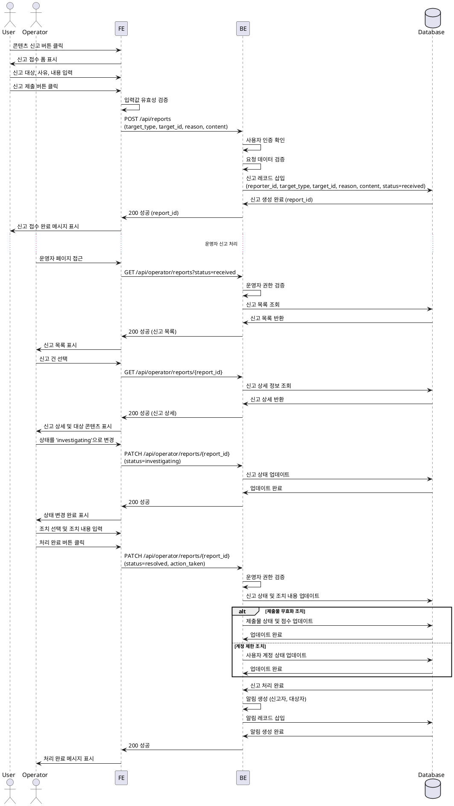
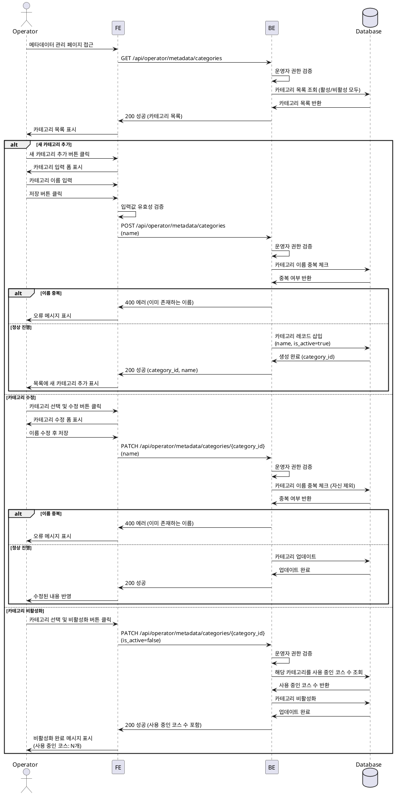

# 운영 (Operator)

## Primary Actor
- 운영자 (Operator 역할을 가진 사용자)

## Precondition
- 운영자가 시스템에 로그인되어 있음
- 운영자 권한(role=operator)이 부여되어 있음
- 운영자가 운영 관리 페이지에 접근 가능

## Trigger
- 운영자가 신고 목록을 조회하거나 신고를 처리하고자 함
- 운영자가 메타데이터(카테고리, 난이도)를 관리하고자 함
- 사용자가 부적절한 콘텐츠를 신고함

## Main Scenario

### 신고 처리 플로우

1. 사용자가 신고 대상(코스/과제/제출물/사용자)을 선택하고 신고 접수
2. 사용자가 신고 사유 및 상세 내용을 입력하여 제출
3. 시스템이 신고 레코드를 생성하고 상태를 'received'로 설정
4. 운영자가 신고 목록 페이지에서 'received' 상태의 신고 건을 조회
5. 운영자가 특정 신고 건을 선택하여 상세 내용을 확인
6. 운영자가 신고 건의 상태를 'investigating'으로 변경
7. 운영자가 신고 대상 콘텐츠를 검토
8. 운영자가 적절한 조치를 선택:
   - 경고 발송
   - 제출물 무효화
   - 계정 제한 (일시정지/영구정지)
   - 신고 기각
9. 시스템이 선택된 조치를 실행
10. 운영자가 조치 내용을 기록하고 신고 상태를 'resolved'로 변경
11. 시스템이 신고자 및 대상자에게 처리 결과 알림 발송

### 메타데이터 관리 플로우

1. 운영자가 메타데이터 관리 페이지에 접근
2. 운영자가 카테고리 또는 난이도 목록을 조회
3. 운영자가 새 항목 추가, 기존 항목 수정, 또는 항목 비활성화를 선택
4. 시스템이 변경 사항의 영향 범위를 확인 (해당 메타데이터를 사용 중인 코스 수)
5. 운영자가 변경 사항을 확인하고 저장
6. 시스템이 메타데이터를 업데이트
7. 시스템이 관련 코스 목록에 변경 사항 반영

## Edge Cases

### 신고 처리 관련

#### 중복 신고
- 동일한 대상에 대해 여러 신고가 접수된 경우, 운영자가 모든 신고를 한꺼번에 확인하고 일괄 처리 가능
- 중복 신고 건수를 표시하여 신고의 심각성 판단 지원

#### 신고 대상 삭제됨
- 신고 처리 중 대상 콘텐츠가 이미 삭제된 경우, "대상이 존재하지 않습니다" 메시지 표시
- 신고를 'resolved' 상태로 변경하고 "대상 삭제됨" 조치 내용 기록

#### 신고자 또는 대상자 계정 삭제
- 신고 처리 시 신고자 또는 대상자 계정이 이미 삭제된 경우에도 신고 이력 유지
- 알림 발송은 건너뛰고 조치 내용만 기록

#### 권한 없는 접근
- 운영자 권한이 없는 사용자가 신고 처리 또는 메타데이터 관리 페이지 접근 시 "권한이 없습니다" 오류 메시지 표시 및 접근 차단

### 메타데이터 관리 관련

#### 사용 중인 메타데이터 삭제 시도
- 현재 코스에서 사용 중인 카테고리 또는 난이도를 삭제하려는 경우, "사용 중인 항목은 삭제할 수 없습니다. 비활성화만 가능합니다" 메시지 표시
- 비활성화 옵션 제공

#### 메타데이터 이름 중복
- 이미 존재하는 이름으로 카테고리 또는 난이도 추가 시도 시, "이미 존재하는 이름입니다" 오류 메시지 표시

#### 난이도 레벨 중복
- 이미 존재하는 레벨 값으로 난이도 추가 시도 시, "이미 존재하는 레벨입니다" 오류 메시지 표시

#### 메타데이터 비활성화
- 비활성화된 메타데이터는 새 코스 생성 시 선택 불가
- 기존 코스는 비활성화된 메타데이터를 계속 표시하되, 수정 시 다른 활성화된 옵션으로 변경 권장

### 네트워크 및 시스템 오류

#### 조치 실행 실패
- 계정 제한 등 조치 실행 중 시스템 오류 발생 시, "조치 실행에 실패했습니다. 다시 시도해주세요" 메시지 표시
- 신고 상태는 'investigating'으로 유지

#### 알림 발송 실패
- 처리 결과 알림 발송 실패 시, 신고 처리는 정상 완료하되 "알림 발송에 실패했습니다" 경고 메시지 표시
- 알림 발송 실패 이력 로깅

#### DB 저장 실패
- 메타데이터 업데이트 중 DB 저장 실패 시, 트랜잭션 롤백 및 "저장에 실패했습니다. 다시 시도해주세요" 메시지 표시

## Business Rules

### 신고 처리 규칙

1. 신고는 모든 로그인한 사용자가 접수할 수 있음
2. 신고 처리는 운영자(role=operator) 권한을 가진 사용자만 가능
3. 신고 상태는 'received' → 'investigating' → 'resolved' 순서로만 변경 가능 (역순 불가)
4. 신고 대상 유형은 'course', 'assignment', 'submission', 'user' 중 하나여야 함
5. 신고 사유와 내용은 필수 입력 항목
6. 신고 처리 시 반드시 조치 내용을 기록해야 함
7. 처리 완료된 신고는 수정 불가 (조회만 가능)
8. 신고 이력은 감사를 위해 영구 보관

### 조치 유형 및 정책

1. **경고 발송**: 대상자에게 경고 메시지 전송, 누적 경고 횟수 기록
2. **제출물 무효화**: 제출물의 점수를 0점으로 변경하고 상태를 'invalidated'로 변경, 해당 제출물은 성적 집계에서 제외
3. **계정 일시정지**: 지정된 기간 동안 로그인 차단, 정지 기간 및 사유 기록
4. **계정 영구정지**: 계정을 영구적으로 비활성화, 모든 콘텐츠 접근 차단
5. **신고 기각**: 신고 내용이 부적절하거나 증거 불충분 시, 조치 없이 'resolved' 처리

### 메타데이터 관리 규칙

1. 카테고리 이름은 중복 불가, 유일해야 함
2. 난이도 이름과 레벨 값은 각각 중복 불가
3. 난이도 레벨은 1부터 시작하는 양의 정수여야 함
4. 메타데이터는 삭제 대신 비활성화(is_active=false)로 관리
5. 비활성화된 메타데이터는 새 코스 생성 시 선택 불가
6. 기존 코스에 사용 중인 메타데이터는 삭제 불가 (비활성화만 가능)
7. 메타데이터 변경 사항은 즉시 모든 화면에 반영
8. 메타데이터 생성/수정/비활성화는 운영자 권한 필수
9. 메타데이터 변경 이력은 감사를 위해 로깅 (향후 확장 고려)

### 알림 규칙

1. 신고 처리 완료 시 신고자와 대상자 모두에게 알림 발송
2. 신고자에게는 처리 결과 요약만 전달 (구체적인 조치 내용은 비공개)
3. 대상자에게는 조치 내용 및 사유를 명확히 전달
4. 알림 발송 실패는 시스템 로그로 기록하되, 신고 처리 자체는 완료 처리
5. 계정 정지 조치 시 추가 안내 메시지 포함 (이의신청 절차 등)

## Sequence Diagram

### 신고 접수 및 처리

### 메타데이터 관리

## 관련 테이블 및 필드

### `reports` 테이블
- `id` (uuid, PK): 신고 ID
- `reporter_id` (uuid, FK → profiles.id): 신고자 ID
- `target_type` (text): 신고 대상 유형 (course, assignment, submission, user)
- `target_id` (uuid): 신고 대상 ID
- `reason` (text): 신고 사유
- `content` (text): 신고 내용
- `status` (text): 처리 상태 (received, investigating, resolved)
- `action_taken` (text): 조치 내용
- `resolved_at` (timestamptz): 처리 완료 일시
- `created_at` (timestamptz): 생성 일시
- `updated_at` (timestamptz): 수정 일시

### `categories` 테이블
- `id` (uuid, PK): 카테고리 ID
- `name` (text, UNIQUE): 카테고리 이름
- `is_active` (boolean): 활성 여부
- `created_at` (timestamptz): 생성 일시
- `updated_at` (timestamptz): 수정 일시

### `difficulty_levels` 테이블
- `id` (uuid, PK): 난이도 ID
- `name` (text, UNIQUE): 난이도 이름
- `level` (integer, UNIQUE): 정렬용 레벨
- `is_active` (boolean): 활성 여부
- `created_at` (timestamptz): 생성 일시
- `updated_at` (timestamptz): 수정 일시

### `profiles` 테이블 (운영자 권한 확인용)
- `id` (uuid, PK): 사용자 ID
- `role` (text): 사용자 역할 (learner, instructor, operator)
- ...기타 필드

### `submissions` 테이블 (제출물 무효화 조치용)
- `id` (uuid, PK): 제출 ID
- `score` (decimal): 점수
- `status` (text): 제출 상태
- ...기타 필드

### 향후 확장 고려 테이블

#### `account_restrictions` (계정 제한 이력)
- `id` (uuid, PK): 제한 ID
- `user_id` (uuid, FK → profiles.id): 대상 사용자 ID
- `restriction_type` (text): 제한 유형 (warning, suspension, permanent_ban)
- `reason` (text): 제한 사유
- `start_date` (timestamptz): 제한 시작일
- `end_date` (timestamptz): 제한 종료일 (일시정지의 경우)
- `created_at` (timestamptz): 생성 일시
- `updated_at` (timestamptz): 수정 일시

#### `notifications` (알림 발송 이력)
- `id` (uuid, PK): 알림 ID
- `user_id` (uuid, FK → profiles.id): 수신자 ID
- `type` (text): 알림 유형 (report_processed, account_warning 등)
- `title` (text): 알림 제목
- `content` (text): 알림 내용
- `is_read` (boolean): 읽음 여부
- `created_at` (timestamptz): 생성 일시
- `updated_at` (timestamptz): 수정 일시
