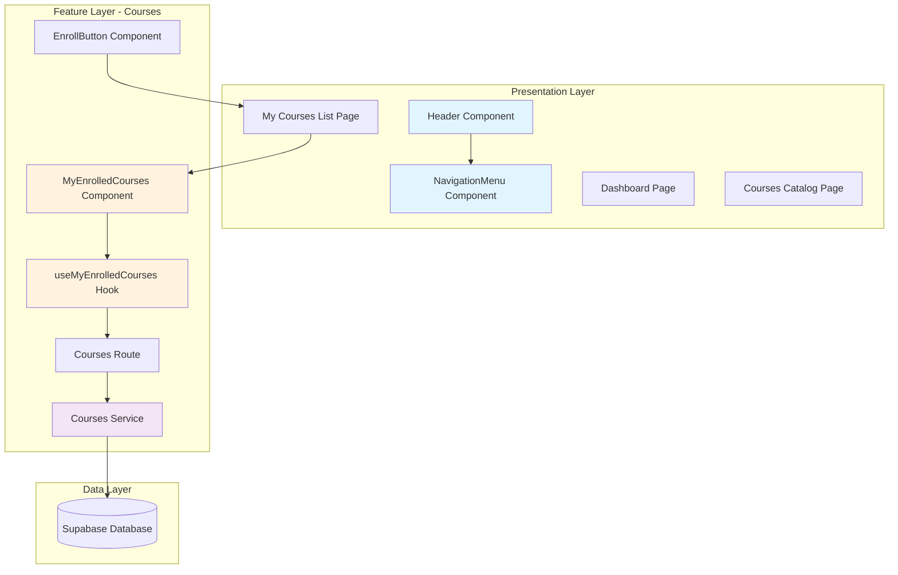
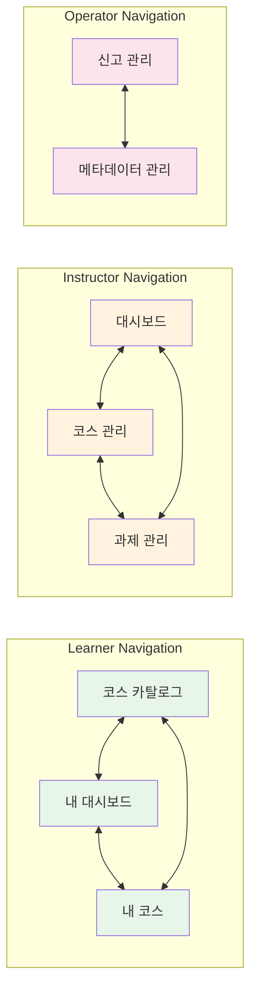
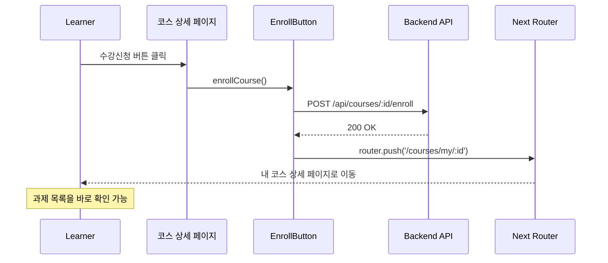

# 사용자 여정 개선 구현 계획 (Phase 1)

> 생성일: 2025-10-09
> 대상: LMS 프로젝트 Phase 1 긴급 개선 사항
> 예상 소요 시간: 7-11시간 (1-2일)

---

## 📋 목차

1. [개요](#개요)
2. [모듈 구조 다이어그램](#모듈-구조-다이어그램)
3. [구현 계획](#구현-계획)
4. [테스트 계획](#테스트-계획)
5. [체크리스트](#체크리스트)

---

## 개요

### Phase 1 개선 목표
사용자가 기본적인 네비게이션을 통해 핵심 기능에 접근할 수 있도록 만들기

### 구현할 모듈 목록

| 모듈명 | 위치 | 설명 | 타입 |
|-------|------|------|------|
| NavigationMenu | `src/components/layout/navigation-menu.tsx` | 역할별 네비게이션 메뉴 컴포넌트 | Shared Component |
| Header (수정) | `src/components/layout/header.tsx` | NavigationMenu 통합 | Shared Component |
| RootPage (수정) | `src/app/page.tsx` | Learner 리다이렉트 경로 변경 | Page |
| LearnerCoursesListPage | `src/app/(learner)/courses/my/page.tsx` | 내 코스 목록 페이지 | Page |
| MyEnrolledCourses | `src/features/courses/components/my-enrolled-courses.tsx` | 수강 중인 코스 목록 컴포넌트 | Feature Component |
| useMyEnrolledCourses | `src/features/courses/hooks/useMyEnrolledCourses.ts` | 수강 중인 코스 조회 훅 | Feature Hook |
| getMyEnrolledCourses | `src/features/courses/backend/service.ts` | 수강 중인 코스 조회 서비스 함수 | Backend Service |
| MyEnrolledCoursesResponse | `src/features/courses/backend/schema.ts` | 응답 스키마 정의 | Backend Schema |
| EnrollButton (수정) | `src/features/courses/components/enroll-button.tsx` | 수강신청 후 리다이렉트 추가 | Feature Component |
| DashboardPage (개선) | `src/app/(protected)/dashboard/page.tsx` | 코스 카탈로그 링크 추가 | Page |

---

## 모듈 구조 다이어그램

### 전체 아키텍처



### 역할별 네비게이션 흐름



### 수강신청 플로우 개선



---

## 구현 계획

### Task 1: 역할별 네비게이션 메뉴 컴포넌트 추가

**소요 시간**: 2-3시간

#### 1.1. NavigationMenu 컴포넌트 생성

**파일**: `src/components/layout/navigation-menu.tsx`

```typescript
"use client";

import Link from 'next/link';
import { usePathname } from 'next/navigation';
import { cn } from '@/lib/utils';
import { Home, BookOpen, LayoutDashboard, FileText, Flag, Database } from 'lucide-react';

type MenuItem = {
  label: string;
  href: string;
  icon: React.ComponentType<{ className?: string }>;
};

const ROLE_MENUS: Record<'learner' | 'instructor' | 'operator', MenuItem[]> = {
  learner: [
    { label: '코스 카탈로그', href: '/courses', icon: BookOpen },
    { label: '내 대시보드', href: '/dashboard', icon: LayoutDashboard },
    { label: '내 코스', href: '/courses/my', icon: Home },
  ],
  instructor: [
    { label: '대시보드', href: '/instructor/dashboard', icon: LayoutDashboard },
    { label: '코스 관리', href: '/instructor/courses', icon: BookOpen },
    { label: '과제 관리', href: '/instructor/assignments', icon: FileText },
  ],
  operator: [
    { label: '신고 관리', href: '/operator/reports', icon: Flag },
    { label: '메타데이터 관리', href: '/operator/metadata', icon: Database },
  ],
};

type NavigationMenuProps = {
  role: 'learner' | 'instructor' | 'operator';
};

export const NavigationMenu = ({ role }: NavigationMenuProps) => {
  const pathname = usePathname();
  const menuItems = ROLE_MENUS[role];

  return (
    <nav className="flex items-center gap-1">
      {menuItems.map((item) => {
        const Icon = item.icon;
        const isActive = pathname === item.href || pathname.startsWith(item.href + '/');

        return (
          <Link
            key={item.href}
            href={item.href}
            className={cn(
              'flex items-center gap-2 px-4 py-2 rounded-md text-sm font-medium transition-colors',
              isActive
                ? 'bg-primary text-primary-foreground'
                : 'text-muted-foreground hover:bg-accent hover:text-accent-foreground'
            )}
          >
            <Icon className="h-4 w-4" />
            <span className="hidden sm:inline">{item.label}</span>
          </Link>
        );
      })}
    </nav>
  );
};
```

**QA Sheet**:
- [ ] Learner 역할로 로그인 시 3개 메뉴 아이템 표시
- [ ] Instructor 역할로 로그인 시 3개 메뉴 아이템 표시
- [ ] Operator 역할로 로그인 시 2개 메뉴 아이템 표시
- [ ] 현재 경로와 일치하는 메뉴 아이템이 강조 표시됨
- [ ] 모바일에서 아이콘만 표시되고 텍스트는 숨겨짐
- [ ] 메뉴 클릭 시 해당 페이지로 이동
- [ ] hover 효과가 정상 작동

---

#### 1.2. Header 컴포넌트 수정

**파일**: `src/components/layout/header.tsx`

**수정 내용**:
```typescript
"use client";

import { useCurrentUser } from '@/features/auth/hooks/useCurrentUser';
import { useProfile } from '@/features/profile/hooks/useProfile';
import { useLogout } from '@/features/auth/hooks/useLogout';
import { Button } from '@/components/ui/button';
import { NavigationMenu } from './navigation-menu'; // 추가
import Link from 'next/link'; // 추가

const ROLE_LABELS = {
  learner: '학습자',
  instructor: '강사',
  operator: '운영자',
} as const;

export const Header = () => {
  const { isAuthenticated, user } = useCurrentUser();
  const { data: profile } = useProfile();
  const { mutate: logout, isPending } = useLogout();

  if (!isAuthenticated || !user) {
    return null;
  }

  const handleLogout = () => {
    logout();
  };

  return (
    <header className="border-b bg-white sticky top-0 z-50"> {/* sticky 추가 */}
      <div className="container mx-auto flex items-center justify-between px-4 py-3">
        <div className="flex items-center gap-6"> {/* gap 조정 */}
          <Link href="/" className="flex items-center gap-2"> {/* Link로 변경 */}
            <h1 className="text-xl font-bold">LMS</h1>
          </Link>

          {/* NavigationMenu 추가 */}
          {profile && (
            <NavigationMenu role={profile.role as 'learner' | 'instructor' | 'operator'} />
          )}
        </div>

        <div className="flex items-center gap-4">
          {profile && (
            <div className="flex items-center gap-2">
              <span className="text-sm text-muted-foreground">
                {ROLE_LABELS[profile.role as keyof typeof ROLE_LABELS]}
              </span>
              <span className="font-medium">{profile.name}</span>
              <span className="text-sm text-muted-foreground">({user.email})</span>
            </div>
          )}

          <Button
            variant="outline"
            size="sm"
            onClick={handleLogout}
            disabled={isPending}
          >
            {isPending ? '로그아웃 중...' : '로그아웃'}
          </Button>
        </div>
      </div>
    </header>
  );
};
```

**QA Sheet**:
- [ ] 로그인한 사용자에게만 헤더가 표시됨
- [ ] 역할에 맞는 네비게이션 메뉴가 표시됨
- [ ] 로고 클릭 시 홈으로 이동
- [ ] 헤더가 상단에 고정됨 (sticky)
- [ ] 사용자 정보가 올바르게 표시됨
- [ ] 로그아웃 버튼이 정상 작동

---

### Task 2: Learner 대시보드 접근 개선

**소요 시간**: 1-2시간

#### 2.1. 로그인 후 리다이렉트 경로 변경

**파일**: `src/app/page.tsx`

**수정 내용**:
```typescript
// 기존 코드 (line 35-36)
if (profileData.role === 'learner') {
  redirect('/courses')  // 변경 전
}

// 수정 후
if (profileData.role === 'learner') {
  redirect('/dashboard')  // 변경 후
}
```

**QA Sheet**:
- [ ] Learner 로그인 시 `/dashboard`로 리다이렉트됨
- [ ] Instructor 로그인 시 `/instructor/dashboard`로 리다이렉트됨
- [ ] Operator 로그인 시 `/operator/reports`로 리다이렉트됨
- [ ] 비로그인 사용자는 랜딩 페이지가 표시됨

---

#### 2.2. 대시보드 페이지에 코스 카탈로그 링크 추가

**파일**: `src/app/(protected)/dashboard/page.tsx`

**수정 내용**:
```typescript
'use client';

import { LearnerDashboardSummary } from '@/features/dashboard/components/learner-dashboard-summary';
import { Button } from '@/components/ui/button'; // 추가
import Link from 'next/link'; // 추가
import { BookOpen } from 'lucide-react'; // 추가

export default function DashboardPage() {
  return (
    <div className="container mx-auto px-4 py-8">
      <div className="flex items-center justify-between mb-8">
        <h1 className="text-3xl font-bold text-gray-900">학습 대시보드</h1>
        <Button asChild variant="outline">
          <Link href="/courses" className="flex items-center gap-2">
            <BookOpen className="h-4 w-4" />
            모든 코스 보기
          </Link>
        </Button>
      </div>
      <LearnerDashboardSummary />
    </div>
  );
}
```

**QA Sheet**:
- [ ] "모든 코스 보기" 버튼이 우측 상단에 표시됨
- [ ] 버튼 클릭 시 `/courses` 페이지로 이동
- [ ] 대시보드 컨텐츠가 정상 표시됨

---

### Task 3: 내 코스 목록 페이지 추가

**소요 시간**: 3-4시간

#### 3.1. Backend: 수강 중인 코스 조회 API 추가

**파일**: `src/features/courses/backend/schema.ts`

**추가 내용**:
```typescript
// 기존 스키마 아래에 추가

// 수강 중인 코스 응답 스키마
export const MyEnrolledCoursesResponseSchema = z.object({
  courses: z.array(
    z.object({
      enrollmentId: z.string(),
      courseId: z.string(),
      courseTitle: z.string(),
      courseDescription: z.string(),
      categoryName: z.string(),
      difficultyName: z.string(),
      instructorName: z.string(),
      enrolledAt: z.string(),
      progress: z.number(), // 진행률 (0-100)
      totalAssignments: z.number(),
      completedAssignments: z.number(),
    })
  ),
});

export type MyEnrolledCoursesResponse = z.infer<typeof MyEnrolledCoursesResponseSchema>;
```

**파일**: `src/features/courses/backend/service.ts`

**추가 내용**:
```typescript
// 기존 함수들 아래에 추가

/**
 * 수강 중인 코스 목록 조회 (Learner용)
 */
export const getMyEnrolledCourses = async (
  supabase: SupabaseClient,
  userId: string
): Promise<Result<MyEnrolledCoursesResponse>> => {
  try {
    // 1. 수강 중인 코스 조회 (enrollments + courses 조인)
    const { data: enrollments, error: enrollError } = await supabase
      .from('enrollments')
      .select(`
        id,
        enrolled_at,
        course_id,
        courses (
          id,
          title,
          description,
          categories (name),
          difficulty_levels (name),
          profiles (name)
        )
      `)
      .eq('learner_id', userId)
      .is('cancelled_at', null)
      .order('enrolled_at', { ascending: false });

    if (enrollError) {
      return failure(500, coursesErrorCodes.databaseError, '수강 중인 코스 조회에 실패했습니다.');
    }

    if (!enrollments || enrollments.length === 0) {
      return success({ courses: [] });
    }

    // 2. 각 코스의 과제 진행률 계산
    const coursesWithProgress = await Promise.all(
      enrollments.map(async (enrollment) => {
        const courseId = enrollment.course_id;

        // 전체 과제 수 조회
        const { data: assignments } = await supabase
          .from('assignments')
          .select('id')
          .eq('course_id', courseId)
          .eq('status', 'published');

        const totalAssignments = assignments?.length || 0;

        // 완료한 과제 수 조회 (제출 + 채점완료)
        const { data: submissions } = await supabase
          .from('submissions')
          .select('assignment_id')
          .eq('learner_id', userId)
          .in('status', ['graded', 'resubmission_required']);

        const completedAssignmentIds = new Set(submissions?.map(s => s.assignment_id) || []);
        const completedAssignments = completedAssignmentIds.size;

        const progress = totalAssignments > 0
          ? Math.round((completedAssignments / totalAssignments) * 100)
          : 0;

        const course = enrollment.courses as any;
        const category = course.categories as any;
        const difficulty = course.difficulty_levels as any;
        const instructor = course.profiles as any;

        return {
          enrollmentId: enrollment.id,
          courseId: course.id,
          courseTitle: course.title,
          courseDescription: course.description,
          categoryName: category.name,
          difficultyName: difficulty.name,
          instructorName: instructor.name,
          enrolledAt: enrollment.enrolled_at,
          progress,
          totalAssignments,
          completedAssignments,
        };
      })
    );

    return success({ courses: coursesWithProgress });
  } catch (error) {
    return failure(500, coursesErrorCodes.unknown, '알 수 없는 오류가 발생했습니다.');
  }
};
```

**파일**: `src/features/courses/backend/route.ts`

**추가 내용**:
```typescript
// registerCoursesRoutes 함수 내부에 추가

// Learner: 수강 중인 코스 목록 조회
app.get('/api/learner/courses/enrolled', async (c) => {
  const logger = getLogger(c);
  logger.info('Get my enrolled courses request received');

  const userId = c.req.header('x-user-id');
  if (!userId) {
    return respond(
      c,
      failure(401, coursesErrorCodes.unauthorized, '인증이 필요합니다.'),
    );
  }

  const supabase = getSupabase(c);
  const result = await getMyEnrolledCourses(supabase, userId);

  return respond(c, result);
});
```

**Unit Test (개념)**:
```typescript
describe('getMyEnrolledCourses', () => {
  it('수강 중인 코스 목록을 반환해야 함', async () => {
    // Given
    const userId = 'user-123';
    const mockEnrollments = [/* mock data */];

    // When
    const result = await getMyEnrolledCourses(mockSupabase, userId);

    // Then
    expect(result.ok).toBe(true);
    expect(result.data.courses).toHaveLength(2);
  });

  it('수강 중인 코스가 없으면 빈 배열을 반환해야 함', async () => {
    // Given
    const userId = 'user-123';

    // When
    const result = await getMyEnrolledCourses(mockSupabase, userId);

    // Then
    expect(result.ok).toBe(true);
    expect(result.data.courses).toHaveLength(0);
  });

  it('진행률이 올바르게 계산되어야 함', async () => {
    // Given: 전체 10개 과제 중 3개 완료
    // When
    const result = await getMyEnrolledCourses(mockSupabase, userId);
    // Then
    expect(result.data.courses[0].progress).toBe(30);
  });
});
```

---

#### 3.2. Frontend: 수강 중인 코스 조회 훅 추가

**파일**: `src/features/courses/lib/dto.ts`

**추가 내용**:
```typescript
// 기존 export 아래에 추가
export { MyEnrolledCoursesResponseSchema, type MyEnrolledCoursesResponse } from '../backend/schema';
```

**파일**: `src/features/courses/hooks/useMyEnrolledCourses.ts`

```typescript
'use client';

import { useQuery } from '@tanstack/react-query';
import { apiClient, extractApiErrorMessage } from '@/lib/remote/api-client';
import {
  MyEnrolledCoursesResponseSchema,
  type MyEnrolledCoursesResponse,
} from '../lib/dto';

const fetchMyEnrolledCourses = async (): Promise<MyEnrolledCoursesResponse> => {
  try {
    const { data } = await apiClient.get('/api/learner/courses/enrolled');
    return MyEnrolledCoursesResponseSchema.parse(data);
  } catch (error) {
    const message = extractApiErrorMessage(
      error,
      '수강 중인 코스 목록을 불러오지 못했습니다.',
    );
    throw new Error(message);
  }
};

export const useMyEnrolledCourses = () =>
  useQuery({
    queryKey: ['myEnrolledCourses'],
    queryFn: fetchMyEnrolledCourses,
    staleTime: 60 * 1000, // 1분
  });
```

---

#### 3.3. Frontend: 내 코스 목록 컴포넌트 추가

**파일**: `src/features/courses/components/my-enrolled-courses.tsx`

```typescript
'use client';

import Link from 'next/link';
import { Button } from '@/components/ui/button';
import {
  Card,
  CardContent,
  CardDescription,
  CardFooter,
  CardHeader,
  CardTitle,
} from '@/components/ui/card';
import { Skeleton } from '@/components/ui/skeleton';
import { Progress } from '@/components/ui/progress';
import { useMyEnrolledCourses } from '../hooks/useMyEnrolledCourses';
import { BookOpen, Clock } from 'lucide-react';
import { format } from 'date-fns';
import { ko } from 'date-fns/locale';

const LoadingState = () => (
  <div className="grid gap-6 md:grid-cols-2 lg:grid-cols-3">
    {[1, 2, 3].map((i) => (
      <Card key={i}>
        <CardHeader>
          <Skeleton className="h-6 w-3/4" />
          <Skeleton className="h-4 w-1/2 mt-2" />
        </CardHeader>
        <CardContent>
          <Skeleton className="h-20 w-full" />
        </CardContent>
      </Card>
    ))}
  </div>
);

const EmptyState = () => (
  <div className="text-center py-12">
    <BookOpen className="h-16 w-16 text-muted-foreground mx-auto mb-4" />
    <h3 className="text-xl font-semibold mb-2">수강 중인 코스가 없습니다</h3>
    <p className="text-muted-foreground mb-4">
      새로운 코스를 탐색하고 수강신청해보세요!
    </p>
    <Button asChild>
      <Link href="/courses">코스 둘러보기</Link>
    </Button>
  </div>
);

const ErrorState = ({ error, refetch }: { error: Error; refetch: () => void }) => (
  <div className="text-center py-12">
    <h3 className="text-xl font-semibold text-destructive mb-2">
      오류가 발생했습니다
    </h3>
    <p className="text-muted-foreground mb-4">{error.message}</p>
    <Button onClick={() => refetch()}>다시 시도</Button>
  </div>
);

export const MyEnrolledCourses = () => {
  const { data, isLoading, isError, error, refetch } = useMyEnrolledCourses();

  if (isLoading) {
    return <LoadingState />;
  }

  if (isError) {
    return <ErrorState error={error as Error} refetch={refetch} />;
  }

  if (!data || data.courses.length === 0) {
    return <EmptyState />;
  }

  return (
    <div className="grid gap-6 md:grid-cols-2 lg:grid-cols-3">
      {data.courses.map((course) => (
        <Card key={course.enrollmentId} className="flex flex-col">
          <CardHeader>
            <CardTitle className="line-clamp-2">{course.courseTitle}</CardTitle>
            <CardDescription>
              {course.categoryName} • {course.difficultyName}
            </CardDescription>
          </CardHeader>
          <CardContent className="flex-1 space-y-4">
            <p className="text-sm text-muted-foreground line-clamp-2">
              {course.courseDescription}
            </p>

            <div className="space-y-2">
              <div className="flex justify-between text-sm">
                <span className="text-muted-foreground">진행률</span>
                <span className="font-medium">{course.progress}%</span>
              </div>
              <Progress value={course.progress} />
              <p className="text-xs text-muted-foreground">
                {course.completedAssignments} / {course.totalAssignments} 과제 완료
              </p>
            </div>

            <div className="flex items-center gap-2 text-xs text-muted-foreground">
              <Clock className="h-3 w-3" />
              <span>
                수강 시작: {format(new Date(course.enrolledAt), 'PPP', { locale: ko })}
              </span>
            </div>
          </CardContent>
          <CardFooter className="flex gap-2">
            <Button asChild className="flex-1">
              <Link href={`/courses/my/${course.courseId}`}>학습하기</Link>
            </Button>
            <Button asChild variant="outline">
              <Link href={`/courses/my/${course.courseId}/grades`}>성적 보기</Link>
            </Button>
          </CardFooter>
        </Card>
      ))}
    </div>
  );
};
```

**QA Sheet**:
- [ ] 수강 중인 코스 목록이 카드 형태로 표시됨
- [ ] 각 카드에 코스 제목, 설명, 카테고리, 난이도가 표시됨
- [ ] 진행률이 Progress 바로 표시됨
- [ ] "학습하기" 버튼 클릭 시 `/courses/my/:id` 페이지로 이동
- [ ] "성적 보기" 버튼 클릭 시 `/courses/my/:id/grades` 페이지로 이동
- [ ] 로딩 상태가 Skeleton으로 표시됨
- [ ] 에러 상태에서 "다시 시도" 버튼이 작동함
- [ ] 수강 중인 코스가 없을 때 EmptyState가 표시됨
- [ ] EmptyState에서 "코스 둘러보기" 버튼이 작동함

---

#### 3.4. Page: 내 코스 목록 페이지 추가

**파일**: `src/app/(learner)/courses/my/page.tsx`

```typescript
'use client';

import { MyEnrolledCourses } from '@/features/courses/components/my-enrolled-courses';

export default function MyCoursesPage() {
  return (
    <div className="container mx-auto px-4 py-8">
      <div className="mb-8">
        <h1 className="text-4xl font-bold mb-2">내 코스</h1>
        <p className="text-muted-foreground">
          수강 중인 코스와 학습 진행 상황을 확인하세요.
        </p>
      </div>

      <MyEnrolledCourses />
    </div>
  );
}
```

**QA Sheet**:
- [ ] `/courses/my` 경로로 접근 가능
- [ ] Learner만 접근 가능 (인증 확인)
- [ ] 페이지 제목과 설명이 표시됨
- [ ] MyEnrolledCourses 컴포넌트가 렌더링됨

---

### Task 4: 수강신청 후 이동 경로 개선

**소요 시간**: 1-2시간

#### 4.1. EnrollButton 컴포넌트 수정

**파일**: `src/features/courses/components/enroll-button.tsx`

**수정 내용**:
```typescript
'use client';

import { useRouter } from 'next/navigation'; // 추가
import { Button } from '@/components/ui/button';
import { useEnroll } from '../hooks/useEnroll';
import { useUnenroll } from '../hooks/useUnenroll';
import { useEnrollmentStatus } from '../hooks/useEnrollmentStatus';
import { useToast } from '@/hooks/use-toast'; // 추가

type EnrollButtonProps = {
  courseId: string;
  variant?: 'default' | 'outline';
};

export const EnrollButton = ({ courseId, variant = 'default' }: EnrollButtonProps) => {
  const router = useRouter(); // 추가
  const { toast } = useToast(); // 추가
  const { data: enrollmentStatus, isLoading: isStatusLoading } = useEnrollmentStatus(courseId);
  const { mutate: enroll, isPending: isEnrolling } = useEnroll();
  const { mutate: unenroll, isPending: isUnenrolling } = useUnenroll();

  const isEnrolled = enrollmentStatus?.isEnrolled ?? false;
  const isPending = isEnrolling || isUnenrolling;

  const handleEnroll = () => {
    enroll(courseId, {
      onSuccess: () => {
        toast({
          title: '수강신청 완료',
          description: '과제를 시작해보세요!',
        });
        // 수강신청 후 내 코스 상세 페이지로 이동
        router.push(`/courses/my/${courseId}`);
      },
      onError: (error) => {
        toast({
          variant: 'destructive',
          title: '수강신청 실패',
          description: error.message,
        });
      },
    });
  };

  const handleUnenroll = () => {
    if (!confirm('정말 수강을 취소하시겠습니까?')) {
      return;
    }

    unenroll(courseId, {
      onSuccess: () => {
        toast({
          title: '수강취소 완료',
          description: '수강이 취소되었습니다.',
        });
      },
      onError: (error) => {
        toast({
          variant: 'destructive',
          title: '수강취소 실패',
          description: error.message,
        });
      },
    });
  };

  if (isStatusLoading) {
    return (
      <Button variant={variant} disabled>
        로딩 중...
      </Button>
    );
  }

  if (isEnrolled) {
    return (
      <Button
        variant="outline"
        onClick={handleUnenroll}
        disabled={isPending}
      >
        {isUnenrolling ? '취소 중...' : '수강취소'}
      </Button>
    );
  }

  return (
    <Button
      variant={variant}
      onClick={handleEnroll}
      disabled={isPending}
    >
      {isEnrolling ? '신청 중...' : '수강신청'}
    </Button>
  );
};
```

**QA Sheet**:
- [ ] 수강신청 성공 시 toast 메시지가 표시됨
- [ ] 수강신청 성공 시 `/courses/my/:id` 페이지로 자동 이동
- [ ] 수강신청 실패 시 에러 toast 메시지가 표시됨
- [ ] 수강취소 시 확인 다이얼로그가 표시됨
- [ ] 수강취소 성공 시 toast 메시지가 표시됨
- [ ] 버튼 상태(로딩, 비활성화)가 올바르게 변경됨

---

## 테스트 계획

### E2E 테스트 시나리오

#### Scenario 1: Learner 로그인 후 내 코스 접근
1. Learner로 로그인
2. `/dashboard`로 리다이렉트되는지 확인
3. 헤더에 "코스 카탈로그", "내 대시보드", "내 코스" 메뉴가 표시되는지 확인
4. "내 코스" 메뉴 클릭
5. `/courses/my` 페이지로 이동하는지 확인
6. 수강 중인 코스 목록이 표시되는지 확인

#### Scenario 2: 코스 수강신청 후 과제 시작
1. Learner로 로그인
2. "코스 카탈로그" 메뉴 클릭
3. 코스 카드 클릭하여 상세 페이지 이동
4. "수강신청" 버튼 클릭
5. Toast 메시지 표시 확인
6. `/courses/my/:id` 페이지로 자동 이동하는지 확인
7. 과제 목록이 표시되는지 확인

#### Scenario 3: Instructor 네비게이션
1. Instructor로 로그인
2. `/instructor/dashboard`로 리다이렉트되는지 확인
3. 헤더에 "대시보드", "코스 관리", "과제 관리" 메뉴가 표시되는지 확인
4. 각 메뉴를 클릭하여 페이지 이동 확인

#### Scenario 4: 현재 경로 강조 표시
1. 로그인 후 각 메뉴를 클릭
2. 현재 페이지에 해당하는 메뉴 아이템이 강조 표시되는지 확인

---

## 체크리스트

### 구현 전 준비사항
- [ ] shadcn-ui components 설치 확인
  ```bash
  npx shadcn@latest add progress  # Progress 컴포넌트 추가 필요
  ```
- [ ] lucide-react icons 설치 확인
- [ ] date-fns 설치 확인

### Task 1: 네비게이션 메뉴
- [ ] NavigationMenu 컴포넌트 생성
- [ ] Header 컴포넌트 수정
- [ ] 역할별 메뉴 아이템 표시 확인
- [ ] 현재 경로 강조 표시 확인
- [ ] 반응형 디자인 확인

### Task 2: 대시보드 접근 개선
- [ ] RootPage 리다이렉트 경로 수정
- [ ] DashboardPage에 "모든 코스 보기" 버튼 추가
- [ ] 리다이렉트 동작 확인

### Task 3: 내 코스 목록 페이지
- [ ] Backend: 스키마 정의
- [ ] Backend: Service 함수 구현
- [ ] Backend: Route 등록
- [ ] Frontend: Hook 구현
- [ ] Frontend: 컴포넌트 구현
- [ ] Frontend: Page 생성
- [ ] API 테스트
- [ ] UI 테스트

### Task 4: 수강신청 후 이동
- [ ] EnrollButton 컴포넌트 수정
- [ ] Toast 메시지 추가
- [ ] 자동 리다이렉트 구현
- [ ] 동작 확인

### 최종 통합 테스트
- [ ] 모든 역할의 네비게이션 플로우 테스트
- [ ] 수강신청 플로우 테스트
- [ ] 모바일 반응형 확인
- [ ] 브라우저 호환성 확인

---

## 추가 고려사항

### Shadcn-ui 컴포넌트 설치
구현 전에 다음 컴포넌트가 설치되어 있는지 확인:
```bash
npx shadcn@latest add progress
```

### 기존 코드와의 호환성
- 기존 페이지 및 컴포넌트와 충돌이 없는지 확인
- API 엔드포인트 중복 확인
- 라우팅 경로 중복 확인

### 성능 최적화
- React Query의 staleTime, cacheTime 적절히 설정
- 이미지 lazy loading 고려
- 무한 스크롤 고려 (코스 목록이 많을 경우)

### 접근성 (a11y)
- 키보드 네비게이션 지원
- ARIA 라벨 추가
- 색상 대비 확인

---

**작성자**: Claude (AI Assistant)
**검토 필요**: 구현 전 기술 스택 및 의존성 확인 필요
**다음 단계**: Task 1부터 순차적으로 구현 및 테스트
