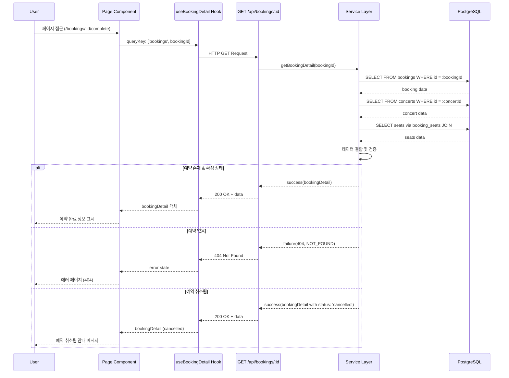

# 예약 완료 페이지 구현 계획

## 문서 정보
- **페이지**: `/bookings/[bookingId]/complete`
- **유스케이스**: 예약 완료 확인, 예약 정보 표시
- **버전**: 1.0
- **작성일**: 2025-10-13

---

## 개요

### 구현 범위
예약 완료 페이지는 사용자가 예약 프로세스를 성공적으로 완료한 후 리디렉트되는 페이지입니다. 예약 상세 정보를 표시하고, 예약 조회 방법을 안내하며, 다음 단계로의 네비게이션을 제공합니다.

### 주요 기능
1. **예약 완료 성공 메시지 표시**
   - 시각적으로 명확한 성공 피드백
   - 예약 완료를 축하하는 메시지

2. **예약 정보 요약**
   - 예약 번호 (bookingId)
   - 콘서트 정보 (제목, 일시, 장소)
   - 예약된 좌석 목록 (구역, 행, 열)
   - 예약자 정보 (이름, 휴대폰번호 마스킹)
   - 예약 일시

3. **예약 조회 안내**
   - 휴대폰번호 + 비밀번호 4자리로 조회 가능함을 안내
   - 예약 조회 페이지 링크 제공

4. **네비게이션**
   - 홈으로 돌아가기 버튼
   - 예약 조회 페이지로 이동 버튼

5. **에러 처리**
   - 존재하지 않는 bookingId 처리
   - 이미 취소된 예약 안내
   - 네트워크 에러 처리

### 기술 스택
- **Frontend**: Next.js 15+ (App Router), React 19+, TypeScript
- **Styling**: TailwindCSS, shadcn-ui
- **State Management**: @tanstack/react-query (서버 상태)
- **Backend**: Hono (API), Supabase (PostgreSQL)
- **Validation**: Zod (요청/응답 검증)
- **Date Handling**: date-fns

---

## Diagram

### 모듈 구조

```mermaid
graph TB
    subgraph "Presentation Layer"
        A[app/bookings/[bookingId]/complete/page.tsx<br/>예약 완료 페이지]
        B[features/bookings/components/BookingCompleteContainer.tsx<br/>컨테이너 컴포넌트]
        C[features/bookings/components/BookingSuccessMessage.tsx<br/>성공 메시지 컴포넌트]
        D[features/bookings/components/BookingInfoCard.tsx<br/>예약 정보 카드]
        E[features/bookings/components/BookingSeatsList.tsx<br/>좌석 목록 컴포넌트]
        F[features/bookings/components/BookingActionsSection.tsx<br/>액션 버튼 섹션]
    end

    subgraph "Data Layer"
        G[features/bookings/hooks/useBookingDetail.ts<br/>예약 상세 조회 훅]
    end

    subgraph "Backend API Layer"
        H[features/bookings/backend/route.ts<br/>Hono 라우터<br/>GET /api/bookings/:id]
        I[features/bookings/backend/service.ts<br/>getBookingDetail 함수]
        J[features/bookings/backend/schema.ts<br/>BookingDetailResponseSchema]
    end

    subgraph "Database"
        K[(bookings 테이블)]
        L[(booking_seats 테이블)]
        M[(concerts 테이블)]
        N[(seats 테이블)]
    end

    A --> B
    B --> C
    B --> D
    B --> E
    B --> F

    B --> G
    G --> H
    H --> I
    H --> J

    I --> K
    I --> L
    I --> M
    I --> N

    L -.FK.-> K
    L -.FK.-> N
    K -.FK.-> M
```

### 데이터 흐름: 예약 완료 페이지 조회



---

## Implementation Plan

### 1. Backend Layer (API)

#### 1.1 Schema 확장 (`src/features/bookings/backend/schema.ts`)

**목적**: 예약 완료 페이지에서 사용할 상세 정보 스키마 정의

**구현 내용**:

```typescript
// 기존 schema.ts에 추가

// ===== 예약 상세 조회 API =====

export const BookingDetailResponseSchema = z.object({
  bookingId: z.string().uuid(),
  status: z.enum(['confirmed', 'cancelled']),
  concertId: z.string().uuid(),
  concertTitle: z.string(),
  concertDescription: z.string().nullable(),
  eventDate: z.string(), // ISO 8601
  location: z.string(),
  thumbnailUrl: z.string().nullable(),
  seats: z.array(
    z.object({
      seatId: z.string().uuid(),
      section: z.enum(['A', 'B', 'C', 'D']),
      row: z.number().int(),
      seatColumn: z.number().int(),
    }),
  ),
  bookingName: z.string(),
  bookingPhone: z.string(), // 조회 시 마스킹 처리 필요
  createdAt: z.string(), // ISO 8601
});

export type BookingDetailResponse = z.infer<typeof BookingDetailResponseSchema>;
```

**Unit Test (`schema.test.ts` 추가):**

```typescript
describe('BookingDetailResponseSchema', () => {
  it('should validate valid booking detail response', () => {
    const validData = {
      bookingId: 'booking-uuid',
      status: 'confirmed',
      concertId: 'concert-uuid',
      concertTitle: 'BTS Concert',
      concertDescription: 'World Tour',
      eventDate: '2025-12-25T19:00:00+09:00',
      location: '서울 올림픽 공원',
      thumbnailUrl: 'https://picsum.photos/400/300',
      seats: [
        {
          seatId: 'seat-1',
          section: 'A',
          row: 1,
          seatColumn: 1,
        },
        {
          seatId: 'seat-2',
          section: 'A',
          row: 1,
          seatColumn: 2,
        },
      ],
      bookingName: '홍길동',
      bookingPhone: '010****5678', // 마스킹됨
      createdAt: '2025-10-13T12:00:00+09:00',
    };

    const result = BookingDetailResponseSchema.safeParse(validData);
    expect(result.success).toBe(true);
  });

  it('should allow cancelled status', () => {
    const validData = {
      // ...
      status: 'cancelled',
    };

    const result = BookingDetailResponseSchema.safeParse(validData);
    expect(result.success).toBe(true);
  });
});
```

---

#### 1.2 Service 함수 추가 (`src/features/bookings/backend/service.ts`)

**목적**: 예약 상세 정보 조회 비즈니스 로직

**구현 내용**:

```typescript
// service.ts에 추가

import { BookingDetailResponseSchema, type BookingDetailResponse } from './schema';

/**
 * 예약 상세 정보 조회
 */
export const getBookingDetail = async (
  client: SupabaseClient,
  bookingId: string,
): Promise<HandlerResult<BookingDetailResponse, BookingServiceError, unknown>> => {
  try {
    // 1. 예약 정보 조회 (콘서트 정보 JOIN)
    const { data: booking, error: bookingError } = await client
      .from('bookings')
      .select(
        `
        id,
        name,
        phone,
        status,
        created_at,
        concerts (
          id,
          title,
          description,
          event_date,
          location,
          thumbnail_url
        )
      `,
      )
      .eq('id', bookingId)
      .single();

    if (bookingError || !booking) {
      return failure(404, bookingErrorCodes.bookingNotFound, 'Booking not found.');
    }

    // 2. 예약된 좌석 정보 조회
    const { data: bookingSeats, error: seatsError } = await client
      .from('booking_seats')
      .select(
        `
        seat_id,
        seats (
          id,
          section,
          row,
          seat_column
        )
      `,
      )
      .eq('booking_id', bookingId);

    if (seatsError || !bookingSeats || bookingSeats.length === 0) {
      return failure(500, bookingErrorCodes.seatsFetchError, 'Failed to fetch booking seats.');
    }

    // 3. 휴대폰번호 마스킹 처리 (010****5678)
    const maskedPhone = booking.phone.replace(/^(\d{3})(\d{4})(\d{4})$/, '$1****$3');

    // 4. 응답 데이터 구성
    const concert = booking.concerts as any;
    const response: BookingDetailResponse = {
      bookingId: booking.id,
      status: booking.status as 'confirmed' | 'cancelled',
      concertId: concert.id,
      concertTitle: concert.title,
      concertDescription: concert.description,
      eventDate: concert.event_date,
      location: concert.location,
      thumbnailUrl: concert.thumbnail_url,
      seats: bookingSeats.map((bs: any) => ({
        seatId: bs.seats.id,
        section: bs.seats.section as 'A' | 'B' | 'C' | 'D',
        row: bs.seats.row,
        seatColumn: bs.seats.seat_column,
      })),
      bookingName: booking.name,
      bookingPhone: maskedPhone,
      createdAt: booking.created_at,
    };

    // 5. 스키마 검증
    const parsed = BookingDetailResponseSchema.safeParse(response);

    if (!parsed.success) {
      return failure(
        500,
        bookingErrorCodes.validationError,
        'Booking detail response validation failed.',
        parsed.error.format(),
      );
    }

    return success(parsed.data);
  } catch (error) {
    if (error instanceof Error) {
      return failure(500, bookingErrorCodes.transactionError, error.message);
    }
    return failure(500, bookingErrorCodes.transactionError, 'Unknown error occurred.');
  }
};
```

**Unit Test (`service.test.ts` 추가):**

```typescript
describe('getBookingDetail', () => {
  it('should return booking detail successfully', async () => {
    const mockClient = {
      from: jest.fn().mockReturnThis(),
      select: jest.fn().mockReturnThis(),
      eq: jest.fn().mockReturnThis(),
      single: jest.fn(),
    };

    // Mock bookings query
    mockClient.single.mockResolvedValueOnce({
      data: {
        id: 'booking-1',
        name: '홍길동',
        phone: '01012345678',
        status: 'confirmed',
        created_at: '2025-10-13T12:00:00+09:00',
        concerts: {
          id: 'concert-1',
          title: 'BTS Concert',
          description: 'World Tour',
          event_date: '2025-12-25T19:00:00+09:00',
          location: '서울 올림픽 공원',
          thumbnail_url: null,
        },
      },
      error: null,
    });

    // Mock booking_seats query
    mockClient.from.mockReturnValueOnce(mockClient); // bookings
    mockClient.from.mockReturnValueOnce({
      ...mockClient,
      eq: jest.fn().mockResolvedValue({
        data: [
          {
            seat_id: 'seat-1',
            seats: {
              id: 'seat-1',
              section: 'A',
              row: 1,
              seat_column: 1,
            },
          },
          {
            seat_id: 'seat-2',
            seats: {
              id: 'seat-2',
              section: 'A',
              row: 1,
              seat_column: 2,
            },
          },
        ],
        error: null,
      }),
    });

    const result = await getBookingDetail(mockClient as any, 'booking-1');

    expect(result.ok).toBe(true);
    if (result.ok) {
      expect(result.data.bookingId).toBe('booking-1');
      expect(result.data.status).toBe('confirmed');
      expect(result.data.bookingPhone).toBe('010****5678'); // 마스킹 확인
      expect(result.data.seats).toHaveLength(2);
    }
  });

  it('should return 404 when booking not found', async () => {
    const mockClient = {
      from: jest.fn().mockReturnThis(),
      select: jest.fn().mockReturnThis(),
      eq: jest.fn().mockReturnThis(),
      single: jest.fn().mockResolvedValue({
        data: null,
        error: { code: 'PGRST116' },
      }),
    };

    const result = await getBookingDetail(mockClient as any, 'invalid-id');

    expect(result.ok).toBe(false);
    if (!result.ok) {
      expect(result.status).toBe(404);
      expect(result.error.code).toBe(bookingErrorCodes.bookingNotFound);
    }
  });
});
```

---

#### 1.3 Error 코드 추가 (`src/features/bookings/backend/error.ts`)

**구현 내용**:

```typescript
// error.ts에 추가

export const bookingErrorCodes = {
  // ... 기존 코드들 ...

  // 예약 조회 관련
  bookingNotFound: 'BOOKING_NOT_FOUND',
} as const;
```

---

#### 1.4 Route Handler 추가 (`src/features/bookings/backend/route.ts`)

**구현 내용**:

```typescript
// route.ts에 추가

import { getBookingDetail } from './service';

export const registerBookingRoutes = (app: Hono<AppEnv>) => {
  // ... 기존 라우트들 ...

  /**
   * GET /api/bookings/:bookingId
   * 예약 상세 정보 조회
   */
  app.get('/api/bookings/:bookingId', async (c) => {
    const bookingId = c.req.param('bookingId');
    const supabase = getSupabase(c);
    const logger = getLogger(c);

    const result = await getBookingDetail(supabase, bookingId);

    if (!result.ok) {
      const errorResult = result as ErrorResult<BookingServiceError, unknown>;

      if (errorResult.error.code === bookingErrorCodes.bookingNotFound) {
        logger.warn('Booking not found', { bookingId });
      } else {
        logger.error('Failed to fetch booking detail', errorResult.error.message);
      }

      return respond(c, result);
    }

    return respond(c, result);
  });
};
```

---

### 2. Frontend Data Layer (React Query)

#### 2.1 예약 상세 조회 훅 (`src/features/bookings/hooks/useBookingDetail.ts`)

**목적**: 예약 완료 페이지에서 예약 정보를 조회하는 React Query 훅

**구현 내용**:

```typescript
'use client';

import { useQuery } from '@tanstack/react-query';
import { apiClient } from '@/lib/remote/api-client';
import type { BookingDetailResponse } from '../backend/schema';

export const useBookingDetail = (bookingId: string) => {
  return useQuery<BookingDetailResponse>({
    queryKey: ['bookings', bookingId],
    queryFn: async () => {
      const response = await apiClient.get(`/api/bookings/${bookingId}`);

      if (!response.ok) {
        throw new Error(response.error?.message || 'Failed to fetch booking detail');
      }

      return response.data;
    },
    enabled: !!bookingId,
    staleTime: 5 * 60 * 1000, // 5분 (예약 정보는 자주 변하지 않음)
    gcTime: 10 * 60 * 1000, // 10분
    retry: 1,
  });
};
```

---

### 3. Frontend Components (Presentation Layer)

#### 3.1 예약 완료 컨테이너 (`src/features/bookings/components/BookingCompleteContainer.tsx`)

**목적**: 예약 완료 페이지의 메인 컨테이너 컴포넌트

**구현 내용**:

```typescript
'use client';

import { useBookingDetail } from '../hooks/useBookingDetail';
import { BookingSuccessMessage } from './BookingSuccessMessage';
import { BookingInfoCard } from './BookingInfoCard';
import { BookingSeatsList } from './BookingSeatsList';
import { BookingActionsSection } from './BookingActionsSection';
import { Loader2, AlertCircle } from 'lucide-react';
import { Alert, AlertDescription, AlertTitle } from '@/components/ui/alert';
import { Button } from '@/components/ui/button';
import Link from 'next/link';

interface BookingCompleteContainerProps {
  bookingId: string;
}

export const BookingCompleteContainer = ({ bookingId }: BookingCompleteContainerProps) => {
  const { data, isLoading, isError, error } = useBookingDetail(bookingId);

  if (isLoading) {
    return (
      <div className="min-h-screen bg-gray-50 flex items-center justify-center">
        <div className="text-center">
          <Loader2 className="w-12 h-12 animate-spin mx-auto mb-4 text-blue-600" />
          <p className="text-gray-600">예약 정보를 불러오는 중...</p>
        </div>
      </div>
    );
  }

  if (isError) {
    return (
      <div className="min-h-screen bg-gray-50 flex items-center justify-center p-4">
        <div className="max-w-md w-full">
          <Alert variant="destructive">
            <AlertCircle className="h-4 w-4" />
            <AlertTitle>예약 정보를 불러올 수 없습니다</AlertTitle>
            <AlertDescription>{error.message}</AlertDescription>
          </Alert>
          <div className="mt-6 flex gap-3">
            <Button asChild variant="outline" className="flex-1">
              <Link href="/">홈으로 가기</Link>
            </Button>
            <Button asChild className="flex-1">
              <Link href="/bookings/search">예약 조회</Link>
            </Button>
          </div>
        </div>
      </div>
    );
  }

  if (!data) {
    return null;
  }

  // 취소된 예약인 경우
  if (data.status === 'cancelled') {
    return (
      <div className="min-h-screen bg-gray-50 flex items-center justify-center p-4">
        <div className="max-w-md w-full">
          <Alert>
            <AlertCircle className="h-4 w-4" />
            <AlertTitle>예약 취소됨</AlertTitle>
            <AlertDescription>
              이 예약은 이미 취소되었습니다.
              <br />
              새로운 예약을 진행하시려면 홈으로 이동해주세요.
            </AlertDescription>
          </Alert>
          <div className="mt-6 flex gap-3">
            <Button asChild variant="outline" className="flex-1">
              <Link href="/">홈으로 가기</Link>
            </Button>
            <Button asChild className="flex-1">
              <Link href="/bookings/search">예약 조회</Link>
            </Button>
          </div>
        </div>
      </div>
    );
  }

  // 확정된 예약인 경우
  return (
    <div className="min-h-screen bg-gray-50">
      <div className="container mx-auto px-4 py-8 max-w-3xl">
        <BookingSuccessMessage />

        <div className="mt-8 space-y-6">
          <BookingInfoCard booking={data} />

          <BookingSeatsList seats={data.seats} />

          <Alert className="bg-blue-50 border-blue-200">
            <AlertCircle className="h-4 w-4 text-blue-600" />
            <AlertTitle className="text-blue-900">예약 조회 안내</AlertTitle>
            <AlertDescription className="text-blue-800">
              예약 내역은 휴대폰번호와 비밀번호 4자리로 조회하실 수 있습니다.
              <br />
              예약 번호를 별도로 기록하실 필요는 없습니다.
            </AlertDescription>
          </Alert>

          <BookingActionsSection bookingId={bookingId} />
        </div>
      </div>
    </div>
  );
};
```

**QA Sheet:**
- [ ] 로딩 상태: 스피너와 안내 메시지 표시
- [ ] 에러 상태: 에러 메시지와 네비게이션 버튼 표시
- [ ] 예약 없음: 404 안내 및 홈/조회 버튼 표시
- [ ] 취소된 예약: 취소 안내 메시지 및 홈/조회 버튼 표시
- [ ] 정상 예약: 성공 메시지, 예약 정보, 좌석 목록, 액션 버튼 표시
- [ ] 반응형: 모바일/태블릿/데스크톱 모두 정상 표시

---

#### 3.2 성공 메시지 컴포넌트 (`src/features/bookings/components/BookingSuccessMessage.tsx`)

**구현 내용**:

```typescript
'use client';

import { CheckCircle } from 'lucide-react';

export const BookingSuccessMessage = () => {
  return (
    <div className="bg-white rounded-lg p-8 shadow-sm text-center">
      <div className="inline-flex items-center justify-center w-16 h-16 rounded-full bg-green-100 mb-4">
        <CheckCircle className="w-10 h-10 text-green-600" />
      </div>
      <h1 className="text-3xl font-bold text-gray-900 mb-2">예약이 완료되었습니다!</h1>
      <p className="text-gray-600">
        예약 정보를 확인해주세요.
        <br />
        휴대폰번호와 비밀번호로 언제든지 조회하실 수 있습니다.
      </p>
    </div>
  );
};
```

**QA Sheet:**
- [ ] 체크마크 아이콘 표시 (초록색)
- [ ] 예약 완료 메시지 표시
- [ ] 중앙 정렬 및 적절한 여백
- [ ] 반응형: 모바일에서 패딩 및 폰트 크기 조정

---

#### 3.3 예약 정보 카드 (`src/features/bookings/components/BookingInfoCard.tsx`)

**구현 내용**:

```typescript
'use client';

import { format } from 'date-fns';
import { ko } from 'date-fns/locale';
import { Calendar, MapPin, User, Phone, Hash, Clock } from 'lucide-react';
import type { BookingDetailResponse } from '../backend/schema';
import Image from 'next/image';

interface BookingInfoCardProps {
  booking: BookingDetailResponse;
}

export const BookingInfoCard = ({ booking }: BookingInfoCardProps) => {
  const eventDate = new Date(booking.eventDate);
  const createdAt = new Date(booking.createdAt);

  return (
    <div className="bg-white rounded-lg shadow-sm overflow-hidden">
      {/* 콘서트 썸네일 */}
      {booking.thumbnailUrl && (
        <div className="relative w-full h-48">
          <Image
            src={booking.thumbnailUrl}
            alt={booking.concertTitle}
            fill
            className="object-cover"
          />
        </div>
      )}

      <div className="p-6 space-y-4">
        {/* 콘서트 정보 */}
        <div>
          <h2 className="text-2xl font-bold text-gray-900 mb-1">{booking.concertTitle}</h2>
          {booking.concertDescription && (
            <p className="text-sm text-gray-600">{booking.concertDescription}</p>
          )}
        </div>

        {/* 예약 정보 그리드 */}
        <div className="grid grid-cols-1 md:grid-cols-2 gap-4 pt-4 border-t">
          <div className="flex items-start gap-3">
            <Calendar className="w-5 h-5 text-gray-400 mt-0.5" />
            <div>
              <p className="text-sm font-medium text-gray-500">공연 일시</p>
              <p className="text-base text-gray-900">
                {format(eventDate, 'yyyy년 MM월 dd일 (EEE) HH:mm', { locale: ko })}
              </p>
            </div>
          </div>

          <div className="flex items-start gap-3">
            <MapPin className="w-5 h-5 text-gray-400 mt-0.5" />
            <div>
              <p className="text-sm font-medium text-gray-500">장소</p>
              <p className="text-base text-gray-900">{booking.location}</p>
            </div>
          </div>

          <div className="flex items-start gap-3">
            <User className="w-5 h-5 text-gray-400 mt-0.5" />
            <div>
              <p className="text-sm font-medium text-gray-500">예약자명</p>
              <p className="text-base text-gray-900">{booking.bookingName}</p>
            </div>
          </div>

          <div className="flex items-start gap-3">
            <Phone className="w-5 h-5 text-gray-400 mt-0.5" />
            <div>
              <p className="text-sm font-medium text-gray-500">휴대폰번호</p>
              <p className="text-base text-gray-900">{booking.bookingPhone}</p>
            </div>
          </div>

          <div className="flex items-start gap-3">
            <Hash className="w-5 h-5 text-gray-400 mt-0.5" />
            <div>
              <p className="text-sm font-medium text-gray-500">예약 번호</p>
              <p className="text-base text-gray-900 font-mono break-all">
                {booking.bookingId}
              </p>
            </div>
          </div>

          <div className="flex items-start gap-3">
            <Clock className="w-5 h-5 text-gray-400 mt-0.5" />
            <div>
              <p className="text-sm font-medium text-gray-500">예약 일시</p>
              <p className="text-base text-gray-900">
                {format(createdAt, 'yyyy년 MM월 dd일 HH:mm', { locale: ko })}
              </p>
            </div>
          </div>
        </div>
      </div>
    </div>
  );
};
```

**QA Sheet:**
- [ ] 콘서트 썸네일: 있으면 표시, 없으면 생략
- [ ] 콘서트 제목 및 설명 표시
- [ ] 예약 정보: 공연 일시, 장소, 예약자명, 휴대폰번호(마스킹), 예약번호, 예약 일시
- [ ] 날짜 형식: date-fns로 한글 포맷
- [ ] 아이콘: lucide-react 사용
- [ ] 반응형: 모바일 1열, 데스크톱 2열 그리드
- [ ] 예약번호: monospace 폰트, break-all로 줄바꿈

---

#### 3.4 좌석 목록 컴포넌트 (`src/features/bookings/components/BookingSeatsList.tsx`)

**구현 내용**:

```typescript
'use client';

import { Armchair } from 'lucide-react';

interface Seat {
  seatId: string;
  section: 'A' | 'B' | 'C' | 'D';
  row: number;
  seatColumn: number;
}

interface BookingSeatsListProps {
  seats: Seat[];
}

export const BookingSeatsList = ({ seats }: BookingSeatsListProps) => {
  return (
    <div className="bg-white rounded-lg p-6 shadow-sm">
      <h3 className="font-bold text-lg mb-4 flex items-center gap-2">
        <Armchair className="w-5 h-5" />
        예약된 좌석 ({seats.length}석)
      </h3>

      <div className="grid grid-cols-2 md:grid-cols-4 gap-3">
        {seats.map((seat) => (
          <div
            key={seat.seatId}
            className="bg-blue-50 border-2 border-blue-200 rounded-lg p-3 text-center"
          >
            <p className="text-sm font-medium text-blue-900">
              {seat.section}구역
            </p>
            <p className="text-lg font-bold text-blue-700">
              {seat.row}행 {seat.seatColumn}열
            </p>
          </div>
        ))}
      </div>
    </div>
  );
};
```

**QA Sheet:**
- [ ] 좌석 개수 표시
- [ ] 좌석 목록: 구역, 행, 열 표시
- [ ] 좌석 카드: 파란색 배경, 테두리
- [ ] 반응형: 모바일 2열, 데스크톱 4열 그리드
- [ ] 의자 아이콘 표시

---

#### 3.5 액션 버튼 섹션 (`src/features/bookings/components/BookingActionsSection.tsx`)

**구현 내용**:

```typescript
'use client';

import { Button } from '@/components/ui/button';
import Link from 'next/link';
import { Home, Search } from 'lucide-react';

interface BookingActionsSectionProps {
  bookingId: string;
}

export const BookingActionsSection = ({ bookingId }: BookingActionsSectionProps) => {
  return (
    <div className="bg-white rounded-lg p-6 shadow-sm">
      <div className="grid grid-cols-1 md:grid-cols-2 gap-4">
        <Button asChild variant="outline" size="lg" className="w-full">
          <Link href="/">
            <Home className="w-4 h-4 mr-2" />
            홈으로 돌아가기
          </Link>
        </Button>

        <Button asChild size="lg" className="w-full">
          <Link href="/bookings/search">
            <Search className="w-4 h-4 mr-2" />
            예약 조회하기
          </Link>
        </Button>
      </div>
    </div>
  );
};
```

**QA Sheet:**
- [ ] 홈으로 돌아가기 버튼: outline 스타일, 아이콘 포함
- [ ] 예약 조회하기 버튼: primary 스타일, 아이콘 포함
- [ ] 반응형: 모바일 세로, 데스크톱 가로 배치
- [ ] 버튼 크기: large
- [ ] 링크 정상 작동

---

#### 3.6 페이지 컴포넌트 (`src/app/bookings/[bookingId]/complete/page.tsx`)

**구현 내용**:

```typescript
import { BookingCompleteContainer } from '@/features/bookings/components/BookingCompleteContainer';

interface PageProps {
  params: Promise<{
    bookingId: string;
  }>;
}

export default async function BookingCompletePage({ params }: PageProps) {
  const { bookingId } = await params;

  return <BookingCompleteContainer bookingId={bookingId} />;
}

// 메타데이터 (SEO)
export async function generateMetadata({ params }: PageProps) {
  return {
    title: '예약 완료',
    description: '콘서트 예약이 완료되었습니다',
  };
}
```

---

### 4. Shared Modules & Utilities

#### 4.1 DTO 재노출 (`src/features/bookings/lib/dto.ts`)

**구현 내용**:

```typescript
// 기존 dto.ts에 추가

export {
  BookingDetailResponseSchema,
  type BookingDetailResponse,
} from '@/features/bookings/backend/schema';
```

---

### 5. Database Migrations

**확인 사항**:
- [x] `bookings` 테이블 존재 (이미 구현됨)
- [x] `booking_seats` 테이블 존재 (이미 구현됨)
- [x] `concerts` 테이블 존재 (이미 구현됨)
- [x] `seats` 테이블 존재 (이미 구현됨)
- [x] JOIN 쿼리를 위한 인덱스 존재

**추가 마이그레이션 불필요**: 기존 테이블로 충분히 구현 가능

---

## 구현 순서

### Phase 1: Backend API (우선순위: 최고)
- [ ] 1.1 Schema 확장 (BookingDetailResponseSchema)
- [ ] 1.2 Error 코드 추가 (bookingNotFound)
- [ ] 1.3 Service 함수 구현 (getBookingDetail)
  - [ ] 예약 정보 조회
  - [ ] 콘서트 정보 JOIN
  - [ ] 좌석 정보 JOIN
  - [ ] 휴대폰번호 마스킹
- [ ] 1.4 Route Handler 추가 (GET /api/bookings/:bookingId)
- [ ] Unit Tests 작성
- [ ] Postman/Thunder Client로 API 테스트

### Phase 2: Frontend Data Layer (우선순위: 높음)
- [ ] 2.1 React Query 훅 구현 (useBookingDetail)
- [ ] DTO 재노출 (dto.ts)

### Phase 3: Frontend Components (우선순위: 중간)
- [ ] 3.1 개별 컴포넌트
  - [ ] BookingSuccessMessage
  - [ ] BookingSeatsList
  - [ ] BookingActionsSection
- [ ] 3.2 복합 컴포넌트
  - [ ] BookingInfoCard
- [ ] 3.3 컨테이너
  - [ ] BookingCompleteContainer
- [ ] 3.4 페이지
  - [ ] app/bookings/[bookingId]/complete/page.tsx
- [ ] QA Sheet 작성 및 수동 테스트

### Phase 4: Testing (우선순위: 높음)
- [ ] Backend Unit Tests
- [ ] Frontend Component Tests
- [ ] E2E Tests (Playwright)
  - [ ] 정상 플로우: 예약 완료 후 페이지 이동
  - [ ] 에러 플로우: 존재하지 않는 bookingId
  - [ ] 에러 플로우: 취소된 예약

### Phase 5: Optimization & Polish (우선순위: 낮음)
- [ ] 성능 최적화 (이미지 로딩, 캐싱)
- [ ] 접근성 개선
- [ ] 반응형 디자인 QA
- [ ] 에러 처리 강화

---

## 주의사항

### 1. 휴대폰번호 마스킹
- **클라이언트 노출**: `010****5678` 형식으로 마스킹
- **서버 저장**: 원본 데이터 그대로 저장
- **마스킹 위치**: Service Layer (getBookingDetail 함수)

### 2. 예약 상태 처리
- **confirmed**: 정상 예약 완료 페이지 표시
- **cancelled**: 취소 안내 메시지 표시

### 3. 에러 처리
- **404 Not Found**: 존재하지 않는 bookingId
- **500 Internal Server Error**: 데이터베이스 에러
- **Network Error**: 네트워크 타임아웃

### 4. SEO 및 메타데이터
- title: "예약 완료"
- description: "콘서트 예약이 완료되었습니다"
- noindex: 개인 정보 페이지이므로 검색 엔진 색인 제외 고려

---

## 테스트 계획

### Backend Unit Tests

**Schema 테스트**:
- [ ] 유효한 BookingDetailResponse 파싱 성공
- [ ] status 필드 enum 검증
- [ ] 필수 필드 누락 시 실패

**Service 테스트**:
- [ ] getBookingDetail: 정상 케이스
- [ ] getBookingDetail: 예약 없음 (404)
- [ ] getBookingDetail: 휴대폰번호 마스킹 확인
- [ ] getBookingDetail: 취소된 예약 조회

### Frontend Component Tests

**BookingCompleteContainer 테스트**:
- [ ] 로딩 상태 표시
- [ ] 에러 상태 표시
- [ ] 정상 예약 정보 표시
- [ ] 취소된 예약 안내 표시

**BookingInfoCard 테스트**:
- [ ] 콘서트 정보 표시
- [ ] 예약 정보 표시
- [ ] 날짜 포맷 정상 동작
- [ ] 썸네일 있을 때/없을 때

**BookingSeatsList 테스트**:
- [ ] 좌석 목록 렌더링
- [ ] 좌석 개수 표시
- [ ] 반응형 그리드

### E2E Tests (Playwright)

**정상 플로우**:
```typescript
test('should display booking complete page after successful booking', async ({ page }) => {
  // 1. 예약 완료 페이지 직접 접근 (bookingId는 시드 데이터)
  await page.goto('/bookings/test-booking-id/complete');

  // 2. 성공 메시지 확인
  await expect(page.locator('h1')).toContainText('예약이 완료되었습니다');

  // 3. 예약 정보 확인
  await expect(page.locator('text=BTS Concert')).toBeVisible();
  await expect(page.locator('text=010****5678')).toBeVisible(); // 마스킹 확인

  // 4. 좌석 목록 확인
  await expect(page.locator('text=A구역')).toBeVisible();
  await expect(page.locator('text=1행 1열')).toBeVisible();

  // 5. 액션 버튼 확인
  await expect(page.locator('a:has-text("홈으로 돌아가기")')).toBeVisible();
  await expect(page.locator('a:has-text("예약 조회하기")')).toBeVisible();
});
```

**에러 플로우**:
```typescript
test('should show 404 error for invalid bookingId', async ({ page }) => {
  await page.goto('/bookings/invalid-booking-id/complete');

  await expect(page.locator('text=예약 정보를 불러올 수 없습니다')).toBeVisible();
  await expect(page.locator('a:has-text("홈으로 가기")')).toBeVisible();
});

test('should show cancelled message for cancelled booking', async ({ page }) => {
  await page.goto('/bookings/cancelled-booking-id/complete');

  await expect(page.locator('text=예약 취소됨')).toBeVisible();
  await expect(page.locator('text=이 예약은 이미 취소되었습니다')).toBeVisible();
});
```

---

## 성능 최적화

### Backend 최적화
- [ ] JOIN 쿼리 최적화 (인덱스 활용)
- [ ] 응답 데이터 크기 최소화

### Frontend 최적화
- [ ] React Query 캐싱 (5분 staleTime)
- [ ] 이미지 최적화 (Next.js Image 컴포넌트)
- [ ] 컴포넌트 메모이제이션 (필요 시)

---

## 보안 고려사항

### 개인정보 보호
- [ ] 휴대폰번호 마스킹 (010****5678)
- [ ] 예약번호 노출 (UUID이므로 추측 불가)
- [ ] 비밀번호는 절대 노출하지 않음

### 접근 제어
- [ ] bookingId를 알면 누구나 조회 가능 (현재 요구사항)
- [ ] 향후: 휴대폰번호 + 비밀번호 인증 추가 고려

---

## Dependencies

### 필수 설치 (이미 있을 것으로 예상)
- `@tanstack/react-query`: 서버 상태 관리
- `date-fns`: 날짜 포맷
- `zod`: 스키마 검증
- `lucide-react`: 아이콘
- `next`: Next.js 15+
- `react`: React 19+

### 추가 설치 필요 (shadcn-ui 컴포넌트)
```bash
npx shadcn@latest add alert
```

---

## 예상 구현 시간

| 작업 | 예상 시간 |
|------|----------|
| Backend API (schema, service, route) | 3시간 |
| Backend Unit Tests | 2시간 |
| Frontend Data Layer (React Query) | 1시간 |
| Frontend Components | 4시간 |
| Frontend Component Tests | 2시간 |
| E2E Tests | 2시간 |
| QA & Bug Fix | 2시간 |
| Optimization & Polish | 1시간 |
| **총계** | **17시간** |

---

## 참고 문서

- [PRD](/Users/choesumin/Desktop/supernext/docs/prd.md)
- [Database 설계](/Users/choesumin/Desktop/supernext/docs/database.md)
- [User Flow](/Users/choesumin/Desktop/supernext/docs/userflow.md)
- [콘서트 예약 페이지 Plan](/Users/choesumin/Desktop/supernext/docs/pages/concert-booking/plan.md)
- [AGENTS.md (코드베이스 구조)](/AGENTS.md)

---

## 완료 후 Next Steps

1. **예약 조회 페이지 구현** (`/bookings/search`)
   - 휴대폰번호 + 비밀번호로 예약 목록 조회
   - 예약 취소 기능

2. **예약 취소 기능 구현**
   - API: DELETE /api/bookings/:bookingId
   - 확인 다이얼로그
   - 취소 후 상태 업데이트

3. **알림 기능 추가** (선택사항)
   - 예약 완료 이메일/SMS
   - 공연 1일 전 리마인더

---

**문서 버전**: 1.0
**최종 수정일**: 2025-10-13
**작성자**: Development Team
**검토 필요**: 휴대폰번호 마스킹 방식, 예약번호 노출 여부
