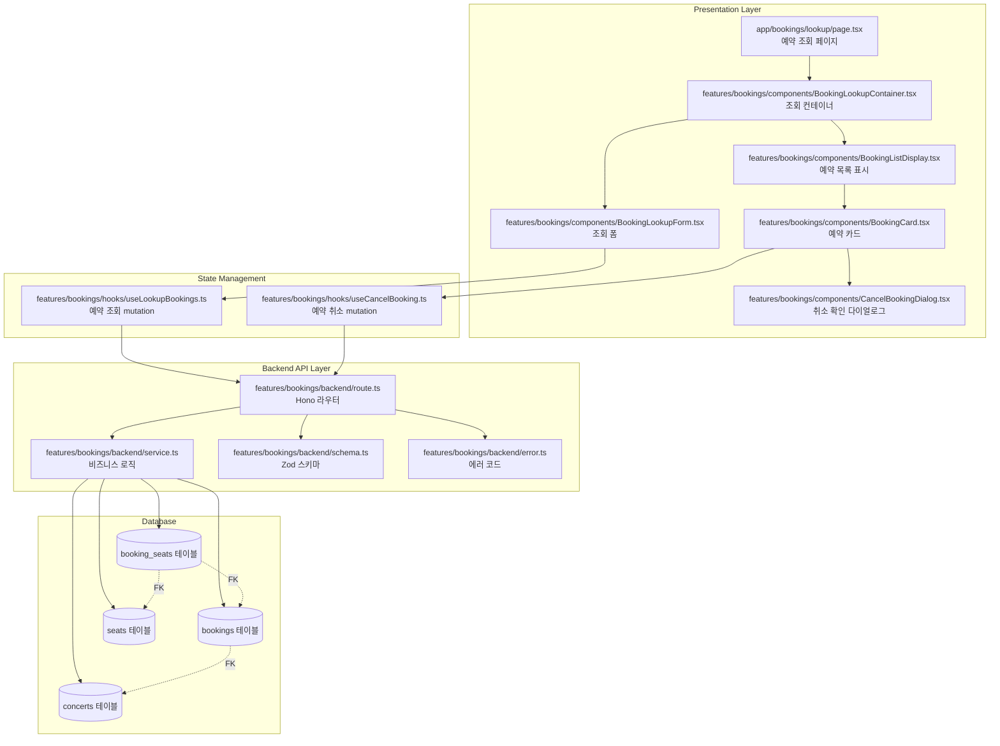
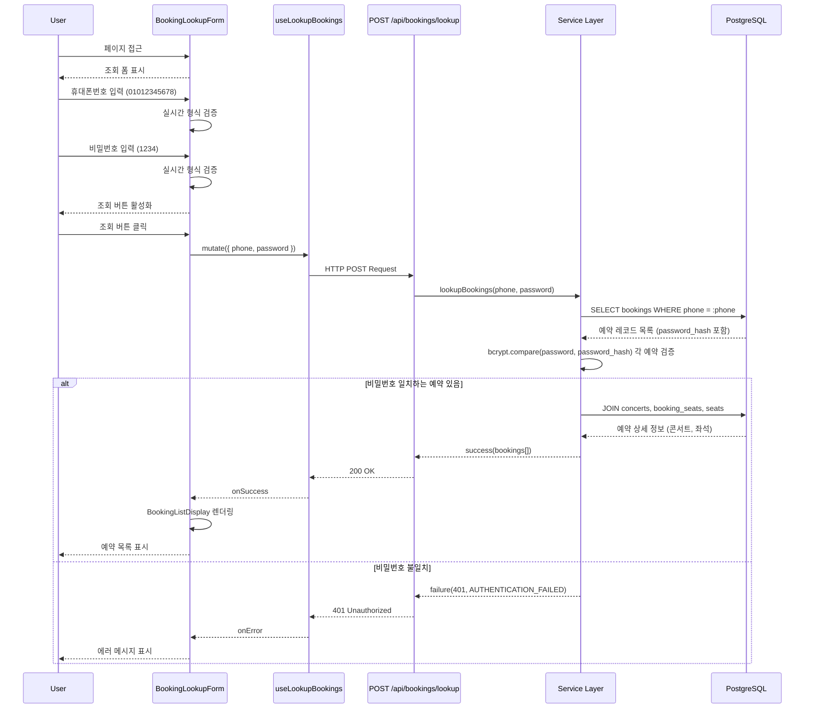
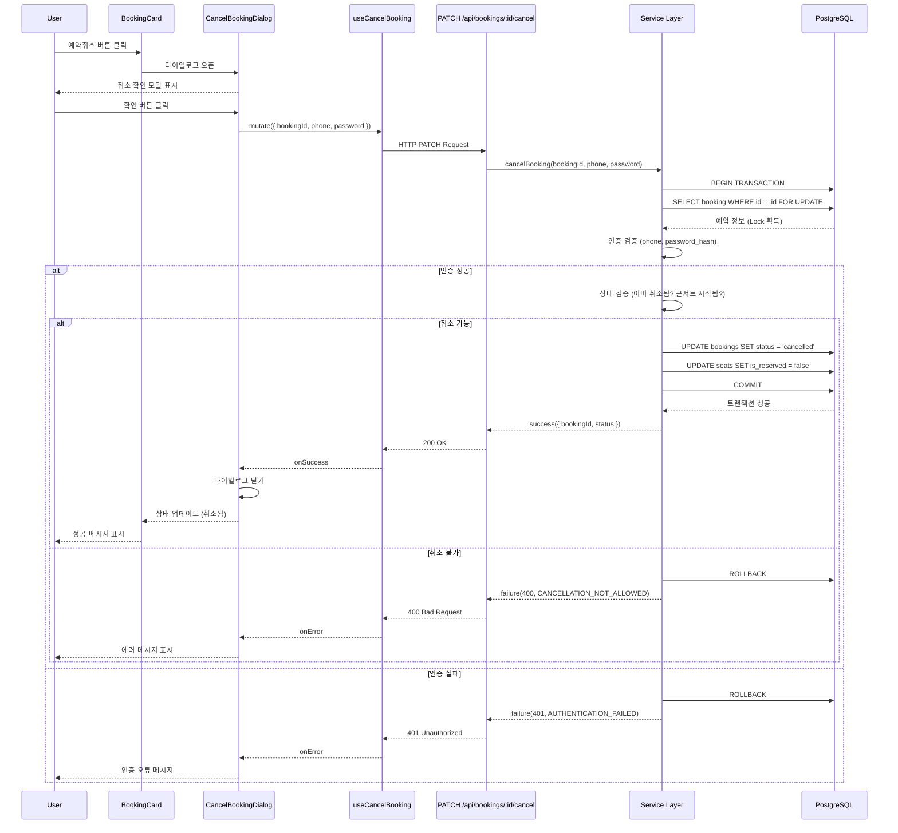

# 예약 조회 페이지 구현 계획

## 문서 정보
- **페이지**: `/bookings/lookup`
- **유스케이스**: UF-006 (예약 조회), UF-008 (예약 취소 - 예약 조회 페이지)
- **버전**: 1.0
- **작성일**: 2025-10-13

---

## 개요

### 구현 범위
예약 조회 페이지는 사용자가 휴대폰번호와 비밀번호(4자리)로 본인의 예약을 조회하고, 필요 시 예약을 취소할 수 있는 기능을 제공합니다. 로그인 없이 비밀번호 기반 인증을 통해 예약 정보를 안전하게 관리합니다.

### 주요 기능
1. **예약 조회 폼**
   - 휴대폰번호 입력 (숫자만, 10-11자리)
   - 비밀번호 4자리 입력 (숫자만)
   - 실시간 입력 검증 (클라이언트 측)
   - 조회 버튼 (모든 필드 유효 시 활성화)

2. **예약 목록 표시**
   - 조회 성공 시 모든 예약 건 표시
   - 각 예약 카드 정보: 콘서트 정보, 좌석 정보, 예약 일시, 상태
   - 예약 상태별 스타일 구분 (확정 / 취소됨)
   - 과거 콘서트와 미래 콘서트 구분

3. **예약 취소 기능**
   - 확정 상태 예약에 한해 취소 버튼 표시
   - 취소 확인 다이얼로그
   - 취소 성공 시 UI 즉시 업데이트
   - 취소된 예약은 취소됨 상태로 표시

4. **에러 처리**
   - 인증 실패 (휴대폰번호 또는 비밀번호 불일치)
   - 예약 없음 (빈 상태 UI)
   - 네트워크 에러, 서버 에러

### 기술 스택
- **Frontend**: Next.js 15+ (App Router), React 19+, TypeScript
- **Styling**: TailwindCSS, shadcn-ui
- **State Management**: @tanstack/react-query (서버 상태)
- **Backend**: Hono (API), Supabase (PostgreSQL)
- **Validation**: Zod (요청/응답 검증)
- **Security**: bcrypt (비밀번호 검증)

---

## Diagram

### 모듈 구조



### 데이터 흐름: 예약 조회



### 데이터 흐름: 예약 취소



---

## Implementation Plan

### 1. Backend Layer (API)

#### 1.1 Schema 정의 (`src/features/bookings/backend/schema.ts` - 추가)

**목적**: 예약 조회 및 취소 API의 요청/응답 스키마 정의

**구현 내용**:

```typescript
// ===== 예약 조회 API =====

export const LookupBookingsRequestSchema = z.object({
  phone: z.string().regex(/^01[0-9]{8,9}$/, 'Invalid phone number format'),
  password: z.string().regex(/^[0-9]{4}$/, 'Password must be exactly 4 digits'),
});

export const BookingSummarySchema = z.object({
  bookingId: z.string().uuid(),
  status: z.enum(['confirmed', 'cancelled']),
  concertId: z.string().uuid(),
  concertTitle: z.string(),
  eventDate: z.string(), // ISO 8601
  location: z.string(),
  thumbnailUrl: z.string().nullable(),
  seats: z.array(
    z.object({
      section: z.enum(['A', 'B', 'C', 'D']),
      row: z.number().int(),
      seatColumn: z.number().int(),
    }),
  ),
  bookingName: z.string(),
  createdAt: z.string(), // ISO 8601
});

export const LookupBookingsResponseSchema = z.object({
  bookings: z.array(BookingSummarySchema),
  total: z.number().int().min(0),
});

export type LookupBookingsRequest = z.infer<typeof LookupBookingsRequestSchema>;
export type BookingSummary = z.infer<typeof BookingSummarySchema>;
export type LookupBookingsResponse = z.infer<typeof LookupBookingsResponseSchema>;

// ===== 예약 취소 API =====

export const CancelBookingRequestSchema = z.object({
  phone: z.string().regex(/^01[0-9]{8,9}$/, 'Invalid phone number format'),
  password: z.string().regex(/^[0-9]{4}$/, 'Password must be exactly 4 digits'),
});

export const CancelBookingResponseSchema = z.object({
  bookingId: z.string().uuid(),
  status: z.literal('cancelled'),
  cancelledAt: z.string(), // ISO 8601
  cancelledSeats: z.array(
    z.object({
      section: z.enum(['A', 'B', 'C', 'D']),
      row: z.number().int(),
      seatColumn: z.number().int(),
    }),
  ),
});

export type CancelBookingRequest = z.infer<typeof CancelBookingRequestSchema>;
export type CancelBookingResponse = z.infer<typeof CancelBookingResponseSchema>;
```

**Unit Test (`schema.test.ts`):**

```typescript
describe('LookupBookingsRequestSchema', () => {
  it('should validate valid lookup request', () => {
    const validData = {
      phone: '01012345678',
      password: '1234',
    };

    const result = LookupBookingsRequestSchema.safeParse(validData);
    expect(result.success).toBe(true);
  });

  it('should reject invalid phone number', () => {
    const invalidData = {
      phone: '010-1234-5678', // 하이픈 포함
      password: '1234',
    };
    const result = LookupBookingsRequestSchema.safeParse(invalidData);
    expect(result.success).toBe(false);
  });

  it('should reject non-numeric password', () => {
    const invalidData = {
      phone: '01012345678',
      password: 'abcd',
    };
    const result = LookupBookingsRequestSchema.safeParse(invalidData);
    expect(result.success).toBe(false);
  });
});

describe('CancelBookingRequestSchema', () => {
  it('should validate valid cancel request', () => {
    const validData = {
      phone: '01012345678',
      password: '1234',
    };

    const result = CancelBookingRequestSchema.safeParse(validData);
    expect(result.success).toBe(true);
  });
});
```

---

#### 1.2 Error 코드 정의 (`src/features/bookings/backend/error.ts` - 추가)

**구현 내용**:

```typescript
export const bookingErrorCodes = {
  // ... 기존 코드 ...

  // 예약 조회 관련
  authenticationFailed: 'AUTHENTICATION_FAILED',
  bookingNotFound: 'BOOKING_NOT_FOUND',

  // 예약 취소 관련
  alreadyCancelled: 'ALREADY_CANCELLED',
  cancellationNotAllowed: 'CANCELLATION_NOT_ALLOWED',
} as const;
```

---

#### 1.3 Service 레이어 (`src/features/bookings/backend/service.ts` - 추가)

**목적**: 예약 조회 및 취소 비즈니스 로직

**구현 내용**:

```typescript
import bcrypt from 'bcryptjs';

/**
 * 예약 조회 (휴대폰번호 + 비밀번호 인증)
 */
export const lookupBookings = async (
  client: SupabaseClient,
  phone: string,
  password: string,
): Promise<HandlerResult<LookupBookingsResponse, BookingServiceError, unknown>> => {
  try {
    // 1. 휴대폰번호로 예약 조회
    const { data: bookings, error: bookingsError } = await client
      .from('bookings')
      .select(
        `
        id,
        name,
        phone,
        password_hash,
        status,
        created_at,
        concerts (
          id,
          title,
          event_date,
          location,
          thumbnail_url
        )
      `,
      )
      .eq('phone', phone)
      .order('created_at', { ascending: false });

    if (bookingsError) {
      return failure(500, bookingErrorCodes.transactionError, bookingsError.message);
    }

    if (!bookings || bookings.length === 0) {
      // 예약 없음 (빈 배열 반환, 에러 아님)
      return success({ bookings: [], total: 0 });
    }

    // 2. 비밀번호 검증 (각 예약에 대해)
    const validatedBookings = [];

    for (const booking of bookings) {
      const isPasswordMatch = await bcrypt.compare(password, booking.password_hash);

      if (isPasswordMatch) {
        validatedBookings.push(booking);
      }
    }

    // 3. 비밀번호 일치하는 예약이 없으면 인증 실패
    if (validatedBookings.length === 0) {
      return failure(401, bookingErrorCodes.authenticationFailed, 'Invalid credentials');
    }

    // 4. 각 예약의 좌석 정보 조회
    const bookingSummaries: BookingSummary[] = [];

    for (const booking of validatedBookings) {
      const { data: bookingSeats, error: seatsError } = await client
        .from('booking_seats')
        .select(
          `
          seats (
            section,
            row,
            seat_column
          )
        `,
        )
        .eq('booking_id', booking.id);

      if (seatsError) {
        continue; // 좌석 조회 실패 시 해당 예약 스킵
      }

      const concert = booking.concerts as any;

      bookingSummaries.push({
        bookingId: booking.id,
        status: booking.status as 'confirmed' | 'cancelled',
        concertId: concert.id,
        concertTitle: concert.title,
        eventDate: concert.event_date,
        location: concert.location,
        thumbnailUrl: concert.thumbnail_url,
        seats: (bookingSeats || []).map((bs: any) => ({
          section: bs.seats.section as 'A' | 'B' | 'C' | 'D',
          row: bs.seats.row,
          seatColumn: bs.seats.seat_column,
        })),
        bookingName: booking.name,
        createdAt: booking.created_at,
      });
    }

    // 5. 응답 데이터 구성
    const response: LookupBookingsResponse = {
      bookings: bookingSummaries,
      total: bookingSummaries.length,
    };

    // 6. 스키마 검증
    const parsed = LookupBookingsResponseSchema.safeParse(response);

    if (!parsed.success) {
      return failure(
        500,
        bookingErrorCodes.validationError,
        'Lookup response validation failed.',
        parsed.error.format(),
      );
    }

    return success(parsed.data);
  } catch (error) {
    if (error instanceof Error) {
      return failure(500, bookingErrorCodes.transactionError, error.message);
    }
    return failure(500, bookingErrorCodes.transactionError, 'Unknown error occurred.');
  }
};

/**
 * 예약 취소 (예약 조회 페이지에서)
 */
export const cancelBooking = async (
  client: SupabaseClient,
  bookingId: string,
  phone: string,
  password: string,
): Promise<HandlerResult<CancelBookingResponse, BookingServiceError, unknown>> => {
  try {
    // 1. 예약 정보 조회 (콘서트 정보 포함)
    const { data: booking, error: bookingError } = await client
      .from('bookings')
      .select(
        `
        id,
        phone,
        password_hash,
        status,
        updated_at,
        concerts (
          id,
          event_date
        )
      `,
      )
      .eq('id', bookingId)
      .single();

    if (bookingError || !booking) {
      return failure(404, bookingErrorCodes.bookingNotFound, 'Booking not found.');
    }

    // 2. 인증 검증 (휴대폰번호 + 비밀번호)
    if (booking.phone !== phone) {
      return failure(401, bookingErrorCodes.authenticationFailed, 'Invalid credentials');
    }

    const isPasswordMatch = await bcrypt.compare(password, booking.password_hash);

    if (!isPasswordMatch) {
      return failure(401, bookingErrorCodes.authenticationFailed, 'Invalid credentials');
    }

    // 3. 상태 검증
    if (booking.status === 'cancelled') {
      return failure(400, bookingErrorCodes.alreadyCancelled, 'Booking is already cancelled.');
    }

    // 4. 콘서트 시작 여부 확인 (취소 가능 기간)
    const concert = booking.concerts as any;
    const now = new Date();
    const eventDate = new Date(concert.event_date);

    if (now >= eventDate) {
      return failure(
        400,
        bookingErrorCodes.cancellationNotAllowed,
        'Cannot cancel booking after concert has started.',
      );
    }

    // 5. 예약된 좌석 ID 조회
    const { data: bookingSeats, error: seatsError } = await client
      .from('booking_seats')
      .select('seat_id, seats(section, row, seat_column)')
      .eq('booking_id', bookingId);

    if (seatsError || !bookingSeats || bookingSeats.length === 0) {
      return failure(500, bookingErrorCodes.transactionError, 'Failed to fetch booking seats.');
    }

    const seatIds = bookingSeats.map((bs: any) => bs.seat_id);

    // 6. 트랜잭션 처리 (예약 상태 업데이트 + 좌석 복원)
    const { error: updateBookingError } = await client
      .from('bookings')
      .update({ status: 'cancelled', updated_at: new Date().toISOString() })
      .eq('id', bookingId);

    if (updateBookingError) {
      return failure(500, bookingErrorCodes.transactionError, updateBookingError.message);
    }

    const { error: updateSeatsError } = await client
      .from('seats')
      .update({ is_reserved: false, updated_at: new Date().toISOString() })
      .in('id', seatIds);

    if (updateSeatsError) {
      // 롤백이 필요하지만 Supabase는 자동 롤백하지 않음
      // 실제 프로덕션에서는 PostgreSQL RPC 함수 사용 권장
      return failure(500, bookingErrorCodes.transactionError, updateSeatsError.message);
    }

    // 7. 응답 데이터 구성
    const response: CancelBookingResponse = {
      bookingId,
      status: 'cancelled',
      cancelledAt: new Date().toISOString(),
      cancelledSeats: bookingSeats.map((bs: any) => ({
        section: bs.seats.section as 'A' | 'B' | 'C' | 'D',
        row: bs.seats.row,
        seatColumn: bs.seats.seat_column,
      })),
    };

    // 8. 스키마 검증
    const parsed = CancelBookingResponseSchema.safeParse(response);

    if (!parsed.success) {
      return failure(
        500,
        bookingErrorCodes.validationError,
        'Cancel response validation failed.',
        parsed.error.format(),
      );
    }

    return success(parsed.data);
  } catch (error) {
    if (error instanceof Error) {
      return failure(500, bookingErrorCodes.transactionError, error.message);
    }
    return failure(500, bookingErrorCodes.transactionError, 'Unknown error occurred.');
  }
};
```

**Unit Test (`service.test.ts`):**

```typescript
describe('lookupBookings', () => {
  it('should return bookings for valid credentials', async () => {
    // Mock implementation...
  });

  it('should return 401 for invalid password', async () => {
    // Mock implementation...
  });

  it('should return empty array for no bookings', async () => {
    // Mock implementation...
  });
});

describe('cancelBooking', () => {
  it('should cancel booking successfully', async () => {
    // Mock implementation...
  });

  it('should return 401 for invalid credentials', async () => {
    // Mock implementation...
  });

  it('should return 400 for already cancelled booking', async () => {
    // Mock implementation...
  });

  it('should return 400 for past concert', async () => {
    // Mock implementation...
  });
});
```

---

#### 1.4 Route 레이어 (`src/features/bookings/backend/route.ts` - 추가)

**구현 내용**:

```typescript
/**
 * POST /api/bookings/lookup
 * 예약 조회 (휴대폰번호 + 비밀번호)
 */
app.post('/api/bookings/lookup', async (c) => {
  const supabase = getSupabase(c);
  const logger = getLogger(c);

  // 1. Request Body 파싱
  const body = await c.req.json();

  // 2. 스키마 검증
  const parsed = LookupBookingsRequestSchema.safeParse(body);

  if (!parsed.success) {
    return respond(
      c,
      failure(
        400,
        bookingErrorCodes.validationError,
        'Invalid lookup request data.',
        parsed.error.format(),
      ),
    );
  }

  const { phone, password } = parsed.data;

  // 3. 서비스 호출
  const result = await lookupBookings(supabase, phone, password);

  // 4. 에러 핸들링
  if (!result.ok) {
    const errorResult = result as ErrorResult<BookingServiceError, unknown>;

    if (errorResult.error.code === bookingErrorCodes.authenticationFailed) {
      logger.warn('Booking lookup authentication failed', { phone });
    } else {
      logger.error('Failed to lookup bookings', errorResult.error.message);
    }

    return respond(c, result);
  }

  // 5. 성공 응답
  logger.info('Bookings lookup successful', {
    phone,
    total: result.data.total,
  });

  return respond(c, result);
});

/**
 * PATCH /api/bookings/:bookingId/cancel
 * 예약 취소 (예약 조회 페이지에서)
 */
app.patch('/api/bookings/:bookingId/cancel', async (c) => {
  const bookingId = c.req.param('bookingId');
  const supabase = getSupabase(c);
  const logger = getLogger(c);

  // 1. Request Body 파싱
  const body = await c.req.json();

  // 2. 스키마 검증
  const parsed = CancelBookingRequestSchema.safeParse(body);

  if (!parsed.success) {
    return respond(
      c,
      failure(
        400,
        bookingErrorCodes.validationError,
        'Invalid cancel request data.',
        parsed.error.format(),
      ),
    );
  }

  const { phone, password } = parsed.data;

  // 3. 서비스 호출
  const result = await cancelBooking(supabase, bookingId, phone, password);

  // 4. 에러 핸들링
  if (!result.ok) {
    const errorResult = result as ErrorResult<BookingServiceError, unknown>;

    if (errorResult.error.code === bookingErrorCodes.authenticationFailed) {
      logger.warn('Booking cancellation authentication failed', { bookingId, phone });
    } else if (errorResult.error.code === bookingErrorCodes.alreadyCancelled) {
      logger.warn('Booking is already cancelled', { bookingId });
    } else if (errorResult.error.code === bookingErrorCodes.cancellationNotAllowed) {
      logger.warn('Booking cancellation not allowed', { bookingId });
    } else {
      logger.error('Failed to cancel booking', errorResult.error.message);
    }

    return respond(c, result);
  }

  // 5. 성공 응답
  logger.info('Booking cancelled successfully', {
    bookingId,
  });

  return respond(c, result);
});
```

---

### 2. Frontend Data Layer (React Query)

#### 2.1 예약 조회 Mutation (`src/features/bookings/hooks/useLookupBookings.ts`)

**구현 내용**:

```typescript
'use client';

import { useMutation } from '@tanstack/react-query';
import { apiClient } from '@/lib/remote/api-client';
import type { LookupBookingsRequest, LookupBookingsResponse } from '../backend/schema';

export const useLookupBookings = () => {
  return useMutation<LookupBookingsResponse, Error, LookupBookingsRequest>({
    mutationFn: async (data: LookupBookingsRequest) => {
      const response = await apiClient.post('/api/bookings/lookup', data);

      if (!response.ok) {
        const errorMessage = response.error?.message || 'Failed to lookup bookings';
        const error = new Error(errorMessage);
        // @ts-ignore
        error.code = response.error?.code;
        throw error;
      }

      return response.data;
    },
  });
};
```

---

#### 2.2 예약 취소 Mutation (`src/features/bookings/hooks/useCancelBooking.ts`)

**구현 내용**:

```typescript
'use client';

import { useMutation } from '@tanstack/react-query';
import { apiClient } from '@/lib/remote/api-client';
import type { CancelBookingRequest, CancelBookingResponse } from '../backend/schema';

interface CancelBookingParams extends CancelBookingRequest {
  bookingId: string;
}

export const useCancelBooking = () => {
  return useMutation<CancelBookingResponse, Error, CancelBookingParams>({
    mutationFn: async ({ bookingId, phone, password }: CancelBookingParams) => {
      const response = await apiClient.patch(`/api/bookings/${bookingId}/cancel`, {
        phone,
        password,
      });

      if (!response.ok) {
        const errorMessage = response.error?.message || 'Failed to cancel booking';
        const error = new Error(errorMessage);
        // @ts-ignore
        error.code = response.error?.code;
        throw error;
      }

      return response.data;
    },
  });
};
```

---

### 3. Frontend Components (Presentation Layer)

#### 3.1 예약 조회 컨테이너 (`src/features/bookings/components/BookingLookupContainer.tsx`)

**목적**: 조회 폼과 결과 목록 상태 관리

**구현 내용**:

```typescript
'use client';

import { useState } from 'react';
import { BookingLookupForm } from './BookingLookupForm';
import { BookingListDisplay } from './BookingListDisplay';
import type { LookupBookingsResponse } from '../backend/schema';

export const BookingLookupContainer = () => {
  const [lookupResult, setLookupResult] = useState<LookupBookingsResponse | null>(null);
  const [credentials, setCredentials] = useState<{ phone: string; password: string } | null>(null);

  const handleLookupSuccess = (result: LookupBookingsResponse, phone: string, password: string) => {
    setLookupResult(result);
    setCredentials({ phone, password }); // 예약 취소 시 재사용
  };

  const handleBackToForm = () => {
    setLookupResult(null);
    setCredentials(null);
  };

  return (
    <div className="container mx-auto px-4 py-8 max-w-4xl">
      <header className="mb-8">
        <h1 className="text-3xl font-bold">예약 조회</h1>
        <p className="text-gray-600 mt-2">휴대폰번호와 비밀번호를 입력하여 예약을 조회하세요.</p>
      </header>

      {!lookupResult && <BookingLookupForm onSuccess={handleLookupSuccess} />}

      {lookupResult && credentials && (
        <BookingListDisplay
          bookings={lookupResult.bookings}
          phone={credentials.phone}
          password={credentials.password}
          onBack={handleBackToForm}
        />
      )}
    </div>
  );
};
```

**QA Sheet:**
- [ ] 페이지 초기 렌더링: 조회 폼 표시
- [ ] 조회 성공: 예약 목록 표시
- [ ] 뒤로가기: 조회 폼으로 복귀
- [ ] credentials 상태 유지 (예약 취소 시 사용)

---

#### 3.2 예약 조회 폼 (`src/features/bookings/components/BookingLookupForm.tsx`)

**구현 내용**:

```typescript
'use client';

import { useForm } from 'react-hook-form';
import { zodResolver } from '@hookform/resolvers/zod';
import { z } from 'zod';
import { Loader2 } from 'lucide-react';
import { Button } from '@/components/ui/button';
import { Input } from '@/components/ui/input';
import { Label } from '@/components/ui/label';
import { useLookupBookings } from '../hooks/useLookupBookings';
import type { LookupBookingsResponse } from '../backend/schema';

const formSchema = z.object({
  phone: z.string().regex(/^01[0-9]{8,9}$/, '올바른 휴대폰번호 형식이 아닙니다 (예: 01012345678)'),
  password: z.string().regex(/^[0-9]{4}$/, '비밀번호는 숫자 4자리여야 합니다'),
});

type FormData = z.infer<typeof formSchema>;

interface BookingLookupFormProps {
  onSuccess: (result: LookupBookingsResponse, phone: string, password: string) => void;
}

export const BookingLookupForm = ({ onSuccess }: BookingLookupFormProps) => {
  const { mutate, isPending } = useLookupBookings();

  const {
    register,
    handleSubmit,
    formState: { errors, isValid },
  } = useForm<FormData>({
    resolver: zodResolver(formSchema),
    mode: 'onChange',
  });

  const onSubmit = (data: FormData) => {
    mutate(data, {
      onSuccess: (result) => {
        onSuccess(result, data.phone, data.password);
      },
      onError: (error: any) => {
        if (error.code === 'AUTHENTICATION_FAILED') {
          alert('휴대폰번호 또는 비밀번호가 일치하지 않습니다.');
        } else {
          alert('예약 조회 중 오류가 발생했습니다. 다시 시도해주세요.');
        }
      },
    });
  };

  return (
    <div className="bg-white rounded-lg p-8 shadow-sm max-w-md mx-auto">
      <form onSubmit={handleSubmit(onSubmit)} className="space-y-6">
        <div>
          <Label htmlFor="phone">휴대폰번호 * (숫자만)</Label>
          <Input
            id="phone"
            {...register('phone')}
            placeholder="01012345678"
            className="mt-1"
            disabled={isPending}
            maxLength={11}
          />
          {errors.phone && <p className="text-sm text-red-600 mt-1">{errors.phone.message}</p>}
          <p className="text-xs text-gray-500 mt-1">예: 01012345678 (하이픈 없이)</p>
        </div>

        <div>
          <Label htmlFor="password">비밀번호 4자리 *</Label>
          <Input
            id="password"
            type="password"
            {...register('password')}
            placeholder="1234"
            className="mt-1"
            disabled={isPending}
            maxLength={4}
          />
          {errors.password && <p className="text-sm text-red-600 mt-1">{errors.password.message}</p>}
        </div>

        <Button type="submit" className="w-full" size="lg" disabled={!isValid || isPending}>
          {isPending && <Loader2 className="w-4 h-4 mr-2 animate-spin" />}
          {isPending ? '조회 중...' : '예약 조회'}
        </Button>
      </form>
    </div>
  );
};
```

**QA Sheet:**
- [ ] 휴대폰번호: 숫자만 입력, 10-11자리 실시간 검증
- [ ] 비밀번호: 숫자 4자리 실시간 검증
- [ ] 조회 버튼: 모든 필드 유효 시 활성화
- [ ] 조회 중: 로딩 인디케이터 표시 및 버튼 비활성화
- [ ] 인증 실패: 알림 메시지 표시
- [ ] 기타 에러: 일반 에러 메시지 표시

---

#### 3.3 예약 목록 표시 (`src/features/bookings/components/BookingListDisplay.tsx`)

**구현 내용**:

```typescript
'use client';

import { ArrowLeft } from 'lucide-react';
import { Button } from '@/components/ui/button';
import { BookingCard } from './BookingCard';
import type { BookingSummary } from '../backend/schema';

interface BookingListDisplayProps {
  bookings: BookingSummary[];
  phone: string;
  password: string;
  onBack: () => void;
}

export const BookingListDisplay = ({ bookings, phone, password, onBack }: BookingListDisplayProps) => {
  if (bookings.length === 0) {
    return (
      <div className="text-center py-12">
        <h2 className="text-2xl font-bold text-gray-800 mb-2">예약 내역이 없습니다</h2>
        <p className="text-gray-600 mb-6">입력하신 정보로 예약된 내역을 찾을 수 없습니다.</p>
        <Button onClick={onBack} variant="outline">
          다시 조회하기
        </Button>
      </div>
    );
  }

  return (
    <div>
      <button
        onClick={onBack}
        className="flex items-center gap-2 text-gray-600 hover:text-gray-900 mb-6"
      >
        <ArrowLeft className="w-5 h-5" />
        <span>다시 조회하기</span>
      </button>

      <div className="mb-6">
        <h2 className="text-2xl font-bold">예약 내역</h2>
        <p className="text-gray-600 mt-1">총 {bookings.length}건의 예약</p>
      </div>

      <div className="space-y-4">
        {bookings.map((booking) => (
          <BookingCard key={booking.bookingId} booking={booking} phone={phone} password={password} />
        ))}
      </div>
    </div>
  );
};
```

**QA Sheet:**
- [ ] 예약 0건: 빈 상태 UI 표시, 다시 조회 버튼
- [ ] 예약 1건 이상: 예약 카드 목록 표시
- [ ] 뒤로가기 버튼: 조회 폼으로 복귀
- [ ] 총 예약 건수 표시

---

#### 3.4 예약 카드 (`src/features/bookings/components/BookingCard.tsx`)

**구현 내용**:

```typescript
'use client';

import { useState } from 'react';
import { format, isPast } from 'date-fns';
import { ko } from 'date-fns/locale';
import { MapPin, Calendar, User } from 'lucide-react';
import { Button } from '@/components/ui/button';
import { CancelBookingDialog } from './CancelBookingDialog';
import type { BookingSummary } from '../backend/schema';
import { cn } from '@/lib/utils';

interface BookingCardProps {
  booking: BookingSummary;
  phone: string;
  password: string;
}

export const BookingCard = ({ booking, phone, password }: BookingCardProps) => {
  const [isCancelDialogOpen, setIsCancelDialogOpen] = useState(false);
  const [localStatus, setLocalStatus] = useState(booking.status);

  const isPastConcert = isPast(new Date(booking.eventDate));
  const isCancelled = localStatus === 'cancelled';
  const canCancel = !isCancelled && !isPastConcert;

  const handleCancelSuccess = () => {
    setLocalStatus('cancelled');
    setIsCancelDialogOpen(false);
  };

  return (
    <div
      className={cn(
        'bg-white rounded-lg p-6 shadow-sm border-2 transition-all',
        isCancelled && 'bg-gray-50 border-gray-300 opacity-75',
        !isCancelled && 'border-gray-200 hover:shadow-md',
      )}
    >
      <div className="flex items-start justify-between mb-4">
        <div>
          <h3 className="text-xl font-bold text-gray-900">{booking.concertTitle}</h3>
          <div className="flex items-center gap-4 text-sm text-gray-600 mt-2">
            <span
              className={cn(
                'px-2 py-1 rounded text-xs font-medium',
                isCancelled && 'bg-gray-200 text-gray-700',
                !isCancelled && 'bg-green-100 text-green-700',
              )}
            >
              {isCancelled ? '취소됨' : '확정'}
            </span>
            {isPastConcert && !isCancelled && (
              <span className="px-2 py-1 rounded text-xs font-medium bg-blue-100 text-blue-700">
                완료됨
              </span>
            )}
          </div>
        </div>

        {canCancel && (
          <Button onClick={() => setIsCancelDialogOpen(true)} variant="destructive" size="sm">
            예약취소
          </Button>
        )}
      </div>

      <div className="space-y-2 text-sm text-gray-700">
        <div className="flex items-center gap-2">
          <Calendar className="w-4 h-4 text-gray-400" />
          <span>{format(new Date(booking.eventDate), 'yyyy년 M월 d일 (E) HH:mm', { locale: ko })}</span>
        </div>

        <div className="flex items-center gap-2">
          <MapPin className="w-4 h-4 text-gray-400" />
          <span>{booking.location}</span>
        </div>

        <div className="flex items-center gap-2">
          <User className="w-4 h-4 text-gray-400" />
          <span>{booking.bookingName}</span>
        </div>
      </div>

      <div className="mt-4 pt-4 border-t border-gray-200">
        <h4 className="text-sm font-semibold text-gray-700 mb-2">예약된 좌석 ({booking.seats.length}석)</h4>
        <div className="flex flex-wrap gap-2">
          {booking.seats.map((seat, index) => (
            <span
              key={index}
              className={cn(
                'px-3 py-1 rounded text-sm',
                isCancelled && 'bg-gray-200 text-gray-600',
                !isCancelled && 'bg-blue-100 text-blue-700',
              )}
            >
              {seat.section}구역 {seat.row}행 {seat.seatColumn}열
            </span>
          ))}
        </div>
      </div>

      <div className="mt-4 text-xs text-gray-500">
        예약일시: {format(new Date(booking.createdAt), 'yyyy-MM-dd HH:mm')}
      </div>

      {canCancel && (
        <CancelBookingDialog
          isOpen={isCancelDialogOpen}
          onClose={() => setIsCancelDialogOpen(false)}
          bookingId={booking.bookingId}
          concertTitle={booking.concertTitle}
          seats={booking.seats}
          phone={phone}
          password={password}
          onSuccess={handleCancelSuccess}
        />
      )}
    </div>
  );
};
```

**QA Sheet:**
- [ ] 예약 상태 표시: 확정 (초록), 취소됨 (회색)
- [ ] 과거 콘서트: 완료됨 배지 표시
- [ ] 예약취소 버튼: 확정 상태이고 미래 콘서트인 경우만 표시
- [ ] 예약 취소 성공: 로컬 상태 즉시 업데이트 (취소됨)
- [ ] 콘서트 정보: 제목, 일시, 장소, 예약자명
- [ ] 좌석 정보: 구역, 행, 열 배지 형태로 표시
- [ ] 예약 일시 표시

---

#### 3.5 취소 확인 다이얼로그 (`src/features/bookings/components/CancelBookingDialog.tsx`)

**구현 내용**:

```typescript
'use client';

import {
  AlertDialog,
  AlertDialogAction,
  AlertDialogCancel,
  AlertDialogContent,
  AlertDialogDescription,
  AlertDialogFooter,
  AlertDialogHeader,
  AlertDialogTitle,
} from '@/components/ui/alert-dialog';
import { Loader2 } from 'lucide-react';
import { useCancelBooking } from '../hooks/useCancelBooking';

interface Seat {
  section: 'A' | 'B' | 'C' | 'D';
  row: number;
  seatColumn: number;
}

interface CancelBookingDialogProps {
  isOpen: boolean;
  onClose: () => void;
  bookingId: string;
  concertTitle: string;
  seats: Seat[];
  phone: string;
  password: string;
  onSuccess: () => void;
}

export const CancelBookingDialog = ({
  isOpen,
  onClose,
  bookingId,
  concertTitle,
  seats,
  phone,
  password,
  onSuccess,
}: CancelBookingDialogProps) => {
  const { mutate, isPending } = useCancelBooking();

  const handleConfirm = () => {
    mutate(
      { bookingId, phone, password },
      {
        onSuccess: () => {
          onSuccess();
          alert('예약이 취소되었습니다.');
        },
        onError: (error: any) => {
          if (error.code === 'AUTHENTICATION_FAILED') {
            alert('인증 오류가 발생했습니다. 다시 로그인해주세요.');
          } else if (error.code === 'ALREADY_CANCELLED') {
            alert('이미 취소된 예약입니다.');
            onSuccess(); // UI 업데이트
          } else if (error.code === 'CANCELLATION_NOT_ALLOWED') {
            alert('공연 시작 후에는 취소할 수 없습니다.');
          } else {
            alert('예약 취소 중 오류가 발생했습니다. 다시 시도해주세요.');
          }
        },
      },
    );
  };

  return (
    <AlertDialog open={isOpen} onOpenChange={onClose}>
      <AlertDialogContent>
        <AlertDialogHeader>
          <AlertDialogTitle>예약을 취소하시겠습니까?</AlertDialogTitle>
          <AlertDialogDescription>
            <div className="space-y-2">
              <p className="text-red-600 font-medium">이 작업은 되돌릴 수 없습니다.</p>

              <div className="mt-4 bg-gray-50 rounded p-3 text-sm text-gray-800">
                <p className="font-semibold mb-1">{concertTitle}</p>
                <p className="text-gray-600">
                  좌석: {seats.map((s) => `${s.section}${s.row}-${s.seatColumn}`).join(', ')}
                </p>
              </div>
            </div>
          </AlertDialogDescription>
        </AlertDialogHeader>
        <AlertDialogFooter>
          <AlertDialogCancel disabled={isPending}>취소</AlertDialogCancel>
          <AlertDialogAction
            onClick={(e) => {
              e.preventDefault();
              handleConfirm();
            }}
            disabled={isPending}
            className="bg-red-600 hover:bg-red-700"
          >
            {isPending && <Loader2 className="w-4 h-4 mr-2 animate-spin" />}
            {isPending ? '처리 중...' : '예약 취소'}
          </AlertDialogAction>
        </AlertDialogFooter>
      </AlertDialogContent>
    </AlertDialog>
  );
};
```

**QA Sheet:**
- [ ] 다이얼로그 오픈/닫기 정상 동작
- [ ] 콘서트 정보 및 좌석 정보 표시
- [ ] 확인 버튼 클릭: 예약 취소 요청
- [ ] 취소 중: 로딩 인디케이터 표시 및 버튼 비활성화
- [ ] 취소 성공: 성공 메시지 표시 후 다이얼로그 닫기
- [ ] 취소 실패: 에러별 적절한 메시지 표시
- [ ] Esc 키로 다이얼로그 닫기

---

#### 3.6 페이지 컴포넌트 (`src/app/bookings/lookup/page.tsx`)

**구현 내용**:

```typescript
import { BookingLookupContainer } from '@/features/bookings/components/BookingLookupContainer';

export default function BookingLookupPage() {
  return <BookingLookupContainer />;
}

// 메타데이터 (SEO)
export const metadata = {
  title: '예약 조회',
  description: '휴대폰번호와 비밀번호로 예약을 조회하고 관리하세요',
};
```

---

### 4. Shared Modules & Utilities

#### 4.1 DTO 재노출 (`src/features/bookings/lib/dto.ts` - 추가)

**구현 내용**:

```typescript
export {
  LookupBookingsRequestSchema,
  LookupBookingsResponseSchema,
  BookingSummarySchema,
  CancelBookingRequestSchema,
  CancelBookingResponseSchema,
  type LookupBookingsRequest,
  type LookupBookingsResponse,
  type BookingSummary,
  type CancelBookingRequest,
  type CancelBookingResponse,
} from '@/features/bookings/backend/schema';
```

---

## 구현 순서

### Phase 1: Backend API (우선순위: 최고)
- [ ] 1.1 Schema 정의 (schema.ts에 추가)
  - [ ] LookupBookingsRequestSchema
  - [ ] LookupBookingsResponseSchema
  - [ ] BookingSummarySchema
  - [ ] CancelBookingRequestSchema
  - [ ] CancelBookingResponseSchema
- [ ] 1.2 Error 코드 추가 (error.ts)
  - [ ] authenticationFailed
  - [ ] alreadyCancelled
  - [ ] cancellationNotAllowed
- [ ] 1.3 Service 함수 구현 (service.ts에 추가)
  - [ ] lookupBookings (휴대폰번호 + 비밀번호 인증)
  - [ ] cancelBooking (예약 취소)
- [ ] 1.4 Route Handler 구현 (route.ts에 추가)
  - [ ] POST /api/bookings/lookup
  - [ ] PATCH /api/bookings/:bookingId/cancel
- [ ] Unit Tests 작성

### Phase 2: Frontend Data Layer (우선순위: 높음)
- [ ] 2.1 React Query 훅 구현
  - [ ] useLookupBookings
  - [ ] useCancelBooking

### Phase 3: Frontend Components (우선순위: 중간)
- [ ] 3.1 컨테이너
  - [ ] BookingLookupContainer
- [ ] 3.2 주요 컴포넌트
  - [ ] BookingLookupForm
  - [ ] BookingListDisplay
  - [ ] BookingCard
  - [ ] CancelBookingDialog
- [ ] 3.3 페이지
  - [ ] app/bookings/lookup/page.tsx
- [ ] QA Sheet 작성 및 수동 테스트

### Phase 4: Testing (우선순위: 높음)
- [ ] Backend Unit Tests (service, schema)
- [ ] Frontend Component Tests
- [ ] E2E Tests (Playwright)
  - [ ] 정상 플로우: 조회 → 목록 표시 → 취소 → 목록 업데이트
  - [ ] 에러 플로우: 인증 실패, 예약 없음, 이미 취소됨

### Phase 5: Optimization & Polish (우선순위: 낮음)
- [ ] 성능 최적화
- [ ] 접근성 개선
- [ ] 반응형 디자인 QA
- [ ] 에러 처리 강화

---

## 주의사항

### 1. 보안 고려사항

**비밀번호 보호**:
- bcrypt를 사용한 비밀번호 해시 비교
- 평문 비밀번호 절대 로깅 금지
- HTTPS 통신 필수

**개인정보 보호**:
- 휴대폰번호는 조회 결과에서 마스킹 처리하지 않음 (사용자 본인이 입력한 정보)
- 비밀번호 일치 여부만 확인, 구체적인 실패 이유 숨김

**브루트 포스 공격 방지**:
- Rate Limiting (IP당 분당 5회)
- 실패 시 일정 시간 대기

### 2. 트랜잭션 처리 (예약 취소)

**문제**: Supabase는 명시적 트랜잭션을 지원하지 않으므로, 예약 상태 업데이트와 좌석 복원이 원자적으로 수행되지 않을 수 있습니다.

**해결 방법**: PostgreSQL RPC 함수 사용 (권장)

```sql
CREATE OR REPLACE FUNCTION cancel_booking_with_lock(
  p_booking_id UUID,
  p_phone VARCHAR,
  p_password_hash VARCHAR
) RETURNS JSON AS $$
DECLARE
  v_booking_record RECORD;
  v_seat_ids UUID[];
BEGIN
  -- 1. 예약 정보 조회 및 Lock
  SELECT * INTO v_booking_record
  FROM bookings
  WHERE id = p_booking_id
  FOR UPDATE;

  IF NOT FOUND THEN
    RAISE EXCEPTION 'Booking not found';
  END IF;

  -- 2. 인증 검증
  IF v_booking_record.phone != p_phone THEN
    RAISE EXCEPTION 'Authentication failed';
  END IF;

  -- 3. 상태 검증
  IF v_booking_record.status = 'cancelled' THEN
    RAISE EXCEPTION 'Booking is already cancelled';
  END IF;

  -- 4. 좌석 ID 조회
  SELECT array_agg(seat_id) INTO v_seat_ids
  FROM booking_seats
  WHERE booking_id = p_booking_id;

  -- 5. 예약 상태 업데이트
  UPDATE bookings
  SET status = 'cancelled', updated_at = NOW()
  WHERE id = p_booking_id;

  -- 6. 좌석 복원
  UPDATE seats
  SET is_reserved = false, updated_at = NOW()
  WHERE id = ANY(v_seat_ids);

  -- 7. 성공 응답
  RETURN json_build_object(
    'booking_id', p_booking_id,
    'status', 'cancelled',
    'cancelled_at', NOW()
  );
EXCEPTION
  WHEN OTHERS THEN
    RAISE;
END;
$$ LANGUAGE plpgsql;
```

### 3. 에러 처리

- 401 Unauthorized: 휴대폰번호 또는 비밀번호 불일치
- 400 Bad Request: 이미 취소됨, 취소 불가 (콘서트 시작 후)
- 404 Not Found: 예약 없음
- 500 Internal Server Error: 서버 에러

---

## 테스트 계획

### Backend Unit Tests

**Schema 테스트**:
- [ ] 유효한 조회 요청 데이터 파싱 성공
- [ ] 잘못된 휴대폰번호 형식 거부
- [ ] 비밀번호 4자리 숫자 검증

**Service 테스트**:
- [ ] lookupBookings: 정상 케이스 (예약 2건)
- [ ] lookupBookings: 비밀번호 불일치 (401)
- [ ] lookupBookings: 예약 없음 (빈 배열)
- [ ] cancelBooking: 정상 케이스
- [ ] cancelBooking: 인증 실패 (401)
- [ ] cancelBooking: 이미 취소됨 (400)
- [ ] cancelBooking: 과거 콘서트 (400)

### Frontend Component Tests

**BookingLookupForm 테스트**:
- [ ] 입력 검증 (실시간)
- [ ] 조회 버튼 활성화/비활성화
- [ ] 조회 성공 시 onSuccess 콜백 호출
- [ ] 조회 실패 시 에러 메시지 표시

**BookingCard 테스트**:
- [ ] 예약 정보 정상 렌더링
- [ ] 예약취소 버튼: 확정 상태이고 미래 콘서트인 경우만 표시
- [ ] 취소 성공 시 로컬 상태 업데이트
- [ ] 취소됨 상태: 회색 스타일 적용

**CancelBookingDialog 테스트**:
- [ ] 다이얼로그 오픈/닫기
- [ ] 확인 버튼 클릭 시 취소 요청
- [ ] 취소 성공 시 onSuccess 콜백 호출
- [ ] 취소 실패 시 에러별 메시지 표시

### E2E Tests (Playwright)

**정상 플로우**:
```typescript
test('should lookup and cancel booking successfully', async ({ page }) => {
  await page.goto('/bookings/lookup');

  // 조회
  await page.fill('input[name="phone"]', '01012345678');
  await page.fill('input[name="password"]', '1234');
  await page.locator('button:has-text("예약 조회")').click();

  // 예약 목록 확인
  await expect(page.locator('text=총 2건의 예약')).toBeVisible();

  // 첫 번째 예약 취소
  await page.locator('button:has-text("예약취소")').first().click();

  // 다이얼로그 확인
  await page.locator('button:has-text("예약 취소")').click();

  // 성공 메시지 확인
  await expect(page.locator('text=예약이 취소되었습니다')).toBeVisible();

  // 상태 변경 확인
  await expect(page.locator('text=취소됨')).toBeVisible();
});
```

**에러 플로우**:
```typescript
test('should show error for invalid credentials', async ({ page }) => {
  await page.goto('/bookings/lookup');

  await page.fill('input[name="phone"]', '01099999999');
  await page.fill('input[name="password"]', '9999');
  await page.locator('button:has-text("예약 조회")').click();

  await expect(page.locator('text=휴대폰번호 또는 비밀번호가 일치하지 않습니다')).toBeVisible();
});
```

---

## Dependencies

### 필수 설치 (이미 있을 것으로 예상)
- `@tanstack/react-query`: 서버 상태 관리
- `react-hook-form`: 폼 관리
- `@hookform/resolvers`: Zod 통합
- `zod`: 스키마 검증
- `bcryptjs`: 비밀번호 해싱
- `date-fns`: 날짜 처리
- `lucide-react`: 아이콘

### 추가 설치 필요 (shadcn-ui 컴포넌트)
```bash
npx shadcn@latest add button
npx shadcn@latest add input
npx shadcn@latest add label
npx shadcn@latest add alert-dialog
```

---

## 예상 구현 시간

| 작업 | 예상 시간 |
|------|----------|
| Backend API (schema, service, route) | 5시간 |
| Backend Unit Tests | 2시간 |
| Frontend Hooks (React Query) | 2시간 |
| Frontend Components | 6시간 |
| Frontend Component Tests | 3시간 |
| E2E Tests | 3시간 |
| QA & Bug Fix | 3시간 |
| Optimization & Polish | 2시간 |
| **총계** | **26시간** |

---

## 참고 문서

- [UF-006: 예약 조회](/Users/choesumin/Desktop/supernext/docs/usecases/uf-006-booking-search.md)
- [UF-008: 예약 취소 (예약 조회 페이지)](/Users/choesumin/Desktop/supernext/docs/usecases/008-booking-cancel-from-search.md)
- [Database 설계](/Users/choesumin/Desktop/supernext/docs/database.md)
- [PRD](/Users/choesumin/Desktop/supernext/docs/prd.md)
- [기존 plan 문서 - 콘서트 예약](/Users/choesumin/Desktop/supernext/docs/pages/concert-booking/plan.md)

---

## 완료 후 Next Steps

1. **예약 조회 페이지 네비게이션 추가** (헤더에 링크)
2. **예약 완료 페이지에서 예약 조회 페이지로 이동 링크 추가**
3. **관리자 대시보드** (선택사항)
4. **예약 확인 이메일/SMS 발송** (향후 확장)

---

**문서 버전**: 1.0
**최종 수정일**: 2025-10-13
**작성자**: Development Team
**검토 필요**: 트랜잭션 처리 방식 확정 (PostgreSQL RPC 함수 vs. 낙관적 락)
