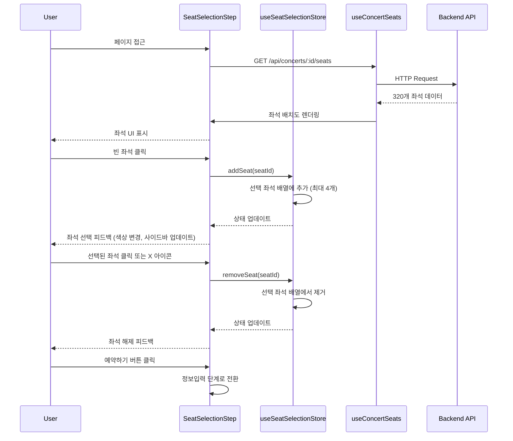
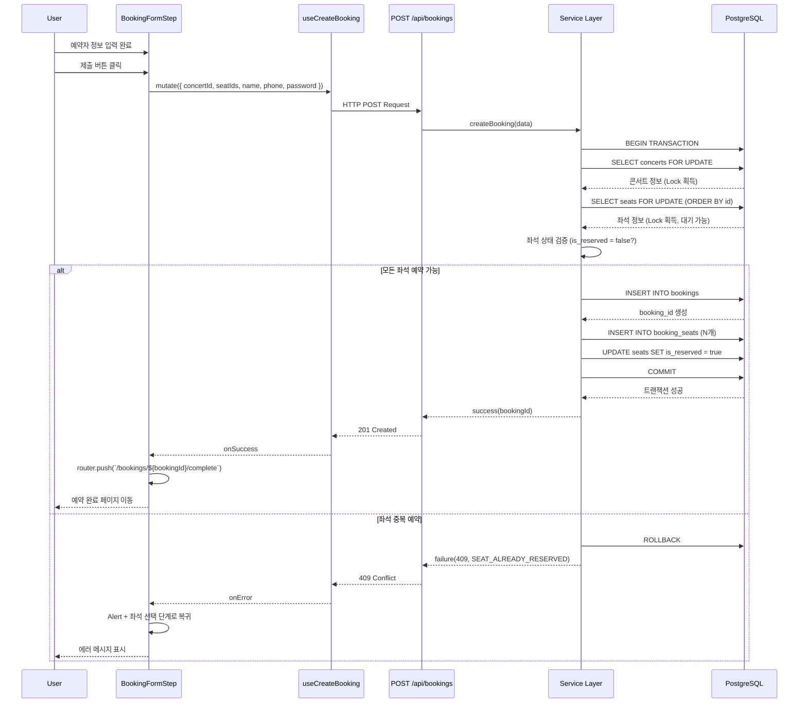

# 콘서트 예약 페이지 구현 계획

## 문서 정보
- **페이지**: `/concerts/[concertId]/booking`
- **유스케이스**: UF-003 (좌석 선택), UF-004 (좌석 선택 해제), UF-005 (예약 정보 입력 및 제출), UF-010 (동시성 제어)
- **버전**: 1.0
- **작성일**: 2025-10-13

---

## 개요

### 구현 범위
콘서트 예약 페이지는 사용자가 좌석을 선택하고, 예약자 정보를 입력하며, 최종적으로 예약을 완료하는 전체 프로세스를 제공합니다. 동시성 제어를 통해 중복 예약을 방지하고, 직관적인 UI/UX로 원활한 예약 경험을 제공합니다.

### 주요 기능
1. **좌석 선택 단계**
   - 320석(4구역 × 4×20) 좌석 배치도 시각화
   - 좌석 상태 표시 (예약 가능 / 예약됨 / 선택됨)
   - 최대 4개 좌석 선택 기능
   - 선택 좌석 사이드바 표시 및 개별 해제
   - 실시간 잔여 좌석 수 표시

2. **예약자 정보 입력 단계**
   - 예약자명, 휴대폰번호, 비밀번호 4자리 입력
   - 실시간 입력 검증 (클라이언트 측)
   - 선택 좌석 요약 표시 (읽기 전용)
   - 뒤로가기 버튼 (좌석 선택 단계로 복귀)

3. **예약 제출 및 완료**
   - 서버 측 트랜잭션 처리
   - Row-Level Locking을 통한 동시성 제어
   - 좌석 중복 예약 방지 (409 Conflict)
   - 예약 성공 시 예약 완료 페이지로 리디렉션

### 기술 스택
- **Frontend**: Next.js 15+ (App Router), React 19+, TypeScript
- **Styling**: TailwindCSS, shadcn-ui
- **State Management**: Zustand (좌석 선택 상태), @tanstack/react-query (서버 상태)
- **Backend**: Hono (API), Supabase (PostgreSQL)
- **Validation**: Zod (요청/응답 검증)
- **Date Handling**: date-fns

---

## Diagram

### 모듈 구조

```mermaid
graph TB
    subgraph "Presentation Layer"
        A[app/concerts/[concertId]/booking/page.tsx<br/>예약 페이지 컨테이너]
        B[features/bookings/components/BookingFlowContainer.tsx<br/>플로우 관리 컨테이너]
        C[features/bookings/components/SeatSelectionStep.tsx<br/>좌석 선택 단계]
        D[features/bookings/components/BookingFormStep.tsx<br/>예약자 정보 입력 단계]
        E[features/bookings/components/SeatMap.tsx<br/>좌석 배치도]
        F[features/bookings/components/SeatSelectionSidebar.tsx<br/>선택 좌석 사이드바]
        G[features/bookings/components/SeatCard.tsx<br/>개별 좌석 UI]
        H[features/bookings/components/BookingFormFields.tsx<br/>폼 입력 필드]
    end

    subgraph "State Management"
        I[features/bookings/stores/useSeatSelectionStore.ts<br/>Zustand 스토어]
        J[features/bookings/hooks/useConcertSeats.ts<br/>좌석 목록 조회]
        K[features/bookings/hooks/useCreateBooking.ts<br/>예약 생성 mutation]
    end

    subgraph "Backend API Layer"
        L[features/bookings/backend/route.ts<br/>Hono 라우터]
        M[features/bookings/backend/service.ts<br/>비즈니스 로직]
        N[features/bookings/backend/schema.ts<br/>Zod 스키마]
        O[features/bookings/backend/error.ts<br/>에러 코드]
    end

    subgraph "Shared Backend"
        P[features/concerts/backend/service.ts<br/>콘서트 조회]
        Q[backend/supabase/client.ts<br/>Supabase 클라이언트]
    end

    subgraph "Database"
        R[(concerts 테이블)]
        S[(seats 테이블)]
        T[(bookings 테이블)]
        U[(booking_seats 테이블)]
    end

    A --> B
    B --> C
    B --> D
    C --> E
    C --> F
    E --> G
    D --> H

    C --> I
    F --> I
    C --> J
    D --> K

    J --> L
    K --> L
    L --> M
    L --> N
    L --> O
    M --> P
    M --> Q

    Q --> R
    Q --> S
    Q --> T
    Q --> U

    S -.FK.-> R
    T -.FK.-> R
    U -.FK.-> T
    U -.FK.-> S
```

### 데이터 흐름: 좌석 선택



### 데이터 흐름: 예약 제출 (트랜잭션)



---

## Implementation Plan

### 1. Backend Layer (API)

#### 1.1 Schema 정의 (`src/features/bookings/backend/schema.ts`)

**목적**: 좌석 조회 및 예약 생성 API의 요청/응답 스키마 정의

**구현 내용**:

```typescript
import { z } from 'zod';

// ===== 좌석 조회 API =====

export const SeatSchema = z.object({
  id: z.string().uuid(),
  section: z.enum(['A', 'B', 'C', 'D']),
  row: z.number().int().min(1).max(20),
  seatColumn: z.number().int().min(1).max(4),
  isReserved: z.boolean(),
});

export const SeatsResponseSchema = z.object({
  concertId: z.string().uuid(),
  concertTitle: z.string(),
  eventDate: z.string(), // ISO 8601
  totalSeats: z.number().int().min(0),
  availableSeats: z.number().int().min(0),
  sections: z.array(
    z.object({
      name: z.enum(['A', 'B', 'C', 'D']),
      seats: z.array(SeatSchema),
    }),
  ),
});

export type Seat = z.infer<typeof SeatSchema>;
export type SeatsResponse = z.infer<typeof SeatsResponseSchema>;

// ===== 예약 생성 API =====

export const CreateBookingRequestSchema = z.object({
  concertId: z.string().uuid(),
  seatIds: z.array(z.string().uuid()).min(1).max(4),
  name: z.string().min(2).max(50).trim(),
  phone: z.string().regex(/^01[0-9]{8,9}$/, 'Invalid phone number format'), // 01012345678
  password: z.string().regex(/^[0-9]{4}$/, 'Password must be exactly 4 digits'),
});

export const CreateBookingResponseSchema = z.object({
  bookingId: z.string().uuid(),
  concertId: z.string().uuid(),
  concertTitle: z.string(),
  eventDate: z.string(),
  seats: z.array(
    z.object({
      section: z.enum(['A', 'B', 'C', 'D']),
      row: z.number().int(),
      seatColumn: z.number().int(),
    }),
  ),
  name: z.string(),
  phone: z.string(),
  status: z.enum(['confirmed', 'cancelled']),
  createdAt: z.string(),
});

export type CreateBookingRequest = z.infer<typeof CreateBookingRequestSchema>;
export type CreateBookingResponse = z.infer<typeof CreateBookingResponseSchema>;

// ===== DB 테이블 스키마 =====

export const SeatRowSchema = z.object({
  id: z.string().uuid(),
  concert_id: z.string().uuid(),
  section: z.string(),
  row: z.number(),
  seat_column: z.number(),
  is_reserved: z.boolean(),
  created_at: z.string(),
  updated_at: z.string(),
});

export const BookingRowSchema = z.object({
  id: z.string().uuid(),
  concert_id: z.string().uuid(),
  name: z.string(),
  phone: z.string(),
  password_hash: z.string(),
  status: z.string(),
  created_at: z.string(),
  updated_at: z.string(),
});

export type SeatRow = z.infer<typeof SeatRowSchema>;
export type BookingRow = z.infer<typeof BookingRowSchema>;
```

**Unit Test (`schema.test.ts`):**

```typescript
describe('CreateBookingRequestSchema', () => {
  it('should validate valid booking request', () => {
    const validData = {
      concertId: '550e8400-e29b-41d4-a716-446655440000',
      seatIds: ['seat-id-1', 'seat-id-2'],
      name: '홍길동',
      phone: '01012345678',
      password: '1234',
    };

    const result = CreateBookingRequestSchema.safeParse(validData);
    expect(result.success).toBe(true);
  });

  it('should reject invalid phone number', () => {
    const invalidData = {
      /* ... */
      phone: '010-1234-5678', // 하이픈 포함
    };
    const result = CreateBookingRequestSchema.safeParse(invalidData);
    expect(result.success).toBe(false);
  });

  it('should reject password with non-digits', () => {
    const invalidData = {
      /* ... */
      password: 'abcd',
    };
    const result = CreateBookingRequestSchema.safeParse(invalidData);
    expect(result.success).toBe(false);
  });

  it('should reject more than 4 seats', () => {
    const invalidData = {
      /* ... */
      seatIds: ['id1', 'id2', 'id3', 'id4', 'id5'],
    };
    const result = CreateBookingRequestSchema.safeParse(invalidData);
    expect(result.success).toBe(false);
  });
});

describe('SeatsResponseSchema', () => {
  it('should validate seats response', () => {
    const validData = {
      concertId: 'concert-uuid',
      concertTitle: 'BTS Concert',
      eventDate: '2025-12-25T19:00:00+09:00',
      totalSeats: 320,
      availableSeats: 280,
      sections: [
        {
          name: 'A',
          seats: [
            {
              id: 'seat-1',
              section: 'A',
              row: 1,
              seatColumn: 1,
              isReserved: false,
            },
          ],
        },
      ],
    };

    const result = SeatsResponseSchema.safeParse(validData);
    expect(result.success).toBe(true);
  });
});
```

---

#### 1.2 Error 코드 정의 (`src/features/bookings/backend/error.ts`)

**구현 내용**:

```typescript
export const bookingErrorCodes = {
  // 좌석 조회 관련
  concertNotFound: 'CONCERT_NOT_FOUND',
  seatsFetchError: 'SEATS_FETCH_ERROR',

  // 예약 생성 관련
  validationError: 'BOOKING_VALIDATION_ERROR',
  bookingClosed: 'BOOKING_CLOSED',
  seatAlreadyReserved: 'SEAT_ALREADY_RESERVED',
  invalidSeatId: 'INVALID_SEAT_ID',
  seatCountExceeded: 'SEAT_COUNT_EXCEEDED',
  transactionError: 'TRANSACTION_ERROR',
  deadlockDetected: 'DEADLOCK_DETECTED',
} as const;

export type BookingServiceError =
  | typeof bookingErrorCodes.concertNotFound
  | typeof bookingErrorCodes.seatsFetchError
  | typeof bookingErrorCodes.validationError
  | typeof bookingErrorCodes.bookingClosed
  | typeof bookingErrorCodes.seatAlreadyReserved
  | typeof bookingErrorCodes.invalidSeatId
  | typeof bookingErrorCodes.seatCountExceeded
  | typeof bookingErrorCodes.transactionError
  | typeof bookingErrorCodes.deadlockDetected;
```

---

#### 1.3 Service 레이어 (`src/features/bookings/backend/service.ts`)

**목적**: 좌석 조회 및 예약 생성 비즈니스 로직

**구현 내용**:

```typescript
import type { SupabaseClient } from '@supabase/supabase-js';
import { failure, success, type HandlerResult } from '@/backend/http/response';
import bcrypt from 'bcryptjs';
import {
  SeatsResponseSchema,
  CreateBookingResponseSchema,
  type SeatsResponse,
  type CreateBookingRequest,
  type CreateBookingResponse,
  type SeatRow,
} from './schema';
import { bookingErrorCodes, type BookingServiceError } from './error';

/**
 * 콘서트 좌석 배치도 조회
 */
export const getConcertSeats = async (
  client: SupabaseClient,
  concertId: string,
): Promise<HandlerResult<SeatsResponse, BookingServiceError, unknown>> => {
  // 1. 콘서트 정보 조회
  const { data: concert, error: concertError } = await client
    .from('concerts')
    .select('id, title, event_date')
    .eq('id', concertId)
    .single();

  if (concertError || !concert) {
    return failure(404, bookingErrorCodes.concertNotFound, 'Concert not found.');
  }

  // 2. 좌석 목록 조회 (320개)
  const { data: seats, error: seatsError } = await client
    .from('seats')
    .select('id, section, row, seat_column, is_reserved')
    .eq('concert_id', concertId)
    .order('section')
    .order('row')
    .order('seat_column');

  if (seatsError) {
    return failure(500, bookingErrorCodes.seatsFetchError, seatsError.message);
  }

  if (!seats || seats.length === 0) {
    return failure(500, bookingErrorCodes.seatsFetchError, 'No seats found for this concert.');
  }

  // 3. 구역별로 그룹화
  const sectionGroups: Record<string, SeatRow[]> = {
    A: [],
    B: [],
    C: [],
    D: [],
  };

  seats.forEach((seat) => {
    if (sectionGroups[seat.section]) {
      sectionGroups[seat.section].push(seat);
    }
  });

  // 4. 응답 데이터 구성
  const availableSeats = seats.filter((s) => !s.is_reserved).length;

  const response: SeatsResponse = {
    concertId: concert.id,
    concertTitle: concert.title,
    eventDate: concert.event_date,
    totalSeats: seats.length,
    availableSeats,
    sections: ['A', 'B', 'C', 'D'].map((section) => ({
      name: section as 'A' | 'B' | 'C' | 'D',
      seats: sectionGroups[section].map((seat) => ({
        id: seat.id,
        section: seat.section as 'A' | 'B' | 'C' | 'D',
        row: seat.row,
        seatColumn: seat.seat_column,
        isReserved: seat.is_reserved,
      })),
    })),
  };

  // 5. 스키마 검증
  const parsed = SeatsResponseSchema.safeParse(response);

  if (!parsed.success) {
    return failure(
      500,
      bookingErrorCodes.validationError,
      'Seats response validation failed.',
      parsed.error.format(),
    );
  }

  return success(parsed.data);
};

/**
 * 예약 생성 (트랜잭션)
 */
export const createBooking = async (
  client: SupabaseClient,
  data: CreateBookingRequest,
): Promise<HandlerResult<CreateBookingResponse, BookingServiceError, unknown>> => {
  const { concertId, seatIds, name, phone, password } = data;

  try {
    // === BEGIN TRANSACTION ===
    // Supabase에서는 명시적 트랜잭션 대신 RPC 함수를 사용하거나
    // 여러 쿼리를 순차적으로 실행하며 에러 발생 시 롤백

    // 1. 콘서트 존재 및 예약 가능 여부 확인
    const { data: concert, error: concertError } = await client
      .from('concerts')
      .select('id, title, event_date')
      .eq('id', concertId)
      .single();

    if (concertError || !concert) {
      return failure(404, bookingErrorCodes.concertNotFound, 'Concert not found.');
    }

    // 예약 가능 기간 확인 (진행일 전날 23:59:59까지)
    const now = new Date();
    const eventDate = new Date(concert.event_date);
    const bookingDeadline = new Date(eventDate);
    bookingDeadline.setDate(bookingDeadline.getDate() - 1);
    bookingDeadline.setHours(23, 59, 59, 999);

    if (now >= bookingDeadline) {
      return failure(400, bookingErrorCodes.bookingClosed, 'Booking period has ended.');
    }

    // 2. 좌석 상태 조회 및 Lock 획득 시뮬레이션
    // (Supabase는 SELECT ... FOR UPDATE를 직접 지원하지 않으므로,
    //  낙관적 락 또는 PostgreSQL RPC 함수를 사용해야 함)
    // 여기서는 단순화하여 조회 후 검증 방식 사용

    const { data: seats, error: seatsError } = await client
      .from('seats')
      .select('id, is_reserved')
      .in('id', seatIds)
      .eq('concert_id', concertId);

    if (seatsError) {
      return failure(500, bookingErrorCodes.transactionError, seatsError.message);
    }

    if (!seats || seats.length !== seatIds.length) {
      return failure(400, bookingErrorCodes.invalidSeatId, 'One or more seat IDs are invalid.');
    }

    // 3. 좌석 상태 검증
    const reservedSeats = seats.filter((seat) => seat.is_reserved);

    if (reservedSeats.length > 0) {
      return failure(
        409,
        bookingErrorCodes.seatAlreadyReserved,
        'One or more selected seats are already reserved.',
        { conflictedSeatIds: reservedSeats.map((s) => s.id) },
      );
    }

    // 4. 비밀번호 해싱
    const passwordHash = await bcrypt.hash(password, 10);

    // 5. 예약 레코드 생성
    const { data: booking, error: bookingError } = await client
      .from('bookings')
      .insert({
        concert_id: concertId,
        name,
        phone,
        password_hash: passwordHash,
        status: 'confirmed',
      })
      .select('id, created_at')
      .single();

    if (bookingError || !booking) {
      return failure(500, bookingErrorCodes.transactionError, bookingError?.message || 'Failed to create booking.');
    }

    // 6. 예약-좌석 연결 레코드 생성
    const bookingSeatsData = seatIds.map((seatId) => ({
      booking_id: booking.id,
      seat_id: seatId,
    }));

    const { error: bookingSeatsError } = await client.from('booking_seats').insert(bookingSeatsData);

    if (bookingSeatsError) {
      // 롤백이 필요하지만 Supabase는 자동 롤백하지 않으므로,
      // 실제 프로덕션에서는 PostgreSQL 함수나 에러 처리 로직 필요
      return failure(500, bookingErrorCodes.transactionError, bookingSeatsError.message);
    }

    // 7. 좌석 상태 업데이트
    const { error: updateError } = await client
      .from('seats')
      .update({ is_reserved: true, updated_at: new Date().toISOString() })
      .in('id', seatIds);

    if (updateError) {
      return failure(500, bookingErrorCodes.transactionError, updateError.message);
    }

    // === COMMIT (암시적) ===

    // 8. 응답 데이터 구성
    const { data: selectedSeats } = await client
      .from('seats')
      .select('section, row, seat_column')
      .in('id', seatIds);

    const response: CreateBookingResponse = {
      bookingId: booking.id,
      concertId: concert.id,
      concertTitle: concert.title,
      eventDate: concert.event_date,
      seats: (selectedSeats || []).map((seat) => ({
        section: seat.section as 'A' | 'B' | 'C' | 'D',
        row: seat.row,
        seatColumn: seat.seat_column,
      })),
      name,
      phone,
      status: 'confirmed',
      createdAt: booking.created_at,
    };

    const parsed = CreateBookingResponseSchema.safeParse(response);

    if (!parsed.success) {
      return failure(500, bookingErrorCodes.validationError, 'Booking response validation failed.', parsed.error.format());
    }

    return success(parsed.data);
  } catch (error) {
    // Deadlock 또는 기타 에러 처리
    if (error instanceof Error) {
      if (error.message.includes('deadlock')) {
        return failure(503, bookingErrorCodes.deadlockDetected, 'Deadlock detected. Please retry.');
      }
      return failure(500, bookingErrorCodes.transactionError, error.message);
    }
    return failure(500, bookingErrorCodes.transactionError, 'Unknown error occurred.');
  }
};
```

**주의**: Supabase는 기본적으로 `SELECT ... FOR UPDATE`를 지원하지 않으므로, 실제 동시성 제어를 위해서는 PostgreSQL RPC 함수를 작성하거나, 낙관적 락(optimistic locking)을 사용해야 합니다. 위 코드는 단순화된 버전입니다.

**Unit Test (`service.test.ts`):**

```typescript
describe('getConcertSeats', () => {
  it('should return seat map successfully', async () => {
    const mockClient = {
      from: jest.fn().mockReturnThis(),
      select: jest.fn().mockReturnThis(),
      eq: jest.fn().mockReturnThis(),
      order: jest.fn().mockReturnThis(),
      single: jest.fn().mockResolvedValue({
        data: {
          id: 'concert-1',
          title: 'BTS Concert',
          event_date: '2025-12-25T19:00:00+09:00',
        },
        error: null,
      }),
    };

    // Mock seats query
    mockClient.from.mockReturnValueOnce(mockClient); // concerts
    mockClient.from.mockReturnValueOnce({
      ...mockClient,
      order: jest.fn().mockResolvedValue({
        data: Array(80)
          .fill(null)
          .map((_, i) => ({
            id: `seat-${i}`,
            section: 'A',
            row: Math.floor(i / 4) + 1,
            seat_column: (i % 4) + 1,
            is_reserved: i < 10, // 10석 예약됨
          })),
        error: null,
      }),
    });

    const result = await getConcertSeats(mockClient as any, 'concert-1');

    expect(result.ok).toBe(true);
    if (result.ok) {
      expect(result.data.totalSeats).toBe(80);
      expect(result.data.availableSeats).toBe(70);
      expect(result.data.sections).toHaveLength(4);
    }
  });

  it('should return 404 when concert not found', async () => {
    const mockClient = {
      from: jest.fn().mockReturnThis(),
      select: jest.fn().mockReturnThis(),
      eq: jest.fn().mockReturnThis(),
      single: jest.fn().mockResolvedValue({
        data: null,
        error: { code: 'PGRST116' },
      }),
    };

    const result = await getConcertSeats(mockClient as any, 'invalid-id');

    expect(result.ok).toBe(false);
    if (!result.ok) {
      expect(result.status).toBe(404);
      expect(result.error.code).toBe(bookingErrorCodes.concertNotFound);
    }
  });
});

describe('createBooking', () => {
  it('should create booking successfully', async () => {
    // Mock implementation...
    // 테스트는 복잡하므로 실제 구현 시 작성
  });

  it('should return 409 when seat is already reserved', async () => {
    // Mock implementation...
  });

  it('should return 400 when booking period has ended', async () => {
    // Mock implementation...
  });
});
```

---

#### 1.4 Route 레이어 (`src/features/bookings/backend/route.ts`)

**구현 내용**:

```typescript
import type { Hono } from 'hono';
import { failure, respond, type ErrorResult } from '@/backend/http/response';
import { getLogger, getSupabase, type AppEnv } from '@/backend/hono/context';
import { getConcertSeats, createBooking } from './service';
import { CreateBookingRequestSchema } from './schema';
import { bookingErrorCodes, type BookingServiceError } from './error';

export const registerBookingRoutes = (app: Hono<AppEnv>) => {
  /**
   * GET /api/concerts/:concertId/seats
   * 콘서트 좌석 배치도 조회
   */
  app.get('/api/concerts/:concertId/seats', async (c) => {
    const concertId = c.req.param('concertId');
    const supabase = getSupabase(c);
    const logger = getLogger(c);

    const result = await getConcertSeats(supabase, concertId);

    if (!result.ok) {
      const errorResult = result as ErrorResult<BookingServiceError, unknown>;

      if (errorResult.error.code === bookingErrorCodes.concertNotFound) {
        logger.warn('Concert not found for seat map', { concertId });
      } else {
        logger.error('Failed to fetch seat map', errorResult.error.message);
      }

      return respond(c, result);
    }

    return respond(c, result);
  });

  /**
   * POST /api/bookings
   * 예약 생성
   */
  app.post('/api/bookings', async (c) => {
    const supabase = getSupabase(c);
    const logger = getLogger(c);

    // 1. Request Body 파싱
    const body = await c.req.json();

    // 2. 스키마 검증
    const parsed = CreateBookingRequestSchema.safeParse(body);

    if (!parsed.success) {
      return respond(
        c,
        failure(
          400,
          bookingErrorCodes.validationError,
          'Invalid booking request data.',
          parsed.error.format(),
        ),
      );
    }

    // 3. 서비스 호출
    const result = await createBooking(supabase, parsed.data);

    // 4. 에러 핸들링
    if (!result.ok) {
      const errorResult = result as ErrorResult<BookingServiceError, unknown>;

      if (errorResult.error.code === bookingErrorCodes.seatAlreadyReserved) {
        logger.warn('Seat already reserved', {
          concertId: parsed.data.concertId,
          seatIds: parsed.data.seatIds,
        });
      } else if (errorResult.error.code === bookingErrorCodes.deadlockDetected) {
        logger.error('Deadlock detected during booking creation');
      } else if (errorResult.error.code === bookingErrorCodes.transactionError) {
        logger.error('Transaction error during booking creation', errorResult.error.message);
      }

      return respond(c, result);
    }

    // 5. 성공 응답
    logger.info('Booking created successfully', {
      bookingId: result.data.bookingId,
      concertId: result.data.concertId,
    });

    return respond(c, result);
  });
};
```

**라우터 등록** (`src/backend/hono/app.ts`):

```typescript
import { registerBookingRoutes } from '@/features/bookings/backend/route';

export const createHonoApp = () => {
  // ... 기존 코드 ...
  registerBookingRoutes(app);
  // ...
};
```

---

### 2. Frontend State Management (Zustand)

#### 2.1 좌석 선택 상태 관리 (`src/features/bookings/stores/useSeatSelectionStore.ts`)

**목적**: 클라이언트 측 좌석 선택 상태 관리 (최대 4개)

**구현 내용**:

```typescript
import { create } from 'zustand';
import type { Seat } from '../backend/schema';

interface SeatSelectionState {
  selectedSeats: Seat[];
  addSeat: (seat: Seat) => void;
  removeSeat: (seatId: string) => void;
  clearSeats: () => void;
  isSeatSelected: (seatId: string) => boolean;
  canSelectMore: () => boolean;
}

export const useSeatSelectionStore = create<SeatSelectionState>((set, get) => ({
  selectedSeats: [],

  addSeat: (seat: Seat) => {
    const current = get().selectedSeats;

    // 이미 선택된 좌석인지 확인
    if (current.some((s) => s.id === seat.id)) {
      return;
    }

    // 최대 4개 제한
    if (current.length >= 4) {
      return;
    }

    set({ selectedSeats: [...current, seat] });
  },

  removeSeat: (seatId: string) => {
    set((state) => ({
      selectedSeats: state.selectedSeats.filter((s) => s.id !== seatId),
    }));
  },

  clearSeats: () => {
    set({ selectedSeats: [] });
  },

  isSeatSelected: (seatId: string) => {
    return get().selectedSeats.some((s) => s.id === seatId);
  },

  canSelectMore: () => {
    return get().selectedSeats.length < 4;
  },
}));
```

---

### 3. Frontend Data Layer (React Query)

#### 3.1 좌석 조회 훅 (`src/features/bookings/hooks/useConcertSeats.ts`)

**구현 내용**:

```typescript
'use client';

import { useQuery } from '@tanstack/react-query';
import { apiClient } from '@/lib/remote/api-client';
import type { SeatsResponse } from '../backend/schema';

export const useConcertSeats = (concertId: string) => {
  return useQuery<SeatsResponse>({
    queryKey: ['concerts', concertId, 'seats'],
    queryFn: async () => {
      const response = await apiClient.get(`/api/concerts/${concertId}/seats`);

      if (!response.ok) {
        throw new Error(response.error?.message || 'Failed to fetch seats');
      }

      return response.data;
    },
    enabled: !!concertId,
    staleTime: 30 * 1000, // 30초 (좌석 상태가 자주 변할 수 있으므로)
    gcTime: 5 * 60 * 1000, // 5분
    retry: 1,
  });
};
```

---

#### 3.2 예약 생성 Mutation (`src/features/bookings/hooks/useCreateBooking.ts`)

**구현 내용**:

```typescript
'use client';

import { useMutation } from '@tanstack/react-query';
import { apiClient } from '@/lib/remote/api-client';
import type { CreateBookingRequest, CreateBookingResponse } from '../backend/schema';

export const useCreateBooking = () => {
  return useMutation<CreateBookingResponse, Error, CreateBookingRequest>({
    mutationFn: async (data: CreateBookingRequest) => {
      const response = await apiClient.post('/api/bookings', data);

      if (!response.ok) {
        const errorMessage = response.error?.message || 'Failed to create booking';
        const error = new Error(errorMessage);
        // @ts-ignore
        error.code = response.error?.code;
        // @ts-ignore
        error.details = response.error?.details;
        throw error;
      }

      return response.data;
    },
  });
};
```

---

### 4. Frontend Components (Presentation Layer)

#### 4.1 예약 플로우 컨테이너 (`src/features/bookings/components/BookingFlowContainer.tsx`)

**목적**: 좌석 선택 단계 ↔ 정보입력 단계 전환 관리

**구현 내용**:

```typescript
'use client';

import { useState } from 'react';
import { SeatSelectionStep } from './SeatSelectionStep';
import { BookingFormStep } from './BookingFormStep';
import { useSeatSelectionStore } from '../stores/useSeatSelectionStore';

interface BookingFlowContainerProps {
  concertId: string;
}

type FlowStep = 'seat-selection' | 'booking-form';

export const BookingFlowContainer = ({ concertId }: BookingFlowContainerProps) => {
  const [currentStep, setCurrentStep] = useState<FlowStep>('seat-selection');
  const { selectedSeats } = useSeatSelectionStore();

  const handleProceedToForm = () => {
    if (selectedSeats.length > 0) {
      setCurrentStep('booking-form');
    }
  };

  const handleBackToSeatSelection = () => {
    setCurrentStep('seat-selection');
  };

  return (
    <div className="min-h-screen bg-gray-50">
      {currentStep === 'seat-selection' && (
        <SeatSelectionStep concertId={concertId} onProceed={handleProceedToForm} />
      )}

      {currentStep === 'booking-form' && (
        <BookingFormStep concertId={concertId} onBack={handleBackToSeatSelection} />
      )}
    </div>
  );
};
```

**QA Sheet:**
- [ ] 좌석 선택 단계 초기 렌더링
- [ ] 좌석 1개 이상 선택 시 예약하기 버튼 활성화
- [ ] 예약하기 버튼 클릭 시 정보입력 단계로 전환
- [ ] 정보입력 단계에서 뒤로가기 시 좌석 선택 단계 복귀
- [ ] 좌석 선택 상태 유지 확인

---

#### 4.2 좌석 선택 단계 컴포넌트 (`src/features/bookings/components/SeatSelectionStep.tsx`)

**구현 내용**:

```typescript
'use client';

import { useConcertSeats } from '../hooks/useConcertSeats';
import { useSeatSelectionStore } from '../stores/useSeatSelectionStore';
import { SeatMap } from './SeatMap';
import { SeatSelectionSidebar } from './SeatSelectionSidebar';
import { Button } from '@/components/ui/button';

interface SeatSelectionStepProps {
  concertId: string;
  onProceed: () => void;
}

export const SeatSelectionStep = ({ concertId, onProceed }: SeatSelectionStepProps) => {
  const { data, isLoading, isError, error } = useConcertSeats(concertId);
  const { selectedSeats } = useSeatSelectionStore();

  if (isLoading) {
    return (
      <div className="container mx-auto px-4 py-8">
        <div className="text-center">로딩 중...</div>
      </div>
    );
  }

  if (isError) {
    return (
      <div className="container mx-auto px-4 py-8">
        <div className="text-center">
          <h2 className="text-xl font-bold text-red-600">좌석 정보를 불러올 수 없습니다</h2>
          <p className="mt-2 text-gray-600">{error.message}</p>
        </div>
      </div>
    );
  }

  if (!data) {
    return null;
  }

  return (
    <div className="container mx-auto px-4 py-8">
      <header className="mb-6">
        <h1 className="text-2xl font-bold">{data.concertTitle} - 좌석 선택</h1>
        <p className="text-sm text-gray-600 mt-1">
          남은 좌석: {data.availableSeats}/{data.totalSeats}석
        </p>
      </header>

      <div className="grid grid-cols-1 lg:grid-cols-3 gap-6">
        {/* 좌석 배치도 */}
        <div className="lg:col-span-2">
          <SeatMap sections={data.sections} />
        </div>

        {/* 사이드바 */}
        <div className="lg:col-span-1">
          <SeatSelectionSidebar
            selectedSeats={selectedSeats}
            availableSeats={data.availableSeats}
            totalSeats={data.totalSeats}
          />

          <Button
            className="w-full mt-4"
            disabled={selectedSeats.length === 0}
            onClick={onProceed}
            size="lg"
          >
            예약하기 ({selectedSeats.length}석 선택)
          </Button>
        </div>
      </div>
    </div>
  );
};
```

**QA Sheet:**
- [ ] 콘서트 제목 및 남은 좌석 수 표시
- [ ] 좌석 배치도 정상 렌더링
- [ ] 사이드바에 선택된 좌석 표시
- [ ] 예약하기 버튼: 0석 선택 시 비활성화
- [ ] 예약하기 버튼: 1석 이상 선택 시 활성화 및 선택 수 표시
- [ ] 반응형: 모바일에서 세로 레이아웃, 데스크톱에서 좌우 레이아웃

---

#### 4.3 좌석 배치도 컴포넌트 (`src/features/bookings/components/SeatMap.tsx`)

**구현 내용**:

```typescript
'use client';

import { SeatCard } from './SeatCard';
import type { Seat } from '../backend/schema';

interface Section {
  name: 'A' | 'B' | 'C' | 'D';
  seats: Seat[];
}

interface SeatMapProps {
  sections: Section[];
}

export const SeatMap = ({ sections }: SeatMapProps) => {
  return (
    <div className="bg-white rounded-lg p-6 shadow-sm">
      <div className="grid grid-cols-2 gap-8">
        {sections.map((section) => (
          <div key={section.name} className="border rounded-lg p-4">
            <h3 className="text-center font-bold text-lg mb-4">{section.name}구역</h3>
            <div className="grid grid-cols-4 gap-2">
              {section.seats.map((seat) => (
                <SeatCard key={seat.id} seat={seat} />
              ))}
            </div>
          </div>
        ))}
      </div>

      {/* 범례 */}
      <div className="mt-6 flex items-center justify-center gap-6 text-sm">
        <div className="flex items-center gap-2">
          <div className="w-4 h-4 bg-white border-2 border-gray-300 rounded"></div>
          <span>예약 가능</span>
        </div>
        <div className="flex items-center gap-2">
          <div className="w-4 h-4 bg-blue-500 border-2 border-blue-600 rounded"></div>
          <span>선택됨</span>
        </div>
        <div className="flex items-center gap-2">
          <div className="w-4 h-4 bg-gray-400 border-2 border-gray-500 rounded"></div>
          <span>예약됨</span>
        </div>
      </div>
    </div>
  );
};
```

**QA Sheet:**
- [ ] 4개 구역 (A, B, C, D) 2x2 그리드 표시
- [ ] 각 구역에 4x20 좌석 배치
- [ ] 범례 표시 (예약 가능, 선택됨, 예약됨)
- [ ] 반응형: 모바일에서 2열 유지, 좌석 크기 조정

---

#### 4.4 개별 좌석 카드 (`src/features/bookings/components/SeatCard.tsx`)

**구현 내용**:

```typescript
'use client';

import { useSeatSelectionStore } from '../stores/useSeatSelectionStore';
import type { Seat } from '../backend/schema';
import { cn } from '@/lib/utils';

interface SeatCardProps {
  seat: Seat;
}

export const SeatCard = ({ seat }: SeatCardProps) => {
  const { addSeat, removeSeat, isSeatSelected, canSelectMore } = useSeatSelectionStore();

  const isSelected = isSeatSelected(seat.id);
  const isReserved = seat.isReserved;
  const isClickable = !isReserved;

  const handleClick = () => {
    if (isReserved) {
      return; // 예약된 좌석은 클릭 불가
    }

    if (isSelected) {
      removeSeat(seat.id); // 선택 해제
    } else {
      if (canSelectMore()) {
        addSeat(seat); // 선택
      } else {
        alert('최대 4석까지만 선택할 수 있습니다.');
      }
    }
  };

  return (
    <button
      onClick={handleClick}
      disabled={!isClickable}
      className={cn(
        'aspect-square rounded text-xs font-medium transition-all',
        'border-2',
        isReserved && 'bg-gray-400 border-gray-500 cursor-not-allowed',
        !isReserved && !isSelected && 'bg-white border-gray-300 hover:border-blue-400 cursor-pointer',
        isSelected && 'bg-blue-500 border-blue-600 text-white cursor-pointer',
      )}
      aria-label={`${seat.section}구역 ${seat.row}행 ${seat.seatColumn}열 ${
        isReserved ? '예약됨' : isSelected ? '선택됨' : '예약 가능'
      }`}
    >
      {seat.row}-{seat.seatColumn}
    </button>
  );
};
```

**QA Sheet:**
- [ ] 예약 가능 좌석: 흰색 배경, 호버 시 파란색 테두리
- [ ] 선택된 좌석: 파란색 배경, 클릭 시 선택 해제
- [ ] 예약된 좌석: 회색 배경, 클릭 불가
- [ ] 4개 선택 후 추가 클릭 시 알림 메시지
- [ ] 키보드 접근 가능 (Tab, Enter)
- [ ] 스크린 리더 aria-label 정상 동작

---

#### 4.5 사이드바 (`src/features/bookings/components/SeatSelectionSidebar.tsx`)

**구현 내용**:

```typescript
'use client';

import { X } from 'lucide-react';
import { useSeatSelectionStore } from '../stores/useSeatSelectionStore';
import type { Seat } from '../backend/schema';

interface SeatSelectionSidebarProps {
  selectedSeats: Seat[];
  availableSeats: number;
  totalSeats: number;
}

export const SeatSelectionSidebar = ({
  selectedSeats,
  availableSeats,
  totalSeats,
}: SeatSelectionSidebarProps) => {
  const { removeSeat } = useSeatSelectionStore();

  return (
    <div className="bg-white rounded-lg p-6 shadow-sm sticky top-4">
      <h3 className="font-bold text-lg mb-2">선택된 좌석</h3>
      <p className="text-sm text-gray-600 mb-4">
        남은 좌석: {availableSeats}/{totalSeats}석
      </p>

      {selectedSeats.length === 0 && (
        <div className="text-center py-8 text-gray-400">
          <p>좌석을 선택해주세요</p>
          <p className="text-xs mt-1">최대 4석까지 선택 가능</p>
        </div>
      )}

      {selectedSeats.length > 0 && (
        <ul className="space-y-2">
          {selectedSeats.map((seat) => (
            <li
              key={seat.id}
              className="flex items-center justify-between bg-gray-50 rounded px-3 py-2"
            >
              <span className="text-sm font-medium">
                {seat.section}구역 {seat.row}행 {seat.seatColumn}열
              </span>
              <button
                onClick={() => removeSeat(seat.id)}
                className="text-gray-400 hover:text-red-500 transition-colors"
                aria-label={`${seat.section}구역 ${seat.row}행 ${seat.seatColumn}열 선택 해제`}
              >
                <X className="w-4 h-4" />
              </button>
            </li>
          ))}
        </ul>
      )}
    </div>
  );
};
```

**QA Sheet:**
- [ ] 선택된 좌석 0개: 안내 메시지 표시
- [ ] 선택된 좌석 1개 이상: 좌석 목록 표시
- [ ] X 아이콘 클릭 시 해당 좌석 선택 해제
- [ ] 좌석 추가/제거 시 UI 실시간 업데이트
- [ ] 반응형: 모바일에서 하단 고정, 데스크톱에서 sticky

---

#### 4.6 예약자 정보 입력 단계 (`src/features/bookings/components/BookingFormStep.tsx`)

**구현 내용**:

```typescript
'use client';

import { useState } from 'react';
import { useRouter } from 'next/navigation';
import { useForm } from 'react-hook-form';
import { zodResolver } from '@hookform/resolvers/zod';
import { z } from 'zod';
import { ArrowLeft, Loader2 } from 'lucide-react';
import { Button } from '@/components/ui/button';
import { Input } from '@/components/ui/input';
import { Label } from '@/components/ui/label';
import { useCreateBooking } from '../hooks/useCreateBooking';
import { useSeatSelectionStore } from '../stores/useSeatSelectionStore';
import type { CreateBookingRequest } from '../backend/schema';

interface BookingFormStepProps {
  concertId: string;
  onBack: () => void;
}

const formSchema = z.object({
  name: z.string().min(2, '예약자명은 2자 이상이어야 합니다').max(50),
  phone: z.string().regex(/^01[0-9]{8,9}$/, '올바른 휴대폰번호 형식이 아닙니다 (예: 01012345678)'),
  password: z.string().regex(/^[0-9]{4}$/, '비밀번호는 숫자 4자리여야 합니다'),
});

type FormData = z.infer<typeof formSchema>;

export const BookingFormStep = ({ concertId, onBack }: BookingFormStepProps) => {
  const router = useRouter();
  const { selectedSeats, clearSeats } = useSeatSelectionStore();
  const { mutate, isPending } = useCreateBooking();

  const {
    register,
    handleSubmit,
    formState: { errors, isValid },
  } = useForm<FormData>({
    resolver: zodResolver(formSchema),
    mode: 'onChange',
  });

  const onSubmit = (data: FormData) => {
    const request: CreateBookingRequest = {
      concertId,
      seatIds: selectedSeats.map((s) => s.id),
      ...data,
    };

    mutate(request, {
      onSuccess: (response) => {
        clearSeats(); // 예약 완료 후 선택 좌석 초기화
        router.push(`/bookings/${response.bookingId}/complete`);
      },
      onError: (error: any) => {
        if (error.code === 'SEAT_ALREADY_RESERVED') {
          alert('선택하신 좌석 중 일부가 이미 예약되었습니다. 다른 좌석을 선택해주세요.');
          onBack(); // 좌석 선택 단계로 복귀
        } else if (error.code === 'BOOKING_CLOSED') {
          alert('예약 기간이 종료되었습니다.');
        } else {
          alert('예약 중 오류가 발생했습니다. 다시 시도해주세요.');
        }
      },
    });
  };

  return (
    <div className="container mx-auto px-4 py-8 max-w-2xl">
      <button
        onClick={onBack}
        className="flex items-center gap-2 text-gray-600 hover:text-gray-900 mb-6"
        disabled={isPending}
      >
        <ArrowLeft className="w-5 h-5" />
        <span>좌석 선택으로 돌아가기</span>
      </button>

      <h1 className="text-2xl font-bold mb-6">예약자 정보 입력</h1>

      {/* 선택된 좌석 요약 */}
      <div className="bg-gray-50 rounded-lg p-4 mb-6">
        <h3 className="font-semibold mb-2">선택된 좌석 ({selectedSeats.length}석)</h3>
        <div className="flex flex-wrap gap-2">
          {selectedSeats.map((seat) => (
            <span key={seat.id} className="bg-blue-100 text-blue-700 px-3 py-1 rounded text-sm">
              {seat.section}구역 {seat.row}행 {seat.seatColumn}열
            </span>
          ))}
        </div>
      </div>

      {/* 예약자 정보 폼 */}
      <form onSubmit={handleSubmit(onSubmit)} className="space-y-6">
        <div>
          <Label htmlFor="name">예약자명 *</Label>
          <Input
            id="name"
            {...register('name')}
            placeholder="홍길동"
            className="mt-1"
            disabled={isPending}
          />
          {errors.name && <p className="text-sm text-red-600 mt-1">{errors.name.message}</p>}
        </div>

        <div>
          <Label htmlFor="phone">휴대폰번호 * (숫자만)</Label>
          <Input
            id="phone"
            {...register('phone')}
            placeholder="01012345678"
            className="mt-1"
            disabled={isPending}
            maxLength={11}
          />
          {errors.phone && <p className="text-sm text-red-600 mt-1">{errors.phone.message}</p>}
          <p className="text-xs text-gray-500 mt-1">예: 01012345678 (하이픈 없이)</p>
        </div>

        <div>
          <Label htmlFor="password">비밀번호 4자리 *</Label>
          <Input
            id="password"
            type="password"
            {...register('password')}
            placeholder="1234"
            className="mt-1"
            disabled={isPending}
            maxLength={4}
          />
          {errors.password && <p className="text-sm text-red-600 mt-1">{errors.password.message}</p>}
          <p className="text-xs text-gray-500 mt-1">예약 조회 시 사용됩니다</p>
        </div>

        <Button type="submit" className="w-full" size="lg" disabled={!isValid || isPending}>
          {isPending && <Loader2 className="w-4 h-4 mr-2 animate-spin" />}
          {isPending ? '예약 처리 중...' : '예약 완료하기'}
        </Button>
      </form>
    </div>
  );
};
```

**QA Sheet:**
- [ ] 뒤로가기 버튼: 좌석 선택 단계로 복귀
- [ ] 선택 좌석 요약: 읽기 전용으로 표시
- [ ] 예약자명: 2자 이상 입력, 실시간 검증
- [ ] 휴대폰번호: 숫자만 입력, 10-11자리 검증
- [ ] 비밀번호: 숫자 4자리 검증
- [ ] 제출 버튼: 모든 필드 유효한 경우에만 활성화
- [ ] 제출 중: 로딩 인디케이터 표시 및 버튼 비활성화
- [ ] 성공 시: 예약 완료 페이지로 리디렉션
- [ ] 좌석 중복 에러: 알림 후 좌석 선택 단계로 복귀
- [ ] 기타 에러: 알림 메시지 표시

---

#### 4.7 페이지 컴포넌트 (`src/app/concerts/[concertId]/booking/page.tsx`)

**구현 내용**:

```typescript
import { BookingFlowContainer } from '@/features/bookings/components/BookingFlowContainer';

interface PageProps {
  params: Promise<{
    concertId: string;
  }>;
}

export default async function BookingPage({ params }: PageProps) {
  const { concertId } = await params;

  return <BookingFlowContainer concertId={concertId} />;
}

// 메타데이터 (SEO)
export async function generateMetadata({ params }: PageProps) {
  return {
    title: '콘서트 예약',
    description: '좌석을 선택하고 예약을 완료하세요',
  };
}
```

---

### 5. Shared Modules & Utilities

#### 5.1 DTO 재노출 (`src/features/bookings/lib/dto.ts`)

**구현 내용**:

```typescript
export {
  SeatSchema,
  SeatsResponseSchema,
  CreateBookingRequestSchema,
  CreateBookingResponseSchema,
  type Seat,
  type SeatsResponse,
  type CreateBookingRequest,
  type CreateBookingResponse,
} from '@/features/bookings/backend/schema';
```

---

### 6. Database Migrations (이미 완료됨)

**확인 사항**:
- [x] `concerts` 테이블 생성
- [x] `seats` 테이블 생성 (320석 자동 생성 트리거 또는 시드 데이터)
- [x] `bookings` 테이블 생성
- [x] `booking_seats` 테이블 생성
- [x] 인덱스 생성 (`idx_seats_concert_reserved`, `idx_seats_unique_position`)
- [x] Foreign Key 제약 조건 설정

**주의**: 동시성 제어를 위해 PostgreSQL RPC 함수 추가 고려

---

## 구현 순서

### Phase 1: Backend API (우선순위: 최고)
- [ ] 1.1 Schema 정의 (schema.ts)
- [ ] 1.2 Error 코드 정의 (error.ts)
- [ ] 1.3 Service 함수 구현 (service.ts)
  - [ ] getConcertSeats
  - [ ] createBooking (트랜잭션)
- [ ] 1.4 Route Handler 구현 (route.ts)
  - [ ] GET /api/concerts/:concertId/seats
  - [ ] POST /api/bookings
- [ ] Unit Tests 작성
- [ ] Hono 앱에 라우터 등록

### Phase 2: Frontend State Management (우선순위: 높음)
- [ ] 2.1 Zustand 스토어 구현 (useSeatSelectionStore)
- [ ] 2.2 React Query 훅 구현
  - [ ] useConcertSeats
  - [ ] useCreateBooking

### Phase 3: Frontend Components (우선순위: 중간)
- [ ] 3.1 공통 컴포넌트
  - [ ] SeatCard
  - [ ] SeatSelectionSidebar
- [ ] 3.2 주요 컴포넌트
  - [ ] SeatMap
  - [ ] SeatSelectionStep
  - [ ] BookingFormStep
- [ ] 3.3 컨테이너
  - [ ] BookingFlowContainer
- [ ] 3.4 페이지
  - [ ] app/concerts/[concertId]/booking/page.tsx
- [ ] QA Sheet 작성 및 수동 테스트

### Phase 4: Testing (우선순위: 높음)
- [ ] Backend Unit Tests (service, schema)
- [ ] Frontend Component Tests
- [ ] E2E Tests (Playwright)
  - [ ] 정상 플로우: 좌석 선택 → 정보 입력 → 예약 완료
  - [ ] 에러 플로우: 좌석 중복, 예약 마감, 네트워크 에러
  - [ ] 동시성 테스트: 2명이 같은 좌석 예약 시도

### Phase 5: Optimization & Polish (우선순위: 낮음)
- [ ] 성능 최적화 (캐싱, 인덱싱)
- [ ] 접근성 개선 (키보드, 스크린 리더)
- [ ] 반응형 디자인 QA
- [ ] 에러 처리 강화

---

## 주의사항

### 1. 동시성 제어 (중요!)

**문제**: Supabase는 기본적으로 `SELECT ... FOR UPDATE`를 지원하지 않으므로, 중복 예약이 발생할 수 있습니다.

**해결 방법**:

**옵션 1: PostgreSQL RPC 함수 사용 (권장)**

```sql
CREATE OR REPLACE FUNCTION create_booking_with_lock(
  p_concert_id UUID,
  p_seat_ids UUID[],
  p_name VARCHAR,
  p_phone VARCHAR,
  p_password_hash VARCHAR
) RETURNS JSON AS $$
DECLARE
  v_booking_id UUID;
  v_seat_record RECORD;
BEGIN
  -- 1. 좌석 Lock 획득
  FOR v_seat_record IN
    SELECT id, is_reserved
    FROM seats
    WHERE id = ANY(p_seat_ids)
      AND concert_id = p_concert_id
    ORDER BY id
    FOR UPDATE
  LOOP
    IF v_seat_record.is_reserved THEN
      RAISE EXCEPTION 'Seat already reserved: %', v_seat_record.id;
    END IF;
  END LOOP;

  -- 2. 예약 생성
  INSERT INTO bookings (concert_id, name, phone, password_hash, status)
  VALUES (p_concert_id, p_name, p_phone, p_password_hash, 'confirmed')
  RETURNING id INTO v_booking_id;

  -- 3. 예약-좌석 연결
  INSERT INTO booking_seats (booking_id, seat_id)
  SELECT v_booking_id, unnest(p_seat_ids);

  -- 4. 좌석 상태 업데이트
  UPDATE seats
  SET is_reserved = true, updated_at = NOW()
  WHERE id = ANY(p_seat_ids);

  -- 5. 성공 응답
  RETURN json_build_object('booking_id', v_booking_id, 'success', true);
EXCEPTION
  WHEN OTHERS THEN
    RAISE;
END;
$$ LANGUAGE plpgsql;
```

**옵션 2: 낙관적 락 (Optimistic Locking)**

좌석 테이블에 `version` 컬럼 추가 후, UPDATE 시 version 체크

```sql
UPDATE seats
SET is_reserved = true, version = version + 1
WHERE id = ANY(:seat_ids)
  AND version = :expected_version
  AND is_reserved = false;
```

### 2. 트랜잭션 타임아웃 설정

```sql
-- postgresql.conf 또는 Supabase 설정
statement_timeout = '15s';
lock_timeout = '10s';
deadlock_timeout = '1s';
```

### 3. 데드락 방지

- 좌석 ID를 항상 정렬하여 Lock 획득 순서 일관성 유지
- `ORDER BY id FOR UPDATE` 사용

### 4. 에러 처리

- 409 Conflict: 좌석 중복 예약
- 400 Bad Request: 예약 마감, 잘못된 입력
- 503 Service Unavailable: 데드락, 타임아웃
- 500 Internal Server Error: 기타 서버 에러

---

## 테스트 계획

### Backend Unit Tests

**Schema 테스트**:
- [ ] 유효한 데이터 파싱 성공
- [ ] 잘못된 UUID 형식 거부
- [ ] 휴대폰번호 형식 검증
- [ ] 비밀번호 4자리 숫자 검증

**Service 테스트**:
- [ ] getConcertSeats: 정상 케이스
- [ ] getConcertSeats: 콘서트 없음 (404)
- [ ] createBooking: 정상 케이스
- [ ] createBooking: 좌석 중복 (409)
- [ ] createBooking: 예약 마감 (400)
- [ ] createBooking: 트랜잭션 실패 (500)

### Frontend Component Tests

**useSeatSelectionStore 테스트**:
- [ ] 좌석 추가 (최대 4개)
- [ ] 좌석 제거
- [ ] 중복 추가 방지
- [ ] 선택 상태 확인

**SeatCard 테스트**:
- [ ] 예약 가능 좌석 클릭 시 선택
- [ ] 선택된 좌석 클릭 시 해제
- [ ] 예약된 좌석 클릭 불가
- [ ] 4개 선택 후 추가 클릭 알림

**BookingFormStep 테스트**:
- [ ] 입력 검증 (실시간)
- [ ] 제출 버튼 활성화/비활성화
- [ ] 예약 성공 시 리디렉션
- [ ] 예약 실패 시 에러 처리

### E2E Tests (Playwright)

**정상 플로우**:
```typescript
test('should complete booking successfully', async ({ page }) => {
  await page.goto('/concerts/test-concert-id/booking');

  // 좌석 선택
  await page.locator('[data-seat-id="seat-1"]').click();
  await page.locator('[data-seat-id="seat-2"]').click();

  // 예약하기 버튼 클릭
  await page.locator('button:has-text("예약하기")').click();

  // 정보 입력
  await page.fill('input[name="name"]', '홍길동');
  await page.fill('input[name="phone"]', '01012345678');
  await page.fill('input[name="password"]', '1234');

  // 제출
  await page.locator('button:has-text("예약 완료하기")').click();

  // 예약 완료 페이지 확인
  await expect(page).toHaveURL(/\/bookings\/.+\/complete/);
});
```

**동시성 테스트**:
```typescript
test('should handle concurrent booking attempts', async ({ browser }) => {
  const context1 = await browser.newContext();
  const context2 = await browser.newContext();

  const page1 = await context1.newPage();
  const page2 = await context2.newPage();

  // 두 사용자가 동일 좌석 선택
  await Promise.all([
    page1.goto('/concerts/test-concert-id/booking'),
    page2.goto('/concerts/test-concert-id/booking'),
  ]);

  await page1.locator('[data-seat-id="seat-1"]').click();
  await page2.locator('[data-seat-id="seat-1"]').click();

  // 두 사용자가 동시에 제출
  await Promise.all([
    page1.locator('button:has-text("예약하기")').click(),
    page2.locator('button:has-text("예약하기")').click(),
  ]);

  // ... 정보 입력 및 제출

  // 결과 확인: 한 명은 성공, 한 명은 실패
});
```

---

## 성능 최적화

### Backend 최적화
- [ ] 인덱스 활용 (`idx_seats_concert_reserved`)
- [ ] 쿼리 성능 프로파일링 (EXPLAIN ANALYZE)
- [ ] 커넥션 풀 크기 조정 (최소 50개)
- [ ] 응답 데이터 최적화 (불필요한 필드 제거)

### Frontend 최적화
- [ ] React Query 캐싱 (seats: 30초, mutation 자동 invalidate)
- [ ] Zustand 상태 최적화 (불필요한 리렌더링 방지)
- [ ] 컴포넌트 메모이제이션 (SeatCard → React.memo)
- [ ] 좌석 가상화 (react-window) - 필요 시

---

## 보안 고려사항

### XSS 방지
- [ ] 예약자명 HTML 이스케이프
- [ ] 입력값 sanitization

### SQL Injection 방지
- [ ] Supabase ORM 사용 (자동 방지)
- [ ] Parameterized Query 확인

### Rate Limiting
- [ ] API 요청 빈도 제한 (1분당 10회)
- [ ] 동일 IP 연속 예약 시도 제한

### 비밀번호 보안
- [ ] bcrypt 해싱 (솔트 라운드: 10)
- [ ] 평문 비밀번호 절대 로깅 금지

---

## Dependencies

### 필수 설치 (이미 있을 것으로 예상)
- `@tanstack/react-query`: 서버 상태 관리
- `zustand`: 클라이언트 상태 관리
- `react-hook-form`: 폼 관리
- `@hookform/resolvers`: Zod 통합
- `zod`: 스키마 검증
- `bcryptjs`: 비밀번호 해싱
- `date-fns`: 날짜 처리
- `lucide-react`: 아이콘

### 추가 설치 필요 (shadcn-ui 컴포넌트)
```bash
npx shadcn@latest add button
npx shadcn@latest add input
npx shadcn@latest add label
```

---

## 예상 구현 시간

| 작업 | 예상 시간 |
|------|----------|
| Backend API (schema, service, route) | 6시간 |
| Backend Unit Tests | 3시간 |
| Frontend State (Zustand, React Query) | 3시간 |
| Frontend Components | 8시간 |
| Frontend Component Tests | 4시간 |
| E2E Tests | 4시간 |
| 동시성 제어 (PostgreSQL RPC) | 4시간 |
| QA & Bug Fix | 4시간 |
| Optimization & Polish | 3시간 |
| **총계** | **39시간** |

---

## 참고 문서

- [UF-003: 좌석 선택](/Users/choesumin/Desktop/supernext/docs/usecases/uf-003-seat-selection.md)
- [UF-004: 좌석 선택 해제](/Users/choesumin/Desktop/supernext/docs/usecases/uf-004-seat-deselection.md)
- [UF-005: 예약 정보 입력 및 제출](/Users/choesumin/Desktop/supernext/docs/usecases/uf-005-booking-submit.md)
- [UF-010: 동시성 제어](/Users/choesumin/Desktop/supernext/docs/usecases/uf-010-concurrency-control.md)
- [Database 설계](/Users/choesumin/Desktop/supernext/docs/database.md)
- [PRD](/Users/choesumin/Desktop/supernext/docs/prd.md)
- [AGENTS.md (코드베이스 구조)](/AGENTS.md)

---

## 완료 후 Next Steps

1. **예약 완료 페이지 구현** (`/bookings/[bookingId]/complete`)
2. **예약 조회 페이지 구현** (휴대폰번호 + 비밀번호)
3. **예약 취소 기능 구현**
4. **관리자 대시보드** (선택사항)

---

**문서 버전**: 1.0
**최종 수정일**: 2025-10-13
**작성자**: Development Team
**검토 필요**: 동시성 제어 방식 확정 (PostgreSQL RPC vs. 낙관적 락)
