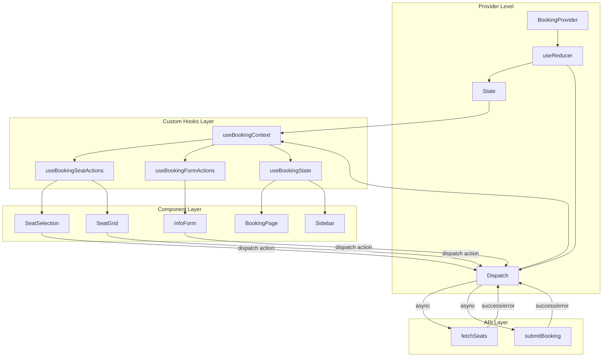
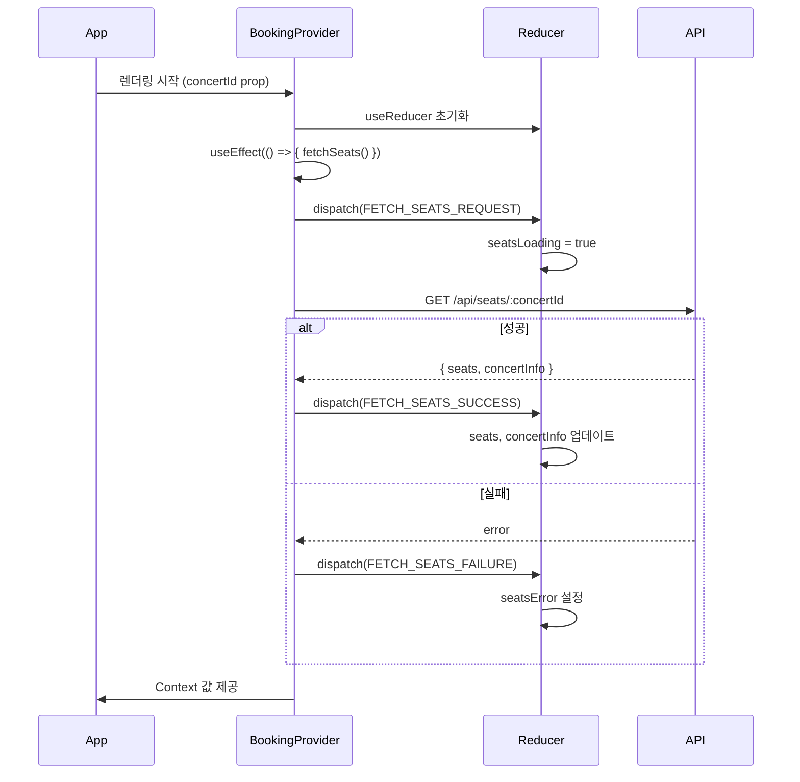
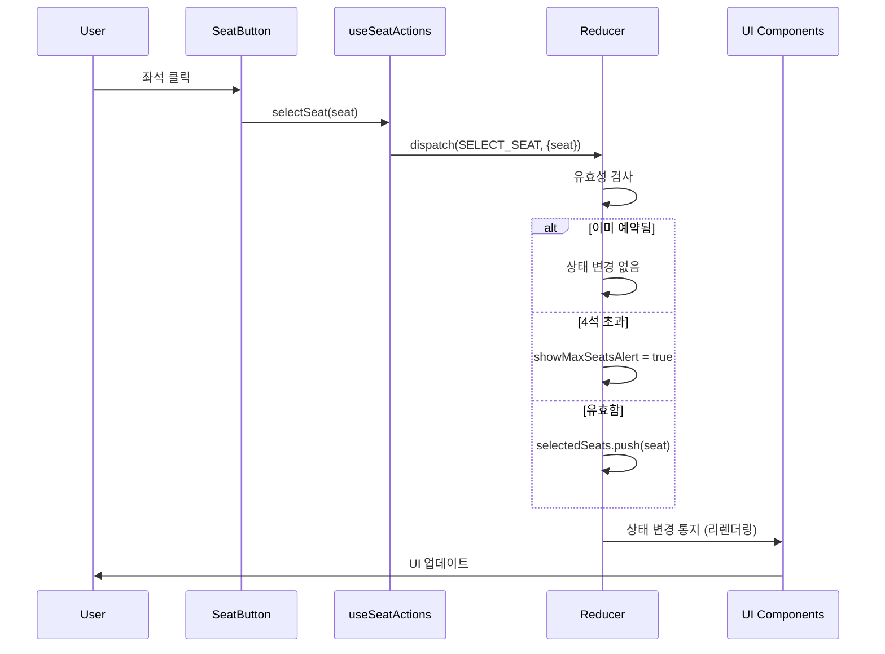
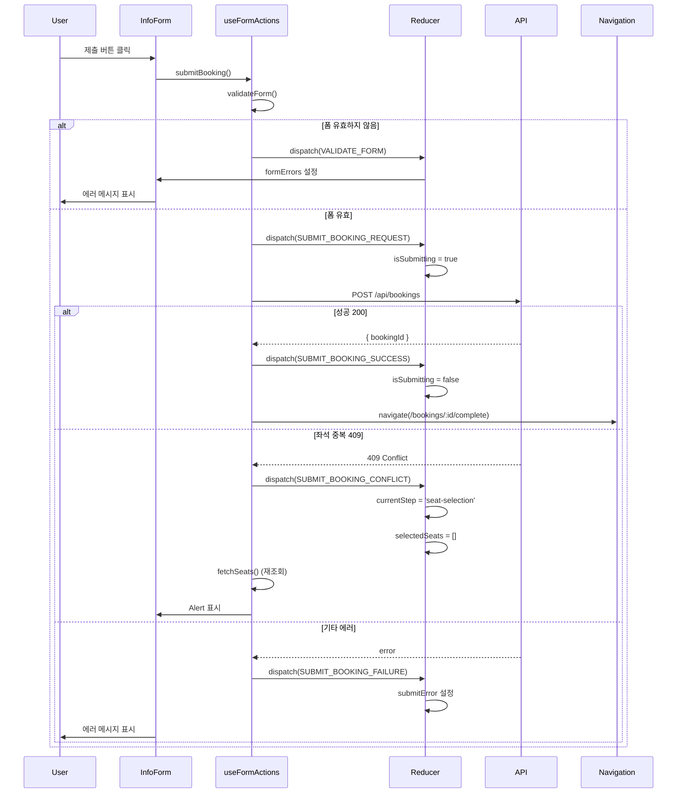
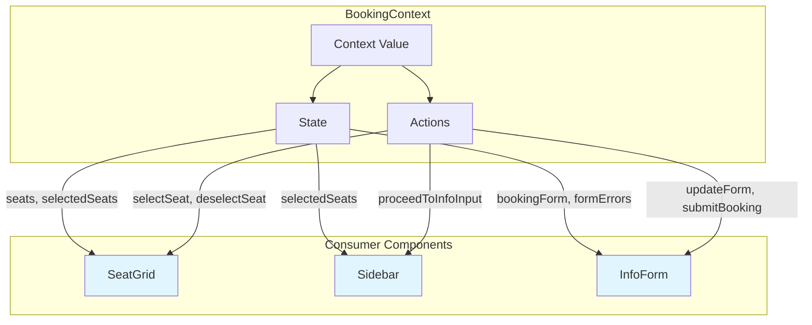
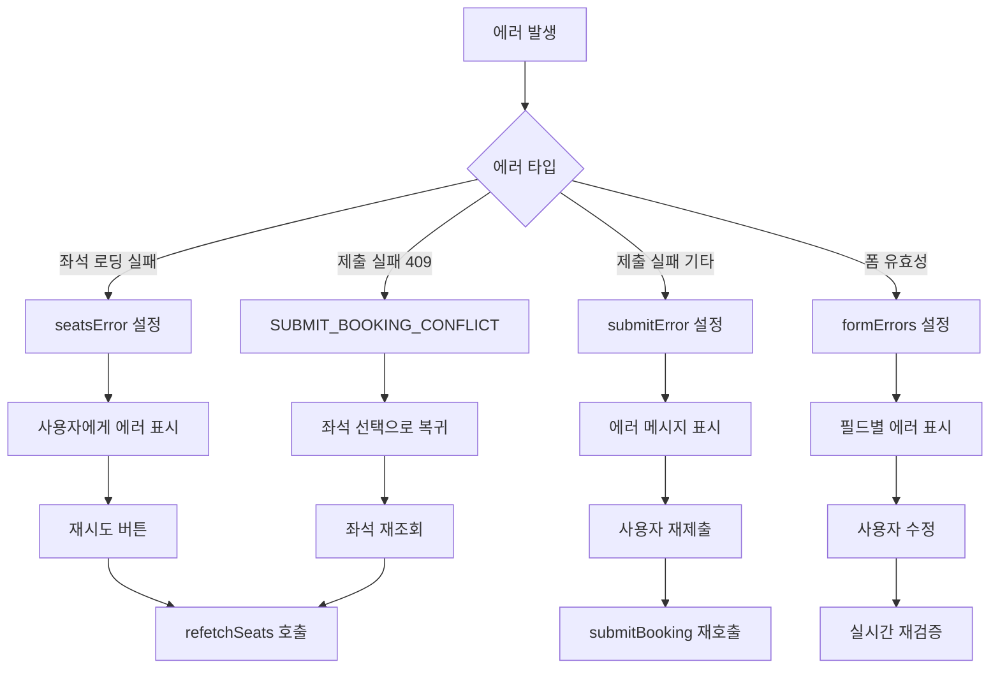

# 예약 페이지 Context + useReducer 설계

## 문서 정보
- **페이지**: `/concerts/:concertId/booking`
- **상태 관리 방식**: React Context API + useReducer
- **버전**: 1.0
- **최종 수정일**: 2025-10-13
- **작성자**: Development Team

---

## 목차
1. [Context 구조 설계](#1-context-구조-설계)
2. [Reducer 설계](#2-reducer-설계)
3. [Context 데이터 흐름](#3-context-데이터-흐름)
4. [공개 인터페이스](#4-공개-인터페이스)
5. [컴포넌트 구조 및 Context 사용](#5-컴포넌트-구조-및-context-사용)
6. [타입 정의](#6-타입-정의)

---

## 1. Context 구조 설계

### 1.1 Context 분리 전략

예약 페이지의 상태를 **단일 Context**로 관리하되, 논리적으로 구분합니다.

```
BookingContext
├── State (useReducer로 관리)
│   ├── 페이지 상태
│   ├── 콘서트 정보
│   ├── 좌석 데이터
│   ├── 선택된 좌석
│   ├── 예약 폼 데이터
│   └── UI 상태
│
└── Actions (dispatch 함수들)
    ├── 좌석 관련 액션
    ├── 폼 관련 액션
    ├── 단계 전환 액션
    └── API 호출 액션
```

**설계 근거:**
- 좌석 선택과 폼 입력이 밀접하게 연관되어 있음
- 단일 Context로 관리하여 prop drilling 방지
- Reducer로 복잡한 상태 전환 로직 중앙화

---

## 2. Reducer 설계

### 2.1 State 구조

```typescript
interface BookingState {
  // 페이지 레벨 상태
  currentStep: 'seat-selection' | 'info-input';
  isLoading: boolean;
  error: string | null;

  // 콘서트 정보
  concertInfo: ConcertInfo | null;

  // 좌석 데이터
  seats: Seat[];
  selectedSeats: Seat[];
  seatsLoading: boolean;
  seatsError: string | null;

  // 예약 폼 데이터
  bookingForm: BookingForm;
  formErrors: FormErrors;
  isSubmitting: boolean;
  submitError: string | null;

  // UI 상태
  showMaxSeatsAlert: boolean;
}
```

### 2.2 Action Types

```typescript
type BookingAction =
  // 페이지 초기화
  | { type: 'INIT_PAGE'; payload: { concertId: string } }

  // 좌석 데이터 로딩
  | { type: 'FETCH_SEATS_REQUEST' }
  | { type: 'FETCH_SEATS_SUCCESS'; payload: { seats: Seat[]; concertInfo: ConcertInfo } }
  | { type: 'FETCH_SEATS_FAILURE'; payload: { error: string } }

  // 좌석 선택/해제
  | { type: 'SELECT_SEAT'; payload: { seat: Seat } }
  | { type: 'DESELECT_SEAT'; payload: { seatId: string } }
  | { type: 'RESET_SELECTED_SEATS' }

  // 단계 전환
  | { type: 'SET_STEP'; payload: { step: 'seat-selection' | 'info-input' } }
  | { type: 'PROCEED_TO_INFO_INPUT' }
  | { type: 'BACK_TO_SEAT_SELECTION' }

  // 폼 입력
  | { type: 'UPDATE_FORM_FIELD'; payload: { field: keyof BookingForm; value: string } }
  | { type: 'VALIDATE_FORM' }
  | { type: 'SET_FORM_ERROR'; payload: { field: keyof BookingForm; error: string } }
  | { type: 'CLEAR_FORM_ERROR'; payload: { field: keyof BookingForm } }
  | { type: 'CLEAR_ALL_FORM_ERRORS' }

  // 예약 제출
  | { type: 'SUBMIT_BOOKING_REQUEST' }
  | { type: 'SUBMIT_BOOKING_SUCCESS'; payload: { bookingId: string } }
  | { type: 'SUBMIT_BOOKING_FAILURE'; payload: { error: string } }
  | { type: 'SUBMIT_BOOKING_CONFLICT' } // 좌석 중복

  // UI 상태
  | { type: 'SHOW_MAX_SEATS_ALERT' }
  | { type: 'HIDE_MAX_SEATS_ALERT' }

  // 에러 처리
  | { type: 'CLEAR_ERROR' }
  | { type: 'SET_ERROR'; payload: { error: string } };
```

### 2.3 Reducer 로직 개요

```typescript
function bookingReducer(state: BookingState, action: BookingAction): BookingState {
  switch (action.type) {
    case 'FETCH_SEATS_REQUEST':
      // seatsLoading = true, seatsError = null

    case 'FETCH_SEATS_SUCCESS':
      // seats 업데이트, concertInfo 설정, seatsLoading = false

    case 'SELECT_SEAT':
      // 유효성 검사 후 selectedSeats에 추가
      // 최대 4석 체크

    case 'DESELECT_SEAT':
      // selectedSeats에서 제거

    case 'PROCEED_TO_INFO_INPUT':
      // selectedSeats.length > 0 체크 후 currentStep 변경

    case 'UPDATE_FORM_FIELD':
      // bookingForm 필드 업데이트

    case 'VALIDATE_FORM':
      // 각 필드 검증 후 formErrors 설정

    case 'SUBMIT_BOOKING_REQUEST':
      // isSubmitting = true, submitError = null

    case 'SUBMIT_BOOKING_SUCCESS':
      // isSubmitting = false (페이지 이동은 Context 외부에서 처리)

    case 'SUBMIT_BOOKING_CONFLICT':
      // currentStep = 'seat-selection', selectedSeats = [], 좌석 재조회 필요

    // ... 나머지 케이스들
  }
}
```

---

## 3. Context 데이터 흐름

### 3.1 전체 데이터 흐름 아키텍처



### 3.2 Provider 초기화 흐름



### 3.3 좌석 선택 흐름



### 3.4 예약 제출 흐름



### 3.5 Context 값 구독 및 리렌더링 최적화



---

## 4. 공개 인터페이스

### 4.1 BookingContext 공개 값

Context를 통해 하위 컴포넌트에 노출되는 전체 인터페이스:

```typescript
interface BookingContextValue {
  // ===== 상태 (State) =====

  // 페이지 상태
  currentStep: 'seat-selection' | 'info-input';
  isLoading: boolean;
  error: string | null;

  // 콘서트 정보
  concertInfo: ConcertInfo | null;

  // 좌석 데이터
  seats: Seat[];
  selectedSeats: Seat[];
  seatsLoading: boolean;
  seatsError: string | null;

  // 예약 폼
  bookingForm: BookingForm;
  formErrors: FormErrors;
  isSubmitting: boolean;
  submitError: string | null;

  // UI 상태
  showMaxSeatsAlert: boolean;

  // ===== 파생 데이터 (Computed) =====
  selectedSeatsCount: number;
  isMaxSeatsReached: boolean;
  canProceedToInfoInput: boolean;
  isFormValid: boolean;
  availableSeatsCount: number;
  seatsBySection: { A: Seat[]; B: Seat[]; C: Seat[]; D: Seat[] };

  // ===== 액션 (Actions) =====

  // 좌석 관련
  selectSeat: (seat: Seat) => void;
  deselectSeat: (seatId: string) => void;
  resetSelectedSeats: () => void;

  // 단계 전환
  proceedToInfoInput: () => void;
  backToSeatSelection: () => void;

  // 폼 관련
  updateFormField: (field: keyof BookingForm, value: string) => void;
  validateForm: () => boolean;
  clearFormErrors: () => void;

  // 예약 제출
  submitBooking: () => Promise<void>;

  // 데이터 새로고침
  refetchSeats: () => Promise<void>;

  // 에러 처리
  clearError: () => void;

  // UI 제어
  hideMaxSeatsAlert: () => void;
}
```

### 4.2 Custom Hook으로 노출할 인터페이스

각 도메인별로 Custom Hook을 제공하여 컴포넌트가 필요한 것만 가져오도록 설계:

#### 4.2.1 `useBookingState` - 상태 읽기 전용

```typescript
interface UseBookingStateReturn {
  // 페이지 상태
  currentStep: 'seat-selection' | 'info-input';
  isLoading: boolean;
  error: string | null;

  // 콘서트 정보
  concertInfo: ConcertInfo | null;

  // 좌석 상태
  seats: Seat[];
  selectedSeats: Seat[];
  seatsLoading: boolean;
  seatsError: string | null;

  // 폼 상태
  bookingForm: BookingForm;
  formErrors: FormErrors;
  isSubmitting: boolean;
  submitError: string | null;

  // UI 상태
  showMaxSeatsAlert: boolean;

  // 파생 데이터
  selectedSeatsCount: number;
  isMaxSeatsReached: boolean;
  canProceedToInfoInput: boolean;
  isFormValid: boolean;
  availableSeatsCount: number;
  seatsBySection: { A: Seat[]; B: Seat[]; C: Seat[]; D: Seat[] };
}
```

**사용 컴포넌트:** 상태만 읽고 액션이 필요 없는 컴포넌트 (예: 읽기 전용 표시)

---

#### 4.2.2 `useBookingSeatActions` - 좌석 관련 액션

```typescript
interface UseBookingSeatActionsReturn {
  // 상태 (필요한 것만)
  seats: Seat[];
  selectedSeats: Seat[];
  seatsLoading: boolean;
  seatsError: string | null;
  isMaxSeatsReached: boolean;
  selectedSeatsCount: number;
  availableSeatsCount: number;
  seatsBySection: { A: Seat[]; B: Seat[]; C: Seat[]; D: Seat[] };

  // 액션
  selectSeat: (seat: Seat) => void;
  deselectSeat: (seatId: string) => void;
  resetSelectedSeats: () => void;
  refetchSeats: () => Promise<void>;
}
```

**사용 컴포넌트:**
- `SeatGrid` - 좌석 배치도
- `SeatButton` - 개별 좌석 버튼
- `SectionGroup` - 구역별 좌석 그룹

---

#### 4.2.3 `useBookingFormActions` - 폼 관련 액션

```typescript
interface UseBookingFormActionsReturn {
  // 상태
  bookingForm: BookingForm;
  formErrors: FormErrors;
  isSubmitting: boolean;
  submitError: string | null;
  isFormValid: boolean;
  selectedSeats: Seat[]; // 폼에서 선택된 좌석 표시용

  // 액션
  updateFormField: (field: keyof BookingForm, value: string) => void;
  validateForm: () => boolean;
  clearFormErrors: () => void;
  submitBooking: () => Promise<void>;
}
```

**사용 컴포넌트:**
- `InfoForm` - 정보입력 폼
- `FormInput` - 개별 입력 필드
- `SubmitButton` - 제출 버튼

---

#### 4.2.4 `useBookingStepControl` - 단계 전환 제어

```typescript
interface UseBookingStepControlReturn {
  // 상태
  currentStep: 'seat-selection' | 'info-input';
  canProceedToInfoInput: boolean;
  selectedSeatsCount: number;

  // 액션
  proceedToInfoInput: () => void;
  backToSeatSelection: () => void;
}
```

**사용 컴포넌트:**
- `Sidebar` - 예약하기 버튼
- `StepIndicator` - 단계 표시
- `BackButton` - 뒤로가기 버튼

---

#### 4.2.5 `useBookingUIControl` - UI 상태 제어

```typescript
interface UseBookingUIControlReturn {
  // 상태
  showMaxSeatsAlert: boolean;
  error: string | null;

  // 액션
  hideMaxSeatsAlert: () => void;
  clearError: () => void;
}
```

**사용 컴포넌트:**
- `MaxSeatsAlertToast` - 최대 선택 알림
- `ErrorBanner` - 에러 배너
- `LoadingSpinner` - 로딩 표시

---

### 4.3 노출 변수 및 함수 전체 목록

#### 상태 변수 (읽기 전용)

| 변수명 | 타입 | 설명 | 노출 대상 |
|--------|------|------|----------|
| `currentStep` | `'seat-selection' \| 'info-input'` | 현재 예약 단계 | 전체 |
| `isLoading` | `boolean` | 페이지 레벨 로딩 | 전체 |
| `error` | `string \| null` | 페이지 레벨 에러 | 전체 |
| `concertInfo` | `ConcertInfo \| null` | 콘서트 정보 | 전체 |
| `seats` | `Seat[]` | 전체 좌석 배치도 | Seat 관련 컴포넌트 |
| `selectedSeats` | `Seat[]` | 선택된 좌석 목록 | 전체 |
| `seatsLoading` | `boolean` | 좌석 로딩 중 | Seat 관련 컴포넌트 |
| `seatsError` | `string \| null` | 좌석 조회 에러 | Seat 관련 컴포넌트 |
| `bookingForm` | `BookingForm` | 예약자 정보 폼 | Form 관련 컴포넌트 |
| `formErrors` | `FormErrors` | 폼 유효성 에러 | Form 관련 컴포넌트 |
| `isSubmitting` | `boolean` | 예약 제출 중 | Form 관련 컴포넌트 |
| `submitError` | `string \| null` | 제출 에러 | Form 관련 컴포넌트 |
| `showMaxSeatsAlert` | `boolean` | 최대 선택 알림 표시 | UI 컴포넌트 |

#### 파생 데이터 (Computed)

| 변수명 | 타입 | 계산 방법 | 노출 대상 |
|--------|------|-----------|----------|
| `selectedSeatsCount` | `number` | `selectedSeats.length` | 전체 |
| `isMaxSeatsReached` | `boolean` | `selectedSeats.length >= 4` | Seat 관련 |
| `canProceedToInfoInput` | `boolean` | `selectedSeats.length > 0` | Step 관련 |
| `isFormValid` | `boolean` | 모든 필드 유효성 검사 | Form 관련 |
| `availableSeatsCount` | `number` | `seats.filter(s => !s.is_reserved).length` | Seat 관련 |
| `seatsBySection` | `object` | 구역별 좌석 그룹화 | Seat 관련 |

#### 액션 함수

| 함수명 | 파라미터 | 반환값 | 설명 | 노출 대상 |
|--------|----------|--------|------|----------|
| `selectSeat` | `(seat: Seat)` | `void` | 좌석 선택 | Seat 관련 |
| `deselectSeat` | `(seatId: string)` | `void` | 좌석 선택 해제 | Seat 관련 |
| `resetSelectedSeats` | `()` | `void` | 선택 좌석 초기화 | Seat 관련 |
| `proceedToInfoInput` | `()` | `void` | 정보입력 단계로 이동 | Step 관련 |
| `backToSeatSelection` | `()` | `void` | 좌석 선택 단계로 복귀 | Step 관련 |
| `updateFormField` | `(field, value)` | `void` | 폼 필드 업데이트 | Form 관련 |
| `validateForm` | `()` | `boolean` | 폼 유효성 검사 | Form 관련 |
| `clearFormErrors` | `()` | `void` | 폼 에러 초기화 | Form 관련 |
| `submitBooking` | `()` | `Promise<void>` | 예약 제출 | Form 관련 |
| `refetchSeats` | `()` | `Promise<void>` | 좌석 재조회 | Seat 관련 |
| `clearError` | `()` | `void` | 에러 초기화 | UI 관련 |
| `hideMaxSeatsAlert` | `()` | `void` | 최대 선택 알림 숨김 | UI 관련 |

---

## 5. 컴포넌트 구조 및 Context 사용

### 5.1 컴포넌트 트리 구조

```
BookingProvider (Context Provider)
│
└── BookingPage
    │
    ├── LoadingSpinner (isLoading)
    │   └── uses: useBookingState()
    │
    ├── ErrorBanner (error)
    │   └── uses: useBookingUIControl()
    │
    ├── ConcertInfoHeader (concertInfo)
    │   └── uses: useBookingState()
    │
    ├── StepIndicator (currentStep)
    │   └── uses: useBookingState()
    │
    ├── [currentStep === 'seat-selection'] SeatSelectionStep
    │   │
    │   ├── SeatGrid
    │   │   │   └── uses: useBookingSeatActions()
    │   │   │
    │   │   └── SectionGroup (A, B, C, D)
    │   │       │   └── uses: seatsBySection
    │   │       │
    │   │       └── SeatButton (각 좌석)
    │   │           └── uses: selectSeat, deselectSeat
    │   │
    │   └── Sidebar
    │       │   └── uses: useBookingSeatActions() + useBookingStepControl()
    │       │
    │       ├── AvailableSeatsInfo (availableSeatsCount)
    │       ├── SelectedSeatsList (selectedSeats)
    │       │   └── SeatItem
    │       │       └── uses: deselectSeat
    │       └── ProceedButton
    │           └── uses: proceedToInfoInput, canProceedToInfoInput
    │
    ├── [currentStep === 'info-input'] InfoInputStep
    │   │
    │   ├── BackButton
    │   │   └── uses: useBookingStepControl()
    │   │
    │   ├── SelectedSeatsSummary (selectedSeats - 읽기 전용)
    │   │   └── uses: useBookingState()
    │   │
    │   └── InfoForm
    │       │   └── uses: useBookingFormActions()
    │       │
    │       ├── FormInput (name)
    │       │   └── uses: bookingForm, formErrors, updateFormField
    │       │
    │       ├── FormInput (phone)
    │       │   └── uses: bookingForm, formErrors, updateFormField
    │       │
    │       ├── FormInput (password)
    │       │   └── uses: bookingForm, formErrors, updateFormField
    │       │
    │       ├── ErrorMessage (submitError)
    │       │
    │       └── SubmitButton
    │           └── uses: submitBooking, isSubmitting, isFormValid
    │
    └── MaxSeatsAlertToast (showMaxSeatsAlert)
        └── uses: useBookingUIControl()
```

### 5.2 컴포넌트별 Context 사용 패턴

#### 예시 1: SeatButton 컴포넌트

```typescript
// 좌석 버튼 컴포넌트
// 필요한 것: seat 데이터, selectedSeats, selectSeat, deselectSeat

function SeatButton({ seat }: { seat: Seat }) {
  const { selectedSeats, selectSeat, deselectSeat, isMaxSeatsReached }
    = useBookingSeatActions();

  const isSelected = selectedSeats.some(s => s.id === seat.id);
  const isDisabled = seat.is_reserved || (!isSelected && isMaxSeatsReached);

  const handleClick = () => {
    if (isSelected) {
      deselectSeat(seat.id);
    } else {
      selectSeat(seat);
    }
  };

  return (
    <button
      onClick={handleClick}
      disabled={isDisabled}
      className={isSelected ? 'selected' : ''}
    >
      {seat.row}-{seat.seat_column}
    </button>
  );
}
```

#### 예시 2: InfoForm 컴포넌트

```typescript
// 정보입력 폼 컴포넌트
// 필요한 것: bookingForm, formErrors, updateFormField, submitBooking

function InfoForm() {
  const {
    bookingForm,
    formErrors,
    isSubmitting,
    isFormValid,
    updateFormField,
    submitBooking,
  } = useBookingFormActions();

  const handleSubmit = async (e: FormEvent) => {
    e.preventDefault();
    await submitBooking();
  };

  return (
    <form onSubmit={handleSubmit}>
      <input
        value={bookingForm.name}
        onChange={(e) => updateFormField('name', e.target.value)}
      />
      {formErrors.name && <span>{formErrors.name}</span>}

      {/* phone, password 동일 */}

      <button type="submit" disabled={!isFormValid || isSubmitting}>
        {isSubmitting ? '예약 중...' : '예약하기'}
      </button>
    </form>
  );
}
```

#### 예시 3: Sidebar 컴포넌트

```typescript
// 사이드바 컴포넌트
// 필요한 것: selectedSeats, availableSeatsCount, deselectSeat, proceedToInfoInput

function Sidebar() {
  const {
    selectedSeats,
    availableSeatsCount,
    deselectSeat,
  } = useBookingSeatActions();

  const {
    canProceedToInfoInput,
    proceedToInfoInput,
  } = useBookingStepControl();

  return (
    <aside>
      <p>남은 좌석: {availableSeatsCount}석</p>

      <h3>선택된 좌석 ({selectedSeats.length}석)</h3>
      <ul>
        {selectedSeats.map(seat => (
          <li key={seat.id}>
            {seat.section}구역 {seat.row}행 {seat.seat_column}열
            <button onClick={() => deselectSeat(seat.id)}>X</button>
          </li>
        ))}
      </ul>

      <button
        onClick={proceedToInfoInput}
        disabled={!canProceedToInfoInput}
      >
        예약하기
      </button>
    </aside>
  );
}
```

---

## 6. 타입 정의

### 6.1 기본 타입

```typescript
// 좌석 타입
interface Seat {
  id: string;
  section: 'A' | 'B' | 'C' | 'D';
  row: number; // 1-20
  seat_column: number; // 1-4
  is_reserved: boolean;
}

// 콘서트 정보 타입
interface ConcertInfo {
  id: string;
  title: string;
  event_date: string;
  location: string;
  available_seats: number;
  total_seats: number;
}

// 예약 폼 타입
interface BookingForm {
  name: string;
  phone: string;
  password: string;
}

// 폼 에러 타입
interface FormErrors {
  name?: string;
  phone?: string;
  password?: string;
}
```

### 6.2 State 타입

```typescript
interface BookingState {
  // 페이지 상태
  currentStep: 'seat-selection' | 'info-input';
  isLoading: boolean;
  error: string | null;

  // 콘서트 정보
  concertInfo: ConcertInfo | null;

  // 좌석 데이터
  seats: Seat[];
  selectedSeats: Seat[];
  seatsLoading: boolean;
  seatsError: string | null;

  // 예약 폼
  bookingForm: BookingForm;
  formErrors: FormErrors;
  isSubmitting: boolean;
  submitError: string | null;

  // UI 상태
  showMaxSeatsAlert: boolean;
}
```

### 6.3 Action 타입 (전체)

```typescript
type BookingAction =
  // 초기화
  | { type: 'INIT_PAGE'; payload: { concertId: string } }

  // 좌석 로딩
  | { type: 'FETCH_SEATS_REQUEST' }
  | { type: 'FETCH_SEATS_SUCCESS'; payload: { seats: Seat[]; concertInfo: ConcertInfo } }
  | { type: 'FETCH_SEATS_FAILURE'; payload: { error: string } }

  // 좌석 선택
  | { type: 'SELECT_SEAT'; payload: { seat: Seat } }
  | { type: 'DESELECT_SEAT'; payload: { seatId: string } }
  | { type: 'RESET_SELECTED_SEATS' }

  // 단계 전환
  | { type: 'SET_STEP'; payload: { step: 'seat-selection' | 'info-input' } }
  | { type: 'PROCEED_TO_INFO_INPUT' }
  | { type: 'BACK_TO_SEAT_SELECTION' }

  // 폼 입력
  | { type: 'UPDATE_FORM_FIELD'; payload: { field: keyof BookingForm; value: string } }
  | { type: 'VALIDATE_FORM' }
  | { type: 'SET_FORM_ERROR'; payload: { field: keyof BookingForm; error: string } }
  | { type: 'CLEAR_FORM_ERROR'; payload: { field: keyof BookingForm } }
  | { type: 'CLEAR_ALL_FORM_ERRORS' }

  // 예약 제출
  | { type: 'SUBMIT_BOOKING_REQUEST' }
  | { type: 'SUBMIT_BOOKING_SUCCESS'; payload: { bookingId: string } }
  | { type: 'SUBMIT_BOOKING_FAILURE'; payload: { error: string } }
  | { type: 'SUBMIT_BOOKING_CONFLICT' }

  // UI 상태
  | { type: 'SHOW_MAX_SEATS_ALERT' }
  | { type: 'HIDE_MAX_SEATS_ALERT' }

  // 에러 처리
  | { type: 'CLEAR_ERROR' }
  | { type: 'SET_ERROR'; payload: { error: string } };
```

### 6.4 Context Value 타입

```typescript
interface BookingContextValue {
  // 상태
  state: BookingState;

  // 파생 데이터
  derived: {
    selectedSeatsCount: number;
    isMaxSeatsReached: boolean;
    canProceedToInfoInput: boolean;
    isFormValid: boolean;
    availableSeatsCount: number;
    seatsBySection: { A: Seat[]; B: Seat[]; C: Seat[]; D: Seat[] };
  };

  // 액션
  actions: {
    // 좌석 관련
    selectSeat: (seat: Seat) => void;
    deselectSeat: (seatId: string) => void;
    resetSelectedSeats: () => void;

    // 단계 전환
    proceedToInfoInput: () => void;
    backToSeatSelection: () => void;

    // 폼 관련
    updateFormField: (field: keyof BookingForm, value: string) => void;
    validateForm: () => boolean;
    clearFormErrors: () => void;

    // 예약 제출
    submitBooking: () => Promise<void>;

    // 데이터 새로고침
    refetchSeats: () => Promise<void>;

    // 에러 처리
    clearError: () => void;

    // UI 제어
    hideMaxSeatsAlert: () => void;
  };
}
```

---

## 7. Provider 구현 개요

### 7.1 Provider 구조

```typescript
interface BookingProviderProps {
  concertId: string;
  children: React.ReactNode;
}

// Provider 컴포넌트
function BookingProvider({ concertId, children }: BookingProviderProps) {
  // 1. useReducer로 상태 관리
  const [state, dispatch] = useReducer(bookingReducer, initialState);

  // 2. useEffect로 초기 데이터 로딩
  useEffect(() => {
    fetchSeats(concertId);
  }, [concertId]);

  // 3. 파생 데이터 계산 (useMemo)
  const derived = useMemo(() => ({
    selectedSeatsCount: state.selectedSeats.length,
    isMaxSeatsReached: state.selectedSeats.length >= 4,
    canProceedToInfoInput: state.selectedSeats.length > 0,
    isFormValid: validateFormFields(state.bookingForm, state.formErrors),
    availableSeatsCount: state.seats.filter(s => !s.is_reserved).length,
    seatsBySection: groupSeatsBySection(state.seats),
  }), [state.seats, state.selectedSeats, state.bookingForm, state.formErrors]);

  // 4. 액션 함수들 (useCallback)
  const actions = useMemo(() => ({
    selectSeat: (seat: Seat) => { /* ... */ },
    deselectSeat: (seatId: string) => { /* ... */ },
    // ... 나머지 액션들
  }), [dispatch, state]);

  // 5. Context value 생성
  const value = useMemo(() => ({
    state,
    derived,
    actions,
  }), [state, derived, actions]);

  // 6. Provider 렌더링
  return (
    <BookingContext.Provider value={value}>
      {children}
    </BookingContext.Provider>
  );
}
```

### 7.2 API 호출 함수 (Provider 내부)

```typescript
// Provider 내부에서 사용할 API 호출 함수들

async function fetchSeats(concertId: string) {
  dispatch({ type: 'FETCH_SEATS_REQUEST' });

  try {
    const response = await fetch(`/api/concerts/${concertId}/seats`);

    if (!response.ok) {
      throw new Error('좌석 정보를 불러오는데 실패했습니다.');
    }

    const data = await response.json();

    dispatch({
      type: 'FETCH_SEATS_SUCCESS',
      payload: {
        seats: data.seats,
        concertInfo: data.concertInfo,
      },
    });
  } catch (error) {
    dispatch({
      type: 'FETCH_SEATS_FAILURE',
      payload: { error: error.message },
    });
  }
}

async function submitBooking() {
  const isValid = validateForm();
  if (!isValid) return;

  dispatch({ type: 'SUBMIT_BOOKING_REQUEST' });

  try {
    const response = await fetch('/api/bookings', {
      method: 'POST',
      headers: { 'Content-Type': 'application/json' },
      body: JSON.stringify({
        concertId: state.concertInfo?.id,
        seatIds: state.selectedSeats.map(s => s.id),
        name: state.bookingForm.name,
        phone: state.bookingForm.phone,
        password: state.bookingForm.password,
      }),
    });

    if (response.status === 409) {
      // 좌석 중복
      dispatch({ type: 'SUBMIT_BOOKING_CONFLICT' });
      await fetchSeats(state.concertInfo!.id);
      alert('이미 예약된 좌석입니다.');
      return;
    }

    if (!response.ok) {
      throw new Error('예약에 실패했습니다.');
    }

    const data = await response.json();

    dispatch({
      type: 'SUBMIT_BOOKING_SUCCESS',
      payload: { bookingId: data.bookingId },
    });

    // 페이지 이동 (Provider 외부에서 처리하거나 여기서 처리)
    // navigate(`/bookings/${data.bookingId}/complete`);
  } catch (error) {
    dispatch({
      type: 'SUBMIT_BOOKING_FAILURE',
      payload: { error: error.message },
    });
  }
}
```

---

## 8. 최적화 전략

### 8.1 리렌더링 최적화

```typescript
// 1. Context Value를 useMemo로 메모이제이션
const value = useMemo(() => ({
  state,
  derived,
  actions,
}), [state, derived, actions]);

// 2. 액션 함수들을 useCallback으로 메모이제이션
const selectSeat = useCallback((seat: Seat) => {
  dispatch({ type: 'SELECT_SEAT', payload: { seat } });
}, []);

// 3. 파생 데이터를 useMemo로 계산
const seatsBySection = useMemo(() => {
  return groupSeatsBySection(state.seats);
}, [state.seats]);
```

### 8.2 Context 분리 고려사항

현재는 단일 Context로 설계했지만, 성능 이슈가 발생할 경우 다음과 같이 분리 가능:

```typescript
// 옵션 1: 상태와 액션 분리
<BookingStateContext.Provider value={state}>
  <BookingActionsContext.Provider value={actions}>
    {children}
  </BookingActionsContext.Provider>
</BookingStateContext.Provider>

// 옵션 2: 도메인별 분리
<SeatContext.Provider value={seatContextValue}>
  <FormContext.Provider value={formContextValue}>
    {children}
  </FormContext.Provider>
</SeatContext.Provider>
```

**현재 설계에서는 단일 Context 유지 권장:**
- 예약 페이지의 모든 상태가 밀접하게 연관됨
- 좌석 선택 → 폼 입력이 하나의 플로우
- 성능 이슈는 useMemo, useCallback으로 충분히 해결 가능

---

## 9. 에러 처리 전략

### 9.1 에러 레벨별 처리

```typescript
// 1. 페이지 레벨 에러 (치명적)
state.error: string | null
→ 전체 페이지에 에러 배너 표시
→ 사용자에게 홈으로 돌아가기 또는 재시도 옵션 제공

// 2. 좌석 로딩 에러
state.seatsError: string | null
→ 좌석 배치도 영역에 에러 메시지 표시
→ 재시도 버튼 제공

// 3. 예약 제출 에러
state.submitError: string | null
→ 폼 하단에 에러 메시지 표시
→ 사용자 입력 데이터 유지
→ 재제출 가능

// 4. 폼 유효성 에러
state.formErrors: FormErrors
→ 각 입력 필드 아래 개별 에러 메시지 표시
→ 실시간 검증
```

### 9.2 에러 복구 플로우



---

## 부록: Reducer 전체 케이스 목록

### A. Reducer Switch Cases 개요

```typescript
function bookingReducer(state: BookingState, action: BookingAction): BookingState {
  switch (action.type) {
    // === 좌석 로딩 ===
    case 'FETCH_SEATS_REQUEST':
      return { ...state, seatsLoading: true, seatsError: null };

    case 'FETCH_SEATS_SUCCESS':
      return {
        ...state,
        seats: action.payload.seats,
        concertInfo: action.payload.concertInfo,
        seatsLoading: false,
        seatsError: null,
      };

    case 'FETCH_SEATS_FAILURE':
      return {
        ...state,
        seatsLoading: false,
        seatsError: action.payload.error,
      };

    // === 좌석 선택 ===
    case 'SELECT_SEAT': {
      const { seat } = action.payload;

      // 이미 예약된 좌석
      if (seat.is_reserved) return state;

      // 이미 선택된 좌석
      if (state.selectedSeats.some(s => s.id === seat.id)) return state;

      // 최대 4석 체크
      if (state.selectedSeats.length >= 4) {
        return { ...state, showMaxSeatsAlert: true };
      }

      return {
        ...state,
        selectedSeats: [...state.selectedSeats, seat],
      };
    }

    case 'DESELECT_SEAT':
      return {
        ...state,
        selectedSeats: state.selectedSeats.filter(
          s => s.id !== action.payload.seatId
        ),
      };

    case 'RESET_SELECTED_SEATS':
      return { ...state, selectedSeats: [] };

    // === 단계 전환 ===
    case 'PROCEED_TO_INFO_INPUT':
      if (state.selectedSeats.length === 0) return state;
      return { ...state, currentStep: 'info-input' };

    case 'BACK_TO_SEAT_SELECTION':
      return { ...state, currentStep: 'seat-selection' };

    // === 폼 입력 ===
    case 'UPDATE_FORM_FIELD':
      return {
        ...state,
        bookingForm: {
          ...state.bookingForm,
          [action.payload.field]: action.payload.value,
        },
      };

    case 'VALIDATE_FORM': {
      const errors: FormErrors = {};

      if (!state.bookingForm.name.trim()) {
        errors.name = '예약자명을 입력해주세요';
      }

      if (!/^010\d{8}$/.test(state.bookingForm.phone.replace(/-/g, ''))) {
        errors.phone = '올바른 휴대폰번호를 입력해주세요';
      }

      if (!/^\d{4}$/.test(state.bookingForm.password)) {
        errors.password = '4자리 숫자를 입력해주세요';
      }

      return { ...state, formErrors: errors };
    }

    case 'CLEAR_ALL_FORM_ERRORS':
      return { ...state, formErrors: {} };

    // === 예약 제출 ===
    case 'SUBMIT_BOOKING_REQUEST':
      return { ...state, isSubmitting: true, submitError: null };

    case 'SUBMIT_BOOKING_SUCCESS':
      return { ...state, isSubmitting: false };

    case 'SUBMIT_BOOKING_FAILURE':
      return {
        ...state,
        isSubmitting: false,
        submitError: action.payload.error,
      };

    case 'SUBMIT_BOOKING_CONFLICT':
      return {
        ...state,
        isSubmitting: false,
        currentStep: 'seat-selection',
        selectedSeats: [],
        submitError: '이미 예약된 좌석입니다',
      };

    // === UI 상태 ===
    case 'SHOW_MAX_SEATS_ALERT':
      return { ...state, showMaxSeatsAlert: true };

    case 'HIDE_MAX_SEATS_ALERT':
      return { ...state, showMaxSeatsAlert: false };

    // === 에러 처리 ===
    case 'CLEAR_ERROR':
      return { ...state, error: null };

    default:
      return state;
  }
}
```

---

**문서 버전**: 1.0
**최종 수정일**: 2025-10-13
**작성자**: Development Team
