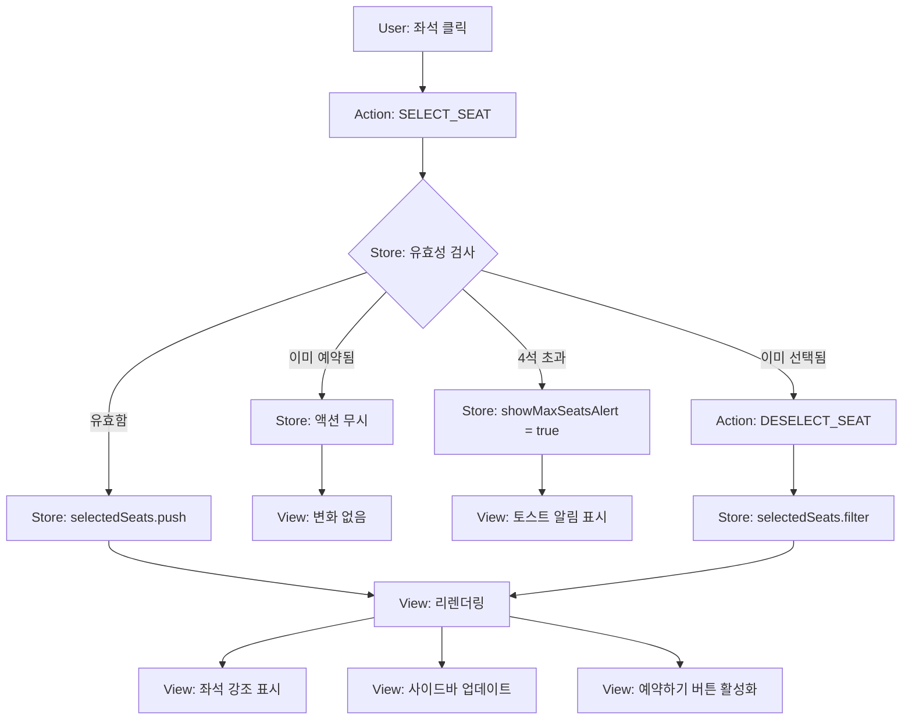
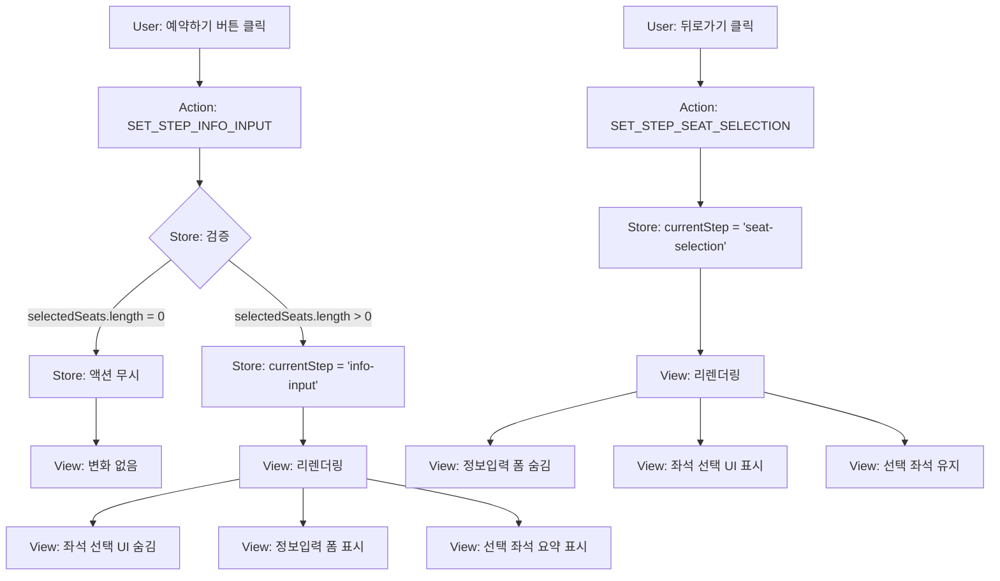
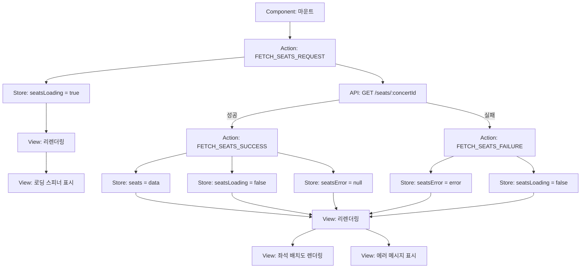
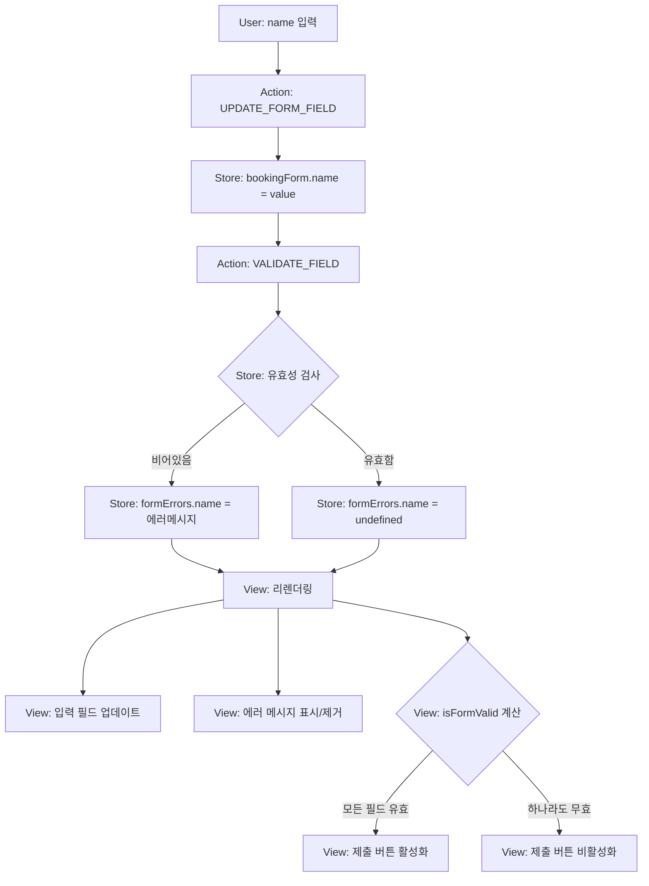
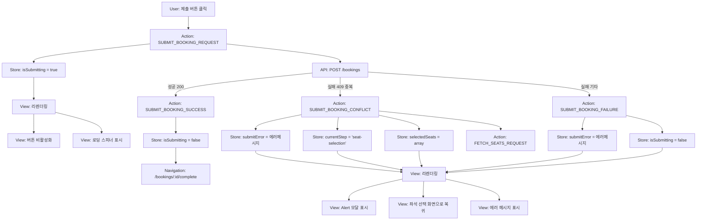
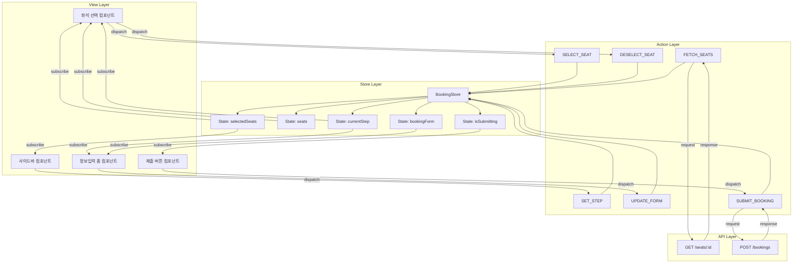
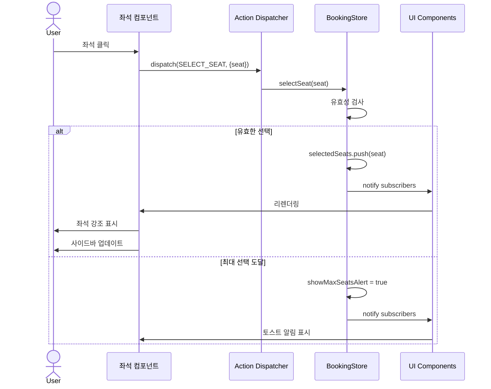
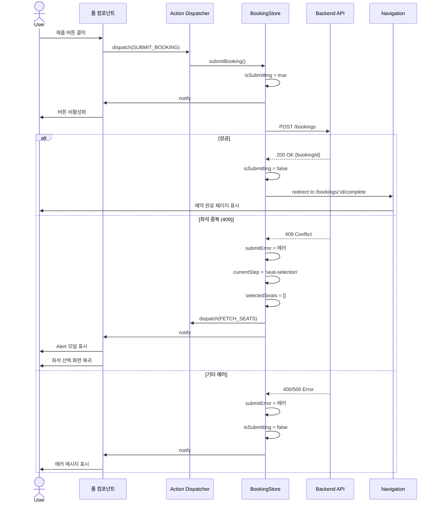

# 예약 페이지 상태 관리 설계

## 문서 정보
- **페이지**: `/concerts/:concertId/booking`
- **버전**: 1.0
- **최종 수정일**: 2025-10-13
- **작성자**: Development Team

---

## 목차
1. [관리해야 할 상태 데이터](#1-관리해야-할-상태-데이터)
2. [화면상 데이터지만 상태가 아닌 것](#2-화면상-데이터지만-상태가-아닌-것)
3. [상태 변경 조건 및 화면 변화](#3-상태-변경-조건-및-화면-변화)
4. [상태 관리 구조](#4-상태-관리-구조)
5. [상태 다이어그램](#5-상태-다이어그램)

---

## 1. 관리해야 할 상태 데이터

### 1.1 페이지 레벨 상태

| 상태명 | 타입 | 초기값 | 설명 |
|--------|------|--------|------|
| `currentStep` | `'seat-selection' \| 'info-input'` | `'seat-selection'` | 현재 예약 진행 단계 |
| `isLoading` | `boolean` | `false` | 데이터 로딩 중 여부 |
| `error` | `string \| null` | `null` | 에러 메시지 (페이지 레벨 에러) |

### 1.2 콘서트 정보 상태

| 상태명 | 타입 | 초기값 | 설명 |
|--------|------|--------|------|
| `concertId` | `string` | URL에서 추출 | 콘서트 ID |
| `concertInfo` | `ConcertInfo \| null` | `null` | 콘서트 기본 정보 (제목, 일시, 장소) |

```typescript
type ConcertInfo = {
  id: string;
  title: string;
  event_date: string;
  location: string;
  available_seats: number;
  total_seats: number;
}
```

### 1.3 좌석 데이터 상태

| 상태명 | 타입 | 초기값 | 설명 |
|--------|------|--------|------|
| `seats` | `Seat[]` | `[]` | 전체 좌석 배치도 데이터 (320석) |
| `selectedSeats` | `Seat[]` | `[]` | 사용자가 선택한 좌석 목록 (최대 4석) |
| `seatsLoading` | `boolean` | `false` | 좌석 데이터 로딩 중 여부 |
| `seatsError` | `string \| null` | `null` | 좌석 조회 에러 메시지 |

```typescript
type Seat = {
  id: string;
  section: 'A' | 'B' | 'C' | 'D';
  row: number; // 1-20
  seat_column: number; // 1-4
  is_reserved: boolean;
}
```

### 1.4 예약자 정보 입력 상태

| 상태명 | 타입 | 초기값 | 설명 |
|--------|------|--------|------|
| `bookingForm` | `BookingForm` | 초기 빈 값 | 예약자 정보 입력 폼 데이터 |
| `formErrors` | `FormErrors` | 초기 빈 객체 | 각 필드별 유효성 검증 에러 |
| `isSubmitting` | `boolean` | `false` | 예약 제출 중 여부 |
| `submitError` | `string \| null` | `null` | 예약 제출 에러 메시지 |

```typescript
type BookingForm = {
  name: string;
  phone: string;
  password: string;
}

type FormErrors = {
  name?: string;
  phone?: string;
  password?: string;
}
```

### 1.5 UI 상태

| 상태명 | 타입 | 초기값 | 설명 |
|--------|------|--------|------|
| `showMaxSeatsAlert` | `boolean` | `false` | 최대 좌석 선택 도달 알림 표시 여부 |
| `hoveredSeat` | `string \| null` | `null` | 마우스 호버 중인 좌석 ID (선택사항) |

---

## 2. 화면상 데이터지만 상태가 아닌 것

이들은 **상태로부터 파생되는(derived) 값**으로, 별도로 상태로 관리하지 않고 계산/변환하여 사용합니다.

### 2.1 파생 데이터 (Derived Data)

| 데이터명 | 타입 | 계산 방법 | 용도 |
|----------|------|-----------|------|
| `selectedSeatsCount` | `number` | `selectedSeats.length` | 선택된 좌석 개수 |
| `isMaxSeatsReached` | `boolean` | `selectedSeats.length >= 4` | 최대 선택 도달 여부 |
| `canProceedToInfo` | `boolean` | `selectedSeats.length > 0 && selectedSeats.length <= 4` | 정보입력 단계 진행 가능 여부 |
| `isSubmitDisabled` | `boolean` | `!isFormValid \|\| isSubmitting` | 제출 버튼 비활성화 여부 |
| `isFormValid` | `boolean` | 모든 필드 유효성 검사 통과 여부 | 폼 유효성 상태 |
| `seatsBySection` | `{ A: Seat[], B: Seat[], C: Seat[], D: Seat[] }` | `seats`를 구역별로 그룹화 | 좌석 배치도 렌더링 |
| `availableSeatsCount` | `number` | `seats.filter(s => !s.is_reserved).length` | 남은 좌석 수 표시 |

### 2.2 정적 데이터 (Static Data)

| 데이터명 | 값 | 설명 |
|----------|-----|------|
| `MAX_SEATS_PER_BOOKING` | `4` | 한 예약당 최대 선택 가능 좌석 수 |
| `TOTAL_SEATS` | `320` | 전체 좌석 수 (4구역 × 20행 × 4열) |
| `SECTIONS` | `['A', 'B', 'C', 'D']` | 좌석 구역 목록 |
| `ROWS_PER_SECTION` | `20` | 구역당 행 수 |
| `COLUMNS_PER_ROW` | `4` | 행당 열 수 |

### 2.3 컴포넌트 로컬 상태 (상위 상태 관리 불필요)

| 데이터명 | 설명 |
|----------|------|
| 입력 필드의 focus 상태 | 각 input의 포커스 여부 |
| 툴팁/호버 상태 | 좌석 호버 시 임시 툴팁 표시 |
| 애니메이션 상태 | 트랜지션 진행 상태 |

---

## 3. 상태 변경 조건 및 화면 변화

### 3.1 `currentStep` (예약 단계)

| 현재 상태 | 변경 조건 | 변경 후 상태 | 화면 변화 |
|-----------|----------|-------------|----------|
| `'seat-selection'` | 우측 사이드바의 "예약하기" 버튼 클릭 (조건: `selectedSeats.length > 0`) | `'info-input'` | • 좌석 선택 UI 숨김<br>• 정보입력 폼 표시<br>• 선택된 좌석 요약 정보 표시 (읽기 전용)<br>• 뒤로가기 버튼 활성화 |
| `'info-input'` | 뒤로가기 버튼 클릭 또는 브라우저 뒤로가기 | `'seat-selection'` | • 정보입력 폼 숨김<br>• 좌석 선택 UI 표시<br>• 선택된 좌석 유지 (초기화 안 함)<br>• 입력했던 정보는 유지 (선택사항) |
| `'info-input'` | 예약 제출 성공 | - (페이지 이동) | • 예약 완료 페이지로 리디렉션<br>• URL: `/bookings/:bookingId/complete` |
| `'info-input'` | 예약 제출 실패 (좌석 중복) | `'seat-selection'` | • Alert 모달 표시: "이미 예약된 좌석입니다."<br>• 좌석 선택 단계로 복귀<br>• 좌석 배치도 최신 상태로 갱신<br>• 이전 선택 좌석 초기화 |

### 3.2 `seats` (좌석 배치도 데이터)

| 현재 상태 | 변경 조건 | 변경 후 상태 | 화면 변화 |
|-----------|----------|-------------|----------|
| `[]` (초기값) | 페이지 마운트 시 서버에서 좌석 데이터 조회 성공 | `Seat[]` (320개) | • 좌석 배치도 4개 구역 렌더링<br>• 각 좌석 상태 시각적 표시 (빈자리/예약됨) |
| `Seat[]` | 예약 제출 실패 후 좌석 재조회 | `Seat[]` (업데이트됨) | • 좌석 배치도 최신 상태로 갱신<br>• 중복 예약된 좌석이 예약됨 상태로 표시 |
| `Seat[]` | 페이지 새로고침 | `Seat[]` (재조회) | • 최신 좌석 상태로 렌더링 |
| `Seat[]` | 서버 조회 실패 | `[]` | • 에러 메시지 표시<br>• 빈 좌석 배치도 또는 에러 UI |

### 3.3 `selectedSeats` (선택된 좌석 목록)

| 현재 상태 | 변경 조건 | 변경 후 상태 | 화면 변화 |
|-----------|----------|-------------|----------|
| `[]` (초기값) | 사용자가 빈 좌석 클릭 | `[seat1]` | • 클릭한 좌석 시각적 강조 (선택 상태)<br>• 우측 사이드바에 좌석 정보 추가<br>• "예약하기" 버튼 활성화 |
| `[seat1]` | 다른 빈 좌석 클릭 | `[seat1, seat2]` | • 새 좌석 강조 표시<br>• 사이드바 좌석 목록 추가<br>• 선택된 좌석 수 업데이트 (예: "2석 선택") |
| `[seat1, seat2, seat3]` | 다른 빈 좌석 클릭 (4번째) | `[seat1, seat2, seat3, seat4]` | • 새 좌석 강조 표시<br>• 사이드바 목록 추가<br>• 최대 선택 도달 표시 (선택사항) |
| `[seat1, ..., seat4]` (4석) | 다른 빈 좌석 클릭 시도 | `[seat1, ..., seat4]` (변경 없음) | • 클릭 무시<br>• 토스트 알림: "최대 4석까지 선택 가능합니다"<br>• `showMaxSeatsAlert = true` |
| `[seat1, seat2]` | 선택된 좌석(seat1) 다시 클릭 | `[seat2]` | • seat1 강조 해제<br>• 사이드바에서 seat1 제거<br>• 선택 수 업데이트 |
| `[seat1]` | 사이드바에서 X 아이콘 클릭 (seat1 제거) | `[]` | • seat1 강조 해제<br>• 사이드바에서 seat1 제거<br>• "예약하기" 버튼 비활성화 |
| `[seat1, seat2]` | 예약 제출 실패 후 좌석 선택 단계 복귀 | `[]` (초기화) | • 모든 좌석 선택 해제<br>• 사이드바 비움<br>• "예약하기" 버튼 비활성화 |
| `[seat1, seat2]` | 정보입력 단계에서 뒤로가기 | `[seat1, seat2]` (유지) | • 좌석 선택 상태 유지<br>• 사이드바 좌석 목록 유지 |
| `[seat1]` | 사용자가 이미 예약된 좌석 클릭 | `[seat1]` (변경 없음) | • 클릭 무시<br>• 시각적 피드백 없음 또는 간단한 툴팁 |

### 3.4 `bookingForm` (예약자 정보)

| 필드 | 변경 조건 | 변경 후 상태 | 화면 변화 |
|------|----------|-------------|----------|
| `name` | 사용자가 예약자명 입력 | 입력된 텍스트 | • 입력 필드 값 업데이트<br>• 실시간 유효성 검사 수행 |
| `phone` | 사용자가 휴대폰번호 입력 | 입력된 숫자 | • 입력 필드 값 업데이트<br>• 자동 하이픈 삽입 (선택사항)<br>• 형식 유효성 검사 |
| `password` | 사용자가 비밀번호 4자리 입력 | 입력된 숫자 | • 입력 필드 값 업데이트 (마스킹)<br>• 4자리 숫자 검증 |
| 전체 폼 | 제출 버튼 클릭 (유효성 검사 실패) | 변경 없음 | • 각 필드별 에러 메시지 표시<br>• 제출 버튼 비활성화 유지 |
| 전체 폼 | 제출 성공 | - (초기화) | • 예약 완료 페이지로 이동<br>• 폼 데이터 초기화 |
| 전체 폼 | 제출 실패 (서버 에러) | 입력 값 유지 | • 에러 메시지 표시<br>• 입력 값 유지하여 재제출 가능 |

### 3.5 `formErrors` (폼 유효성 에러)

| 필드 | 변경 조건 | 변경 후 상태 | 화면 변화 |
|------|----------|-------------|----------|
| `name` | 입력이 비어있음 | `"예약자명을 입력해주세요"` | • 필드 아래 빨간색 에러 텍스트 표시<br>• 필드 테두리 빨간색 |
| `name` | 유효한 값 입력 | `undefined` (에러 없음) | • 에러 메시지 제거<br>• 필드 정상 상태 |
| `phone` | 형식 오류 (길이, 숫자 아님 등) | `"올바른 휴대폰번호를 입력해주세요"` | • 필드 아래 에러 텍스트 표시 |
| `password` | 4자리가 아니거나 숫자 아님 | `"4자리 숫자를 입력해주세요"` | • 필드 아래 에러 텍스트 표시 |
| 전체 | 모든 필드 유효 | `{}` (빈 객체) | • 모든 에러 메시지 제거<br>• 제출 버튼 활성화 |

### 3.6 `isLoading` / `seatsLoading` (로딩 상태)

| 상태 | 변경 조건 | 변경 후 상태 | 화면 변화 |
|------|----------|-------------|----------|
| `false` | 페이지 마운트 또는 좌석 데이터 요청 시작 | `true` | • 로딩 스피너 또는 스켈레톤 UI 표시<br>• 좌석 배치도 비활성화 |
| `true` | 데이터 조회 완료 (성공/실패) | `false` | • 로딩 UI 제거<br>• 좌석 배치도 렌더링 또는 에러 메시지 표시 |

### 3.7 `isSubmitting` (제출 중 상태)

| 상태 | 변경 조건 | 변경 후 상태 | 화면 변화 |
|------|----------|-------------|----------|
| `false` | 제출 버튼 클릭 | `true` | • 제출 버튼 비활성화<br>• 버튼 텍스트 변경: "예약 중..."<br>• 로딩 스피너 표시<br>• 모든 입력 필드 비활성화 |
| `true` | 예약 제출 완료 (성공) | `false` (페이지 이동 전) | • 예약 완료 페이지로 리디렉션 |
| `true` | 예약 제출 실패 | `false` | • 제출 버튼 재활성화<br>• 에러 메시지 표시<br>• 입력 필드 활성화 |

### 3.8 `error` / `seatsError` / `submitError` (에러 상태)

| 상태 | 변경 조건 | 변경 후 상태 | 화면 변화 |
|------|----------|-------------|----------|
| `null` | 네트워크 에러, 서버 에러, 타임아웃 등 | 에러 메시지 문자열 | • 에러 배너 또는 알림 표시<br>• 재시도 버튼 표시 (선택사항) |
| 에러 메시지 | 재시도 또는 새로운 요청 시작 | `null` | • 에러 메시지 제거 |
| `null` | 예약 제출 실패 (좌석 중복 409) | `"이미 예약된 좌석입니다"` | • Alert 모달 표시<br>• 확인 클릭 시 좌석 선택 단계로 복귀 |
| `null` | 예약 제출 실패 (예약 마감 400) | `"예약 기간이 종료되었습니다"` | • 에러 모달 표시<br>• 홈으로 돌아가기 버튼 |

### 3.9 `showMaxSeatsAlert` (최대 선택 알림)

| 상태 | 변경 조건 | 변경 후 상태 | 화면 변화 |
|------|----------|-------------|----------|
| `false` | 4석 선택된 상태에서 추가 좌석 클릭 | `true` | • 토스트 알림 표시: "최대 4석까지 선택 가능합니다" |
| `true` | 3초 후 자동 숨김 또는 좌석 선택 해제 | `false` | • 알림 페이드아웃 |

---

## 4. 상태 관리 구조

### 4.1 상태 관리 도구 선택

**권장: React Context API + useReducer** 또는 **Zustand**

```typescript
// 예: Zustand 스토어 구조
type BookingState = {
  // 페이지 상태
  currentStep: 'seat-selection' | 'info-input';
  isLoading: boolean;
  error: string | null;

  // 콘서트 정보
  concertInfo: ConcertInfo | null;

  // 좌석 상태
  seats: Seat[];
  selectedSeats: Seat[];
  seatsLoading: boolean;
  seatsError: string | null;

  // 예약 폼 상태
  bookingForm: BookingForm;
  formErrors: FormErrors;
  isSubmitting: boolean;
  submitError: string | null;

  // UI 상태
  showMaxSeatsAlert: boolean;

  // Actions
  setCurrentStep: (step: 'seat-selection' | 'info-input') => void;
  fetchSeats: (concertId: string) => Promise<void>;
  selectSeat: (seat: Seat) => void;
  deselectSeat: (seatId: string) => void;
  updateBookingForm: (field: keyof BookingForm, value: string) => void;
  validateForm: () => boolean;
  submitBooking: () => Promise<void>;
  resetSelection: () => void;
}
```

### 4.2 상태 분리 전략

1. **전역 상태 (Global State)**
   - `seats`: 모든 좌석 데이터 (서버에서 조회)
   - `selectedSeats`: 선택된 좌석 목록
   - `currentStep`: 현재 예약 단계
   - `bookingForm`: 예약자 정보

2. **서버 상태 (Server State)**
   - 서버에서 가져온 데이터는 React Query 또는 SWR 사용 권장
   - `useQuery` 훅으로 좌석 데이터 캐싱 및 자동 갱신

3. **로컬 UI 상태 (Local State)**
   - 각 컴포넌트 내부에서 관리
   - 예: input focus, hover 상태

### 4.3 데이터 흐름

```
사용자 액션
    ↓
Action Dispatch (setState / dispatch / Zustand action)
    ↓
상태 업데이트 (State Update)
    ↓
컴포넌트 리렌더링 (Re-render)
    ↓
파생 데이터 계산 (Derived Data Computation)
    ↓
UI 업데이트 (UI Update)
```

---

## 5. 상태 다이어그램

### 5.1 페이지 상태 전환 다이어그램

```
┌─────────────────────────────────────────────────────────────────┐
│                       페이지 마운트                               │
└────────────────────────┬────────────────────────────────────────┘
                         ▼
              ┌──────────────────────┐
              │  isLoading = true    │
              │  좌석 데이터 요청     │
              └──────────┬───────────┘
                         │
          ┌──────────────┴──────────────┐
          ▼                             ▼
 ┌────────────────┐           ┌──────────────────┐
 │  조회 성공      │           │   조회 실패       │
 │ seats 업데이트 │           │ seatsError 설정  │
 └────────┬───────┘           └──────────────────┘
          ▼                             │
┌────────────────────┐                  │
│ currentStep =      │                  │
│ 'seat-selection'   │◄─────────────────┘
│                    │    (재시도)
│ 좌석 선택 UI 표시  │
└────────┬───────────┘
         │
         │ (좌석 선택 및 "예약하기" 클릭)
         ▼
┌────────────────────┐
│ currentStep =      │
│ 'info-input'       │
│                    │
│ 정보입력 폼 표시   │
└────────┬───────────┘
         │
         │ (제출)
         ▼
┌────────────────────┐
│ isSubmitting=true  │
│ 예약 제출 요청     │
└────────┬───────────┘
         │
    ┌────┴────┐
    ▼         ▼
┌───────┐  ┌──────────────────┐
│ 성공  │  │ 실패 (좌석 중복) │
└───┬───┘  └────────┬─────────┘
    │               │
    │               ▼
    │      ┌─────────────────────┐
    │      │ currentStep =        │
    │      │ 'seat-selection'     │
    │      │ selectedSeats = []   │
    │      │ 좌석 재조회          │
    │      └─────────────────────┘
    │
    ▼
┌──────────────────────────┐
│ 예약 완료 페이지로 이동  │
│ /bookings/:id/complete   │
└──────────────────────────┘
```

### 5.2 좌석 선택 상태 다이어그램

```
┌─────────────────┐
│ selectedSeats = │
│       []        │
└────────┬────────┘
         │
         │ (빈 좌석 클릭)
         ▼
┌─────────────────┐
│ selectedSeats = │
│     [seat1]     │◄───────┐
└────────┬────────┘        │
         │                 │ (좌석 선택 해제)
         │ (빈 좌석 클릭)  │
         ▼                 │
┌─────────────────┐        │
│ selectedSeats = │        │
│  [seat1, seat2] │────────┤
└────────┬────────┘        │
         │                 │
         │ (빈 좌석 클릭)  │
         ▼                 │
┌─────────────────────┐    │
│ selectedSeats =     │    │
│ [seat1, seat2,      │────┤
│  seat3]             │    │
└────────┬────────────┘    │
         │                 │
         │ (빈 좌석 클릭)  │
         ▼                 │
┌─────────────────────┐    │
│ selectedSeats =     │    │
│ [seat1, seat2,      │────┘
│  seat3, seat4]      │
│ (최대 도달)         │
└────────┬────────────┘
         │
         │ (추가 클릭 시)
         ▼
┌──────────────────────┐
│ showMaxSeatsAlert =  │
│       true           │
│ 토스트 알림 표시     │
└──────────────────────┘
```

### 5.3 폼 제출 상태 다이어그램

```
┌────────────────────┐
│ 정보입력 화면      │
│ isSubmitting=false │
└────────┬───────────┘
         │
         │ (제출 버튼 클릭)
         ▼
┌────────────────────┐
│ 유효성 검사        │
└────────┬───────────┘
         │
    ┌────┴────┐
    ▼         ▼
┌───────┐  ┌───────────────┐
│ 통과  │  │ 실패          │
└───┬───┘  │ formErrors    │
    │      │ 설정          │
    │      └───────────────┘
    ▼
┌────────────────────┐
│ isSubmitting=true  │
│ 버튼 비활성화      │
└────────┬───────────┘
         │
         │ (서버 요청)
         ▼
┌────────────────────┐
│ 좌석 재검증        │
└────────┬───────────┘
         │
    ┌────┴────┐
    ▼         ▼
┌───────┐  ┌──────────────────┐
│ 성공  │  │ 실패              │
│       │  │ submitError 설정  │
└───┬───┘  │ isSubmitting=false│
    │      └──────────────────┘
    ▼
┌──────────────────────────┐
│ 예약 완료 페이지로 이동  │
└──────────────────────────┘
```

---

## 부록: 상태 관리 예제 코드

### A. Zustand 스토어 예제

```typescript
import { create } from 'zustand';
import { devtools } from 'zustand/middleware';

interface BookingStore {
  currentStep: 'seat-selection' | 'info-input';
  seats: Seat[];
  selectedSeats: Seat[];
  isSubmitting: boolean;

  setCurrentStep: (step: 'seat-selection' | 'info-input') => void;
  selectSeat: (seat: Seat) => void;
  deselectSeat: (seatId: string) => void;
  resetSelection: () => void;
}

export const useBookingStore = create<BookingStore>()(
  devtools((set) => ({
    currentStep: 'seat-selection',
    seats: [],
    selectedSeats: [],
    isSubmitting: false,

    setCurrentStep: (step) => set({ currentStep: step }),

    selectSeat: (seat) => set((state) => {
      if (state.selectedSeats.length >= 4) {
        // 최대 선택 도달
        return state;
      }
      if (state.selectedSeats.find(s => s.id === seat.id)) {
        // 이미 선택됨
        return state;
      }
      return {
        selectedSeats: [...state.selectedSeats, seat]
      };
    }),

    deselectSeat: (seatId) => set((state) => ({
      selectedSeats: state.selectedSeats.filter(s => s.id !== seatId)
    })),

    resetSelection: () => set({ selectedSeats: [] }),
  }))
);
```

### B. 파생 데이터 계산 훅

```typescript
export const useBookingDerivedData = () => {
  const selectedSeats = useBookingStore(state => state.selectedSeats);

  return {
    selectedSeatsCount: selectedSeats.length,
    isMaxSeatsReached: selectedSeats.length >= 4,
    canProceedToInfo: selectedSeats.length > 0 && selectedSeats.length <= 4,
  };
};
```

---

## 6. Flux 패턴 데이터 흐름 (Action → Store → View)

### 6.1 좌석 선택 플로우



### 6.2 예약 단계 전환 플로우



### 6.3 좌석 데이터 로딩 플로우



### 6.4 예약자 정보 입력 플로우



### 6.5 예약 제출 플로우



### 6.6 전체 상태 관리 아키텍처



### 6.7 상태 업데이트 시퀀스 다이어그램

#### 좌석 선택 시퀀스



#### 예약 제출 시퀀스



---

**문서 버전**: 1.0
**최종 수정일**: 2025-10-13
**작성자**: Development Team
