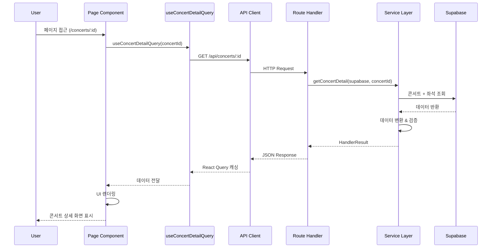

# 콘서트 상세 페이지 구현 계획

## 문서 정보
- **페이지**: `/concerts/[concertId]`
- **버전**: 1.0
- **최종 수정일**: 2025-10-13
- **작성자**: Development Team

---

## 개요

콘서트 상세 페이지는 사용자가 선택한 콘서트의 상세 정보를 조회하고 예약 프로세스를 시작할 수 있는 페이지입니다.

### 모듈 목록

| 모듈 이름 | 위치 | 설명 |
|-----------|------|------|
| **Backend API** | `src/features/concerts/backend/` | 콘서트 상세 정보 조회 API |
| **Frontend Page** | `src/app/concerts/[concertId]/page.tsx` | Next.js 페이지 컴포넌트 |
| **React Query Hook** | `src/features/concerts/hooks/useConcertDetailQuery.ts` | 콘서트 상세 데이터 페칭 훅 |
| **UI Components** | `src/features/concerts/components/` | 콘서트 상세 화면 UI 컴포넌트 |
| **Schema & Types** | `src/features/concerts/backend/schema.ts` | 데이터 스키마 및 타입 정의 |
| **Error Handling** | `src/features/concerts/backend/error.ts` | 에러 코드 및 핸들링 |

---

## Diagram

### 모듈 관계도

```mermaid
graph TB
    subgraph "Frontend Layer"
        A[Page: /concerts/[concertId]/page.tsx]
        B[Component: ConcertDetailView]
        C[Component: ConcertHeader]
        D[Component: ConcertInfo]
        E[Component: BookingButton]
        F[Hook: useConcertDetailQuery]
    end

    subgraph "API Layer"
        G[API Client: api-client.ts]
        H[Route: GET /api/concerts/:id]
    end

    subgraph "Backend Layer"
        I[Service: getConcertDetail]
        J[Schema: ConcertDetailResponseSchema]
        K[Error: ConcertServiceError]
        L[Supabase Client]
    end

    subgraph "Database"
        M[(concerts table)]
        N[(seats table)]
    end

    A --> B
    B --> C
    B --> D
    B --> E
    A --> F
    F --> G
    G --> H
    H --> I
    I --> J
    I --> K
    I --> L
    L --> M
    L --> N
    M -.JOIN.- N
```

### 데이터 흐름



---

## Implementation Plan

### 1. Backend API 구현

#### 1.1 Schema 확장 (src/features/concerts/backend/schema.ts)

**추가 스키마:**

```typescript
// 콘서트 상세 응답 스키마
export const ConcertDetailResponseSchema = z.object({
  id: z.string().uuid(),
  title: z.string(),
  description: z.string().nullable(),
  eventDate: z.string(), // ISO 8601
  location: z.string(),
  thumbnailUrl: z.string().nullable(),
  performers: z.array(z.string()).nullable(), // 향후 추가 고려
  totalSeats: z.number().int().min(0),
  reservedSeats: z.number().int().min(0),
  availableSeats: z.number().int().min(0),
  isSoldOut: z.boolean(),
  isBookable: z.boolean(),
  bookingDeadline: z.string(), // ISO 8601
  createdAt: z.string(),
});

export type ConcertDetailResponse = z.infer<typeof ConcertDetailResponseSchema>;

// Path Parameter 검증 스키마
export const ConcertIdParamSchema = z.object({
  concertId: z.string().uuid(),
});
```

**Unit Test (schema.test.ts):**

```typescript
describe('ConcertDetailResponseSchema', () => {
  it('should validate valid concert detail data', () => {
    const validData = {
      id: '550e8400-e29b-41d4-a716-446655440000',
      title: 'BTS Concert',
      description: 'BTS World Tour',
      eventDate: '2025-12-25T19:00:00+09:00',
      location: 'Seoul Olympic Park',
      thumbnailUrl: 'https://example.com/thumb.jpg',
      performers: ['BTS'],
      totalSeats: 320,
      reservedSeats: 45,
      availableSeats: 275,
      isSoldOut: false,
      isBookable: true,
      bookingDeadline: '2025-12-24T23:59:59+09:00',
      createdAt: '2025-01-01T00:00:00+09:00',
    };

    const result = ConcertDetailResponseSchema.safeParse(validData);
    expect(result.success).toBe(true);
  });

  it('should fail on invalid UUID', () => {
    const invalidData = { id: 'invalid-uuid', /* ... */ };
    const result = ConcertDetailResponseSchema.safeParse(invalidData);
    expect(result.success).toBe(false);
  });

  it('should allow nullable description and thumbnailUrl', () => {
    const data = { /* ... */, description: null, thumbnailUrl: null };
    const result = ConcertDetailResponseSchema.safeParse(data);
    expect(result.success).toBe(true);
  });
});

describe('ConcertIdParamSchema', () => {
  it('should validate valid UUID', () => {
    const result = ConcertIdParamSchema.safeParse({
      concertId: '550e8400-e29b-41d4-a716-446655440000'
    });
    expect(result.success).toBe(true);
  });

  it('should reject invalid UUID format', () => {
    const result = ConcertIdParamSchema.safeParse({ concertId: 'abc123' });
    expect(result.success).toBe(false);
  });
});
```

---

#### 1.2 Error Codes 추가 (src/features/concerts/backend/error.ts)

**추가 에러 코드:**

```typescript
export const concertErrorCodes = {
  fetchError: 'CONCERT_FETCH_ERROR',
  validationError: 'CONCERT_VALIDATION_ERROR',
  notFound: 'CONCERT_NOT_FOUND', // 신규
  invalidId: 'INVALID_CONCERT_ID', // 신규
} as const;

export type ConcertServiceError =
  | 'CONCERT_FETCH_ERROR'
  | 'CONCERT_VALIDATION_ERROR'
  | 'CONCERT_NOT_FOUND'
  | 'INVALID_CONCERT_ID';
```

---

#### 1.3 Service 함수 추가 (src/features/concerts/backend/service.ts)

**새로운 서비스 함수:**

```typescript
/**
 * 콘서트 상세 정보 조회
 * @param client - Supabase 클라이언트
 * @param concertId - 콘서트 UUID
 * @returns 콘서트 상세 정보 또는 에러
 */
export const getConcertDetail = async (
  client: SupabaseClient,
  concertId: string,
): Promise<HandlerResult<ConcertDetailResponse, ConcertServiceError, unknown>> => {
  // 1. 콘서트 정보 + 좌석 정보 조회
  const { data, error } = await client
    .from('concerts')
    .select(`
      id,
      title,
      description,
      event_date,
      location,
      thumbnail_url,
      created_at,
      seats (
        id,
        is_reserved
      )
    `)
    .eq('id', concertId)
    .single();

  if (error) {
    // Postgres 에러 코드 'PGRST116'은 단일 행이 없음을 의미
    if (error.code === 'PGRST116') {
      return failure(404, concertErrorCodes.notFound, 'Concert not found.');
    }
    return failure(500, concertErrorCodes.fetchError, error.message);
  }

  if (!data) {
    return failure(404, concertErrorCodes.notFound, 'Concert not found.');
  }

  // 2. 예약 가능 여부 계산
  const now = new Date();
  const eventDate = new Date(data.event_date);
  const bookingDeadline = new Date(eventDate);
  bookingDeadline.setDate(bookingDeadline.getDate() - 1);
  bookingDeadline.setHours(23, 59, 59, 999);

  const isBookable = now < bookingDeadline;

  // 3. 좌석 현황 집계
  const totalSeats = data.seats?.length ?? 0;
  const reservedSeats = data.seats?.filter((s) => s.is_reserved).length ?? 0;
  const availableSeats = totalSeats - reservedSeats;
  const isSoldOut = availableSeats === 0;

  // 4. 응답 데이터 생성
  const response: ConcertDetailResponse = {
    id: data.id,
    title: data.title,
    description: data.description,
    eventDate: data.event_date,
    location: data.location,
    thumbnailUrl: data.thumbnail_url,
    performers: null, // 향후 구현
    totalSeats,
    reservedSeats,
    availableSeats,
    isSoldOut,
    isBookable,
    bookingDeadline: bookingDeadline.toISOString(),
    createdAt: data.created_at,
  };

  // 5. 응답 스키마 검증
  const parsed = ConcertDetailResponseSchema.safeParse(response);

  if (!parsed.success) {
    return failure(
      500,
      concertErrorCodes.validationError,
      'Concert detail response validation failed.',
      parsed.error.format(),
    );
  }

  return success(parsed.data);
};
```

**Unit Test (service.test.ts):**

```typescript
describe('getConcertDetail', () => {
  let mockClient: jest.Mocked<SupabaseClient>;

  beforeEach(() => {
    mockClient = {
      from: jest.fn().mockReturnThis(),
      select: jest.fn().mockReturnThis(),
      eq: jest.fn().mockReturnThis(),
      single: jest.fn(),
    } as any;
  });

  it('should return concert detail when concert exists', async () => {
    const mockData = {
      id: '550e8400-e29b-41d4-a716-446655440000',
      title: 'BTS Concert',
      description: 'World Tour',
      event_date: '2025-12-25T19:00:00+09:00',
      location: 'Seoul',
      thumbnail_url: 'https://example.com/thumb.jpg',
      created_at: '2025-01-01T00:00:00+09:00',
      seats: Array(320).fill(null).map((_, i) => ({
        id: `seat-${i}`,
        is_reserved: i < 45, // 45석 예약됨
      })),
    };

    mockClient.single.mockResolvedValue({ data: mockData, error: null });

    const result = await getConcertDetail(mockClient, mockData.id);

    expect(result.ok).toBe(true);
    if (result.ok) {
      expect(result.data.id).toBe(mockData.id);
      expect(result.data.totalSeats).toBe(320);
      expect(result.data.reservedSeats).toBe(45);
      expect(result.data.availableSeats).toBe(275);
      expect(result.data.isSoldOut).toBe(false);
    }
  });

  it('should return 404 error when concert not found', async () => {
    mockClient.single.mockResolvedValue({
      data: null,
      error: { code: 'PGRST116', message: 'Not found' }
    });

    const result = await getConcertDetail(mockClient, 'non-existent-id');

    expect(result.ok).toBe(false);
    if (!result.ok) {
      expect(result.status).toBe(404);
      expect(result.error.code).toBe(concertErrorCodes.notFound);
    }
  });

  it('should correctly calculate isBookable flag', async () => {
    // 예약 마감 전 콘서트
    const futureDate = new Date();
    futureDate.setDate(futureDate.getDate() + 10);

    const mockData = {
      /* ... */
      event_date: futureDate.toISOString(),
      seats: [],
    };

    mockClient.single.mockResolvedValue({ data: mockData, error: null });

    const result = await getConcertDetail(mockClient, 'some-id');

    expect(result.ok).toBe(true);
    if (result.ok) {
      expect(result.data.isBookable).toBe(true);
    }
  });

  it('should set isSoldOut to true when all seats are reserved', async () => {
    const mockData = {
      /* ... */
      seats: Array(320).fill(null).map((_, i) => ({
        id: `seat-${i}`,
        is_reserved: true, // 전석 매진
      })),
    };

    mockClient.single.mockResolvedValue({ data: mockData, error: null });

    const result = await getConcertDetail(mockClient, 'some-id');

    expect(result.ok).toBe(true);
    if (result.ok) {
      expect(result.data.availableSeats).toBe(0);
      expect(result.data.isSoldOut).toBe(true);
    }
  });
});
```

---

#### 1.4 Route Handler 추가 (src/features/concerts/backend/route.ts)

**새로운 라우트:**

```typescript
export const registerConcertRoutes = (app: Hono<AppEnv>) => {
  // 기존 GET /api/concerts ...

  /**
   * GET /api/concerts/:concertId
   * 콘서트 상세 정보 조회
   */
  app.get('/api/concerts/:concertId', async (c) => {
    const concertId = c.req.param('concertId');

    // 1. Path Parameter 검증
    const parsedParams = ConcertIdParamSchema.safeParse({ concertId });

    if (!parsedParams.success) {
      return respond(
        c,
        failure(
          400,
          concertErrorCodes.invalidId,
          'The provided concert ID is invalid.',
          parsedParams.error.format(),
        ),
      );
    }

    // 2. Service 호출
    const supabase = getSupabase(c);
    const logger = getLogger(c);

    const result = await getConcertDetail(supabase, parsedParams.data.concertId);

    // 3. 에러 핸들링
    if (!result.ok) {
      const errorResult = result as ErrorResult<ConcertServiceError, unknown>;

      if (errorResult.error.code === concertErrorCodes.notFound) {
        logger.warn('Concert not found', { concertId });
      } else if (errorResult.error.code === concertErrorCodes.fetchError) {
        logger.error('Failed to fetch concert detail', errorResult.error.message);
      }

      return respond(c, result);
    }

    // 4. 성공 응답
    return respond(c, result);
  });
};
```

---

### 2. Frontend Implementation

#### 2.1 React Query Hook (src/features/concerts/hooks/useConcertDetailQuery.ts)

**신규 파일:**

```typescript
import { useQuery } from '@tanstack/react-query';
import { apiClient } from '@/lib/remote/api-client';
import type { ConcertDetailResponse } from '../backend/schema';

/**
 * 콘서트 상세 정보 조회 React Query Hook
 * @param concertId - 콘서트 UUID
 */
export const useConcertDetailQuery = (concertId: string) => {
  return useQuery<ConcertDetailResponse>({
    queryKey: ['concerts', concertId],
    queryFn: async () => {
      const response = await apiClient.get(`/api/concerts/${concertId}`);

      if (!response.ok) {
        throw new Error(response.error?.message || 'Failed to fetch concert detail');
      }

      return response.data;
    },
    enabled: !!concertId, // concertId가 있을 때만 실행
    staleTime: 5 * 60 * 1000, // 5분간 캐싱
    retry: 1, // 실패 시 1번 재시도
  });
};
```

---

#### 2.2 UI Components (src/features/concerts/components/)

**컴포넌트 구조:**

```
src/features/concerts/components/
├── concert-detail-view.tsx          # 메인 컨테이너
├── concert-header.tsx               # 헤더 (뒤로가기 버튼)
├── concert-thumbnail.tsx            # 썸네일 이미지
├── concert-info.tsx                 # 콘서트 정보 (제목, 일시, 장소)
├── concert-description.tsx          # 상세 설명
├── concert-booking-info.tsx         # 예약 정보 (남은 좌석, 마감 안내)
├── concert-booking-button.tsx       # 예약하기 버튼
└── concert-detail-skeleton.tsx      # 로딩 스켈레톤
```

**주요 컴포넌트 예시 (concert-detail-view.tsx):**

```typescript
'use client';

import { useConcertDetailQuery } from '../hooks/useConcertDetailQuery';
import { ConcertHeader } from './concert-header';
import { ConcertThumbnail } from './concert-thumbnail';
import { ConcertInfo } from './concert-info';
import { ConcertDescription } from './concert-description';
import { ConcertBookingInfo } from './concert-booking-info';
import { ConcertBookingButton } from './concert-booking-button';
import { ConcertDetailSkeleton } from './concert-detail-skeleton';

interface ConcertDetailViewProps {
  concertId: string;
}

export const ConcertDetailView = ({ concertId }: ConcertDetailViewProps) => {
  const { data, isLoading, isError, error } = useConcertDetailQuery(concertId);

  if (isLoading) {
    return <ConcertDetailSkeleton />;
  }

  if (isError) {
    return (
      <div className="container mx-auto px-4 py-8">
        <div className="text-center">
          <h1 className="text-2xl font-bold text-red-600">
            콘서트를 찾을 수 없습니다
          </h1>
          <p className="mt-4 text-gray-600">{error.message}</p>
          <button className="mt-6 btn-primary" onClick={() => router.back()}>
            돌아가기
          </button>
        </div>
      </div>
    );
  }

  if (!data) {
    return null;
  }

  return (
    <div className="container mx-auto px-4 py-8">
      <ConcertHeader />

      <div className="mt-6">
        <ConcertThumbnail src={data.thumbnailUrl} alt={data.title} />
      </div>

      <div className="mt-8">
        <ConcertInfo concert={data} />
      </div>

      <div className="mt-6">
        <ConcertDescription description={data.description} />
      </div>

      <div className="mt-8">
        <ConcertBookingInfo
          availableSeats={data.availableSeats}
          totalSeats={data.totalSeats}
          isSoldOut={data.isSoldOut}
          isBookable={data.isBookable}
          bookingDeadline={data.bookingDeadline}
        />
      </div>

      <div className="mt-8">
        <ConcertBookingButton
          concertId={data.id}
          isBookable={data.isBookable}
          isSoldOut={data.isSoldOut}
        />
      </div>
    </div>
  );
};
```

**QA Sheet (concert-detail-view.qa.md):**

```markdown
# ConcertDetailView QA Sheet

## 화면 렌더링 테스트

### TC-001: 정상 데이터 로딩
- **Given**: 유효한 concertId로 페이지 접근
- **When**: API 응답이 정상적으로 반환됨
- **Then**:
  - 모든 콘서트 정보가 화면에 표시됨
  - 썸네일 이미지가 표시됨 (있는 경우)
  - 예약하기 버튼이 적절히 활성화/비활성화됨

### TC-002: 로딩 상태
- **Given**: 페이지 접근 직후
- **When**: API 응답 대기 중
- **Then**:
  - 스켈레톤 UI가 표시됨
  - 사용자는 로딩 중임을 인지할 수 있음

### TC-003: 콘서트 미존재
- **Given**: 존재하지 않는 concertId로 접근
- **When**: API가 404 에러 반환
- **Then**:
  - 에러 메시지 "콘서트를 찾을 수 없습니다" 표시
  - 돌아가기 버튼 표시
  - 클릭 시 이전 페이지로 이동

### TC-004: 네트워크 에러
- **Given**: 네트워크 연결 불안정
- **When**: API 요청 실패
- **Then**:
  - 에러 메시지 표시
  - 재시도 옵션 제공

## 예약 가능 상태 테스트

### TC-005: 예약 가능한 콘서트
- **Given**: 예약 기간 내, 잔여 좌석 있음
- **When**: 화면 렌더링
- **Then**:
  - 예약하기 버튼 활성화
  - "남은 좌석: X/320석" 표시
  - 버튼 클릭 시 좌석 선택 페이지로 이동

### TC-006: 예약 마감된 콘서트
- **Given**: 예약 기간 종료
- **When**: 화면 렌더링
- **Then**:
  - 예약하기 버튼 비활성화
  - "예약 마감" 배지 표시
  - 마감 일시 표시

### TC-007: 매진된 콘서트
- **Given**: availableSeats = 0
- **When**: 화면 렌더링
- **Then**:
  - 예약하기 버튼 비활성화
  - "매진" 배지 표시 (빨간색)
  - "0/320석" 표시

## 반응형 디자인 테스트

### TC-008: 모바일 화면
- **Given**: 화면 너비 < 768px
- **When**: 페이지 렌더링
- **Then**:
  - 모든 콘텐츠가 단일 컬럼으로 표시
  - 버튼이 하단에 고정됨 (Sticky)
  - 텍스트 크기가 적절하게 조정됨

### TC-009: 데스크톱 화면
- **Given**: 화면 너비 >= 1024px
- **When**: 페이지 렌더링
- **Then**:
  - 콘텐츠가 최대 너비로 제한됨
  - 여백이 적절하게 유지됨
  - 이미지가 16:9 비율로 표시됨

## 접근성 테스트

### TC-010: 키보드 네비게이션
- **Given**: 키보드 사용자
- **When**: Tab 키로 이동
- **Then**:
  - 모든 인터랙티브 요소에 접근 가능
  - 포커스 인디케이터가 명확하게 표시됨
  - Enter/Space로 버튼 활성화 가능

### TC-011: 스크린 리더
- **Given**: 스크린 리더 사용자
- **When**: 페이지 읽기
- **Then**:
  - 모든 텍스트가 읽힘
  - 이미지에 alt 텍스트 있음
  - 버튼 상태(활성/비활성)가 전달됨
```

---

#### 2.3 Page Component (src/app/concerts/[concertId]/page.tsx)

**신규 파일:**

```typescript
import { ConcertDetailView } from '@/features/concerts/components/concert-detail-view';

interface PageProps {
  params: {
    concertId: string;
  };
}

export default function ConcertDetailPage({ params }: PageProps) {
  return <ConcertDetailView concertId={params.concertId} />;
}

// 메타데이터 생성 (SEO)
export async function generateMetadata({ params }: PageProps) {
  // 향후 구현: 콘서트 정보를 서버에서 가져와 메타데이터 생성
  return {
    title: '콘서트 상세',
    description: '콘서트 상세 정보 및 예약',
  };
}
```

---

### 3. Shared Utilities (공통 모듈)

#### 3.1 날짜 포맷팅 유틸리티

**위치**: `src/lib/utils/date.ts` (이미 존재할 경우 추가)

```typescript
import { format } from 'date-fns';
import { ko } from 'date-fns/locale';

/**
 * 콘서트 날짜 포맷팅
 * @example "2025년 12월 25일 (수) 19:00"
 */
export const formatConcertDate = (dateString: string): string => {
  const date = new Date(dateString);
  return format(date, 'yyyy년 MM월 dd일 (EEE) HH:mm', { locale: ko });
};

/**
 * 예약 마감 일시 포맷팅
 * @example "2025-12-24 23:59"
 */
export const formatBookingDeadline = (dateString: string): string => {
  const date = new Date(dateString);
  return format(date, 'yyyy-MM-dd HH:mm');
};
```

---

#### 3.2 에러 바운더리 (선택사항)

**위치**: `src/components/error-boundary.tsx`

```typescript
'use client';

import { Component, ReactNode } from 'react';

interface Props {
  children: ReactNode;
  fallback?: ReactNode;
}

interface State {
  hasError: boolean;
}

export class ErrorBoundary extends Component<Props, State> {
  constructor(props: Props) {
    super(props);
    this.state = { hasError: false };
  }

  static getDerivedStateFromError() {
    return { hasError: true };
  }

  componentDidCatch(error: Error, errorInfo: any) {
    console.error('Error caught by boundary:', error, errorInfo);
  }

  render() {
    if (this.state.hasError) {
      return this.props.fallback || <div>에러가 발생했습니다.</div>;
    }

    return this.props.children;
  }
}
```

---

## 구현 순서

1. **Backend 구현** (우선순위: 높음)
   - [ ] Schema 확장 (ConcertDetailResponseSchema, ConcertIdParamSchema)
   - [ ] Error Codes 추가 (notFound, invalidId)
   - [ ] Service 함수 구현 (getConcertDetail)
   - [ ] Unit Test 작성 (service.test.ts, schema.test.ts)
   - [ ] Route Handler 추가 (GET /api/concerts/:concertId)

2. **Frontend Hooks** (우선순위: 높음)
   - [ ] React Query Hook 구현 (useConcertDetailQuery)
   - [ ] API Client 테스트

3. **UI Components** (우선순위: 중간)
   - [ ] 공통 컴포넌트 구현
     - [ ] ConcertThumbnail
     - [ ] ConcertInfo
     - [ ] ConcertDescription
   - [ ] 주요 컴포넌트 구현
     - [ ] ConcertBookingInfo
     - [ ] ConcertBookingButton
   - [ ] 컨테이너 컴포넌트 구현
     - [ ] ConcertDetailView
   - [ ] 스켈레톤 UI (ConcertDetailSkeleton)
   - [ ] QA Sheet 작성 및 수동 테스트

4. **Page Component** (우선순위: 중간)
   - [ ] Next.js Page 구현 (/concerts/[concertId]/page.tsx)
   - [ ] 메타데이터 생성 (SEO)

5. **Shared Utilities** (우선순위: 낮음)
   - [ ] 날짜 포맷팅 유틸리티 추가
   - [ ] Error Boundary 구현 (선택사항)

6. **통합 테스트** (우선순위: 높음)
   - [ ] E2E 테스트 (Cypress/Playwright)
   - [ ] API 통합 테스트
   - [ ] 에러 케이스 테스트

7. **최적화 및 개선** (우선순위: 낮음)
   - [ ] 이미지 최적화 (Next.js Image 컴포넌트)
   - [ ] 캐싱 전략 검증
   - [ ] 접근성 검증
   - [ ] 성능 측정 및 개선

---

## 주의사항

1. **코드베이스 구조 준수**
   - 기존 `src/features/concerts/` 구조 유지
   - `backend/`, `components/`, `hooks/` 디렉토리 분리
   - 공통 타입은 `schema.ts`에 정의

2. **에러 처리**
   - 모든 API 에러는 `HandlerResult` 타입으로 반환
   - 사용자에게 친화적인 에러 메시지 표시
   - 개발 환경에서는 상세 에러 로깅

3. **타입 안정성**
   - Zod 스키마를 통한 런타임 검증
   - TypeScript strict mode 준수
   - API 응답 타입 검증 필수

4. **성능 최적화**
   - React Query의 캐싱 활용 (staleTime: 5분)
   - 이미지 lazy loading
   - 불필요한 리렌더링 방지 (useMemo, useCallback)

5. **접근성**
   - 시맨틱 HTML 사용
   - ARIA 레이블 추가
   - 키보드 네비게이션 지원

---

## 테스트 계획 요약

### Unit Tests
- Schema 검증 테스트
- Service 함수 테스트 (getConcertDetail)
- 날짜 계산 로직 테스트 (isBookable, bookingDeadline)

### Integration Tests
- API Route 통합 테스트
- React Query Hook 테스트

### E2E Tests
- 정상 플로우: 목록 → 상세 → 예약
- 에러 플로우: 404, 네트워크 에러
- 반응형 테스트

### QA Manual Tests
- 브라우저 호환성 (Chrome, Safari, Firefox, Edge)
- 모바일 디바이스 테스트
- 접근성 테스트 (키보드, 스크린 리더)

---

## 의존성

### 필수 라이브러리 (이미 설치됨)
- Next.js 14+
- React 18+
- React Query (TanStack Query)
- Zod
- date-fns
- Supabase Client

### 추가 설치 필요 (있을 경우)
- 없음 (기존 의존성만으로 구현 가능)

---

## 참고 문서

- [UF-002: 콘서트 상세 조회](/Users/choesumin/Desktop/supernext/docs/usecases/uf-002-concert-detail.md)
- [PRD: 콘서트 예약 플랫폼](/Users/choesumin/Desktop/supernext/docs/prd.md)
- [데이터베이스 설계서](/Users/choesumin/Desktop/supernext/docs/database.md)
- [유저플로우 설계서](/Users/choesumin/Desktop/supernext/docs/userflow.md)

---

**문서 버전**: 1.0
**최종 수정일**: 2025-10-13
**작성자**: Development Team
