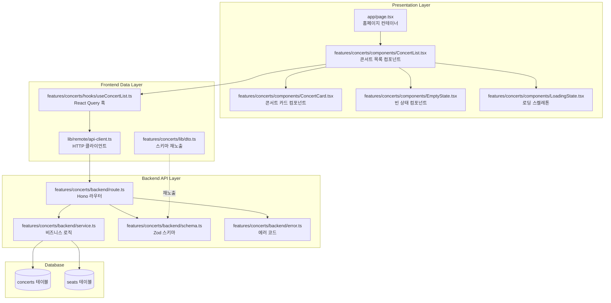

# 콘서트 목록 페이지 구현 계획

## 문서 정보
- **페이지**: `/` (홈페이지 - 콘서트 목록)
- **유스케이스**: UF-001 (콘서트 목록 조회)
- **버전**: 1.0
- **작성일**: 2025-10-13

---

## 개요

### 구현 범위
콘서트 목록 페이지는 사용자가 예약 가능한 콘서트를 조회하고 각 콘서트의 예약 현황을 확인하며, 콘서트 상세 페이지로 이동할 수 있는 기능을 제공합니다.

### 주요 기능
1. 예약 가능한 콘서트 목록 조회 (진행일 전날까지만 표시)
2. 각 콘서트별 예약 현황 (예약인원/총정원) 표시
3. 콘서트 카드 UI (제목, 일시, 장소, 썸네일, 예약현황)
4. 콘서트 상세 페이지로 네비게이션
5. 로딩 상태, 에러 처리, 빈 상태 UI

### 기술 스택
- **Frontend**: Next.js 15+ (App Router), React 19+, TypeScript
- **Styling**: TailwindCSS, shadcn-ui
- **State Management**: @tanstack/react-query (서버 상태), zustand (선택적)
- **Backend**: Hono (API), Supabase (PostgreSQL)
- **Validation**: Zod

---

## Diagram: 모듈 구조



---

## Implementation Plan

### 1. Backend Layer (API)

#### 1.1 Schema 정의 (`src/features/concerts/backend/schema.ts`)

**목적**: API 요청/응답 데이터 구조 정의

**구현 내용**:
```typescript
// 콘서트 목록 응답 스키마
export const ConcertListItemSchema = z.object({
  id: z.string().uuid(),
  title: z.string(),
  description: z.string().nullable(),
  eventDate: z.string(), // ISO 8601 형식
  location: z.string(),
  thumbnailUrl: z.string().nullable(),
  totalSeats: z.number().int().min(0),
  reservedSeats: z.number().int().min(0),
  availableSeats: z.number().int().min(0),
  isSoldOut: z.boolean(),
});

export const ConcertListResponseSchema = z.array(ConcertListItemSchema);

// 데이터베이스 테이블 스키마
export const ConcertTableRowSchema = z.object({
  id: z.string().uuid(),
  title: z.string(),
  description: z.string().nullable(),
  event_date: z.string(),
  location: z.string(),
  thumbnail_url: z.string().nullable(),
  available_seats: z.number().nullable(),
  reserved_seats: z.number().nullable(),
  total_seats: z.number().nullable(),
});

export type ConcertListItem = z.infer<typeof ConcertListItemSchema>;
export type ConcertListResponse = z.infer<typeof ConcertListResponseSchema>;
export type ConcertRow = z.infer<typeof ConcertTableRowSchema>;
```

**테스트 항목**:
- [ ] 스키마 타입 검증 테스트
- [ ] 유효한 데이터 파싱 성공 테스트
- [ ] 잘못된 데이터 파싱 실패 테스트

---

#### 1.2 Error 코드 정의 (`src/features/concerts/backend/error.ts`)

**목적**: 콘서트 도메인 에러 코드 정의

**구현 내용**:
```typescript
export const concertErrorCodes = {
  fetchError: 'CONCERT_FETCH_ERROR',
  validationError: 'CONCERT_VALIDATION_ERROR',
  notFound: 'CONCERT_NOT_FOUND',
} as const;

export type ConcertServiceError =
  | typeof concertErrorCodes.fetchError
  | typeof concertErrorCodes.validationError
  | typeof concertErrorCodes.notFound;
```

---

#### 1.3 Service 레이어 (`src/features/concerts/backend/service.ts`)

**목적**: Supabase를 통한 콘서트 목록 조회 로직

**구현 내용**:
```typescript
import type { SupabaseClient } from '@supabase/supabase-js';
import { failure, success, type HandlerResult } from '@/backend/http/response';
import {
  ConcertListResponseSchema,
  ConcertTableRowSchema,
  type ConcertListResponse,
  type ConcertRow,
} from './schema';
import { concertErrorCodes, type ConcertServiceError } from './error';

/**
 * 예약 가능한 콘서트 목록 조회
 * - 진행일이 현재 시간 + 1일보다 큰 콘서트만 조회
 * - 각 콘서트별 좌석 예약 현황 집계
 */
export const getConcertList = async (
  client: SupabaseClient,
): Promise<HandlerResult<ConcertListResponse, ConcertServiceError, unknown>> => {
  // 쿼리 실행: 콘서트 목록 + 좌석 집계
  const { data, error } = await client
    .from('concerts')
    .select(`
      id,
      title,
      description,
      event_date,
      location,
      thumbnail_url,
      seats (
        id,
        is_reserved
      )
    `)
    .gt('event_date', new Date(Date.now() + 24 * 60 * 60 * 1000).toISOString())
    .order('event_date', { ascending: true });

  if (error) {
    return failure(500, concertErrorCodes.fetchError, error.message);
  }

  if (!data) {
    // 빈 배열도 정상 응답
    return success([]);
  }

  // 데이터 변환: DB 형식 -> API 형식
  const concerts = data.map((concert) => {
    const totalSeats = concert.seats?.length ?? 0;
    const reservedSeats = concert.seats?.filter((s) => s.is_reserved).length ?? 0;
    const availableSeats = totalSeats - reservedSeats;

    return {
      id: concert.id,
      title: concert.title,
      description: concert.description,
      eventDate: concert.event_date,
      location: concert.location,
      thumbnailUrl: concert.thumbnail_url,
      totalSeats,
      reservedSeats,
      availableSeats,
      isSoldOut: availableSeats === 0,
    };
  });

  // 응답 스키마 검증
  const parsed = ConcertListResponseSchema.safeParse(concerts);

  if (!parsed.success) {
    return failure(
      500,
      concertErrorCodes.validationError,
      'Concert list response validation failed.',
      parsed.error.format(),
    );
  }

  return success(parsed.data);
};
```

**테스트 항목**:
- [ ] 정상 케이스: 콘서트 목록 조회 성공
- [ ] 빈 목록: 예약 가능한 콘서트가 없는 경우
- [ ] 매진 콘서트: `isSoldOut = true` 처리 확인
- [ ] 날짜 필터링: 진행일 전날까지만 조회
- [ ] 정렬: 진행일 오름차순 정렬 확인
- [ ] 에러 케이스: Supabase 에러 처리
- [ ] 검증 에러: 스키마 검증 실패 처리

---

#### 1.4 Route 레이어 (`src/features/concerts/backend/route.ts`)

**목적**: Hono 라우터 등록 및 요청 처리

**구현 내용**:
```typescript
import type { Hono } from 'hono';
import { failure, respond, type ErrorResult } from '@/backend/http/response';
import { getLogger, getSupabase, type AppEnv } from '@/backend/hono/context';
import { getConcertList } from './service';
import { concertErrorCodes, type ConcertServiceError } from './error';

export const registerConcertRoutes = (app: Hono<AppEnv>) => {
  /**
   * GET /api/concerts
   * 예약 가능한 콘서트 목록 조회
   */
  app.get('/api/concerts', async (c) => {
    const supabase = getSupabase(c);
    const logger = getLogger(c);

    const result = await getConcertList(supabase);

    if (!result.ok) {
      const errorResult = result as ErrorResult<ConcertServiceError, unknown>;

      if (errorResult.error.code === concertErrorCodes.fetchError) {
        logger.error('Failed to fetch concerts', errorResult.error.message);
      }

      return respond(c, result);
    }

    return respond(c, result);
  });
};
```

**라우터 등록**: `src/backend/hono/app.ts`에 추가
```typescript
import { registerConcertRoutes } from '@/features/concerts/backend/route';

export const createHonoApp = () => {
  // ... 기존 코드 ...
  registerConcertRoutes(app);
  // ...
};
```

**테스트 항목**:
- [ ] `/api/concerts` GET 요청 성공
- [ ] 200 응답 코드 및 JSON 형식 확인
- [ ] 에러 응답 포맷 확인 (500, 404 등)
- [ ] 로깅 동작 확인

---

### 2. Frontend Layer (Presentation)

#### 2.1 DTO 재노출 (`src/features/concerts/lib/dto.ts`)

**목적**: 백엔드 스키마를 프론트엔드에서 재사용

**구현 내용**:
```typescript
export {
  ConcertListItemSchema,
  ConcertListResponseSchema,
  type ConcertListItem,
  type ConcertListResponse,
} from '@/features/concerts/backend/schema';
```

---

#### 2.2 React Query Hook (`src/features/concerts/hooks/useConcertList.ts`)

**목적**: 콘서트 목록 조회를 위한 React Query 훅

**구현 내용**:
```typescript
'use client';

import { useQuery } from '@tanstack/react-query';
import { apiClient } from '@/lib/remote/api-client';
import {
  ConcertListResponseSchema,
  type ConcertListResponse,
} from '@/features/concerts/lib/dto';

const fetchConcertList = async (): Promise<ConcertListResponse> => {
  const response = await apiClient.get('/api/concerts');

  // 응답 스키마 검증
  const parsed = ConcertListResponseSchema.safeParse(response.data);

  if (!parsed.success) {
    throw new Error('Invalid concert list response format');
  }

  return parsed.data;
};

export const useConcertList = () => {
  return useQuery({
    queryKey: ['concerts'],
    queryFn: fetchConcertList,
    staleTime: 1000 * 60 * 5, // 5분 캐싱
    gcTime: 1000 * 60 * 10, // 10분 가비지 컬렉션
    retry: 2,
    retryDelay: (attemptIndex) => Math.min(1000 * 2 ** attemptIndex, 30000),
  });
};
```

**테스트 항목**:
- [ ] 데이터 fetch 성공 시 응답 파싱
- [ ] 로딩 상태 확인
- [ ] 에러 발생 시 재시도 로직
- [ ] 캐싱 동작 확인

---

#### 2.3 ConcertCard 컴포넌트 (`src/features/concerts/components/ConcertCard.tsx`)

**목적**: 개별 콘서트 정보를 카드 형태로 표시

**구현 내용**:
```typescript
'use client';

import { format } from 'date-fns';
import { ko } from 'date-fns/locale';
import { Card, CardContent, CardHeader } from '@/components/ui/card';
import { Badge } from '@/components/ui/badge';
import { Calendar, MapPin, Users } from 'lucide-react';
import type { ConcertListItem } from '@/features/concerts/lib/dto';

interface ConcertCardProps {
  concert: ConcertListItem;
  onClick: (concertId: string) => void;
}

export const ConcertCard = ({ concert, onClick }: ConcertCardProps) => {
  const eventDate = new Date(concert.eventDate);
  const formattedDate = format(eventDate, 'yyyy년 MM월 dd일 HH:mm', { locale: ko });

  return (
    <Card
      className="cursor-pointer hover:shadow-lg transition-shadow duration-200"
      onClick={() => onClick(concert.id)}
    >
      {concert.thumbnailUrl && (
        <div className="aspect-video w-full overflow-hidden rounded-t-lg">
          
        </div>
      )}
      <CardHeader>
        <div className="flex items-start justify-between gap-2">
          <h3 className="font-bold text-lg line-clamp-2">{concert.title}</h3>
          {concert.isSoldOut && (
            <Badge variant="destructive">매진</Badge>
          )}
        </div>
      </CardHeader>
      <CardContent className="space-y-2">
        <div className="flex items-center gap-2 text-sm text-muted-foreground">
          <Calendar className="w-4 h-4" />
          <span>{formattedDate}</span>
        </div>
        <div className="flex items-center gap-2 text-sm text-muted-foreground">
          <MapPin className="w-4 h-4" />
          <span className="line-clamp-1">{concert.location}</span>
        </div>
        <div className="flex items-center gap-2 text-sm">
          <Users className="w-4 h-4" />
          <span className="font-medium">
            {concert.reservedSeats}/{concert.totalSeats}명
          </span>
        </div>
      </CardContent>
    </Card>
  );
};
```

**QA Sheet**:
- [ ] 썸네일 이미지가 있는 경우 정상 표시
- [ ] 썸네일이 없는 경우 대체 이미지 또는 영역 없음
- [ ] 매진된 콘서트에 "매진" 배지 표시
- [ ] 긴 제목은 2줄 말줄임(...) 처리
- [ ] 긴 장소명은 1줄 말줄임 처리
- [ ] 날짜 포맷이 올바르게 표시 (한국어)
- [ ] 카드 호버 시 그림자 효과 적용
- [ ] 카드 클릭 시 onClick 핸들러 실행
- [ ] 반응형: 모바일/태블릿/데스크톱에서 정상 표시

---

#### 2.4 LoadingState 컴포넌트 (`src/features/concerts/components/LoadingState.tsx`)

**목적**: 데이터 로딩 중 스켈레톤 UI 표시

**구현 내용**:
```typescript
'use client';

import { Card, CardContent, CardHeader } from '@/components/ui/card';

export const LoadingState = () => {
  return (
    <div className="grid grid-cols-1 md:grid-cols-2 lg:grid-cols-3 gap-6">
      {[1, 2, 3, 4, 5, 6].map((i) => (
        <Card key={i} className="animate-pulse">
          <div className="aspect-video w-full bg-muted rounded-t-lg" />
          <CardHeader>
            <div className="h-6 bg-muted rounded w-3/4" />
          </CardHeader>
          <CardContent className="space-y-2">
            <div className="h-4 bg-muted rounded w-full" />
            <div className="h-4 bg-muted rounded w-2/3" />
            <div className="h-4 bg-muted rounded w-1/2" />
          </CardContent>
        </Card>
      ))}
    </div>
  );
};
```

**QA Sheet**:
- [ ] 6개의 스켈레톤 카드 표시
- [ ] 애니메이션 동작 확인 (pulse)
- [ ] 반응형 그리드: 모바일 1열, 태블릿 2열, 데스크톱 3열

---

#### 2.5 EmptyState 컴포넌트 (`src/features/concerts/components/EmptyState.tsx`)

**목적**: 예약 가능한 콘서트가 없을 때 표시

**구현 내용**:
```typescript
'use client';

import { CalendarX } from 'lucide-react';

export const EmptyState = () => {
  return (
    <div className="flex flex-col items-center justify-center py-16 px-4 text-center">
      <CalendarX className="w-16 h-16 text-muted-foreground mb-4" />
      <h3 className="text-xl font-semibold mb-2">
        현재 예약 가능한 콘서트가 없습니다
      </h3>
      <p className="text-muted-foreground max-w-md">
        새로운 콘서트가 곧 등록될 예정입니다.
      </p>
    </div>
  );
};
```

**QA Sheet**:
- [ ] 아이콘 정상 표시
- [ ] 텍스트 정렬 및 스타일 확인
- [ ] 반응형: 모바일에서 정상 표시

---

#### 2.6 ConcertList 컴포넌트 (`src/features/concerts/components/ConcertList.tsx`)

**목적**: 콘서트 목록 전체를 관리하는 컨테이너 컴포넌트

**구현 내용**:
```typescript
'use client';

import { useRouter } from 'next/navigation';
import { useConcertList } from '@/features/concerts/hooks/useConcertList';
import { ConcertCard } from './ConcertCard';
import { LoadingState } from './LoadingState';
import { EmptyState } from './EmptyState';

export const ConcertList = () => {
  const router = useRouter();
  const { data: concerts, isLoading, isError, error } = useConcertList();

  const handleConcertClick = (concertId: string) => {
    router.push(`/concerts/${concertId}`);
  };

  if (isLoading) {
    return <LoadingState />;
  }

  if (isError) {
    return (
      <div className="flex flex-col items-center justify-center py-16 px-4 text-center">
        <h3 className="text-xl font-semibold mb-2">
          콘서트 목록을 불러오는 중 오류가 발생했습니다
        </h3>
        <p className="text-muted-foreground mb-4">
          {error instanceof Error ? error.message : '알 수 없는 오류'}
        </p>
        <button
          onClick={() => window.location.reload()}
          className="px-4 py-2 bg-primary text-primary-foreground rounded-md"
        >
          새로고침
        </button>
      </div>
    );
  }

  if (!concerts || concerts.length === 0) {
    return <EmptyState />;
  }

  return (
    <div className="grid grid-cols-1 md:grid-cols-2 lg:grid-cols-3 gap-6">
      {concerts.map((concert) => (
        <ConcertCard
          key={concert.id}
          concert={concert}
          onClick={handleConcertClick}
        />
      ))}
    </div>
  );
};
```

**QA Sheet**:
- [ ] 로딩 중: LoadingState 컴포넌트 표시
- [ ] 에러 발생: 에러 메시지 및 새로고침 버튼 표시
- [ ] 빈 목록: EmptyState 컴포넌트 표시
- [ ] 정상 케이스: ConcertCard 목록 표시
- [ ] 카드 클릭 시 `/concerts/:id` 페이지로 이동
- [ ] 반응형 그리드 동작 확인

---

#### 2.7 홈페이지 (`src/app/page.tsx`)

**목적**: 콘서트 목록 페이지 진입점

**구현 내용**:
```typescript
'use client';

import { ConcertList } from '@/features/concerts/components/ConcertList';

export default function HomePage() {
  return (
    <div className="container mx-auto px-4 py-8">
      <header className="mb-8">
        <h1 className="text-3xl font-bold mb-2">예약 가능한 콘서트</h1>
        <p className="text-muted-foreground">
          원하시는 콘서트를 선택하여 예약을 진행하세요
        </p>
      </header>
      <ConcertList />
    </div>
  );
}
```

**QA Sheet**:
- [ ] 페이지 제목 표시
- [ ] 안내 문구 표시
- [ ] ConcertList 컴포넌트 정상 렌더링
- [ ] 반응형 컨테이너 동작

---

### 3. Shared Modules (공통 모듈)

#### 3.1 API Client 확인 (`src/lib/remote/api-client.ts`)

**목적**: 기존 API 클라이언트가 GET 요청을 지원하는지 확인

**확인 사항**:
- [ ] `apiClient.get()` 메서드 존재
- [ ] 에러 처리 로직 확인
- [ ] 타임아웃 설정 확인

---

### 4. Database (이미 완료됨)

**확인 사항**:
- [x] `concerts` 테이블 생성 완료
- [x] `seats` 테이블 생성 완료
- [x] 인덱스 생성 완료 (`idx_concerts_event_date`, `idx_seats_concert_reserved`)
- [x] 샘플 데이터 생성 완료 (migration에 포함됨)

---

### 5. Integration & Testing

#### 5.1 Backend Unit Tests

**Service Layer 테스트** (`src/features/concerts/backend/service.test.ts`):
```typescript
import { describe, it, expect, vi } from 'vitest';
import { getConcertList } from './service';

describe('getConcertList', () => {
  it('should return concert list successfully', async () => {
    const mockClient = {
      from: vi.fn().mockReturnThis(),
      select: vi.fn().mockReturnThis(),
      gt: vi.fn().mockReturnThis(),
      order: vi.fn().mockResolvedValue({
        data: [
          {
            id: 'uuid-1',
            title: 'Test Concert',
            description: 'Test',
            event_date: '2025-12-25T19:00:00+09:00',
            location: 'Seoul',
            thumbnail_url: null,
            seats: [
              { id: 's1', is_reserved: false },
              { id: 's2', is_reserved: true },
            ],
          },
        ],
        error: null,
      }),
    };

    const result = await getConcertList(mockClient as any);

    expect(result.ok).toBe(true);
    expect(result.data).toHaveLength(1);
    expect(result.data[0].totalSeats).toBe(2);
    expect(result.data[0].reservedSeats).toBe(1);
    expect(result.data[0].availableSeats).toBe(1);
  });

  it('should return empty array when no concerts available', async () => {
    // ... 테스트 구현
  });

  it('should handle database error', async () => {
    // ... 테스트 구현
  });
});
```

#### 5.2 Frontend Component Tests

**ConcertCard 테스트** (`src/features/concerts/components/ConcertCard.test.tsx`):
```typescript
import { render, screen, fireEvent } from '@testing-library/react';
import { ConcertCard } from './ConcertCard';

describe('ConcertCard', () => {
  const mockConcert = {
    id: '123',
    title: 'Test Concert',
    description: 'Description',
    eventDate: '2025-12-25T19:00:00+09:00',
    location: 'Seoul',
    thumbnailUrl: null,
    totalSeats: 320,
    reservedSeats: 100,
    availableSeats: 220,
    isSoldOut: false,
  };

  it('should render concert information', () => {
    render(<ConcertCard concert={mockConcert} onClick={() => {}} />);

    expect(screen.getByText('Test Concert')).toBeInTheDocument();
    expect(screen.getByText('Seoul')).toBeInTheDocument();
    expect(screen.getByText('100/320명')).toBeInTheDocument();
  });

  it('should call onClick when clicked', () => {
    const handleClick = vi.fn();
    render(<ConcertCard concert={mockConcert} onClick={handleClick} />);

    fireEvent.click(screen.getByRole('button'));
    expect(handleClick).toHaveBeenCalledWith('123');
  });

  it('should display sold out badge when isSoldOut is true', () => {
    const soldOutConcert = { ...mockConcert, isSoldOut: true };
    render(<ConcertCard concert={soldOutConcert} onClick={() => {}} />);

    expect(screen.getByText('매진')).toBeInTheDocument();
  });
});
```

#### 5.3 E2E Tests (Playwright)

```typescript
import { test, expect } from '@playwright/test';

test.describe('Concert List Page', () => {
  test('should display concert list', async ({ page }) => {
    await page.goto('/');

    // 제목 확인
    await expect(page.getByRole('heading', { name: '예약 가능한 콘서트' })).toBeVisible();

    // 콘서트 카드 표시 확인
    const cards = page.locator('[data-testid="concert-card"]');
    await expect(cards).toHaveCount(3);
  });

  test('should navigate to concert detail on card click', async ({ page }) => {
    await page.goto('/');

    const firstCard = page.locator('[data-testid="concert-card"]').first();
    await firstCard.click();

    // URL 변경 확인
    await expect(page).toHaveURL(/\/concerts\/[a-f0-9-]+/);
  });

  test('should display empty state when no concerts available', async ({ page }) => {
    // Mock empty response
    await page.route('/api/concerts', (route) => {
      route.fulfill({ json: [] });
    });

    await page.goto('/');

    await expect(page.getByText('현재 예약 가능한 콘서트가 없습니다')).toBeVisible();
  });

  test('should display error state on API failure', async ({ page }) => {
    // Mock error response
    await page.route('/api/concerts', (route) => {
      route.fulfill({ status: 500 });
    });

    await page.goto('/');

    await expect(page.getByText('오류가 발생했습니다')).toBeVisible();
    await expect(page.getByRole('button', { name: '새로고침' })).toBeVisible();
  });
});
```

---

### 6. Performance Optimization

#### 6.1 Backend 최적화
- [ ] 인덱스 활용 확인 (`idx_concerts_event_date`, `idx_seats_concert_reserved`)
- [ ] 쿼리 성능 프로파일링 (`EXPLAIN ANALYZE`)
- [ ] 응답 크기 최적화 (불필요한 필드 제거)

#### 6.2 Frontend 최적화
- [ ] 이미지 레이지 로딩 적용
- [ ] React Query 캐싱 설정 (5분 staleTime)
- [ ] 컴포넌트 메모이제이션 (필요시)
- [ ] 스켈레톤 UI로 인지 성능 개선

---

### 7. Accessibility (접근성)

#### 7.1 키보드 네비게이션
- [ ] Tab으로 카드 간 이동 가능
- [ ] Enter/Space로 카드 클릭 가능
- [ ] 포커스 표시 명확화

#### 7.2 Screen Reader
- [ ] 이미지에 적절한 alt 텍스트
- [ ] ARIA 레이블 추가 (필요시)
- [ ] 시맨틱 HTML 사용

#### 7.3 색상 대비
- [ ] WCAG AA 기준 4.5:1 대비율 확인
- [ ] 매진 배지 색상 대비 확인

---

### 8. Error Handling & Edge Cases

#### 8.1 Backend Error Handling
- [ ] Supabase 연결 실패 처리
- [ ] 쿼리 타임아웃 처리
- [ ] 데이터 검증 실패 처리
- [ ] 로깅 및 모니터링

#### 8.2 Frontend Error Handling
- [ ] API 에러 응답 처리
- [ ] 네트워크 오프라인 처리
- [ ] 타임아웃 처리
- [ ] 재시도 로직

#### 8.3 Edge Cases
- [ ] 매우 긴 제목 (100자 이상)
- [ ] 특수문자 포함 제목 (XSS 방지)
- [ ] 썸네일 이미지 로드 실패
- [ ] 진행일 정확히 전날 23:59:59 경계값
- [ ] 타임존 차이 처리

---

### 9. Security

#### 9.1 XSS 방지
- [ ] 콘서트 제목/설명 HTML 이스케이프
- [ ] 이미지 URL 검증

#### 9.2 SQL Injection 방지
- [ ] Supabase ORM 사용 (자동 방지)
- [ ] Prepared Statement 확인

#### 9.3 Rate Limiting
- [ ] API 요청 빈도 제한 (선택사항)

---

### 10. Monitoring & Logging

#### 10.1 Backend Logging
- [ ] API 요청/응답 로깅
- [ ] 에러 로깅 (Sentry 등)
- [ ] 성능 메트릭 수집

#### 10.2 Frontend Monitoring
- [ ] 페이지 로드 시간 측정
- [ ] API 응답 시간 측정
- [ ] 에러 발생 추적

---

## Implementation Checklist

### Phase 1: Backend Setup
- [ ] 1.1 Schema 정의 및 테스트
- [ ] 1.2 Error 코드 정의
- [ ] 1.3 Service 레이어 구현 및 테스트
- [ ] 1.4 Route 레이어 구현 및 테스트
- [ ] Hono 앱에 라우터 등록
- [ ] API 엔드포인트 수동 테스트 (Postman/curl)

### Phase 2: Frontend Components
- [ ] 2.1 DTO 재노출
- [ ] 2.2 React Query 훅 구현
- [ ] 2.3 ConcertCard 컴포넌트 구현
- [ ] 2.4 LoadingState 컴포넌트 구현
- [ ] 2.5 EmptyState 컴포넌트 구현
- [ ] 2.6 ConcertList 컴포넌트 구현
- [ ] 2.7 홈페이지 구현
- [ ] 각 컴포넌트 QA 수행

### Phase 3: Testing
- [ ] Backend Unit Tests 작성 및 실행
- [ ] Frontend Component Tests 작성 및 실행
- [ ] E2E Tests 작성 및 실행
- [ ] 모든 테스트 통과 확인

### Phase 4: Optimization & Polish
- [ ] 성능 최적화 (인덱스, 캐싱)
- [ ] 접근성 개선
- [ ] 에러 처리 강화
- [ ] 반응형 디자인 QA

### Phase 5: Deployment Preparation
- [ ] 환경 변수 설정 확인
- [ ] 프로덕션 빌드 테스트
- [ ] 모니터링 설정
- [ ] 문서화 완료

---

## Dependencies

### 추가 필요한 shadcn-ui 컴포넌트
```bash
$ npx shadcn@latest add card
$ npx shadcn@latest add badge
```

### 이미 설치되어 있어야 하는 패키지
- `@tanstack/react-query`: 서버 상태 관리
- `date-fns`: 날짜 포맷팅
- `lucide-react`: 아이콘
- `zod`: 스키마 검증

---

## 예상 구현 시간

| 작업 | 예상 시간 |
|------|----------|
| Backend (Schema, Service, Route) | 4시간 |
| Frontend Components | 6시간 |
| Testing (Unit + E2E) | 4시간 |
| QA & Bug Fix | 3시간 |
| Optimization & Polish | 2시간 |
| **총계** | **19시간** |

---

## 참고 문서
- [UF-001: 콘서트 목록 조회](/docs/usecases/uf-001-concert-list.md)
- [Database 설계](/docs/database.md)
- [AGENTS.md (코드베이스 구조)](/AGENTS.md)
- [예시 Feature: example](/src/features/example/)

---

## 완료 후 Next Steps
1. **콘서트 상세 페이지 구현** (UF-002)
2. **네비게이션 바 추가** (헤더 로고, 예약 조회 링크)
3. **푸터 추가** (선택사항)
4. **다크 모드 지원** (선택사항)

---

**문서 버전**: 1.0
**최종 수정일**: 2025-10-13
**작성자**: Development Team
