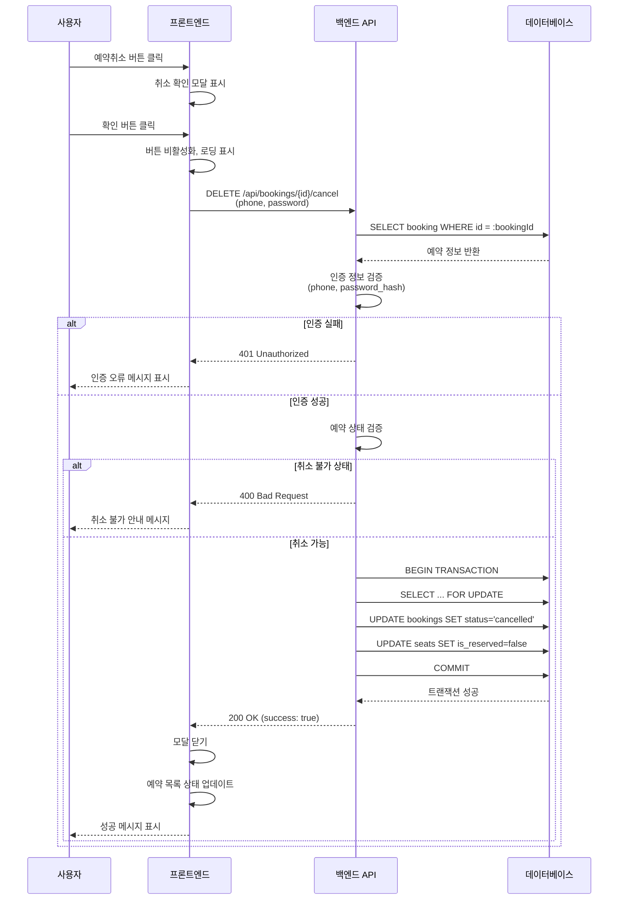

# 유스케이스 문서

## 유스케이스 ID: UC-008

### 제목
예약 취소 (예약 조회 페이지)

---

## 1. 개요

### 1.1 목적
사용자가 예약 조회 페이지에서 본인의 예약 목록을 확인한 후, 특정 예약을 선택하여 취소할 수 있도록 한다. 예약이 취소되면 해당 좌석은 다시 예약 가능한 상태로 전환되어 다른 사용자가 예약할 수 있게 된다.

### 1.2 범위
- **포함 범위**:
  - 예약 조회 페이지에서 예약 목록 표시
  - 개별 예약에 대한 취소 버튼 제공
  - 취소 확인 프로세스
  - 예약 취소 처리 및 좌석 상태 복원
  - 취소 후 목록 상태 업데이트
  - 인증 검증 (휴대폰번호/비밀번호)

- **제외 범위**:
  - 예약 조회 프로세스 (UF-006에서 별도 정의)
  - 예약 완료 페이지에서의 취소 (UF-007에서 별도 정의)
  - 환불 처리 (결제 기능 미포함)
  - 취소 수수료 적용
  - 부분 취소 (일부 좌석만 취소)

### 1.3 액터
- **주요 액터**: 예약자 (일반 사용자)
- **부 액터**:
  - 백엔드 서버 (예약 취소 처리)
  - 데이터베이스 (예약 및 좌석 상태 관리)

---

## 2. 선행 조건

- 사용자가 예약 조회 페이지에 접속하여 휴대폰번호와 비밀번호로 인증을 완료한 상태
- 조회 결과에 하나 이상의 예약 건이 표시되어 있는 상태
- 취소하려는 예약이 'confirmed' (확정) 상태인 경우
- 콘서트가 아직 시작되지 않은 상태 (취소 가능 기간 내)

---

## 3. 참여 컴포넌트

- **프론트엔드 (예약 조회 페이지)**:
  - 예약 목록 렌더링
  - 취소 확인 모달 표시
  - 사용자 인터랙션 처리
  - 취소 결과 피드백 표시

- **백엔드 API (예약 취소 엔드포인트)**:
  - 인증 정보 검증
  - 예약 상태 검증
  - 트랜잭션 처리
  - 예약 취소 로직 실행

- **데이터베이스**:
  - `bookings` 테이블: 예약 상태 업데이트
  - `seats` 테이블: 좌석 예약 상태 해제
  - `booking_seats` 테이블: 예약-좌석 연결 정보 관리

---

## 4. 기본 플로우 (Basic Flow)

### 4.1 단계별 흐름

1. **사용자**: 예약 조회 페이지에서 취소하려는 예약의 "예약취소" 버튼 클릭
   - 입력: 예약 카드 내 "예약취소" 버튼 클릭
   - 처리: 취소 확인 모달 표시 트리거
   - 출력: 취소 확인 모달 오픈

2. **프론트엔드**: 취소 확인 모달 표시
   - 입력: 선택된 예약 정보 (`bookingId`, 콘서트명, 좌석 정보)
   - 처리: 모달 내 예약 정보 요약 렌더링
   - 출력:
     - 취소 안내 메시지: "정말로 예약을 취소하시겠습니까?"
     - 예약 정보 요약 (콘서트 제목, 예약된 좌석 목록)
     - 확인 버튼
     - 닫기/취소 버튼

3. **사용자**: 모달에서 "확인" 버튼 클릭
   - 입력: 확인 버튼 클릭
   - 처리: 예약 취소 요청 시작
   - 출력: 버튼 비활성화, 로딩 인디케이터 표시

4. **프론트엔드**: 서버에 예약 취소 요청 전송
   - 입력:
     - `bookingId`: 취소할 예약의 고유 ID
     - `phone`: 인증용 휴대폰번호 (조회 시 사용한 번호)
     - `password`: 인증용 비밀번호 (조회 시 사용한 비밀번호)
   - 처리: DELETE 또는 PATCH 요청 전송 (`/api/bookings/{bookingId}/cancel`)
   - 출력: 서버 응답 대기

5. **백엔드**: 인증 정보 검증
   - 입력: `bookingId`, `phone`, `password`
   - 처리:
     - 데이터베이스에서 `bookingId`로 예약 조회
     - 예약의 `phone` 필드와 요청의 `phone` 비교
     - 예약의 `password_hash`와 요청의 `password` bcrypt 비교
   - 출력: 인증 성공 여부

6. **백엔드**: 예약 상태 검증
   - 입력: 조회된 예약 정보
   - 처리:
     - 예약의 현재 `status` 확인
     - 콘서트 `event_date` 조회
     - 현재 시간과 비교하여 취소 가능 여부 판단
   - 출력: 검증 성공 여부

7. **백엔드**: 트랜잭션 시작 및 예약 취소 처리
   - 입력: 검증 완료된 예약 정보
   - 처리:
     ```sql
     BEGIN TRANSACTION;

     -- 예약 정보 Lock 및 재확인
     SELECT b.id, b.status, c.event_date
     FROM bookings b
     JOIN concerts c ON b.concert_id = c.id
     WHERE b.id = :bookingId
     FOR UPDATE;

     -- 예약 상태 업데이트
     UPDATE bookings
     SET status = 'cancelled', updated_at = NOW()
     WHERE id = :bookingId;

     -- 예약된 좌석 ID 조회
     SELECT seat_id
     FROM booking_seats
     WHERE booking_id = :bookingId;

     -- 좌석 상태 복원 (예약 가능으로 변경)
     UPDATE seats
     SET is_reserved = false, updated_at = NOW()
     WHERE id IN (
       SELECT seat_id
       FROM booking_seats
       WHERE booking_id = :bookingId
     );

     COMMIT;
     ```
   - 출력: 트랜잭션 성공 또는 실패

8. **백엔드**: 성공 응답 전송
   - 입력: 트랜잭션 커밋 완료
   - 처리: 성공 응답 데이터 생성
   - 출력:
     ```json
     {
       "success": true,
       "message": "예약이 성공적으로 취소되었습니다.",
       "bookingId": "xxx-xxx-xxx",
       "cancelledSeats": [
         { "section": "A", "row": 1, "column": 1 },
         { "section": "A", "row": 1, "column": 2 }
       ]
     }
     ```

9. **프론트엔드**: 취소 성공 처리
   - 입력: 서버 응답 (성공)
   - 처리:
     - 모달 닫기
     - 성공 토스트/알림 표시
     - 예약 목록에서 해당 예약 상태 업데이트
   - 출력:
     - 성공 메시지 표시: "예약이 취소되었습니다."
     - 해당 예약 카드에 "취소됨" 상태 표시
     - 예약취소 버튼 숨김 또는 비활성화
     - 또는 목록에서 해당 예약 제거 (선택사항)

### 4.2 시퀀스 다이어그램



---

## 5. 대안 플로우 (Alternative Flows)

### 5.1 대안 플로우 1: 사용자가 취소 확인 모달에서 "닫기" 클릭

**시작 조건**: 기본 플로우의 2단계 (취소 확인 모달 표시) 후

**단계**:
1. 사용자가 모달의 "닫기" 또는 "취소" 버튼 클릭
2. 프론트엔드가 모달 닫기
3. 예약 목록 페이지로 복귀
4. 예약 상태는 변경되지 않음

**결과**: 예약 취소가 실행되지 않고, 원래 상태 유지

### 5.2 대안 플로우 2: 여러 예약을 연속으로 취소

**시작 조건**: 예약 조회 결과에 여러 예약이 표시된 상태

**단계**:
1. 사용자가 첫 번째 예약 취소 완료 (기본 플로우)
2. 목록에서 첫 번째 예약이 "취소됨" 상태로 업데이트됨
3. 사용자가 두 번째 예약의 "예약취소" 버튼 클릭
4. 기본 플로우 반복 (각 예약에 대해 독립적으로 처리)
5. 각 예약별 개별 로딩 상태 표시
6. 각 예약별 성공/실패 피드백 제공

**결과**: 여러 예약을 순차적으로 취소할 수 있으며, 각각 독립적으로 처리됨

---

## 6. 예외 플로우 (Exception Flows)

### 6.1 예외 상황 1: 인증 실패 (휴대폰번호 또는 비밀번호 불일치)

**발생 조건**:
- 요청에 포함된 휴대폰번호가 예약의 휴대폰번호와 일치하지 않음
- 요청에 포함된 비밀번호가 예약의 비밀번호 해시와 일치하지 않음

**처리 방법**:
1. 백엔드가 인증 실패 응답 전송 (HTTP 401)
2. 프론트엔드가 로딩 상태 해제
3. 모달 닫기
4. 에러 메시지 표시 (토스트/알림)

**에러 코드**: `401 Unauthorized`

**응답 예시**:
```json
{
  "success": false,
  "error": "AUTHENTICATION_FAILED",
  "message": "인증 정보가 일치하지 않습니다."
}
```

**사용자 메시지**: "인증 오류가 발생했습니다. 다시 로그인해주세요."

**복구 방법**: 사용자가 예약 조회 페이지에서 다시 인증 필요

---

### 6.2 예외 상황 2: 이미 취소된 예약

**발생 조건**:
- 예약의 `status`가 이미 'cancelled' 상태
- 다른 세션에서 동시에 취소하여 상태가 변경된 경우

**처리 방법**:
1. 백엔드가 예약 상태 검증 시 'cancelled' 상태 감지
2. 실패 응답 전송 (HTTP 400)
3. 프론트엔드가 로딩 상태 해제
4. 모달 닫기
5. 안내 메시지 표시

**에러 코드**: `400 Bad Request`

**응답 예시**:
```json
{
  "success": false,
  "error": "ALREADY_CANCELLED",
  "message": "이미 취소된 예약입니다."
}
```

**사용자 메시지**: "이미 취소된 예약입니다."

**UI 업데이트**:
- 해당 예약 카드의 상태를 "취소됨"으로 업데이트
- 예약취소 버튼 숨김 또는 비활성화

---

### 6.3 예외 상황 3: 예약을 찾을 수 없음

**발생 조건**:
- 잘못된 `bookingId` 전송
- 예약이 데이터베이스에서 삭제됨 (시스템 오류)

**처리 방법**:
1. 백엔드가 예약 조회 실패
2. 404 응답 전송
3. 프론트엔드가 로딩 상태 해제
4. 모달 닫기
5. 에러 메시지 표시

**에러 코드**: `404 Not Found`

**응답 예시**:
```json
{
  "success": false,
  "error": "BOOKING_NOT_FOUND",
  "message": "예약 정보를 찾을 수 없습니다."
}
```

**사용자 메시지**: "예약 정보를 찾을 수 없습니다. 목록을 새로고침하세요."

**복구 방법**:
- "목록 새로고침" 버튼 제공
- 사용자가 예약 목록 재조회

---

### 6.4 예외 상황 4: 취소 불가능한 상태 (콘서트 시작 후)

**발생 조건**:
- 콘서트 `event_date`가 현재 시간보다 과거
- 취소 기한이 지난 경우 (예: 공연 당일)

**처리 방법**:
1. 백엔드가 콘서트 일시 검증
2. 취소 불가 응답 전송 (HTTP 400)
3. 프론트엔드가 로딩 상태 해제
4. 모달 닫기
5. 안내 메시지 표시

**에러 코드**: `400 Bad Request`

**응답 예시**:
```json
{
  "success": false,
  "error": "CANCELLATION_NOT_ALLOWED",
  "message": "공연 시작 후에는 취소할 수 없습니다.",
  "eventDate": "2025-12-25T19:00:00+09:00"
}
```

**사용자 메시지**: "공연 시작 후에는 취소할 수 없습니다. 자세한 사항은 고객센터로 문의해주세요."

**UI 업데이트**: 해당 예약의 예약취소 버튼 비활성화 또는 숨김

---

### 6.5 예외 상황 5: 서버 에러 (트랜잭션 실패)

**발생 조건**:
- 데이터베이스 연결 실패
- 트랜잭션 처리 중 오류 발생
- Deadlock 발생

**처리 방법**:
1. 백엔드가 트랜잭션 롤백
2. 서버 에러 로깅
3. 500 응답 전송
4. 프론트엔드가 로딩 상태 해제
5. 모달 닫기
6. 일반 에러 메시지 표시
7. 재시도 옵션 제공

**에러 코드**: `500 Internal Server Error`

**응답 예시**:
```json
{
  "success": false,
  "error": "SERVER_ERROR",
  "message": "일시적인 오류가 발생했습니다. 잠시 후 다시 시도해주세요."
}
```

**사용자 메시지**: "일시적인 오류가 발생했습니다. 잠시 후 다시 시도해주세요."

**복구 방법**:
- "재시도" 버튼 제공
- 사용자가 동일한 취소 요청을 다시 시도할 수 있도록 함
- 입력 정보는 유지됨

---

### 6.6 예외 상황 6: 네트워크 타임아웃

**발생 조건**:
- 네트워크 연결 불안정
- 서버 응답 지연
- 요청 타임아웃 (예: 30초)

**처리 방법**:
1. 프론트엔드가 타임아웃 감지
2. 로딩 상태 해제
3. 모달 닫기 (선택사항)
4. 타임아웃 메시지 표시
5. 재시도 옵션 제공

**에러 코드**: `408 Request Timeout` (클라이언트 측 타임아웃)

**사용자 메시지**: "네트워크 연결이 불안정합니다. 취소 상태를 확인한 후 다시 시도해주세요."

**복구 방법**:
- "재시도" 버튼 제공
- "목록 새로고침" 버튼 제공 (취소 완료 여부 확인)
- 주의: 실제로 취소가 처리되었는지 불확실하므로 목록 재조회 권장

---

### 6.7 예외 상황 7: 중복 취소 요청 (더블 클릭)

**발생 조건**:
- 사용자가 확인 버튼을 빠르게 여러 번 클릭
- 네트워크 지연으로 인한 의도하지 않은 중복 클릭

**처리 방법**:
1. 프론트엔드가 첫 번째 클릭 시 즉시 버튼 비활성화
2. 이후 클릭 이벤트 무시
3. 첫 번째 요청만 서버로 전송
4. 로딩 상태 유지

**에러 코드**: 해당 없음 (클라이언트 측에서 방지)

**예방 조치**:
- 버튼 `disabled` 속성 설정
- 디바운싱 적용 (300ms)
- 요청 중 플래그 관리

---

### 6.8 예외 상황 8: 여러 예약 동시 취소 시도

**발생 조건**:
- 사용자가 여러 예약의 취소 버튼을 빠르게 연속 클릭
- 각 예약에 대한 요청이 동시에 진행됨

**처리 방법**:
1. 프론트엔드가 각 예약별 개별 로딩 상태 관리
2. 각 예약의 취소 버튼을 개별적으로 비활성화
3. 서버에서 각 요청을 독립적으로 처리
4. 각 예약별 성공/실패 결과를 개별적으로 표시

**UI 동작**:
- 예약 A 로딩 중: 예약 A의 버튼만 비활성화, 다른 예약은 영향 없음
- 예약 A 성공 시: 예약 A만 "취소됨" 상태로 업데이트
- 예약 B 실패 시: 예약 B에만 에러 메시지 표시

**결과**: 각 예약이 독립적으로 처리되어 부분적 성공 가능

---

## 7. 후행 조건 (Post-conditions)

### 7.1 성공 시

- **데이터베이스 변경**:
  - `bookings` 테이블:
    - 해당 예약의 `status` 필드: 'confirmed' → 'cancelled'
    - `updated_at` 필드: 현재 시간으로 업데이트
  - `seats` 테이블:
    - 해당 예약의 모든 좌석의 `is_reserved` 필드: true → false
    - 각 좌석의 `updated_at` 필드: 현재 시간으로 업데이트
  - `booking_seats` 테이블:
    - 연결 정보는 유지됨 (히스토리 목적)
    - 또는 CASCADE 삭제 (설정에 따라)

- **시스템 상태**:
  - 취소된 좌석들이 다른 사용자에게 예약 가능한 상태로 전환됨
  - 콘서트의 available_seats 수가 증가함

- **UI 상태**:
  - 예약 목록에서 해당 예약이 "취소됨" 상태로 표시됨
  - 예약취소 버튼이 숨김 또는 비활성화됨
  - 성공 토스트 메시지가 표시됨
  - 또는 목록에서 제거됨 (선택사항)

### 7.2 실패 시

- **데이터 롤백**:
  - 트랜잭션 롤백으로 모든 변경사항 취소
  - `bookings.status` 및 `seats.is_reserved` 상태 유지
  - 데이터 무결성 보장

- **시스템 상태**:
  - 예약 상태 변경 없음
  - 좌석 상태 변경 없음
  - 다른 예약 및 좌석에 영향 없음

- **UI 상태**:
  - 예약 목록은 변경되지 않음
  - 에러 메시지가 표시됨
  - 재시도 옵션이 제공됨 (상황에 따라)

---

## 8. 비기능 요구사항

### 8.1 성능

- **응답 시간**:
  - 예약 취소 요청: 1초 이내 응답 (95th percentile)
  - 데이터베이스 트랜잭션: 500ms 이내 완료

- **처리량**:
  - 동시 취소 요청 처리: 최소 50개/초
  - 한 사용자의 연속 취소 요청: 제한 없음

- **확장성**:
  - 트랜잭션 기반 처리로 수평 확장 가능
  - 데이터베이스 Connection Pool 최적화 필요

### 8.2 보안

- **인증**:
  - 휴대폰번호 및 비밀번호 재검증 필수
  - 비밀번호는 bcrypt 해싱으로 비교
  - 예약 소유권 확인 (본인만 취소 가능)

- **권한**:
  - 예약 조회 시 사용한 인증 정보와 동일해야 함
  - 다른 사용자의 예약 취소 불가

- **데이터 보호**:
  - HTTPS 통신 필수
  - 개인정보(휴대폰번호) 로그 기록 시 마스킹

- **SQL Injection 방지**:
  - Parameterized Query 사용
  - ORM 사용 권장

- **CSRF 방지**:
  - CSRF 토큰 검증
  - SameSite 쿠키 설정

### 8.3 가용성

- **시스템 가동률**: 99% 이상
- **트랜잭션 격리**: READ COMMITTED 수준 사용
- **동시성 제어**:
  - Row-Level Locking (FOR UPDATE) 사용
  - Deadlock 감지 및 자동 재시도 (최대 3회)

- **데이터 일관성**:
  - ACID 트랜잭션 보장
  - 예약 상태와 좌석 상태의 원자적 업데이트

- **장애 복구**:
  - 트랜잭션 실패 시 자동 롤백
  - 에러 로깅 및 알림
  - 데이터 무결성 모니터링

### 8.4 안정성

- **에러 핸들링**:
  - 모든 예외 상황에 대한 명확한 에러 메시지
  - 사용자 친화적인 안내 메시지
  - 재시도 메커니즘 제공

- **데이터 정합성**:
  - `bookings.status`와 `seats.is_reserved` 일관성 보장
  - 정기적인 데이터 정합성 체크 (cron job)

- **로깅**:
  - 모든 취소 요청 로깅 (성공/실패)
  - 에러 상황 상세 로깅
  - 감사(Audit) 목적 로그 보존

---

## 9. UI/UX 요구사항

### 9.1 화면 구성

**예약 목록 화면**:
- 각 예약 카드 구성:
  - 콘서트 제목 (굵은 글씨)
  - 공연 일시 (날짜, 시간)
  - 예약 일시
  - 예약된 좌석 목록 (구역, 행, 열)
  - 예약 상태 (확정/취소됨)
  - 예약취소 버튼 (확정 상태인 경우만)

**취소 확인 모달**:
- 헤더: "예약 취소 확인"
- 본문:
  - 안내 메시지: "정말로 예약을 취소하시겠습니까?"
  - 경고 문구: "취소된 예약은 복구할 수 없습니다."
  - 예약 정보 요약:
    - 콘서트명: "BTS 콘서트"
    - 좌석: "A구역 1행 1열, A구역 1행 2열"
- 버튼:
  - 확인 버튼 (강조 색상, 예: 빨간색)
  - 취소/닫기 버튼 (보조 색상)

**로딩 상태**:
- 확인 버튼에 스피너 표시
- 버튼 텍스트: "확인" → "취소 중..."
- 버튼 비활성화

**성공 피드백**:
- 토스트 메시지: "예약이 취소되었습니다." (3초 표시)
- 또는 모달 내용 변경: 성공 아이콘 + "취소 완료" 메시지
- 예약 카드 상태 업데이트:
  - 배경색 변경 (예: 회색)
  - "취소됨" 배지 표시
  - 예약취소 버튼 제거

**에러 피드백**:
- 토스트 메시지: "[에러 메시지]" (빨간색, 5초 표시)
- 또는 모달 내 에러 메시지 표시
- 재시도 버튼 표시 (상황에 따라)

### 9.2 사용자 경험

**접근성**:
- 키보드 네비게이션 지원 (Tab, Enter, Esc)
- 스크린 리더 지원 (aria-label, role 속성)
- 충분한 색상 대비 (WCAG AA 수준)

**반응형 디자인**:
- 모바일: 전체 화면 모달, 터치 친화적 버튼 크기
- 태블릿/데스크톱: 중앙 정렬 모달 (최대 너비 500px)

**인터랙션**:
- 모달 외부 클릭 시 모달 닫기
- Esc 키로 모달 닫기
- 확인 버튼 클릭 시 즉시 시각적 피드백

**피드백 명확성**:
- 성공 시: 긍정적인 메시지와 시각적 확인
- 실패 시: 명확한 이유와 다음 단계 안내
- 로딩 중: 진행 상황 표시

**일관성**:
- UF-007 (예약 완료 페이지 취소)와 동일한 UI 패턴 사용
- 동일한 모달 디자인, 버튼 스타일, 메시지 톤

---

## 10. 데이터 요구사항

### 10.1 입력 데이터

| 필드명 | 데이터 타입 | 필수 여부 | 제약 조건 | 설명 |
|--------|------------|----------|----------|------|
| bookingId | UUID | 필수 | - | 취소할 예약의 고유 ID |
| phone | String | 필수 | 10-11자리 숫자 | 인증용 휴대폰번호 |
| password | String | 필수 | 4자리 숫자 | 인증용 비밀번호 |

### 10.2 출력 데이터 (성공 시)

```json
{
  "success": true,
  "message": "예약이 성공적으로 취소되었습니다.",
  "data": {
    "bookingId": "123e4567-e89b-12d3-a456-426614174000",
    "status": "cancelled",
    "cancelledAt": "2025-10-13T14:30:00Z",
    "cancelledSeats": [
      {
        "section": "A",
        "row": 1,
        "column": 1
      },
      {
        "section": "A",
        "row": 1,
        "column": 2
      }
    ],
    "concert": {
      "id": "123e4567-e89b-12d3-a456-426614174001",
      "title": "BTS 콘서트",
      "eventDate": "2025-12-25T19:00:00+09:00"
    }
  }
}
```

### 10.3 출력 데이터 (실패 시)

```json
{
  "success": false,
  "error": "ERROR_CODE",
  "message": "사용자 친화적인 에러 메시지",
  "details": {
    "field": "추가 정보 (선택사항)"
  }
}
```

### 10.4 데이터베이스 변경

**bookings 테이블**:
```sql
-- 변경 전
{
  id: "123e4567-e89b-12d3-a456-426614174000",
  concert_id: "123e4567-e89b-12d3-a456-426614174001",
  name: "홍길동",
  phone: "01012345678",
  password_hash: "$2b$10$...",
  status: "confirmed",
  created_at: "2025-10-10T10:00:00Z",
  updated_at: "2025-10-10T10:00:00Z"
}

-- 변경 후
{
  id: "123e4567-e89b-12d3-a456-426614174000",
  concert_id: "123e4567-e89b-12d3-a456-426614174001",
  name: "홍길동",
  phone: "01012345678",
  password_hash: "$2b$10$...",
  status: "cancelled",  // 변경
  created_at: "2025-10-10T10:00:00Z",
  updated_at: "2025-10-13T14:30:00Z"  // 변경
}
```

**seats 테이블**:
```sql
-- 변경 전 (2개 좌석 모두)
{
  id: "seat-uuid-1",
  concert_id: "concert-uuid",
  section: "A",
  row: 1,
  column: 1,
  is_reserved: true,  // 예약됨
  updated_at: "2025-10-10T10:00:00Z"
}

-- 변경 후
{
  id: "seat-uuid-1",
  concert_id: "concert-uuid",
  section: "A",
  row: 1,
  column: 1,
  is_reserved: false,  // 예약 가능 (변경)
  updated_at: "2025-10-13T14:30:00Z"  // 변경
}
```

---

## 11. API 명세

### 11.1 예약 취소 API

**엔드포인트**: `DELETE /api/bookings/{bookingId}/cancel` 또는 `PATCH /api/bookings/{bookingId}/cancel`

**요청**:
```http
DELETE /api/bookings/123e4567-e89b-12d3-a456-426614174000/cancel HTTP/1.1
Host: api.concert-booking.com
Content-Type: application/json
Authorization: Bearer {session_token}

{
  "phone": "01012345678",
  "password": "1234"
}
```

**성공 응답**:
```http
HTTP/1.1 200 OK
Content-Type: application/json

{
  "success": true,
  "message": "예약이 성공적으로 취소되었습니다.",
  "data": {
    "bookingId": "123e4567-e89b-12d3-a456-426614174000",
    "status": "cancelled",
    "cancelledAt": "2025-10-13T14:30:00Z",
    "cancelledSeats": [
      {"section": "A", "row": 1, "column": 1},
      {"section": "A", "row": 1, "column": 2}
    ]
  }
}
```

**실패 응답 예시**:

*401 Unauthorized (인증 실패)*:
```http
HTTP/1.1 401 Unauthorized
Content-Type: application/json

{
  "success": false,
  "error": "AUTHENTICATION_FAILED",
  "message": "인증 정보가 일치하지 않습니다."
}
```

*400 Bad Request (이미 취소됨)*:
```http
HTTP/1.1 400 Bad Request
Content-Type: application/json

{
  "success": false,
  "error": "ALREADY_CANCELLED",
  "message": "이미 취소된 예약입니다."
}
```

*404 Not Found (예약 없음)*:
```http
HTTP/1.1 404 Not Found
Content-Type: application/json

{
  "success": false,
  "error": "BOOKING_NOT_FOUND",
  "message": "예약 정보를 찾을 수 없습니다."
}
```

*500 Internal Server Error*:
```http
HTTP/1.1 500 Internal Server Error
Content-Type: application/json

{
  "success": false,
  "error": "SERVER_ERROR",
  "message": "일시적인 오류가 발생했습니다. 잠시 후 다시 시도해주세요."
}
```

---

## 12. 테스트 시나리오

### 12.1 성공 케이스

| 테스트 케이스 ID | 설명 | 입력값 | 사전 조건 | 기대 결과 |
|----------------|------|--------|----------|----------|
| TC-008-01 | 정상적인 예약 취소 | bookingId: valid-uuid<br/>phone: "01012345678"<br/>password: "1234" | - 예약 상태: confirmed<br/>- 콘서트 시작 전<br/>- 인증 정보 일치 | - 200 OK<br/>- bookings.status = 'cancelled'<br/>- seats.is_reserved = false<br/>- UI에 성공 메시지 표시 |
| TC-008-02 | 여러 좌석이 포함된 예약 취소 | bookingId: valid-uuid (4개 좌석)<br/>phone: valid<br/>password: valid | - 예약된 좌석: 4개<br/>- 모든 좌석 is_reserved = true | - 200 OK<br/>- 4개 좌석 모두 is_reserved = false<br/>- 좌석 복원 완료 |
| TC-008-03 | 예약 목록에서 여러 예약 순차 취소 | 첫 번째 예약 취소 → 두 번째 예약 취소 | - 조회 결과에 2개 이상 예약 존재 | - 각 예약이 독립적으로 취소됨<br/>- 각각 성공 메시지 표시 |

### 12.2 실패 케이스

| 테스트 케이스 ID | 설명 | 입력값 | 사전 조건 | 기대 결과 |
|----------------|------|--------|----------|----------|
| TC-008-04 | 잘못된 비밀번호로 취소 시도 | bookingId: valid-uuid<br/>phone: "01012345678"<br/>password: "9999" (잘못된 값) | - 실제 비밀번호: "1234" | - 401 Unauthorized<br/>- 에러 메시지: "인증 정보가 일치하지 않습니다."<br/>- 예약 상태 변경 없음 |
| TC-008-05 | 잘못된 휴대폰번호로 취소 시도 | bookingId: valid-uuid<br/>phone: "01099999999"<br/>password: "1234" | - 실제 휴대폰번호: "01012345678" | - 401 Unauthorized<br/>- 에러 메시지 표시<br/>- 예약 상태 변경 없음 |
| TC-008-06 | 이미 취소된 예약 다시 취소 시도 | bookingId: valid-uuid<br/>phone: valid<br/>password: valid | - bookings.status = 'cancelled' | - 400 Bad Request<br/>- 에러 메시지: "이미 취소된 예약입니다."<br/>- UI에 취소됨 상태 표시 |
| TC-008-07 | 존재하지 않는 예약 취소 시도 | bookingId: "invalid-uuid"<br/>phone: valid<br/>password: valid | - 해당 bookingId 없음 | - 404 Not Found<br/>- 에러 메시지: "예약 정보를 찾을 수 없습니다." |
| TC-008-08 | 콘서트 시작 후 취소 시도 | bookingId: valid-uuid<br/>phone: valid<br/>password: valid | - 콘서트 event_date < 현재 시간 | - 400 Bad Request<br/>- 에러 메시지: "공연 시작 후에는 취소할 수 없습니다."<br/>- 취소 버튼 비활성화 |
| TC-008-09 | 네트워크 타임아웃 | bookingId: valid-uuid<br/>phone: valid<br/>password: valid | - 서버 응답 지연 (30초 이상) | - 408 Timeout<br/>- 에러 메시지: "네트워크 연결이 불안정합니다."<br/>- 재시도 옵션 제공 |
| TC-008-10 | 서버 에러 발생 | bookingId: valid-uuid<br/>phone: valid<br/>password: valid | - 데이터베이스 연결 실패 시뮬레이션 | - 500 Internal Server Error<br/>- 에러 메시지: "일시적인 오류가 발생했습니다."<br/>- 트랜잭션 롤백<br/>- 재시도 버튼 제공 |
| TC-008-11 | 중복 취소 요청 (더블 클릭) | 확인 버튼 빠르게 2회 클릭 | - 정상 예약 | - 첫 번째 요청만 처리<br/>- 버튼 즉시 비활성화<br/>- 두 번째 클릭 무시 |

### 12.3 경계값 테스트

| 테스트 케이스 ID | 설명 | 입력값 | 기대 결과 |
|----------------|------|--------|----------|
| TC-008-12 | 예약 1개만 선택한 경우 취소 | 1개 좌석 예약 취소 | - 정상 취소<br/>- 1개 좌석만 복원 |
| TC-008-13 | 예약 4개(최대) 선택한 경우 취소 | 4개 좌석 예약 취소 | - 정상 취소<br/>- 4개 좌석 모두 복원 |
| TC-008-14 | 공연 직전 취소 | 콘서트 1시간 전 취소 시도 | - 취소 가능 여부는 비즈니스 정책에 따름<br/>- 정책에 따른 처리 |

### 12.4 동시성 테스트

| 테스트 케이스 ID | 설명 | 시나리오 | 기대 결과 |
|----------------|------|---------|----------|
| TC-008-15 | 동일 예약 동시 취소 (2명) | 2명의 사용자가 동일 예약을 동시에 취소 시도 | - 첫 번째 요청만 성공<br/>- 두 번째 요청: "이미 취소된 예약입니다."<br/>- 데이터 일관성 유지 |
| TC-008-16 | 취소와 좌석 조회 동시 실행 | 사용자 A가 예약 취소 중<br/>사용자 B가 동일 콘서트 좌석 조회 | - 트랜잭션 격리로 일관성 보장<br/>- 사용자 B는 취소 완료 후 업데이트된 좌석 상태 확인 |
| TC-008-17 | 여러 예약 동시 취소 | 동일 사용자가 3개 예약을 빠르게 연속 취소 | - 각 예약이 독립적으로 처리됨<br/>- 각각 개별 로딩 상태<br/>- 각각 성공/실패 피드백 |

---

## 13. 관련 유스케이스

- **선행 유스케이스**:
  - **UC-006: 예약 조회** - 예약 목록을 조회해야 취소할 수 있음

- **후행 유스케이스**:
  - **UC-003: 좌석 선택** - 취소된 좌석은 다른 사용자가 다시 선택할 수 있음
  - **UC-006: 예약 조회** - 취소 후 목록을 다시 조회하여 상태 확인 가능

- **연관 유스케이스**:
  - **UC-007: 예약 취소 (예약 완료 페이지)** - 동일한 취소 로직, 다른 진입점
  - **UC-005: 예약 정보 입력 및 제출** - 취소로 인해 좌석이 다시 예약 가능해짐

---

## 14. 비교: UF-007 vs UF-008

| 항목 | UF-007 (예약 완료 페이지) | UF-008 (예약 조회 페이지) |
|------|--------------------------|-------------------------|
| **진입점** | 예약 완료 직후 페이지 | 예약 조회 페이지 |
| **인증** | 불필요 (방금 생성한 예약) | 필수 (phone, password) |
| **URL** | `/bookings/{id}/complete` | `/bookings/search` |
| **취소 대상** | 단일 예약 (방금 생성) | 여러 예약 중 선택 |
| **UI 컨텍스트** | 예약 상세 정보 페이지 | 예약 목록 페이지 |
| **API 요청** | bookingId만 전송 | bookingId + phone + password |
| **보안 검증** | URL의 bookingId 소유권 | 휴대폰번호/비밀번호 일치 |

---

## 15. 변경 이력

| 버전 | 날짜 | 작성자 | 변경 내용 |
|------|------|--------|-----------|
| 1.0  | 2025-10-13 | Product Team | 초기 작성 |

---

## 부록

### A. 용어 정의

- **예약 조회 페이지**: 사용자가 휴대폰번호와 비밀번호를 입력하여 본인의 예약 목록을 확인하는 페이지
- **취소 확인 모달**: 예약 취소 전에 사용자에게 확인을 요청하는 팝업 창
- **트랜잭션**: 데이터베이스 작업의 원자적 단위, 전체 성공 또는 전체 실패
- **Row-Level Locking**: 데이터베이스에서 특정 행에 대한 동시 수정을 방지하는 메커니즘
- **토스트 메시지**: 화면 상단 또는 하단에 일시적으로 표시되는 알림 메시지
- **bcrypt**: 비밀번호 해싱 알고리즘

### B. 참고 자료

- **관련 문서**:
  - `docs/prd.md` - 제품 요구사항 정의서
  - `docs/userflow.md` - 유저플로우 설계서 (UF-008 섹션)
  - `docs/database.md` - 데이터베이스 설계 (DF-006 섹션)

- **API 명세**:
  - `DELETE /api/bookings/{bookingId}/cancel`

- **데이터베이스 테이블**:
  - `bookings`: 예약 정보
  - `seats`: 좌석 정보
  - `booking_seats`: 예약-좌석 연결

- **외부 참고**:
  - PostgreSQL Transaction Isolation: https://www.postgresql.org/docs/current/transaction-iso.html
  - bcrypt 알고리즘: https://en.wikipedia.org/wiki/Bcrypt
  - WCAG 2.1 접근성 가이드라인: https://www.w3.org/WAI/WCAG21/quickref/

---

**문서 버전**: 1.0
**최종 수정일**: 2025-10-13
**작성자**: Product Team
**검토자**: Development Team, QA Team
