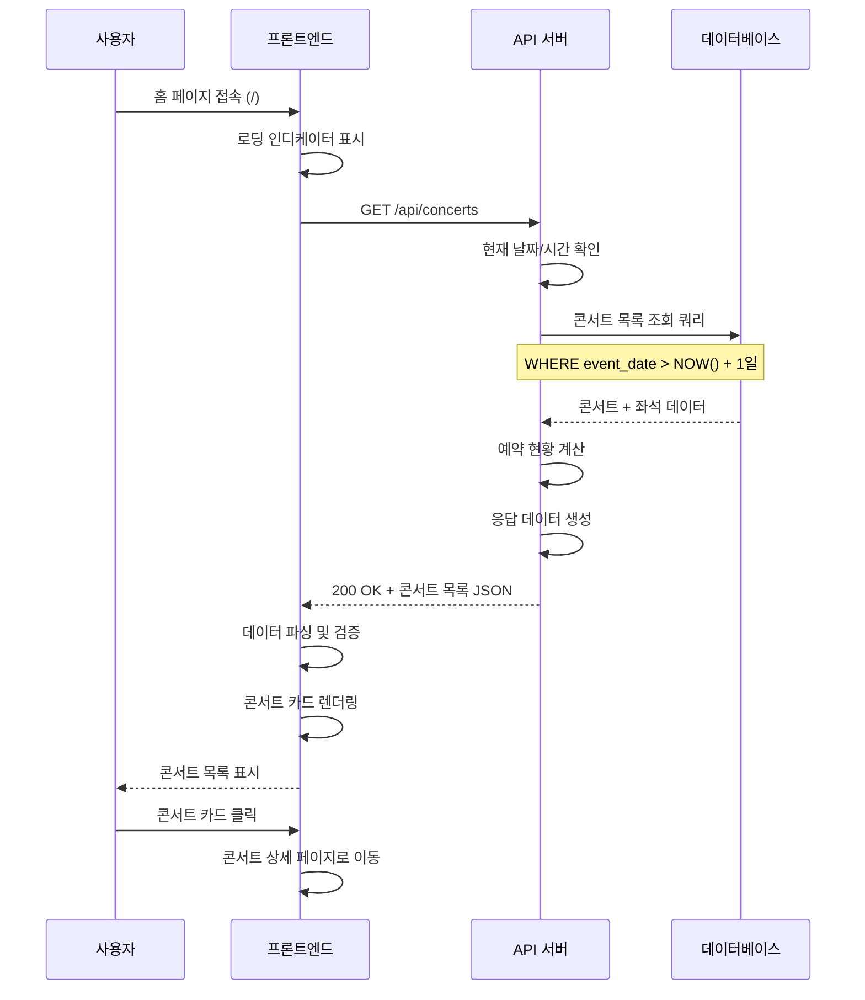

# 유스케이스: 콘서트 목록 조회

## 유스케이스 ID: UF-001

### 제목
콘서트 목록 조회 및 표시

---

## 1. 개요

### 1.1 목적
사용자가 홈 페이지에 접속하여 예약 가능한 콘서트 목록을 조회하고, 각 콘서트의 예약 현황을 확인할 수 있도록 합니다. 이를 통해 사용자는 관심 있는 콘서트를 빠르게 탐색하고 상세 페이지로 이동할 수 있습니다.

### 1.2 범위
- 예약 가능한 콘서트 목록의 조회 및 필터링
- 각 콘서트별 예약 현황(예약 인원/총 정원) 계산 및 표시
- 콘서트 기본 정보(제목, 일시, 장소, 썸네일) 표시
- 콘서트 상세 페이지로의 네비게이션 제공

**제외 사항**:
- 콘서트 검색 및 정렬 기능
- 콘서트 필터링(날짜, 장소, 가격 등)
- 찜하기 또는 북마크 기능
- 페이지네이션(현재 단계에서는 전체 목록 표시)

### 1.3 액터
- **주요 액터**: 일반 사용자(콘서트 관람객)
- **부 액터**:
  - 웹 서버(API 서버)
  - 데이터베이스 서버(PostgreSQL)

---

## 2. 선행 조건

- 데이터베이스에 최소 1개 이상의 콘서트 데이터가 존재해야 함
- 각 콘서트에 대해 320개의 좌석 데이터가 생성되어 있어야 함
- 웹 서버 및 데이터베이스 서버가 정상 작동 중이어야 함
- 사용자의 브라우저가 정상적으로 작동하고 인터넷에 연결되어 있어야 함

---

## 3. 참여 컴포넌트

- **프론트엔드(클라이언트)**: 사용자 인터페이스 렌더링, API 요청 전송, 로딩 및 에러 상태 관리
- **API 서버**: 클라이언트 요청 처리, 비즈니스 로직 수행, 데이터 응답
- **데이터베이스(PostgreSQL)**: 콘서트 및 좌석 데이터 저장 및 조회
- **웹 브라우저**: 사용자 인터페이스 표시, 사용자 입력 처리

---

## 4. 기본 플로우 (Basic Flow)

### 4.1 단계별 흐름

1. **사용자**: 브라우저에서 홈 페이지(/) 접속
   - 입력: 없음(URL 직접 접근 또는 로고 클릭)
   - 처리: 브라우저가 홈 페이지 로드 요청 전송
   - 출력: 로딩 인디케이터 표시

2. **프론트엔드**: API 서버에 콘서트 목록 요청 전송
   - 입력: 없음(GET 요청)
   - 처리: `GET /api/concerts` 엔드포인트 호출
   - 출력: 로딩 상태 유지

3. **API 서버**: 현재 날짜 및 시간 확인
   - 입력: 시스템 현재 시간
   - 처리: 서버 시간 기준으로 현재 날짜 및 시간 획득
   - 출력: 타임스탬프 생성

4. **API 서버**: 데이터베이스에 콘서트 조회 쿼리 실행
   - 입력: 현재 날짜 및 시간
   - 처리:
     ```sql
     SELECT
       c.id,
       c.title,
       c.event_date,
       c.location,
       c.thumbnail_url,
       COUNT(s.id) FILTER (WHERE s.is_reserved = false) as available_seats,
       COUNT(s.id) FILTER (WHERE s.is_reserved = true) as reserved_seats,
       COUNT(s.id) as total_seats
     FROM concerts c
     LEFT JOIN seats s ON c.id = s.concert_id
     WHERE c.event_date > (NOW() + INTERVAL '1 day')
     GROUP BY c.id
     ORDER BY c.event_date ASC;
     ```
   - 출력: 콘서트 목록 데이터셋

5. **API 서버**: 각 콘서트별 예약 현황 계산
   - 입력: 조회된 콘서트 및 좌석 데이터
   - 처리:
     - 총 좌석 수: 320석 확인
     - 예약된 좌석 수 카운트
     - 예약 가능한 좌석 수 계산(320 - 예약된 좌석 수)
     - 예약 현황 문자열 생성(예: "45/320명")
   - 출력: 예약 현황 정보가 포함된 콘서트 데이터

6. **API 서버**: 비즈니스 로직 검증 및 응답 데이터 생성
   - 입력: 가공된 콘서트 목록
   - 처리:
     - 진행일이 현재 날짜 기준 전날 23:59:59까지인 콘서트만 필터링
     - 응답 데이터 구조화(JSON 형식)
   - 출력: HTTP 200 OK 응답 with JSON 데이터

7. **프론트엔드**: 응답 데이터 수신 및 파싱
   - 입력: API 응답(JSON)
   - 처리:
     - JSON 파싱
     - 데이터 유효성 검증
     - 상태 관리 업데이트
   - 출력: 렌더링 가능한 콘서트 목록 데이터

8. **프론트엔드**: 콘서트 목록 UI 렌더링
   - 입력: 파싱된 콘서트 데이터
   - 처리: 각 콘서트 카드 생성 및 표시
   - 출력: 화면에 다음 정보를 포함한 콘서트 카드 목록 표시
     - 콘서트 제목
     - 콘서트 일시(포맷: YYYY년 MM월 DD일 HH:MM)
     - 장소
     - 예약 현황(예: "45/320명")
     - 썸네일 이미지(있는 경우)

9. **사용자**: 관심 있는 콘서트 카드 클릭
   - 입력: 마우스 클릭 이벤트
   - 처리: 클릭된 콘서트의 ID 추출
   - 출력: 콘서트 상세 페이지로 네비게이션(`/concerts/:concertId`)

### 4.2 시퀀스 다이어그램



---

## 5. 대안 플로우 (Alternative Flows)

### 5.1 대안 플로우 1: 모든 좌석이 매진된 콘서트

**시작 조건**: 기본 플로우 8단계(UI 렌더링) 시점

**단계**:
1. 프론트엔드가 콘서트 데이터 확인 시 `available_seats === 0` 감지
2. 해당 콘서트 카드에 "매진" 배지 또는 표시 추가
3. 카드 클릭은 여전히 가능하나 시각적으로 매진 상태 강조
4. 사용자가 매진된 콘서트 카드 클릭 시 상세 페이지로 이동
5. 상세 페이지에서 "예약하기" 버튼은 비활성화 상태로 표시

**결과**: 사용자는 매진된 콘서트 정보를 확인할 수 있으나 예약 진행은 불가

### 5.2 대안 플로우 2: 캐시된 데이터 사용

**시작 조건**: 사용자가 일정 시간 내에 홈 페이지를 재방문

**단계**:
1. 프론트엔드가 로컬 캐시 또는 브라우저 캐시 확인
2. 캐시 유효성 검증(타임스탬프 기반, 예: 5분 이내)
3. 유효한 캐시가 있는 경우:
   - API 요청 생략
   - 캐시된 데이터로 즉시 렌더링
4. 백그라운드에서 최신 데이터 조회(선택적)
5. 최신 데이터 도착 시 UI 업데이트

**결과**: 페이지 로드 속도 향상, 서버 부하 감소

---

## 6. 예외 플로우 (Exception Flows)

### 6.1 예외 상황 1: 예약 가능한 콘서트가 없는 경우

**발생 조건**:
- 데이터베이스에 콘서트 데이터가 없음
- 모든 콘서트의 진행일이 이미 지났음
- 모든 콘서트가 예약 마감 기간을 초과함

**처리 방법**:
1. API 서버가 빈 배열([]) 반환 with HTTP 200 OK
2. 프론트엔드가 빈 배열 감지
3. 빈 상태(Empty State) UI 표시:
   - 아이콘 또는 일러스트레이션
   - "현재 예약 가능한 콘서트가 없습니다." 메시지
   - "새로운 콘서트가 곧 등록될 예정입니다." 안내 텍스트
4. 사용자에게 예약 조회 페이지 링크 제공(선택사항)

**에러 코드**: 해당 없음(정상 응답)

**사용자 메시지**: "현재 예약 가능한 콘서트가 없습니다."

### 6.2 예외 상황 2: 서버 에러 (500 Internal Server Error)

**발생 조건**:
- 데이터베이스 연결 실패
- 쿼리 실행 중 예외 발생
- 서버 내부 오류

**처리 방법**:
1. API 서버가 에러 감지 및 로깅
2. HTTP 500 응답 전송 with 에러 메시지
3. 프론트엔드가 에러 응답 수신
4. 에러 페이지 또는 모달 표시:
   - "일시적인 오류가 발생했습니다." 메시지
   - "잠시 후 다시 시도해 주세요." 안내
   - "새로고침" 또는 "재시도" 버튼 제공
5. 에러 로그 전송(모니터링 시스템)

**에러 코드**: `SERVER_ERROR_500`

**사용자 메시지**: "일시적인 오류가 발생했습니다. 잠시 후 다시 시도해 주세요."

### 6.3 예외 상황 3: 네트워크 타임아웃

**발생 조건**:
- API 요청이 일정 시간(예: 10초) 내에 응답 없음
- 네트워크 연결 불안정
- 서버 과부하

**처리 방법**:
1. 프론트엔드의 HTTP 클라이언트가 타임아웃 감지
2. 로딩 인디케이터를 에러 UI로 전환
3. 타임아웃 안내 메시지 표시:
   - "네트워크 연결이 불안정합니다." 메시지
   - "재시도" 버튼 제공
4. 사용자가 재시도 버튼 클릭 시:
   - 기본 플로우 2단계부터 재실행
5. 3회 재시도 실패 시 고객센터 안내(향후)

**에러 코드**: `NETWORK_TIMEOUT`

**사용자 메시지**: "네트워크 연결이 불안정합니다. 재시도 버튼을 눌러주세요."

### 6.4 예외 상황 4: 네트워크 오프라인

**발생 조건**:
- 사용자의 인터넷 연결이 끊김
- 브라우저가 오프라인 상태 감지

**처리 방법**:
1. 프론트엔드가 `navigator.onLine === false` 확인
2. 오프라인 안내 UI 표시:
   - "인터넷 연결이 끊겼습니다." 메시지
   - 네트워크 아이콘 표시
3. 네트워크 재연결 감지 시:
   - 자동으로 데이터 재요청
   - 또는 "새로고침" 버튼 활성화
4. 캐시된 데이터가 있는 경우 제한적으로 표시(선택사항)

**에러 코드**: `NETWORK_OFFLINE`

**사용자 메시지**: "인터넷 연결이 끊겼습니다. 연결을 확인해 주세요."

### 6.5 예외 상황 5: 데이터베이스 응답 지연

**발생 조건**:
- 대량의 동시 접속으로 인한 데이터베이스 부하
- 복잡한 쿼리 실행으로 인한 지연
- 인덱스 누락

**처리 방법**:
1. 프론트엔드에서 장시간(5초 이상) 로딩 인디케이터 표시
2. "데이터를 불러오고 있습니다. 잠시만 기다려주세요." 메시지 추가
3. 10초 이상 지연 시 타임아웃 처리(예외 6.3)
4. 서버 측에서 쿼리 성능 모니터링 및 최적화 필요
5. 필요 시 캐싱 레이어 추가(Redis 등)

**에러 코드**: 해당 없음(장시간 대기)

**사용자 메시지**: "데이터를 불러오고 있습니다. 잠시만 기다려주세요."

### 6.6 예외 상황 6: 유효하지 않은 데이터 형식

**발생 조건**:
- API 응답 JSON 파싱 실패
- 필수 필드 누락
- 데이터 타입 불일치

**처리 방법**:
1. 프론트엔드의 데이터 검증 로직에서 에러 감지
2. 에러 로깅 및 모니터링 시스템에 보고
3. 사용자에게 일반적인 에러 메시지 표시
4. 개발자에게 알림 전송(Sentry 등)
5. 유효한 데이터만 선별하여 표시(부분 렌더링)

**에러 코드**: `INVALID_DATA_FORMAT`

**사용자 메시지**: "데이터를 불러오는 중 문제가 발생했습니다. 새로고침 후 다시 시도해 주세요."

---

## 7. 후행 조건 (Post-conditions)

### 7.1 성공 시

- **데이터베이스 변경**: 없음(읽기 전용 작업)
- **시스템 상태**:
  - 프론트엔드에 콘서트 목록 데이터가 로드됨
  - 사용자가 콘서트 카드를 클릭하여 상세 페이지로 이동 가능한 상태
- **외부 시스템**: 해당 없음
- **사용자 경험**:
  - 사용자는 예약 가능한 콘서트 목록을 확인
  - 각 콘서트의 예약 현황을 한눈에 파악
  - 관심 있는 콘서트를 선택하여 다음 단계로 진행 가능

### 7.2 실패 시

- **데이터 롤백**: 해당 없음(읽기 전용 작업)
- **시스템 상태**:
  - 프론트엔드에 에러 메시지 또는 빈 상태 UI 표시
  - 재시도 또는 새로고침 가능한 상태 유지
- **로깅**:
  - 에러 로그가 서버 및 클라이언트 모니터링 시스템에 기록됨
  - 에러 발생 시간, 사용자 정보(익명), 에러 타입 등 기록

---

## 8. 비기능 요구사항

### 8.1 성능

- **페이지 로드 시간**: 3초 이내(네트워크 지연 포함)
- **API 응답 시간**:
  - 평균: 500ms 이내
  - 최대: 2초 이내
- **데이터베이스 쿼리 성능**:
  - 쿼리 실행 시간: 100ms 이내
  - 인덱스 활용: `idx_concerts_event_date`, `idx_seats_concert_reserved`
- **동시 접속 처리**:
  - 최소 100명 동시 사용자 지원
  - 초당 요청 처리: 50 TPS(Transactions Per Second)
- **렌더링 성능**:
  - First Contentful Paint: 1.5초 이내
  - Time to Interactive: 3초 이내

### 8.2 보안

- **SQL Injection 방지**:
  - Prepared Statement 또는 ORM 사용
  - 사용자 입력 없음(읽기 전용)
- **XSS 방지**:
  - 콘서트 제목 및 설명 출력 시 HTML 이스케이프 처리
  - 썸네일 URL 검증
- **HTTPS 사용**:
  - 모든 API 통신은 HTTPS를 통해 암호화
- **API Rate Limiting**:
  - 동일 IP에서 초당 10회 이상 요청 시 제한
  - DDoS 공격 방지
- **민감 정보 노출 방지**:
  - 에러 메시지에 내부 정보(스택 트레이스 등) 노출 금지

### 8.3 가용성

- **시스템 가동률**: 99% 이상(월 기준 다운타임 7.2시간 이하)
- **장애 복구 시간(MTTR)**: 1시간 이내
- **데이터베이스 백업**: 일일 자동 백업, 1주일 보관
- **에러 처리**:
  - Graceful Degradation: 부분 장애 시 일부 기능만 동작
  - Fallback 메커니즘: 캐시 데이터 활용
- **모니터링**:
  - 실시간 서버 상태 모니터링(Uptime, CPU, Memory)
  - 에러 알림 시스템(Slack, Email)

### 8.4 확장성

- **수평적 확장**:
  - API 서버 다중 인스턴스 배포 가능
  - 로드 밸런서를 통한 트래픽 분산
- **캐싱 전략**:
  - CDN을 통한 정적 리소스(썸네일 이미지) 캐싱
  - API 레벨 캐싱(Redis) 적용 가능
- **데이터베이스 최적화**:
  - 읽기 전용 복제본(Read Replica) 활용
  - 인덱스 최적화

---

## 9. UI/UX 요구사항

### 9.1 화면 구성

**레이아웃**:
- 헤더:
  - 로고(홈으로 이동)
  - 네비게이션: "콘서트 목록", "예약 조회"
- 메인 콘텐츠:
  - 페이지 제목: "예약 가능한 콘서트"
  - 콘서트 카드 그리드(2-4열, 반응형)
- 푸터(선택사항)

**콘서트 카드 디자인**:
- 썸네일 이미지(16:9 비율 또는 정사각형)
- 콘서트 제목(최대 2줄, 초과 시 말줄임)
- 공연 일시(아이콘 + 텍스트)
- 장소(아이콘 + 텍스트)
- 예약 현황(배지 또는 프로그레스 바):
  - "45/320명" 형식
  - 매진 시 "매진" 배지 표시
- 호버 효과: 카드 상승, 그림자 효과
- 클릭 가능 영역: 카드 전체

**로딩 상태**:
- 스켈레톤 UI(카드 모양의 플레이스홀더)
- 또는 중앙 로딩 스피너

**빈 상태**:
- 중앙 정렬 아이콘
- 안내 메시지
- 부가 설명 텍스트

**에러 상태**:
- 에러 아이콘
- 에러 메시지
- 재시도 버튼

### 9.2 사용자 경험

**반응형 디자인**:
- 모바일(~767px): 1열 카드 그리드
- 태블릿(768px~1023px): 2열 카드 그리드
- 데스크톱(1024px+): 3-4열 카드 그리드

**접근성(Accessibility)**:
- WCAG 2.1 AA 레벨 준수
- 키보드 네비게이션 지원(Tab, Enter)
- 스크린 리더 호환(적절한 ARIA 레이블)
- 충분한 색상 대비(4.5:1 이상)
- 포커스 표시 명확화

**인터랙션**:
- 페이지 로드 시 부드러운 페이드인 애니메이션
- 카드 호버 시 즉각적인 피드백(0.2초 트랜지션)
- 클릭 시 클릭 효과(리플 또는 스케일 다운)
- 로딩 중 사용자 인터랙션 차단(오버레이 또는 비활성화)

**성능 최적화**:
- 이미지 레이지 로딩(Lazy Loading)
- 썸네일 이미지 최적화(WebP 포맷, 적절한 사이즈)
- 초기 렌더링 시 중요 콘텐츠 우선 표시

**정보 위계**:
- 콘서트 제목이 가장 눈에 띄게(큰 폰트, 볼드)
- 예약 현황이 두 번째로 강조(색상 또는 배지)
- 일시 및 장소는 부가 정보로 표시

---

## 10. 데이터 요구사항

### 10.1 API 요청 데이터

**엔드포인트**: `GET /api/concerts`

**Query Parameters**: 없음(향후 확장 가능)

**Headers**:
- `Accept: application/json`
- `Content-Type: application/json`

### 10.2 API 응답 데이터

**성공 응답 (HTTP 200 OK)**:

```json
{
  "success": true,
  "data": [
    {
      "id": "uuid-v4",
      "title": "BTS 콘서트",
      "description": "방탄소년단 월드투어",
      "eventDate": "2025-12-25T19:00:00+09:00",
      "location": "서울 올림픽 공원",
      "thumbnailUrl": "https://example.com/images/bts-concert.jpg",
      "totalSeats": 320,
      "reservedSeats": 45,
      "availableSeats": 275,
      "isSoldOut": false,
      "createdAt": "2025-10-01T10:00:00+09:00"
    },
    {
      "id": "uuid-v4-2",
      "title": "아이유 콘서트",
      "description": "아이유 단독 콘서트",
      "eventDate": "2025-12-30T18:00:00+09:00",
      "location": "잠실 종합운동장",
      "thumbnailUrl": "https://example.com/images/iu-concert.jpg",
      "totalSeats": 320,
      "reservedSeats": 320,
      "availableSeats": 0,
      "isSoldOut": true,
      "createdAt": "2025-10-05T14:00:00+09:00"
    }
  ],
  "meta": {
    "totalCount": 2,
    "timestamp": "2025-10-13T12:00:00+09:00"
  }
}
```

**빈 목록 응답 (HTTP 200 OK)**:

```json
{
  "success": true,
  "data": [],
  "meta": {
    "totalCount": 0,
    "timestamp": "2025-10-13T12:00:00+09:00"
  }
}
```

**에러 응답 (HTTP 500)**:

```json
{
  "success": false,
  "error": {
    "code": "SERVER_ERROR_500",
    "message": "Internal Server Error",
    "displayMessage": "일시적인 오류가 발생했습니다. 잠시 후 다시 시도해 주세요."
  },
  "meta": {
    "timestamp": "2025-10-13T12:00:00+09:00"
  }
}
```

### 10.3 데이터베이스 스키마

**참조 테이블**:
1. `concerts`: 콘서트 기본 정보
2. `seats`: 각 콘서트의 좌석 정보(320석)

**필요한 인덱스**:
- `idx_concerts_event_date`: 날짜 기반 필터링 최적화
- `idx_seats_concert_id`: 콘서트별 좌석 조회 최적화
- `idx_seats_concert_reserved`: 예약 현황 집계 최적화

**쿼리 참조**: database.md의 DF-001 참조

### 10.4 데이터 검증

**서버 측 검증**:
- 콘서트 진행일이 현재 날짜보다 미래인지 확인
- 좌석 수가 320석인지 확인
- 예약된 좌석 수가 총 좌석 수를 초과하지 않는지 확인

**클라이언트 측 검증**:
- 필수 필드 존재 여부 확인(id, title, eventDate, location)
- 데이터 타입 확인(eventDate는 ISO 8601 형식)
- 좌석 수 정합성 확인(totalSeats === reservedSeats + availableSeats)

---

## 11. 테스트 시나리오

### 11.1 성공 케이스

| 테스트 케이스 ID | 테스트 시나리오 | 입력값 | 기대 결과 |
|-----------------|---------------|--------|----------|
| TC-UF001-01 | 정상적으로 콘서트 목록 조회 | 홈 페이지 접속 | 예약 가능한 콘서트 목록이 카드 형식으로 표시됨 |
| TC-UF001-02 | 예약 현황 정확히 표시 | 콘서트 ID(45석 예약됨) | "45/320명" 형태로 표시됨 |
| TC-UF001-03 | 매진된 콘서트 표시 | 콘서트 ID(320석 예약됨) | "매진" 배지가 표시되고 카드 시각적 구분 |
| TC-UF001-04 | 콘서트 카드 클릭 | 콘서트 카드 클릭 | 해당 콘서트 상세 페이지로 이동 |
| TC-UF001-05 | 날짜 기반 필터링 | 오늘 날짜 기준 | 진행일이 전날까지인 콘서트만 표시 |
| TC-UF001-06 | 콘서트 정렬 | 여러 콘서트 존재 | 진행일 오름차순으로 정렬되어 표시 |
| TC-UF001-07 | 반응형 디자인(모바일) | 모바일 화면 접속 | 1열 카드 그리드로 표시 |
| TC-UF001-08 | 반응형 디자인(데스크톱) | 데스크톱 화면 접속 | 3-4열 카드 그리드로 표시 |
| TC-UF001-09 | 썸네일 이미지 표시 | 썸네일 URL이 있는 콘서트 | 썸네일 이미지가 정상 표시됨 |
| TC-UF001-10 | 로딩 인디케이터 | API 응답 지연(2초) | 로딩 인디케이터가 표시되다가 데이터 로드 후 사라짐 |

### 11.2 실패 케이스

| 테스트 케이스 ID | 테스트 시나리오 | 입력값 | 기대 결과 |
|-----------------|---------------|--------|----------|
| TC-UF001-E01 | 예약 가능한 콘서트 없음 | 모든 콘서트 마감 | 빈 상태 UI 표시: "현재 예약 가능한 콘서트가 없습니다." |
| TC-UF001-E02 | 서버 에러 발생 | API 500 에러 | 에러 메시지 및 재시도 버튼 표시 |
| TC-UF001-E03 | 네트워크 타임아웃 | 10초 이상 무응답 | 타임아웃 메시지 및 재시도 버튼 표시 |
| TC-UF001-E04 | 네트워크 오프라인 | 인터넷 연결 끊김 | "인터넷 연결이 끊겼습니다." 메시지 표시 |
| TC-UF001-E05 | 유효하지 않은 JSON | 잘못된 JSON 형식 응답 | 에러 메시지 표시 및 로그 기록 |
| TC-UF001-E06 | 필수 필드 누락 | title이 없는 콘서트 데이터 | 해당 콘서트 제외하고 나머지 표시 또는 에러 처리 |
| TC-UF001-E07 | 잘못된 날짜 형식 | eventDate가 ISO 8601이 아님 | 날짜 파싱 실패 처리 및 에러 로그 |
| TC-UF001-E08 | 좌석 수 불일치 | reservedSeats > totalSeats | 데이터 검증 실패, 에러 로그 기록 |
| TC-UF001-E09 | 썸네일 이미지 로드 실패 | 잘못된 이미지 URL | 대체 이미지(placeholder) 표시 |
| TC-UF001-E10 | 데이터베이스 연결 실패 | DB 다운 | 500 에러 응답, 에러 메시지 표시 |

### 11.3 엣지 케이스

| 테스트 케이스 ID | 테스트 시나리오 | 입력값 | 기대 결과 |
|-----------------|---------------|--------|----------|
| TC-UF001-X01 | 매우 긴 콘서트 제목 | 100자 이상 제목 | 말줄임(...) 처리되어 표시 |
| TC-UF001-X02 | 특수문자 포함 제목 | `<script>alert('xss')</script>` | HTML 이스케이프되어 안전하게 표시 |
| TC-UF001-X03 | 대량의 콘서트 데이터 | 100개 이상 콘서트 | 모든 콘서트가 정상 렌더링됨(페이지네이션 고려) |
| TC-UF001-X04 | 동일 진행일 콘서트 | 같은 날짜 여러 콘서트 | 정렬 기준 추가(시간 또는 등록일) |
| TC-UF001-X05 | 썸네일 URL 없음 | thumbnailUrl: null | 기본 이미지 표시 |
| TC-UF001-X06 | 빠른 페이지 이동 | API 응답 전 페이지 이탈 | 요청 취소 및 메모리 누수 방지 |
| TC-UF001-X07 | 브라우저 뒤로가기 | 상세 페이지 → 뒤로가기 | 목록 페이지 즉시 표시(캐시 활용) |
| TC-UF001-X08 | 다중 탭 동시 접속 | 여러 탭에서 홈 접속 | 각 탭 독립적으로 정상 작동 |
| TC-UF001-X09 | 진행일 정확히 전날 23:59:59 | 예약 마감 경계 시간 | 마감 시간까지는 표시, 이후 제외 |
| TC-UF001-X10 | 시간대 차이(타임존) | 서버와 클라이언트 시간대 다름 | 올바른 타임존(+09:00) 기준으로 표시 |

---

## 12. 관련 유스케이스

- **선행 유스케이스**: 없음(시스템 진입점)
- **후행 유스케이스**:
  - UF-002: 콘서트 상세 조회
  - UF-003: 좌석 선택
- **연관 유스케이스**:
  - UF-006: 예약 조회(네비게이션 링크)
  - UF-009: 페이지 새로고침 처리

---

## 13. 외부 연동

### 13.1 CDN (Content Delivery Network)
- **목적**: 썸네일 이미지 빠른 로드
- **사용 방식**:
  - 이미지 URL이 CDN 엔드포인트를 가리킴
  - 예: `https://cdn.example.com/images/concert-thumbnails/xxx.jpg`
- **장애 대응**: CDN 장애 시 원본 서버로 폴백

### 13.2 모니터링 시스템
- **서비스**: Sentry, DataDog, CloudWatch 등
- **연동 내용**:
  - 에러 로그 자동 전송
  - 성능 메트릭 수집(API 응답 시간, 페이지 로드 시간)
  - 사용자 행동 추적(선택사항)

### 13.3 분석 시스템 (선택사항)
- **서비스**: Google Analytics, Mixpanel 등
- **추적 이벤트**:
  - 페이지 방문 수
  - 콘서트 카드 클릭 수
  - 매진 콘서트 조회 수

---

## 14. 변경 이력

| 버전 | 날짜 | 작성자 | 변경 내용 |
|------|------|--------|-----------|
| 1.0  | 2025-10-13 | Product Team | 초기 작성 |

---

## 부록

### A. 용어 정의

- **콘서트 목록**: 예약 가능한 콘서트들의 집합
- **예약 현황**: 전체 좌석 수 대비 예약된 좌석 수의 비율
- **매진**: 모든 좌석이 예약되어 더 이상 예약 불가능한 상태
- **진행일**: 콘서트가 실제로 진행되는 날짜 및 시간
- **예약 마감**: 진행일 전날 23:59:59까지만 예약 가능
- **빈 상태(Empty State)**: 표시할 데이터가 없을 때 보여주는 UI
- **스켈레톤 UI**: 데이터 로딩 중 표시되는 플레이스홀더 UI

### B. 참고 자료

- **PRD**: `/docs/prd.md`
- **유저플로우**: `/docs/userflow.md` - UF-001
- **데이터베이스 설계**: `/docs/database.md` - DF-001
- **API 명세**: `/docs/api-specification.md` (향후 작성)
- **디자인 시스템**: `/docs/design-system.md` (향후 작성)

### C. 데이터베이스 쿼리 예시

```sql
-- 콘서트 목록 조회 쿼리
SELECT
  c.id,
  c.title,
  c.description,
  c.event_date,
  c.location,
  c.thumbnail_url,
  COUNT(s.id) FILTER (WHERE s.is_reserved = false) as available_seats,
  COUNT(s.id) FILTER (WHERE s.is_reserved = true) as reserved_seats,
  COUNT(s.id) as total_seats
FROM concerts c
LEFT JOIN seats s ON c.id = s.concert_id
WHERE c.event_date > (NOW() + INTERVAL '1 day')
GROUP BY c.id
ORDER BY c.event_date ASC;
```

### D. 성능 최적화 체크리스트

- [ ] 데이터베이스 인덱스 생성 확인
- [ ] API 응답 시간 모니터링 설정
- [ ] 이미지 최적화(WebP, 적절한 사이즈)
- [ ] CDN 설정 확인
- [ ] 캐싱 전략 구현(선택사항)
- [ ] 로딩 스켈레톤 UI 구현
- [ ] 레이지 로딩 적용
- [ ] HTTP/2 또는 HTTP/3 활성화

### E. 접근성 체크리스트

- [ ] 키보드 네비게이션 테스트
- [ ] 스크린 리더 호환성 테스트
- [ ] 색상 대비 확인(4.5:1 이상)
- [ ] ARIA 레이블 적용
- [ ] 포커스 표시 명확화
- [ ] 대체 텍스트(alt text) 제공

---

**문서 버전**: 1.0
**최종 수정일**: 2025-10-13
**작성자**: Product Team
**검토자**: Development Team, UX Team
