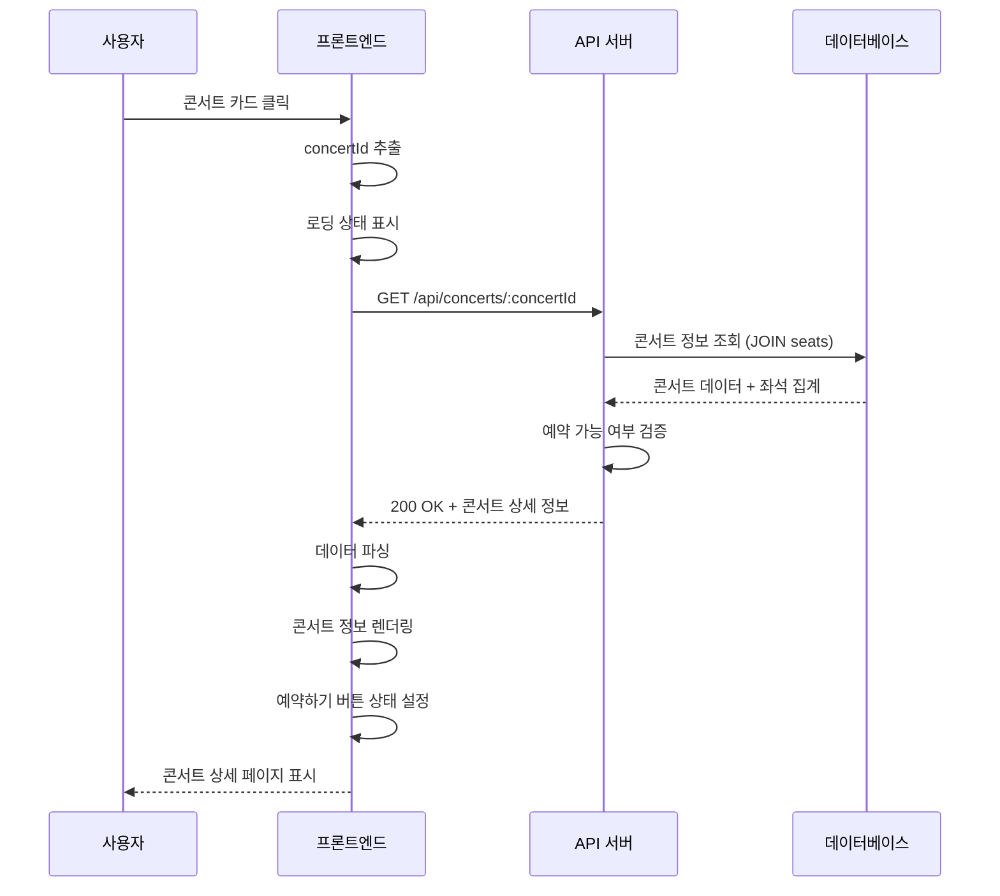

# 유스케이스: UF-002 - 콘서트 상세 조회

## 유스케이스 ID: UC-002

### 제목
콘서트 상세 정보 조회 및 예약 가능 여부 확인

---

## 1. 개요

### 1.1 목적
사용자가 선택한 콘서트의 상세 정보를 조회하고, 예약 가능 여부를 확인하여 예약 프로세스 진입을 결정할 수 있도록 합니다.

### 1.2 범위
- 콘서트 기본 정보 표시 (제목, 설명, 일시, 장소, 출연진)
- 좌석 등급별 가격 정보 표시 (S, P, A, R 등급)
- 예약 가능 좌석 수 계산 및 표시
- 예약 가능 기간 검증
- 예약하기 버튼 활성화/비활성화 제어
- 예외 상황 처리 (콘서트 미존재, 예약 마감, 매진 등)

**제외 사항**:
- 실제 좌석 배치도 조회 (UF-003에서 처리)
- 예약 생성 (UF-005에서 처리)

### 1.3 액터
- **주요 액터**: 일반 사용자 (콘서트 관람객)
- **부 액터**:
  - 백엔드 API 서버
  - PostgreSQL 데이터베이스

---

## 2. 선행 조건

사용자가 다음 중 하나의 방법으로 페이지에 접근:
- 콘서트 목록 페이지에서 특정 콘서트 카드 클릭 (UF-001)
- 직접 URL 입력 (`/concerts/:concertId`)
- 브라우저 북마크 또는 외부 링크 접근

콘서트 ID(`concertId`)가 URL 파라미터로 전달되어야 함

---

## 3. 참여 컴포넌트

- **프론트엔드 (React/Next.js)**:
  - 콘서트 상세 페이지 렌더링
  - URL에서 concertId 추출
  - 예약하기 버튼 상태 제어

- **백엔드 API 서버**:
  - GET `/api/concerts/:concertId` 엔드포인트
  - 콘서트 정보 조회 및 검증
  - 좌석 현황 집계

- **PostgreSQL 데이터베이스**:
  - `concerts` 테이블: 콘서트 기본 정보
  - `seats` 테이블: 좌석 예약 현황

---

## 4. 기본 플로우 (Basic Flow)

### 4.1 단계별 흐름

1. **사용자**: 콘서트 목록에서 특정 콘서트 카드 클릭
   - 입력: 클릭 이벤트
   - 처리: 페이지 라우팅
   - 출력: `/concerts/:concertId` URL로 이동

2. **프론트엔드**: URL에서 `concertId` 추출
   - 입력: URL 파라미터
   - 처리: Next.js 라우터를 통한 파라미터 파싱
   - 출력: `concertId` 값

3. **프론트엔드**: 로딩 상태 표시
   - 입력: 페이지 진입
   - 처리: 스켈레톤 UI 또는 로딩 인디케이터 렌더링
   - 출력: 로딩 화면 표시

4. **프론트엔드**: 백엔드 API 호출
   - 입력: `concertId`
   - 처리: `GET /api/concerts/:concertId` 요청 전송
   - 출력: HTTP 요청

5. **백엔드 API**: 콘서트 정보 조회
   - 입력: `concertId`
   - 처리: 데이터베이스 쿼리 실행
   ```sql
   SELECT
     c.id,
     c.title,
     c.description,
     c.event_date,
     c.location,
     c.thumbnail_url,
     COUNT(s.id) FILTER (WHERE s.is_reserved = false) as available_seats,
     COUNT(s.id) as total_seats
   FROM concerts c
   LEFT JOIN seats s ON c.id = s.concert_id
   WHERE c.id = :concert_id
   GROUP BY c.id;

   -- 좌석 등급 정보 조회
   SELECT
     grade_code,
     grade_name,
     start_row,
     end_row,
     price,
     color_code,
     display_order
   FROM seat_grades
   ORDER BY display_order;
   ```
   - 출력: 콘서트 정보 객체 및 좌석 등급 목록 또는 NULL

6. **백엔드 API**: 콘서트 존재 여부 확인
   - 입력: 쿼리 결과
   - 처리: 결과가 NULL인지 확인
   - 출력: 존재 여부 판단 (true/false)

7. **백엔드 API**: 예약 가능 여부 검증
   - 입력: `event_date`
   - 처리:
     - 현재 날짜/시간 확인
     - 예약 마감 일시 계산 (`event_date - 1 day 23:59:59`)
     - 현재 시간이 예약 마감 전인지 확인
   - 출력: 예약 가능 여부 (boolean)

8. **백엔드 API**: 응답 데이터 생성
   - 입력: 콘서트 정보, 예약 가능 여부, 좌석 등급 정보
   - 처리: JSON 응답 객체 생성
   ```json
   {
     "id": "uuid",
     "title": "콘서트 제목",
     "description": "상세 설명",
     "event_date": "2025-12-25T19:00:00+09:00",
     "location": "서울 올림픽 공원",
     "thumbnail_url": "https://...",
     "available_seats": 275,
     "total_seats": 320,
     "is_bookable": true,
     "booking_deadline": "2025-12-24T23:59:59+09:00",
     "seat_grades": [
       {
         "code": "S",
         "name": "Special",
         "price": 250000,
         "color": "#9333EA",
         "rows": "1-3행"
       },
       {
         "code": "P",
         "name": "Premium",
         "price": 190000,
         "color": "#0EA5E9",
         "rows": "4-7행"
       },
       {
         "code": "A",
         "name": "Advanced",
         "price": 170000,
         "color": "#10B981",
         "rows": "8-15행"
       },
       {
         "code": "R",
         "name": "Regular",
         "price": 140000,
         "color": "#F97316",
         "rows": "16-20행"
       }
     ]
   }
   ```
   - 출력: HTTP 200 응답

9. **프론트엔드**: 응답 데이터 수신
   - 입력: API 응답
   - 처리: JSON 파싱
   - 출력: 콘서트 상태 객체

10. **프론트엔드**: 콘서트 상세 정보 렌더링
    - 입력: 콘서트 데이터
    - 처리: UI 컴포넌트 렌더링
    - 출력: 화면에 다음 정보 표시
      - 콘서트 제목 (h1)
      - 썸네일 이미지 (있는 경우)
      - 상세 설명 (텍스트)
      - 공연 일시 (포맷팅: "2025년 12월 25일 19:00")
      - 장소 (아이콘 + 텍스트)
      - 출연진 정보 (있는 경우)
      - 예약 가능 좌석 수 ("남은 좌석: 275/320석")
      - 좌석 등급별 가격 정보:
        - S등급 (Special): ₩250,000 (1-3행) - 보라색
        - P등급 (Premium): ₩190,000 (4-7행) - 하늘색
        - A등급 (Advanced): ₩170,000 (8-15행) - 초록색
        - R등급 (Regular): ₩140,000 (16-20행) - 주황색

11. **프론트엔드**: 예약하기 버튼 상태 설정
    - 입력: `is_bookable`, `available_seats`
    - 처리:
      ```javascript
      const isButtonEnabled = is_bookable && available_seats > 0
      ```
    - 출력:
      - **활성화**: 예약 가능한 경우
      - **비활성화**: 예약 불가능한 경우

12. **사용자**: 콘서트 정보 확인
    - 입력: 렌더링된 화면
    - 처리: 정보 검토
    - 출력: 예약 진행 또는 뒤로가기 결정

### 4.2 시퀀스 다이어그램



---

## 5. 대안 플로우 (Alternative Flows)

### 5.1 대안 플로우 1: 예약 마감된 콘서트

**시작 조건**: 기본 플로우 7단계 (예약 가능 여부 검증) 실패

**단계**:
1. **백엔드 API**: 현재 시간이 예약 마감 시간 이후임을 확인
2. **백엔드 API**: `is_bookable = false` 플래그 설정
3. **백엔드 API**: 응답 데이터 생성 (콘서트 정보 포함, 예약 불가 상태)
4. **프론트엔드**: 콘서트 정보는 정상 렌더링
5. **프론트엔드**: 예약하기 버튼 비활성화
6. **프론트엔드**: 예약 마감 안내 메시지 표시
   - 위치: 예약하기 버튼 위 또는 하단
   - 텍스트: "예약 기간이 종료되었습니다. (마감: YYYY-MM-DD 23:59)"
   - 스타일: 경고 배지 (노란색/주황색)

**결과**: 사용자는 콘서트 정보를 볼 수 있지만 예약 진행 불가

### 5.2 대안 플로우 2: 매진된 콘서트

**시작 조건**: 기본 플로우 5단계에서 `available_seats = 0`

**단계**:
1. **백엔드 API**: 좌석 집계 결과 확인 (`available_seats = 0`)
2. **백엔드 API**: 응답 데이터에 매진 상태 포함
3. **프론트엔드**: 콘서트 정보는 정상 렌더링
4. **프론트엔드**: 예약하기 버튼 비활성화
5. **프론트엔드**: 매진 안내 표시
   - 텍스트: "매진되었습니다"
   - 스타일: 빨간색 배지
   - 위치: 좌석 정보 옆 또는 버튼 위

**결과**: 사용자는 콘서트 정보를 볼 수 있지만 예약 진행 불가

### 5.3 대안 플로우 3: 동시 접속으로 인한 데이터 변경

**시작 조건**: 페이지 로드 후 다른 사용자가 좌석을 예약하여 데이터 변경

**단계**:
1. **프론트엔드**: 초기 데이터로 페이지 렌더링 (예: 남은 좌석 100석)
2. **프론트엔드**: 선택적 폴링 또는 WebSocket 연결 (향후 구현 고려)
3. **다른 사용자**: 해당 콘서트의 좌석 예약 (예: 4석)
4. **프론트엔드**: (폴링 구현 시) 주기적으로 API 재호출 (예: 30초 간격)
5. **백엔드 API**: 최신 좌석 현황 반환 (남은 좌석 96석)
6. **프론트엔드**: 화면 업데이트 (부드러운 전환 애니메이션)
7. **프론트엔드**: 변경 안내 토스트 표시 (선택사항)
   - 텍스트: "좌석 현황이 업데이트되었습니다"

**결과**: 사용자는 항상 최신 예약 현황을 볼 수 있음 (폴링 구현 시)

**현재 버전**: 실시간 동기화 없음. 사용자가 수동으로 새로고침하거나 예약 페이지 진입 시 최신 데이터 확인

---

## 6. 예외 플로우 (Exception Flows)

### 6.1 예외 상황 1: 존재하지 않는 콘서트

**발생 조건**:
- 잘못된 `concertId` 입력
- 삭제된 콘서트 접근
- URL 조작

**처리 방법**:
1. **백엔드 API**: 데이터베이스 쿼리 결과 NULL 확인
2. **백엔드 API**: 404 응답 생성
   ```json
   {
     "error": "NOT_FOUND",
     "message": "콘서트를 찾을 수 없습니다."
   }
   ```
3. **프론트엔드**: 404 에러 페이지 렌더링
4. **프론트엔드**: 다음 요소 표시
   - 에러 아이콘 (큰 아이콘)
   - 제목: "콘서트를 찾을 수 없습니다"
   - 설명: "요청하신 콘서트가 존재하지 않거나 삭제되었습니다."
   - 홈으로 돌아가기 버튼

**에러 코드**: HTTP 404 NOT FOUND

**사용자 메시지**: "콘서트를 찾을 수 없습니다. 홈으로 돌아가 다른 콘서트를 확인해주세요."

### 6.2 예외 상황 2: 서버 에러

**발생 조건**:
- 데이터베이스 연결 실패
- 쿼리 실행 오류
- 내부 서버 오류

**처리 방법**:
1. **백엔드 API**: 에러 로깅
2. **백엔드 API**: 500 응답 생성
   ```json
   {
     "error": "INTERNAL_SERVER_ERROR",
     "message": "일시적인 오류가 발생했습니다."
   }
   ```
3. **프론트엔드**: 에러 메시지 표시
4. **프론트엔드**: 재시도 버튼 제공
5. **프론트엔드**: 뒤로가기 버튼 제공

**에러 코드**: HTTP 500 INTERNAL SERVER ERROR

**사용자 메시지**: "일시적인 오류가 발생했습니다. 잠시 후 다시 시도해주세요."

### 6.3 예외 상황 3: 네트워크 타임아웃

**발생 조건**:
- 느린 네트워크 연결
- API 응답 지연 (30초 초과)
- 네트워크 단절

**처리 방법**:
1. **프론트엔드**: Fetch API 타임아웃 설정 (30초)
2. **프론트엔드**: 타임아웃 발생 시 에러 핸들링
3. **프론트엔드**: 다음 요소 표시
   - 경고 아이콘
   - 제목: "연결 시간 초과"
   - 설명: "서버 응답이 지연되고 있습니다."
   - 재시도 버튼
   - 뒤로가기 버튼

**에러 코드**: CLIENT_TIMEOUT (클라이언트 측)

**사용자 메시지**: "네트워크 연결 상태를 확인하고 다시 시도해주세요."

### 6.4 예외 상황 4: 잘못된 데이터 형식

**발생 조건**:
- `concertId`가 UUID 형식이 아님
- 특수문자나 SQL 인젝션 시도

**처리 방법**:
1. **백엔드 API**: 입력값 검증 (UUID 형식 체크)
2. **백엔드 API**: 400 응답 생성
   ```json
   {
     "error": "BAD_REQUEST",
     "message": "잘못된 요청입니다."
   }
   ```
3. **프론트엔드**: 에러 페이지 또는 홈으로 리디렉션

**에러 코드**: HTTP 400 BAD REQUEST

**사용자 메시지**: "잘못된 접근입니다. 홈으로 돌아가주세요."

---

## 7. 후행 조건 (Post-conditions)

### 7.1 성공 시

**데이터베이스 변경**:
- 없음 (조회만 수행, 데이터 변경 없음)

**시스템 상태**:
- 사용자는 콘서트 상세 정보를 확인한 상태
- 예약하기 버튼이 적절히 활성화/비활성화된 상태
- 예약 진행 준비 완료

**외부 시스템**:
- 없음

**사용자 다음 액션**:
- **예약 가능한 경우**: 예약하기 버튼 클릭 → UF-003 (좌석 선택) 진행
- **예약 불가능한 경우**: 뒤로가기 → UF-001 (콘서트 목록)로 복귀

### 7.2 실패 시

**데이터 롤백**:
- 없음 (조회 쿼리만 수행)

**시스템 상태**:
- 사용자는 에러 페이지를 보고 있는 상태
- 재시도 또는 이탈 대기 상태

**사용자 다음 액션**:
- 재시도 버튼 클릭 → 동일 플로우 재실행
- 홈으로 돌아가기 → UF-001 진행
- 브라우저 뒤로가기 → 이전 페이지

---

## 8. 비기능 요구사항

### 8.1 성능

- **API 응답 시간**: 500ms 이내 (P95)
- **페이지 로드 시간**: 3초 이내 (First Contentful Paint)
- **데이터베이스 쿼리 시간**: 200ms 이내
- **동시 접속 지원**: 최소 100명의 동시 사용자

**성능 최적화 전략**:
- `idx_concerts_event_date` 인덱스 활용
- `idx_seats_concert_reserved` 복합 인덱스로 좌석 집계 최적화
- 콘서트 데이터 캐싱 (Redis, 5분 TTL)
- CDN을 통한 썸네일 이미지 전달

### 8.2 보안

- **입력 검증**:
  - `concertId` UUID 형식 검증
  - SQL 인젝션 방지 (Parameterized Query)
  - XSS 방지 (출력 이스케이핑)

- **데이터 보호**:
  - HTTPS 통신 강제
  - CORS 정책 적용

- **에러 처리**:
  - 내부 에러 상세 정보 노출 금지
  - 스택 트레이스 로깅만 수행

### 8.3 가용성

- **시스템 가동률**: 99% 이상
- **에러 복구**:
  - 데이터베이스 연결 풀 자동 재연결
  - API 재시도 로직 (Exponential Backoff)

- **모니터링**:
  - API 응답 시간 모니터링
  - 에러율 추적 (목표: 1% 이하)

### 8.4 확장성

- **수평 확장**:
  - Stateless API 서버 (로드 밸런서 지원)
  - 데이터베이스 읽기 복제본 활용 (Read Replica)

- **캐싱 전략**:
  - 콘서트 기본 정보 캐싱 (5분)
  - 좌석 현황은 실시간 조회 (캐싱 제외)

---

## 9. UI/UX 요구사항

### 9.1 화면 구성

**레이아웃 구조** (데스크톱):
```
+--------------------------------------------------+
|  [Header: 로고 | 콘서트 목록 | 예약 조회]         |
+--------------------------------------------------+
|  [← 뒤로가기]                                      |
+--------------------------------------------------+
|                                                  |
|  +--------------------------------------------+  |
|  |                                            |  |
|  |         [썸네일 이미지]                     |  |
|  |           (16:9 비율)                      |  |
|  |                                            |  |
|  +--------------------------------------------+  |
|                                                  |
|  콘서트 제목 (H1, 굵게, 크게)                     |
|                                                  |
|  [📅 2025년 12월 25일 (수) 19:00]                |
|  [📍 서울 올림픽 공원 체조경기장]                  |
|                                                  |
|  +--------------------------------------------+  |
|  | 상세 설명 (여러 줄)                          |  |
|  | Lorem ipsum dolor sit amet...              |  |
|  +--------------------------------------------+  |
|                                                  |
|  출연진: BTS, IU, ...                            |
|                                                  |
|  +--------------------------------------------+  |
|  | 예약 정보                                   |  |
|  | 남은 좌석: 275/320석                        |  |
|  | [⚠️ 예약 마감: 2025-12-24 23:59]   (조건부) |  |
|  | [🔴 매진]                            (조건부) |  |
|  +--------------------------------------------+  |
|                                                  |
|  +--------------------------------------------+  |
|  |        [예약하기 버튼]         (크고 눈에 띄게) |  |
|  +--------------------------------------------+  |
|                                                  |
+--------------------------------------------------+
|  [Footer]                                        |
+--------------------------------------------------+
```

**반응형 디자인** (모바일):
- 썸네일 이미지: 전체 너비
- 콘텐츠 패딩: 좌우 16px
- 버튼: 하단 고정 (Sticky)

### 9.2 사용자 경험

**로딩 상태**:
- 스켈레톤 UI 표시 (제목, 이미지, 텍스트 블록)
- 로딩 시간이 2초 이상인 경우 로딩 바 표시

**인터랙션**:
- **예약하기 버튼**:
  - **활성화 상태**:
    - 배경색: 주요 브랜드 컬러 (예: 파란색)
    - 호버: 약간 어두운 톤
    - 클릭: 약간 축소 애니메이션
  - **비활성화 상태**:
    - 배경색: 회색
    - 커서: not-allowed
    - 호버 효과 없음

**상태 표시**:
- **예약 마감**: 노란색/주황색 배지, 경고 아이콘
- **매진**: 빨간색 배지, X 아이콘
- **예약 가능**: 녹색 텍스트, 체크 아이콘

**애니메이션**:
- 페이지 진입: 페이드인 (200ms)
- 버튼 호버: 트랜지션 (150ms)
- 좌석 수 변경: 숫자 카운트업 애니메이션 (500ms)

### 9.3 접근성 (Accessibility)

- **시맨틱 HTML**: `<h1>`, `<section>`, `<button>` 사용
- **ARIA 레이블**:
  - `aria-label="뒤로가기"` (뒤로가기 버튼)
  - `aria-disabled="true"` (비활성화 버튼)
- **키보드 네비게이션**:
  - Tab 키로 모든 인터랙티브 요소 접근 가능
  - Enter/Space로 버튼 클릭
- **스크린 리더**:
  - 이미지 alt 텍스트
  - 상태 변경 시 알림 (aria-live)

---

## 10. 데이터 요구사항

### 10.1 입력 데이터

| 필드 | 타입 | 필수 | 설명 | 검증 규칙 |
|------|------|------|------|----------|
| concertId | UUID | O | 콘서트 고유 ID | UUID v4 형식 |

### 10.2 출력 데이터

#### 성공 응답 (HTTP 200)

```json
{
  "id": "550e8400-e29b-41d4-a716-446655440000",
  "title": "BTS 콘서트 2025",
  "description": "방탄소년단의 2025년 월드투어 서울 공연입니다. 최고의 무대를 선사합니다.",
  "event_date": "2025-12-25T19:00:00+09:00",
  "location": "서울 올림픽 공원 체조경기장",
  "thumbnail_url": "https://cdn.example.com/concerts/bts-2025.jpg",
  "performers": ["BTS", "Special Guest"],
  "available_seats": 275,
  "total_seats": 320,
  "reserved_seats": 45,
  "is_bookable": true,
  "booking_deadline": "2025-12-24T23:59:59+09:00",
  "created_at": "2025-01-01T00:00:00+09:00"
}
```

#### 에러 응답

**404 Not Found**:
```json
{
  "error": "NOT_FOUND",
  "message": "콘서트를 찾을 수 없습니다.",
  "code": "CONCERT_NOT_FOUND"
}
```

**500 Internal Server Error**:
```json
{
  "error": "INTERNAL_SERVER_ERROR",
  "message": "일시적인 오류가 발생했습니다.",
  "code": "SERVER_ERROR"
}
```

### 10.3 데이터베이스 쿼리

```sql
-- 콘서트 상세 조회 쿼리
SELECT
  c.id,
  c.title,
  c.description,
  c.event_date,
  c.location,
  c.thumbnail_url,
  c.created_at,
  COUNT(s.id) FILTER (WHERE s.is_reserved = false) as available_seats,
  COUNT(s.id) FILTER (WHERE s.is_reserved = true) as reserved_seats,
  COUNT(s.id) as total_seats
FROM concerts c
LEFT JOIN seats s ON c.id = s.concert_id
WHERE c.id = $1
GROUP BY c.id;
```

**인덱스 활용**:
- `concerts.id` (Primary Key)
- `idx_seats_concert_id`
- `idx_seats_concert_reserved`

**예상 성능**:
- 쿼리 실행 시간: 50-100ms
- 인덱스 스캔: O(log n)
- 집계 연산: O(320) (좌석 수 고정)

---

## 11. 테스트 시나리오

### 11.1 성공 케이스

| 테스트 케이스 ID | 입력값 | 사전 조건 | 기대 결과 |
|----------------|--------|----------|----------|
| TC-002-01 | 유효한 concertId | 예약 가능한 콘서트 존재 | 콘서트 상세 정보 표시, 예약하기 버튼 활성화 |
| TC-002-02 | 유효한 concertId | 예약 마감된 콘서트 | 콘서트 정보 표시, 예약하기 버튼 비활성화, 마감 안내 표시 |
| TC-002-03 | 유효한 concertId | 매진된 콘서트 (available_seats=0) | 콘서트 정보 표시, 예약하기 버튼 비활성화, 매진 표시 |
| TC-002-04 | 유효한 concertId | 남은 좌석 1석 | 콘서트 정보 표시, "1/320석" 표시, 버튼 활성화 |

### 11.2 실패 케이스

| 테스트 케이스 ID | 입력값 | 사전 조건 | 기대 결과 | HTTP 코드 |
|----------------|--------|----------|----------|-----------|
| TC-002-E01 | 존재하지 않는 UUID | 없음 | 404 에러 페이지, "콘서트를 찾을 수 없습니다" 메시지 | 404 |
| TC-002-E02 | 잘못된 UUID 형식 ("abc123") | 없음 | 400 에러, 홈으로 리디렉션 | 400 |
| TC-002-E03 | NULL 또는 빈 문자열 | 없음 | 400 에러, 홈으로 리디렉션 | 400 |
| TC-002-E04 | 유효한 concertId | DB 연결 실패 | 500 에러 메시지, 재시도 버튼 표시 | 500 |
| TC-002-E05 | 유효한 concertId | 네트워크 타임아웃 (30초) | 타임아웃 메시지, 재시도 옵션 | - |

### 11.3 경계값 테스트

| 테스트 케이스 ID | 조건 | 기대 결과 |
|----------------|------|----------|
| TC-002-B01 | 예약 마감 정확히 1초 전 | 예약 가능 상태 |
| TC-002-B02 | 예약 마감 정확히 1초 후 | 예약 불가 상태, 마감 안내 |
| TC-002-B03 | available_seats = 320 (전석 비어있음) | 예약 가능, "320/320석" 표시 |
| TC-002-B04 | available_seats = 0 (전석 매진) | 예약 불가, 매진 표시 |

### 11.4 통합 테스트

| 테스트 케이스 ID | 시나리오 | 검증 항목 |
|----------------|----------|----------|
| TC-002-I01 | 콘서트 목록 → 상세 페이지 → 뒤로가기 | 네비게이션 정상 동작, 상태 유지 |
| TC-002-I02 | 상세 페이지 → 예약하기 → 좌석 선택 페이지 | concertId 전달 확인 |
| TC-002-I03 | 페이지 새로고침 (F5) | 최신 데이터 재조회, 정상 렌더링 |
| TC-002-I04 | 브라우저 뒤로가기 → 앞으로가기 | 페이지 상태 복원 |

---

## 12. 관련 유스케이스

### 선행 유스케이스
- **UF-001: 콘서트 목록 조회**: 사용자가 콘서트를 선택하여 상세 페이지로 진입

### 후행 유스케이스
- **UF-003: 좌석 선택**: 예약하기 버튼 클릭 시 좌석 선택 프로세스 시작
- **UF-009: 페이지 새로고침 처리**: 사용자가 페이지를 새로고침하는 경우

### 연관 유스케이스
- **UF-006: 예약 조회**: 사용자가 해당 콘서트의 예약을 확인하려는 경우
- **UF-010: 동시성 제어**: 여러 사용자가 동시에 같은 콘서트를 조회하는 경우

---

## 13. 엣지 케이스 상세

### 13.1 동시 접속으로 인한 데이터 변경

**시나리오**:
1. 사용자 A가 콘서트 상세 페이지 로드 (남은 좌석: 100석)
2. 사용자 B가 해당 콘서트 4석 예약 완료
3. 사용자 A가 예약하기 버튼 클릭

**처리**:
- 현재 구현: 좌석 선택 페이지(UF-003) 진입 시 최신 좌석 정보 재조회
- 향후 개선:
  - 실시간 좌석 수 업데이트 (WebSocket 또는 폴링)
  - 변경 감지 시 사용자에게 알림

**예상 결과**:
- 사용자 A는 예약 페이지에서 96석만 예약 가능 상태로 확인
- 데이터 불일치 없음

### 13.2 콘서트 삭제 후 접근

**시나리오**:
1. 사용자가 콘서트 상세 페이지 URL을 북마크
2. 관리자가 해당 콘서트 삭제
3. 사용자가 북마크를 통해 접근

**처리**:
- 데이터베이스 쿼리 결과 NULL
- 404 에러 페이지 표시
- "콘서트가 삭제되었거나 존재하지 않습니다" 안내
- 홈으로 돌아가기 버튼 제공

### 13.3 캐싱된 데이터와 실제 데이터 불일치

**시나리오**:
1. Redis에 콘서트 정보 캐싱 (TTL: 5분)
2. 데이터베이스에서 좌석 예약 발생
3. 사용자가 캐싱된 데이터 조회

**처리**:
- 좌석 현황(`available_seats`)은 캐싱 제외, 항상 실시간 조회
- 콘서트 기본 정보(제목, 설명 등)만 캐싱
- 중요 데이터는 DB 직접 조회

**예상 결과**:
- 좌석 수는 항상 정확한 값 표시
- 성능과 정확성의 균형 유지

---

## 14. 변경 이력

| 버전 | 날짜 | 작성자 | 변경 내용 |
|------|------|--------|-----------|
| 1.0  | 2025-10-13 | Product Team | 초기 작성 |

---

## 부록

### A. 용어 정의

- **concertId**: 콘서트를 식별하는 UUID 형식의 고유 ID
- **available_seats**: 현재 예약 가능한 좌석 수 (is_reserved = false)
- **reserved_seats**: 이미 예약된 좌석 수 (is_reserved = true)
- **is_bookable**: 예약 가능 여부 플래그 (예약 기간, 좌석 현황 고려)
- **booking_deadline**: 예약 마감 일시 (콘서트 진행일 - 1일 23:59:59)
- **event_date**: 콘서트 진행 일시

### B. API 명세

**Endpoint**: `GET /api/concerts/:concertId`

**Path Parameters**:
- `concertId` (UUID, required): 콘서트 ID

**Response Headers**:
- `Content-Type: application/json`
- `Cache-Control: public, max-age=300` (5분 캐싱, 좌석 수 제외)

**Response Body**: 섹션 10.2 참조

**Error Codes**:
- `CONCERT_NOT_FOUND`: 콘서트 미존재
- `INVALID_CONCERT_ID`: 잘못된 ID 형식
- `SERVER_ERROR`: 서버 내부 오류

### C. 참고 자료

- [PRD: 콘서트 예약 플랫폼](/Users/choesumin/Desktop/supernext/docs/prd.md)
- [유저플로우 설계서](/Users/choesumin/Desktop/supernext/docs/userflow.md)
- [데이터베이스 설계서](/Users/choesumin/Desktop/supernext/docs/database.md)
- UF-001: 콘서트 목록 조회
- UF-003: 좌석 선택
- UF-009: 페이지 새로고침 처리
