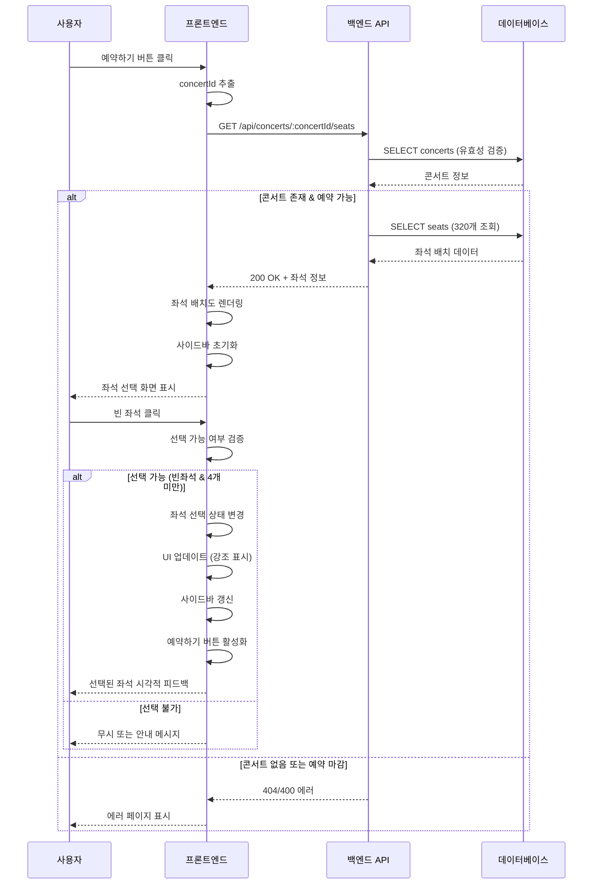

# 유스케이스 작성서

## 유스케이스 ID: UC-003

### 제목
콘서트 예약을 위한 좌석 선택

---

## 1. 개요

### 1.1 목적
사용자가 콘서트 예약 페이지에서 실시간으로 좌석 배치도를 확인하고 원하는 좌석을 선택하여 예약 프로세스를 진행할 수 있도록 한다. 이를 통해 사용자는 시각적으로 직관적인 인터페이스를 통해 최대 4개까지의 좌석을 선택할 수 있다.

### 1.2 범위
- **포함**:
  - 예약 페이지 진입 시 좌석 배치도 조회
  - 320석(4개 구역 × 4x20 그리드) 좌석 상태 실시간 표시
  - 좌석 등급별 색상 표시 (S/P/A/R 등급)
  - 빈 좌석 선택 기능 (최대 4석)
  - 선택된 좌석 정보 사이드바 표시
  - 좌석 선택 상태 관리
  - 좌석 등급 범례 표시

- **제외**:
  - 좌석 선택 해제 기능 (UC-004에서 처리)
  - 예약 정보 입력 및 제출 (UC-005에서 처리)
  - 좌석 임시 예약 기능 (향후 고려사항)

### 1.3 액터
- **주요 액터**: 콘서트 예약 사용자 (일반 사용자)
- **부 액터**:
  - 백엔드 API 서버
  - PostgreSQL 데이터베이스
  - 웹 브라우저

---

## 2. 선행 조건

- 사용자가 콘서트 상세 페이지에서 예약하기 버튼을 클릭한 상태
- URL 파라미터에 유효한 `concertId`가 포함되어 있어야 함
- 해당 콘서트가 데이터베이스에 존재해야 함
- 콘서트의 예약 가능 기간이 유효해야 함 (진행일 전날 23:59:59까지)
- 사용자의 브라우저가 JavaScript를 지원하고 활성화되어 있어야 함
- 네트워크 연결이 정상적이어야 함

---

## 3. 참여 컴포넌트

- **프론트엔드 (웹 클라이언트)**:
  - 좌석 배치도 렌더링
  - 사용자 인터랙션 처리
  - 좌석 선택 상태 관리
  - 사이드바 UI 업데이트

- **백엔드 API 서버**:
  - 좌석 배치 정보 조회 API 제공
  - 좌석 상태 검증
  - 콘서트 정보 유효성 확인

- **데이터베이스 (PostgreSQL)**:
  - `concerts` 테이블: 콘서트 정보 조회
  - `seats` 테이블: 320개 좌석 정보 및 예약 상태 조회

---

## 4. 기본 플로우 (Basic Flow)

### 4.1 단계별 흐름

#### 단계 1: 예약 페이지 진입
1. **사용자**: 콘서트 상세 페이지에서 "예약하기" 버튼 클릭
   - 입력: 없음 (상세 페이지에서 자동 전달된 `concertId`)
   - 처리: 페이지 라우팅 (`/concerts/:concertId/booking`)
   - 출력: 예약 페이지 로드 시작

#### 단계 2: 좌석 배치도 데이터 조회 요청
2. **프론트엔드**: URL에서 `concertId` 추출 및 API 요청
   - 입력: `concertId` (UUID)
   - 처리: `GET /api/concerts/:concertId/seats` API 호출
   - 출력: HTTP 요청 전송

#### 단계 3: 콘서트 유효성 검증
3. **백엔드 API**: 콘서트 존재 및 예약 가능 여부 확인
   - 입력: `concertId`
   - 처리:
     ```sql
     SELECT id, event_date
     FROM concerts
     WHERE id = :concertId
       AND event_date > (NOW() + INTERVAL '1 day');
     ```
   - 출력: 콘서트 정보 또는 null

#### 단계 4: 좌석 배치 정보 조회
4. **백엔드 API**: 320개 좌석 정보 조회
   - 입력: `concertId`
   - 처리:
     ```sql
     SELECT
       id,
       section,
       row,
       column,
       is_reserved
     FROM seats
     WHERE concert_id = :concertId
     ORDER BY section, row, column;
     ```
   - 출력: 320개 좌석 배열 데이터

#### 단계 5: 응답 데이터 구성
5. **백엔드 API**: 좌석 배치도 응답 생성
   - 입력: 좌석 조회 결과
   - 처리: JSON 응답 포맷 구성
   - 출력:
     ```json
     {
       "concertId": "uuid",
       "concertTitle": "콘서트 제목",
       "eventDate": "2025-12-25T19:00:00+09:00",
       "totalSeats": 320,
       "availableSeats": 285,
       "sections": [
         {
           "name": "A",
           "seats": [
             {
               "id": "seat-uuid",
               "section": "A",
               "row": 1,
               "column": 1,
               "isReserved": false
             },
             // ... 79개 좌석
           ]
         },
         // B, C, D 섹션
       ]
     }
     ```

#### 단계 6: 좌석 배치도 렌더링
6. **프론트엔드**: 좌석 배치도 UI 렌더링
   - 입력: API 응답 데이터
   - 처리:
     - 4개 구역(A, B, C, D)을 2x2 그리드로 배치
     - 각 구역 내 4x20 좌석 그리드 렌더링
     - 좌석 상태별 시각적 표시:
       - `isReserved: false` → 빈 좌석 (클릭 가능)
       - `isReserved: true` → 예약된 좌석 (비활성화)
   - 출력: 좌석 배치도 화면 표시

#### 단계 7: 우측 사이드바 초기화
7. **프론트엔드**: 사이드바 UI 초기 상태 렌더링
   - 입력: 좌석 배치도 데이터
   - 처리: 사이드바 컴포넌트 생성
   - 출력:
     - 남은 좌석 수 표시 (예: "285/320석 남음")
     - 선택된 좌석 목록 (초기: 비어있음)
     - 예약하기 버튼 (초기: 비활성화)

#### 단계 8: 좌석 선택 대기
8. **시스템**: 사용자 입력 대기 상태
   - 입력: 없음
   - 처리: 이벤트 리스너 활성화
   - 출력: 클릭 이벤트 대기

#### 단계 9: 사용자 좌석 클릭
9. **사용자**: 빈 좌석 클릭
   - 입력: 좌석 클릭 이벤트 (구역, 행, 열 정보)
   - 처리: 클릭 이벤트 발생
   - 출력: 좌석 정보 전달

#### 단계 10: 좌석 선택 가능 여부 검증 (클라이언트 측)
10. **프론트엔드**: 선택 가능 여부 확인
    - 입력: 클릭된 좌석 정보, 현재 선택된 좌석 목록
    - 처리:
      1. 해당 좌석이 이미 예약된 상태인지 확인
      2. 이미 선택된 좌석인지 확인
      3. 현재 선택된 좌석 수 카운트
      4. 선택된 좌석 수가 4개 미만인지 확인
    - 출력: 선택 가능 여부 (boolean)

#### 단계 11: 좌석 선택 상태 변경
11. **프론트엔드**: 좌석을 선택된 상태로 변경
    - 입력: 선택된 좌석 정보
    - 처리:
      - 좌석 선택 상태 업데이트 (로컬 state)
      - 선택된 좌석 목록에 추가
    - 출력: 업데이트된 선택 좌석 목록

#### 단계 12: 좌석 시각적 상태 업데이트
12. **프론트엔드**: 선택된 좌석 UI 강조 표시
    - 입력: 선택된 좌석 정보
    - 처리: CSS 클래스 변경 (예: 'seat-selected')
    - 출력: 선택된 좌석 시각적 강조 (예: 다른 색상, 테두리)

#### 단계 13: 사이드바 업데이트
13. **프론트엔드**: 우측 사이드바 정보 갱신
    - 입력: 업데이트된 선택 좌석 목록
    - 처리:
      - 선택된 좌석 카운트 증가
      - 좌석 정보 사이드바에 추가 (구역-행-열 형식)
      - 각 좌석 옆에 X 아이콘 표시
    - 출력:
      - 선택된 좌석 목록 UI 업데이트
      - 예: "A구역 1행 1열 [X]"

#### 단계 14: 예약하기 버튼 활성화
14. **프론트엔드**: 예약하기 버튼 상태 변경
    - 입력: 선택된 좌석 수 (>= 1)
    - 처리: 버튼 활성화 조건 체크
    - 출력: 예약하기 버튼 활성화 (클릭 가능 상태)

#### 단계 15: 추가 좌석 선택 대기
15. **시스템**: 추가 선택 또는 예약 진행 대기
    - 입력: 없음
    - 처리: 이벤트 리스너 계속 활성화
    - 출력: 다음 액션 대기 (좌석 추가 선택, 선택 해제, 예약하기 클릭)

### 4.2 시퀀스 다이어그램



---

## 5. 대안 플로우 (Alternative Flows)

### 5.1 대안 플로우 1: 이미 선택된 좌석 재클릭 (선택 해제)

**시작 조건**: 기본 플로우 단계 9에서 사용자가 이미 선택된 좌석을 다시 클릭

**단계**:
1. 프론트엔드가 클릭된 좌석이 이미 선택된 상태임을 확인
2. UC-004 (좌석 선택 해제)로 프로세스 분기
3. 좌석 선택 해제 처리 수행

**결과**: 해당 좌석이 선택 해제되고 기본 플로우 단계 8로 복귀

### 5.2 대안 플로우 2: 페이지 새로고침 후 재진입

**시작 조건**: 사용자가 좌석 선택 중 브라우저 새로고침 (F5, Cmd+R)

**단계**:
1. 페이지 완전 새로고침
2. URL에서 `concertId` 추출
3. 기본 플로우 단계 2부터 재시작
4. 선택된 좌석 정보 초기화 (세션 스토리지 복원 옵션 고려)
5. 최신 좌석 배치도 데이터로 렌더링

**결과**: 최신 좌석 상태로 페이지가 로드되고, 이전 선택 정보는 유지되지 않음

### 5.3 대안 플로우 3: 여러 좌석 연속 선택

**시작 조건**: 기본 플로우 단계 14 이후 사용자가 추가 좌석 선택

**단계**:
1. 사용자가 다른 빈 좌석 클릭
2. 기본 플로우 단계 10-14 반복 실행
3. 선택된 좌석 수가 4개에 도달할 때까지 반복 가능

**결과**: 최대 4개의 좌석이 선택된 상태로 예약하기 버튼 활성화 유지

---

## 6. 예외 플로우 (Exception Flows)

### 6.1 예외 상황 1: 콘서트를 찾을 수 없음

**발생 조건**:
- URL의 `concertId`가 데이터베이스에 존재하지 않음
- 잘못된 UUID 형식

**처리 방법**:
1. 백엔드 API가 콘서트 조회 실패 감지
2. HTTP 404 응답 반환
3. 프론트엔드가 404 에러 감지
4. 에러 페이지 렌더링
5. 홈으로 돌아가기 버튼 표시

**에러 코드**: `404 NOT_FOUND`

**사용자 메시지**: "요청하신 콘서트를 찾을 수 없습니다. 콘서트 목록으로 돌아가세요."

### 6.2 예외 상황 2: 예약 기간 종료

**발생 조건**:
- 콘서트의 `event_date`가 현재 날짜 + 1일 이내
- 예약 마감 시간 초과

**처리 방법**:
1. 백엔드 API가 예약 기간 검증 실패
2. HTTP 400 응답 반환
3. 프론트엔드가 400 에러 감지
4. 예약 마감 안내 페이지 표시
5. 콘서트 상세 또는 홈으로 이동 버튼 제공

**에러 코드**: `400 BAD_REQUEST`

**사용자 메시지**: "이 콘서트의 예약 기간이 종료되었습니다."

### 6.3 예외 상황 3: 좌석 데이터 없음

**발생 조건**:
- 콘서트는 존재하지만 좌석 데이터가 생성되지 않음
- 데이터 정합성 문제

**처리 방법**:
1. 백엔드 API가 좌석 조회 결과 0건 확인
2. HTTP 500 응답 반환
3. 프론트엔드가 500 에러 감지
4. 시스템 에러 페이지 표시
5. 관리자 문의 안내 메시지 표시

**에러 코드**: `500 INTERNAL_SERVER_ERROR`

**사용자 메시지**: "좌석 정보를 불러올 수 없습니다. 잠시 후 다시 시도해주세요."

### 6.4 예외 상황 4: 4개 초과 선택 시도

**발생 조건**:
- 사용자가 이미 4개 좌석을 선택한 상태에서 추가 선택 시도

**처리 방법**:
1. 프론트엔드가 선택된 좌석 수 확인 (=== 4)
2. 클릭 이벤트 무시
3. 토스트 알림 또는 툴팁 표시
4. 이전 상태 유지

**에러 코드**: N/A (클라이언트 측 처리)

**사용자 메시지**: "최대 4석까지만 선택할 수 있습니다."

### 6.5 예외 상황 5: 이미 예약된 좌석 클릭

**발생 조건**:
- 사용자가 `isReserved: true` 상태의 좌석 클릭 시도

**처리 방법**:
1. 프론트엔드가 좌석 상태 확인
2. 클릭 이벤트 무시
3. 시각적 피드백 없음 또는 간단한 툴팁 표시 (선택사항)

**에러 코드**: N/A (클라이언트 측 처리)

**사용자 메시지**: (선택사항) "이미 예약된 좌석입니다."

### 6.6 예외 상황 6: 네트워크 타임아웃

**발생 조건**:
- API 요청 후 응답이 일정 시간(예: 10초) 내 도착하지 않음

**처리 방법**:
1. 프론트엔드가 타임아웃 감지
2. 로딩 인디케이터 제거
3. 타임아웃 에러 메시지 표시
4. 재시도 버튼 제공

**에러 코드**: `TIMEOUT_ERROR`

**사용자 메시지**: "네트워크 연결이 원활하지 않습니다. 다시 시도해주세요."

### 6.7 예외 상황 7: 네트워크 오프라인

**발생 조건**:
- 사용자의 네트워크 연결 끊김

**처리 방법**:
1. 프론트엔드가 네트워크 상태 감지 (navigator.onLine)
2. 오프라인 안내 메시지 표시
3. 네트워크 연결 복구 시 자동 재시도 또는 수동 재시도 버튼

**에러 코드**: `NETWORK_ERROR`

**사용자 메시지**: "인터넷 연결이 끊어졌습니다. 연결 상태를 확인해주세요."

### 6.8 예외 상황 8: 서버 에러 (500)

**발생 조건**:
- 백엔드 API 서버 내부 오류
- 데이터베이스 연결 실패

**처리 방법**:
1. 백엔드 API가 에러 로깅
2. HTTP 500 응답 반환
3. 프론트엔드가 500 에러 감지
4. 일반 에러 메시지 표시
5. 뒤로가기 또는 재시도 버튼 제공

**에러 코드**: `500 INTERNAL_SERVER_ERROR`

**사용자 메시지**: "일시적인 오류가 발생했습니다. 잠시 후 다시 시도해주세요."

---

## 7. 후행 조건 (Post-conditions)

### 7.1 성공 시

- **데이터베이스 변경**:
  - 없음 (좌석 선택은 클라이언트 측 상태 관리만 수행)
  - 실제 예약 데이터는 UC-005 (예약 정보 입력 및 제출)에서 처리

- **시스템 상태**:
  - 프론트엔드: 1-4개의 좌석이 선택된 상태
  - 사이드바: 선택된 좌석 정보 표시
  - 예약하기 버튼: 활성화 상태
  - 좌석 배치도: 선택된 좌석 시각적 강조

- **외부 시스템**:
  - 없음

### 7.2 실패 시

- **데이터 롤백**:
  - 없음 (데이터베이스 변경 없음)

- **시스템 상태**:
  - 에러 종류에 따라 다음 상태 중 하나:
    1. 에러 페이지 표시
    2. 콘서트 상세 페이지로 복귀
    3. 홈 페이지로 리디렉션
  - 선택된 좌석 정보 초기화

---

## 8. 비기능 요구사항

### 8.1 성능
- **API 응답 시간**: 좌석 배치도 조회 API는 2초 이내에 응답해야 함
- **좌석 클릭 반응 시간**: 100ms 이내에 UI 업데이트 완료
- **렌더링 성능**: 320개 좌석을 1초 이내에 렌더링
- **동시 접속**: 최소 100명의 사용자가 동시에 좌석 선택 가능
- **페이지 로드 시간**: 3초 이내에 좌석 배치도 표시

### 8.2 보안
- **API 인증**: (현재 구현 제외, 향후 고려)
- **입력 검증**: `concertId` UUID 형식 검증
- **XSS 방지**: 사용자 입력 데이터 sanitization (해당 없음)
- **HTTPS**: 모든 API 통신은 HTTPS를 통해 이루어져야 함
- **CSRF 방지**: API 요청 시 CSRF 토큰 검증 (선택사항)

### 8.3 가용성
- **시스템 가동률**: 99% 이상
- **에러 복구**: 네트워크 에러 발생 시 자동 재시도 메커니즘
- **fallback**: API 실패 시 사용자 친화적인 에러 메시지 표시
- **타임아웃 설정**: 10초 이내 응답 없으면 타임아웃 처리

### 8.4 확장성
- **좌석 수 증가 대응**: (현재 320석 고정, 향후 가변 구조 고려)
- **캐싱 전략**: CDN을 통한 정적 리소스 캐싱
- **데이터베이스 인덱싱**: `seats` 테이블의 `concert_id`, `is_reserved` 인덱스 활용

---

## 9. UI/UX 요구사항

### 9.1 화면 구성

#### 레이아웃
```
┌─────────────────────────────────────────────────────────────┐
│ Header: 로고, 콘서트 목록, 예약 조회, 뒤로가기              │
├─────────────────────────────────────────────┬───────────────┤
│                                             │               │
│  좌석 배치도 영역 (좌측)                    │  사이드바     │
│                                             │  (우측)       │
│  ┌────────────┐  ┌────────────┐            │               │
│  │  구역 A    │  │  구역 B    │            │ 남은 좌석:    │
│  │  (4x20)    │  │  (4x20)    │            │ 285/320석     │
│  │            │  │            │            │               │
│  │ □□□□      │  │ □□□□      │            │ 선택된 좌석:  │
│  │ □■□□      │  │ □□■□      │            │ - A구역 1-2   │
│  │ ...        │  │ ...        │            │   [X]         │
│  └────────────┘  └────────────┘            │ - B구역 3-4   │
│                                             │   [X]         │
│  ┌────────────┐  ┌────────────┐            │               │
│  │  구역 C    │  │  구역 D    │            │ [예약하기]    │
│  │  (4x20)    │  │  (4x20)    │            │  (활성화)     │
│  │            │  │            │            │               │
│  │ □□□□      │  │ ■□□□      │            │               │
│  │ □□□□      │  │ □□□□      │            │               │
│  │ ...        │  │ ...        │            │               │
│  └────────────┘  └────────────┘            │               │
│                                             │               │
└─────────────────────────────────────────────┴───────────────┘
```

#### UI 요소
1. **좌석 아이콘**:
   - 빈 좌석: 등급별 색상 테두리, 클릭 가능 (호버 효과)
     - S등급 (1-3행): 보라색 테두리 (#9333EA)
     - P등급 (4-7행): 하늘색 테두리 (#0EA5E9)
     - A등급 (8-15행): 초록색 테두리 (#10B981)
     - R등급 (16-20행): 주황색 테두리 (#F97316)
   - 예약된 좌석: 어두운 회색, 비활성화
   - 선택된 좌석: 등급별 색상 배경 + 강조 테두리

2. **사이드바**:
   - 남은 좌석 수 표시 (큰 폰트)
   - 선택된 좌석 목록 (스크롤 가능)
   - 각 좌석 옆 X 아이콘 (선택 해제용)
   - 예약하기 버튼 (하단 고정)

3. **로딩 인디케이터**:
   - 페이지 진입 시 스켈레톤 UI 또는 스피너 표시

4. **범례 (Legend)**:
   - 좌석 등급 색상 설명:
     - S등급 (보라색): 1-3행, ₩250,000
     - P등급 (하늘색): 4-7행, ₩190,000
     - A등급 (초록색): 8-15행, ₩170,000
     - R등급 (주황색): 16-20행, ₩140,000
   - 좌석 상태 설명: 빈 좌석, 예약된 좌석, 선택된 좌석

### 9.2 사용자 경험

#### 인터랙션
1. **좌석 클릭**:
   - 클릭 시 즉각적인 시각적 피드백 (100ms 이내)
   - 부드러운 색상 전환 애니메이션

2. **호버 효과**:
   - 빈 좌석 마우스 오버 시 강조 표시
   - 커서 변경 (pointer)

3. **선택 제한 안내**:
   - 4개 선택 완료 시 토스트 메시지
   - 나머지 빈 좌석 클릭 방지

4. **스크롤 동작**:
   - 사이드바 스크롤 가능 (선택 좌석 많을 경우)
   - 좌석 배치도 전체 뷰 제공 (스크롤 최소화)

#### 반응형 디자인
1. **데스크톱 (1200px+)**:
   - 좌석 배치도 좌측, 사이드바 우측 (70:30 비율)
   - 좌석 아이콘 크기: 중간

2. **태블릿 (768px-1199px)**:
   - 좌석 배치도 상단, 사이드바 하단
   - 좌석 아이콘 크기: 작음

3. **모바일 (767px 이하)**:
   - 세로 레이아웃
   - 좌석 배치도 상단 (축소)
   - 사이드바 하단 고정
   - 좌석 아이콘 크기: 최소

#### 접근성 (Accessibility)
1. **키보드 네비게이션**:
   - Tab 키로 좌석 간 이동 가능
   - Enter/Space로 좌석 선택

2. **스크린 리더 지원**:
   - 좌석 상태를 텍스트로 읽을 수 있도록 aria-label 추가
   - 예: "A구역 1행 1열, 빈 좌석, 선택하려면 클릭"

3. **색상 대비**:
   - WCAG 2.1 AA 레벨 준수
   - 색상 외에 아이콘이나 패턴으로도 구분

---

## 10. 데이터 요구사항

### 10.1 입력 데이터

| 필드명 | 타입 | 필수 | 제약조건 | 설명 |
|--------|------|------|---------|------|
| concertId | UUID | Y | 유효한 UUID 형식 | 콘서트 고유 ID |

### 10.2 출력 데이터 (API 응답)

```typescript
interface SeatSelectionResponse {
  concertId: string;          // UUID
  concertTitle: string;        // 콘서트 제목
  eventDate: string;           // ISO 8601 형식
  totalSeats: number;          // 320 (고정)
  availableSeats: number;      // 예약 가능한 좌석 수
  sections: Section[];         // 4개 구역
}

interface Section {
  name: 'A' | 'B' | 'C' | 'D';  // 구역명
  seats: Seat[];                // 80개 좌석 (4x20)
}

interface Seat {
  id: string;                   // UUID
  section: 'A' | 'B' | 'C' | 'D';
  row: number;                  // 1-20
  seat_column: number;          // 1-4
  isReserved: boolean;          // true: 예약됨, false: 빈자리
  grade: 'S' | 'P' | 'A' | 'R'; // 좌석 등급 (행 기반)
  price: number;                // 좌석 가격 (원)
}
```

### 10.3 데이터베이스 스키마

#### 조회 테이블
1. **concerts**:
   - `id` (UUID, PK)
   - `title` (VARCHAR)
   - `event_date` (TIMESTAMPTZ)

2. **seats**:
   - `id` (UUID, PK)
   - `concert_id` (UUID, FK)
   - `section` (CHAR(1))
   - `row` (INTEGER)
   - `column` (INTEGER)
   - `is_reserved` (BOOLEAN)
   - `grade` (VARCHAR(1)): 좌석 등급 (S/P/A/R)
   - `price` (INTEGER): 좌석 가격 (원)

#### 사용 인덱스
- `idx_seats_concert_id`: 콘서트별 좌석 조회 성능 향상
- `idx_seats_concert_reserved`: 예약 가능 좌석 필터링 최적화

### 10.4 클라이언트 측 상태 관리

```typescript
interface ClientState {
  selectedSeats: Seat[];       // 선택된 좌석 목록 (최대 4개)
  isLoading: boolean;          // 로딩 상태
  error: string | null;        // 에러 메시지
  seatMap: Map<string, Seat>;  // 좌석 ID를 키로 하는 맵 (빠른 조회)
}
```

---

## 11. 테스트 시나리오

### 11.1 성공 케이스

| 테스트 케이스 ID | 입력값 | 기대 결과 |
|----------------|--------|----------|
| TC-003-01 | 유효한 concertId | 320개 좌석 배치도 렌더링, 사이드바 초기화 |
| TC-003-02 | 빈 좌석 1개 클릭 | 해당 좌석 선택 상태로 변경, 사이드바에 표시, 예약하기 버튼 활성화 |
| TC-003-03 | 빈 좌석 4개 연속 클릭 | 4개 좌석 모두 선택 상태, 사이드바에 4개 표시, 예약하기 버튼 활성화 |
| TC-003-04 | 좌석 선택 후 사이드바 확인 | 선택된 좌석 정보(구역-행-열) 정확히 표시 |
| TC-003-05 | 좌석 선택 후 남은 좌석 수 확인 | 남은 좌석 수 정확히 표시 (예: 284/320) |

### 11.2 실패 케이스

| 테스트 케이스 ID | 입력값 | 기대 결과 |
|----------------|--------|----------|
| TC-003-06 | 존재하지 않는 concertId | 404 에러 페이지 표시 |
| TC-003-07 | 예약 마감된 concertId | 400 에러, 예약 마감 안내 메시지 |
| TC-003-08 | 이미 예약된 좌석 클릭 | 클릭 무시, 상태 변경 없음 |
| TC-003-09 | 4개 선택 후 5번째 좌석 클릭 | 클릭 무시, 최대 선택 안내 메시지 표시 |
| TC-003-10 | 네트워크 오프라인 상태 | 오프라인 안내 메시지 표시 |
| TC-003-11 | API 응답 10초 초과 | 타임아웃 에러 메시지, 재시도 버튼 |
| TC-003-12 | 서버 500 에러 | 일반 에러 메시지, 뒤로가기 버튼 |

### 11.3 경계값 테스트

| 테스트 케이스 ID | 입력값 | 기대 결과 |
|----------------|--------|----------|
| TC-003-13 | 정확히 4개 좌석 선택 | 모두 정상 선택, 예약하기 버튼 활성화 |
| TC-003-14 | 0개 좌석 선택 (초기 상태) | 예약하기 버튼 비활성화 |
| TC-003-15 | 1개 좌석만 선택 | 예약하기 버튼 활성화 |
| TC-003-16 | 모든 좌석 매진 상태 | 선택 가능한 좌석 없음, 매진 안내 |

### 11.4 동시성 테스트

| 테스트 케이스 ID | 시나리오 | 기대 결과 |
|----------------|---------|----------|
| TC-003-17 | 두 사용자가 동시에 같은 좌석 조회 | 동일한 좌석 배치도 표시 |
| TC-003-18 | A 사용자가 좌석 선택 중 B 사용자가 같은 페이지 조회 | B는 A의 선택을 보지 못함 (클라이언트 측 상태) |
| TC-003-19 | 빠른 연속 클릭 (디바운싱 테스트) | 중복 처리 방지, 각 클릭 정상 처리 |

---

## 12. 관련 유스케이스

### 선행 유스케이스
- **UC-001**: 콘서트 목록 조회
- **UC-002**: 콘서트 상세 조회

### 후행 유스케이스
- **UC-004**: 좌석 선택 해제
- **UC-005**: 예약 정보 입력 및 제출

### 연관 유스케이스
- **UC-009**: 페이지 새로고침 처리
- **UC-010**: 동시성 제어 (Race Condition)

---

## 13. 변경 이력

| 버전 | 날짜 | 작성자 | 변경 내용 |
|------|------|--------|-----------|
| 1.0  | 2025-10-13 | Product Team | 초기 작성 |

---

## 부록

### A. 용어 정의

- **좌석 배치도**: 콘서트 장소의 320개 좌석을 4개 구역(A, B, C, D)으로 나눈 시각적 표현
- **구역 (Section)**: A, B, C, D 중 하나로 각 80석(4x20) 구성
- **행 (Row)**: 좌석의 세로 위치 (1-20)
- **열 (Column)**: 좌석의 가로 위치 (1-4)
- **빈 좌석**: `is_reserved: false` 상태로 예약 가능한 좌석
- **예약된 좌석**: `is_reserved: true` 상태로 이미 다른 사용자가 예약한 좌석
- **선택된 좌석**: 현재 사용자가 예약하기 위해 선택한 좌석 (클라이언트 측 상태)

### B. 참고 자료

- **관련 문서**:
  - `/docs/prd.md`: 제품 요구사항 문서
  - `/docs/userflow.md`: 전체 사용자 플로우 설계
  - `/docs/database.md`: 데이터베이스 스키마 설계

- **API 명세**:
  - `GET /api/concerts/:concertId/seats`: 좌석 배치도 조회

- **데이터베이스**:
  - PostgreSQL 14+
  - 트랜잭션 격리 수준: READ COMMITTED

- **기술 스택** (추정):
  - 프론트엔드: React, Next.js
  - 백엔드: Node.js, Express
  - 데이터베이스: PostgreSQL

### C. 향후 개선 사항

1. **Phase 2**:
   - 좌석 임시 예약 기능 (10분 제한)
   - 실시간 동기화 (WebSocket)
   - 좌석별 상세 뷰 (시야 미리보기)

2. **Phase 3**:
   - 좌석 추천 기능 (선호 등급 기반)
   - VR/AR 좌석 미리보기
   - 등급별 할인 프로모션

3. **성능 최적화**:
   - 좌석 배치도 이미지 캐싱
   - 가상 스크롤링 (좌석 수 증가 시)
   - Service Worker를 통한 오프라인 지원

### D. 좌석 등급 체계

**등급 기준**:
- 행(row) 번호에 따라 자동 결정
- 모든 구역(A, B, C, D)에 동일하게 적용

**등급별 상세**:
| 등급 | 행 범위 | 가격 (원) | 색상 코드 | 설명 |
|------|--------|---------|----------|------|
| S (Special) | 1-3행 | ₩250,000 | #9333EA (보라색) | 최전방 프리미엄 좌석 |
| P (Premium) | 4-7행 | ₩190,000 | #0EA5E9 (하늘색) | 전방 우수 좌석 |
| A (Advanced) | 8-15행 | ₩170,000 | #10B981 (초록색) | 중앙 표준 좌석 |
| R (Regular) | 16-20행 | ₩140,000 | #F97316 (주황색) | 후방 일반 좌석 |

**가격 정책**:
- 등급별 고정 가격 적용
- 구역 및 열(column)과 무관
- 향후 동적 가격 정책 적용 가능 (수요 기반)
