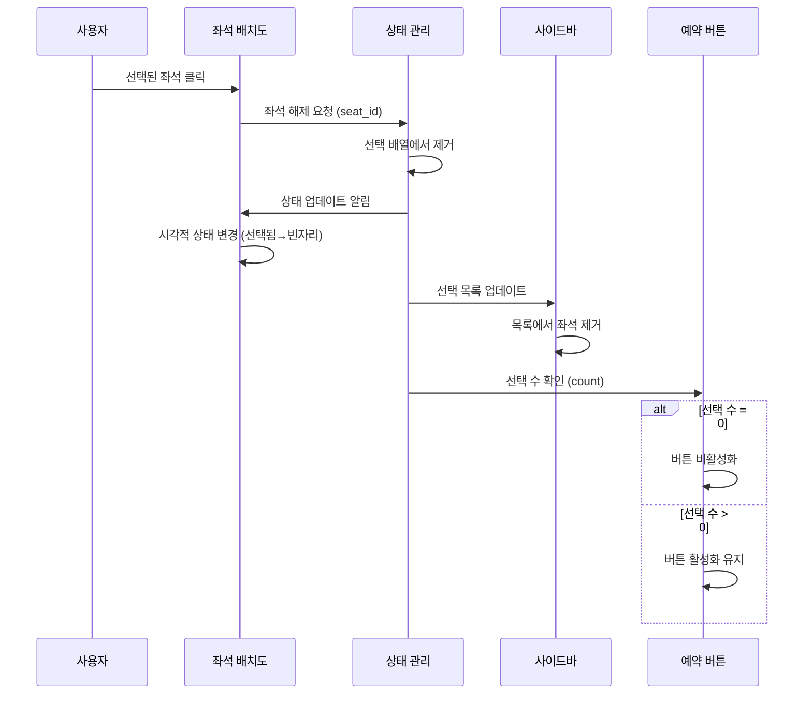

# 유스케이스 작성: UF-004 좌석 선택 해제

## 유스케이스 ID: UC-004

### 제목
콘서트 예약 시 선택된 좌석 해제

---

## 1. 개요

### 1.1 목적
사용자가 콘서트 예약 과정에서 선택한 좌석을 취소하여 다시 빈 좌석 상태로 되돌림으로써, 좌석 선택의 유연성을 제공하고 사용자 경험을 개선합니다.

### 1.2 범위
- 좌석 배치도에서 이미 선택된 좌석을 클릭하여 선택 해제
- 우측 사이드바에서 X 아이콘을 클릭하여 선택 해제
- 선택된 좌석 목록 및 카운트 업데이트
- 예약하기 버튼 활성화 상태 관리

**제외 사항**:
- 이미 예약이 완료된 좌석의 해제 (예약 취소는 별도 유스케이스)
- 서버 측 좌석 상태 변경 (클라이언트 측 상태 관리만 수행)

### 1.3 액터
- **주요 액터**: 콘서트 예약자 (최종 사용자)
- **부 액터**:
  - 프론트엔드 상태 관리 시스템
  - UI 렌더링 컴포넌트

---

## 2. 선행 조건

- 사용자가 콘서트 예약 페이지(`/concerts/:concertId/booking`)에 접속한 상태
- 좌석 선택 단계에 있음 (정보 입력 단계가 아님)
- 최소 1개 이상의 좌석이 선택된 상태
- 선택된 좌석이 아직 서버에 제출되지 않은 상태 (로컬 상태로만 관리)

---

## 3. 참여 컴포넌트

- **좌석 배치도 컴포넌트**: 320개 좌석(4구역 x 4x20)의 시각적 표현 및 클릭 이벤트 처리
- **사이드바 컴포넌트**: 선택된 좌석 목록 표시 및 X 아이콘 클릭 이벤트 처리
- **상태 관리 시스템**: 선택된 좌석 배열 관리 (React State, Redux, Zustand 등)
- **예약 버튼 컴포넌트**: 선택된 좌석 수에 따른 활성화/비활성화 처리

---

## 4. 기본 플로우 (Basic Flow)

### 4.1 단계별 흐름

#### 방법 1: 좌석 배치도에서 직접 클릭

1. **사용자**: 좌석 배치도에서 이미 선택된 좌석(강조 표시됨)을 클릭
   - 입력: 좌석 정보 (구역, 행, 열)
   - 처리: 클릭 이벤트 발생

2. **좌석 배치도 컴포넌트**: 클릭된 좌석 식별
   - 입력: 클릭 이벤트 객체
   - 처리:
     - 클릭된 DOM 요소에서 좌석 ID 추출
     - 좌석의 현재 상태 확인 (선택됨/빈자리/예약됨)
   - 출력: 좌석 ID 및 현재 상태

3. **상태 관리 시스템**: 선택된 좌석 목록에서 해당 좌석 확인
   - 입력: 좌석 ID
   - 처리:
     - 선택된 좌석 배열에서 해당 좌석 검색
     - 존재하면 배열에서 제거
     - 좌석 상태를 "선택 해제"로 변경
   - 출력: 업데이트된 선택 좌석 배열

4. **좌석 배치도 컴포넌트**: 시각적 상태 업데이트
   - 입력: 업데이트된 좌석 상태
   - 처리:
     - 해당 좌석의 CSS 클래스 변경 (선택됨 → 빈자리)
     - 강조 표시 제거
   - 출력: 재렌더링된 좌석

5. **사이드바 컴포넌트**: 선택 정보 업데이트
   - 입력: 업데이트된 선택 좌석 배열
   - 처리:
     - 선택된 좌석 목록에서 해당 좌석 제거
     - 남은 선택 좌석 수 재계산
   - 출력: 업데이트된 사이드바 UI

6. **예약 버튼 컴포넌트**: 활성화 상태 재평가
   - 입력: 선택된 좌석 수
   - 처리:
     - 선택된 좌석 수가 0개인 경우 버튼 비활성화
     - 1개 이상인 경우 버튼 활성화 유지
   - 출력: 버튼 활성화 상태

#### 방법 2: 사이드바 X 아이콘 클릭

1. **사용자**: 우측 사이드바의 선택된 좌석 목록에서 특정 좌석의 X 아이콘 클릭
   - 입력: 좌석 정보 (구역, 행, 열)
   - 처리: 클릭 이벤트 발생

2. **사이드바 컴포넌트**: 클릭된 X 아이콘에 해당하는 좌석 식별
   - 입력: 클릭 이벤트 객체
   - 처리:
     - 클릭된 버튼의 data 속성에서 좌석 ID 추출
     - 좌석 삭제 이벤트 트리거
   - 출력: 좌석 ID

3-6. **[방법 1의 3-6단계와 동일]**

### 4.2 시퀀스 다이어그램



---

## 5. 대안 플로우 (Alternative Flows)

### 5.1 대안 플로우 1: 모든 좌석을 순차적으로 해제

**시작 조건**: 사용자가 여러 개의 좌석을 선택한 상태

**단계**:
1. 사용자가 선택된 좌석 중 하나를 해제 (기본 플로우 실행)
2. 선택된 좌석이 1개 남음
3. 사용자가 마지막 남은 좌석 해제
4. 선택된 좌석 수가 0이 됨
5. 예약하기 버튼이 비활성화됨
6. 사이드바에 "좌석을 선택해주세요" 안내 메시지 표시

**결과**: 모든 좌석이 해제되고 초기 상태로 복귀

### 5.2 대안 플로우 2: 4개 선택 후 하나 해제하여 새로운 좌석 선택

**시작 조건**: 사용자가 최대 선택 가능한 4개의 좌석을 선택한 상태

**단계**:
1. 사용자가 더 나은 좌석을 발견
2. 기존 선택 좌석 중 하나를 해제 (기본 플로우 실행)
3. 선택된 좌석 수가 3개가 됨
4. 추가 선택 가능 상태가 됨
5. 사용자가 새로운 좌석 선택 (UF-003으로 전환)

**결과**: 좌석 조합이 변경되고 다시 4개까지 선택 가능

---

## 6. 예외 플로우 (Exception Flows)

### 6.1 예외 상황 1: 존재하지 않는 좌석 해제 시도

**발생 조건**:
- 클라이언트 상태와 UI가 동기화되지 않은 경우
- 개발자 도구를 통한 조작
- 네트워크 지연으로 인한 중복 이벤트

**처리 방법**:
1. 상태 관리 시스템에서 해당 좌석 ID 검색
2. 선택 목록에 해당 좌석이 없음을 확인
3. 에러 로깅 (콘솔 경고)
4. 사용자 UI에는 영향 없음 (무시)
5. 현재 상태 유지

**에러 코드**: N/A (클라이언트 측 예외, 서버 요청 없음)

**사용자 메시지**: 없음 (조용히 처리)

**로그 메시지**: `Warning: Attempted to deselect a seat that is not in the selected list. Seat ID: ${seatId}`

### 6.2 예외 상황 2: 동시에 여러 좌석 해제 시도 (빠른 클릭)

**발생 조건**:
- 사용자가 매우 빠르게 여러 X 아이콘을 연속 클릭
- 상태 업데이트가 완료되기 전 다음 클릭 발생

**처리 방법**:
1. 디바운싱 또는 쓰로틀링 적용 (예: 100ms)
2. 첫 번째 클릭 이벤트 처리
3. 상태 업데이트 완료 대기
4. 다음 클릭 이벤트 처리
5. 각 이벤트를 순차적으로 처리하여 상태 일관성 유지

**에러 코드**: N/A

**사용자 메시지**: 없음

**기술적 구현**:
```typescript
// 디바운싱 예시
const debouncedDeselect = debounce((seatId) => {
  deselectSeat(seatId);
}, 100);
```

### 6.3 예외 상황 3: 선택 해제 중 상태 변경 실패

**발생 조건**:
- 메모리 부족
- JavaScript 런타임 오류
- 상태 관리 라이브러리 버그

**처리 방법**:
1. try-catch 블록으로 오류 포착
2. 오류 로깅 (에러 추적 시스템에 전송)
3. 사용자에게 에러 토스트 메시지 표시
4. 페이지 새로고침 권장
5. 또는 전체 좌석 선택 초기화 옵션 제공

**에러 코드**: N/A (클라이언트 측)

**사용자 메시지**: "좌석 선택 해제 중 오류가 발생했습니다. 페이지를 새로고침해주세요."

### 6.4 예외 상황 4: 예약된 좌석을 해제 시도

**발생 조건**:
- UI 상태가 서버 상태와 불일치
- 다른 사용자가 동일 좌석을 방금 예약함
- 페이지 새로고침 없이 오래 머물러 있는 경우

**처리 방법**:
1. 좌석 상태 확인 (is_reserved 플래그)
2. 예약된 좌석인 경우 해제 동작 무시
3. 클릭 이벤트 차단
4. 사용자에게 안내 없음 (이미 예약된 좌석은 시각적으로 구분되어 있음)

**에러 코드**: N/A

**사용자 메시지**: 없음 (툴팁으로 "이미 예약된 좌석입니다" 표시 가능)

---

## 7. 후행 조건 (Post-conditions)

### 7.1 성공 시

**데이터베이스 변경**:
- 없음 (클라이언트 측 상태 변경만 발생, 서버 요청 없음)

**클라이언트 상태**:
- 선택된 좌석 배열에서 해당 좌석 제거
- 선택된 좌석 수 감소 (N → N-1)
- 해당 좌석의 시각적 상태가 "빈자리"로 변경

**UI 상태**:
- 좌석 배치도: 해당 좌석의 강조 표시 제거
- 사이드바: 선택 목록에서 해당 좌석 정보 삭제
- 예약 버튼:
  - 선택 수 > 0: 활성화 유지
  - 선택 수 = 0: 비활성화

### 7.2 실패 시

**데이터 롤백**:
- 없음 (서버 트랜잭션 없음)

**시스템 상태**:
- 이전 상태 유지
- 에러 로깅
- 사용자에게 필요한 경우 알림

---

## 8. 비기능 요구사항

### 8.1 성능
- **응답 시간**: 좌석 해제 클릭 후 UI 업데이트까지 100ms 이내
- **렌더링 성능**:
  - 단일 좌석 상태 변경 시 전체 재렌더링 방지
  - 메모이제이션 및 최적화된 상태 업데이트
- **동시 처리**: 빠른 연속 클릭 시에도 상태 일관성 유지

### 8.2 보안
- **클라이언트 측 검증**:
  - 선택 해제 가능한 좌석인지 확인
  - 예약된 좌석 해제 방지
- **데이터 무결성**:
  - 선택 배열의 중복 방지
  - 음수 카운트 방지

### 8.3 가용성
- **오프라인 동작**: 네트워크 없이도 정상 작동 (로컬 상태만 사용)
- **에러 복구**: 오류 발생 시 사용자가 페이지 새로고침으로 복구 가능
- **브라우저 호환성**: Chrome, Safari, Firefox, Edge 최신 2개 버전

### 8.4 접근성
- **키보드 조작**:
  - 좌석 선택/해제 시 키보드로도 조작 가능
  - Tab 키로 포커스 이동, Enter/Space로 선택/해제
- **스크린 리더**:
  - 좌석 해제 시 "A구역 5행 2열 좌석이 선택 해제되었습니다" 안내
  - ARIA 속성으로 선택 상태 전달

---

## 9. UI/UX 요구사항

### 9.1 화면 구성

**좌석 배치도 영역**:
- 320개 좌석 그리드 (4구역 x 4x20)
- 좌석 상태 시각적 표시:
  - 빈 좌석: 흰색/회색 배경, 클릭 가능
  - 선택된 좌석: 파란색/강조 색상, 클릭하면 해제
  - 예약된 좌석: 회색/비활성 색상, 클릭 불가
- 각 좌석에 호버 효과

**우측 사이드바**:
- 제목: "선택된 좌석"
- 남은 좌석 수 표시: "전체 N석 중 M석 선택 가능"
- 선택된 좌석 목록:
  - 각 좌석: "A구역 5행 2열" 형식
  - 오른쪽에 X 아이콘 (삭제 버튼)
- 예약하기 버튼 (하단)

### 9.2 사용자 경험

**시각적 피드백**:
- 좌석 클릭 시 즉각적인 색상 변화 (100ms 이내)
- 부드러운 전환 애니메이션 (fade-out 또는 scale)
- 사이드바에서 제거 시 슬라이드 아웃 애니메이션

**인터랙션**:
- 좌석 호버 시 커서 포인터 변경
- X 아이콘 호버 시 색상 변화
- 클릭 영역 충분히 확보 (최소 44x44px)

**알림**:
- 마지막 좌석 해제 시 토스트 알림 (선택사항): "모든 좌석이 해제되었습니다"
- 4개 선택 후 하나 해제 시: "좌석을 추가로 선택하실 수 있습니다"

**모바일 최적화**:
- 터치 이벤트 지원
- 작은 화면에서도 X 아이콘 쉽게 클릭 가능
- 사이드바를 하단 시트로 변경 (선택사항)

---

## 10. 테스트 시나리오

### 10.1 성공 케이스

| 테스트 케이스 ID | 입력값 | 기대 결과 |
|----------------|--------|----------|
| TC-004-01 | 1개 선택된 상태에서 좌석 배치도에서 해당 좌석 클릭 | 좌석 해제, 선택 수 0, 예약 버튼 비활성화 |
| TC-004-02 | 2개 선택된 상태에서 사이드바 X 아이콘 클릭 | 해당 좌석 해제, 선택 수 1, 예약 버튼 활성화 유지 |
| TC-004-03 | 4개 선택된 상태에서 하나 해제 | 선택 수 3, 추가 선택 가능 상태 |
| TC-004-04 | 좌석 배치도에서 A구역 5행 2열 클릭 | 해당 좌석만 해제, 다른 선택 좌석 유지 |
| TC-004-05 | 사이드바에서 특정 좌석 X 아이콘 클릭 | 좌석 배치도와 사이드바 모두 동기화되어 해제 |

### 10.2 실패 케이스

| 테스트 케이스 ID | 입력값 | 기대 결과 |
|----------------|--------|----------|
| TC-004-06 | 선택되지 않은 빈 좌석 클릭 | 해제 동작 없음, 선택 동작으로 처리 (UF-003) |
| TC-004-07 | 이미 예약된 좌석 클릭 시도 | 클릭 무시, 상태 변화 없음 |
| TC-004-08 | 존재하지 않는 좌석 ID로 해제 시도 | 에러 로깅, UI 영향 없음 |
| TC-004-09 | 0.1초 내 동일 좌석 10회 연속 클릭 | 디바운싱으로 1회만 처리, 상태 일관성 유지 |
| TC-004-10 | 상태 관리 오류 발생 시 | 에러 로깅, 사용자에게 알림, 페이지 새로고침 권장 |

### 10.3 통합 테스트

| 테스트 케이스 ID | 시나리오 | 기대 결과 |
|----------------|---------|----------|
| TC-004-11 | 좌석 선택 → 해제 → 다시 선택 → 예약 제출 | 최종 선택된 좌석으로 예약 성공 |
| TC-004-12 | 4개 선택 → 모두 해제 → 새로운 4개 선택 | 좌석 조합 완전히 변경 가능 |
| TC-004-13 | 여러 구역의 좌석 선택 후 일부만 해제 | 구역 상관없이 개별 해제 가능 |

---

## 11. 관련 유스케이스

- **선행 유스케이스**:
  - UC-003: 좌석 선택 (좌석을 선택해야 해제 가능)

- **후행 유스케이스**:
  - UC-003: 좌석 선택 (해제 후 다시 선택 가능)
  - UC-005: 예약 정보 입력 및 제출 (해제 후 다른 좌석 선택하여 예약 진행)

- **연관 유스케이스**:
  - UC-002: 콘서트 상세 조회 (예약 페이지 진입 전 단계)
  - UC-009: 페이지 새로고침 처리 (새로고침 시 선택 해제 상태 초기화)

---

## 12. 변경 이력

| 버전 | 날짜 | 작성자 | 변경 내용 |
|------|------|--------|-----------|
| 1.0  | 2025-10-13 | Product Team | 초기 작성 - UF-004 기반 상세 유스케이스 작성 |

---

## 부록

### A. 용어 정의

- **좌석 선택**: 사용자가 예약하고자 하는 좌석을 클라이언트 측에서 임시로 마킹하는 행위 (서버 상태 변경 없음)
- **좌석 선택 해제**: 선택된 좌석을 다시 빈 좌석 상태로 되돌리는 행위
- **좌석 예약**: 서버에 예약 정보를 제출하여 좌석 소유권을 확정하는 행위
- **좌석 예약 취소**: 이미 완료된 예약을 취소하는 행위 (별도 유스케이스)
- **디바운싱(Debouncing)**: 연속된 이벤트 중 마지막 이벤트만 처리하는 기법
- **쓰로틀링(Throttling)**: 일정 시간 간격으로만 이벤트를 처리하는 기법

### B. 참고 자료

- **PRD**: `/docs/prd.md` - 제품 요구사항 정의서
- **User Flow**: `/docs/userflow.md#uf-004-좌석-선택-해제` - 상세 플로우 정의
- **Database Design**: `/docs/database.md` - 데이터 구조 (서버 측 예약 시점)
- **UC-003**: 좌석 선택 유스케이스
- **UC-005**: 예약 정보 입력 및 제출 유스케이스

### C. 기술 스택 참고 (구현 시)

**상태 관리 옵션**:
- React Context API + useReducer
- Redux Toolkit
- Zustand
- Jotai

**UI 최적화**:
- React.memo로 불필요한 재렌더링 방지
- useMemo, useCallback 활용
- 가상화 라이브러리 (react-window, react-virtualized) - 대량 좌석 표시 시

**애니메이션**:
- CSS Transitions
- Framer Motion
- React Spring

### D. 데이터 구조 예시

```typescript
interface Seat {
  id: string;
  concertId: string;
  section: 'A' | 'B' | 'C' | 'D';
  row: number; // 1-20
  seat_column: number; // 1-4
  isReserved: boolean; // 서버 상태
  isSelected: boolean; // 클라이언트 상태
}

interface SelectedSeat {
  seatId: string;
  section: string;
  row: number;
  seat_column: number;
}

// 상태 관리
const [selectedSeats, setSelectedSeats] = useState<SelectedSeat[]>([]);

// 좌석 해제 함수
const deselectSeat = (seatId: string) => {
  setSelectedSeats(prev => prev.filter(seat => seat.seatId !== seatId));
};
```

### E. 접근성 구현 예시

```html
<!-- 좌석 버튼 -->
<button
  role="checkbox"
  aria-checked="true"
  aria-label="A구역 5행 2열 좌석, 선택됨. 클릭하면 선택 해제됩니다"
  onClick={() => deselectSeat(seatId)}
>
  A-5-2
</button>

<!-- 사이드바 X 버튼 -->
<button
  aria-label="A구역 5행 2열 좌석 선택 해제"
  onClick={() => deselectSeat(seatId)}
>
  <span aria-hidden="true">×</span>
</button>
```
