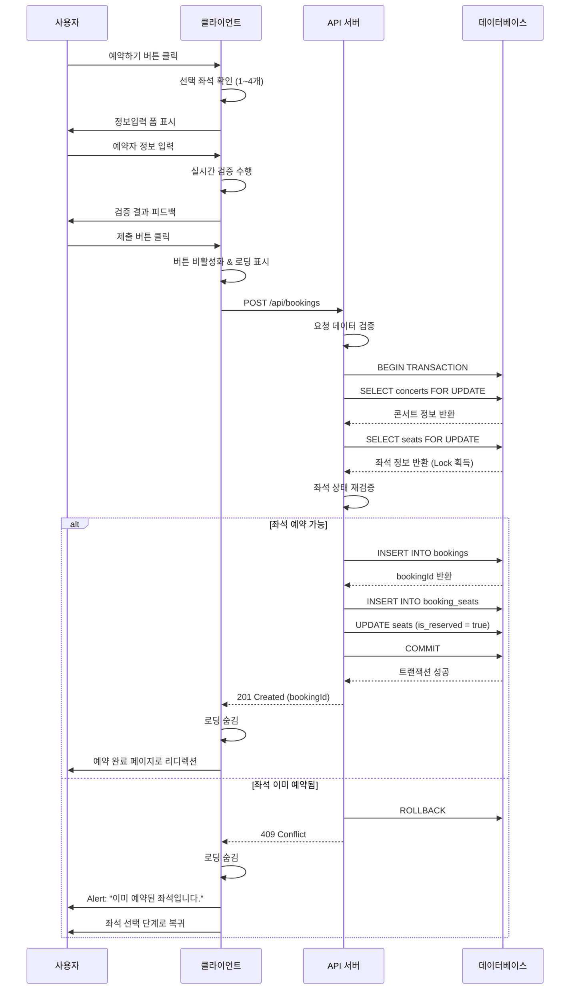

# 유스케이스 명세서

## 유스케이스 ID: UC-005

### 제목
예약 정보 입력 및 제출

---

## 1. 개요

### 1.1 목적
사용자가 선택한 좌석에 대해 예약자 정보를 입력하고 예약을 완료하는 과정을 관리합니다. 이 유스케이스는 동시성 제어를 통해 좌석 중복 예약을 방지하고, 사용자에게 명확한 예약 완료 또는 실패 피드백을 제공하는 것을 목표로 합니다.

### 1.2 범위
- 좌석 선택 단계에서 정보입력 단계로의 전환
- 예약자 정보 입력 폼 렌더링 및 실시간 검증
- 선택된 좌석의 등급별 가격 계산 및 표시
- 총 결제 금액 계산 및 표시
- 예약 제출 및 서버 측 트랜잭션 처리
- 좌석 상태 재검증 및 중복 예약 방지
- 예약 성공 시 예약 완료 페이지로 리디렉션
- 예약 실패 시 좌석 선택 단계로 복귀

**범위 제외**:
- 실제 결제 처리 (향후 확장)
- 예약 확인 이메일/SMS 발송 (향후 확장)
- 좌석 임시 예약 (타임아웃 기능, 향후 고려)

### 1.3 액터
- **주요 액터**: 일반 사용자 (콘서트 관람객)
- **부 액터**:
  - 데이터베이스 시스템 (트랜잭션 처리)
  - 백엔드 API 서버 (예약 검증 및 처리)

---

## 2. 선행 조건

- 사용자가 콘서트 예약 페이지(`/concerts/:concertId/booking`)에 접근해 있어야 함
- 사용자가 1~4개의 좌석을 선택한 상태여야 함
- 선택된 좌석 정보가 클라이언트 상태에 저장되어 있어야 함
- 해당 콘서트가 예약 가능 기간 내에 있어야 함 (진행일 전날 23:59:59까지)
- 데이터베이스 연결이 정상 상태여야 함

---

## 3. 참여 컴포넌트

- **클라이언트 애플리케이션**:
  - 사용자 입력 폼 렌더링 및 실시간 검증
  - 예약 API 호출 및 응답 처리
  - 화면 전환 및 에러 메시지 표시

- **예약 API 서버**:
  - 예약 요청 데이터 검증
  - 트랜잭션 관리 및 좌석 상태 재검증
  - 예약 레코드 생성 및 좌석 상태 업데이트

- **PostgreSQL 데이터베이스**:
  - 트랜잭션 처리 및 Row-Level Locking
  - 데이터 무결성 보장
  - 동시성 제어

- **인증/보안 모듈**:
  - 비밀번호 해싱 처리
  - 개인정보 암호화 (선택사항)

---

## 4. 기본 플로우 (Basic Flow)

### 4.1 단계별 흐름

**단계 1: 정보입력 화면 전환**

1. **사용자**: 좌석 선택 단계에서 우측 사이드바의 "예약하기" 버튼 클릭
   - 입력: 클릭 이벤트
   - 전제조건: 1개 이상의 좌석이 선택된 상태

2. **클라이언트**: 현재 선택된 좌석 목록 확인 (1~4개)
   - 처리: 로컬 상태에서 선택된 좌석 배열 검증

3. **클라이언트**: 정보입력 UI로 화면 전환
   - 출력:
     - 좌석 선택 UI 숨김
     - 정보입력 폼 표시
     - 선택된 좌석 요약 정보 표시 (읽기 전용):
       - 좌석 목록 (구역-행-열)
       - 각 좌석의 등급 및 가격
       - 총 결제 금액
     - 뒤로가기 버튼 표시

**단계 2: 예약자 정보 입력 및 실시간 검증**

4. **사용자**: 예약자 정보 입력
   - 입력 필드:
     - 예약자명 (텍스트, 필수)
     - 휴대폰번호 (숫자, 필수, 형식: 010-XXXX-XXXX)
     - 비밀번호 4자리 (숫자, 필수)

5. **클라이언트**: 각 입력 필드에 대한 실시간 검증 수행
   - **예약자명 검증**:
     - 공백이 아닌지 확인
     - 길이 검증 (2-50자)
     - 특수문자 제한 (선택사항)

   - **휴대폰번호 검증**:
     - 숫자만 포함하는지 확인 (하이픈 제외)
     - 길이 검증 (10-11자리)
     - 형식 검증 (010, 011, 016, 017, 018, 019로 시작)
     - 실시간 하이픈 자동 삽입 (UX 개선)

   - **비밀번호 4자리 검증**:
     - 정확히 4자리 숫자인지 확인
     - 숫자 이외 문자 입력 방지

   - 처리: 각 필드별 유효성 검증 결과에 따라 에러 메시지 표시/숨김
   - 출력: 모든 필드가 유효한 경우 제출 버튼 활성화

**단계 3: 예약 제출**

6. **사용자**: 제출 버튼 클릭
   - 전제조건: 모든 필드가 유효한 상태

7. **클라이언트**: 중복 제출 방지 및 로딩 상태 설정
   - 처리:
     - 제출 버튼 즉시 비활성화
     - 로딩 인디케이터 표시
     - 중복 클릭 이벤트 무시

8. **클라이언트**: 예약 API 요청 전송
   - 요청 데이터:
     - `concertId`: URL 파라미터에서 추출
     - `seatIds`: 선택된 좌석 ID 배열 (1~4개)
     - `name`: 예약자명
     - `phone`: 휴대폰번호 (하이픈 제거 후 전송)
     - `password`: 비밀번호 (평문, 서버에서 해싱)
   - API 엔드포인트: `POST /api/bookings`

**단계 4: 서버 측 예약 처리 (트랜잭션)**

9. **API 서버**: 요청 데이터 검증
   - 처리:
     - 필수 필드 존재 여부 확인
     - 데이터 형식 재검증 (서버 사이드 검증)
     - `concertId` 유효성 확인
     - `seatIds` 배열 길이 확인 (1~4개)

10. **API 서버**: 데이터베이스 트랜잭션 시작
    - 처리: `BEGIN TRANSACTION`

11. **데이터베이스**: 콘서트 존재 및 예약 가능 여부 확인
    ```sql
    SELECT id, event_date
    FROM concerts
    WHERE id = :concertId
      AND event_date > (NOW() + INTERVAL '1 day')
    FOR UPDATE;
    ```
    - 검증:
      - 콘서트가 존재하는지
      - 예약 가능 기간 내인지 (진행일 전날 23:59:59까지)
    - 실패 시: 트랜잭션 롤백 후 에러 응답

12. **데이터베이스**: 선택된 좌석 상태 조회 및 Lock 획득
    ```sql
    SELECT id, is_reserved
    FROM seats
    WHERE id = ANY(:seatIds)
      AND concert_id = :concertId
    FOR UPDATE;
    ```
    - 처리: Row-Level Locking으로 동시성 제어
    - 다른 트랜잭션이 같은 좌석을 Lock하고 있다면 대기

13. **API 서버**: 좌석 상태 재검증
    - 검증: 모든 좌석의 `is_reserved`가 `false`인지 확인
    - 하나라도 `true`인 경우: 중복 예약 실패
      - 트랜잭션 롤백
      - 409 Conflict 응답 전송

14. **데이터베이스**: 예약 레코드 생성
    ```sql
    INSERT INTO bookings (concert_id, name, phone, password_hash, status)
    VALUES (:concertId, :name, :phone, :passwordHash, 'confirmed')
    RETURNING id;
    ```
    - 처리:
      - 비밀번호 bcrypt 해싱
      - 개인정보 암호화 (선택사항)
      - 예약 ID 반환

15. **데이터베이스**: 예약-좌석 연결 레코드 생성
    ```sql
    INSERT INTO booking_seats (booking_id, seat_id)
    SELECT :bookingId, unnest(:seatIds);
    ```
    - 처리: N개의 좌석에 대한 연결 레코드 생성 (1~4개)

16. **데이터베이스**: 좌석 상태 업데이트
    ```sql
    UPDATE seats
    SET is_reserved = true, updated_at = NOW()
    WHERE id = ANY(:seatIds);
    ```
    - 처리: 선택된 모든 좌석을 예약됨 상태로 변경

17. **API 서버**: 트랜잭션 커밋
    - 처리: `COMMIT`
    - 출력: Lock 해제 및 변경사항 영구 저장

18. **API 서버**: 성공 응답 전송
    - 응답 데이터:
      - `bookingId`: 생성된 예약 ID
      - `totalAmount`: 총 결제 금액 (좌석 가격 합계)
      - `status`: "success"
      - HTTP 상태 코드: 201 Created

**단계 5: 예약 완료 처리**

19. **클라이언트**: 성공 응답 수신 및 처리
    - 처리:
      - 로딩 인디케이터 숨김
      - 선택된 좌석 정보 로컬 상태에서 제거

20. **클라이언트**: 예약 완료 페이지로 리디렉션
    - URL: `/bookings/:bookingId/complete`
    - 출력:
      - 예약 완료 안내 메시지
      - 예약 상세 정보:
        - 콘서트명
        - 좌석 목록 (등급 및 가격 포함)
        - 총 결제 금액
        - 예약자명
      - 예약번호
      - 예약취소 버튼
      - 홈으로 돌아가기 버튼

### 4.2 시퀀스 다이어그램



---

## 5. 대안 플로우 (Alternative Flows)

### 5.1 대안 플로우 1: 뒤로가기로 좌석 선택 단계 복귀

**시작 조건**: 정보입력 단계에서 사용자가 뒤로가기 버튼 클릭

**단계**:
1. 사용자가 뒤로가기 버튼 클릭
2. 클라이언트가 입력된 정보 유지 여부 확인 (선택사항)
3. 좌석 선택 단계 UI로 화면 전환
4. 이전에 선택했던 좌석 정보 복원 (세션 스토리지 활용)
5. 좌석 배치도 최신 상태로 갱신 (다른 사용자가 예약했을 수 있음)

**결과**: 사용자가 좌석 선택을 재조정할 수 있는 상태로 복귀

### 5.2 대안 플로우 2: 브라우저 뒤로가기 버튼 사용

**시작 조건**: 정보입력 단계에서 브라우저 뒤로가기 버튼 클릭

**단계**:
1. 브라우저 히스토리 스택 확인
2. 이전 페이지가 좌석 선택 단계인 경우:
   - 좌석 선택 단계로 복귀
   - 선택된 좌석 정보 복원 시도 (세션 스토리지)
3. 이전 페이지가 콘서트 상세인 경우:
   - 콘서트 상세 페이지로 복귀
   - 선택된 좌석 정보 삭제

**결과**: 브라우저 히스토리에 따른 자연스러운 네비게이션

### 5.3 대안 플로우 3: 자동 하이픈 삽입 (휴대폰번호)

**시작 조건**: 사용자가 휴대폰번호 입력 필드에 숫자 입력 중

**단계**:
1. 사용자가 숫자를 입력할 때마다 이벤트 트리거
2. 클라이언트가 현재 입력값 확인
3. 자동으로 하이픈 삽입:
   - 3자리 입력 후: "010"
   - 7-8자리 입력 후: "010-1234" 또는 "010-1234-"
4. 최종 형식: "010-XXXX-XXXX"
5. 제출 시 하이픈 제거 후 API 전송

**결과**: 사용자 편의성 향상 및 입력 오류 감소

---

## 6. 예외 플로우 (Exception Flows)

### 6.1 예외 상황 1: 필수 필드 누락

**발생 조건**: 사용자가 하나 이상의 필수 필드를 입력하지 않은 상태에서 제출 시도

**처리 방법**:
1. 클라이언트 검증에서 차단 (제출 버튼 비활성화 상태 유지)
2. 누락된 필드에 에러 메시지 표시
   - "예약자명을 입력해주세요."
   - "휴대폰번호를 입력해주세요."
   - "비밀번호 4자리를 입력해주세요."
3. 해당 필드에 포커스 이동

**에러 코드**: N/A (클라이언트에서 차단)

**사용자 메시지**: 각 필드별 에러 메시지 (인라인 표시)

### 6.2 예외 상황 2: 유효하지 않은 입력 형식

**발생 조건**: 사용자가 잘못된 형식의 데이터 입력 (예: 휴대폰번호에 문자 포함)

**처리 방법**:
1. 실시간 검증에서 에러 메시지 표시
   - 예약자명: "2-50자 이내로 입력해주세요."
   - 휴대폰번호: "올바른 휴대폰번호 형식이 아닙니다. (예: 010-1234-5678)"
   - 비밀번호: "숫자 4자리를 입력해주세요."
2. 제출 버튼 비활성화 유지
3. 해당 필드 하이라이트 처리

**에러 코드**: N/A (클라이언트에서 차단)

**사용자 메시지**: 각 필드별 형식 오류 메시지

### 6.3 예외 상황 3: 좌석 중복 예약 (동시성 충돌)

**발생 조건**: 제출 시점에 다른 사용자가 먼저 같은 좌석을 예약한 경우

**처리 방법**:
1. 서버에서 트랜잭션 롤백
2. API가 409 Conflict 응답 전송
   ```json
   {
     "error": "SEAT_ALREADY_RESERVED",
     "message": "이미 예약된 좌석이 포함되어 있습니다.",
     "conflictedSeatIds": ["uuid1", "uuid2"]
   }
   ```
3. 클라이언트가 에러 응답 수신
4. Alert 또는 모달 창 표시: "이미 예약된 좌석입니다. 다른 좌석을 선택해주세요."
5. 확인 버튼 클릭 시 좌석 선택 단계로 자동 복귀
6. 좌석 배치도 최신 상태로 갱신
7. 이전 선택 좌석 중 여전히 예약 가능한 좌석 자동 선택 (선택사항)
8. 제출 버튼 재활성화

**에러 코드**: `409 Conflict`

**사용자 메시지**: "이미 예약된 좌석입니다. 다른 좌석을 선택해주세요."

### 6.4 예외 상황 4: 중복 제출 시도 (더블 클릭)

**발생 조건**: 사용자가 제출 버튼을 빠르게 여러 번 클릭

**처리 방법**:
1. 첫 번째 클릭 이벤트만 처리
2. 버튼 즉시 비활성화
3. 로딩 인디케이터 표시
4. 이후 클릭 이벤트 무시 (디바운싱)
5. API 요청은 한 번만 전송됨

**에러 코드**: N/A (클라이언트에서 방지)

**사용자 메시지**: 없음 (자동 처리)

### 6.5 예외 상황 5: 네트워크 타임아웃

**발생 조건**: API 요청이 30초 이내에 응답하지 않음

**처리 방법**:
1. 클라이언트에서 타임아웃 감지
2. 로딩 인디케이터 숨김
3. 에러 모달 표시:
   - 제목: "요청 시간 초과"
   - 메시지: "네트워크 연결이 불안정합니다. 다시 시도해주세요."
   - 버튼: "재시도" / "취소"
4. 재시도 버튼 클릭 시: 동일한 데이터로 API 재요청
5. 취소 버튼 클릭 시: 모달 닫기 및 제출 버튼 재활성화
6. 입력했던 정보는 모두 유지

**에러 코드**: `TIMEOUT`

**사용자 메시지**: "네트워크 연결이 불안정합니다. 다시 시도해주세요."

### 6.6 예외 상황 6: 서버 에러 (500)

**발생 조건**: 서버 내부 오류 발생 (데이터베이스 연결 실패, 예외 발생 등)

**처리 방법**:
1. API가 500 Internal Server Error 응답 전송
   ```json
   {
     "error": "INTERNAL_SERVER_ERROR",
     "message": "일시적인 오류가 발생했습니다. 잠시 후 다시 시도해주세요."
   }
   ```
2. 클라이언트가 에러 응답 수신
3. 로딩 인디케이터 숨김
4. 에러 모달 표시:
   - 제목: "예약 실패"
   - 메시지: "일시적인 오류가 발생했습니다. 잠시 후 다시 시도해주세요."
   - 버튼: "재시도" / "취소"
5. 입력 정보 유지
6. 제출 버튼 재활성화

**에러 코드**: `500 Internal Server Error`

**사용자 메시지**: "일시적인 오류가 발생했습니다. 잠시 후 다시 시도해주세요."

### 6.7 예외 상황 7: 콘서트 예약 마감

**발생 조건**: 제출 시점에 콘서트 예약 기간이 종료된 경우 (진행일 전날 23:59:59 경과)

**처리 방법**:
1. 서버에서 트랜잭션 롤백
2. API가 400 Bad Request 응답 전송
   ```json
   {
     "error": "BOOKING_CLOSED",
     "message": "예약 기간이 종료되었습니다."
   }
   ```
3. 클라이언트가 에러 응답 수신
4. Alert 표시: "예약 기간이 종료되었습니다."
5. 확인 버튼 클릭 시 홈 페이지로 리디렉션

**에러 코드**: `400 Bad Request`

**사용자 메시지**: "예약 기간이 종료되었습니다."

### 6.8 예외 상황 8: 잘못된 concertId

**발생 조건**: URL의 concertId가 존재하지 않는 콘서트를 가리킴

**처리 방법**:
1. 서버에서 트랜잭션 롤백
2. API가 404 Not Found 응답 전송
   ```json
   {
     "error": "CONCERT_NOT_FOUND",
     "message": "콘서트 정보를 찾을 수 없습니다."
   }
   ```
3. 클라이언트가 에러 응답 수신
4. Alert 표시: "콘서트 정보를 찾을 수 없습니다."
5. 확인 버튼 클릭 시 홈 페이지로 리디렉션

**에러 코드**: `404 Not Found`

**사용자 메시지**: "콘서트 정보를 찾을 수 없습니다."

### 6.9 예외 상황 9: 세션 만료 또는 데이터 손실

**발생 조건**: 정보입력 단계에서 선택된 좌석 정보가 로컬 상태에서 사라진 경우

**처리 방법**:
1. 정보입력 단계 진입 시 선택 좌석 확인
2. 선택된 좌석이 없는 경우:
   - Alert 표시: "좌석 정보가 유실되었습니다. 다시 선택해주세요."
   - 확인 버튼 클릭 시 좌석 선택 단계로 이동
3. 또는 콘서트 상세 페이지로 리디렉션

**에러 코드**: N/A (클라이언트 상태 문제)

**사용자 메시지**: "좌석 정보가 유실되었습니다. 다시 선택해주세요."

### 6.10 예외 상황 10: 페이지 새로고침

**발생 조건**: 사용자가 정보입력 단계에서 페이지 새로고침 (F5, Cmd+R)

**처리 방법**:
1. 브라우저가 페이지 리로드
2. URL에서 concertId 추출
3. 좌석 선택 상태 초기화 (세션 스토리지에 저장된 경우 복원 시도)
4. 좌석 선택 단계로 복귀
5. 최신 좌석 배치도 재조회

**에러 코드**: N/A

**사용자 메시지**: 없음 (자동 처리)

---

## 7. 후행 조건 (Post-conditions)

### 7.1 성공 시

**데이터베이스 변경**:
- `bookings` 테이블에 새로운 예약 레코드 추가
  - `id`: 생성된 UUID
  - `concert_id`: 해당 콘서트 ID
  - `name`: 예약자명
  - `phone`: 휴대폰번호
  - `password_hash`: bcrypt 해싱된 비밀번호
  - `status`: 'confirmed'
  - `created_at`: 현재 시간

- `booking_seats` 테이블에 N개의 연결 레코드 추가 (1~4개)
  - 각 레코드: `booking_id`, `seat_id`

- `seats` 테이블의 선택된 좌석들 상태 업데이트
  - `is_reserved`: false → true
  - `updated_at`: 현재 시간

**시스템 상태**:
- 예약이 데이터베이스에 영구적으로 저장됨
- 해당 좌석들이 다른 사용자에게 예약 불가능 상태로 표시됨
- 사용자가 예약 완료 페이지로 리디렉션됨
- 브라우저 히스토리에 예약 완료 페이지 추가

**외부 시스템**:
- 없음 (현재 단계에서는 외부 시스템 연동 없음)
- 향후: 이메일/SMS 알림 서비스 트리거 (Phase 2)

### 7.2 실패 시

**데이터 롤백**:
- 모든 데이터베이스 변경사항 롤백 (트랜잭션 특성)
- `bookings`, `booking_seats`, `seats` 테이블 모두 변경 없음
- 좌석 상태 유지 (is_reserved 변경 없음)

**시스템 상태**:
- 사용자는 여전히 정보입력 단계 또는 좌석 선택 단계에 위치
- 클라이언트 상태:
  - 좌석 중복 실패 시: 좌석 선택 단계로 복귀
  - 기타 에러 시: 정보입력 단계 유지, 제출 버튼 재활성화
- 입력했던 정보는 유지 (재시도 가능)
- 에러 메시지가 사용자에게 표시됨

---

## 8. 비기능 요구사항

### 8.1 성능

**응답 시간**:
- 정보입력 화면 전환: 즉시 (100ms 이내)
- 실시간 검증: 즉시 (50ms 이내, 디바운싱 적용)
- 예약 API 응답: 3초 이내
- 트랜잭션 처리 시간: 1초 이내

**동시성**:
- 최소 100명의 동시 예약 처리 지원
- Row-Level Locking으로 동시성 제어
- 데드락 방지 메커니즘 적용

**확장성**:
- 데이터베이스 커넥션 풀 최적화
- API 서버 수평 확장 가능 구조

### 8.2 보안

**비밀번호 보안**:
- 비밀번호 bcrypt 해싱 (솔트 라운드: 10)
- 평문 비밀번호는 절대 저장하지 않음
- HTTPS를 통한 암호화 전송

**개인정보 보호**:
- 휴대폰번호 암호화 저장 (선택사항)
- 최소한의 개인정보만 수집
- GDPR/개인정보보호법 준수

**입력 검증**:
- XSS 공격 방지: 입력값 이스케이프 처리
- SQL Injection 방지: Prepared Statement 사용
- CSRF 방지: CSRF 토큰 검증 (선택사항)

**API 보안**:
- Rate Limiting: 동일 IP에서 1분에 최대 10회 요청
- Request Body 크기 제한: 1MB
- 서버 사이드 검증 필수 (클라이언트 검증은 보조)

### 8.3 가용성

**서비스 가동률**:
- 목표: 99% 이상
- 데이터베이스 백업: 일 1회 자동 백업
- 트랜잭션 롤백으로 데이터 무결성 보장

**에러 처리**:
- 모든 예외 상황에 대한 명확한 에러 메시지
- 에러 로깅 및 모니터링
- Graceful Degradation: 부분 장애 시에도 다른 기능 동작

**복구 시간**:
- 트랜잭션 실패 시 즉시 롤백
- 네트워크 타임아웃: 30초
- 재시도 메커니즘 제공

### 8.4 사용성

**반응형 디자인**:
- 모바일, 태블릿, 데스크톱 모두 지원
- 터치 및 마우스 입력 모두 최적화

**브라우저 호환성**:
- Chrome, Safari, Firefox, Edge 최신 2개 버전
- IE 11 미지원

**접근성**:
- WCAG 2.1 AA 레벨 준수
- 키보드 네비게이션 지원
- 스크린 리더 호환
- 적절한 색상 대비 (4.5:1 이상)

---

## 9. UI/UX 요구사항

### 9.1 화면 구성

**정보입력 폼 레이아웃**:

```
┌─────────────────────────────────────────┐
│  ← [뒤로가기]         예약 정보 입력     │
├─────────────────────────────────────────┤
│                                         │
│  선택된 좌석 (읽기 전용)                 │
│  ┌───────────────────────────────────┐  │
│  │ A-10-3 (A등급) ₩170,000          │  │
│  │ B-5-2 (P등급)  ₩190,000          │  │
│  │ ────────────────────────────────  │  │
│  │ 총 결제 금액:  ₩360,000          │  │
│  └───────────────────────────────────┘  │
│                                         │
│  예약자 정보                             │
│  ┌───────────────────────────────────┐  │
│  │ 예약자명 *                        │  │
│  │ [입력필드]                        │  │
│  │ [에러 메시지 영역]                 │  │
│  └───────────────────────────────────┘  │
│                                         │
│  ┌───────────────────────────────────┐  │
│  │ 휴대폰번호 *                      │  │
│  │ [010-XXXX-XXXX]                   │  │
│  │ [에러 메시지 영역]                 │  │
│  └───────────────────────────────────┘  │
│                                         │
│  ┌───────────────────────────────────┐  │
│  │ 비밀번호 4자리 *                   │  │
│  │ [••••]                            │  │
│  │ [에러 메시지 영역]                 │  │
│  │ (조회 시 사용됩니다)               │  │
│  └───────────────────────────────────┘  │
│                                         │
│  ┌───────────────────────────────────┐  │
│  │         [예약 완료하기]           │  │
│  └───────────────────────────────────┘  │
│                                         │
└─────────────────────────────────────────┘
```

**필수 UI 요소**:
- 뒤로가기 버튼 (좌측 상단)
- 페이지 제목 ("예약 정보 입력")
- 선택된 좌석 요약 섹션 (읽기 전용, 배경색 구분):
  - 각 좌석: 구역-행-열, 등급, 가격
  - 총 결제 금액 (강조 표시)
- 3개의 입력 필드 (예약자명, 휴대폰번호, 비밀번호)
- 각 필드별 라벨 및 필수 표시 (*)
- 실시간 에러 메시지 영역 (각 필드 아래)
- 제출 버튼 ("예약 완료하기")
- 로딩 인디케이터 (제출 중)

**로딩 상태 표시**:
- 버튼 내부 스피너 아이콘
- 버튼 텍스트 변경: "예약 완료하기" → "예약 처리 중..."
- 버튼 비활성화 (회색 처리)
- 폼 전체 오버레이 (선택사항)

### 9.2 사용자 경험

**입력 필드 인터랙션**:
- 포커스 시: 테두리 색상 변경 (파란색)
- 유효한 입력: 초록색 체크마크 아이콘
- 잘못된 입력: 빨간색 테두리 + 에러 메시지 (빨간색 텍스트)
- 자동 포커스: 페이지 진입 시 첫 번째 필드에 포커스

**휴대폰번호 입력**:
- 숫자만 입력 가능 (문자 입력 차단)
- 자동 하이픈 삽입: "010" → "010-" → "010-1234-"
- 최대 13자리 (하이픈 포함)
- IME 입력 방지

**비밀번호 입력**:
- 숫자만 입력 가능
- 최대 4자리 제한
- 마스킹 처리 (••••)
- 힌트 텍스트: "(조회 시 사용됩니다)"

**제출 버튼 상태**:
- 비활성화 상태: 회색 배경, 커서 not-allowed
- 활성화 상태: 파란색 배경, 커서 pointer, 호버 효과
- 로딩 상태: 스피너 아이콘, "예약 처리 중..." 텍스트

**에러 피드백**:
- 인라인 에러 메시지: 각 필드 바로 아래 표시
- 아이콘: 빨간색 경고 아이콘
- 애니메이션: 페이드인 효과
- Alert/Modal: 서버 에러 또는 좌석 중복 시 사용

**성공 피드백**:
- 즉시 예약 완료 페이지로 리디렉션
- 페이지 전환 애니메이션 (선택사항)

**접근성**:
- 키보드 네비게이션: Tab 키로 필드 간 이동
- Enter 키로 제출 가능
- 스크린 리더 지원: aria-label, aria-invalid, aria-describedby
- 에러 메시지 읽기: role="alert"

---

## 10. 데이터 요구사항

### 10.1 입력 데이터

**예약자명 (name)**:
- 타입: String
- 필수: Yes
- 최소 길이: 2자
- 최대 길이: 50자
- 허용 문자: 한글, 영문, 공백
- 예시: "홍길동", "John Doe"

**휴대폰번호 (phone)**:
- 타입: String (숫자만)
- 필수: Yes
- 형식: 010-XXXX-XXXX (하이픈 포함) 또는 01XXXXXXXXX (하이픈 제거)
- 길이: 10-11자리 (하이픈 제외)
- 시작 번호: 010, 011, 016, 017, 018, 019
- 예시: "010-1234-5678", "01012345678"

**비밀번호 (password)**:
- 타입: String (숫자만)
- 필수: Yes
- 길이: 정확히 4자리
- 허용 문자: 숫자 (0-9)
- 예시: "1234", "0000"

**선택된 좌석 ID 배열 (seatIds)**:
- 타입: Array<UUID>
- 필수: Yes
- 최소 개수: 1
- 최대 개수: 4
- 예시: ["uuid-1", "uuid-2"]

**콘서트 ID (concertId)**:
- 타입: UUID
- 필수: Yes
- 출처: URL 파라미터
- 예시: "550e8400-e29b-41d4-a716-446655440000"

### 10.2 출력 데이터

**성공 응답 (201 Created)**:
```json
{
  "status": "success",
  "data": {
    "bookingId": "uuid-string",
    "concertId": "uuid-string",
    "name": "홍길동",
    "phone": "01012345678",
    "seatCount": 2,
    "status": "confirmed",
    "createdAt": "2025-10-13T12:34:56Z"
  }
}
```

**에러 응답 (409 Conflict - 좌석 중복)**:
```json
{
  "status": "error",
  "error": {
    "code": "SEAT_ALREADY_RESERVED",
    "message": "이미 예약된 좌석이 포함되어 있습니다.",
    "details": {
      "conflictedSeatIds": ["uuid-1", "uuid-2"]
    }
  }
}
```

**에러 응답 (400 Bad Request - 예약 마감)**:
```json
{
  "status": "error",
  "error": {
    "code": "BOOKING_CLOSED",
    "message": "예약 기간이 종료되었습니다.",
    "details": {
      "eventDate": "2025-10-10T19:00:00Z"
    }
  }
}
```

**에러 응답 (404 Not Found - 콘서트 없음)**:
```json
{
  "status": "error",
  "error": {
    "code": "CONCERT_NOT_FOUND",
    "message": "콘서트 정보를 찾을 수 없습니다."
  }
}
```

**에러 응답 (500 Internal Server Error)**:
```json
{
  "status": "error",
  "error": {
    "code": "INTERNAL_SERVER_ERROR",
    "message": "일시적인 오류가 발생했습니다. 잠시 후 다시 시도해주세요."
  }
}
```

### 10.3 데이터베이스 변경사항

**bookings 테이블 INSERT**:
```sql
INSERT INTO bookings (
  id,
  concert_id,
  name,
  phone,
  password_hash,
  status,
  created_at,
  updated_at
) VALUES (
  gen_random_uuid(),
  :concertId,
  :name,
  :phone,
  :passwordHash,
  'confirmed',
  NOW(),
  NOW()
);
```

**booking_seats 테이블 INSERT (N개)**:
```sql
INSERT INTO booking_seats (
  id,
  booking_id,
  seat_id,
  created_at
) VALUES (
  gen_random_uuid(),
  :bookingId,
  :seatId,
  NOW()
);
```

**seats 테이블 UPDATE (N개)**:
```sql
UPDATE seats
SET
  is_reserved = true,
  updated_at = NOW()
WHERE id = ANY(:seatIds);
```

### 10.4 데이터 검증 규칙

**클라이언트 측 검증**:
- 필수 필드 존재 여부
- 데이터 형식 및 길이
- 정규표현식 패턴 매칭
- 실시간 검증 (onChange, onBlur)

**서버 측 검증** (필수):
- 모든 클라이언트 검증 재수행
- concertId 존재 여부
- 예약 가능 기간 확인
- 좌석 ID 유효성 확인
- 좌석 개수 제한 (1-4개)
- 좌석과 콘서트 매칭 확인
- 트랜잭션 내에서 좌석 상태 재검증

---

## 11. 테스트 시나리오

### 11.1 성공 케이스

| 테스트 케이스 ID | 입력값 | 기대 결과 |
|----------------|--------|----------|
| TC-005-01 | 유효한 정보 입력 (1개 좌석) | 예약 성공, 예약 완료 페이지 이동, DB에 예약 레코드 생성 |
| TC-005-02 | 유효한 정보 입력 (4개 좌석) | 예약 성공, 4개 좌석 모두 예약됨 상태로 변경 |
| TC-005-03 | 하이픈 포함 휴대폰번호 입력 | 자동 하이픈 제거 후 처리, 예약 성공 |
| TC-005-04 | 하이픈 없는 휴대폰번호 입력 | 정상 처리, 예약 성공 |
| TC-005-05 | 뒤로가기 후 다시 제출 | 좌석 선택 유지, 예약 성공 |

### 11.2 실패 케이스

| 테스트 케이스 ID | 입력값 | 기대 결과 |
|----------------|--------|----------|
| TC-005-06 | 예약자명 누락 | 제출 버튼 비활성화, "예약자명을 입력해주세요" 에러 메시지 |
| TC-005-07 | 휴대폰번호 10자리 미만 | "올바른 휴대폰번호 형식이 아닙니다" 에러 메시지 |
| TC-005-08 | 비밀번호 3자리 입력 | "숫자 4자리를 입력해주세요" 에러 메시지 |
| TC-005-09 | 동시에 같은 좌석 예약 시도 | 한 명만 성공, 다른 한 명은 409 Conflict 에러 |
| TC-005-10 | 더블 클릭으로 중복 제출 | API 요청 1번만 전송, 버튼 즉시 비활성화 |
| TC-005-11 | 네트워크 타임아웃 (30초 초과) | 타임아웃 에러 메시지, 재시도 옵션 제공 |
| TC-005-12 | 서버 에러 (500) | "일시적인 오류가 발생했습니다" 메시지, 재시도 옵션 |
| TC-005-13 | 예약 기간 종료된 콘서트 | "예약 기간이 종료되었습니다" 메시지, 홈으로 이동 |
| TC-005-14 | 존재하지 않는 concertId | "콘서트 정보를 찾을 수 없습니다" 메시지 |
| TC-005-15 | 선택 좌석 정보 손실 | "좌석 정보가 유실되었습니다" 메시지, 좌석 선택 단계로 복귀 |

### 11.3 동시성 테스트

| 테스트 케이스 ID | 시나리오 | 기대 결과 |
|----------------|---------|----------|
| TC-005-16 | 10명이 동시에 동일 좌석 예약 | 1명만 성공, 나머지 9명은 중복 에러 |
| TC-005-17 | 100명이 동시에 서로 다른 좌석 예약 | 모두 성공, Race Condition 없음 |
| TC-005-18 | 트랜잭션 타임아웃 테스트 | 트랜잭션 롤백, 에러 응답 |

### 11.4 보안 테스트

| 테스트 케이스 ID | 시나리오 | 기대 결과 |
|----------------|---------|----------|
| TC-005-19 | XSS 스크립트 입력 (<script>alert()</script>) | 이스케이프 처리, 스크립트 실행 안됨 |
| TC-005-20 | SQL Injection 시도 ('; DROP TABLE--) | Prepared Statement로 방어, 쿼리 실행 안됨 |
| TC-005-21 | Rate Limiting 테스트 (1분에 20회 요청) | 10회까지만 처리, 이후 429 Too Many Requests |
| TC-005-22 | 비밀번호 평문 저장 확인 | DB에 해싱된 값만 저장, 평문 노출 안됨 |

### 11.5 UI/UX 테스트

| 테스트 케이스 ID | 시나리오 | 기대 결과 |
|----------------|---------|----------|
| TC-005-23 | 모바일 화면에서 폼 입력 | 모든 필드 정상 표시 및 입력 가능 |
| TC-005-24 | 키보드만으로 폼 작성 | Tab, Enter 키로 네비게이션 및 제출 가능 |
| TC-005-25 | 스크린 리더로 폼 탐색 | 모든 레이블 및 에러 메시지 읽기 가능 |
| TC-005-26 | 페이지 새로고침 (F5) | 좌석 선택 단계로 복귀, 데이터 유실 없음 |

---

## 12. 관련 유스케이스

### 12.1 선행 유스케이스

- **UC-003: 좌석 선택**
  - 이 유스케이스를 실행하기 전에 사용자가 좌석을 선택해야 함
  - 선택된 좌석 정보가 이 유스케이스의 입력 데이터로 사용됨

- **UC-002: 콘서트 상세 조회**
  - 사용자가 콘서트 정보를 확인한 후 예약 프로세스 시작

- **UC-001: 콘서트 목록 조회**
  - 사용자가 예약할 콘서트를 선택하는 시작점

### 12.2 후행 유스케이스

- **UC-006: 예약 완료 확인**
  - 예약 성공 시 즉시 이동하는 페이지
  - 예약 상세 정보 표시 및 취소 옵션 제공

- **UC-007: 예약 취소 (예약 완료 페이지)**
  - 예약 완료 페이지에서 바로 취소 가능

- **UC-008: 예약 조회**
  - 휴대폰번호와 비밀번호로 예약 내역 조회
  - 이 유스케이스에서 입력한 정보로 인증

### 12.3 연관 유스케이스

- **UC-004: 좌석 선택 해제**
  - 정보입력 단계에서 뒤로가기 시 사용

- **UC-009: 페이지 새로고침 처리**
  - 예약 페이지에서 새로고침 시 동작 정의

- **UC-010: 동시성 제어 (Race Condition)**
  - 이 유스케이스의 핵심 예외 처리 시나리오

---

## 13. API 명세

### 13.1 예약 생성 API

**엔드포인트**: `POST /api/bookings`

**요청 헤더**:
```
Content-Type: application/json
Accept: application/json
```

**요청 바디**:
```json
{
  "concertId": "uuid-string",
  "seatIds": ["uuid-1", "uuid-2"],
  "name": "홍길동",
  "phone": "01012345678",
  "password": "1234"
}
```

**응답 (성공 - 201 Created)**:
```json
{
  "status": "success",
  "data": {
    "bookingId": "uuid-string",
    "concertId": "uuid-string",
    "name": "홍길동",
    "phone": "01012345678",
    "seatCount": 2,
    "totalAmount": 360000,
    "status": "confirmed",
    "createdAt": "2025-10-13T12:34:56Z"
  }
}
```

**응답 (실패 - 409 Conflict)**:
```json
{
  "status": "error",
  "error": {
    "code": "SEAT_ALREADY_RESERVED",
    "message": "이미 예약된 좌석이 포함되어 있습니다.",
    "details": {
      "conflictedSeatIds": ["uuid-1"]
    }
  }
}
```

**기타 에러 코드**:
- `400 Bad Request`: 잘못된 요청 데이터, 예약 마감
- `404 Not Found`: 콘서트 또는 좌석을 찾을 수 없음
- `422 Unprocessable Entity`: 유효성 검증 실패
- `429 Too Many Requests`: Rate Limiting 초과
- `500 Internal Server Error`: 서버 내부 오류

---

## 14. 변경 이력

| 버전 | 날짜 | 작성자 | 변경 내용 |
|------|------|--------|-----------|
| 1.0  | 2025-10-13 | Product Team | 초기 작성 - UF-005 기반 상세 유스케이스 명세 |

---

## 부록

### A. 용어 정의

- **좌석 선택 단계**: 사용자가 좌석 배치도에서 원하는 좌석을 선택하는 화면
- **정보입력 단계**: 예약자 정보(이름, 휴대폰번호, 비밀번호)를 입력하는 화면
- **Row-Level Locking**: 데이터베이스에서 특정 행에 대한 잠금을 설정하여 동시성 제어하는 기법
- **트랜잭션**: 여러 데이터베이스 작업을 하나의 논리적 단위로 묶어 모두 성공하거나 모두 실패하도록 보장하는 메커니즘
- **Race Condition**: 여러 프로세스/스레드가 공유 자원에 동시 접근할 때 발생하는 예상치 못한 동작
- **bcrypt**: 비밀번호 해싱을 위한 암호화 알고리즘

### B. 참고 자료

- **관련 문서**:
  - `/docs/prd.md`: 프로젝트 전체 기획서
  - `/docs/userflow.md`: UF-005 원본 유저플로우 명세
  - `/docs/database.md`: 데이터베이스 스키마 및 트랜잭션 설계

- **기술 참고**:
  - PostgreSQL Row-Level Locking: https://www.postgresql.org/docs/current/explicit-locking.html
  - bcrypt 해싱: https://github.com/kelektiv/node.bcrypt.js
  - WCAG 2.1 접근성 가이드: https://www.w3.org/WAI/WCAG21/quickref/

- **외부 서비스** (향후 확장):
  - 이메일 발송: SendGrid, AWS SES
  - SMS 발송: Twilio, 알리고
  - 결제: 토스페이먼츠, 나이스페이

---

**문서 버전**: 1.0
**최종 수정일**: 2025-10-13
**작성자**: Product Team
**검토자**: Development Team, QA Team
**승인자**: Product Owner
