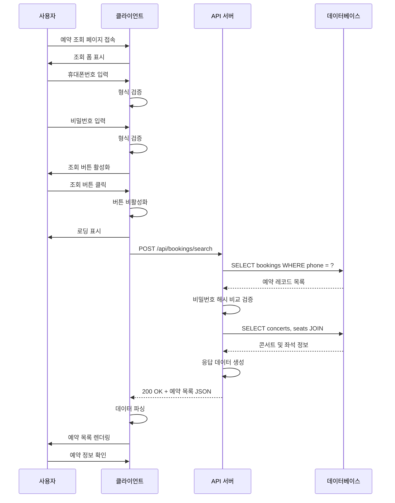

# 유스케이스: UF-006 예약 조회

## 유스케이스 ID: UC-006

### 제목
사용자가 휴대폰번호와 비밀번호를 통해 예약 내역을 조회하고 관리하는 기능

---

## 1. 개요

### 1.1 목적
사용자가 별도의 로그인 없이 휴대폰번호와 4자리 비밀번호만으로 자신의 콘서트 예약 내역을 조회하고, 예약 상세 정보를 확인하며, 필요 시 예약을 취소할 수 있도록 한다.

### 1.2 범위
- **포함**:
  - 휴대폰번호 및 비밀번호 기반 예약 조회
  - 다중 예약 건 목록 표시
  - 예약별 콘서트 정보 및 좌석 정보 표시
  - 좌석별 등급 및 가격 정보 표시
  - 예약별 총 결제 금액 표시
  - 예약 상태 표시 (확정/취소)
  - 예약 취소 기능 (UF-008로 연계)

- **제외**:
  - 회원 시스템 (회원가입/로그인)
  - 예약 수정 기능
  - 실제 결제 내역 조회
  - 예약 확인 이메일/SMS 발송

### 1.3 액터
- **주요 액터**: 일반 사용자 (콘서트 예약자)
- **부 액터**:
  - 백엔드 API 서버
  - PostgreSQL 데이터베이스

---

## 2. 선행 조건

유스케이스 실행 전 필수 조건:

1. 사용자가 예약 조회 페이지에 접근 가능한 상태
2. 데이터베이스에 최소 1개 이상의 예약 정보가 존재
3. 네트워크 연결이 정상 상태
4. API 서버가 정상 작동 중
5. 사용자가 예약 시 사용한 휴대폰번호와 비밀번호를 기억하고 있음

---

## 3. 참여 컴포넌트

### 3.1 프론트엔드 컴포넌트
- **예약 조회 페이지** (`/bookings/search`): 조회 폼 및 결과 목록 렌더링
- **입력 검증 모듈**: 클라이언트 측 유효성 검사 (휴대폰번호 형식, 비밀번호 형식)
- **HTTP 클라이언트**: API 요청 전송 및 응답 처리

### 3.2 백엔드 컴포넌트
- **예약 조회 API 엔드포인트**: `POST /api/bookings/search`
- **인증 모듈**: 비밀번호 해시 비교 검증
- **데이터베이스 쿼리 레이어**: 예약 및 관련 정보 조회

### 3.3 데이터베이스
- **테이블**: `bookings`, `concerts`, `seats`, `booking_seats`
- **인덱스**: `idx_bookings_phone`, `idx_bookings_phone_status`

---

## 4. 기본 플로우 (Basic Flow)

### 4.1 단계별 흐름

**단계 1: 페이지 로드**
- **액터**: 사용자
- **입력**: 예약 조회 페이지 URL 접속
- **처리**:
  - 클라이언트가 예약 조회 페이지 렌더링
  - 빈 조회 폼 표시 (휴대폰번호, 비밀번호 입력 필드)
- **출력**:
  - 조회 폼 UI 표시
  - 조회 버튼 비활성화 상태

**단계 2: 정보 입력**
- **액터**: 사용자
- **입력**:
  - 휴대폰번호 (예: 010-1234-5678 또는 01012345678)
  - 비밀번호 4자리 (숫자)
- **처리**:
  - 실시간 입력 검증 (클라이언트)
    - 휴대폰번호 형식 검증 (010으로 시작, 10-11자리 숫자)
    - 비밀번호 4자리 숫자 검증
  - 모든 필드 유효 시 조회 버튼 활성화
- **출력**:
  - 필드별 실시간 검증 피드백
  - 조회 버튼 활성화/비활성화

**단계 3: 조회 요청 제출**
- **액터**: 사용자
- **입력**: 조회 버튼 클릭
- **처리**:
  - 조회 버튼 즉시 비활성화 (중복 요청 방지)
  - 로딩 인디케이터 표시
  - API 요청 생성
    ```
    POST /api/bookings/search
    Content-Type: application/json
    {
      "phone": "01012345678",
      "password": "1234"
    }
    ```
  - HTTP 요청 전송
- **출력**: 로딩 상태 UI

**단계 4: 서버 측 인증 및 조회**
- **액터**: 백엔드 API 서버
- **입력**: 휴대폰번호, 비밀번호
- **처리**:
  1. 휴대폰번호로 예약 레코드 조회
     ```sql
     SELECT id, concert_id, name, phone, password_hash, status, created_at
     FROM bookings
     WHERE phone = :phone
     ORDER BY created_at DESC;
     ```
  2. 조회된 각 예약에 대해 비밀번호 해시 비교
     ```
     bcrypt.compare(입력_비밀번호, 저장된_password_hash)
     ```
  3. 비밀번호가 일치하는 예약만 필터링
  4. 각 예약에 대해 관련 정보 조회:
     - 콘서트 정보 (JOIN `concerts`)
     - 예약된 좌석 정보 (JOIN `booking_seats`, `seats`)
  5. 응답 데이터 생성
- **출력**:
  - 성공: 예약 목록 JSON 배열
  - 실패: 에러 코드 및 메시지

**단계 5: 결과 렌더링**
- **액터**: 프론트엔드
- **입력**: API 응답 데이터
- **처리**:
  - 로딩 인디케이터 제거
  - 예약 목록 파싱
  - 각 예약 건을 카드 형태로 렌더링
- **출력**:
  - 예약 목록 표시
  - 각 카드 포함 정보:
    - 예약번호 (UUID 일부 또는 전체)
    - 콘서트 제목
    - 공연 일시
    - 공연 장소
    - 예약자명
    - 예약 일시
    - 예약된 좌석 목록 (구역-행-열 형식, 예: A-1-1, A-1-2)
    - 예약 상태 (확정/취소됨)
    - 예약취소 버튼 (상태가 '확정'인 경우만)

**단계 6: 사용자 확인**
- **액터**: 사용자
- **입력**: 화면에 표시된 예약 정보
- **처리**: 예약 내역 확인
- **출력**:
  - 필요 시 예약 취소 버튼 클릭 (UF-008로 전환)
  - 또는 홈으로 돌아가기

### 4.2 시퀀스 다이어그램



---

## 5. 대안 플로우 (Alternative Flows)

### 5.1 대안 플로우 1: 예약 건 없음

**시작 조건**: 단계 4에서 휴대폰번호로 예약이 조회되지 않음

**단계**:
1. 서버가 빈 배열 응답 반환
   ```json
   {
     "success": true,
     "data": [],
     "message": "No bookings found"
   }
   ```
2. 클라이언트가 빈 상태 UI 렌더링
   - 안내 메시지: "예약 내역이 없습니다."
   - 부가 텍스트: "입력하신 정보로 예약된 내역을 찾을 수 없습니다. 휴대폰번호와 비밀번호를 다시 확인해주세요."
3. 다시 조회하기 버튼 또는 홈으로 가기 버튼 표시

**결과**: 사용자가 정보를 재입력하거나 홈으로 이동

### 5.2 대안 플로우 2: 비밀번호 불일치

**시작 조건**: 단계 4에서 휴대폰번호로 예약은 조회되었으나 비밀번호가 일치하지 않음

**단계**:
1. 서버가 인증 실패 응답 반환
   ```json
   {
     "success": false,
     "error": "AUTHENTICATION_FAILED",
     "message": "Invalid credentials"
   }
   ```
2. 클라이언트가 에러 메시지 표시
   - 사용자 메시지: "휴대폰번호 또는 비밀번호가 일치하지 않습니다."
   - 보안상 구체적인 실패 이유는 숨김
3. 입력 필드 초기화 (선택사항) 또는 유지
4. 조회 버튼 재활성화

**결과**: 사용자가 정보를 재입력 시도

### 5.3 대안 플로우 3: 다수의 예약 건 존재

**시작 조건**: 단계 4에서 동일 휴대폰번호로 여러 예약 건이 조회됨 (예: 10개 이상)

**단계**:
1. 서버가 최신순으로 정렬된 예약 목록 반환
2. 클라이언트가 예약 목록을 렌더링
   - 초기 로드: 최근 10개만 표시
   - 무한 스크롤 또는 "더 보기" 버튼 표시
3. 사용자가 스크롤 또는 버튼 클릭 시 추가 로드
4. 각 예약 건은 동일한 카드 형식으로 표시

**결과**: 사용자가 모든 예약 내역을 확인 가능

### 5.4 대안 플로우 4: 과거 콘서트 예약 건 표시

**시작 조건**: 조회된 예약 중 콘서트 진행일이 현재 날짜보다 이전인 경우

**단계**:
1. 서버가 예약 목록 반환 시 콘서트 날짜 정보 포함
2. 클라이언트가 현재 날짜와 비교
3. 과거 콘서트 예약 건 표시:
   - 예약 카드에 "완료됨" 배지 표시
   - 예약취소 버튼 숨김 또는 비활성화
   - 카드 스타일 차별화 (회색 톤)
4. 미래 콘서트와 구분하여 표시

**결과**: 사용자가 과거 및 미래 예약을 구분하여 확인

---

## 6. 예외 플로우 (Exception Flows)

### 6.1 예외 상황 1: 필수 필드 누락

**발생 조건**: 사용자가 휴대폰번호 또는 비밀번호를 입력하지 않고 조회 시도

**처리 방법**:
1. 클라이언트 측 검증으로 조회 버튼 비활성화 유지
2. 만약 우회하여 요청 전송 시:
   - 서버가 400 Bad Request 응답
   ```json
   {
     "success": false,
     "error": "VALIDATION_ERROR",
     "message": "Phone number and password are required",
     "details": {
       "phone": "This field is required",
       "password": "This field is required"
     }
   }
   ```
3. 클라이언트가 필드별 에러 메시지 표시

**에러 코드**: `400 Bad Request`

**사용자 메시지**: "휴대폰번호와 비밀번호를 입력해주세요."

### 6.2 예외 상황 2: 유효하지 않은 입력 형식

**발생 조건**: 휴대폰번호 형식이 잘못되었거나 비밀번호가 4자리 숫자가 아닌 경우

**처리 방법**:
1. 클라이언트 실시간 검증:
   - 휴대폰번호: 정규식 검증 `^010\d{8}$` 또는 `^010-\d{4}-\d{4}$`
   - 비밀번호: `^\d{4}$`
2. 에러 메시지 표시:
   - 휴대폰번호: "올바른 휴대폰번호 형식이 아닙니다."
   - 비밀번호: "4자리 숫자를 입력해주세요."
3. 조회 버튼 비활성화

**에러 코드**: 클라이언트 측 검증 (HTTP 요청 미전송)

**사용자 메시지**: 필드별 실시간 에러 메시지

### 6.3 예외 상황 3: 서버 에러 (500)

**발생 조건**: 데이터베이스 연결 실패, 내부 서버 오류 등

**처리 방법**:
1. 서버가 500 Internal Server Error 응답
   ```json
   {
     "success": false,
     "error": "INTERNAL_SERVER_ERROR",
     "message": "An unexpected error occurred"
   }
   ```
2. 클라이언트가 에러 모달 또는 토스트 표시
   - 메시지: "일시적인 오류가 발생했습니다. 잠시 후 다시 시도해주세요."
3. 재시도 버튼 표시
4. 에러 로깅 (프론트엔드 및 백엔드)

**에러 코드**: `500 Internal Server Error`

**사용자 메시지**: "일시적인 오류가 발생했습니다. 잠시 후 다시 시도해주세요."

### 6.4 예외 상황 4: 네트워크 타임아웃

**발생 조건**: API 요청이 설정된 시간 내에 응답받지 못함 (예: 30초 초과)

**처리 방법**:
1. HTTP 클라이언트 타임아웃 발생
2. 클라이언트가 타임아웃 에러 처리
   - 로딩 인디케이터 제거
   - 에러 메시지: "네트워크 연결이 불안정합니다. 다시 시도해주세요."
3. 재시도 버튼 표시
4. 입력했던 정보 유지

**에러 코드**: `TIMEOUT` (클라이언트 에러)

**사용자 메시지**: "네트워크 연결이 불안정합니다. 다시 시도해주세요."

### 6.5 예외 상황 5: 데이터베이스 연결 실패

**발생 조건**: API 서버가 데이터베이스에 연결할 수 없음

**처리 방법**:
1. 서버가 503 Service Unavailable 응답
2. 클라이언트가 서비스 점검 안내 표시
   - 메시지: "서비스 이용이 일시적으로 불가합니다. 잠시 후 다시 시도해주세요."
3. 자동 재시도 (선택사항, 최대 3회)

**에러 코드**: `503 Service Unavailable`

**사용자 메시지**: "서비스 이용이 일시적으로 불가합니다. 잠시 후 다시 시도해주세요."

### 6.6 예외 상황 6: SQL Injection 시도

**발생 조건**: 악의적인 사용자가 SQL 코드를 입력값에 포함하여 전송

**처리 방법**:
1. 서버 측 입력 검증 및 파라미터화된 쿼리 사용
   - Prepared Statement / Parameterized Query 사용
   ```javascript
   // 안전한 예시
   db.query('SELECT * FROM bookings WHERE phone = $1', [phone])
   ```
2. 입력값 이스케이프 처리
3. ORM 사용 시 자동 보호
4. 의심스러운 패턴 탐지 시 요청 거부
5. 보안 로그 기록

**에러 코드**: `400 Bad Request` 또는 조용한 거부

**사용자 메시지**: "올바르지 않은 입력입니다."

---

## 7. 후행 조건 (Post-conditions)

### 7.1 성공 시

**데이터베이스 변경**:
- 없음 (조회 작업은 읽기 전용)

**시스템 상태**:
- 사용자가 자신의 예약 목록을 확인한 상태
- 예약취소 액션 대기 상태 (사용자 선택)

**외부 시스템**:
- 해당 없음

**사용자 세션**:
- 조회한 예약 정보가 클라이언트 메모리에 임시 저장
- 페이지 새로고침 시 재조회 필요

### 7.2 실패 시

**데이터 롤백**:
- 해당 없음 (읽기 작업)

**시스템 상태**:
- 사용자가 조회 페이지에 머무름
- 에러 메시지 표시
- 재시도 가능 상태

**로깅**:
- 에러 로그 기록 (에러 유형, 타임스탬프, 요청 정보)

---

## 8. 비기능 요구사항

### 8.1 성능

**응답 시간**:
- 조회 API 응답 시간: 1초 이내 (평균)
- 페이지 렌더링 시간: 500ms 이내
- 타임아웃 설정: 30초

**처리량**:
- 동시 조회 요청 처리: 최소 100건/초
- 데이터베이스 쿼리 최적화: 인덱스 활용 (idx_bookings_phone)

**확장성**:
- 사용자당 평균 예약 건수: 1-5건
- 최대 예약 건수: 제한 없음 (페이지네이션으로 처리)

### 8.2 보안

**비밀번호 보호**:
- 비밀번호는 bcrypt 해싱 저장 (최소 10 라운드)
- 전송 시 HTTPS 필수
- 평문 비밀번호는 로그에 기록 금지

**개인정보 보호**:
- 휴대폰번호는 마스킹 표시 (선택사항: 010-****-5678)
- 조회 실패 시 구체적인 이유 숨김 (보안상)
- 브루트 포스 공격 방지: Rate Limiting (IP당 분당 5회)

**입력 검증**:
- XSS 방지: 입력값 이스케이프 처리
- SQL Injection 방지: 파라미터화된 쿼리
- CSRF 보호: CSRF 토큰 사용 (선택사항)

### 8.3 가용성

**시스템 가동률**:
- 99% 이상

**에러 핸들링**:
- 모든 예외 상황에 대한 명확한 사용자 피드백
- Graceful degradation (서비스 저하 시에도 기본 기능 유지)

**복구 시간**:
- 데이터베이스 장애 복구: 5분 이내

### 8.4 사용성

**반응형 디자인**:
- 모바일, 태블릿, 데스크톱 모두 지원
- 최소 화면 너비: 320px

**브라우저 호환성**:
- Chrome, Safari, Firefox, Edge 최신 2개 버전

**접근성**:
- WCAG 2.1 AA 레벨 준수
- 키보드 네비게이션 지원
- 스크린 리더 호환

---

## 9. UI/UX 요구사항

### 9.1 화면 구성

**조회 폼 섹션**:
- 제목: "예약 조회"
- 부제목: "휴대폰번호와 비밀번호를 입력해주세요."
- 입력 필드:
  - 휴대폰번호 (type="tel", placeholder="010-1234-5678")
  - 비밀번호 4자리 (type="password", inputmode="numeric", maxlength=4)
- 조회 버튼 (primary button)
- 모든 필드 필수 입력 표시 (빨간 별표 *)

**결과 목록 섹션** (조회 후):
- 결과 헤더: "총 N건의 예약"
- 예약 카드 목록 (스크롤 가능)
- 각 카드 레이아웃:
  ```
  ┌─────────────────────────────────────┐
  │ [예약번호] #ABC123                    │
  │ [콘서트] BTS 콘서트                   │
  │ [일시] 2025-12-25 19:00              │
  │ [장소] 서울 올림픽 공원                │
  │ [예약자] 홍길동                       │
  │ [좌석]                                │
  │   · A-1-1 (S등급) ₩250,000          │
  │   · A-1-2 (S등급) ₩250,000          │
  │ [총 금액] ₩500,000                   │
  │ [예약일] 2025-10-13 14:30            │
  │ [상태] ● 확정                         │
  │ [예약취소] 버튼                       │
  └─────────────────────────────────────┘
  ```

**빈 상태 UI**:
- 아이콘: 빈 목록 아이콘
- 메시지: "예약 내역이 없습니다."
- 부가 설명
- CTA 버튼: "콘서트 둘러보기" (홈으로 이동)

### 9.2 사용자 경험

**로딩 상태**:
- 조회 버튼 클릭 시 즉시 로딩 스피너 표시
- 버튼 텍스트 변경: "조회 중..."
- 버튼 비활성화로 중복 클릭 방지

**에러 피드백**:
- 필드별 인라인 에러 메시지 (입력 필드 아래)
- 에러 색상: 빨간색 텍스트
- 에러 아이콘: 경고 아이콘

**성공 피드백**:
- 부드러운 페이드인 애니메이션으로 결과 표시
- 조회 폼은 접거나 상단 고정 (재조회 가능)

**인터랙션**:
- 입력 필드 포커스 시 테두리 색상 변경
- 예약 카드 호버 시 살짝 확대 또는 그림자 효과
- 예약취소 버튼 호버 시 색상 변경 및 확인 툴팁

**모바일 최적화**:
- 터치 친화적인 버튼 크기 (최소 44x44px)
- 숫자 키패드 자동 표시 (비밀번호 입력 시)
- 스와이프로 카드 간 이동 (선택사항)

---

## 10. 데이터 요구사항

### 10.1 입력 데이터

| 필드명 | 데이터 타입 | 제약조건 | 예시 |
|--------|------------|---------|------|
| phone | String | 필수, 10-11자리 숫자, 010으로 시작 | "01012345678" |
| password | String | 필수, 정확히 4자리 숫자 | "1234" |

**검증 규칙**:
- 휴대폰번호: 하이픈 포함 여부 무관 (자동 제거)
- 비밀번호: 숫자만 허용, 공백 불가

### 10.2 출력 데이터

**API 응답 구조** (성공):
```json
{
  "success": true,
  "data": [
    {
      "bookingId": "550e8400-e29b-41d4-a716-446655440000",
      "concertId": "660e8400-e29b-41d4-a716-446655440000",
      "concertTitle": "BTS 콘서트",
      "concertDate": "2025-12-25T19:00:00+09:00",
      "location": "서울 올림픽 공원",
      "bookerName": "홍길동",
      "bookingDate": "2025-10-13T14:30:00+09:00",
      "status": "confirmed",
      "totalAmount": 500000,
      "seats": [
        {
          "section": "A",
          "row": 1,
          "column": 1,
          "displayName": "A-1-1",
          "grade": "S",
          "price": 250000
        },
        {
          "section": "A",
          "row": 1,
          "column": 2,
          "displayName": "A-1-2",
          "grade": "S",
          "price": 250000
        }
      ]
    }
  ],
  "total": 1
}
```

**API 응답 구조** (실패):
```json
{
  "success": false,
  "error": "AUTHENTICATION_FAILED",
  "message": "Invalid credentials"
}
```

### 10.3 데이터베이스 쿼리

**예약 조회 쿼리**:
```sql
-- 1단계: 휴대폰번호로 예약 조회
SELECT
  b.id,
  b.concert_id,
  b.name,
  b.password_hash,
  b.status,
  b.created_at,
  c.title as concert_title,
  c.event_date,
  c.location
FROM bookings b
JOIN concerts c ON b.concert_id = c.id
WHERE b.phone = :phone
ORDER BY b.created_at DESC;

-- 2단계: 비밀번호 검증 (애플리케이션 레벨)
-- bcrypt.compare(inputPassword, booking.password_hash)

-- 3단계: 각 예약의 좌석 정보 조회 (등급 및 가격 포함)
SELECT
  s.section,
  s.row,
  s.column,
  s.grade,
  s.price
FROM booking_seats bs
JOIN seats s ON bs.seat_id = s.id
WHERE bs.booking_id = :booking_id
ORDER BY s.section, s.row, s.column;
```

**인덱스 활용**:
- `idx_bookings_phone`: 휴대폰번호 조회 최적화
- `idx_bookings_phone_status`: 상태별 필터링 최적화
- `idx_booking_seats_booking_id`: 예약별 좌석 조회 최적화

---

## 11. API 명세

### 11.1 예약 조회 API

**엔드포인트**: `POST /api/bookings/search`

**요청 헤더**:
```
Content-Type: application/json
```

**요청 바디**:
```json
{
  "phone": "01012345678",
  "password": "1234"
}
```

**응답 코드**:
- `200 OK`: 조회 성공 (예약 건 있음)
- `200 OK`: 조회 성공 (예약 건 없음, data: [])
- `400 Bad Request`: 입력 검증 실패
- `401 Unauthorized`: 인증 실패 (비밀번호 불일치)
- `500 Internal Server Error`: 서버 오류
- `503 Service Unavailable`: 서비스 점검

**응답 바디 예시** (성공):
```json
{
  "success": true,
  "data": [
    {
      "bookingId": "...",
      "concertTitle": "BTS 콘서트",
      "totalAmount": 500000,
      "seats": [
        {
          "displayName": "A-1-1",
          "grade": "S",
          "price": 250000
        }
      ]
    }
  ],
  "total": 2
}
```

**응답 바디 예시** (실패):
```json
{
  "success": false,
  "error": "AUTHENTICATION_FAILED",
  "message": "Invalid credentials"
}
```

---

## 12. 테스트 시나리오

### 12.1 성공 케이스

| 테스트 케이스 ID | 입력값 | 기대 결과 |
|----------------|--------|----------|
| TC-006-01 | phone: "01012345678", password: "1234" (예약 1건 존재) | 200 OK, 예약 목록 1건 반환 |
| TC-006-02 | phone: "01087654321", password: "5678" (예약 3건 존재) | 200 OK, 예약 목록 3건 반환, 최신순 정렬 |
| TC-006-03 | phone: "010-1234-5678" (하이픈 포함) | 200 OK, 하이픈 자동 제거 후 조회 |
| TC-006-04 | 과거 콘서트 예약 포함 | 200 OK, 과거/미래 예약 모두 표시, 상태 구분 |
| TC-006-05 | 취소된 예약 포함 | 200 OK, status: "cancelled" 표시, 예약취소 버튼 숨김 |

### 12.2 실패 케이스

| 테스트 케이스 ID | 입력값 | 기대 결과 |
|----------------|--------|----------|
| TC-006-06 | phone: "", password: "1234" | 400 Bad Request, 필수 필드 누락 에러 |
| TC-006-07 | phone: "01012345678", password: "" | 400 Bad Request, 필수 필드 누락 에러 |
| TC-006-08 | phone: "123", password: "1234" | 400 Bad Request, 휴대폰번호 형식 오류 |
| TC-006-09 | phone: "01012345678", password: "12" | 400 Bad Request, 비밀번호 형식 오류 |
| TC-006-10 | phone: "01012345678", password: "9999" (불일치) | 401 Unauthorized, 인증 실패 |
| TC-006-11 | phone: "01099999999" (존재하지 않음) | 200 OK, data: [], 빈 배열 반환 |
| TC-006-12 | SQL Injection 시도: phone: "010' OR '1'='1" | 400 Bad Request 또는 안전한 처리 |

### 12.3 엣지 케이스

| 테스트 케이스 ID | 시나리오 | 기대 결과 |
|----------------|---------|----------|
| TC-006-13 | 예약 건 20개 이상 (다수) | 페이지네이션 또는 무한 스크롤로 처리 |
| TC-006-14 | 네트워크 타임아웃 (30초 초과) | 타임아웃 에러 메시지, 재시도 옵션 |
| TC-006-15 | 데이터베이스 연결 실패 | 503 Service Unavailable |
| TC-006-16 | 동시 조회 요청 (동일 사용자) | 각 요청 독립 처리, 중복 방지 |
| TC-006-17 | 조회 중 페이지 새로고침 | 요청 취소, 페이지 재로드 |

---

## 13. 관련 유스케이스

### 13.1 선행 유스케이스
- **UC-005: 예약 정보 입력 및 제출**: 예약 생성 후 조회 가능

### 13.2 후행 유스케이스
- **UC-008: 예약 취소 (예약 조회 페이지)**: 조회 결과에서 예약 취소 액션 수행

### 13.3 연관 유스케이스
- **UC-007: 예약 취소 (예약 완료 페이지)**: 동일한 취소 로직, 진입점 다름
- **UC-002: 콘서트 상세 조회**: 예약 카드에서 콘서트 상세로 이동 가능 (선택사항)

---

## 14. 변경 이력

| 버전 | 날짜 | 작성자 | 변경 내용 |
|------|------|--------|-----------|
| 1.0  | 2025-10-13 | Product Team | 초기 작성 |

---

## 부록

### A. 용어 정의

- **예약 조회**: 사용자가 자신의 예약 내역을 확인하는 행위
- **인증**: 휴대폰번호와 비밀번호를 통한 예약 소유권 확인
- **예약 건**: 하나의 예약 레코드 (1-4개 좌석 포함)
- **bcrypt**: 비밀번호 해싱 알고리즘
- **Rate Limiting**: 일정 시간 동안 허용되는 요청 수 제한

### B. 참고 자료

- **PRD**: `/docs/prd.md` - 제품 요구사항 문서
- **Userflow**: `/docs/userflow.md` - UF-006 섹션
- **Database**: `/docs/database.md` - DF-005 예약 조회 데이터 플로우
- **API 문서**: (추후 작성 예정)
- **bcrypt 라이브러리**: https://www.npmjs.com/package/bcrypt

### C. 보안 고려사항

**브루트 포스 공격 방지**:
```javascript
// 예시: Express Rate Limit
const rateLimit = require('express-rate-limit');

const bookingSearchLimiter = rateLimit({
  windowMs: 1 * 60 * 1000, // 1분
  max: 5, // IP당 최대 5회
  message: 'Too many search attempts, please try again later.'
});

app.post('/api/bookings/search', bookingSearchLimiter, searchHandler);
```

**비밀번호 검증 타이밍 공격 방지**:
```javascript
// 상수 시간 비교
const bcrypt = require('bcrypt');
const isMatch = await bcrypt.compare(inputPassword, storedHash);
// bcrypt는 내부적으로 상수 시간 비교 사용
```

### D. 성능 최적화 팁

**데이터베이스 쿼리 최적화**:
```sql
-- 인덱스 생성
CREATE INDEX idx_bookings_phone_status ON bookings(phone, status);

-- EXPLAIN ANALYZE로 쿼리 플랜 확인
EXPLAIN ANALYZE
SELECT * FROM bookings WHERE phone = '01012345678';
```

**캐싱 전략** (선택사항):
- Redis를 사용한 조회 결과 캐싱 (TTL: 5분)
- 조회 빈도가 높은 경우 적용 고려

**JSON 집계 사용**:
```sql
-- 좌석 정보를 JSON으로 한 번에 조회
SELECT
  b.*,
  json_agg(
    json_build_object(
      'section', s.section,
      'row', s.row,
      'column', s.column
    )
  ) as seats
FROM bookings b
JOIN booking_seats bs ON b.id = bs.booking_id
JOIN seats s ON bs.seat_id = s.id
WHERE b.phone = :phone
GROUP BY b.id;
```

---

**문서 버전**: 1.0
**최종 수정일**: 2025-10-13
**작성자**: Product Team
**검토자**: (검토 필요)
