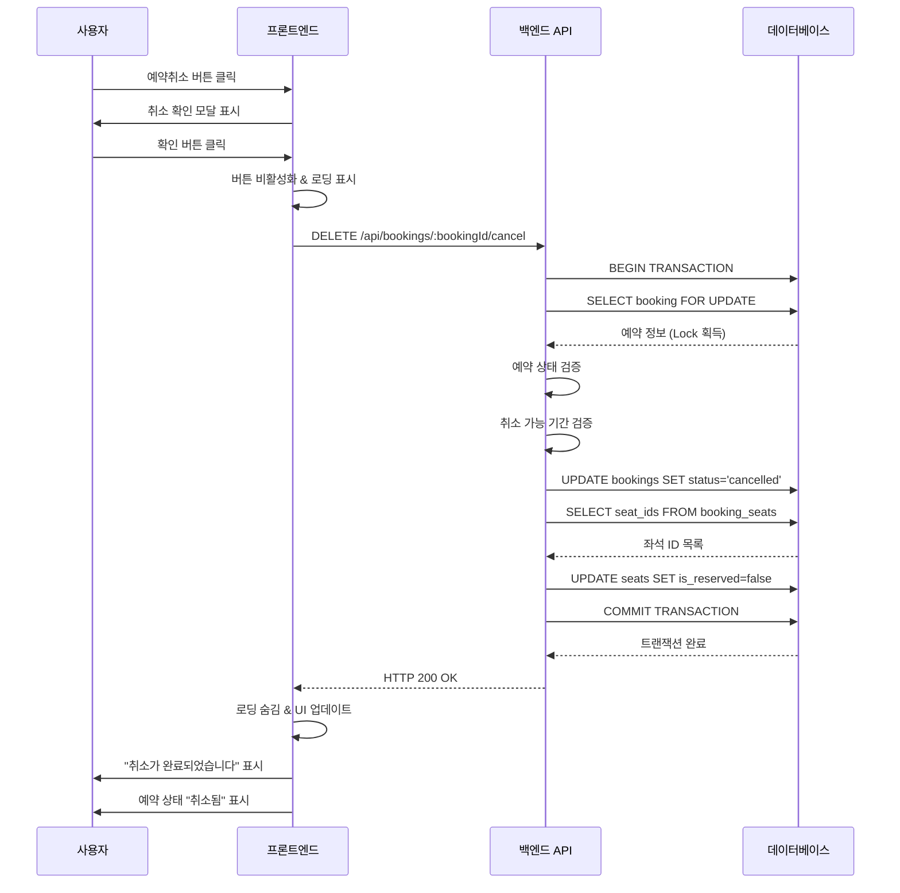
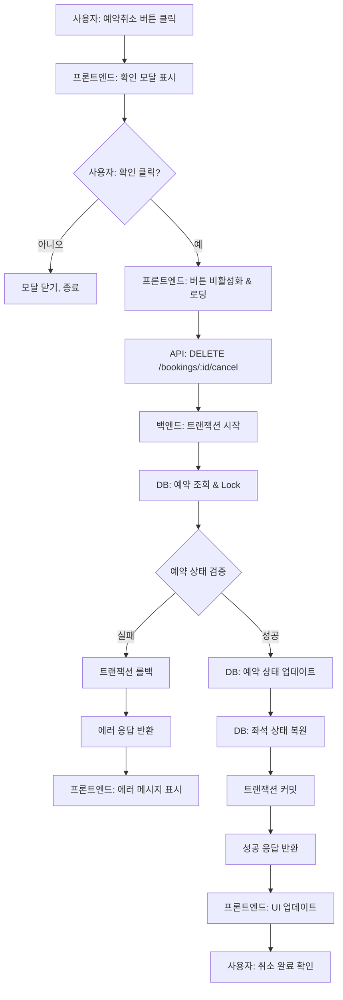

# 유스케이스 문서: 예약 취소 (예약 완료 페이지)

## 유스케이스 ID: UC-007

### 제목
예약 완료 페이지에서 예약 취소하기

---

## 1. 개요

### 1.1 목적
예약을 완료한 사용자가 예약 완료 페이지에서 직접 예약을 취소하여, 예약된 좌석을 다시 다른 사용자가 예약할 수 있도록 하는 기능입니다. 이를 통해 사용자는 즉각적으로 예약을 관리하고, 시스템은 좌석 재고를 효율적으로 운영할 수 있습니다.

### 1.2 범위
- **포함 사항**:
  - 예약 완료 페이지에서의 취소 버튼 제공
  - 취소 확인 모달을 통한 실수 방지
  - 예약 상태 변경 및 좌석 복원
  - 취소 후 UI 상태 업데이트
  - 트랜잭션을 통한 데이터 무결성 보장

- **제외 사항**:
  - 예약 조회 페이지에서의 취소 기능 (UC-008에서 다룸)
  - 취소 수수료 처리 (향후 확장)
  - 취소 알림 발송 (향후 확장)
  - 취소 이력 관리 (기본 상태 변경만 수행)

### 1.3 액터
- **주요 액터**: 예약 완료한 사용자
- **부 액터**:
  - 백엔드 API 서버
  - 데이터베이스 시스템

---

## 2. 선행 조건

1. **예약이 이미 완료된 상태여야 함**
   - 사용자가 UC-005(예약 정보 입력 및 제출)를 통해 예약을 완료한 상태
   - `bookings` 테이블에 `status='confirmed'` 상태의 레코드가 존재

2. **예약 완료 페이지에 접근 가능**
   - 유효한 `bookingId`를 포함한 URL (`/bookings/:bookingId/complete`)에 접근
   - 예약 정보가 데이터베이스에 존재

3. **콘서트가 아직 시작되지 않음**
   - 콘서트 진행 일시(`event_date`)가 현재 시간보다 미래
   - 취소 가능 기간 내에 있음

4. **네트워크 연결 가능**
   - 클라이언트와 서버 간 통신이 가능한 상태

---

## 3. 참여 컴포넌트

- **프론트엔드 (예약 완료 페이지)**:
  - 예약 정보 표시 및 취소 버튼 제공
  - 취소 확인 모달 관리
  - 취소 요청 전송 및 UI 상태 관리

- **백엔드 API 서버**:
  - 취소 요청 수신 및 검증
  - 비즈니스 로직 처리
  - 트랜잭션 관리

- **데이터베이스 (PostgreSQL)**:
  - `bookings` 테이블: 예약 상태 업데이트
  - `seats` 테이블: 좌석 예약 상태 복원
  - `booking_seats` 테이블: 예약-좌석 연결 관리

---

## 4. 기본 플로우 (Basic Flow)

### 4.1 단계별 흐름

**1. 사용자: 예약 완료 페이지 확인**
   - **입력**:
     - URL 파라미터: `bookingId`
   - **처리**:
     - 페이지 로드 시 서버에 예약 정보 조회 요청
     - GET `/api/bookings/:bookingId`
   - **출력**:
     - 예약 정보 표시 (예약 번호, 콘서트 정보, 예약자명, 좌석 목록)
     - 예약취소 버튼 활성화 상태로 표시

**2. 사용자: 예약취소 버튼 클릭**
   - **입력**:
     - 사용자의 클릭 이벤트
   - **처리**:
     - 취소 확인 모달 표시
   - **출력**:
     - 모달 창 렌더링
     - 예약 정보 요약 표시
     - 확인/닫기 버튼 제공

**3. 사용자: 확인 버튼 클릭**
   - **입력**:
     - 사용자의 확인 액션
   - **처리**:
     - 취소 버튼 즉시 비활성화 (중복 요청 방지)
     - 로딩 인디케이터 표시
     - 서버에 취소 요청 전송
   - **출력**:
     - DELETE `/api/bookings/:bookingId/cancel` 요청
     - UI 로딩 상태 표시

**4. 백엔드: 예약 취소 요청 수신 및 검증**
   - **입력**:
     - `bookingId` (URL 파라미터)
   - **처리**:
     - 트랜잭션 시작
     - `bookingId`로 예약 레코드 조회 및 Lock 획득
     ```sql
     SELECT b.id, b.status, c.event_date
     FROM bookings b
     JOIN concerts c ON b.concert_id = c.id
     WHERE b.id = :bookingId
     FOR UPDATE;
     ```
     - 예약 존재 여부 확인
     - 예약 상태 검증 (`status = 'confirmed'`)
     - 취소 가능 기간 검증 (`event_date > NOW()`)
   - **출력**:
     - 검증 통과 시 다음 단계로 진행
     - 검증 실패 시 적절한 에러 응답 및 트랜잭션 롤백

**5. 백엔드: 예약 상태 업데이트**
   - **입력**:
     - 검증된 `bookingId`
   - **처리**:
     - 예약 상태를 취소로 변경
     ```sql
     UPDATE bookings
     SET status = 'cancelled', updated_at = NOW()
     WHERE id = :bookingId;
     ```
   - **출력**:
     - `bookings` 테이블의 해당 레코드 업데이트 완료

**6. 백엔드: 좌석 상태 복원**
   - **입력**:
     - `bookingId`
   - **처리**:
     - 해당 예약의 좌석 ID 조회
     ```sql
     SELECT seat_id
     FROM booking_seats
     WHERE booking_id = :bookingId;
     ```
     - 좌석 상태를 예약 가능으로 변경
     ```sql
     UPDATE seats
     SET is_reserved = false, updated_at = NOW()
     WHERE id IN (
       SELECT seat_id
       FROM booking_seats
       WHERE booking_id = :bookingId
     );
     ```
   - **출력**:
     - `seats` 테이블의 `is_reserved` 필드가 `false`로 변경
     - 트랜잭션 커밋
     - 성공 응답 (HTTP 200 OK)

**7. 프론트엔드: UI 상태 업데이트**
   - **입력**:
     - 서버로부터의 성공 응답
   - **처리**:
     - 로딩 인디케이터 숨김
     - 성공 메시지 표시 (토스트 알림)
     - 페이지 상태 업데이트
   - **출력**:
     - 예약 상태: "취소됨" 표시
     - 예약취소 버튼 숨김 또는 비활성화
     - "취소가 완료되었습니다" 메시지 표시
     - 홈으로 돌아가기 버튼 활성화 유지

### 4.2 시퀀스 다이어그램



---

## 5. 대안 플로우 (Alternative Flows)

### 5.1 대안 플로우 1: 사용자가 취소 확인 모달에서 닫기 버튼 클릭

**시작 조건**: 기본 플로우의 2단계 (취소 확인 모달 표시) 이후

**단계**:
1. 사용자가 모달의 "닫기" 버튼 또는 모달 외부 영역 클릭
2. 프론트엔드가 모달 창을 닫음
3. 취소 요청이 서버로 전송되지 않음
4. 예약 완료 페이지 유지 (예약 상태 변경 없음)

**결과**: 예약이 그대로 유지되며, 사용자는 예약 완료 페이지에서 계속 머물 수 있음

---

## 6. 예외 플로우 (Exception Flows)

### 6.1 예외 상황 1: 이미 취소된 예약

**발생 조건**:
- 사용자가 취소를 요청했으나, 다른 세션이나 탭에서 이미 해당 예약을 취소한 경우
- 또는 중복 클릭으로 인해 동일한 예약에 대해 여러 취소 요청이 전송된 경우

**처리 방법**:
1. 백엔드가 예약 상태 검증 시 `status = 'cancelled'` 확인
2. 트랜잭션 롤백
3. 에러 응답 전송
   ```json
   {
     "error": "BOOKING_ALREADY_CANCELLED",
     "message": "이미 취소된 예약입니다."
   }
   ```
4. 프론트엔드가 에러 수신
5. 로딩 인디케이터 숨김
6. 사용자에게 안내 메시지 표시
7. 페이지 상태를 "취소됨"으로 업데이트 (버튼 숨김)

**에러 코드**: `400 Bad Request`

**사용자 메시지**: "이미 취소된 예약입니다."

---

### 6.2 예외 상황 2: 예약을 찾을 수 없음

**발생 조건**:
- 잘못된 `bookingId`를 사용하여 요청
- 데이터베이스에서 예약 레코드가 삭제된 경우
- URL 조작 또는 만료된 링크 접근

**처리 방법**:
1. 백엔드가 예약 조회 시 결과가 없음을 확인
2. 트랜잭션 롤백 (또는 시작하지 않음)
3. 404 에러 응답 전송
   ```json
   {
     "error": "BOOKING_NOT_FOUND",
     "message": "예약 정보를 찾을 수 없습니다."
   }
   ```
4. 프론트엔드가 에러 수신
5. 로딩 인디케이터 숨김
6. 404 에러 메시지 표시
7. 예약 조회 페이지 또는 홈으로 이동 옵션 제공

**에러 코드**: `404 Not Found`

**사용자 메시지**: "예약 정보를 찾을 수 없습니다. 예약 조회 페이지에서 다시 확인해주세요."

---

### 6.3 예외 상황 3: 취소 불가능한 상태 (콘서트 시작 후)

**발생 조건**:
- 콘서트의 `event_date`가 현재 시간보다 과거인 경우
- 예약 완료 후 시간이 경과하여 콘서트가 이미 시작되거나 종료됨

**처리 방법**:
1. 백엔드가 취소 가능 기간 검증 시 `event_date <= NOW()` 확인
2. 트랜잭션 롤백
3. 에러 응답 전송
   ```json
   {
     "error": "CANCELLATION_NOT_ALLOWED",
     "message": "콘서트가 시작되어 취소가 불가능합니다."
   }
   ```
4. 프론트엔드가 에러 수신
5. 로딩 인디케이터 숨김
6. 취소 불가 안내 메시지 표시
7. 예약취소 버튼 비활성화 또는 숨김
8. 고객센터 안내 정보 표시 (향후 확장)

**에러 코드**: `400 Bad Request`

**사용자 메시지**: "콘서트가 이미 시작되어 취소가 불가능합니다. 문의 사항은 고객센터로 연락주세요."

---

### 6.4 예외 상황 4: 서버 에러

**발생 조건**:
- 데이터베이스 연결 실패
- 트랜잭션 처리 중 예상치 못한 오류 발생
- 서버 내부 오류

**처리 방법**:
1. 백엔드에서 예외 발생 (Exception thrown)
2. 트랜잭션 자동 롤백
3. 에러 로깅 및 모니터링
4. 일반 에러 응답 전송
   ```json
   {
     "error": "INTERNAL_SERVER_ERROR",
     "message": "일시적인 오류가 발생했습니다. 잠시 후 다시 시도해주세요."
   }
   ```
5. 프론트엔드가 에러 수신
6. 로딩 인디케이터 숨김
7. 에러 메시지 표시
8. 재시도 버튼 제공
9. 버튼 재활성화

**에러 코드**: `500 Internal Server Error`

**사용자 메시지**: "일시적인 오류가 발생했습니다. 잠시 후 다시 시도해주세요."

---

### 6.5 예외 상황 5: 네트워크 타임아웃

**발생 조건**:
- 클라이언트와 서버 간 네트워크 연결 불안정
- 요청 처리 시간이 타임아웃 설정값 초과
- 서버 응답 지연

**처리 방법**:
1. 프론트엔드의 HTTP 클라이언트가 타임아웃 감지
2. 타임아웃 에러 catch
3. 로딩 인디케이터 숨김
4. 타임아웃 안내 메시지 표시
   - "네트워크 연결이 불안정합니다. 예약 취소 상태를 확인해주세요."
5. 재시도 옵션 제공
6. 예약 상태 재조회 버튼 제공 (상태 불확실성 해소)
7. 버튼 재활성화

**에러 코드**: `408 Request Timeout` (클라이언트 측 타임아웃)

**사용자 메시지**: "네트워크 연결이 불안정합니다. 예약 취소가 정상적으로 처리되었는지 예약 조회 페이지에서 확인해주세요."

---

### 6.6 예외 상황 6: 중복 취소 요청 (더블 클릭)

**발생 조건**:
- 사용자가 빠르게 여러 번 확인 버튼을 클릭
- 네트워크 지연으로 인해 사용자가 중복 클릭

**처리 방법**:
1. 프론트엔드에서 첫 번째 클릭 시 버튼 즉시 비활성화
2. 두 번째 이후 클릭 이벤트는 무시됨
3. 로딩 상태 표시로 진행 중임을 시각적으로 알림
4. 백엔드에서 중복 요청이 도착하더라도:
   - 첫 번째 요청: 정상 처리
   - 두 번째 요청: 예약 상태 검증 단계에서 "이미 취소됨" 에러 반환 (6.1과 동일)
5. 프론트엔드는 첫 번째 요청의 응답만 처리
6. 성공 메시지 표시 및 UI 업데이트

**에러 코드**: 첫 번째 요청 - `200 OK`, 두 번째 요청 - `400 Bad Request`

**사용자 메시지**: 성공 메시지만 표시되며, 중복 에러는 사용자에게 노출하지 않음

---

## 7. 후행 조건 (Post-conditions)

### 7.1 성공 시

**데이터베이스 변경**:
- **bookings 테이블**:
  - `status` 필드: `'confirmed'` → `'cancelled'`
  - `updated_at` 필드: 현재 시간으로 업데이트
- **seats 테이블** (해당 예약의 모든 좌석):
  - `is_reserved` 필드: `true` → `false`
  - `updated_at` 필드: 현재 시간으로 업데이트
- **booking_seats 테이블**:
  - 레코드 유지 (삭제하지 않음, 이력 관리)
  - (선택적) CASCADE 삭제 정책에 따라 삭제 가능

**시스템 상태**:
- 예약이 취소 상태로 변경됨
- 좌석이 다시 예약 가능한 상태로 전환됨
- 다른 사용자가 해당 좌석을 예약할 수 있음

**외부 시스템**:
- 없음 (현재 버전에서는 외부 연동 없음)
- (향후) 취소 알림 이메일/SMS 발송

### 7.2 실패 시

**데이터 롤백**:
- 트랜잭션 롤백으로 모든 데이터베이스 변경 사항 취소
- `bookings` 테이블: 원래 상태 유지
- `seats` 테이블: 원래 상태 유지

**시스템 상태**:
- 예약 상태 변경 없음
- 좌석 상태 변경 없음
- 사용자에게 에러 메시지 표시
- 예약취소 버튼 재활성화 (재시도 가능)

---

## 8. 비기능 요구사항

### 8.1 성능

- **응답 시간**:
  - 정상 처리: 1초 이내 (P95)
  - 데이터베이스 트랜잭션: 500ms 이내
  - 네트워크 타임아웃 설정: 10초

- **처리량**:
  - 동시 취소 요청: 최소 50TPS 지원
  - 데이터베이스 Lock 대기 시간: 5초 이내

- **확장성**:
  - 트랜잭션 격리 수준: READ COMMITTED
  - Row-level locking으로 동시성 제어

### 8.2 보안

- **인증**:
  - 예약 완료 페이지 접근 시 별도 인증 없음 (bookingId가 인증 역할)
  - bookingId는 UUID 형식으로 추측 불가능
  - (보안 강화 옵션) 취소 시 비밀번호 재확인 추가 가능

- **권한**:
  - bookingId를 알고 있는 사용자만 취소 가능
  - URL 직접 접근 가능 (예약 완료 직후 시나리오)

- **데이터 보호**:
  - SQL Injection 방지: Prepared Statement 사용
  - XSS 방지: 사용자 입력 데이터 이스케이프

### 8.3 가용성

- **시스템 가동률**: 99% 이상
- **트랜잭션 안정성**:
  - ACID 원칙 준수
  - 트랜잭션 실패 시 자동 롤백
- **데이터 무결성**:
  - 좌석과 예약 상태의 일관성 보장
  - 중복 취소 방지

### 8.4 사용성

- **반응성**:
  - 버튼 클릭 즉시 시각적 피드백 제공
  - 로딩 인디케이터로 처리 중 상태 표시

- **에러 처리**:
  - 사용자 친화적인 에러 메시지
  - 명확한 다음 액션 가이드 (재시도, 홈으로 이동 등)

- **접근성**:
  - 키보드 네비게이션 지원
  - 스크린 리더 호환
  - WCAG 2.1 AA 레벨 준수

---

## 9. UI/UX 요구사항

### 9.1 화면 구성

**예약 완료 페이지 (취소 전)**:
```
┌─────────────────────────────────────┐
│  예약이 완료되었습니다!              │
├─────────────────────────────────────┤
│  예약 번호: AB12-CD34-EF56          │
│                                     │
│  [콘서트 정보]                      │
│  제목: BTS 콘서트                   │
│  일시: 2025-12-25 19:00            │
│  장소: 서울 올림픽 공원             │
│                                     │
│  [예약 정보]                        │
│  예약자: 홍길동                     │
│  좌석:                             │
│  - A구역 5행 2열                   │
│  - A구역 5행 3열                   │
│                                     │
│  ┌─────────────┐  ┌──────────────┐│
│  │ 예약취소     │  │ 홈으로 가기   ││
│  └─────────────┘  └──────────────┘│
└─────────────────────────────────────┘
```

**취소 확인 모달**:
```
┌─────────────────────────────────────┐
│  예약을 취소하시겠습니까?            │
├─────────────────────────────────────┤
│  콘서트: BTS 콘서트                 │
│  좌석: A구역 5행 2열, 3열           │
│                                     │
│  취소된 예약은 복구할 수 없습니다.   │
│                                     │
│  ┌──────────┐      ┌────────────┐ │
│  │   확인    │      │   닫기      │ │
│  └──────────┘      └────────────┘ │
└─────────────────────────────────────┘
```

**취소 처리 중**:
```
┌─────────────────────────────────────┐
│  [로딩 스피너] 취소 처리 중...       │
│  잠시만 기다려주세요.               │
└─────────────────────────────────────┘
```

**취소 완료 후**:
```
┌─────────────────────────────────────┐
│  예약이 취소되었습니다               │
├─────────────────────────────────────┤
│  예약 번호: AB12-CD34-EF56          │
│  상태: [취소됨]                     │
│                                     │
│  [콘서트 정보]                      │
│  제목: BTS 콘서트                   │
│  일시: 2025-12-25 19:00            │
│                                     │
│  ┌──────────────┐                  │
│  │ 홈으로 가기   │                  │
│  └──────────────┘                  │
└─────────────────────────────────────┘
```

### 9.2 사용자 경험

**인터랙션 플로우**:
1. **초기 상태**:
   - 예약취소 버튼: 눈에 띄지만 위험을 나타내는 빨간색 또는 회색 톤
   - 홈으로 가기 버튼: 주요 CTA (파란색 또는 초록색)

2. **버튼 클릭 시**:
   - 모달이 페이드 인 애니메이션과 함께 표시
   - 배경 어둡게 처리 (backdrop)
   - 포커스가 모달 내부로 이동 (접근성)

3. **확인 버튼 클릭 시**:
   - 버튼 즉시 비활성화 (회색 처리, 클릭 불가)
   - 로딩 스피너 표시
   - 모달 닫힘 또는 로딩 상태로 전환

4. **취소 완료 시**:
   - 토스트 알림 (상단 또는 하단): "예약이 취소되었습니다" (3초 후 자동 사라짐)
   - 페이지 내용 업데이트:
     - 예약 상태 배지: "취소됨" (회색)
     - 예약취소 버튼 숨김
   - 부드러운 전환 애니메이션

5. **에러 발생 시**:
   - 에러 토스트 알림 (빨간색): 에러 메시지 표시
   - 버튼 재활성화
   - 재시도 가능 상태 유지

**피드백 메커니즘**:
- **시각적 피드백**: 버튼 상태 변경, 로딩 스피너, 토스트 알림
- **텍스트 피드백**: 명확한 상태 메시지
- **인터랙티브 피드백**: 버튼 호버 시 색상 변경, 클릭 시 애니메이션

---

## 10. 데이터 요구사항

### 10.1 입력 데이터

| 필드명 | 타입 | 필수 여부 | 설명 | 출처 |
|--------|------|----------|------|------|
| bookingId | UUID | 필수 | 취소할 예약의 고유 ID | URL 파라미터 |

### 10.2 출력 데이터

**성공 응답 (HTTP 200 OK)**:
```json
{
  "success": true,
  "message": "예약이 취소되었습니다.",
  "data": {
    "bookingId": "550e8400-e29b-41d4-a716-446655440000",
    "status": "cancelled",
    "cancelledAt": "2025-10-13T14:30:00Z"
  }
}
```

**에러 응답 예시**:
```json
{
  "success": false,
  "error": "BOOKING_ALREADY_CANCELLED",
  "message": "이미 취소된 예약입니다."
}
```

### 10.3 데이터베이스 변경

**bookings 테이블**:
- **변경 전**:
  ```sql
  id = '550e8400-e29b-41d4-a716-446655440000'
  status = 'confirmed'
  updated_at = '2025-10-13T10:00:00Z'
  ```
- **변경 후**:
  ```sql
  id = '550e8400-e29b-41d4-a716-446655440000'
  status = 'cancelled'
  updated_at = '2025-10-13T14:30:00Z'
  ```

**seats 테이블** (예약된 좌석들):
- **변경 전**:
  ```sql
  id = 'seat-uuid-1'
  is_reserved = true
  updated_at = '2025-10-13T10:00:00Z'
  ```
- **변경 후**:
  ```sql
  id = 'seat-uuid-1'
  is_reserved = false
  updated_at = '2025-10-13T14:30:00Z'
  ```

---

## 11. API 명세

### 11.1 예약 취소 API

**Endpoint**: `DELETE /api/bookings/:bookingId/cancel`

**Method**: `DELETE` (또는 `POST /api/bookings/:bookingId/cancel`)

**URL Parameters**:
| 파라미터 | 타입 | 필수 | 설명 |
|---------|------|------|------|
| bookingId | UUID | 필수 | 취소할 예약의 고유 ID |

**Request Headers**:
```
Content-Type: application/json
```

**Request Body**: 없음 (또는 비어있음)

**Response (성공 - 200 OK)**:
```json
{
  "success": true,
  "message": "예약이 취소되었습니다.",
  "data": {
    "bookingId": "550e8400-e29b-41d4-a716-446655440000",
    "status": "cancelled",
    "cancelledAt": "2025-10-13T14:30:00Z"
  }
}
```

**Response (실패 - 400 Bad Request)**:
```json
{
  "success": false,
  "error": "BOOKING_ALREADY_CANCELLED",
  "message": "이미 취소된 예약입니다."
}
```

**Response (실패 - 404 Not Found)**:
```json
{
  "success": false,
  "error": "BOOKING_NOT_FOUND",
  "message": "예약 정보를 찾을 수 없습니다."
}
```

**Response (실패 - 500 Internal Server Error)**:
```json
{
  "success": false,
  "error": "INTERNAL_SERVER_ERROR",
  "message": "일시적인 오류가 발생했습니다. 잠시 후 다시 시도해주세요."
}
```

---

## 12. 테스트 시나리오

### 12.1 성공 케이스

| 테스트 케이스 ID | 전제 조건 | 입력값 | 기대 결과 |
|----------------|----------|--------|----------|
| TC-007-01 | 유효한 예약 존재, status='confirmed', 콘서트 미시작 | bookingId: 유효한 UUID | HTTP 200, 예약 상태 'cancelled'로 변경, 좌석 is_reserved=false, UI 업데이트 |
| TC-007-02 | 여러 좌석(4석) 예약 상태 | bookingId: 4석 예약된 ID | HTTP 200, 4개 좌석 모두 is_reserved=false로 변경 |
| TC-007-03 | 단일 좌석 예약 상태 | bookingId: 1석 예약된 ID | HTTP 200, 1개 좌석 is_reserved=false로 변경 |

### 12.2 실패 케이스

| 테스트 케이스 ID | 전제 조건 | 입력값 | 기대 결과 |
|----------------|----------|--------|----------|
| TC-007-04 | 이미 취소된 예약 | bookingId: status='cancelled'인 예약 | HTTP 400, 에러 메시지 "이미 취소된 예약입니다.", 트랜잭션 롤백 |
| TC-007-05 | 존재하지 않는 예약 | bookingId: 잘못된 UUID | HTTP 404, 에러 메시지 "예약 정보를 찾을 수 없습니다." |
| TC-007-06 | 콘서트가 이미 시작됨 | bookingId: event_date가 과거인 예약 | HTTP 400, 에러 메시지 "콘서트가 시작되어 취소가 불가능합니다." |
| TC-007-07 | 중복 취소 요청 (동시 요청) | bookingId: 동일한 ID로 2개 요청 동시 전송 | 첫 번째: HTTP 200 성공, 두 번째: HTTP 400 이미 취소됨 |
| TC-007-08 | 데이터베이스 연결 실패 | bookingId: 유효한 UUID, DB 다운 | HTTP 500, 에러 메시지 "일시적인 오류가 발생했습니다." |

### 12.3 엣지 케이스

| 테스트 케이스 ID | 시나리오 | 기대 결과 |
|----------------|----------|----------|
| TC-007-09 | 네트워크 타임아웃 (10초 초과) | 클라이언트 타임아웃 에러, 재시도 옵션 제공 |
| TC-007-10 | 버튼 더블 클릭 | 첫 번째 클릭만 처리, 두 번째 클릭 무시 (버튼 비활성화) |
| TC-007-11 | 취소 확인 모달에서 ESC 키 입력 | 모달 닫힘, 취소 요청 전송 안 됨 |
| TC-007-12 | 페이지 로드 중 즉시 취소 시도 | 예약 정보 로드 완료 후 취소 버튼 활성화 |

### 12.4 동시성 테스트

| 테스트 케이스 ID | 시나리오 | 기대 결과 |
|----------------|----------|----------|
| TC-007-13 | 동일 예약에 대해 2개 탭에서 동시 취소 | 한 요청만 성공, 다른 요청은 "이미 취소됨" 에러 |
| TC-007-14 | 50명이 서로 다른 예약을 동시에 취소 | 모든 요청 정상 처리, 각 예약 독립적으로 취소 |

---

## 13. 관련 유스케이스

### 13.1 선행 유스케이스
- **UC-005: 예약 정보 입력 및 제출**
  - 예약이 생성되어야 취소가 가능
  - 예약 완료 페이지로의 리디렉션

### 13.2 후행 유스케이스
- **UC-001: 콘서트 목록 조회**
  - 취소 후 홈으로 이동 시 콘서트 목록에서 예약 가능 좌석 수 증가 반영

- **UC-003: 좌석 선택**
  - 취소된 좌석이 다시 선택 가능 상태로 표시됨

### 13.3 연관 유스케이스
- **UC-008: 예약 취소 (예약 조회 페이지)**
  - 동일한 취소 기능이지만 진입 경로가 다름
  - 백엔드 로직은 동일하나, UC-008은 추가 인증(phone, password) 필요

- **UC-006: 예약 조회**
  - 취소된 예약이 조회 결과에서 'cancelled' 상태로 표시됨

- **UC-009: 페이지 새로고침 처리**
  - 취소 완료 후 페이지 새로고침 시 취소된 상태 유지

---

## 14. 비즈니스 룰

### 14.1 취소 가능 조건
1. 예약 상태가 `confirmed` (확정) 상태여야 함
2. 콘서트 진행 일시(`event_date`)가 현재 시간보다 미래여야 함
3. 예약 정보가 데이터베이스에 존재해야 함

### 14.2 취소 시 처리 규칙
1. **예약 상태 변경**: `status`를 `cancelled`로 업데이트
2. **좌석 복원**: 예약된 모든 좌석의 `is_reserved`를 `false`로 변경
3. **이력 유지**: `booking_seats` 레코드는 삭제하지 않음 (선택적)
4. **타임스탬프 갱신**: `updated_at` 필드를 현재 시간으로 업데이트

### 14.3 트랜잭션 보장
- 예약 상태 변경과 좌석 복원은 단일 트랜잭션으로 처리
- 일부만 성공하는 경우 전체 롤백
- ACID 원칙 준수

---

## 15. 향후 확장 계획

### 15.1 Phase 2
- **취소 수수료 정책**:
  - 콘서트 시작 시간 기준으로 취소 수수료 차등 적용
  - 예: 24시간 전 취소 - 무료, 24시간 이내 취소 - 10% 수수료

- **취소 알림 발송**:
  - 취소 완료 시 예약자 휴대폰번호로 SMS 발송
  - 이메일 알림 (이메일 수집 시)

### 15.2 Phase 3
- **취소 사유 수집**:
  - 취소 확인 모달에 사유 선택 옵션 추가
  - 데이터 분석을 통한 서비스 개선

- **취소 이력 관리**:
  - 취소 일시, 취소 사유 등 상세 이력 저장
  - 관리자 대시보드에서 취소 통계 조회

### 15.3 Phase 4
- **자동 재예약 대기열**:
  - 매진된 콘서트에 대해 대기 신청 기능
  - 취소 발생 시 대기 중인 사용자에게 자동 알림

- **취소 복구 기능**:
  - 실수로 취소한 경우 일정 시간 내 복구 가능
  - 단, 해당 좌석이 다른 사용자에게 예약되지 않은 경우만

---

## 16. 변경 이력

| 버전 | 날짜 | 작성자 | 변경 내용 |
|------|------|--------|-----------|
| 1.0  | 2025-10-13 | Product Team | 초기 작성 - UF-007 기반 상세 유스케이스 작성 |

---

## 부록

### A. 용어 정의

- **예약 완료 페이지**: 예약 생성 직후 리디렉션되는 페이지 (`/bookings/:bookingId/complete`)
- **bookingId**: 예약의 고유 식별자 (UUID 형식)
- **트랜잭션**: 데이터베이스 작업의 논리적 단위로, 전체 성공 또는 전체 실패를 보장
- **Row-level locking**: 특정 행(row)에 대한 배타적 잠금으로, 동시성 제어에 사용
- **토스트 알림**: 화면 상단 또는 하단에 일시적으로 표시되는 알림 메시지

### B. 참고 자료

- **관련 문서**:
  - `/docs/prd.md` - 제품 요구사항 문서
  - `/docs/userflow.md` - 유저플로우 설계서 (UF-007)
  - `/docs/database.md` - 데이터베이스 설계서 (DF-006)

- **API 명세**:
  - (작성 예정) `/docs/api/bookings.md` - 예약 관련 API 명세

- **데이터베이스 스키마**:
  - `bookings` 테이블 스키마 (database.md 참조)
  - `seats` 테이블 스키마 (database.md 참조)
  - `booking_seats` 테이블 스키마 (database.md 참조)

- **관련 표준**:
  - REST API 설계 가이드
  - PostgreSQL 트랜잭션 문서
  - WCAG 2.1 접근성 가이드라인

### C. 데이터 플로우 다이어그램



### D. 에러 코드 매핑

| 에러 코드 | HTTP 상태 | 에러 메시지 | 원인 | 사용자 액션 |
|----------|----------|-----------|------|-----------|
| BOOKING_ALREADY_CANCELLED | 400 | 이미 취소된 예약입니다. | 중복 취소 시도 | 페이지 새로고침 |
| BOOKING_NOT_FOUND | 404 | 예약 정보를 찾을 수 없습니다. | 잘못된 bookingId | 예약 조회 페이지 이동 |
| CANCELLATION_NOT_ALLOWED | 400 | 콘서트가 시작되어 취소가 불가능합니다. | 콘서트 시작 후 취소 시도 | 고객센터 문의 |
| INTERNAL_SERVER_ERROR | 500 | 일시적인 오류가 발생했습니다. | 서버 내부 오류 | 재시도 |
| REQUEST_TIMEOUT | 408 | 네트워크 연결이 불안정합니다. | 네트워크 타임아웃 | 재시도 또는 상태 확인 |
