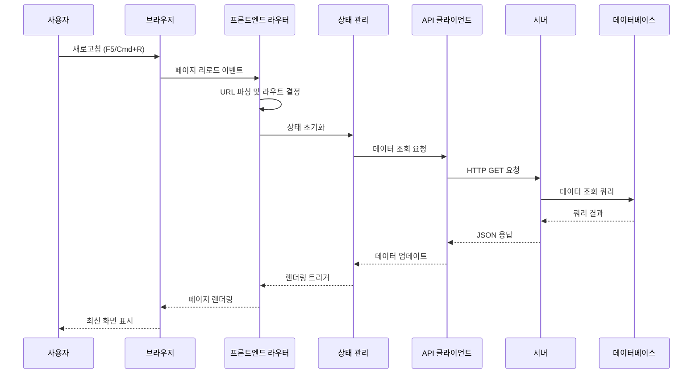

# 유스케이스: UF-009 페이지 새로고침 처리

## 유스케이스 ID: UC-009

### 제목
페이지 새로고침 및 브라우저 네비게이션 처리

---

## 1. 개요

### 1.1 목적
사용자가 브라우저의 새로고침 기능을 사용하거나 뒤로가기/앞으로가기를 통해 페이지를 재방문할 때, 각 페이지의 특성에 맞게 최신 데이터를 로드하고 적절한 초기 상태를 제공하여 일관된 사용자 경험을 보장합니다.

### 1.2 범위
- 모든 주요 페이지의 새로고침 처리 로직
- URL 파라미터 기반 데이터 복원
- 클라이언트 측 상태 초기화 및 복원
- 네트워크 오류 및 데이터 무결성 처리
- 포함되지 않는 사항:
  - 실시간 데이터 동기화 (WebSocket)
  - 브라우저 히스토리 조작
  - 오프라인 모드 지원

### 1.3 액터
- **주요 액터**: 사용자 (콘서트 관람객)
- **부 액터**:
  - 웹 브라우저
  - 서버 API
  - 데이터베이스

---

## 2. 선행 조건

- 사용자가 애플리케이션의 특정 페이지에 접근한 상태
- 브라우저가 정상적으로 작동하는 환경
- 서버 API가 정상 작동 중
- 데이터베이스 연결이 정상 상태

---

## 3. 참여 컴포넌트

- **프론트엔드 라우터**: URL 파싱 및 페이지 라우팅 담당
- **상태 관리 시스템**: 클라이언트 측 애플리케이션 상태 관리
- **세션 스토리지**: 임시 데이터 저장 (선택사항)
- **API 클라이언트**: 서버와의 HTTP 통신 담당
- **에러 핸들러**: 네트워크 및 데이터 에러 처리
- **UI 렌더러**: 페이지 및 컴포넌트 렌더링

---

## 4. 기본 플로우 (Basic Flow)

### 4.1 단계별 흐름

#### 4.1.1 홈 페이지 (`/`) 새로고침

1. **사용자**: 브라우저 새로고침 버튼 클릭 (F5, Cmd+R) 또는 뒤로가기로 홈 복귀
   - 입력: 페이지 새로고침 이벤트

2. **프론트엔드 라우터**: 현재 URL 확인 및 홈 라우트 매칭
   - 처리: URL 파싱, 라우트 핸들러 실행

3. **API 클라이언트**: 콘서트 목록 조회 API 호출
   - 처리: `GET /api/concerts` 요청 전송

4. **서버**: 현재 날짜 기준 예약 가능한 콘서트 조회
   - 처리:
     - 진행일이 현재 날짜 + 1일 이후인 콘서트 필터링
     - 각 콘서트별 좌석 현황 집계 (예약된 좌석, 남은 좌석)
     - 진행일 오름차순 정렬
   - 출력: 콘서트 목록 JSON 응답

5. **UI 렌더러**: 콘서트 목록 페이지 렌더링
   - 처리:
     - 로딩 인디케이터 표시 → 데이터 수신 → 콘서트 카드 렌더링
     - 각 카드에 제목, 일시, 장소, 예약 현황 표시
   - 출력: 최신 콘서트 목록 화면

#### 4.1.2 콘서트 상세 페이지 (`/concerts/:concertId`) 새로고침

1. **사용자**: 콘서트 상세 페이지에서 브라우저 새로고침
   - 입력: 새로고침 이벤트, URL 파라미터 `concertId`

2. **프론트엔드 라우터**: URL에서 `concertId` 추출
   - 처리: URL 파싱 → 파라미터 추출 → 라우트 핸들러 실행

3. **API 클라이언트**: 콘서트 상세 정보 조회
   - 처리: `GET /api/concerts/:concertId` 요청

4. **서버**: 콘서트 정보 및 예약 가능 여부 조회
   - 처리:
     - `concerts` 테이블에서 콘서트 정보 조회
     - `seats` 테이블에서 예약 현황 집계
     - 진행일 기준 예약 가능 기간 검증
   - 출력: 콘서트 상세 정보 + 예약 가능 좌석 수

5. **UI 렌더러**: 콘서트 상세 페이지 렌더링
   - 처리:
     - 콘서트 정보 표시 (제목, 설명, 일시, 장소, 출연진)
     - 예약 가능 좌석 수 표시
     - 예약하기 버튼 활성화/비활성화 결정
   - 출력: 최신 상태의 콘서트 상세 화면

#### 4.1.3 콘서트 예약 페이지 (`/concerts/:concertId/booking`) 새로고침

1. **사용자**: 예약 페이지에서 브라우저 새로고침
   - 입력: 새로고침 이벤트, URL 파라미터 `concertId`

2. **프론트엔드 라우터**: URL에서 `concertId` 추출
   - 처리: URL 파싱 및 라우트 핸들러 실행

3. **상태 관리 시스템**: 클라이언트 측 선택 상태 초기화
   - 처리:
     - 선택된 좌석 목록 초기화 (빈 배열)
     - 예약하기 버튼 비활성화
     - 정보입력 단계였다면 좌석 선택 단계로 복귀
   - 출력: 초기화된 애플리케이션 상태

4. **API 클라이언트**: 최신 좌석 배치도 조회
   - 처리: `GET /api/concerts/:concertId/seats` 요청

5. **서버**: 320개 좌석의 현재 상태 조회
   - 처리:
     - `seats` 테이블에서 해당 콘서트의 모든 좌석 조회
     - 구역(A,B,C,D), 행(1-20), 열(1-4), 예약 여부 반환
   - 출력: 좌석 배치도 JSON (320개 좌석 정보)

6. **세션 스토리지** (선택사항): 이전 선택 좌석 복원 시도
   - 처리:
     - 세션 스토리지에서 `selectedSeats` 확인
     - 있으면 해당 좌석이 여전히 예약 가능한지 검증
     - 가능한 좌석만 자동 선택 상태로 복원

7. **UI 렌더러**: 좌석 선택 화면 렌더링
   - 처리:
     - 4개 구역 좌석 배치도 렌더링
     - 각 좌석의 상태 시각화 (빈 좌석/예약됨/선택됨)
     - 우측 사이드바 초기화 (남은 좌석 수, 선택 목록)
   - 출력: 최신 상태의 좌석 선택 화면

#### 4.1.4 예약 완료 페이지 (`/bookings/:bookingId/complete`) 새로고침

1. **사용자**: 예약 완료 페이지에서 브라우저 새로고침
   - 입력: 새로고침 이벤트, URL 파라미터 `bookingId`

2. **프론트엔드 라우터**: URL에서 `bookingId` 추출
   - 처리: URL 파싱 및 라우트 핸들러 실행

3. **API 클라이언트**: 예약 정보 조회
   - 처리: `GET /api/bookings/:bookingId` 요청

4. **서버**: 예약 상세 정보 조회
   - 처리:
     - `bookings` 테이블에서 예약 정보 조회
     - `concerts` 테이블에서 콘서트 정보 JOIN
     - `booking_seats`, `seats` 테이블에서 좌석 정보 조회
     - 예약 상태 확인 (confirmed/cancelled)
   - 출력: 예약 상세 정보 JSON

5. **UI 렌더러**: 예약 완료 페이지 렌더링
   - 처리:
     - 예약 완료 메시지 표시
     - 콘서트 정보 표시 (제목, 일시, 장소)
     - 예약자명 표시
     - 예약된 좌석 목록 표시
     - 예약 상태에 따라 예약취소 버튼 표시/숨김
   - 출력: 최신 상태의 예약 완료 화면

#### 4.1.5 예약 조회 페이지 (`/bookings/search`) 새로고침

1. **사용자**: 예약 조회 페이지에서 브라우저 새로고침
   - 입력: 새로고침 이벤트

2. **프론트엔드 라우터**: 예약 조회 라우트 핸들러 실행
   - 처리: URL 매칭 및 페이지 초기화

3. **상태 관리 시스템**: 조회 폼 및 결과 초기화
   - 처리:
     - 입력 필드 초기화 (휴대폰번호, 비밀번호 비우기)
     - 이전 조회 결과 삭제
     - 조회 버튼 비활성화
   - 출력: 초기화된 상태

4. **UI 렌더러**: 예약 조회 폼 렌더링
   - 처리:
     - 빈 입력 필드 표시
     - 조회 버튼 (비활성화 상태)
   - 출력: 초기 예약 조회 화면

### 4.2 데이터 플로우 다이어그램



---

## 5. 대안 플로우 (Alternative Flows)

### 5.1 대안 플로우 1: 세션 스토리지를 활용한 좌석 선택 복원

**시작 조건**: 사용자가 예약 페이지에서 좌석을 선택한 후 새로고침

**단계**:
1. 프론트엔드가 좌석 선택 시마다 세션 스토리지에 `selectedSeats` 배열 저장
2. 새로고침 시 세션 스토리지에서 `selectedSeats` 읽기
3. 서버로부터 최신 좌석 상태 조회
4. 세션에 저장된 좌석 중 여전히 예약 가능한 좌석만 필터링
5. 필터링된 좌석을 자동으로 선택 상태로 복원
6. 사용자에게 복원된 선택 상태 표시

**결과**: 사용자가 이전에 선택한 좌석(예약 가능한 것만)이 복원되어 편의성 향상

### 5.2 대안 플로우 2: 예약 페이지에서 정보입력 단계 중 새로고침

**시작 조건**: 사용자가 정보입력 화면에서 새로고침

**단계**:
1. 브라우저 새로고침 이벤트 발생
2. URL은 여전히 `/concerts/:concertId/booking`
3. 클라이언트 측 단계 상태(좌석 선택/정보입력) 초기화
4. 최신 좌석 배치도 조회
5. 좌석 선택 단계로 복귀
6. 사용자가 다시 좌석을 선택해야 함

**결과**: 정보입력 단계는 유지되지 않고 좌석 선택 단계로 복귀

### 5.3 대안 플로우 3: 뒤로가기를 통한 페이지 복귀

**시작 조건**: 사용자가 브라우저 뒤로가기 버튼 클릭

**페이지별 처리**:

- **예약 완료 → 뒤로가기**:
  - 예약 페이지로 돌아가지 않도록 히스토리 조작 (선택사항)
  - 또는 홈 페이지로 리디렉션

- **정보입력 단계 → 뒤로가기**:
  - 좌석 선택 단계로 복귀
  - 세션 스토리지에 저장된 선택 좌석 복원 (선택사항)

- **좌석 선택 → 뒤로가기**:
  - 콘서트 상세 페이지로 이동
  - 선택 상태 초기화

- **콘서트 상세 → 뒤로가기**:
  - 홈 페이지로 이동

**결과**: 일관된 네비게이션 경험 제공

---

## 6. 예외 플로우 (Exception Flows)

### 6.1 예외 상황 1: 잘못된 concertId로 새로고침

**발생 조건**: 콘서트 상세 또는 예약 페이지에서 존재하지 않는 `concertId`로 새로고침

**처리 방법**:
1. 프론트엔드 라우터가 URL에서 `concertId` 추출
2. API 클라이언트가 서버에 콘서트 정보 요청
3. 서버가 데이터베이스에서 조회하지만 결과 없음
4. 서버가 404 Not Found 응답 반환
5. 프론트엔드 에러 핸들러가 404 에러 감지
6. 404 에러 페이지 렌더링:
   - "요청하신 콘서트를 찾을 수 없습니다." 메시지 표시
   - 홈으로 돌아가기 버튼 제공
7. 사용자가 버튼 클릭 시 홈 페이지로 리디렉션

**에러 코드**: `404 Not Found`

**사용자 메시지**: "요청하신 콘서트를 찾을 수 없습니다. 콘서트가 삭제되었거나 잘못된 주소입니다."

### 6.2 예외 상황 2: 잘못된 bookingId로 예약 완료 페이지 새로고침

**발생 조건**: 예약 완료 페이지에서 존재하지 않거나 유효하지 않은 `bookingId`로 새로고침

**처리 방법**:
1. 프론트엔드 라우터가 URL에서 `bookingId` 추출
2. API 클라이언트가 예약 정보 조회 요청
3. 서버가 데이터베이스에서 조회하지만 결과 없음
4. 서버가 404 Not Found 응답 반환
5. 프론트엔드 에러 핸들러가 404 에러 감지
6. 404 에러 페이지 렌더링:
   - "예약 정보를 찾을 수 없습니다." 메시지 표시
   - 예약 조회 페이지로 이동 버튼 제공
   - 홈으로 돌아가기 버튼 제공

**에러 코드**: `404 Not Found`

**사용자 메시지**: "예약 정보를 찾을 수 없습니다. 예약이 삭제되었거나 잘못된 주소입니다."

### 6.3 예외 상황 3: 예약 페이지에서 콘서트 마감된 경우

**발생 조건**: 예약 페이지 새로고침 시 콘서트 진행일이 임박하여 예약 마감

**처리 방법**:
1. 프론트엔드가 좌석 배치도 조회 요청
2. 서버가 콘서트 정보 조회
3. 서버가 예약 가능 기간 검증:
   - 현재 시간 > (진행일 - 1일)
   - 예약 마감으로 판단
4. 서버가 400 Bad Request 또는 특정 에러 코드 반환
5. 프론트엔드 에러 핸들러가 예약 마감 에러 감지
6. 예약 마감 안내 화면 렌더링:
   - "예약 기간이 종료되었습니다." 메시지 표시
   - 좌석 선택 비활성화
   - 콘서트 상세 페이지로 돌아가기 버튼
   - 홈으로 가기 버튼

**에러 코드**: `400 Bad Request` (또는 커스텀 `BOOKING_CLOSED`)

**사용자 메시지**: "예약 기간이 종료되었습니다. 이 콘서트는 더 이상 예약할 수 없습니다."

### 6.4 예외 상황 4: 네트워크 오프라인

**발생 조건**: 새로고침 시 네트워크 연결 없음

**처리 방법**:
1. 사용자가 새로고침 실행
2. API 클라이언트가 서버 요청 시도
3. 네트워크 에러 발생 (timeout, connection refused 등)
4. 프론트엔드 에러 핸들러가 네트워크 에러 감지
5. 오프라인 안내 화면 렌더링:
   - "네트워크 연결을 확인할 수 없습니다." 메시지 표시
   - 재시도 버튼 제공
   - 네트워크 연결 확인 안내
6. 사용자가 재시도 버튼 클릭 시:
   - 네트워크 상태 확인
   - 연결되면 데이터 재요청
   - 여전히 오프라인이면 에러 메시지 유지

**에러 코드**: `Network Error` (HTTP 상태 코드 없음)

**사용자 메시지**: "네트워크 연결을 확인할 수 없습니다. 인터넷 연결을 확인한 후 다시 시도해주세요."

### 6.5 예외 상황 5: 서버 에러 (500)

**발생 조건**: 새로고침 시 서버 내부 오류 발생

**처리 방법**:
1. 사용자가 새로고침 실행
2. API 클라이언트가 서버 요청
3. 서버에서 내부 오류 발생 (DB 연결 실패, 쿼리 오류 등)
4. 서버가 500 Internal Server Error 응답 반환
5. 프론트엔드 에러 핸들러가 500 에러 감지
6. 서버 에러 안내 화면 렌더링:
   - "일시적인 오류가 발생했습니다." 메시지 표시
   - 재시도 버튼 제공
   - 고객센터 안내 (선택사항)

**에러 코드**: `500 Internal Server Error`

**사용자 메시지**: "일시적인 오류가 발생했습니다. 잠시 후 다시 시도해주세요."

### 6.6 예외 상황 6: 서버 점검 중

**발생 조건**: 새로고침 시 서버가 점검 중

**처리 방법**:
1. 사용자가 새로고침 실행
2. API 클라이언트가 서버 요청
3. 서버가 503 Service Unavailable 응답 반환 (점검 모드)
4. 프론트엔드 에러 핸들러가 503 에러 감지
5. 점검 안내 페이지 렌더링:
   - "시스템 점검 중입니다." 메시지 표시
   - 점검 시간 안내 (응답 헤더에서 추출)
   - 자동 새로고침 옵션 (선택사항)

**에러 코드**: `503 Service Unavailable`

**사용자 메시지**: "시스템 점검 중입니다. 잠시 후 다시 이용해주세요."

### 6.7 예외 상황 7: 로딩 타임아웃

**발생 조건**: 새로고침 후 데이터 로딩이 일정 시간 초과

**처리 방법**:
1. 사용자가 새로고침 실행
2. API 클라이언트가 서버 요청
3. 로딩 인디케이터 표시
4. 설정된 타임아웃 시간(예: 30초) 경과
5. 타임아웃 에러 발생
6. 프론트엔드 에러 핸들러가 타임아웃 감지
7. 타임아웃 안내 화면 표시:
   - "요청 시간이 초과되었습니다." 메시지 표시
   - 재시도 버튼 제공
   - 네트워크 상태 확인 안내

**에러 코드**: `Request Timeout`

**사용자 메시지**: "요청 시간이 초과되었습니다. 네트워크 상태를 확인한 후 다시 시도해주세요."

---

## 7. 후행 조건 (Post-conditions)

### 7.1 성공 시

**데이터베이스 변경**:
- 새로고침은 읽기 전용 작업이므로 데이터베이스 변경 없음
- 단, 세션 스토리지나 브라우저 캐시에 임시 데이터 저장 가능

**시스템 상태**:
- 각 페이지가 최신 데이터로 렌더링됨
- 클라이언트 측 상태가 서버 데이터와 동기화됨
- 예약 페이지의 경우 선택 상태가 초기화되거나 복원됨
- 예약 조회 페이지의 경우 입력 폼이 초기화됨

**사용자 경험**:
- 사용자가 최신 정보를 확인할 수 있음
- 일관된 페이지 상태 제공
- 데이터 불일치 문제 방지

### 7.2 실패 시

**데이터 롤백**:
- 읽기 전용 작업이므로 롤백할 데이터 없음

**시스템 상태**:
- 에러 페이지 또는 에러 메시지 표시
- 이전 페이지 상태는 유지되지 않음
- 사용자에게 재시도 또는 대안 옵션 제공

**사용자 경험**:
- 명확한 에러 메시지로 상황 이해 지원
- 재시도 또는 다른 페이지로 이동할 수 있는 옵션 제공
- 네트워크 문제의 경우 자동 재시도 옵션 고려

---

## 8. 비기능 요구사항

### 8.1 성능

- **초기 로딩 시간**: 페이지 새로고침 후 3초 이내에 콘텐츠 표시
- **API 응답 시간**:
  - 콘서트 목록 조회: 500ms 이내
  - 콘서트 상세 조회: 300ms 이내
  - 좌석 배치도 조회: 500ms 이내 (320개 좌석)
  - 예약 정보 조회: 300ms 이내
- **로딩 인디케이터**: 200ms 이상 걸리는 요청에 대해 로딩 표시
- **캐싱 전략**:
  - 정적 자산 (CSS, JS, 이미지) 브라우저 캐싱
  - API 응답은 캐싱하지 않음 (항상 최신 데이터 보장)

### 8.2 보안

- **URL 파라미터 검증**:
  - `concertId`, `bookingId` 형식 검증 (UUID)
  - SQL Injection 방지를 위한 파라미터 이스케이핑
- **세션 스토리지 보안**:
  - 민감한 정보(비밀번호, 개인정보) 저장 금지
  - 좌석 선택 정보만 임시 저장
- **XSS 방지**:
  - 사용자 입력값 및 서버 응답 데이터 이스케이핑
  - Content Security Policy (CSP) 적용
- **HTTPS 통신**: 모든 API 요청은 HTTPS를 통해 암호화

### 8.3 가용성

- **에러 복구**:
  - 네트워크 에러 시 자동 재시도 (최대 3회)
  - 재시도 간격: 1초, 2초, 4초 (지수 백오프)
- **Graceful Degradation**:
  - 일부 데이터 로드 실패 시에도 가능한 부분은 표시
  - 예: 콘서트 정보는 로드되었으나 좌석 정보 로드 실패 시, 콘서트 정보만 표시하고 에러 메시지 추가
- **타임아웃 설정**:
  - API 요청 타임아웃: 30초
  - 타임아웃 후 재시도 옵션 제공

### 8.4 호환성

- **브라우저 지원**:
  - Chrome, Safari, Firefox, Edge 최신 2개 버전
  - History API 지원 (pushState, replaceState)
  - Session Storage API 지원
- **반응형 디자인**:
  - 모바일, 태블릿, 데스크톱 모든 화면 크기 지원
  - 터치 인터페이스 및 마우스 인터페이스 모두 지원

---

## 9. UI/UX 요구사항

### 9.1 로딩 상태 표시

**로딩 인디케이터**:
- **전체 페이지 로딩**:
  - 중앙에 스피너 또는 로딩 애니메이션
  - 배경을 약간 어둡게 처리 (선택사항)
- **부분 로딩**:
  - 해당 영역에 스켈레톤 UI 표시
  - 예: 콘서트 카드 스켈레톤, 좌석 배치도 스켈레톤

**로딩 시간별 피드백**:
- **0-200ms**: 로딩 표시 없음 (즉시 렌더링처럼 느껴짐)
- **200ms-3초**: 로딩 인디케이터 표시
- **3초 이상**:
  - "조금 더 걸릴 수 있습니다." 추가 메시지
  - 진행률 표시 (가능한 경우)

### 9.2 에러 메시지 디자인

**에러 페이지 구성 요소**:
- 에러 아이콘 (명확한 시각적 표시)
- 에러 제목 (간결하고 명확)
- 에러 설명 (사용자 친화적 언어)
- 액션 버튼 (재시도, 홈으로 가기 등)
- 추가 도움말 링크 (선택사항)

**에러 메시지 톤앤매너**:
- 기술적 용어 최소화
- 사용자에게 책임을 전가하지 않음
- 해결 방법 제시
- 예: "네트워크 연결을 확인할 수 없습니다" (O)
- 예: "당신의 인터넷이 끊겼습니다" (X)

### 9.3 페이지 전환 애니메이션

**새로고침 시 애니메이션**:
- 페이드 인 효과 (0.2-0.3초)
- 콘텐츠가 위에서 아래로 자연스럽게 나타남
- 급격한 깜빡임 방지

**뒤로가기 전환**:
- 슬라이드 애니메이션 (선택사항)
- 자연스러운 페이지 히스토리 네비게이션 느낌

### 9.4 빈 상태 처리

**데이터가 없을 때**:
- 빈 상태 일러스트레이션
- 안내 메시지: "현재 예약 가능한 콘서트가 없습니다."
- 대안 액션: "나중에 다시 확인해주세요" 또는 "알림 설정하기" (향후 확장)

### 9.5 상태 복원 피드백

**세션 스토리지 복원 시**:
- 토스트 메시지: "이전에 선택한 좌석을 복원했습니다." (2-3초 표시)
- 복원된 좌석 강조 표시 (애니메이션)

**복원 실패 시**:
- 토스트 메시지: "일부 좌석이 이미 예약되어 선택이 해제되었습니다."

---

## 10. 데이터 요구사항

### 10.1 API 엔드포인트

#### 10.1.1 콘서트 목록 조회
```
GET /api/concerts
```

**응답 예시**:
```json
{
  "concerts": [
    {
      "id": "uuid",
      "title": "BTS 콘서트",
      "event_date": "2025-12-25T19:00:00+09:00",
      "location": "서울 올림픽 공원",
      "thumbnail_url": "https://...",
      "total_seats": 320,
      "reserved_seats": 45,
      "available_seats": 275
    }
  ]
}
```

#### 10.1.2 콘서트 상세 조회
```
GET /api/concerts/:concertId
```

**응답 예시**:
```json
{
  "concert": {
    "id": "uuid",
    "title": "BTS 콘서트",
    "description": "방탄소년단 월드투어...",
    "event_date": "2025-12-25T19:00:00+09:00",
    "location": "서울 올림픽 공원",
    "thumbnail_url": "https://...",
    "available_seats": 275,
    "total_seats": 320,
    "is_bookable": true
  }
}
```

#### 10.1.3 좌석 배치도 조회
```
GET /api/concerts/:concertId/seats
```

**응답 예시**:
```json
{
  "seats": [
    {
      "id": "uuid",
      "section": "A",
      "row": 1,
      "column": 1,
      "is_reserved": false
    },
    ...
  ],
  "total_count": 320,
  "available_count": 275
}
```

#### 10.1.4 예약 정보 조회
```
GET /api/bookings/:bookingId
```

**응답 예시**:
```json
{
  "booking": {
    "id": "uuid",
    "concert": {
      "title": "BTS 콘서트",
      "event_date": "2025-12-25T19:00:00+09:00",
      "location": "서울 올림픽 공원"
    },
    "name": "홍길동",
    "seats": [
      {
        "section": "A",
        "row": 5,
        "column": 2
      }
    ],
    "status": "confirmed",
    "created_at": "2025-10-13T10:30:00+09:00"
  }
}
```

### 10.2 클라이언트 측 데이터 구조

#### 10.2.1 상태 관리 스키마

**애플리케이션 상태**:
```typescript
interface AppState {
  concerts: Concert[];
  selectedConcert: Concert | null;
  seats: Seat[];
  selectedSeats: Seat[];
  currentBooking: Booking | null;
  loading: boolean;
  error: Error | null;
}
```

**세션 스토리지 키**:
- `selectedSeats`: 선택된 좌석 ID 배열
- `bookingStep`: 현재 예약 단계 (선택사항)

### 10.3 에러 응답 형식

**표준 에러 응답**:
```json
{
  "error": {
    "code": "CONCERT_NOT_FOUND",
    "message": "요청하신 콘서트를 찾을 수 없습니다.",
    "details": {}
  }
}
```

**에러 코드 목록**:
- `CONCERT_NOT_FOUND`: 콘서트 없음 (404)
- `BOOKING_NOT_FOUND`: 예약 없음 (404)
- `BOOKING_CLOSED`: 예약 마감 (400)
- `SEAT_ALREADY_RESERVED`: 좌석 중복 예약 (409)
- `INTERNAL_SERVER_ERROR`: 서버 내부 오류 (500)
- `SERVICE_UNAVAILABLE`: 서비스 점검 중 (503)

---

## 11. 테스트 시나리오

### 11.1 성공 케이스

| 테스트 케이스 ID | 테스트 내용 | 입력값 | 기대 결과 |
|----------------|------------|--------|----------|
| TC-009-01 | 홈 페이지 새로고침 | F5 키 | 최신 콘서트 목록 표시 |
| TC-009-02 | 콘서트 상세 새로고침 | 유효한 concertId | 최신 콘서트 상세 정보 표시 |
| TC-009-03 | 예약 페이지 새로고침 | 유효한 concertId | 최신 좌석 배치도 표시, 선택 초기화 |
| TC-009-04 | 예약 완료 페이지 새로고침 | 유효한 bookingId | 최신 예약 정보 표시 |
| TC-009-05 | 예약 조회 페이지 새로고침 | 없음 | 빈 입력 폼 표시 |
| TC-009-06 | 좌석 선택 후 새로고침 (세션 복원) | 2개 좌석 선택 상태 | 예약 가능한 좌석만 복원 |
| TC-009-07 | 정보입력 단계에서 새로고침 | 정보입력 화면 | 좌석 선택 단계로 복귀 |
| TC-009-08 | 콘서트 상세에서 뒤로가기 | 브라우저 뒤로가기 | 홈 페이지로 이동 |
| TC-009-09 | 좌석 선택에서 뒤로가기 | 브라우저 뒤로가기 | 콘서트 상세로 이동 |

### 11.2 실패 케이스

| 테스트 케이스 ID | 테스트 내용 | 입력값 | 기대 결과 |
|----------------|------------|--------|----------|
| TC-009-10 | 잘못된 concertId로 새로고침 | 존재하지 않는 UUID | 404 에러 페이지, "콘서트를 찾을 수 없습니다" |
| TC-009-11 | 잘못된 bookingId로 새로고침 | 존재하지 않는 UUID | 404 에러 페이지, "예약을 찾을 수 없습니다" |
| TC-009-12 | 예약 마감된 콘서트 페이지 새로고침 | 마감된 concertId | 예약 마감 안내, 좌석 선택 비활성화 |
| TC-009-13 | 네트워크 오프라인 상태 새로고침 | 네트워크 차단 | 오프라인 안내, 재시도 버튼 |
| TC-009-14 | 서버 500 에러 발생 | 서버 오류 상황 | 서버 에러 안내, 재시도 버튼 |
| TC-009-15 | 서버 점검 중 새로고침 | 503 응답 | 점검 안내 페이지 |
| TC-009-16 | 로딩 타임아웃 | 30초 이상 응답 없음 | 타임아웃 에러 메시지, 재시도 버튼 |
| TC-009-17 | 세션 스토리지 복원 실패 | 선택 좌석이 모두 예약됨 | 토스트 메시지: "좌석이 예약되어 선택 해제됨" |

### 11.3 성능 테스트

| 테스트 케이스 ID | 테스트 내용 | 성능 목표 | 측정 방법 |
|----------------|------------|-----------|----------|
| TC-009-18 | 홈 페이지 로딩 시간 | 3초 이내 | Lighthouse, Web Vitals |
| TC-009-19 | 좌석 배치도 로딩 시간 | 500ms 이내 | Network 탭, Performance API |
| TC-009-20 | 동시 100명 새로고침 | 응답 시간 유지 | JMeter, k6 부하 테스트 |

---

## 12. 관련 유스케이스

### 12.1 선행 유스케이스
- **UC-001**: 콘서트 목록 조회 - 홈 페이지 새로고침 시 재실행
- **UC-002**: 콘서트 상세 조회 - 콘서트 상세 페이지 새로고침 시 재실행
- **UC-003**: 좌석 선택 - 예약 페이지 새로고침 시 재실행
- **UC-006**: 예약 조회 - 예약 조회 페이지 새로고침 시 초기화

### 12.2 후행 유스케이스
- **UC-005**: 예약 정보 입력 및 제출 - 새로고침 후 다시 시작 가능
- **UC-007**: 예약 취소 (예약 완료 페이지) - 새로고침 후에도 취소 가능
- **UC-008**: 예약 취소 (예약 조회 페이지) - 새로고침 후 재조회 필요

### 12.3 연관 유스케이스
- **UC-013**: 뒤로가기/앞으로가기 처리 (userflow.md 참조)
- **UC-010**: 동시성 제어 - 새로고침 시 최신 상태 반영으로 동시성 문제 해결
- **UC-011**: 브라우저 탭 간 동기화 - 수동 새로고침으로 탭 간 동기화

---

## 13. 변경 이력

| 버전 | 날짜 | 작성자 | 변경 내용 |
|------|------|--------|-----------|
| 1.0  | 2025-10-13 | Product Team | 초기 작성 |

---

## 부록

### A. 용어 정의

- **새로고침 (Refresh)**: 브라우저에서 현재 페이지를 다시 로드하는 작업 (F5, Cmd+R, 새로고침 버튼)
- **뒤로가기 (Back Navigation)**: 브라우저 히스토리에서 이전 페이지로 이동
- **세션 스토리지 (Session Storage)**: 브라우저 탭/윈도우가 열려있는 동안만 유지되는 클라이언트 측 저장소
- **로딩 인디케이터 (Loading Indicator)**: 데이터 로딩 중임을 시각적으로 표시하는 UI 요소
- **스켈레톤 UI (Skeleton UI)**: 실제 콘텐츠가 로드되기 전 표시되는 콘텐츠 구조의 회색 플레이스홀더
- **Graceful Degradation**: 일부 기능이 실패해도 가능한 부분은 정상 작동하도록 하는 설계 원칙

### B. 참고 자료

- **관련 문서**:
  - `/docs/prd.md`: 제품 요구사항 정의서
  - `/docs/userflow.md`: 유저플로우 설계서 (UF-009 섹션)
  - `/docs/database.md`: 데이터베이스 스키마 및 쿼리

- **기술 스펙**:
  - History API: https://developer.mozilla.org/en-US/docs/Web/API/History_API
  - Session Storage API: https://developer.mozilla.org/en-US/docs/Web/API/Window/sessionStorage
  - HTTP Status Codes: https://developer.mozilla.org/en-US/docs/Web/HTTP/Status

- **UX 참고**:
  - Loading Skeleton Best Practices
  - Error Message Design Guidelines
  - Web Performance Metrics (Core Web Vitals)

### C. 구현 고려사항

#### C.1 프론트엔드 프레임워크별 구현

**React 예시**:
```typescript
useEffect(() => {
  // 페이지 마운트 시 데이터 로드
  const loadData = async () => {
    try {
      const data = await fetchConcerts();
      setConcerts(data);
    } catch (error) {
      handleError(error);
    }
  };

  loadData();
}, []); // 빈 의존성 배열 = 마운트 시 1회 실행
```

**Next.js 예시 (SSR)**:
```typescript
export async function getServerSideProps(context) {
  // 서버 사이드에서 데이터 로드 (새로고침마다 실행)
  const concerts = await fetchConcerts();
  return { props: { concerts } };
}
```

#### C.2 세션 스토리지 활용

```typescript
// 좌석 선택 시 저장
const handleSeatSelect = (seat) => {
  const selected = [...selectedSeats, seat];
  setSelectedSeats(selected);
  sessionStorage.setItem('selectedSeats', JSON.stringify(selected));
};

// 페이지 로드 시 복원
useEffect(() => {
  const saved = sessionStorage.getItem('selectedSeats');
  if (saved) {
    const seats = JSON.parse(saved);
    // 서버에서 최신 상태 확인 후 복원
    restoreSeats(seats);
  }
}, []);
```

#### C.3 에러 처리 패턴

```typescript
const handleError = (error) => {
  if (error.response?.status === 404) {
    navigate('/404');
  } else if (error.response?.status === 503) {
    showMaintenancePage();
  } else if (error.code === 'NETWORK_ERROR') {
    showOfflineMessage();
  } else {
    showGenericError();
  }
};
```

#### C.4 재시도 로직

```typescript
const fetchWithRetry = async (url, options = {}, retries = 3) => {
  for (let i = 0; i < retries; i++) {
    try {
      const response = await fetch(url, options);
      return response;
    } catch (error) {
      if (i === retries - 1) throw error;
      await sleep(Math.pow(2, i) * 1000); // 지수 백오프
    }
  }
};
```

---

**문서 버전**: 1.0
**최종 수정일**: 2025-10-13
**작성자**: Product Team
**검토자**: Development Team, UX Team
