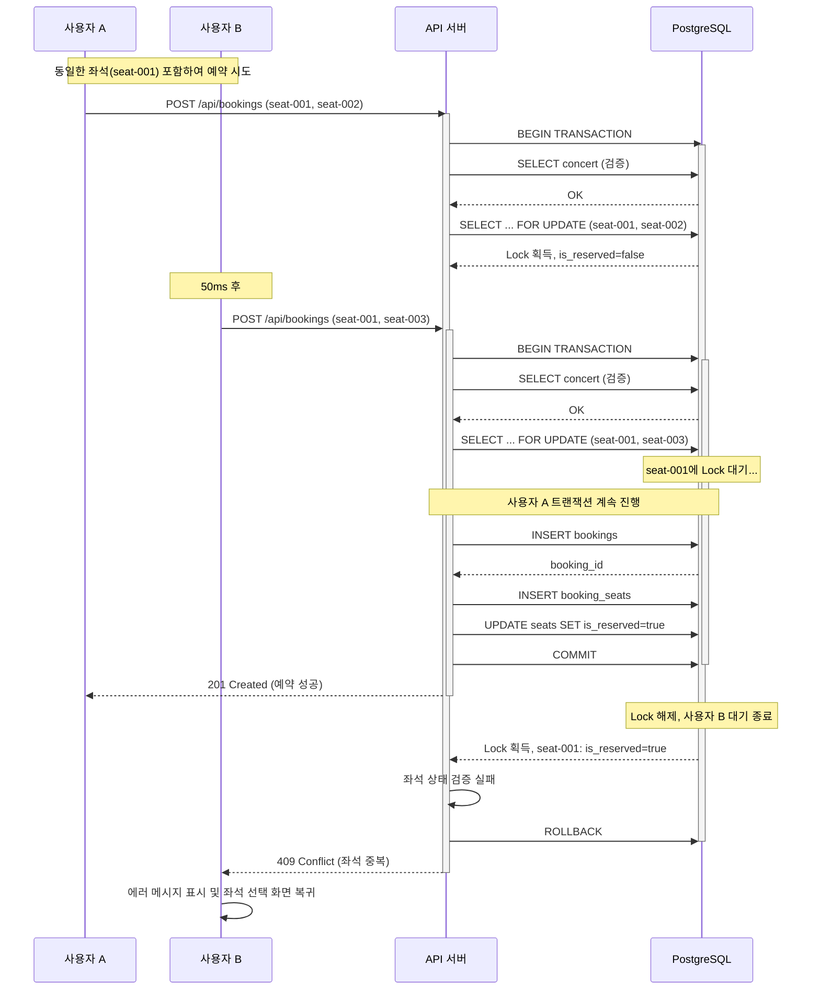

# 유스케이스 문서

## 유스케이스 ID: UC-010

### 제목
동시성 제어 (Race Condition 방지) - 좌석 예약 중복 방지

---

## 1. 개요

### 1.1 목적
여러 사용자가 동일한 좌석을 동시에 예약하려고 시도할 때 발생할 수 있는 중복 예약을 방지하고, 데이터 무결성을 보장하여 안정적인 예약 시스템을 제공한다.

### 1.2 범위
- **포함**:
  - 동시 예약 시도 시 데이터베이스 레벨 동시성 제어
  - 트랜잭션 기반 좌석 상태 검증 및 Lock 메커니즘
  - 예약 실패 시 사용자 피드백 및 재시도 플로우
  - Race Condition 발생 시 우선순위 처리 (First-Come-First-Served)

- **제외**:
  - 좌석 임시 예약(선택 시점 잠금) 기능 (향후 확장)
  - 실시간 좌석 상태 브로드캐스트 (WebSocket 등)
  - 브라우저 탭 간 동기화

### 1.3 액터
- **주요 액터**:
  - 사용자 A: 특정 좌석을 선택하고 예약을 시도하는 첫 번째 사용자
  - 사용자 B: 동일한 좌석을 거의 동시에 예약하려는 두 번째 사용자

- **부 액터**:
  - 예약 API 서버
  - PostgreSQL 데이터베이스
  - 클라이언트 애플리케이션 (웹 브라우저)

---

## 2. 선행 조건

1. 콘서트가 시스템에 등록되어 있고, 320개의 좌석이 생성되어 있어야 함
2. 예약하려는 콘서트의 진행일이 현재 날짜 기준 내일 이후여야 함
3. 사용자 A와 사용자 B가 각각 동일한 좌석을 포함한 좌석 선택을 완료한 상태
4. 사용자 A와 사용자 B가 각각 예약자 정보(이름, 휴대폰번호, 비밀번호)를 입력한 상태
5. 데이터베이스 연결이 정상적으로 동작하고 있어야 함
6. 트랜잭션 격리 수준이 최소 READ COMMITTED 이상으로 설정되어 있어야 함

---

## 3. 참여 컴포넌트

- **클라이언트 (웹 브라우저)**:
  - 사용자 입력 수신 및 예약 요청 전송
  - 서버 응답에 따른 UI 업데이트 및 에러 메시지 표시

- **API 서버 (예약 생성 엔드포인트)**:
  - 예약 요청 수신 및 검증
  - 트랜잭션 시작 및 커밋/롤백 제어
  - 동시성 제어 로직 실행

- **데이터베이스 (PostgreSQL)**:
  - Row-Level Locking (SELECT ... FOR UPDATE) 제공
  - 트랜잭션 격리 및 ACID 보장
  - 좌석 상태 저장 및 업데이트

- **예약 서비스 레이어**:
  - 비즈니스 로직 검증
  - 좌석 상태 확인 및 예약 생성 로직

- **좌석 관리 서비스**:
  - 좌석 상태 조회 및 업데이트
  - 예약-좌석 연결 레코드 생성

---

## 4. 기본 플로우 (Basic Flow)

### 4.1 단계별 흐름

#### 단계 1: 사용자 A - 예약 요청 제출 (시간: T0)
- **액터**: 사용자 A
- **액션**: 좌석 선택 완료 후 예약 정보 입력 및 제출 버튼 클릭
- **입력**:
  - concert_id: "abc-123"
  - seat_ids: ["seat-001", "seat-002"]
  - name: "홍길동"
  - phone: "01012345678"
  - password: "1234"
- **처리**:
  - 클라이언트가 POST /api/bookings 요청 전송
  - 제출 버튼 비활성화 및 로딩 인디케이터 표시
- **출력**: HTTP 요청이 서버로 전송됨

#### 단계 2: 사용자 B - 예약 요청 제출 (시간: T0 + 50ms)
- **액터**: 사용자 B
- **액션**: 동일한 좌석("seat-001", "seat-003") 포함하여 예약 제출
- **입력**:
  - concert_id: "abc-123"
  - seat_ids: ["seat-001", "seat-003"]
  - name: "김영희"
  - phone: "01098765432"
  - password: "5678"
- **처리**:
  - 클라이언트가 POST /api/bookings 요청 전송
  - 제출 버튼 비활성화 및 로딩 인디케이터 표시
- **출력**: HTTP 요청이 서버로 전송됨

#### 단계 3: API 서버 - 사용자 A 요청 처리 시작 (시간: T1)
- **액터**: API 서버
- **액션**: 트랜잭션 시작 및 초기 검증
- **처리**:
  1. 트랜잭션 시작 (BEGIN)
  2. concert_id 유효성 검증
  3. 콘서트 예약 가능 기간 확인 (진행일 전날까지)
  4. 선택된 좌석 개수 검증 (1-4개)
- **출력**: 초기 검증 완료

#### 단계 4: API 서버 - 사용자 A 좌석 Lock 획득 (시간: T2)
- **액터**: 데이터베이스
- **액션**: SELECT ... FOR UPDATE로 좌석 Row Lock 획득
- **처리**:
  ```sql
  SELECT id, is_reserved
  FROM seats
  WHERE id IN ('seat-001', 'seat-002')
    AND concert_id = 'abc-123'
  FOR UPDATE;
  ```
- **출력**:
  - seat-001: is_reserved = false (Lock 획득)
  - seat-002: is_reserved = false (Lock 획득)

#### 단계 5: API 서버 - 사용자 A 좌석 상태 검증 (시간: T3)
- **액터**: 예약 서비스
- **액션**: 모든 좌석이 예약 가능한지 확인
- **처리**:
  - is_reserved 값이 모두 false인지 확인
  - 모든 좌석이 해당 콘서트에 속하는지 확인
- **출력**: 검증 성공

#### 단계 6: API 서버 - 사용자 B 요청 처리 시작 (시간: T4)
- **액터**: API 서버 (별도 스레드/프로세스)
- **액션**: 트랜잭션 시작 및 초기 검증
- **처리**:
  1. 트랜잭션 시작 (BEGIN)
  2. concert_id 유효성 검증
  3. 콘서트 예약 가능 기간 확인
  4. 선택된 좌석 개수 검증
- **출력**: 초기 검증 완료

#### 단계 7: API 서버 - 사용자 B 좌석 Lock 대기 (시간: T5)
- **액터**: 데이터베이스
- **액션**: seat-001에 대한 Lock 획득 시도
- **처리**:
  ```sql
  SELECT id, is_reserved
  FROM seats
  WHERE id IN ('seat-001', 'seat-003')
    AND concert_id = 'abc-123'
  FOR UPDATE;
  ```
- **출력**:
  - seat-001에 대한 Lock이 이미 사용자 A의 트랜잭션에 의해 획득됨
  - **대기 상태 진입** (사용자 A의 트랜잭션이 완료될 때까지 블로킹)

#### 단계 8: API 서버 - 사용자 A 예약 생성 (시간: T6)
- **액터**: 예약 서비스
- **액션**: 예약 레코드 생성
- **처리**:
  ```sql
  INSERT INTO bookings (concert_id, name, phone, password_hash, status)
  VALUES ('abc-123', '홍길동', '01012345678', 'hashed_1234', 'confirmed')
  RETURNING id;
  -- booking_id: "booking-xyz-111" 반환
  ```
- **출력**: booking_id 생성됨

#### 단계 9: API 서버 - 사용자 A 예약-좌석 연결 생성 (시간: T7)
- **액터**: 좌석 관리 서비스
- **액션**: booking_seats 테이블에 레코드 삽입
- **처리**:
  ```sql
  INSERT INTO booking_seats (booking_id, seat_id)
  VALUES
    ('booking-xyz-111', 'seat-001'),
    ('booking-xyz-111', 'seat-002');
  ```
- **출력**: 2개의 연결 레코드 생성

#### 단계 10: API 서버 - 사용자 A 좌석 상태 업데이트 (시간: T8)
- **액터**: 좌석 관리 서비스
- **액션**: 좌석 예약 상태 변경
- **처리**:
  ```sql
  UPDATE seats
  SET is_reserved = true, updated_at = NOW()
  WHERE id IN ('seat-001', 'seat-002');
  ```
- **출력**:
  - seat-001: is_reserved = true
  - seat-002: is_reserved = true

#### 단계 11: API 서버 - 사용자 A 트랜잭션 커밋 (시간: T9)
- **액터**: 데이터베이스
- **액션**: 트랜잭션 커밋 및 Lock 해제
- **처리**:
  ```sql
  COMMIT;
  ```
- **출력**:
  - 모든 변경사항 데이터베이스에 영구 반영
  - seat-001, seat-002에 대한 Row Lock 해제
  - 사용자 B의 대기 중인 Lock 요청이 진행됨

#### 단계 12: API 서버 - 사용자 A 성공 응답 (시간: T10)
- **액터**: API 서버
- **액션**: 클라이언트에 성공 응답 전송
- **처리**:
  ```json
  HTTP 201 Created
  {
    "success": true,
    "booking_id": "booking-xyz-111",
    "message": "예약이 완료되었습니다."
  }
  ```
- **출력**: 클라이언트가 예약 완료 페이지로 리디렉션

#### 단계 13: API 서버 - 사용자 B Lock 획득 완료 (시간: T11)
- **액터**: 데이터베이스
- **액션**: Lock 대기 종료 및 Lock 획득
- **처리**:
  - 사용자 A의 트랜잭션 커밋으로 Lock이 해제됨
  - seat-001, seat-003에 대한 Lock 획득
  - 최신 is_reserved 값 조회
- **출력**:
  - seat-001: is_reserved = **true** (사용자 A가 예약함)
  - seat-003: is_reserved = false

#### 단계 14: API 서버 - 사용자 B 좌석 상태 검증 실패 (시간: T12)
- **액터**: 예약 서비스
- **액션**: 좌석 예약 가능 여부 확인
- **처리**:
  - seat-001의 is_reserved = true 확인
  - **검증 실패**: 선택한 좌석 중 일부가 이미 예약됨
- **출력**: 예약 불가 판정

#### 단계 15: API 서버 - 사용자 B 트랜잭션 롤백 (시간: T13)
- **액터**: 데이터베이스
- **액션**: 트랜잭션 롤백 및 Lock 해제
- **처리**:
  ```sql
  ROLLBACK;
  ```
- **출력**:
  - 사용자 B의 모든 변경사항 취소 (아직 변경사항 없음)
  - Lock 해제

#### 단계 16: API 서버 - 사용자 B 실패 응답 (시간: T14)
- **액터**: API 서버
- **액션**: 클라이언트에 실패 응답 전송
- **처리**:
  ```json
  HTTP 409 Conflict
  {
    "success": false,
    "error": "SEAT_ALREADY_RESERVED",
    "message": "선택하신 좌석 중 일부가 이미 예약되었습니다.",
    "unavailable_seats": ["seat-001"]
  }
  ```
- **출력**: 클라이언트가 에러 메시지 수신

#### 단계 17: 클라이언트 - 사용자 B 에러 처리 (시간: T15)
- **액터**: 클라이언트 (사용자 B)
- **액션**: 에러 메시지 표시 및 좌석 선택 단계로 복귀
- **처리**:
  1. Alert 또는 모달로 에러 메시지 표시
  2. 좌석 선택 화면으로 리디렉션
  3. 최신 좌석 배치도 재조회 (seat-001이 예약됨으로 표시)
  4. 로딩 인디케이터 제거 및 제출 버튼 재활성화
- **출력**: 사용자 B는 다른 좌석을 선택하여 재시도 가능

### 4.2 시퀀스 다이어그램



---

## 5. 대안 플로우 (Alternative Flows)

### 5.1 대안 플로우 1: 두 사용자가 완전히 다른 좌석 선택

**시작 조건**: 기본 플로우의 단계 1-2에서 사용자 A와 B가 겹치는 좌석 없이 예약 시도

**단계**:
1. 사용자 A: seat-001, seat-002 예약 시도
2. 사용자 B: seat-003, seat-004 예약 시도
3. API 서버: 두 트랜잭션이 독립적으로 진행 (Lock 충돌 없음)
4. 데이터베이스: 각각 다른 Row에 Lock을 획득하므로 대기 없이 진행
5. 결과: 두 사용자 모두 예약 성공

**결과**:
- 사용자 A: HTTP 201 Created, 예약 완료
- 사용자 B: HTTP 201 Created, 예약 완료
- 4개 좌석 모두 예약됨 상태로 변경

### 5.2 대안 플로우 2: 사용자 A 트랜잭션 실패 시 사용자 B 성공

**시작 조건**: 사용자 A의 예약 처리 중 다른 이유로 트랜잭션 실패 (예: 네트워크 오류)

**단계**:
1. 사용자 A: 좌석 Lock 획득 및 예약 처리 시작
2. 사용자 B: Lock 대기 상태
3. 사용자 A: 예약 생성 중 네트워크 오류 발생
4. API 서버: 사용자 A 트랜잭션 ROLLBACK
5. 데이터베이스: Lock 해제, 좌석 상태 is_reserved=false 유지
6. 사용자 B: Lock 획득 및 좌석 상태 확인 (is_reserved=false)
7. 사용자 B: 예약 정상 진행

**결과**:
- 사용자 A: HTTP 500 Internal Server Error, 예약 실패
- 사용자 B: HTTP 201 Created, 예약 성공
- 좌석은 사용자 B에게 예약됨

### 5.3 대안 플로우 3: Lock 타임아웃 발생

**시작 조건**: 사용자 A의 트랜잭션이 비정상적으로 오래 실행되는 경우

**단계**:
1. 사용자 A: Lock 획득 후 장시간 트랜잭션 실행 (예: 네트워크 지연)
2. 사용자 B: Lock 대기 시작
3. 데이터베이스: Lock 대기 시간이 lock_timeout 설정값 초과 (예: 10초)
4. 데이터베이스: 사용자 B 트랜잭션에 타임아웃 에러 발생
5. API 서버: 타임아웃 에러 캐치 및 롤백

**결과**:
- 사용자 A: 트랜잭션 계속 진행 (영향 없음)
- 사용자 B: HTTP 504 Gateway Timeout, "서버 응답 시간 초과. 잠시 후 다시 시도해주세요."
- 클라이언트: 재시도 버튼 제공

---

## 6. 예외 플로우 (Exception Flows)

### 6.1 예외 상황 1: 데드락 (Deadlock) 발생

**발생 조건**:
- 사용자 A: seat-001, seat-002 순서로 Lock 시도
- 사용자 B: seat-002, seat-001 순서로 Lock 시도
- 각자 첫 번째 좌석 Lock 획득 후 두 번째 좌석 Lock 대기

**처리 방법**:
1. PostgreSQL 데드락 감지기가 자동으로 감지 (일반적으로 1초 이내)
2. 데이터베이스가 한 트랜잭션을 희생자로 선택하여 강제 롤백
3. API 서버가 데드락 에러 캐치 (40P01 에러 코드)
4. 자동 재시도 로직 실행 (최대 3회, exponential backoff)
5. 재시도 실패 시 사용자에게 에러 응답

**에러 코드**: `DEADLOCK_DETECTED` (HTTP 503)

**사용자 메시지**: "일시적인 서버 오류가 발생했습니다. 자동으로 재시도 중입니다..."

**예방 조치**:
- 좌석 ID를 항상 정렬된 순서로 Lock 획득 (ORDER BY id)
- 트랜잭션 실행 시간 최소화

### 6.2 예외 상황 2: 트랜잭션 타임아웃

**발생 조건**:
- 네트워크 지연, 데이터베이스 부하 등으로 트랜잭션 실행 시간 초과
- statement_timeout 또는 transaction_timeout 설정값 초과

**처리 방법**:
1. 데이터베이스가 타임아웃 에러 발생
2. 자동으로 트랜잭션 롤백
3. API 서버가 타임아웃 에러 캐치
4. 클라이언트에 타임아웃 응답 전송

**에러 코드**: `TRANSACTION_TIMEOUT` (HTTP 504)

**사용자 메시지**: "서버 응답 시간이 초과되었습니다. 잠시 후 다시 시도해주세요."

### 6.3 예외 상황 3: 데이터베이스 연결 실패

**발생 조건**:
- 데이터베이스 서버 다운
- 커넥션 풀 고갈
- 네트워크 장애

**처리 방법**:
1. API 서버가 데이터베이스 연결 실패 감지
2. 즉시 에러 응답 (예약 시도하지 않음)
3. 로깅 및 모니터링 시스템에 알림
4. 자동 헬스체크로 복구 대기

**에러 코드**: `DATABASE_UNAVAILABLE` (HTTP 503)

**사용자 메시지**: "일시적으로 서비스를 이용할 수 없습니다. 잠시 후 다시 시도해주세요."

### 6.4 예외 상황 4: 콘서트 예약 마감 (동시 검증)

**발생 조건**:
- 사용자 A와 B가 예약 시도하는 동안 콘서트 진행일이 도래하여 예약 마감

**처리 방법**:
1. 트랜잭션 내부에서 콘서트 예약 가능 여부 재검증
2. event_date <= NOW() + INTERVAL '1 day' 조건 확인
3. 조건 위배 시 트랜잭션 롤백
4. 예약 마감 응답 전송

**에러 코드**: `BOOKING_CLOSED` (HTTP 400)

**사용자 메시지**: "예약 기간이 종료되었습니다."

### 6.5 예외 상황 5: 선택한 좌석 수 초과

**발생 조건**:
- 클라이언트 측 검증을 우회하여 5개 이상의 좌석 예약 시도

**처리 방법**:
1. API 서버에서 seat_ids 배열 길이 검증 (1-4개)
2. 조건 위배 시 즉시 400 에러 응답
3. 트랜잭션 시작하지 않음

**에러 코드**: `INVALID_SEAT_COUNT` (HTTP 400)

**사용자 메시지**: "좌석은 최대 4개까지 선택할 수 있습니다."

### 6.6 예외 상황 6: 존재하지 않는 좌석 ID

**발생 조건**:
- 유효하지 않은 seat_id 전송
- 다른 콘서트의 좌석 ID 전송

**처리 방법**:
1. SELECT ... FOR UPDATE 쿼리 결과 개수 확인
2. 요청한 좌석 개수와 조회된 좌석 개수 불일치 시 롤백
3. 에러 응답 전송

**에러 코드**: `INVALID_SEAT_ID` (HTTP 400)

**사용자 메시지**: "유효하지 않은 좌석 정보입니다. 페이지를 새로고침 후 다시 시도해주세요."

---

## 7. 후행 조건 (Post-conditions)

### 7.1 성공 시 (사용자 A)

**데이터베이스 변경**:
- `bookings` 테이블:
  - 새로운 예약 레코드 1건 생성
  - status = 'confirmed'
- `booking_seats` 테이블:
  - 예약-좌석 연결 레코드 N건 생성 (N = 선택한 좌석 수)
- `seats` 테이블:
  - 예약된 좌석들의 is_reserved = true로 변경
  - updated_at 타임스탬프 갱신

**시스템 상태**:
- 예약된 좌석은 다른 사용자에게 표시되지 않음 (예약됨 상태)
- 해당 콘서트의 available_seats 카운트 감소
- 트랜잭션 로그 기록

**외부 시스템**:
- (향후 확장) 예약 확인 SMS/이메일 발송 트리거
- (향후 확장) 분석 시스템에 예약 이벤트 전송

### 7.2 실패 시 (사용자 B)

**데이터 롤백**:
- 트랜잭션 내 모든 변경사항 취소
- bookings, booking_seats 테이블에 레코드 생성되지 않음
- seats 테이블 상태 변경 없음

**시스템 상태**:
- 예약 실패 로그 기록 (모니터링용)
- 실패 사유 명시 (SEAT_ALREADY_RESERVED)
- 클라이언트 세션 상태 유지 (입력한 정보 보존 가능)

**사용자 경험**:
- 에러 메시지를 통해 실패 사유 인지
- 최신 좌석 배치도로 갱신되어 다른 좌석 선택 가능
- 입력했던 예약자 정보는 유지됨 (선택사항)

---

## 8. 비기능 요구사항

### 8.1 성능

**응답 시간**:
- Lock 충돌이 없는 경우: 평균 500ms 이내 예약 완료
- Lock 대기가 발생한 경우: 평균 1-3초 이내 예약 완료 또는 실패 응답
- Lock 대기 최대 시간: 10초 (lock_timeout 설정)

**동시 처리 능력**:
- 최소 100명의 동시 예약 요청 처리 가능
- 데이터베이스 커넥션 풀: 최소 50개 연결 유지
- Row-Level Lock을 사용하여 서로 다른 좌석에 대한 예약은 병렬 처리

**처리량**:
- 초당 최소 50개의 예약 트랜잭션 처리 (TPS)
- 동일 좌석에 대한 경쟁 상황에서도 안정적인 처리

### 8.2 보안

**데이터 무결성**:
- ACID 트랜잭션 보장으로 중복 예약 완전 차단
- Unique 제약 조건으로 데이터베이스 레벨 이중 보호
- SQL Injection 방지 (Parameterized Query 사용)

**인증 및 권한**:
- API 요청 검증 (필수 필드 확인)
- 비밀번호 해싱 (bcrypt)
- 휴대폰번호 암호화 저장 (선택사항)

**감사 추적**:
- 모든 예약 시도 로깅 (성공/실패 여부 포함)
- 동시성 충돌 발생 시 상세 로그 기록
- 트랜잭션 ID 및 타임스탬프 기록

### 8.3 가용성

**시스템 가동률**:
- 예약 시스템 가동률: 99.5% 이상
- 데이터베이스 복제를 통한 고가용성 (선택사항)

**장애 복구**:
- 트랜잭션 실패 시 자동 롤백으로 데이터 일관성 유지
- 데드락 발생 시 자동 재시도 (최대 3회)
- 데이터베이스 연결 실패 시 자동 재연결 시도

**모니터링**:
- Lock 대기 시간 모니터링 (평균, 최대값)
- 데드락 발생 빈도 추적
- 예약 실패율 모니터링 (목표: 5% 이하)

### 8.4 확장성

**수평 확장**:
- API 서버 무상태(stateless) 설계로 쉬운 스케일 아웃
- 로드 밸런서를 통한 트래픽 분산

**수직 확장**:
- 데이터베이스 성능 향상 시 자동으로 동시성 처리 능력 증가
- 인덱스 최적화로 Lock 대기 시간 최소화

---

## 9. UI/UX 요구사항

### 9.1 화면 구성

**예약 진행 중 (Loading State)**:
- 제출 버튼 비활성화
- 로딩 스피너 또는 프로그레스 바 표시
- 배경 반투명 오버레이로 추가 조작 방지
- 예상 대기 시간 표시 (선택사항): "예약 처리 중입니다... (약 2-3초 소요)"

**예약 실패 시 (Error State)**:
- 명확한 에러 메시지 표시 (Alert 또는 모달)
- 에러 메시지 예시:
  - "선택하신 좌석 중 일부가 이미 예약되었습니다."
  - "다른 좌석을 선택해주세요."
- 확인 버튼 클릭 시 좌석 선택 화면으로 자동 이동
- 최신 좌석 배치도 자동 갱신

**좌석 선택 화면 복귀 시**:
- 이전에 예약된 좌석은 "예약됨" 상태로 표시 (비활성화)
- 예약 가능한 좌석만 선택 가능 상태로 표시
- 사용자가 입력했던 예약자 정보는 브라우저 세션에 임시 저장 (선택사항)

### 9.2 사용자 경험

**투명한 피드백**:
- 예약 처리 중임을 명확히 표시
- 실패 이유를 사용자 친화적인 언어로 설명
- 다음 액션(재시도) 가이드 제공

**재시도 편의성**:
- 예약 실패 시 입력했던 정보는 유지 (이름, 휴대폰번호, 비밀번호)
- 좌석 선택만 다시 하면 되도록 UX 설계
- 자동으로 최신 좌석 현황 반영

**예약 성공 시**:
- 즉시 예약 완료 페이지로 이동
- 예약 번호 및 상세 정보 표시
- 예약 확인 메시지 명확히 표시

**에러 처리 원칙**:
- 사용자 책임이 아닌 시스템 문제임을 명시
- 재시도 유도 (긍정적 톤)
- 고객센터 연락처 제공 (반복 실패 시)

---

## 10. 데이터 요구사항

### 10.1 입력 데이터

**예약 요청 (Request Body)**:
```json
{
  "concert_id": "string (UUID)",
  "seat_ids": ["string (UUID)", "..."],
  "name": "string (2-50자)",
  "phone": "string (10-11자리 숫자)",
  "password": "string (4자리 숫자)"
}
```

**검증 규칙**:
- concert_id: 유효한 UUID 형식, 존재하는 콘서트
- seat_ids: 1-4개의 유효한 UUID 배열, 중복 없음
- name: 공백 제거 후 2-50자, 특수문자 제한
- phone: 숫자만, 10-11자리
- password: 정확히 4자리 숫자

### 10.2 데이터베이스 스키마

**seats 테이블 (동시성 제어 핵심 테이블)**:
```sql
CREATE TABLE seats (
  id UUID PRIMARY KEY DEFAULT gen_random_uuid(),
  concert_id UUID NOT NULL REFERENCES concerts(id),
  section CHAR(1) NOT NULL CHECK (section IN ('A', 'B', 'C', 'D')),
  row INTEGER NOT NULL CHECK (row >= 1 AND row <= 20),
  seat_column INTEGER NOT NULL CHECK (seat_column >= 1 AND seat_column <= 4),
  is_reserved BOOLEAN NOT NULL DEFAULT FALSE,
  created_at TIMESTAMPTZ NOT NULL DEFAULT NOW(),
  updated_at TIMESTAMPTZ NOT NULL DEFAULT NOW()
);

-- 동시성 제어를 위한 인덱스
CREATE INDEX idx_seats_concert_reserved ON seats(concert_id, is_reserved);
CREATE UNIQUE INDEX idx_seats_unique_position
  ON seats(concert_id, section, row, seat_column);
```

**bookings 테이블**:
```sql
CREATE TABLE bookings (
  id UUID PRIMARY KEY DEFAULT gen_random_uuid(),
  concert_id UUID NOT NULL REFERENCES concerts(id),
  name VARCHAR(100) NOT NULL,
  phone VARCHAR(20) NOT NULL,
  password_hash VARCHAR(255) NOT NULL,
  status VARCHAR(20) NOT NULL DEFAULT 'confirmed'
    CHECK (status IN ('confirmed', 'cancelled')),
  created_at TIMESTAMPTZ NOT NULL DEFAULT NOW(),
  updated_at TIMESTAMPTZ NOT NULL DEFAULT NOW()
);
```

**booking_seats 테이블 (연결 테이블)**:
```sql
CREATE TABLE booking_seats (
  id UUID PRIMARY KEY DEFAULT gen_random_uuid(),
  booking_id UUID NOT NULL REFERENCES bookings(id) ON DELETE CASCADE,
  seat_id UUID NOT NULL REFERENCES seats(id) ON DELETE RESTRICT,
  created_at TIMESTAMPTZ NOT NULL DEFAULT NOW(),
  UNIQUE (booking_id, seat_id)
);
```

### 10.3 출력 데이터

**예약 성공 응답**:
```json
{
  "success": true,
  "booking_id": "abc-123-def-456",
  "message": "예약이 완료되었습니다.",
  "booking_details": {
    "concert_title": "BTS 콘서트",
    "event_date": "2025-12-25T19:00:00+09:00",
    "seats": [
      {"section": "A", "row": 5, "seat_column": 3},
      {"section": "A", "row": 5, "seat_column": 4}
    ],
    "name": "홍길동",
    "created_at": "2025-10-13T14:30:00+09:00"
  }
}
```

**예약 실패 응답 (좌석 중복)**:
```json
{
  "success": false,
  "error": "SEAT_ALREADY_RESERVED",
  "message": "선택하신 좌석 중 일부가 이미 예약되었습니다.",
  "unavailable_seats": [
    {"section": "A", "row": 5, "seat_column": 3}
  ]
}
```

### 10.4 데이터 흐름 요약

```
[사용자 A 입력] → [API 서버] → [트랜잭션 시작]
                                    ↓
                          [Lock 획득: seat-001, 002]
                                    ↓
                          [상태 검증: is_reserved=false]
                                    ↓
                          [bookings INSERT]
                                    ↓
                          [booking_seats INSERT]
                                    ↓
                          [seats UPDATE: is_reserved=true]
                                    ↓
                          [COMMIT & Lock 해제]
                                    ↓
                          [사용자 A 성공 응답]

[사용자 B 입력] → [API 서버] → [트랜잭션 시작]
                                    ↓
                          [Lock 대기: seat-001]
                                    ↓
                          (사용자 A COMMIT 후)
                                    ↓
                          [Lock 획득: seat-001, 003]
                                    ↓
                          [상태 검증: seat-001 is_reserved=true]
                                    ↓
                          [검증 실패]
                                    ↓
                          [ROLLBACK & Lock 해제]
                                    ↓
                          [사용자 B 실패 응답]
```

---

## 11. 테스트 시나리오

### 11.1 성공 케이스

| 테스트 케이스 ID | 시나리오 | 입력값 | 기대 결과 |
|----------------|---------|--------|----------|
| TC-010-01 | 두 사용자가 완전히 다른 좌석 예약 | 사용자 A: [seat-001, 002]<br>사용자 B: [seat-003, 004] | 두 사용자 모두 HTTP 201, 예약 성공 |
| TC-010-02 | 순차 예약 (충돌 없음) | 사용자 A 예약 완료 후<br>사용자 B 예약 시도 | 사용자 B도 예약 성공 (다른 좌석) |
| TC-010-03 | 동시 예약 - 선착순 처리 | 동일 좌석 포함하여 동시 요청 | 먼저 Lock 획득한 사용자 성공,<br>나중 사용자 409 Conflict |

### 11.2 실패 케이스

| 테스트 케이스 ID | 시나리오 | 입력값 | 기대 결과 |
|----------------|---------|--------|----------|
| TC-010-11 | 좌석 중복 예약 시도 | 동일 좌석 [seat-001]을<br>두 사용자가 동시 예약 | 한 명은 성공, 한 명은 409 Conflict<br>"SEAT_ALREADY_RESERVED" |
| TC-010-12 | 트랜잭션 타임아웃 | Lock 대기 10초 초과 | HTTP 504, "서버 응답 시간 초과" |
| TC-010-13 | 데드락 발생 | 사용자 A: [1, 2]<br>사용자 B: [2, 1]<br>(반대 순서 Lock) | 자동 재시도 후 한 명 성공,<br>다른 한 명 재시도 후 409 |
| TC-010-14 | 예약 기간 종료 중 예약 시도 | 콘서트 진행일 전날 23:59:59 경계 | HTTP 400, "예약 기간이 종료되었습니다" |
| TC-010-15 | 존재하지 않는 좌석 ID | invalid_seat_id | HTTP 400, "유효하지 않은 좌석 정보" |
| TC-010-16 | 다른 콘서트의 좌석 ID | concert_A의 요청에<br>concert_B의 seat_id | HTTP 400, "유효하지 않은 좌석 정보" |

### 11.3 성능 테스트

| 테스트 케이스 ID | 시나리오 | 목표 | 검증 방법 |
|----------------|---------|------|---------|
| TC-010-21 | 100명 동시 예약 부하 테스트 | TPS 50 이상 유지 | JMeter/k6로 동시 요청 전송,<br>성공률 95% 이상 |
| TC-010-22 | Lock 대기 시간 측정 | 평균 1-3초 이내 | 동일 좌석 10회 연속 충돌 테스트,<br>대기 시간 로깅 |
| TC-010-23 | 데드락 재시도 성공률 | 재시도 후 90% 이상 성공 | 의도적 데드락 발생 시나리오,<br>최종 예약 성공 확인 |

### 11.4 통합 테스트

| 테스트 케이스 ID | 시나리오 | 기대 결과 |
|----------------|---------|----------|
| TC-010-31 | End-to-End 동시 예약 플로우 | 좌석 선택 → 정보 입력 → 제출 → 충돌 → 에러 메시지 → 좌석 재선택 → 성공 |
| TC-010-32 | 예약 성공 후 좌석 배치도 갱신 확인 | 예약된 좌석이 다른 사용자에게 "예약됨"으로 표시 |
| TC-010-33 | 예약 취소 후 동시 재예약 | 취소된 좌석을 두 사용자가 동시 예약, 선착순 성공 |

---

## 12. 관련 유스케이스

### 선행 유스케이스
- **UC-001**: 콘서트 목록 조회 - 예약 가능한 콘서트 확인
- **UC-002**: 콘서트 상세 조회 - 예약할 콘서트 정보 확인
- **UC-003**: 좌석 선택 - 예약할 좌석 선택 완료

### 후행 유스케이스
- **UC-004**: 예약 완료 페이지 표시 - 예약 성공 시 이동
- **UC-005**: 예약 조회 - 예약한 내역 확인
- **UC-006**: 예약 취소 - 예약 취소 후 좌석 복원

### 연관 유스케이스
- **UC-007**: 좌석 선택 해제 - 예약 실패 후 재선택 시 필요
- **UC-008**: 페이지 새로고침 처리 - 최신 좌석 상태 갱신
- **UC-009**: 예약 정보 입력 검증 - 예약 요청 전 클라이언트 검증

---

## 13. 구현 시 고려사항

### 13.1 데이터베이스 설정

**PostgreSQL 설정 권장값**:
```sql
-- 트랜잭션 격리 수준 (기본값 사용)
SET default_transaction_isolation = 'read committed';

-- Lock 타임아웃 설정
SET lock_timeout = '10s';

-- Statement 타임아웃
SET statement_timeout = '15s';

-- Deadlock 타임아웃 (자동 감지)
SET deadlock_timeout = '1s';
```

### 13.2 API 서버 구현

**트랜잭션 처리 예시 (Pseudo-code)**:
```javascript
async function createBooking(concertId, seatIds, bookingData) {
  const client = await db.getClient();

  try {
    await client.query('BEGIN');

    // 1. 콘서트 검증
    const concert = await client.query(
      'SELECT id, event_date FROM concerts WHERE id = $1 FOR UPDATE',
      [concertId]
    );
    if (!concert || concert.event_date <= Date.now() + 1 day) {
      throw new BookingClosedError();
    }

    // 2. 좌석 Lock 획득 및 상태 확인 (정렬된 순서로)
    const seats = await client.query(
      'SELECT id, is_reserved FROM seats ' +
      'WHERE id = ANY($1) AND concert_id = $2 ' +
      'ORDER BY id FOR UPDATE',
      [seatIds.sort(), concertId]
    );

    if (seats.length !== seatIds.length) {
      throw new InvalidSeatError();
    }

    if (seats.some(seat => seat.is_reserved)) {
      throw new SeatAlreadyReservedError();
    }

    // 3. 예약 생성
    const booking = await client.query(
      'INSERT INTO bookings (concert_id, name, phone, password_hash) ' +
      'VALUES ($1, $2, $3, $4) RETURNING id',
      [concertId, bookingData.name, bookingData.phone, hashPassword(bookingData.password)]
    );

    // 4. 예약-좌석 연결
    await client.query(
      'INSERT INTO booking_seats (booking_id, seat_id) ' +
      'SELECT $1, unnest($2::uuid[])',
      [booking.id, seatIds]
    );

    // 5. 좌석 상태 업데이트
    await client.query(
      'UPDATE seats SET is_reserved = true, updated_at = NOW() ' +
      'WHERE id = ANY($1)',
      [seatIds]
    );

    await client.query('COMMIT');
    return { success: true, bookingId: booking.id };

  } catch (error) {
    await client.query('ROLLBACK');

    if (error.code === '40P01') { // Deadlock
      // 재시도 로직
      return retryCreateBooking(...);
    }

    throw error;
  } finally {
    client.release();
  }
}
```

### 13.3 모니터링 및 알림

**추적 지표**:
- Lock 대기 시간 분포 (p50, p95, p99)
- 예약 실패율 (좌석 중복)
- 데드락 발생 빈도
- 트랜잭션 타임아웃 발생 빈도
- 동시 요청 수 및 TPS

**알림 임계값**:
- Lock 대기 시간 p95 > 5초
- 예약 실패율 > 10%
- 데드락 발생 > 분당 10회
- TPS < 30 (피크 시간대)

---

## 14. 변경 이력

| 버전 | 날짜 | 작성자 | 변경 내용 |
|------|------|--------|-----------|
| 1.0  | 2025-10-13 | Product Team | 초기 작성 - UF-010 동시성 제어 유스케이스 문서화 |

---

## 부록

### A. 용어 정의

- **Race Condition**: 두 개 이상의 프로세스가 공유 자원에 동시 접근할 때 실행 순서에 따라 결과가 달라지는 상황
- **Row-Level Locking**: 데이터베이스에서 특정 행(Row)에 대한 배타적 접근 권한을 획득하는 메커니즘
- **SELECT ... FOR UPDATE**: PostgreSQL에서 Row Lock을 획득하는 SQL 구문
- **Deadlock**: 두 개 이상의 트랜잭션이 서로의 Lock을 기다리며 무한 대기하는 상황
- **ACID**: 트랜잭션의 네 가지 속성 (Atomicity, Consistency, Isolation, Durability)
- **READ COMMITTED**: 트랜잭션 격리 수준 중 하나로, 커밋된 데이터만 읽을 수 있음

### B. 참고 자료

- **관련 문서**:
  - `/docs/prd.md`: 콘서트 예약 플랫폼 PRD
  - `/docs/userflow.md`: UF-010 동시성 제어 원본 사용자 플로우
  - `/docs/database.md`: 데이터베이스 스키마 및 동시성 제어 전략

- **PostgreSQL 공식 문서**:
  - [Row-Level Locking](https://www.postgresql.org/docs/current/explicit-locking.html#LOCKING-ROWS)
  - [Transaction Isolation](https://www.postgresql.org/docs/current/transaction-iso.html)
  - [Deadlock Detection](https://www.postgresql.org/docs/current/explicit-locking.html#LOCKING-DEADLOCKS)

- **외부 참고**:
  - Martin Kleppmann, "Designing Data-Intensive Applications" - Chapter 7: Transactions
  - PostgreSQL Performance Tuning Guide
