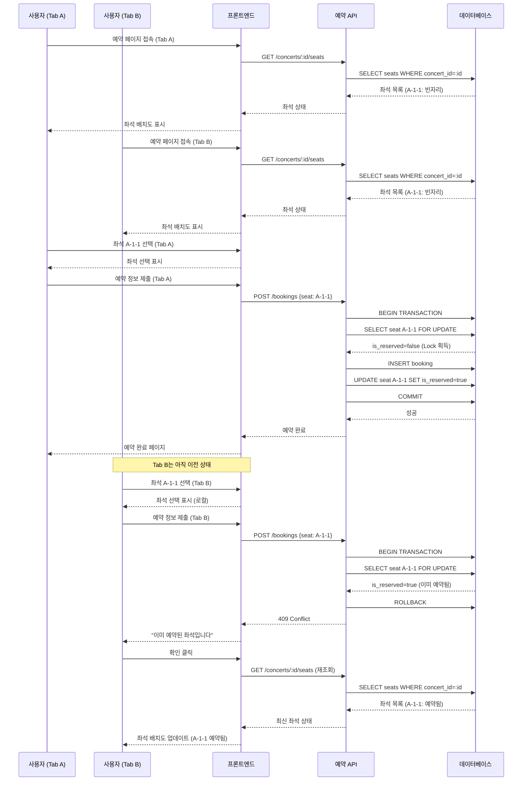

# 유스케이스 문서: UC-011

## 제목
브라우저 탭 간 좌석 상태 동기화

---

## 1. 개요

### 1.1 목적
동일한 콘서트 예약 페이지를 여러 브라우저 탭에서 열어둔 사용자가 한 탭에서 좌석을 예약하거나 좌석 상태가 변경되었을 때, 다른 탭에서도 이를 인지하고 적절한 사용자 경험을 제공하는 것을 목표로 합니다. 이를 통해 사용자가 이미 예약된 좌석을 선택하려는 시도를 최소화하고, 시스템의 일관성을 유지합니다.

### 1.2 범위
- **포함 사항**:
  - 동일 사용자가 여러 탭에서 동일한 콘서트 예약 페이지에 접속한 상황 처리
  - 한 탭에서의 예약 시도 시 서버 측 최신 상태 검증
  - 사용자 수동 새로고침을 통한 최신 상태 확인
  - (선택사항) 실시간 자동 동기화 구현 방안

- **제외 사항**:
  - 서로 다른 사용자 간의 실시간 동기화 (별도 고려)
  - 모바일 앱과 웹 간의 동기화
  - 서로 다른 디바이스 간의 동기화

### 1.3 액터
- **주요 액터**: 콘서트 예약을 시도하는 일반 사용자
- **부 액터**:
  - 예약 서비스 (백엔드 API)
  - 데이터베이스 (좌석 상태 관리)
  - (선택사항) WebSocket/SSE 서버 (실시간 동기화 구현 시)

---

## 2. 선행 조건

- 사용자가 동일한 브라우저에서 동일한 콘서트 예약 페이지를 여러 탭으로 열어둔 상태
- 각 탭은 URL `/concerts/:concertId/booking` 에 접속된 상태
- 해당 콘서트가 예약 가능한 상태 (진행일 전날까지)
- 데이터베이스에 해당 콘서트의 좌석 정보가 존재

---

## 3. 참여 컴포넌트

- **프론트엔드 (예약 페이지 컴포넌트)**: 좌석 배치도 렌더링, 좌석 선택 관리, 사용자 인터랙션 처리
- **상태 관리 시스템**: 선택된 좌석 정보 로컬 상태 관리
- **세션 스토리지**: 탭별 독립적인 선택 좌석 정보 저장
- **API 서비스**: 좌석 조회, 예약 제출, 좌석 상태 검증
- **데이터베이스**: 좌석 상태의 단일 진실 공급원 (Single Source of Truth)
- **(선택사항) 실시간 동기화 서비스**: WebSocket 또는 Server-Sent Events를 통한 브로드캐스트

---

## 4. 기본 플로우 (Basic Flow) - 실시간 동기화 없는 버전

### 4.1 단계별 흐름

1. **사용자**: 첫 번째 탭(Tab A)에서 콘서트 예약 페이지 접속
   - 입력: `concertId`
   - 처리: 서버에 좌석 배치도 조회 요청 전송
   - 출력: 320개 좌석의 현재 상태 렌더링 (빈자리/예약됨)

2. **사용자**: 두 번째 탭(Tab B)을 열고 동일한 콘서트 예약 페이지 접속
   - 입력: 동일한 `concertId`
   - 처리: 서버에 독립적으로 좌석 배치도 조회 요청 전송
   - 출력: 현재 시점의 좌석 상태 렌더링

3. **시스템**: 각 탭은 독립적인 상태 관리
   - 처리: Tab A와 Tab B는 각각 로컬 스토리지 또는 세션 스토리지를 사용하여 선택된 좌석 정보 관리
   - 출력: 각 탭에서 독립적으로 좌석 선택 가능

4. **사용자**: Tab A에서 좌석 A-1-1 선택
   - 입력: 좌석 클릭 (section: A, row: 1, column: 1)
   - 처리: 클라이언트 측 상태 업데이트 (좌석을 선택된 상태로 변경)
   - 출력: Tab A에서 좌석 A-1-1이 시각적으로 선택됨 표시

5. **사용자**: Tab A에서 예약자 정보 입력 및 제출
   - 입력: 예약자명, 휴대폰번호, 비밀번호 4자리
   - 처리:
     - 서버에 예약 요청 전송
     - 서버는 트랜잭션 시작
     - 해당 좌석에 Row Lock 획득 (`SELECT ... FOR UPDATE`)
     - 좌석 상태 재검증 (is_reserved = false 확인)
     - 예약 레코드 생성
     - 좌석 상태를 예약됨으로 업데이트 (is_reserved = true)
     - 트랜잭션 커밋
   - 출력: 예약 성공, 예약 완료 페이지로 리디렉션

6. **시스템**: Tab B는 아직 이전 상태 유지
   - 처리: Tab B는 여전히 좌석 A-1-1을 빈자리로 표시 (로컬 상태 미동기화)
   - 출력: Tab B에서 좌석 A-1-1은 여전히 선택 가능한 것처럼 보임

7. **사용자**: Tab B에서 동일한 좌석 A-1-1 선택 시도
   - 입력: 좌석 A-1-1 클릭
   - 처리: 클라이언트 측 상태 업데이트 (Tab B 로컬에서는 선택됨)
   - 출력: Tab B에서 좌석 A-1-1이 선택된 것처럼 표시

8. **사용자**: Tab B에서 예약자 정보 입력 및 제출
   - 입력: 예약자명, 휴대폰번호, 비밀번호 4자리
   - 처리:
     - 서버에 예약 요청 전송
     - 서버는 트랜잭션 시작
     - 해당 좌석에 Row Lock 시도
     - 좌석 상태 재검증
     - **검증 실패**: is_reserved = true (이미 예약됨)
     - 트랜잭션 롤백
   - 출력: 예약 실패 응답 (HTTP 409 Conflict)

9. **시스템**: Tab B에 예약 실패 메시지 표시
   - 처리: 에러 응답 수신, 사용자에게 알림
   - 출력:
     - Alert 또는 모달: "이미 예약된 좌석입니다."
     - 좌석 선택 단계로 복귀
     - 좌석 배치도 최신 상태로 재조회
     - 좌석 A-1-1이 예약됨으로 표시

10. **사용자**: Tab B에서 다른 빈 좌석 선택 및 재시도
    - 입력: 다른 빈 좌석 선택
    - 처리: 예약 프로세스 재진행
    - 출력: 예약 성공 또는 실패

### 4.2 시퀀스 다이어그램



---

## 5. 대안 플로우 (Alternative Flows)

### 5.1 대안 플로우 1: 사용자 수동 새로고침

**시작 조건**: 사용자가 Tab B에서 좌석 선택 전, 화면의 정보가 오래되었다고 느낌

**단계**:
1. 사용자가 Tab B에서 브라우저 새로고침 (F5 또는 Cmd+R) 실행
2. 프론트엔드는 페이지 재로드
3. 서버에 최신 좌석 상태 재조회 요청
4. 최신 좌석 배치도 렌더링 (A-1-1은 이미 예약됨으로 표시)
5. 사용자는 다른 빈 좌석 선택 가능

**결과**: Tab B가 최신 상태로 동기화됨

### 5.2 대안 플로우 2: 사용자가 중복 좌석 선택 전 뒤로가기

**시작 조건**: Tab B에서 정보입력 단계까지 진행

**단계**:
1. 사용자가 예약 제출 전 뒤로가기 버튼 클릭
2. 좌석 선택 단계로 복귀
3. 시스템은 선택된 좌석 정보를 세션 스토리지에서 복원
4. 사용자가 다시 예약하기 버튼 클릭 시, 서버 재검증 수행

**결과**: 서버 재검증 단계에서 중복 예약 방지

---

## 6. 예외 플로우 (Exception Flows)

### 6.1 예외 상황 1: 좌석 중복 예약 시도

**발생 조건**: Tab B에서 Tab A가 이미 예약한 좌석을 제출

**처리 방법**:
1. 서버는 좌석 상태 재검증 중 is_reserved=true 확인
2. 트랜잭션 롤백
3. HTTP 409 Conflict 응답 전송
4. 프론트엔드는 에러 응답 수신
5. 사용자에게 Alert 또는 모달로 "이미 예약된 좌석입니다." 메시지 표시
6. 좌석 선택 단계로 자동 복귀
7. 최신 좌석 배치도 재조회 및 렌더링

**에러 코드**: `SEAT_ALREADY_RESERVED` (HTTP 409)

**사용자 메시지**: "선택하신 좌석 중 일부가 이미 예약되었습니다. 다른 좌석을 선택해주세요."

### 6.2 예외 상황 2: 네트워크 타임아웃

**발생 조건**: Tab B에서 예약 제출 시 네트워크 지연 또는 타임아웃

**처리 방법**:
1. 프론트엔드는 타임아웃 에러 수신
2. 사용자에게 "네트워크 연결이 불안정합니다. 다시 시도해주세요." 메시지 표시
3. 재시도 버튼 제공
4. 사용자가 재시도 시, 서버에서 좌석 상태 재검증 수행

**에러 코드**: `NETWORK_TIMEOUT` (브라우저 레벨)

**사용자 메시지**: "네트워크 연결이 불안정합니다. 다시 시도해주세요."

### 6.3 예외 상황 3: 여러 좌석 중 일부만 중복

**발생 조건**: 사용자가 3개 좌석 선택, 그 중 1개가 다른 탭에서 이미 예약됨

**처리 방법**:
1. 서버는 선택된 좌석 목록을 순회하며 각 좌석 상태 검증
2. 하나라도 is_reserved=true인 경우 전체 예약 실패
3. 트랜잭션 롤백
4. 어떤 좌석이 중복인지 응답에 포함 (선택사항)
5. 사용자에게 "선택하신 좌석 중 일부가 이미 예약되었습니다." 메시지 표시
6. 좌석 선택 화면으로 복귀, 이전 선택된 좌석 중 예약 가능한 것만 자동 재선택 (선택사항)

**에러 코드**: `PARTIAL_SEAT_CONFLICT` (HTTP 409)

**사용자 메시지**: "선택하신 좌석 중 일부가 이미 예약되었습니다. 좌석을 다시 선택해주세요."

### 6.4 예외 상황 4: 콘서트 예약 기간 종료

**발생 조건**: Tab이 오래 열려있어 예약 기간이 종료됨 (진행일 전날 자정 지남)

**처리 방법**:
1. 서버는 예약 요청 시 콘서트 event_date 재검증
2. event_date가 현재 날짜보다 1일 이내인 경우 예약 불가
3. HTTP 400 Bad Request 응답
4. 프론트엔드는 "예약 기간이 종료되었습니다." 메시지 표시
5. 예약하기 버튼 비활성화
6. 홈으로 돌아가기 버튼 제공

**에러 코드**: `BOOKING_PERIOD_EXPIRED` (HTTP 400)

**사용자 메시지**: "예약 기간이 종료되었습니다. 다른 콘서트를 확인해주세요."

### 6.5 예외 상황 5: 데이터베이스 Lock 타임아웃

**발생 조건**: 동시에 많은 사용자가 동일한 좌석에 접근, Lock 대기 시간 초과

**처리 방법**:
1. 데이터베이스 Lock 타임아웃 발생 (PostgreSQL: lock_timeout)
2. 서버는 예외를 캐치하고 트랜잭션 롤백
3. HTTP 503 Service Unavailable 응답
4. "일시적으로 요청이 많습니다. 잠시 후 다시 시도해주세요." 메시지 표시
5. 재시도 버튼 제공

**에러 코드**: `DATABASE_LOCK_TIMEOUT` (HTTP 503)

**사용자 메시지**: "일시적으로 요청이 많습니다. 잠시 후 다시 시도해주세요."

---

## 7. 후행 조건 (Post-conditions)

### 7.1 성공 시

- **데이터베이스 변경**:
  - `bookings` 테이블에 새로운 예약 레코드 1개 생성 (status='confirmed')
  - `seats` 테이블의 해당 좌석 is_reserved=true로 업데이트
  - `booking_seats` 테이블에 예약-좌석 연결 레코드 생성

- **시스템 상태**:
  - Tab A: 예약 완료 페이지로 리디렉션, 세션 스토리지의 선택 좌석 정보 삭제
  - Tab B: (재시도 후) 다른 좌석으로 예약 성공 또는 페이지 종료

- **외부 시스템**: 해당 없음 (현재 버전)

### 7.2 실패 시

- **데이터 롤백**:
  - 트랜잭션 롤백으로 데이터베이스 변경사항 없음
  - 좌석 상태는 이전 상태 유지

- **시스템 상태**:
  - 실패한 탭은 좌석 선택 단계로 복귀
  - 최신 좌석 배치도를 서버에서 재조회
  - 사용자가 입력한 예약자 정보는 유지 (선택사항)

---

## 8. 비기능 요구사항

### 8.1 성능
- **좌석 상태 조회 응답 시간**: 500ms 이내
- **예약 제출 처리 시간**: 2초 이내 (트랜잭션 완료 포함)
- **데이터베이스 Lock 대기 시간**: 최대 5초 (lock_timeout 설정)
- **동시 예약 처리 능력**: 최소 100명의 동시 사용자가 동일한 콘서트에 접근 가능

### 8.2 보안
- **비밀번호 해싱**: bcrypt 알고리즘 사용, salt rounds 10 이상
- **SQL Injection 방지**: 파라미터화된 쿼리 사용
- **CSRF 방지**: CSRF 토큰 검증
- **데이터 암호화**: 휴대폰번호 암호화 저장 (선택사항)

### 8.3 가용성
- **시스템 가동률**: 99% 이상
- **트랜잭션 원자성**: ACID 보장으로 데이터 일관성 유지
- **Race Condition 방지**: Row-level Locking으로 100% 중복 예약 방지
- **복구 시간 목표 (RTO)**: 30분 이내

### 8.4 확장성
- **수평 확장**: 읽기 전용 복제본 추가로 조회 성능 향상 가능
- **캐싱 전략**: 콘서트 기본 정보는 캐싱 가능 (좌석 상태는 캐싱 불가)

---

## 9. UI/UX 요구사항

### 9.1 화면 구성

**좌석 선택 화면**:
- 좌석 배치도 (4개 구역, 각 4x20 그리드)
- 좌석 상태 시각적 구분:
  - 빈 좌석: 흰색 또는 회색 테두리
  - 예약된 좌석: 어두운 회색, 비활성화 상태
  - 선택된 좌석: 파란색 또는 강조 색상
- 우측 사이드바:
  - 남은 좌석 수
  - 선택된 좌석 목록 (구역-행-열)
  - 각 좌석별 X 아이콘 (선택 해제)
  - 예약하기 버튼

**에러 표시**:
- 모달 또는 Alert:
  - 제목: "예약 실패"
  - 메시지: "이미 예약된 좌석입니다."
  - 확인 버튼
- 토스트 알림 (선택사항):
  - 화면 상단 또는 하단에 3초간 표시
  - 자동 닫힘

### 9.2 사용자 경험

**예약 실패 시**:
1. 명확한 에러 메시지로 실패 이유 전달
2. 자동으로 좌석 선택 화면으로 복귀
3. 최신 좌석 배치도 자동 갱신 (로딩 인디케이터 표시)
4. 이전에 입력한 예약자 정보는 유지 (재입력 불필요)
5. 다른 빈 좌석을 쉽게 선택할 수 있도록 시각적 가이드

**로딩 상태**:
- 예약 제출 버튼 클릭 시 즉시 비활성화
- 로딩 스피너 또는 인디케이터 표시
- 중복 클릭 방지

**접근성**:
- 키보드 내비게이션 지원
- 스크린 리더 호환
- 색상만으로 정보를 전달하지 않음 (아이콘, 텍스트 병행)

---

## 10. 데이터 요구사항

### 10.1 입력 데이터

**좌석 상태 조회 요청**:
```json
{
  "concertId": "uuid"
}
```

**예약 생성 요청**:
```json
{
  "concertId": "uuid",
  "seatIds": ["uuid1", "uuid2"],
  "name": "홍길동",
  "phone": "01012345678",
  "password": "1234"
}
```

### 10.2 출력 데이터

**좌석 상태 조회 응답**:
```json
{
  "concertId": "uuid",
  "seats": [
    {
      "id": "uuid",
      "section": "A",
      "row": 1,
      "column": 1,
      "isReserved": false
    },
    ...
  ]
}
```

**예약 성공 응답**:
```json
{
  "bookingId": "uuid",
  "status": "confirmed",
  "message": "예약이 완료되었습니다."
}
```

**예약 실패 응답 (좌석 중복)**:
```json
{
  "error": "SEAT_ALREADY_RESERVED",
  "message": "선택하신 좌석 중 일부가 이미 예약되었습니다.",
  "conflictSeats": [
    {
      "section": "A",
      "row": 1,
      "column": 1
    }
  ]
}
```

### 10.3 데이터베이스 스키마 관련

**관련 테이블**:
- `concerts`: 콘서트 정보
- `seats`: 좌석 정보 (is_reserved 컬럼 중요)
- `bookings`: 예약 정보
- `booking_seats`: 예약-좌석 연결

**주요 쿼리**:
```sql
-- 좌석 상태 조회
SELECT id, section, row, column, is_reserved
FROM seats
WHERE concert_id = :concert_id
ORDER BY section, row, column;

-- 예약 생성 시 좌석 상태 검증 (Lock)
SELECT id, is_reserved
FROM seats
WHERE id = ANY(:seat_ids)
  AND concert_id = :concert_id
FOR UPDATE;

-- 좌석 상태 업데이트
UPDATE seats
SET is_reserved = true, updated_at = NOW()
WHERE id = ANY(:seat_ids);
```

---

## 11. 테스트 시나리오

### 11.1 성공 케이스

| 테스트 케이스 ID | 시나리오 | 기대 결과 |
|----------------|---------|----------|
| TC-011-01 | Tab A에서 좌석 예약 후, Tab B에서 다른 좌석 예약 | 두 예약 모두 성공 |
| TC-011-02 | Tab B에서 수동 새로고침 후 좌석 선택 | 최신 좌석 상태 반영됨 |
| TC-011-03 | 여러 탭에서 서로 다른 좌석 동시 예약 | 모든 탭에서 각각 예약 성공 |

### 11.2 실패 케이스

| 테스트 케이스 ID | 시나리오 | 기대 결과 |
|----------------|---------|----------|
| TC-011-04 | Tab A에서 좌석 예약 후, Tab B에서 동일 좌석 예약 시도 | Tab B에서 409 에러, "이미 예약된 좌석" 메시지 표시 |
| TC-011-05 | 3개 좌석 선택, 그 중 1개가 다른 탭에서 예약됨 | 전체 예약 실패, 좌석 선택 화면 복귀 |
| TC-011-06 | 동시에 여러 탭에서 동일 좌석 제출 (Race Condition) | 한 탭만 성공, 나머지 탭은 실패 |
| TC-011-07 | 예약 기간 종료 후 오래 열린 탭에서 예약 시도 | "예약 기간 종료" 에러 메시지 |
| TC-011-08 | 네트워크 타임아웃 발생 | 타임아웃 메시지, 재시도 버튼 제공 |

### 11.3 경계값 테스트

| 테스트 케이스 ID | 시나리오 | 기대 결과 |
|----------------|---------|----------|
| TC-011-09 | 10개 탭에서 동시에 서로 다른 좌석 예약 | 모든 예약 성공 (성능 테스트) |
| TC-011-10 | 마지막 남은 1개 좌석을 여러 탭에서 동시 시도 | 한 탭만 성공, 나머지 실패 |

---

## 12. 실시간 동기화 구현 방안 (선택사항)

### 12.1 WebSocket을 이용한 실시간 동기화

**개요**:
WebSocket 연결을 통해 좌석 상태 변경 이벤트를 실시간으로 모든 연결된 클라이언트에 브로드캐스트합니다.

**아키텍처**:
```
[Client Tab A] ─┐
[Client Tab B] ─┼─ WebSocket ─ [WebSocket Server] ─ [Database]
[Client Tab C] ─┘
```

**구현 단계**:

1. **WebSocket 서버 설정**:
   - Node.js에서 `ws` 또는 `socket.io` 라이브러리 사용
   - 클라이언트 연결 시 `concertId`를 room으로 관리

2. **클라이언트 연결**:
   ```javascript
   const socket = io('wss://server.com');
   socket.emit('join-concert', { concertId: 'xxx' });
   ```

3. **좌석 상태 변경 이벤트 브로드캐스트**:
   - 예약 성공 시 서버에서 WebSocket으로 이벤트 발행
   ```javascript
   // 서버 측
   io.to(concertId).emit('seat-reserved', {
     seatIds: ['uuid1', 'uuid2'],
     timestamp: new Date()
   });
   ```

4. **클라이언트 수신 및 UI 업데이트**:
   ```javascript
   socket.on('seat-reserved', (data) => {
     // 해당 좌석을 예약됨 상태로 업데이트
     updateSeatStatus(data.seatIds, 'reserved');
   });
   ```

**장점**:
- 실시간 동기화로 UX 향상
- 사용자가 이미 예약된 좌석 선택 시도 최소화
- 서버 재조회 요청 감소

**단점**:
- 서버 리소스 추가 소요 (연결 유지)
- 구현 복잡도 증가
- 네트워크 연결 불안정 시 예외 처리 필요

### 12.2 Server-Sent Events (SSE)를 이용한 단방향 동기화

**개요**:
서버에서 클라이언트로 단방향 이벤트 스트림을 전송합니다.

**장점**:
- WebSocket보다 구현 간단
- HTTP 프로토콜 사용으로 방화벽 문제 적음
- 자동 재연결 지원

**단점**:
- 단방향 통신만 가능
- 브라우저 호환성 (IE 미지원)

### 12.3 구현 우선순위

**Phase 1 (현재)**:
- 실시간 동기화 없음
- 서버 측 검증으로 중복 예약 방지
- 사용자 수동 새로고침 지원

**Phase 2 (향후)**:
- WebSocket 또는 SSE 기반 실시간 동기화 구현
- 좌석 상태 변경 시 모든 연결된 클라이언트에 브로드캐스트
- 네트워크 불안정 시에도 서버 검증으로 최종 보장

---

## 13. 관련 유스케이스

- **선행 유스케이스**:
  - UC-003: 좌석 선택
  - UC-005: 예약 정보 입력 및 제출

- **후행 유스케이스**:
  - UC-009: 페이지 새로고침 처리

- **연관 유스케이스**:
  - UC-010: 동시성 제어 (Race Condition)
  - UC-013: 뒤로가기/앞으로가기 처리

---

## 14. 변경 이력

| 버전 | 날짜 | 작성자 | 변경 내용 |
|------|------|--------|-----------|
| 1.0  | 2025-10-13 | Product Team | 초기 작성 |

---

## 부록

### A. 용어 정의

- **탭 (Tab)**: 브라우저의 개별 탭 또는 윈도우
- **동기화 (Synchronization)**: 여러 탭 간 데이터 상태를 일치시키는 것
- **Row-level Locking**: 데이터베이스에서 특정 행에 대한 잠금을 획득하여 동시성 제어
- **Race Condition**: 여러 프로세스가 동시에 동일한 자원에 접근하여 예상치 못한 결과가 발생하는 상황
- **트랜잭션 (Transaction)**: 데이터베이스의 상태를 변화시키는 하나의 논리적 작업 단위
- **WebSocket**: 서버와 클라이언트 간 양방향 실시간 통신을 위한 프로토콜
- **SSE (Server-Sent Events)**: 서버에서 클라이언트로 단방향 이벤트 스트림을 전송하는 기술

### B. 참고 자료

- **PRD**: `/docs/prd.md`
- **User Flow 설계서**: `/docs/userflow.md` - UF-011 섹션
- **데이터베이스 설계**: `/docs/database.md` - 동시성 제어 섹션
- **관련 API 명세**: (향후 추가)
- **WebSocket 구현 가이드**: (향후 추가)

### C. 추가 고려사항

#### C.1 브라우저 저장소 활용

**Local Storage vs Session Storage**:
- Local Storage: 탭 간 공유됨, 브라우저 종료 후에도 유지
- Session Storage: 탭별로 독립, 탭 종료 시 삭제

**권장 사항**:
- 선택된 좌석 정보는 Session Storage 사용 (탭별 독립)
- 콘서트 기본 정보는 Local Storage 캐싱 가능

#### C.2 Broadcast Channel API (고급)

브라우저의 Broadcast Channel API를 사용하여 동일 출처의 탭 간 메시지 전송 가능:

```javascript
// 채널 생성
const channel = new BroadcastChannel('seat-updates');

// Tab A에서 메시지 발행
channel.postMessage({ action: 'seat-reserved', seatId: 'xxx' });

// Tab B에서 메시지 수신
channel.onmessage = (event) => {
  console.log('Received:', event.data);
  updateSeatUI(event.data.seatId);
};
```

**장점**:
- 서버 리소스 불필요
- 동일 사용자의 탭 간 즉시 동기화

**단점**:
- 동일 브라우저, 동일 사용자만 가능
- 서로 다른 사용자 간 동기화 불가
- 브라우저 호환성 확인 필요

#### C.3 성능 모니터링

실시간 동기화 구현 시 모니터링 지표:
- 활성 WebSocket 연결 수
- 메시지 발행/수신 지연 시간
- 연결 해제 및 재연결 빈도
- 서버 CPU/메모리 사용률

---

**문서 버전**: 1.0
**최종 수정일**: 2025-10-13
**작성자**: Product Team
**검토자**: Development Team, QA Team
