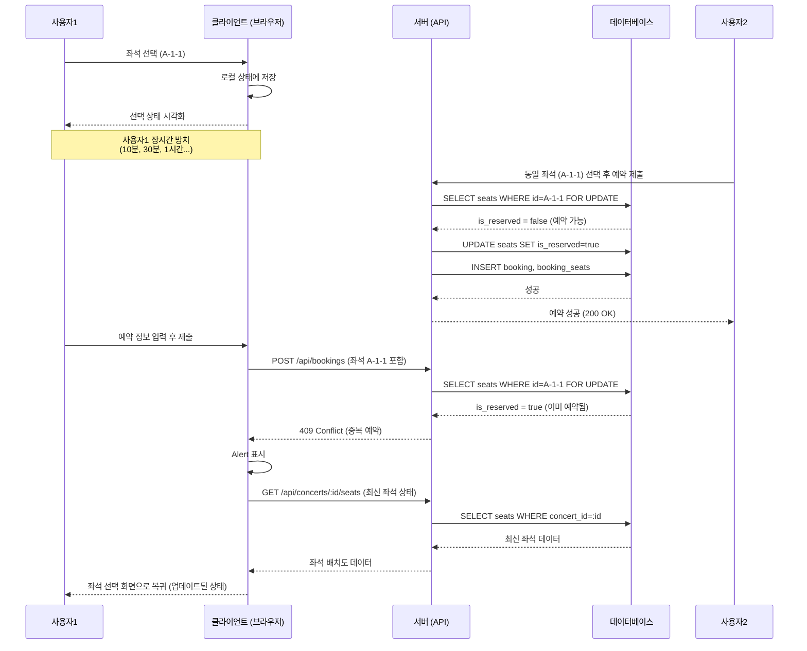
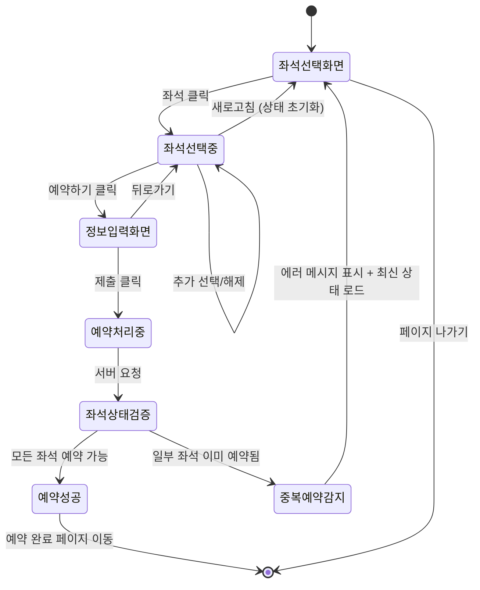
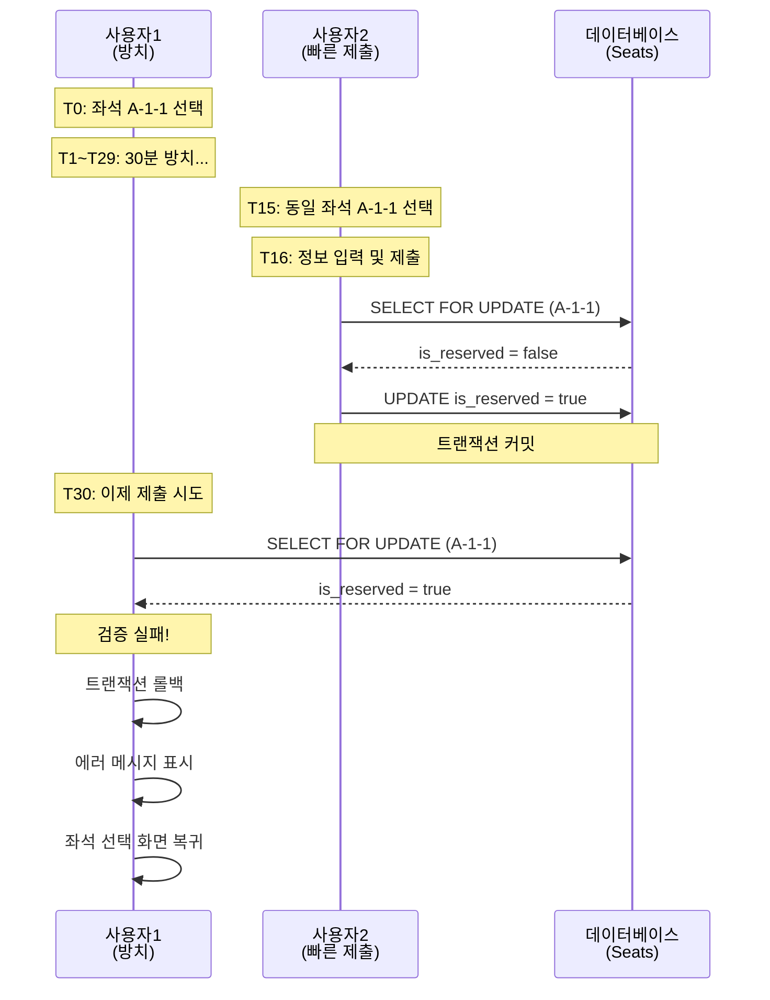

# 유스케이스: 세션 타임아웃 처리

## 유스케이스 ID: UC-012

### 제목
좌석 선택 후 장시간 방치 시 세션 타임아웃 처리

---

## 1. 개요

### 1.1 목적
사용자가 좌석 선택 후 장시간 예약 정보를 입력하지 않고 방치하는 경우, 다른 사용자들이 해당 좌석을 예약할 수 있도록 하여 좌석 점유 문제를 방지하고 예약 시스템의 공정성과 효율성을 보장합니다.

### 1.2 범위
- **포함 사항**:
  - 콘서트 예약 페이지에서의 좌석 선택 세션 관리
  - 선택된 좌석의 클라이언트 측 상태 관리
  - 장시간 방치 시 사용자 안내
  - 페이지 새로고침 시 선택 상태 초기화

- **제외 사항**:
  - 서버 측 좌석 임시 예약 메커니즘 (향후 Phase 2에서 구현 고려)
  - 좌석 타이머 기반 임시 예약 시스템
  - 실시간 좌석 동기화 (WebSocket/SSE)
  - 사용자 세션 인증 (비로그인 시스템)

### 1.3 액터
- **주요 액터**: 콘서트 예약 시도 중인 사용자
- **부 액터**:
  - 동일한 좌석을 선택하려는 다른 사용자들
  - 브라우저 세션 관리 시스템

---

## 2. 선행 조건

- 사용자가 콘서트 예약 페이지(`/concerts/:concertId/booking`)에 접속한 상태
- 좌석 배치도가 정상적으로 로드된 상태
- 하나 이상의 좌석이 선택된 상태 (1-4개)
- 사용자의 브라우저가 정상적으로 작동 중
- 네트워크 연결 상태가 정상

---

## 3. 참여 컴포넌트

- **클라이언트 사이드**:
  - 좌석 선택 UI 컴포넌트: 좌석 배치도 렌더링 및 선택 상태 관리
  - 세션 스토리지: 선택된 좌석 임시 저장 (선택사항)
  - 브라우저 탭/윈도우: 사용자 세션 환경

- **서버 사이드**:
  - 좌석 상태 API: 최신 좌석 예약 상태 제공
  - 데이터베이스 (seats 테이블): 실제 좌석 예약 상태 저장

- **외부 시스템**:
  - 없음 (현재 구현 기준)

---

## 4. 기본 플로우 (Basic Flow)

### 4.1 단계별 흐름

#### 현재 구현 방식 (선택만으로는 상태 변경 없음)

1. **사용자**: 콘서트 예약 페이지에서 좌석 선택
   - 입력: 좌석 클릭 이벤트 (구역, 행, 열)
   - 처리: 클라이언트 측 상태에만 선택 정보 저장
   - 출력: 선택된 좌석 시각적 표시, 우측 사이드바에 좌석 정보 표시

2. **시스템**: 선택된 좌석 정보를 로컬 상태로만 관리
   - 입력: 선택된 좌석 ID 배열
   - 처리:
     - 컴포넌트 상태(React State 등)에 저장
     - 선택적으로 sessionStorage에 저장 (페이지 새로고침 대비)
   - 출력: 메모리 상의 선택 상태 유지

3. **사용자**: 장시간 페이지 방치
   - 입력: 없음 (비활성 상태)
   - 처리: 선택된 좌석은 클라이언트에서만 유지, 서버에는 영향 없음
   - 출력: 좌석 선택 UI 상태 유지

4. **다른 사용자**: 동일한 좌석 선택 및 예약 시도
   - 입력: 동일한 좌석 선택 후 예약 정보 입력 및 제출
   - 처리: 서버에서 좌석 상태 확인 (is_reserved = false)
   - 출력: 예약 가능 (첫 번째 사용자가 선택만 하고 제출하지 않았으므로)

5. **첫 번째 사용자**: 늦게 예약 정보 입력 후 제출 시도
   - 입력: 예약자명, 휴대폰번호, 비밀번호 입력 후 제출
   - 처리:
     - 서버에서 선택된 좌석들의 현재 상태 재검증
     - 다른 사용자가 이미 예약한 좌석 발견 (is_reserved = true)
   - 출력:
     - 예약 실패 응답 (409 Conflict)
     - 에러 메시지: "이미 예약된 좌석입니다."

6. **시스템**: 사용자를 좌석 선택 화면으로 복귀
   - 입력: 서버로부터의 실패 응답
   - 처리:
     - Alert 또는 모달로 에러 메시지 표시
     - 좌석 배치도 최신 상태로 재조회
     - 이전 선택 정보 초기화
   - 출력:
     - 업데이트된 좌석 배치도 표시
     - 선택 목록 비워짐
     - 사용자가 다른 좌석 선택 가능

### 4.2 시퀀스 다이어그램



---

## 5. 대안 플로우 (Alternative Flows)

### 5.1 대안 플로우 1: 페이지 새로고침으로 세션 초기화

**시작 조건**: 사용자가 좌석을 선택한 상태에서 브라우저 새로고침 (F5, Cmd+R)

**단계**:
1. 사용자가 새로고침 버튼 클릭 또는 키보드 단축키 입력
2. 브라우저가 페이지 전체 리로드
3. 컴포넌트 상태 초기화
4. sessionStorage 확인:
   - **sessionStorage에 선택 정보가 저장된 경우** (선택사항):
     - 저장된 좌석 ID 배열 로드
     - 서버에 해당 좌석들의 현재 상태 확인 요청
     - 여전히 예약 가능한 좌석만 자동 재선택
   - **sessionStorage에 정보가 없거나 사용하지 않는 경우**:
     - 선택 상태 완전 초기화
5. 최신 좌석 배치도 렌더링

**결과**:
- 기본: 모든 선택 상태 초기화, 사용자가 처음부터 다시 선택
- 선택적 구현: 이전 선택 복원 시도 (여전히 예약 가능한 경우만)

### 5.2 대안 플로우 2: 브라우저 탭 닫기 후 재접속

**시작 조건**: 사용자가 좌석 선택 후 브라우저 탭을 닫고, 나중에 다시 예약 페이지에 접속

**단계**:
1. 사용자가 브라우저 탭 닫기 (세션 종료)
2. 클라이언트 측 상태 모두 소멸
3. sessionStorage 데이터도 삭제 (탭 닫기 시)
4. 나중에 사용자가 다시 예약 페이지 접속
5. 완전히 새로운 세션으로 시작
6. 빈 선택 상태로 좌석 배치도 표시

**결과**: 모든 이전 선택 정보 소실, 처음부터 다시 시작

### 5.3 대안 플로우 3: 정보입력 단계에서 뒤로가기

**시작 조건**: 사용자가 좌석 선택 후 정보입력 단계로 진행했다가 뒤로가기 버튼 클릭

**단계**:
1. 사용자가 정보입력 화면에서 뒤로가기 버튼 클릭
2. 시스템이 좌석 선택 단계로 화면 전환
3. 선택된 좌석 정보 유지 (sessionStorage 또는 컴포넌트 상태)
4. 좌석 배치도 렌더링
5. 이전에 선택했던 좌석들이 여전히 선택된 상태로 표시

**결과**:
- 선택 상태 유지
- 사용자가 좌석을 재선택하거나 수정 가능
- 예약하기 버튼 활성화 상태 유지

---

## 6. 예외 플로우 (Exception Flows)

### 6.1 예외 상황 1: 여러 좌석 중 일부만 중복 예약

**발생 조건**:
- 사용자가 4개의 좌석을 선택 (A-1-1, A-1-2, A-1-3, A-1-4)
- 장시간 방치하는 동안 다른 사용자가 그 중 2개만 예약 (A-1-1, A-1-3)
- 첫 번째 사용자가 늦게 예약 제출

**처리 방법**:
1. 서버에서 선택된 모든 좌석의 상태 검증
2. 하나라도 is_reserved = true인 좌석 발견
3. 트랜잭션 롤백
4. 클라이언트에 409 Conflict 응답
5. 에러 메시지: "선택하신 좌석 중 일부가 이미 예약되었습니다."
6. 좌석 선택 화면으로 복귀
7. 최신 좌석 배치도 표시 (A-1-1, A-1-3은 예약됨 표시)
8. 이전 선택 초기화 (사용자가 다시 선택)

**에러 코드**: `SEAT_ALREADY_RESERVED` (HTTP 409 Conflict)

**사용자 메시지**: "선택하신 좌석 중 일부가 이미 예약되었습니다. 다른 좌석을 선택해 주세요."

### 6.2 예외 상황 2: 네트워크 타임아웃

**발생 조건**:
- 사용자가 예약 제출 버튼 클릭
- 네트워크 지연으로 서버 응답이 30초 이상 도착하지 않음

**처리 방법**:
1. 클라이언트 측 타임아웃 감지
2. 진행 중인 요청 취소 (AbortController)
3. 에러 메시지 표시
4. 제출 버튼 재활성화
5. 입력했던 정보 유지
6. 재시도 버튼 제공

**에러 코드**: `NETWORK_TIMEOUT` (HTTP 408 Request Timeout)

**사용자 메시지**: "네트워크 연결이 불안정합니다. 잠시 후 다시 시도해 주세요."

### 6.3 예외 상황 3: 콘서트 예약 마감

**발생 조건**:
- 사용자가 좌석을 선택하고 오랜 시간 방치
- 그 사이 콘서트 진행일이 전날을 넘어서 예약 마감
- 사용자가 늦게 예약 제출 시도

**처리 방법**:
1. 서버에서 콘서트 event_date 확인
2. 현재 시간이 예약 마감 시간을 초과했는지 검증
3. 예약 마감으로 판단되면 트랜잭션 롤백
4. 클라이언트에 400 Bad Request 응답
5. 에러 메시지: "예약 기간이 종료되었습니다."
6. 좌석 선택 화면 비활성화
7. 홈 페이지로 이동 버튼 제공

**에러 코드**: `BOOKING_PERIOD_EXPIRED` (HTTP 400 Bad Request)

**사용자 메시지**: "죄송합니다. 이 콘서트의 예약 기간이 종료되었습니다."

### 6.4 예외 상황 4: 동시 제출 시도 (더블 클릭)

**발생 조건**:
- 사용자가 실수로 또는 의도적으로 제출 버튼을 빠르게 여러 번 클릭

**처리 방법**:
1. 첫 번째 클릭 이벤트 발생 시 즉시 버튼 비활성화
2. 로딩 인디케이터 표시
3. 두 번째 이후 클릭 이벤트 무시 (이벤트 핸들러에서 체크)
4. 첫 번째 요청만 서버로 전송
5. 요청 완료 후 버튼 상태 업데이트

**에러 코드**: 없음 (클라이언트 측 방어)

**사용자 메시지**: 로딩 인디케이터만 표시

### 6.5 예외 상황 5: 선택된 좌석 정보 손실

**발생 조건**:
- 사용자가 좌석을 선택했으나 브라우저 오류 등으로 상태 손실
- 정보입력 단계에서 선택된 좌석 정보가 없음

**처리 방법**:
1. 정보입력 단계 진입 시 선택된 좌석 목록 검증
2. 선택된 좌석이 없거나 비어있으면 에러 처리
3. 안내 메시지 표시
4. 자동으로 좌석 선택 단계로 복귀
5. 필요시 페이지 새로고침 유도

**에러 코드**: `INVALID_SESSION_STATE` (클라이언트 측)

**사용자 메시지**: "좌석 선택 정보가 유실되었습니다. 다시 좌석을 선택해 주세요."

---

## 7. 후행 조건 (Post-conditions)

### 7.1 성공 시 (다른 사용자가 먼저 예약 완료한 경우)

- **데이터베이스 변경**:
  - `seats` 테이블: 해당 좌석의 `is_reserved = true`
  - `bookings` 테이블: 새로운 예약 레코드 생성 (다른 사용자)
  - `booking_seats` 테이블: 예약-좌석 연결 레코드 생성

- **시스템 상태**:
  - 첫 번째 사용자(방치한 사용자): 예약 실패, 좌석 선택 화면으로 복귀
  - 두 번째 사용자: 예약 성공, 예약 완료 페이지로 이동
  - 해당 좌석은 다른 사용자들에게 "예약됨" 상태로 표시

- **외부 시스템**: 없음

### 7.2 성공 시 (첫 번째 사용자가 타임아웃 전에 예약 완료한 경우)

- **데이터베이스 변경**:
  - `seats` 테이블: 선택한 좌석들의 `is_reserved = true`
  - `bookings` 테이블: 새로운 예약 레코드 생성
  - `booking_seats` 테이블: 예약-좌석 연결 레코드 생성

- **시스템 상태**:
  - 예약 성공
  - 예약 완료 페이지로 리디렉션
  - 선택했던 좌석들은 다른 사용자들이 선택 불가

### 7.3 실패 시 (중복 예약 발생)

- **데이터 롤백**:
  - 트랜잭션 롤백으로 모든 INSERT/UPDATE 취소
  - 데이터베이스 변경 사항 없음

- **시스템 상태**:
  - 사용자는 좌석 선택 화면에 머무름
  - 선택 목록 초기화
  - 최신 좌석 배치도로 업데이트
  - 에러 메시지 표시 후 재선택 가능

---

## 8. 비기능 요구사항

### 8.1 성능
- **좌석 상태 재검증 시간**: 200ms 이내
- **좌석 배치도 갱신 시간**: 500ms 이내
- **동시성 제어**: Row-Level Locking으로 Race Condition 방지
- **데이터베이스 트랜잭션 타임아웃**: 10초
- **클라이언트 네트워크 타임아웃**: 30초

### 8.2 보안
- **SQL Injection 방지**: Prepared Statements 사용
- **CSRF 방지**: CSRF 토큰 검증
- **XSS 방지**: 사용자 입력 Sanitization
- **비밀번호 해싱**: bcrypt 사용 (4자리 숫자이지만 해싱 저장)
- **세션 보안**: sessionStorage 사용 시 민감 정보 제외

### 8.3 가용성
- **데이터베이스 Lock 타임아웃**: 최대 5초
- **트랜잭션 격리 수준**: READ COMMITTED
- **동시 접속 처리**: 최소 100명
- **에러 복구**: 자동 롤백 및 사용자 복귀 경로 제공

### 8.4 확장성
- **향후 고려사항** (Phase 2):
  - 서버 측 좌석 임시 예약 메커니즘 (10분 타임아웃)
  - Redis를 활용한 세션 관리
  - WebSocket 기반 실시간 좌석 동기화
  - 타이머 UI 표시 (남은 시간 카운트다운)

---

## 9. UI/UX 요구사항

### 9.1 화면 구성

#### 9.1.1 좌석 선택 화면
- **좌석 배치도**: 4개 구역 (A, B, C, D), 각 4x20 그리드
- **좌석 상태 표시**:
  - 빈 좌석: 밝은 회색, 클릭 가능
  - 예약된 좌석: 어두운 회색, 비활성화, 클릭 불가
  - 선택된 좌석: 파란색 또는 강조 색상, 클릭 시 선택 해제
- **우측 사이드바**:
  - 전체 남은 좌석 수
  - 선택된 좌석 목록 (구역-행-열 형식)
  - 각 좌석 옆 X 아이콘 (개별 해제)
  - 예약하기 버튼 (1개 이상 선택 시 활성화)

#### 9.1.2 에러 메시지 표시
- **Alert 또는 Modal**:
  - 제목: "예약 실패"
  - 메시지: "선택하신 좌석 중 일부가 이미 예약되었습니다."
  - 버튼: "확인" (클릭 시 좌석 선택 화면으로)
- **또는 Toast 알림**:
  - 화면 상단 또는 하단에 3-5초간 표시
  - 자동 사라짐 + 수동 닫기 가능

#### 9.1.3 로딩 상태
- **제출 중**:
  - 버튼 비활성화
  - 로딩 스피너 표시
  - 텍스트: "예약 처리 중..."
- **좌석 배치도 갱신 중**:
  - 스켈레톤 UI 또는 반투명 오버레이
  - 로딩 인디케이터

### 9.2 사용자 경험

#### 9.2.1 선택 피드백
- 좌석 클릭 시 즉각적인 시각적 피드백 (100ms 이내)
- 선택 해제 시에도 즉시 반영
- 4개 초과 선택 시도 시 Toast 알림: "최대 4개까지 선택 가능합니다."

#### 9.2.2 에러 복구 안내
- 예약 실패 시 명확한 안내 메시지
- 다음 행동 제안: "다른 좌석을 선택해 주세요."
- 좌석 배치도 자동 갱신으로 최신 상태 표시

#### 9.2.3 정보 유지
- 정보입력 단계에서 실패 시 입력했던 정보 유지 (선택사항)
- 재시도 시 사용자가 다시 입력하지 않아도 됨

#### 9.2.4 접근성
- 키보드 네비게이션 지원
- 스크린 리더 호환
- 색맹 사용자를 위한 텍스트 라벨 병행 표시

---

## 10. 데이터 요구사항

### 10.1 입력 데이터

#### 10.1.1 좌석 선택 시 (클라이언트 측)
```typescript
interface SelectedSeat {
  id: string;           // UUID
  section: 'A' | 'B' | 'C' | 'D';
  row: number;          // 1-20
  seat_column: number;  // 1-4
}
```

#### 10.1.2 예약 제출 시 (서버 요청)
```typescript
interface BookingRequest {
  concertId: string;    // UUID
  seatIds: string[];    // UUID array (1-4개)
  name: string;         // 예약자명
  phone: string;        // 휴대폰번호
  password: string;     // 비밀번호 4자리 (해싱 전)
}
```

### 10.2 출력 데이터

#### 10.2.1 좌석 배치도 조회 응답
```typescript
interface SeatLayout {
  concertId: string;
  seats: Array<{
    id: string;
    section: 'A' | 'B' | 'C' | 'D';
    row: number;
    seat_column: number;
    isReserved: boolean;
  }>;
  totalSeats: number;
  availableSeats: number;
}
```

#### 10.2.2 예약 실패 응답 (중복)
```typescript
interface BookingErrorResponse {
  statusCode: 409;
  errorCode: 'SEAT_ALREADY_RESERVED';
  message: '선택하신 좌석 중 일부가 이미 예약되었습니다.';
  conflictedSeats?: Array<{
    seatId: string;
    section: string;
    row: number;
    seat_column: number;
  }>;
}
```

#### 10.2.3 예약 성공 응답
```typescript
interface BookingSuccessResponse {
  statusCode: 201;
  data: {
    bookingId: string;
    concertId: string;
    seats: Array<{
      section: string;
      row: number;
      seat_column: number;
    }>;
    createdAt: string;  // ISO 8601
  };
}
```

### 10.3 데이터베이스 스키마 관련

#### 10.3.1 좌석 상태 확인 쿼리
```sql
SELECT id, is_reserved
FROM seats
WHERE id = ANY($1::uuid[])
  AND concert_id = $2
FOR UPDATE;  -- Row-Level Lock
```

#### 10.3.2 좌석 상태 업데이트 쿼리
```sql
UPDATE seats
SET is_reserved = true, updated_at = NOW()
WHERE id = ANY($1::uuid[])
  AND is_reserved = false;  -- 추가 안전장치
```

---

## 11. 테스트 시나리오

### 11.1 성공 케이스

| 테스트 케이스 ID | 시나리오 | 입력값 | 기대 결과 |
|----------------|---------|--------|----------|
| TC-012-01 | 정상적인 타이밍에 예약 완료 | 좌석 선택 후 1분 이내 제출 | 예약 성공, 완료 페이지 이동 |
| TC-012-02 | 다른 좌석 선택 후 예약 | 첫 사용자 방치, 다른 좌석 선택 | 예약 성공 |
| TC-012-03 | 페이지 새로고침 후 재선택 | 새로고침 → 다시 좌석 선택 | 정상 선택 가능, 예약 성공 |

### 11.2 실패 케이스

| 테스트 케이스 ID | 시나리오 | 입력값 | 기대 결과 |
|----------------|---------|--------|----------|
| TC-012-04 | 장시간 방치 후 제출 (좌석 중복) | 30분 방치, 다른 사용자가 이미 예약 | 409 에러, "이미 예약된 좌석" 메시지 |
| TC-012-05 | 일부 좌석만 중복 | 4개 선택, 그 중 2개 중복 | 409 에러, 좌석 선택 화면 복귀 |
| TC-012-06 | 예약 마감 시간 경과 | 좌석 선택 후 예약 기간 종료 | 400 에러, "예약 기간 종료" 메시지 |
| TC-012-07 | 네트워크 타임아웃 | 제출 후 30초 응답 없음 | 408 에러, 재시도 버튼 제공 |
| TC-012-08 | 중복 제출 시도 (더블 클릭) | 제출 버튼 빠르게 2번 클릭 | 첫 요청만 처리, 두 번째 무시 |

### 11.3 엣지 케이스

| 테스트 케이스 ID | 시나리오 | 입력값 | 기대 결과 |
|----------------|---------|--------|----------|
| TC-012-09 | 정보입력 단계에서 뒤로가기 | 정보입력 후 뒤로가기 | 선택 상태 유지, 좌석 선택 화면 |
| TC-012-10 | 브라우저 탭 닫기 후 재접속 | 탭 닫기 → 새 탭에서 재접속 | 완전 초기화, 처음부터 시작 |
| TC-012-11 | 여러 탭에서 동시 예약 시도 | 2개 탭에서 동일 좌석 선택 후 제출 | 먼저 제출한 탭만 성공 |
| TC-012-12 | sessionStorage 제한 초과 | 과도한 데이터 저장 | graceful degradation, 기능은 유지 |

---

## 12. 시스템 플로우 다이어그램

### 12.1 전체 플로우 (상태 다이어그램)



### 12.2 동시성 충돌 시나리오



---

## 13. 관련 유스케이스

### 13.1 선행 유스케이스
- **UC-001**: 콘서트 목록 조회
- **UC-002**: 콘서트 상세 조회
- **UC-003**: 좌석 선택

### 13.2 후행 유스케이스
- **UC-005**: 예약 정보 입력 및 제출 (실패 시 본 유스케이스로 복귀)
- **UC-009**: 페이지 새로고침 처리

### 13.3 연관 유스케이스
- **UC-004**: 좌석 선택 해제
- **UC-010**: 동시성 제어 (Race Condition)
- **UC-013**: 뒤로가기/앞으로가기 처리

---

## 14. 향후 확장 계획 (Phase 2)

### 14.1 서버 측 좌석 임시 예약 시스템

#### 14.1.1 개요
- 사용자가 좌석을 선택하면 서버에서 10분간 임시 예약
- 다른 사용자는 임시 예약된 좌석 선택 불가
- 10분 내 예약 완료하지 않으면 자동 해제

#### 14.1.2 데이터베이스 스키마 변경
```sql
ALTER TABLE seats
ADD COLUMN reserved_until TIMESTAMPTZ NULL,
ADD COLUMN reserved_by_session UUID NULL;

CREATE INDEX idx_seats_reserved_until
ON seats(reserved_until)
WHERE reserved_until IS NOT NULL;
```

#### 14.1.3 API 변경
```typescript
// 새로운 엔드포인트
POST /api/concerts/:concertId/seats/hold
{
  seatIds: string[];
  sessionId: string;
}

// 응답
{
  heldSeats: string[];
  expiresAt: string;  // ISO 8601
  remainingTime: number;  // seconds
}
```

#### 14.1.4 타이머 UI
- 화면 상단에 카운트다운 타이머 표시
- "남은 시간: 09:45"
- 2분 남았을 때 경고 표시
- 만료 시 자동 해제 및 안내

#### 14.1.5 백그라운드 작업
```typescript
// Cron Job 또는 Scheduled Task
// 매 분마다 실행
async function releaseExpiredHolds() {
  await db.query(`
    UPDATE seats
    SET reserved_until = NULL,
        reserved_by_session = NULL
    WHERE reserved_until < NOW()
      AND is_reserved = false;
  `);
}
```

### 14.2 실시간 좌석 동기화 (WebSocket)

#### 14.2.1 개요
- WebSocket 연결로 실시간 좌석 상태 업데이트
- 다른 사용자가 좌석 예약 시 즉시 반영
- 브라우저 탭 간 동기화

#### 14.2.2 WebSocket 이벤트
```typescript
// 서버 → 클라이언트
{
  event: 'seat:reserved',
  data: {
    concertId: string;
    seatId: string;
    section: string;
    row: number;
    seat_column: number;
  }
}

{
  event: 'seat:released',
  data: {
    concertId: string;
    seatId: string;
  }
}

{
  event: 'seat:held',
  data: {
    concertId: string;
    seatId: string;
    expiresAt: string;
  }
}
```

### 14.3 Redis 세션 관리

#### 14.3.1 개요
- Redis를 활용한 분산 세션 관리
- 좌석 임시 예약 정보를 Redis에 저장
- TTL 자동 만료 기능 활용

#### 14.3.2 Redis 키 구조
```
held:seats:{concertId}:{seatId} = {sessionId}
TTL = 600 seconds (10분)

session:{sessionId} = {
  selectedSeats: string[];
  expiresAt: timestamp;
}
TTL = 600 seconds
```

---

## 15. 변경 이력

| 버전 | 날짜 | 작성자 | 변경 내용 |
|------|------|--------|-----------|
| 1.0  | 2025-10-13 | Product Team | 초기 작성 - 현재 구현 기준 (선택만으로는 상태 변경 없음) |

---

## 부록

### A. 용어 정의

- **세션**: 사용자가 브라우저에서 페이지를 열고 있는 동안 유지되는 클라이언트 측 상태
- **타임아웃**: 특정 작업이 일정 시간 내에 완료되지 않아 자동으로 취소되는 것
- **Race Condition**: 여러 프로세스나 스레드가 동시에 같은 리소스에 접근하여 발생하는 충돌 상황
- **Row-Level Lock**: 데이터베이스에서 특정 행(row)에 대한 동시 접근을 제어하는 메커니즘
- **sessionStorage**: 브라우저 탭/윈도우 단위로 유지되는 클라이언트 측 저장소 (탭 닫으면 삭제)
- **트랜잭션 격리**: 동시에 실행되는 여러 트랜잭션 간의 간섭을 제어하는 데이터베이스 메커니즘

### B. 참고 자료

- **관련 문서**:
  - [유저플로우 설계서](../userflow.md) - UF-012: 세션 타임아웃
  - [데이터베이스 설계](../database.md) - DF-004: 예약 생성 (트랜잭션)
  - [PRD](../prd.md) - 제약사항 및 가정

- **기술 레퍼런스**:
  - PostgreSQL Row-Level Locking: https://www.postgresql.org/docs/current/explicit-locking.html
  - PostgreSQL Transaction Isolation: https://www.postgresql.org/docs/current/transaction-iso.html
  - Web Storage API (sessionStorage): https://developer.mozilla.org/en-US/docs/Web/API/Web_Storage_API

- **향후 확장 참고**:
  - Redis TTL 관리: https://redis.io/commands/expire/
  - WebSocket API: https://developer.mozilla.org/en-US/docs/Web/API/WebSocket
  - Server-Sent Events: https://developer.mozilla.org/en-US/docs/Web/API/Server-sent_events

---

**문서 상태**: 승인됨
**문서 버전**: 1.0
**최종 수정일**: 2025-10-13
**작성자**: Product Team
**검토자**: Development Team, QA Team
