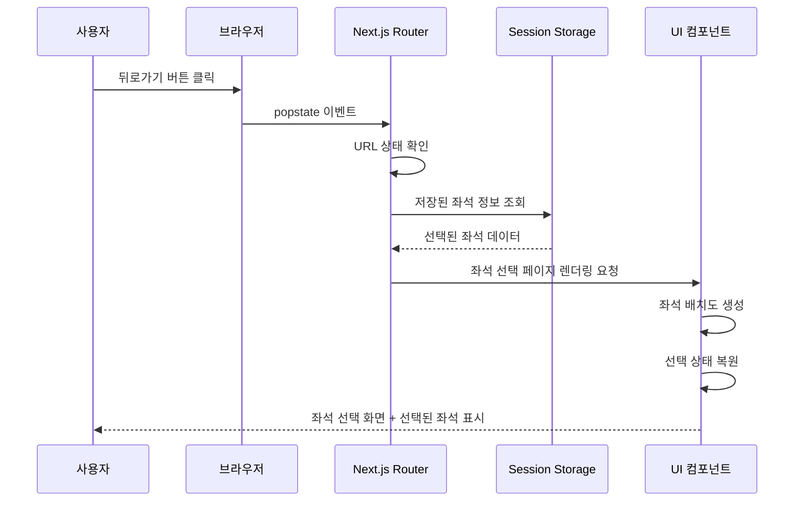
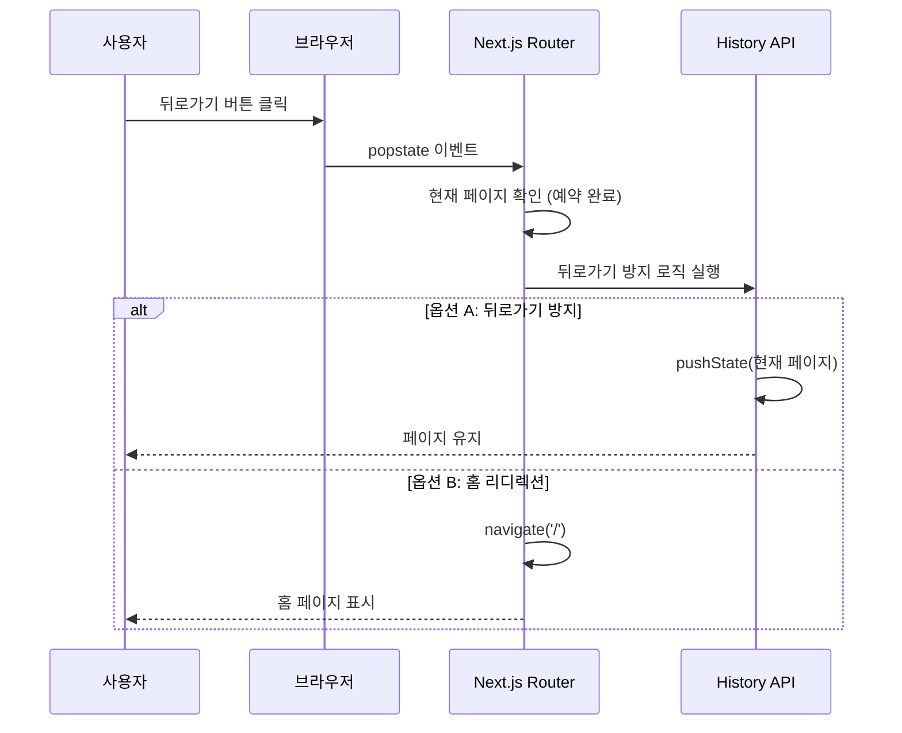

# 유스케이스: UF-013 - 브라우저 뒤로가기/앞으로가기 처리

## 유스케이스 ID: UC-013

### 제목
브라우저 네비게이션 버튼(뒤로가기/앞으로가기) 처리

---

## 1. 개요

### 1.1 목적
사용자가 브라우저의 뒤로가기/앞으로가기 버튼을 사용할 때 적절한 페이지 상태와 데이터를 유지하거나 복원하여 일관된 사용자 경험을 제공한다.

### 1.2 범위
- 브라우저 뒤로가기 버튼 클릭 시 각 페이지별 처리
- 브라우저 앞으로가기 버튼 클릭 시 각 페이지별 처리
- 선택된 좌석 정보 유지/삭제 로직
- 예약 완료 페이지 뒤로가기 방지 또는 리디렉션 처리
- 페이지 간 네비게이션 히스토리 관리

**제외 사항**:
- 페이지 새로고침 처리 (별도 UF-009 참조)
- 커스텀 네비게이션 버튼 클릭 (앱 내 버튼)

### 1.3 액터
- **주요 액터**: 콘서트 예약 플랫폼 사용자
- **부 액터**: 브라우저 (네비게이션 이벤트 발생), 세션 스토리지 (상태 저장소)

---

## 2. 선행 조건

- 사용자가 플랫폼 내에서 최소 2개 이상의 페이지를 방문한 상태
- 브라우저의 히스토리 스택에 이전/다음 페이지 정보가 존재
- Next.js 라우터가 정상적으로 작동하는 상태
- 세션 스토리지가 브라우저에서 활성화된 상태

---

## 3. 참여 컴포넌트

- **Browser History API**: 브라우저 네비게이션 이벤트 감지 및 처리
- **Next.js Router**: 페이지 라우팅 및 히스토리 관리
- **Session Storage**: 좌석 선택 정보 임시 저장
- **UI 컴포넌트**: 각 페이지별 렌더링 및 상태 관리
- **State Management**: 페이지 상태 복원 및 초기화

---

## 4. 기본 플로우 (Basic Flow)

### 4.1 단계별 흐름

#### 시나리오 1: 콘서트 상세 → 뒤로가기

1. **사용자**: 콘서트 상세 페이지(`/concerts/:concertId`)에서 브라우저 뒤로가기 버튼 클릭
   - 입력: 브라우저 뒤로가기 버튼 클릭 이벤트
   - 처리: Next.js 라우터가 popstate 이벤트 감지
   - 출력: 이전 페이지(홈 페이지)로 이동

2. **시스템**: 홈 페이지(`/`) 렌더링
   - 처리: 콘서트 목록 재조회 (최신 데이터)
   - 출력: 콘서트 목록 표시

#### 시나리오 2: 예약 페이지(좌석 선택) → 뒤로가기

1. **사용자**: 예약 페이지 좌석 선택 단계(`/concerts/:concertId/booking`)에서 뒤로가기 버튼 클릭
   - 입력: 브라우저 뒤로가기 버튼 클릭 이벤트
   - 처리: Next.js 라우터가 네비게이션 감지
   - 출력: 콘서트 상세 페이지로 이동

2. **시스템**: 선택된 좌석 정보 삭제
   - 처리: 세션 스토리지에 저장된 선택 좌석 정보 삭제
   - 처리: 콘서트 상세 페이지 렌더링
   - 출력: 콘서트 상세 정보 표시

#### 시나리오 3: 예약 페이지(정보입력 단계) → 뒤로가기

1. **사용자**: 예약 정보 입력 단계에서 뒤로가기 버튼 클릭
   - 입력: 브라우저 뒤로가기 버튼 클릭 이벤트
   - 처리: 현재 URL 상태 확인 (정보입력 단계 식별)
   - 출력: 좌석 선택 단계로 복귀

2. **시스템**: 선택된 좌석 정보 유지 및 복원
   - 처리: 세션 스토리지에서 이전 선택 좌석 정보 조회
   - 처리: 좌석 배치도 렌더링 및 선택 상태 복원
   - 출력: 이전에 선택했던 좌석들이 선택된 상태로 표시
   - 출력: 우측 사이드바에 선택된 좌석 목록 표시

#### 시나리오 4: 예약 완료 페이지 → 뒤로가기

1. **사용자**: 예약 완료 페이지(`/bookings/:bookingId/complete`)에서 뒤로가기 버튼 클릭
   - 입력: 브라우저 뒤로가기 버튼 클릭 이벤트
   - 처리: 페이지 이탈 방지 로직 실행

2. **시스템**: 뒤로가기 방지 또는 홈 리디렉션 (옵션 A)
   - 처리: `window.history.pushState` 또는 `replaceState`로 히스토리 조작
   - 처리: 뒤로가기 이벤트 무시 또는 홈 페이지로 강제 리디렉션
   - 출력: 예약 완료 페이지 유지 또는 홈 페이지 표시
   - 이유: 예약 완료 후 예약 페이지로 돌아가면 혼란 발생 방지

3. **시스템**: 히스토리 스택 정리
   - 처리: 예약 프로세스 중간 단계 히스토리 제거
   - 출력: 깔끔한 네비게이션 경로 유지

#### 시나리오 5: 예약 조회 페이지 → 뒤로가기

1. **사용자**: 예약 조회 결과 페이지에서 뒤로가기 버튼 클릭
   - 입력: 브라우저 뒤로가기 버튼 클릭 이벤트
   - 처리: 이전 페이지로 이동 (홈 또는 다른 페이지)

2. **시스템**: 페이지 상태 초기화
   - 처리: 조회 결과 데이터 삭제
   - 처리: 이전 페이지 렌더링
   - 출력: 이전 페이지 표시

### 4.2 시퀀스 다이어그램

#### 정보입력 단계 → 좌석 선택 단계 뒤로가기



#### 예약 완료 페이지 뒤로가기 방지



---

## 5. 대안 플로우 (Alternative Flows)

### 5.1 대안 플로우 1: 앞으로가기 버튼 사용

**시작 조건**: 사용자가 뒤로가기를 한 이후 앞으로가기 버튼 클릭

**단계**:
1. 사용자가 브라우저 앞으로가기 버튼 클릭
2. Next.js 라우터가 앞으로 네비게이션 감지
3. 각 페이지별 뒤로가기와 동일한 로직을 역방향으로 적용:
   - 홈 → 콘서트 상세: 콘서트 정보 재조회
   - 콘서트 상세 → 예약 페이지: 좌석 정보 재조회, 선택 초기화
   - 좌석 선택 → 정보입력: 선택 정보 복원 (세션 스토리지)
4. 해당 페이지 렌더링 및 최신 데이터 로드

**결과**: 앞으로 이동한 페이지가 최신 상태로 표시됨

### 5.2 대안 플로우 2: 세션 스토리지 데이터 없음

**시작 조건**: 정보입력 단계에서 뒤로가기 시 세션 스토리지에 좌석 정보 없음

**단계**:
1. 사용자가 뒤로가기 버튼 클릭
2. 시스템이 세션 스토리지 조회 시도
3. 저장된 좌석 정보 없음 확인
4. 좌석 선택 단계로 이동하되 선택 초기화 상태로 렌더링
5. 사용자는 좌석을 다시 선택해야 함

**결과**: 빈 좌석 선택 화면 표시

### 5.3 대안 플로우 3: 외부에서 직접 URL 접근 후 뒤로가기

**시작 조건**: 외부 링크로 콘서트 상세 페이지 직접 접근 후 뒤로가기

**단계**:
1. 사용자가 외부에서 `/concerts/:concertId` URL로 직접 접근
2. 브라우저 히스토리에 이전 페이지 없음
3. 사용자가 뒤로가기 버튼 클릭
4. 브라우저가 이전 페이지(외부 사이트 또는 빈 탭)로 이동 시도
5. 시스템은 개입하지 않음

**결과**: 브라우저 기본 동작 (이전 사이트 또는 빈 탭)

---

## 6. 예외 플로우 (Exception Flows)

### 6.1 예외 상황 1: 세션 스토리지 비활성화

**발생 조건**: 브라우저에서 세션 스토리지가 비활성화되거나 지원되지 않음

**처리 방법**:
1. 시스템이 세션 스토리지 접근 실패 감지
2. 로컬 상태(메모리)를 대체 저장소로 사용 시도
3. 대체 불가능한 경우 좌석 선택 정보 복원 실패
4. 사용자에게 알림 없이 빈 선택 상태로 렌더링
5. 사용자는 좌석을 다시 선택해야 함

**에러 코드**: 내부 처리 (사용자에게 에러 표시 안 함)

**사용자 메시지**: 없음 (graceful degradation)

### 6.2 예외 상황 2: 네트워크 오프라인 상태에서 뒤로가기

**발생 조건**: 뒤로가기로 이동한 페이지가 서버 데이터 조회 필요하나 네트워크 오프라인

**처리 방법**:
1. 사용자가 뒤로가기 버튼 클릭
2. 페이지 라우팅은 성공하나 API 요청 실패
3. 로딩 상태 표시
4. 네트워크 에러 감지
5. 오프라인 안내 메시지 표시
6. 재시도 버튼 제공

**에러 코드**: `NETWORK_OFFLINE`

**사용자 메시지**: "인터넷 연결을 확인해주세요. 오프라인 상태에서는 일부 기능을 사용할 수 없습니다."

### 6.3 예외 상황 3: 뒤로가기 시 콘서트 데이터 삭제됨

**발생 조건**: 사용자가 예약 페이지에서 뒤로가기 시 해당 콘서트가 삭제된 상태

**처리 방법**:
1. 사용자가 뒤로가기 버튼 클릭
2. 콘서트 상세 페이지로 라우팅
3. 콘서트 조회 API 호출
4. 404 응답 수신
5. 에러 페이지 표시
6. 홈으로 돌아가기 버튼 제공

**에러 코드**: `404 Not Found`

**사용자 메시지**: "요청하신 콘서트를 찾을 수 없습니다. 삭제되었거나 존재하지 않는 콘서트입니다."

### 6.4 예외 상황 4: 빠른 연속 뒤로가기 클릭

**발생 조건**: 사용자가 뒤로가기 버튼을 빠르게 여러 번 클릭

**처리 방법**:
1. 첫 번째 뒤로가기 이벤트 처리 시작
2. 네비게이션 진행 중 플래그 설정
3. 두 번째 뒤로가기 이벤트 감지
4. 진행 중 플래그 확인 후 무시 (디바운싱)
5. 첫 번째 네비게이션 완료 후 플래그 해제

**에러 코드**: 없음 (내부 처리)

**사용자 메시지**: 없음

### 6.5 예외 상황 5: 예약 완료 페이지의 잘못된 bookingId

**발생 조건**: 예약 완료 페이지에서 뒤로가기 시도했으나 bookingId가 유효하지 않음

**처리 방법**:
1. 예약 완료 페이지 로드 시 bookingId 검증
2. 예약 정보 조회 API 호출
3. 404 또는 403 응답 수신
4. 에러 페이지 표시
5. 홈 또는 예약 조회 페이지 이동 옵션 제공

**에러 코드**: `404 Not Found` 또는 `403 Forbidden`

**사용자 메시지**: "예약 정보를 찾을 수 없습니다. 예약 조회 페이지에서 다시 확인해주세요."

---

## 7. 후행 조건 (Post-conditions)

### 7.1 성공 시

**데이터베이스 변경**:
- 없음 (뒤로가기는 읽기 전용 작업)

**시스템 상태**:
- 브라우저 히스토리 스택이 이전 상태로 변경됨
- 이동한 페이지의 데이터가 최신 상태로 로드됨
- 필요한 경우 세션 스토리지에서 상태 복원됨

**클라이언트 상태**:
- 좌석 선택 단계로 복귀 시: 선택된 좌석 정보 복원됨
- 다른 페이지로 이동 시: 이전 선택 정보 삭제됨
- 예약 완료 페이지: 뒤로가기 방지 또는 홈 리디렉션 완료

### 7.2 실패 시

**데이터 롤백**:
- 해당 없음 (읽기 작업)

**시스템 상태**:
- 페이지 이동 실패 시 현재 페이지 유지
- 에러 메시지 또는 대체 UI 표시
- 재시도 옵션 제공

---

## 8. 비기능 요구사항

### 8.1 성능
- **네비게이션 반응 시간**: 브라우저 뒤로가기 클릭 후 페이지 렌더링까지 200ms 이내
- **세션 스토리지 조회 시간**: 50ms 이내
- **좌석 정보 복원 시간**: 100ms 이내
- **페이지 전환 애니메이션**: 부드러운 전환 효과 (선택사항)

### 8.2 보안
- **세션 스토리지 데이터 검증**: XSS 방지를 위한 데이터 검증
- **URL 파라미터 검증**: concertId, bookingId 등 파라미터 유효성 검증
- **민감 정보 저장 금지**: 세션 스토리지에 비밀번호, 결제 정보 등 저장 금지
- **CSRF 방지**: API 요청 시 토큰 검증 (적용 가능한 경우)

### 8.3 가용성
- **오프라인 대응**: 네트워크 오류 시 적절한 안내 메시지 및 재시도 옵션
- **세션 스토리지 용량 초과**: graceful degradation으로 메모리 상태 사용
- **브라우저 호환성**: Chrome, Safari, Firefox, Edge 최신 2개 버전 지원

### 8.4 사용성
- **일관된 경험**: 모든 페이지에서 뒤로가기 동작이 예측 가능해야 함
- **상태 유지**: 사용자가 입력한 정보가 필요한 경우 복원되어야 함
- **혼란 방지**: 예약 완료 후 중간 단계로 돌아가지 않도록 처리

---

## 9. UI/UX 요구사항

### 9.1 화면 구성

**공통 요구사항**:
- 뒤로가기 시 로딩 인디케이터 표시 (데이터 로드 중)
- 페이지 전환 시 부드러운 애니메이션 (선택사항)
- 에러 발생 시 명확한 안내 메시지 및 액션 버튼

**좌석 선택 페이지 복귀 시**:
- 이전에 선택했던 좌석들이 시각적으로 강조 표시됨
- 우측 사이드바에 선택된 좌석 목록 즉시 표시
- 예약하기 버튼 활성화 상태 (1개 이상 선택된 경우)

**예약 완료 페이지**:
- 뒤로가기 버튼이 비활성화되거나 (브라우저 제어 불가)
- 뒤로가기 시 확인 다이얼로그 표시 (선택사항)
- 또는 자동으로 홈으로 리디렉션

### 9.2 사용자 경험

**기대 동작**:
- 사용자가 뒤로가기 버튼을 누르면 직전에 본 페이지로 즉시 이동
- 이전에 입력하거나 선택한 정보가 유지되어야 하는 경우 복원됨
- 예약 완료 후에는 예약 프로세스 중간 단계로 돌아가지 않음

**피드백**:
- 페이지 전환 시 로딩 상태 표시
- 에러 발생 시 구체적이고 이해하기 쉬운 메시지
- 다음 액션을 안내하는 명확한 버튼 (홈으로 가기, 재시도 등)

**접근성**:
- 키보드 네비게이션 지원 (Alt+Left 등)
- 스크린 리더 사용자를 위한 페이지 변경 알림
- 포커스 관리 (페이지 이동 후 적절한 요소에 포커스)

---

## 10. 데이터 요구사항

### 10.1 세션 스토리지 저장 데이터

**키**: `selectedSeats_{concertId}`

**값 구조**:
```json
{
  "concertId": "uuid",
  "seats": [
    {
      "seatId": "uuid",
      "section": "A",
      "row": 1,
      "column": 3
    },
    {
      "seatId": "uuid",
      "section": "A",
      "row": 1,
      "column": 4
    }
  ],
  "timestamp": "2025-10-13T12:00:00.000Z"
}
```

**저장 시점**:
- 좌석 선택/해제 시마다 업데이트
- 정보입력 단계 진입 시 최종 저장

**삭제 시점**:
- 예약 완료 시
- 예약 페이지에서 콘서트 상세로 뒤로가기 시
- 30분 경과 시 (타임스탬프 기반 자동 삭제)

### 10.2 히스토리 상태 데이터

**History State 구조**:
```javascript
{
  "pageType": "booking-input" | "booking-seats" | "concert-detail" | "home",
  "step": "seats" | "input" | null,
  "preserveState": true | false
}
```

**사용 목적**:
- popstate 이벤트 발생 시 이전 페이지 타입 식별
- 적절한 상태 복원 로직 실행

### 10.3 API 요청 데이터

뒤로가기 시 필요한 API 재요청:

| 페이지 | API 엔드포인트 | 파라미터 | 용도 |
|--------|---------------|----------|------|
| 홈 | `GET /api/concerts` | - | 콘서트 목록 조회 |
| 콘서트 상세 | `GET /api/concerts/:id` | `concertId` | 콘서트 정보 조회 |
| 좌석 선택 | `GET /api/concerts/:id/seats` | `concertId` | 좌석 배치도 조회 |
| 예약 완료 | `GET /api/bookings/:id` | `bookingId` | 예약 정보 조회 |

---

## 10. 테스트 시나리오

### 10.1 성공 케이스

| 테스트 케이스 ID | 시작 페이지 | 동작 | 기대 결과 |
|-----------------|-----------|------|----------|
| TC-013-01 | 콘서트 상세 | 뒤로가기 | 홈 페이지로 이동, 콘서트 목록 표시 |
| TC-013-02 | 예약(좌석 선택) | 뒤로가기 | 콘서트 상세로 이동, 선택 정보 삭제 |
| TC-013-03 | 예약(정보입력) | 뒤로가기 | 좌석 선택 단계로 복귀, 선택 정보 복원 |
| TC-013-04 | 예약 완료 | 뒤로가기 | 페이지 유지 또는 홈으로 리디렉션 |
| TC-013-05 | 홈 | 뒤로가기 → 앞으로가기 | 다시 홈 페이지로 이동 |
| TC-013-06 | 예약(좌석 선택) | 좌석 2개 선택 → 정보입력 → 뒤로가기 | 이전 선택한 2개 좌석 복원 |

### 10.2 실패/예외 케이스

| 테스트 케이스 ID | 시작 페이지 | 동작 | 시뮬레이션 조건 | 기대 결과 |
|-----------------|-----------|------|----------------|----------|
| TC-013-07 | 예약(정보입력) | 뒤로가기 | 세션 스토리지 삭제 | 빈 좌석 선택 화면 표시 |
| TC-013-08 | 콘서트 상세 | 뒤로가기 | 네트워크 오프라인 | 오프라인 메시지, 재시도 버튼 |
| TC-013-09 | 예약 완료 | 뒤로가기 | bookingId 유효하지 않음 | 404 에러 페이지, 홈 이동 버튼 |
| TC-013-10 | 예약(좌석 선택) | 빠른 연속 뒤로가기 2회 | - | 첫 번째만 처리, 안정적 동작 |
| TC-013-11 | 예약(좌석 선택) | 뒤로가기 | 콘서트 삭제됨 | 404 에러, 홈 이동 옵션 |
| TC-013-12 | 예약(정보입력) | 뒤로가기 | 세션 스토리지 비활성화 | graceful degradation, 빈 선택 상태 |

### 10.3 엣지 케이스

| 테스트 케이스 ID | 시나리오 | 기대 결과 |
|-----------------|---------|----------|
| TC-013-13 | 외부 링크로 콘서트 상세 직접 접근 → 뒤로가기 | 외부 사이트 또는 빈 탭으로 이동 |
| TC-013-14 | 여러 탭에서 동일 예약 페이지 → 한 탭에서 뒤로가기 | 각 탭 독립적 동작 |
| TC-013-15 | 좌석 4개 선택 → 정보입력 → 뒤로가기 → 1개 해제 → 다시 앞으로가기 | 정보입력 단계로 이동, 4개 좌석 상태 유지 |
| TC-013-16 | 예약 완료 후 즉시 뒤로가기 5회 연속 클릭 | 안정적으로 처리, 크래시 없음 |

---

## 11. 관련 유스케이스

### 선행 유스케이스
- **UC-001**: 콘서트 목록 조회 - 뒤로가기로 홈 복귀 시 필요
- **UC-002**: 콘서트 상세 조회 - 예약 페이지에서 뒤로가기 시 필요
- **UC-003**: 좌석 선택 - 정보입력 단계에서 뒤로가기 시 상태 복원

### 후행 유스케이스
- **UC-009**: 페이지 새로고침 처리 - 뒤로가기 후 새로고침 시나리오

### 연관 유스케이스
- **UC-005**: 예약 정보 입력 및 제출 - 정보입력 단계 관련
- **UC-006**: 예약 조회 - 예약 조회 페이지 뒤로가기 처리

---

## 12. 구현 고려사항

### 12.1 Next.js Router 활용

**Router Events 리스닝**:
```
- routeChangeStart: 네비게이션 시작 시
- routeChangeComplete: 네비게이션 완료 시
- beforeHistoryChange: 히스토리 변경 전
```

**권장 접근**:
- useEffect 훅으로 popstate 이벤트 리스닝
- Router의 beforePopState로 뒤로가기 제어
- 페이지별 컴포넌트에서 useEffect cleanup으로 상태 정리

### 12.2 예약 완료 페이지 뒤로가기 방지 전략

**옵션 A: History API 조작**
```
장점: 완전한 뒤로가기 방지 가능
단점: 사용자 경험에 혼란 줄 수 있음
구현: window.history.pushState 반복 호출
```

**옵션 B: 홈으로 리디렉션 (권장)**
```
장점: 사용자에게 명확한 경로 제공
단점: 뒤로가기 완전 차단은 불가
구현: 예약 완료 페이지 마운트 시 히스토리 교체
```

**옵션 C: 확인 다이얼로그**
```
장점: 사용자에게 선택권 제공
단점: 추가 클릭 필요
구현: beforeunload 이벤트 활용 (제한적)
```

### 12.3 세션 스토리지 관리

**저장 키 명명 규칙**:
- `selectedSeats_{concertId}`: 선택된 좌석 정보
- `bookingStep_{concertId}`: 현재 예약 단계

**데이터 유효성 검증**:
- JSON 파싱 에러 처리
- 타임스탬프 기반 만료 확인 (30분)
- concertId 일치 여부 확인

**메모리 관리**:
- 불필요한 데이터 즉시 삭제
- 예약 완료/취소 시 관련 세션 데이터 정리
- 페이지 언마운트 시 cleanup

---

## 13. 변경 이력

| 버전 | 날짜 | 작성자 | 변경 내용 |
|------|------|--------|-----------|
| 1.0  | 2025-10-13 | Product Team | 초기 작성 |

---

## 부록

### A. 용어 정의

- **popstate 이벤트**: 브라우저의 활성 히스토리 항목이 변경될 때 발생하는 이벤트
- **세션 스토리지**: 브라우저 탭 단위로 데이터를 저장하는 저장소 (탭 닫으면 삭제)
- **History API**: 브라우저 히스토리 스택을 조작할 수 있는 JavaScript API
- **graceful degradation**: 기능이 제한적일 때 기본 기능은 유지하며 부드럽게 성능 저하하는 전략
- **디바운싱**: 짧은 시간에 여러 번 발생하는 이벤트를 한 번만 처리하는 기법

### B. 참고 자료

- Next.js Router 공식 문서: https://nextjs.org/docs/routing/introduction
- History API MDN: https://developer.mozilla.org/en-US/docs/Web/API/History_API
- Session Storage MDN: https://developer.mozilla.org/en-US/docs/Web/API/Window/sessionStorage
- PRD 문서: `/docs/prd.md`
- UserFlow 문서: `/docs/userflow.md` (UF-013)
- Database 설계: `/docs/database.md`

### C. 페이지별 뒤로가기 처리 요약표

| 현재 페이지 | 이전 페이지 | 데이터 복원 | 데이터 삭제 | 특이사항 |
|-----------|-----------|-----------|-----------|---------|
| 콘서트 상세 | 홈 | - | - | 최신 목록 조회 |
| 예약(좌석) | 콘서트 상세 | - | 선택 좌석 | 상세 정보 표시 |
| 예약(정보입력) | 예약(좌석) | 선택 좌석 | - | 세션 스토리지 활용 |
| 예약 완료 | 예약(정보입력) | - | - | 뒤로가기 방지/리디렉션 |
| 예약 조회 결과 | 홈 등 | - | 조회 결과 | 초기 상태로 복귀 |

---

**문서 버전**: 1.0
**최종 수정일**: 2025-10-13
**작성자**: Product Team
**검토자**: Development Team
