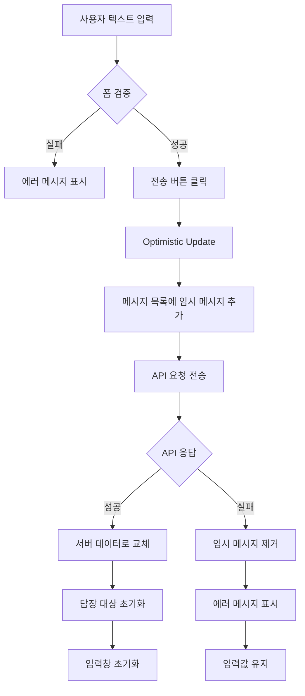
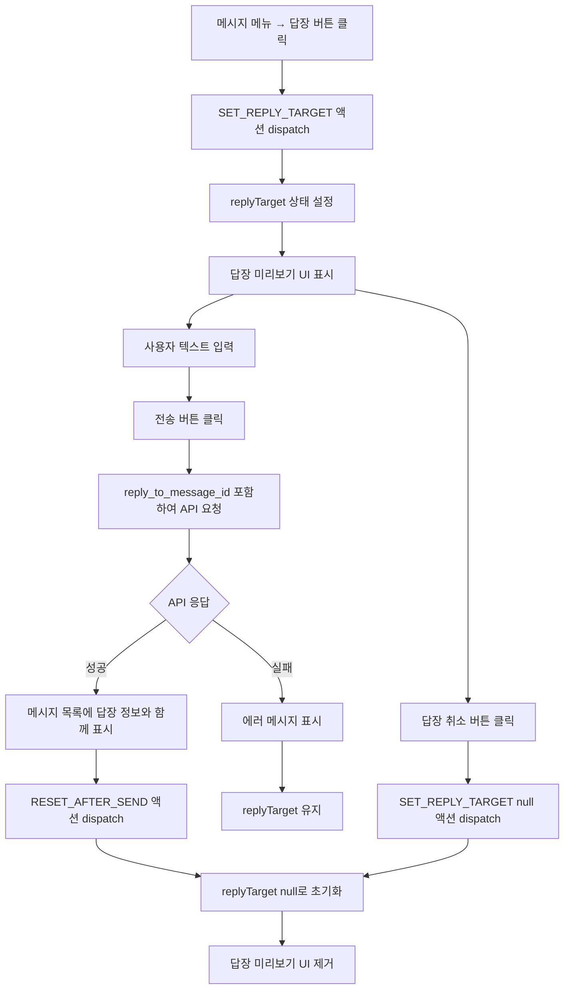
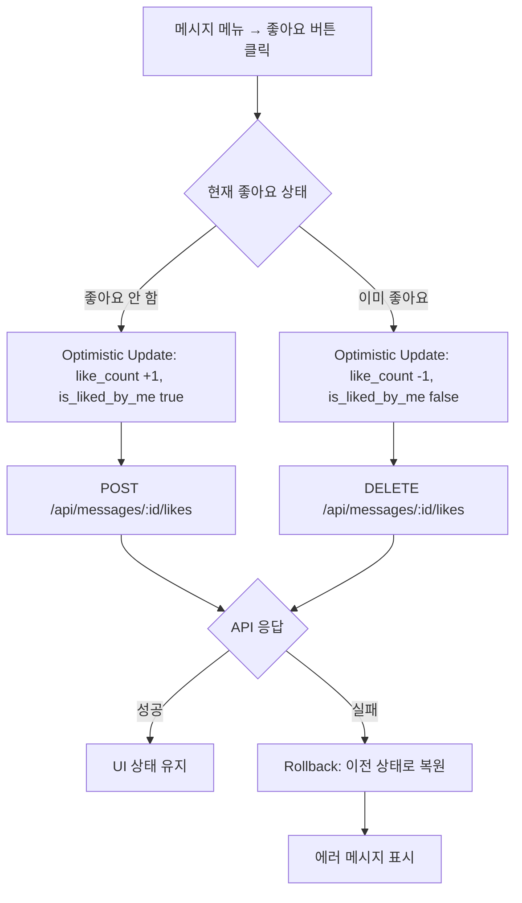
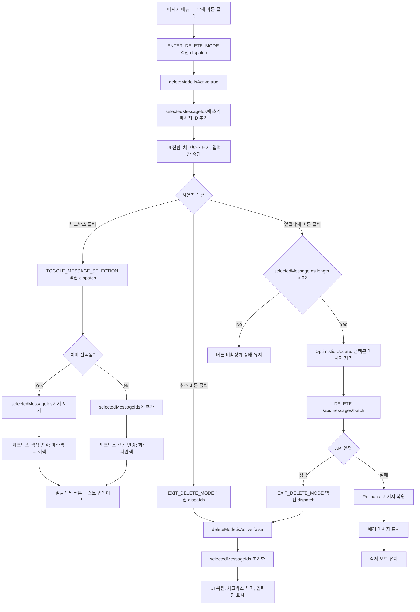
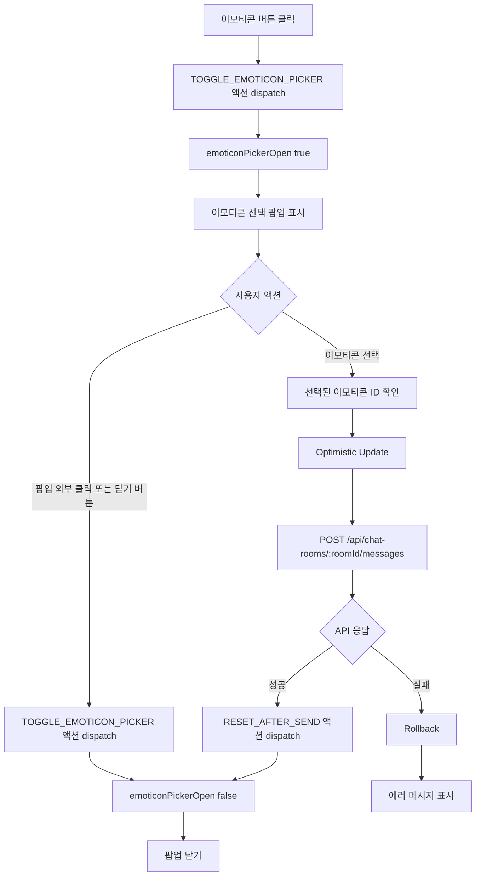

# 채팅방 상세 페이지 - 상태 관리 설계

## 문서 개요

본 문서는 채팅방 상세 페이지(`/chat-rooms/:id`)의 상태 관리 설계를 정의합니다. Context + useReducer 패턴을 사용하여 복잡한 메시지 상호작용과 삭제 모드를 관리합니다.

---

## 1. 페이지 개요

### 1.1 페이지 정보

- **경로**: `/chat-rooms/:id`
- **목적**: 채팅방 메시지 표시, 메시지 전송, 메시지 상호작용 (답장/좋아요/삭제)
- **주요 기능**:
  - 메시지 목록 조회 및 무한 스크롤
  - 텍스트/이모티콘 메시지 전송
  - 메시지 답장 설정 및 전송
  - 메시지 좋아요/좋아요 취소
  - 메시지 삭제 모드 진입 및 일괄 삭제

### 1.2 관련 유스케이스

- UC-007: 채팅방 상세 조회
- UC-008: 메시지 목록 조회
- UC-009: 텍스트 메시지 전송
- UC-010: 이모티콘 메시지 전송
- UC-011: 메시지 답장
- UC-012: 메시지 좋아요/좋아요 취소
- UC-013: 메시지 삭제

---

## 2. 상태 분류

### 2.1 관리해야 할 상태 데이터

| 상태명 | 타입 | 관리 방법 | 설명 |
|--------|------|-----------|------|
| `chatRoom` | `ChatRoom \| null` | React Query | 채팅방 기본 정보 (id, name, created_at) |
| `messages` | `Message[]` | React Query | 메시지 목록 (무한 스크롤 데이터) |
| `replyTarget` | `Message \| null` | Context + useReducer | 답장 대상 메시지 (클라이언트 상태) |
| `deleteMode` | `DeleteModeState` | Context + useReducer | 삭제 모드 상태 (활성화 여부, 선택된 메시지 ID 목록) |
| `emoticonPickerOpen` | `boolean` | Context + useReducer | 이모티콘 선택 팝업 열림 여부 |
| `messageInput` | `string` | React Hook Form | 텍스트 메시지 입력값 |

### 2.2 화면에 표시되지만 상태가 아닌 데이터

| 데이터명 | 출처 | 설명 |
|---------|------|------|
| `currentUser` | Supabase Auth | 현재 로그인한 사용자 정보 (useUser 훅) |
| `isLoading` | React Query | 메시지 목록 로딩 상태 |
| `isFetching` | React Query | 무한 스크롤 추가 로딩 상태 |
| `hasNextPage` | React Query | 추가 메시지 존재 여부 |

---

## 3. 서버 상태 관리 (React Query)

### 3.1 Query 정의

#### 3.1.1 채팅방 정보 조회

```typescript
// src/features/chat-rooms/hooks/useChatRoom.ts

export const useChatRoom = (roomId: string) => {
  return useQuery({
    queryKey: queryKeys.chatRooms.detail(roomId),
    queryFn: () => apiClient.get(`/api/chat-rooms/${roomId}`),
    staleTime: 1000 * 60 * 5, // 5분
    gcTime: 1000 * 60 * 10, // 10분
    retry: 1,
  });
};
```

**쿼리 키**: `['chat-rooms', roomId]`

**응답 스키마**:
```typescript
{
  success: true,
  data: {
    id: string;
    name: string;
    created_at: string;
  }
}
```

**에러 처리**:
- 404: 채팅방을 찾을 수 없음 → 홈으로 리다이렉트
- 401: 인증 실패 → 로그인 페이지로 리다이렉트

---

#### 3.1.2 메시지 목록 조회 (무한 스크롤)

```typescript
// src/features/messages/hooks/useMessages.ts

export const useMessages = (roomId: string) => {
  return useInfiniteQuery({
    queryKey: queryKeys.messages.list(roomId),
    queryFn: ({ pageParam = 0 }) =>
      apiClient.get(`/api/chat-rooms/${roomId}/messages`, {
        params: { limit: 50, offset: pageParam }
      }),
    initialPageParam: 0,
    getNextPageParam: (lastPage, allPages) => {
      const totalFetched = allPages.length * 50;
      return lastPage.data.messages.length === 50 ? totalFetched : undefined;
    },
    staleTime: 1000 * 60, // 1분
    gcTime: 1000 * 60 * 5, // 5분
    select: (data) => ({
      pages: data.pages,
      pageParams: data.pageParams,
      // 모든 페이지의 메시지를 flat하게 병합
      messages: data.pages.flatMap((page) => page.data.messages),
    }),
  });
};
```

**쿼리 키**: `['messages', roomId]`

**응답 스키마**:
```typescript
{
  success: true,
  data: {
    messages: Message[];
    hasMore: boolean;
  }
}
```

**Message 타입**:
```typescript
type Message = {
  id: string;
  chat_room_id: string;
  sender_id: string;
  sender_nickname: string;
  message_type: 'text' | 'emoticon';
  content: string | null;
  emoticon_id: string | null;
  created_at: string;

  // 답장 정보
  reply_to?: {
    message_id: string;
    sender_nickname: string;
    message_type: 'text' | 'emoticon';
    content: string | null;
    emoticon_id: string | null;
  };

  // 좋아요 정보
  like_count: number;
  is_liked_by_me: boolean;
};
```

---

### 3.2 Mutation 정의

#### 3.2.1 텍스트 메시지 전송

```typescript
// src/features/messages/hooks/useSendMessage.ts

export const useSendMessage = (roomId: string) => {
  const queryClient = useQueryClient();

  return useMutation({
    mutationFn: (data: SendMessageRequest) =>
      apiClient.post(`/api/chat-rooms/${roomId}/messages`, data),

    // Optimistic Update
    onMutate: async (newMessage) => {
      // 진행 중인 쿼리 취소
      await queryClient.cancelQueries({
        queryKey: queryKeys.messages.list(roomId),
      });

      // 이전 데이터 백업
      const previousMessages = queryClient.getQueryData(
        queryKeys.messages.list(roomId)
      );

      // 낙관적 업데이트
      queryClient.setQueryData(
        queryKeys.messages.list(roomId),
        (old: any) => {
          const optimisticMessage: Message = {
            id: `temp-${Date.now()}`,
            chat_room_id: roomId,
            sender_id: 'current-user-id', // 실제로는 useUser에서 가져옴
            sender_nickname: 'current-user-nickname',
            message_type: newMessage.message_type,
            content: newMessage.content || null,
            emoticon_id: newMessage.emoticon_id || null,
            reply_to: newMessage.reply_to_message_id ? undefined : undefined, // 답장 정보는 서버 응답 후 업데이트
            like_count: 0,
            is_liked_by_me: false,
            created_at: new Date().toISOString(),
          };

          return {
            ...old,
            pages: old.pages.map((page: any, index: number) =>
              index === 0
                ? { ...page, data: { messages: [...page.data.messages, optimisticMessage] } }
                : page
            ),
          };
        }
      );

      return { previousMessages };
    },

    // 성공 시
    onSuccess: (data, variables, context) => {
      // 서버에서 받은 실제 메시지로 교체
      queryClient.invalidateQueries({
        queryKey: queryKeys.messages.list(roomId),
      });
    },

    // 에러 시 롤백
    onError: (error, variables, context) => {
      if (context?.previousMessages) {
        queryClient.setQueryData(
          queryKeys.messages.list(roomId),
          context.previousMessages
        );
      }
    },
  });
};
```

**요청 스키마**:
```typescript
type SendMessageRequest =
  | { message_type: 'text'; content: string; reply_to_message_id?: string }
  | { message_type: 'emoticon'; emoticon_id: string; reply_to_message_id?: string };
```

**에러 처리**:
- 400: 유효성 검증 실패 → 에러 메시지 표시
- 404: 채팅방 없음 → 홈으로 리다이렉트
- 401: 인증 실패 → 로그인 페이지로 리다이렉트

---

#### 3.2.2 메시지 좋아요/좋아요 취소

```typescript
// src/features/messages/hooks/useToggleLike.ts

export const useToggleLike = () => {
  const queryClient = useQueryClient();

  return useMutation({
    mutationFn: ({ messageId, isLiked }: { messageId: string; isLiked: boolean }) => {
      if (isLiked) {
        return apiClient.delete(`/api/messages/${messageId}/likes`);
      } else {
        return apiClient.post(`/api/messages/${messageId}/likes`);
      }
    },

    // Optimistic Update
    onMutate: async ({ messageId, isLiked }) => {
      const roomId = 'current-room-id'; // Context에서 가져옴

      await queryClient.cancelQueries({
        queryKey: queryKeys.messages.list(roomId),
      });

      const previousMessages = queryClient.getQueryData(
        queryKeys.messages.list(roomId)
      );

      // 낙관적 업데이트: 좋아요 개수 및 상태 변경
      queryClient.setQueryData(
        queryKeys.messages.list(roomId),
        (old: any) => ({
          ...old,
          pages: old.pages.map((page: any) => ({
            ...page,
            data: {
              messages: page.data.messages.map((msg: Message) =>
                msg.id === messageId
                  ? {
                      ...msg,
                      like_count: isLiked ? msg.like_count - 1 : msg.like_count + 1,
                      is_liked_by_me: !isLiked,
                    }
                  : msg
              ),
            },
          })),
        })
      );

      return { previousMessages };
    },

    onError: (error, variables, context) => {
      if (context?.previousMessages) {
        const roomId = 'current-room-id';
        queryClient.setQueryData(
          queryKeys.messages.list(roomId),
          context.previousMessages
        );
      }
    },
  });
};
```

**에러 처리**:
- 404: 메시지 없음 → 에러 무시 (이미 삭제됨)
- 409: 중복 좋아요 → 에러 무시 (멱등성 처리)

---

#### 3.2.3 메시지 일괄 삭제

```typescript
// src/features/messages/hooks/useDeleteMessages.ts

export const useDeleteMessages = (roomId: string) => {
  const queryClient = useQueryClient();

  return useMutation({
    mutationFn: (messageIds: string[]) =>
      apiClient.delete('/api/messages/batch', {
        data: { message_ids: messageIds }
      }),

    // Optimistic Update
    onMutate: async (messageIds) => {
      await queryClient.cancelQueries({
        queryKey: queryKeys.messages.list(roomId),
      });

      const previousMessages = queryClient.getQueryData(
        queryKeys.messages.list(roomId)
      );

      // 낙관적 업데이트: 메시지 제거
      queryClient.setQueryData(
        queryKeys.messages.list(roomId),
        (old: any) => ({
          ...old,
          pages: old.pages.map((page: any) => ({
            ...page,
            data: {
              messages: page.data.messages.filter(
                (msg: Message) => !messageIds.includes(msg.id)
              ),
            },
          })),
        })
      );

      return { previousMessages };
    },

    onSuccess: () => {
      // 삭제 성공 시 캐시 무효화 (서버와 동기화)
      queryClient.invalidateQueries({
        queryKey: queryKeys.messages.list(roomId),
      });
    },

    onError: (error, variables, context) => {
      if (context?.previousMessages) {
        queryClient.setQueryData(
          queryKeys.messages.list(roomId),
          context.previousMessages
        );
      }
    },
  });
};
```

**요청 스키마**:
```typescript
{
  message_ids: string[]; // UUID 배열
}
```

**에러 처리**:
- 400: 삭제 대상 없음 → 에러 메시지 표시
- 403: 권한 없음 → 에러 메시지 표시

---

### 3.3 캐시 무효화 전략

| 이벤트 | 무효화 대상 | 이유 |
|--------|-------------|------|
| 메시지 전송 성공 | `['messages', roomId]` | 새 메시지 추가, 서버에서 최신 데이터 가져오기 |
| 메시지 삭제 성공 | `['messages', roomId]` | 삭제된 메시지 제거, 답장 대상 NULL 업데이트 |
| 좋아요 토글 성공 | 무효화 없음 (Optimistic Update만) | 응답 속도 최적화 |
| 채팅방 나가기 | `['messages', roomId]`, `['chat-rooms', roomId]` | 페이지 이탈 시 캐시 정리 |

---

## 4. 클라이언트 상태 관리 (Context + useReducer)

### 4.1 State 구조

```typescript
// src/features/chat-rooms/context/chat-room-context.tsx

type ChatRoomState = {
  // 답장 대상 메시지
  replyTarget: Message | null;

  // 삭제 모드 상태
  deleteMode: {
    isActive: boolean;
    selectedMessageIds: string[];
  };

  // 이모티콘 선택 팝업
  emoticonPickerOpen: boolean;
};

const initialState: ChatRoomState = {
  replyTarget: null,
  deleteMode: {
    isActive: false,
    selectedMessageIds: [],
  },
  emoticonPickerOpen: false,
};
```

---

### 4.2 Actions

```typescript
type ChatRoomAction =
  // 답장 대상 설정
  | { type: 'SET_REPLY_TARGET'; payload: Message | null }

  // 삭제 모드 진입 (초기 선택 메시지 포함)
  | { type: 'ENTER_DELETE_MODE'; payload: string }

  // 삭제 모드 종료
  | { type: 'EXIT_DELETE_MODE' }

  // 삭제 대상 메시지 토글
  | { type: 'TOGGLE_MESSAGE_SELECTION'; payload: string }

  // 이모티콘 선택 팝업 열기/닫기
  | { type: 'TOGGLE_EMOTICON_PICKER' }

  // 메시지 전송 후 상태 초기화 (답장 대상, 이모티콘 팝업)
  | { type: 'RESET_AFTER_SEND' };
```

---

### 4.3 Reducer

```typescript
function chatRoomReducer(
  state: ChatRoomState,
  action: ChatRoomAction
): ChatRoomState {
  switch (action.type) {
    case 'SET_REPLY_TARGET':
      return {
        ...state,
        replyTarget: action.payload,
      };

    case 'ENTER_DELETE_MODE':
      return {
        ...state,
        deleteMode: {
          isActive: true,
          selectedMessageIds: [action.payload], // 초기 선택 메시지
        },
        // 삭제 모드 진입 시 다른 상태 초기화
        replyTarget: null,
        emoticonPickerOpen: false,
      };

    case 'EXIT_DELETE_MODE':
      return {
        ...state,
        deleteMode: {
          isActive: false,
          selectedMessageIds: [],
        },
      };

    case 'TOGGLE_MESSAGE_SELECTION': {
      const { selectedMessageIds } = state.deleteMode;
      const messageId = action.payload;

      return {
        ...state,
        deleteMode: {
          ...state.deleteMode,
          selectedMessageIds: selectedMessageIds.includes(messageId)
            ? selectedMessageIds.filter((id) => id !== messageId)
            : [...selectedMessageIds, messageId],
        },
      };
    }

    case 'TOGGLE_EMOTICON_PICKER':
      return {
        ...state,
        emoticonPickerOpen: !state.emoticonPickerOpen,
      };

    case 'RESET_AFTER_SEND':
      return {
        ...state,
        replyTarget: null,
        emoticonPickerOpen: false,
      };

    default:
      return state;
  }
}
```

---

### 4.4 Context Provider

```typescript
// src/features/chat-rooms/context/chat-room-context.tsx

type ChatRoomContextValue = {
  state: ChatRoomState;
  dispatch: React.Dispatch<ChatRoomAction>;

  // Derived state (계산된 값)
  selectedMessageCount: number;
  canDelete: boolean;
};

const ChatRoomContext = createContext<ChatRoomContextValue | undefined>(undefined);

export const ChatRoomProvider: React.FC<{ children: React.ReactNode }> = ({ children }) => {
  const [state, dispatch] = useReducer(chatRoomReducer, initialState);

  // Derived state
  const selectedMessageCount = state.deleteMode.selectedMessageIds.length;
  const canDelete = selectedMessageCount > 0;

  const value: ChatRoomContextValue = {
    state,
    dispatch,
    selectedMessageCount,
    canDelete,
  };

  return (
    <ChatRoomContext.Provider value={value}>
      {children}
    </ChatRoomContext.Provider>
  );
};

export const useChatRoomContext = () => {
  const context = useContext(ChatRoomContext);
  if (!context) {
    throw new Error('useChatRoomContext must be used within ChatRoomProvider');
  }
  return context;
};
```

---

## 5. 폼 상태 관리 (React Hook Form)

### 5.1 텍스트 메시지 전송 폼

```typescript
// src/features/messages/components/message-input.tsx

import { useForm } from 'react-hook-form';
import { zodResolver } from '@hookform/resolvers/zod';
import { z } from 'zod';

const textMessageSchema = z.object({
  content: z.string()
    .min(1, '메시지를 입력해주세요')
    .max(1000, '메시지는 최대 1000자까지 입력할 수 있습니다')
    .trim(),
});

type TextMessageFormData = z.infer<typeof textMessageSchema>;

export const MessageInput: React.FC = () => {
  const { state, dispatch } = useChatRoomContext();
  const sendMessage = useSendMessage(roomId);

  const form = useForm<TextMessageFormData>({
    resolver: zodResolver(textMessageSchema),
    defaultValues: {
      content: '',
    },
  });

  const handleSubmit = form.handleSubmit(async (data) => {
    try {
      await sendMessage.mutateAsync({
        message_type: 'text',
        content: data.content,
        reply_to_message_id: state.replyTarget?.id,
      });

      // 전송 후 상태 초기화
      form.reset();
      dispatch({ type: 'RESET_AFTER_SEND' });
    } catch (error) {
      // 에러 처리 (toast 메시지 등)
      console.error('메시지 전송 실패:', error);
    }
  });

  return (
    <form onSubmit={handleSubmit}>
      {/* 답장 대상 미리보기 */}
      {state.replyTarget && (
        <ReplyTargetPreview
          message={state.replyTarget}
          onCancel={() => dispatch({ type: 'SET_REPLY_TARGET', payload: null })}
        />
      )}

      {/* 텍스트 입력창 */}
      <input
        {...form.register('content')}
        placeholder="메시지를 입력하세요"
        disabled={sendMessage.isPending}
      />

      {/* 에러 메시지 */}
      {form.formState.errors.content && (
        <span>{form.formState.errors.content.message}</span>
      )}

      {/* 전송 버튼 */}
      <button type="submit" disabled={!form.formState.isValid || sendMessage.isPending}>
        전송
      </button>
    </form>
  );
};
```

---

### 5.2 검증 규칙

| 필드 | 검증 규칙 | 에러 메시지 |
|------|-----------|-------------|
| `content` | 1~1000자, trim 후 빈 문자열 불가 | "메시지를 입력해주세요" / "메시지는 최대 1000자까지 입력할 수 있습니다" |

---

## 6. 상태 흐름도

### 6.1 메시지 전송 플로우



---

### 6.2 답장 메시지 전송 플로우



---

### 6.3 메시지 좋아요 토글 플로우



---

### 6.4 메시지 삭제 모드 플로우



---

### 6.5 이모티콘 메시지 전송 플로우



---

## 7. Context가 노출하는 값 및 함수

### 7.1 State

```typescript
{
  // 답장 대상 메시지
  replyTarget: Message | null;

  // 삭제 모드 상태
  deleteMode: {
    isActive: boolean;
    selectedMessageIds: string[];
  };

  // 이모티콘 선택 팝업 상태
  emoticonPickerOpen: boolean;
}
```

---

### 7.2 Dispatch Actions

```typescript
// 답장 대상 설정
dispatch({ type: 'SET_REPLY_TARGET', payload: message | null });

// 삭제 모드 진입
dispatch({ type: 'ENTER_DELETE_MODE', payload: initialMessageId });

// 삭제 모드 종료
dispatch({ type: 'EXIT_DELETE_MODE' });

// 삭제 대상 메시지 토글
dispatch({ type: 'TOGGLE_MESSAGE_SELECTION', payload: messageId });

// 이모티콘 선택 팝업 토글
dispatch({ type: 'TOGGLE_EMOTICON_PICKER' });

// 메시지 전송 후 상태 초기화
dispatch({ type: 'RESET_AFTER_SEND' });
```

---

### 7.3 Computed Values (Derived State)

```typescript
{
  // 선택된 메시지 개수
  selectedMessageCount: number;

  // 삭제 가능 여부 (1개 이상 선택됨)
  canDelete: boolean;
}
```

---

### 7.4 Hooks

```typescript
// Context 값 가져오기
const { state, dispatch, selectedMessageCount, canDelete } = useChatRoomContext();

// 답장 대상 설정 헬퍼 함수
const setReplyTarget = (message: Message | null) => {
  dispatch({ type: 'SET_REPLY_TARGET', payload: message });
};

// 삭제 모드 진입 헬퍼 함수
const enterDeleteMode = (initialMessageId: string) => {
  dispatch({ type: 'ENTER_DELETE_MODE', payload: initialMessageId });
};

// 삭제 모드 종료 헬퍼 함수
const exitDeleteMode = () => {
  dispatch({ type: 'EXIT_DELETE_MODE' });
};

// 메시지 선택 토글 헬퍼 함수
const toggleMessageSelection = (messageId: string) => {
  dispatch({ type: 'TOGGLE_MESSAGE_SELECTION', payload: messageId });
};

// 이모티콘 팝업 토글 헬퍼 함수
const toggleEmoticonPicker = () => {
  dispatch({ type: 'TOGGLE_EMOTICON_PICKER' });
};

// 전송 후 초기화 헬퍼 함수
const resetAfterSend = () => {
  dispatch({ type: 'RESET_AFTER_SEND' });
};
```

---

## 8. 에러 처리 및 로딩 상태

### 8.1 서버 상태 에러 처리

| 에러 타입 | HTTP 상태 | 처리 방법 |
|-----------|-----------|-----------|
| 인증 실패 | 401 | 로그인 페이지로 리다이렉트 (`/login?redirectedFrom=/chat-rooms/:id`) |
| 채팅방 없음 | 404 | 홈 페이지로 리다이렉트, 에러 토스트 표시 ("채팅방을 찾을 수 없습니다") |
| 메시지 전송 실패 | 400 | 에러 메시지 표시, 입력값 유지 |
| 네트워크 오류 | - | 에러 토스트 표시, 재시도 버튼 제공 |
| 서버 오류 | 500 | 에러 토스트 표시, 재시도 버튼 제공 |

---

### 8.2 로딩 상태 표시

| 상태 | UI 표시 |
|------|---------|
| 채팅방 정보 로딩 (`isLoading`) | 헤더 스켈레톤 UI |
| 메시지 목록 로딩 (`isLoading`) | 메시지 목록 스켈레톤 UI (말풍선 모양) |
| 무한 스크롤 로딩 (`isFetchingNextPage`) | 목록 상단에 작은 로딩 인디케이터 |
| 메시지 전송 중 (`isPending`) | 전송 버튼 비활성화, 로딩 스피너 표시 |
| 메시지 삭제 중 (`isPending`) | 일괄삭제 버튼 비활성화, 로딩 스피너 표시 |
| 좋아요 토글 중 | 낙관적 업데이트로 즉시 UI 변경 (로딩 인디케이터 없음) |

---

### 8.3 에러 복구 전략

| 에러 상황 | 복구 방법 |
|-----------|-----------|
| 메시지 전송 실패 | Rollback → 임시 메시지 제거, 입력값 유지, 재시도 가능 |
| 메시지 삭제 실패 | Rollback → 삭제된 메시지 복원, 삭제 모드 유지, 재시도 가능 |
| 좋아요 토글 실패 | Rollback → 좋아요 상태 복원, 에러 토스트 표시 |
| 채팅방 정보 로딩 실패 | 에러 메시지 표시, 재시도 버튼 제공 |
| 메시지 목록 로딩 실패 | 에러 메시지 표시, 재시도 버튼 제공 |

---

## 9. 상태 초기화 조건

| 조건 | 초기화 대상 |
|------|-------------|
| 페이지 마운트 | 모든 클라이언트 상태 초기화 (replyTarget, deleteMode, emoticonPickerOpen) |
| 메시지 전송 성공 | replyTarget, emoticonPickerOpen 초기화 (RESET_AFTER_SEND) |
| 삭제 모드 종료 | deleteMode 초기화 (isActive false, selectedMessageIds []) |
| 답장 취소 버튼 클릭 | replyTarget null |
| 이모티콘 팝업 닫기 | emoticonPickerOpen false |
| 페이지 언마운트 | React Query 캐시는 gcTime에 따라 유지 (기본 5분) |

---

## 10. 컴포넌트 구조

```
/chat-rooms/[id]
├── ChatRoomProvider (Context Provider)
│   ├── ChatRoomHeader
│   │   └── 채팅방 이름, 뒤로가기 버튼
│   ├── MessageList
│   │   ├── InfiniteScroll (무한 스크롤 컨테이너)
│   │   └── MessageItem (개별 메시지)
│   │       ├── 발신자 닉네임
│   │       ├── 메시지 내용 (텍스트 또는 이모티콘)
│   │       ├── 답장 대상 미리보기 (조건부)
│   │       ├── 좋아요 표시 (하트 아이콘 + 개수)
│   │       ├── 메시지 시간
│   │       ├── 메시지 메뉴 버튼
│   │       └── 체크박스 (삭제 모드 시)
│   ├── MessageInput (조건부: 일반 모드)
│   │   ├── ReplyTargetPreview (조건부: 답장 대상 있을 때)
│   │   ├── TextInput
│   │   ├── EmoticonButton
│   │   └── SendButton
│   ├── DeleteModeFooter (조건부: 삭제 모드)
│   │   ├── CancelButton
│   │   └── BatchDeleteButton
│   └── EmoticonPicker (조건부: emoticonPickerOpen true)
│       ├── 이모티콘 그리드
│       └── 닫기 버튼
```

---

## 11. 주요 인터페이스 요약

### 11.1 타입 정의

```typescript
// 메시지 타입
type Message = {
  id: string;
  chat_room_id: string;
  sender_id: string;
  sender_nickname: string;
  message_type: 'text' | 'emoticon';
  content: string | null;
  emoticon_id: string | null;
  created_at: string;
  reply_to?: {
    message_id: string;
    sender_nickname: string;
    message_type: 'text' | 'emoticon';
    content: string | null;
    emoticon_id: string | null;
  };
  like_count: number;
  is_liked_by_me: boolean;
};

// 채팅방 타입
type ChatRoom = {
  id: string;
  name: string;
  created_at: string;
};

// 클라이언트 상태 타입
type ChatRoomState = {
  replyTarget: Message | null;
  deleteMode: {
    isActive: boolean;
    selectedMessageIds: string[];
  };
  emoticonPickerOpen: boolean;
};

// 액션 타입
type ChatRoomAction =
  | { type: 'SET_REPLY_TARGET'; payload: Message | null }
  | { type: 'ENTER_DELETE_MODE'; payload: string }
  | { type: 'EXIT_DELETE_MODE' }
  | { type: 'TOGGLE_MESSAGE_SELECTION'; payload: string }
  | { type: 'TOGGLE_EMOTICON_PICKER' }
  | { type: 'RESET_AFTER_SEND' };
```

---

### 11.2 React Query 키

```typescript
export const queryKeys = {
  chatRooms: {
    all: () => ['chat-rooms'] as const,
    detail: (id: string) => ['chat-rooms', id] as const,
  },
  messages: {
    all: () => ['messages'] as const,
    list: (roomId: string) => ['messages', roomId] as const,
  },
} as const;
```

---

## 12. 성능 최적화 전략

| 최적화 항목 | 방법 |
|-------------|------|
| 메시지 목록 렌더링 | React.memo로 MessageItem 컴포넌트 최적화 (id 기준 비교) |
| 무한 스크롤 | React Query useInfiniteQuery + Intersection Observer |
| 낙관적 업데이트 | 메시지 전송, 좋아요 토글, 메시지 삭제 시 즉시 UI 업데이트 |
| 이모티콘 이미지 | lazy loading, 이미지 스프라이트 사용 고려 |
| Context 렌더링 최적화 | useMemo로 derived state 캐싱 |

---

## 13. 변경 이력

| 버전 | 날짜 | 작성자 | 변경 내용 |
|------|------|--------|-----------|
| 1.0 | 2025-10-20 | Claude Code | 초기 작성 |

---

**문서 종료**
