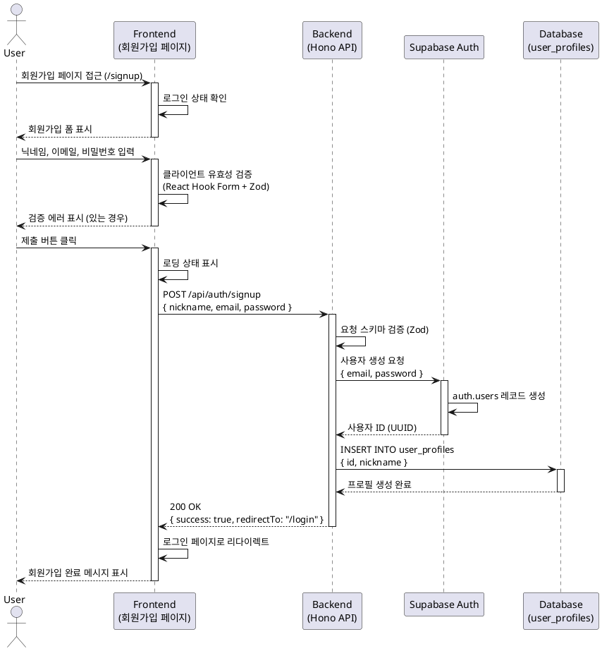

# 유스케이스: UC-001 회원가입

## 제목
사용자 회원가입 및 프로필 생성

---

## 1. 개요

### 1.1 목적
신규 사용자가 이메일과 비밀번호를 통해 계정을 생성하고, 채팅 서비스를 이용할 수 있도록 한다.

### 1.2 범위
- 회원가입 페이지에서의 사용자 입력 및 검증
- Supabase Auth를 통한 사용자 계정 생성
- 사용자 프로필 테이블에 닉네임 저장
- 회원가입 완료 후 로그인 페이지로 리다이렉트

**제외 사항**:
- 회원가입 후 자동 로그인 (사용자는 로그인 페이지에서 수동으로 로그인 필요)
- 소셜 로그인 (이메일/비밀번호 방식만 지원)
- 이메일 인증

### 1.3 액터
- **주요 액터**: 신규 사용자 (비회원)
- **부 액터**: Supabase Auth 시스템, 사용자 프로필 데이터베이스

---

## 2. 선행 조건

- 사용자는 비로그인 상태여야 한다.
- 사용자는 회원가입 페이지(`/signup`)에 접근할 수 있다.
- Supabase Auth 서비스가 정상 작동 중이어야 한다.

---

## 3. 참여 컴포넌트

- **프론트엔드 (FE)**:
  - 회원가입 페이지 (`/signup`)
  - React Hook Form + Zod를 통한 클라이언트 측 유효성 검증
  - 회원가입 API 호출 (`@/lib/remote/api-client`)

- **백엔드 (BE)**:
  - Hono 라우터 (`POST /api/auth/signup`)
  - 회원가입 서비스 로직 (`src/features/auth/backend/service.ts`)
  - Supabase Auth 연동

- **데이터베이스 (DB)**:
  - `auth.users` (Supabase Auth 관리)
  - `user_profiles` 테이블

---

## 4. 기본 플로우 (Basic Flow)

### 4.1 단계별 흐름

1. **사용자**: 회원가입 페이지 접근
   - 입력: URL `/signup` 접근
   - 처리: 이미 로그인된 경우 홈(`/`)으로 리다이렉트
   - 출력: 회원가입 폼 표시

2. **사용자**: 회원가입 정보 입력
   - 입력: 닉네임, 이메일, 비밀번호, 비밀번호 확인
   - 처리: 클라이언트 측 실시간 유효성 검증
     - 닉네임: 2~20자, 특수문자 제외
     - 이메일: 유효한 이메일 형식
     - 비밀번호: 8자 이상, 영문+숫자 조합
     - 비밀번호 확인: 비밀번호와 일치
   - 출력: 검증 오류 시 필드별 에러 메시지 표시

3. **사용자**: 제출 버튼 클릭
   - 입력: 검증된 폼 데이터
   - 처리: 제출 버튼 클릭 시 로딩 상태 표시
   - 출력: `POST /api/auth/signup` API 요청 전송

4. **백엔드**: 회원가입 요청 수신
   - 입력: `{ nickname, email, password }`
   - 처리:
     - 요청 스키마 검증 (Zod)
     - Supabase Auth를 통한 사용자 생성
     - `user_profiles` 테이블에 닉네임 저장
   - 출력: 성공 응답 또는 에러 응답

5. **Supabase Auth**: 사용자 계정 생성
   - 입력: 이메일, 비밀번호
   - 처리: `auth.users` 테이블에 사용자 레코드 생성
   - 출력: 생성된 사용자 ID (UUID)

6. **백엔드**: 사용자 프로필 생성
   - 입력: 사용자 ID, 닉네임
   - 처리: `user_profiles` 테이블에 INSERT
   - 출력: 생성된 프로필 정보

7. **프론트엔드**: 회원가입 완료 처리
   - 입력: 성공 응답
   - 처리: 로그인 페이지(`/login`)로 리다이렉트
   - 출력: 회원가입 완료 메시지 표시 (토스트 또는 페이지 상단)

### 4.2 시퀀스 다이어그램



---

## 5. 대안 플로우 (Alternative Flows)

### 5.1 대안 플로우 1: 이미 로그인된 사용자

**시작 조건**: 사용자가 로그인 상태에서 `/signup` 페이지 접근

**단계**:
1. 프론트엔드가 인증 상태 확인
2. 로그인된 상태임을 감지
3. 홈 페이지(`/`)로 자동 리다이렉트

**결과**: 회원가입 페이지가 표시되지 않고 홈으로 이동

---

## 6. 예외 플로우 (Exception Flows)

### 6.1 예외 상황 1: 이메일 중복

**발생 조건**: 이미 가입된 이메일로 회원가입 시도

**처리 방법**:
1. Supabase Auth가 중복 이메일 에러 반환
2. 백엔드가 에러 처리 및 응답
3. 프론트엔드가 이메일 필드 아래 에러 메시지 표시

**에러 코드**: `AUTH_EMAIL_DUPLICATE` (HTTP 409 Conflict)

**사용자 메시지**: "이미 가입된 이메일입니다."

---

### 6.2 예외 상황 2: 클라이언트 측 유효성 검증 실패

**발생 조건**: 입력값이 유효성 규칙을 위반

**처리 방법**:
1. React Hook Form이 실시간으로 검증
2. 해당 필드 아래 에러 메시지 표시
3. 제출 버튼 비활성화 또는 제출 차단

**에러 메시지 예시**:
- 닉네임: "닉네임은 2~20자여야 합니다."
- 이메일: "유효한 이메일 주소를 입력하세요."
- 비밀번호: "비밀번호는 8자 이상, 영문+숫자 조합이어야 합니다."
- 비밀번호 확인: "비밀번호가 일치하지 않습니다."

---

### 6.3 예외 상황 3: 네트워크 오류

**발생 조건**: API 요청 전송 중 네트워크 연결 끊김

**처리 방법**:
1. API 클라이언트가 네트워크 에러 감지
2. 프론트엔드가 에러 메시지 표시
3. 재시도 버튼 또는 폼 재제출 안내

**에러 코드**: `NETWORK_ERROR` (클라이언트 측)

**사용자 메시지**: "네트워크 연결을 확인해주세요."

---

### 6.4 예외 상황 4: 서버 오류

**발생 조건**: 백엔드 또는 Supabase Auth 서버 오류

**처리 방법**:
1. 백엔드가 5xx 에러 응답 반환
2. 에러 로깅 (서버 측)
3. 프론트엔드가 일반적인 에러 메시지 표시

**에러 코드**: `INTERNAL_SERVER_ERROR` (HTTP 500)

**사용자 메시지**: "일시적인 오류가 발생했습니다. 잠시 후 다시 시도해주세요."

---

### 6.5 예외 상황 5: 프로필 생성 실패

**발생 조건**: Supabase Auth 사용자는 생성되었으나 `user_profiles` 테이블 삽입 실패

**처리 방법**:
1. 백엔드가 트랜잭션 롤백 시도 (Supabase Auth는 별도 시스템이므로 롤백 불가)
2. 에러 로깅 및 관리자 알림
3. 사용자에게 에러 메시지 표시

**에러 코드**: `PROFILE_CREATION_FAILED` (HTTP 500)

**사용자 메시지**: "회원가입 중 오류가 발생했습니다. 고객센터로 문의해주세요."

**참고**: Supabase Auth와 DB 트랜잭션 분리로 인한 불일치 가능성 있음. 추후 트리거 또는 재시도 로직 추가 고려.

---

## 7. 후행 조건 (Post-conditions)

### 7.1 성공 시

- **데이터베이스 변경**:
  - `auth.users` 테이블에 새 사용자 레코드 생성
  - `user_profiles` 테이블에 닉네임 레코드 생성 (사용자 ID 참조)

- **시스템 상태**:
  - 사용자는 비로그인 상태 유지 (회원가입 후 자동 로그인 없음)
  - 로그인 페이지로 리다이렉트됨

- **외부 시스템**:
  - Supabase Auth에 사용자 계정 등록 완료

### 7.2 실패 시

- **데이터 롤백**:
  - 프로필 생성 실패 시 `user_profiles` 삽입 롤백
  - **단, Supabase Auth 사용자는 롤백 불가** (별도 시스템)

- **시스템 상태**:
  - 사용자는 여전히 비로그인 상태
  - 회원가입 페이지에 머무름
  - 에러 메시지 표시

---

## 8. 비즈니스 규칙 (Business Rules)

### 8.1 입력값 검증 규칙

- **닉네임**:
  - 길이: 2~20자
  - 허용 문자: 한글, 영문, 숫자 (특수문자 제외)
  - 필수 입력

- **이메일**:
  - 유효한 이메일 형식 (`RFC 5322` 준수)
  - 중복 불가
  - 필수 입력

- **비밀번호**:
  - 길이: 8자 이상
  - 조합: 영문 + 숫자 포함 (특수문자 선택)
  - 필수 입력

- **비밀번호 확인**:
  - 비밀번호와 일치해야 함
  - 필수 입력

### 8.2 보안 규칙

- 비밀번호는 평문으로 저장되지 않음 (Supabase Auth가 해시 처리)
- HTTPS 통신 필수
- XSS 방지: 닉네임 입력값 sanitization

### 8.3 UX 규칙

- 입력값 유효성 검증은 실시간으로 수행 (onBlur 또는 onChange)
- 제출 중에는 로딩 인디케이터 표시 및 중복 제출 방지
- 에러 메시지는 필드별로 명확하게 표시

---

## 9. 비기능 요구사항

### 9.1 성능
- API 응답 시간: 평균 500ms 이하
- 회원가입 완료까지 총 소요 시간: 3초 이내

### 9.2 보안
- Supabase Auth를 통한 비밀번호 해시 처리
- CSRF 방지: Supabase Auth 토큰 사용
- XSS 방지: 닉네임 입력값 sanitization
- 비밀번호는 네트워크 전송 시 HTTPS로 암호화

### 9.3 가용성
- Supabase Auth 서비스 가용성: 99.9% 이상
- 회원가입 실패 시 재시도 가능

---

## 10. UI/UX 요구사항

### 10.1 화면 구성

**필수 UI 요소**:
- 닉네임 입력 필드 (텍스트)
- 이메일 입력 필드 (이메일)
- 비밀번호 입력 필드 (password)
- 비밀번호 확인 입력 필드 (password)
- 제출 버튼 ("회원가입")
- 로그인 페이지로 이동 링크 ("이미 계정이 있으신가요?")

**선택 UI 요소**:
- 비밀번호 표시/숨기기 토글 아이콘
- 입력 필드별 검증 상태 아이콘 (성공: 체크, 실패: X)

### 10.2 사용자 경험

- **입력 시**:
  - 실시간 유효성 검증
  - 포커스 이동 시 검증 결과 표시

- **제출 시**:
  - 로딩 인디케이터 표시
  - 제출 버튼 비활성화 (중복 제출 방지)

- **성공 시**:
  - 로그인 페이지로 즉시 리다이렉트
  - 성공 메시지 표시 (토스트 또는 페이지 상단)

- **실패 시**:
  - 에러 메시지 필드별 또는 상단에 표시
  - 포커스를 첫 번째 에러 필드로 이동

---

## 11. API 명세

### 11.1 회원가입 API

**Endpoint**: `POST /api/auth/signup`

**요청 스키마**:
```typescript
{
  nickname: string,  // 2~20자, 특수문자 제외
  email: string,     // 유효한 이메일 형식
  password: string   // 8자 이상, 영문+숫자 조합
}
```

**응답 스키마 (성공)**:
```typescript
{
  success: true,
  redirectTo: "/login"
}
```

**응답 스키마 (실패)**:
```typescript
{
  success: false,
  error: {
    code: string,    // AUTH_EMAIL_DUPLICATE, VALIDATION_ERROR 등
    message: string  // 사용자에게 표시할 메시지
  }
}
```

---

## 12. 테스트 시나리오

### 12.1 성공 케이스

| 테스트 케이스 ID | 입력값 | 기대 결과 |
|----------------|--------|----------|
| TC-001-01 | nickname: "테스터", email: "test@example.com", password: "test1234" | 회원가입 성공, 로그인 페이지 리다이렉트 |
| TC-001-02 | nickname: "홍길동123", email: "hong@test.com", password: "password99" | 회원가입 성공, `user_profiles`에 닉네임 저장 |

### 12.2 실패 케이스

| 테스트 케이스 ID | 입력값 | 기대 결과 |
|----------------|--------|----------|
| TC-001-03 | 중복 이메일 | HTTP 409, "이미 가입된 이메일입니다." |
| TC-001-04 | nickname: "A" (1자) | 클라이언트 검증 실패, "닉네임은 2~20자여야 합니다." |
| TC-001-05 | email: "invalid-email" | 클라이언트 검증 실패, "유효한 이메일 주소를 입력하세요." |
| TC-001-06 | password: "1234" (짧음) | 클라이언트 검증 실패, "비밀번호는 8자 이상이어야 합니다." |
| TC-001-07 | password: "abcdefgh" (숫자 없음) | 클라이언트 검증 실패, "영문+숫자 조합이어야 합니다." |
| TC-001-08 | passwordConfirm 불일치 | 클라이언트 검증 실패, "비밀번호가 일치하지 않습니다." |

---

## 13. 관련 유스케이스

- **선행 유스케이스**: 없음 (첫 진입점)
- **후행 유스케이스**:
  - UC-002 로그인
  - UC-003 홈 - 채팅방 목록 조회
- **연관 유스케이스**:
  - UC-007 닉네임 수정 (마이페이지)
  - UC-008 로그아웃

---

## 14. 변경 이력

| 버전 | 날짜 | 작성자 | 변경 내용 |
|------|------|--------|-----------|
| 1.0  | 2025-10-20 | Claude Code | 초기 작성 |

---

## 부록

### A. 용어 정의

- **Supabase Auth**: Supabase 플랫폼에서 제공하는 사용자 인증 서비스
- **user_profiles**: 사용자 프로필 정보를 저장하는 커스텀 테이블 (닉네임 등)
- **sanitization**: 악의적인 스크립트나 코드 주입을 방지하기 위한 입력값 정제 과정

### B. 참고 자료

- Supabase Auth 문서: https://supabase.com/docs/guides/auth
- React Hook Form 문서: https://react-hook-form.com/
- Zod 스키마 검증: https://zod.dev/
- PRD 문서: `/docs/prd.md`
- Userflow 문서: `/docs/userflow.md` (1.1 회원가입)
- 데이터베이스 설계: `/docs/database.md`
