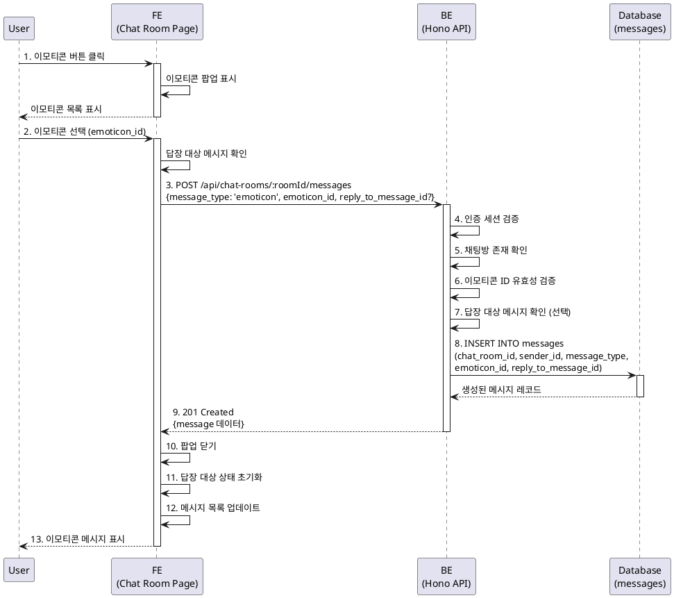

# 유스케이스: 이모티콘 메시지 전송

## 유스케이스 ID: UC-010

### 제목
채팅방에서 이모티콘 메시지 전송

---

## 1. 개요

### 1.1 목적
사용자가 채팅방에서 텍스트 대신 이모티콘을 선택하여 메시지로 전송할 수 있도록 한다. 이를 통해 사용자는 감정과 반응을 시각적으로 표현할 수 있으며, 텍스트 입력 없이 간편하게 소통할 수 있다.

### 1.2 범위
- 이모티콘 선택 팝업 표시
- 이모티콘 선택 및 전송
- 답장 대상 메시지가 있는 경우 답장 정보와 함께 전송
- 이모티콘 메시지의 채팅방 메시지 목록 표시

**제외 사항**:
- 이모티콘 관리 기능 (추가/삭제/편집)
- 커스텀 이모티콘 업로드
- 이모티콘 전송 취소 기능

### 1.3 액터
- **주요 액터**: 인증된 사용자
- **부 액터**: 없음

---

## 2. 선행 조건

- 사용자가 로그인된 상태여야 한다.
- 사용자가 채팅방 상세 페이지(`/chat-rooms/:id`)에 접근해 있어야 한다.
- 채팅방이 존재해야 한다.
- 이모티콘 목록이 시스템에 정의되어 있어야 한다.

---

## 3. 참여 컴포넌트

- **프론트엔드 (채팅방 상세 페이지)**: 이모티콘 버튼 제공, 이모티콘 선택 팝업 표시, 메시지 전송 요청
- **백엔드 API**: 메시지 생성 및 저장 (`POST /api/chat-rooms/:roomId/messages`)
- **데이터베이스**: `messages` 테이블에 이모티콘 메시지 삽입
- **상태 관리**: 답장 대상 메시지 상태 관리 (Zustand/React State)

---

## 4. 기본 플로우 (Basic Flow)

### 4.1 단계별 흐름

1. **사용자**: 채팅방 상세 페이지 하단 입력 영역에서 이모티콘 버튼을 클릭한다.
   - 입력: 이모티콘 버튼 클릭 이벤트
   - 처리: 이모티콘 선택 팝업(모달) 표시
   - 출력: 이모티콘 목록이 그리드 형태로 표시되는 팝업

2. **사용자**: 이모티콘 선택 팝업에서 원하는 이모티콘을 클릭한다.
   - 입력: 이모티콘 선택 이벤트 (이모티콘 ID)
   - 처리: 선택된 이모티콘 ID 확인
   - 출력: 선택된 이모티콘 정보 (ID)

3. **프론트엔드**: 답장 대상 메시지 상태를 확인한다.
   - 입력: 현재 답장 대상 메시지 상태 (ID 또는 null)
   - 처리: 답장 대상 메시지 ID가 있으면 함께 전송 준비
   - 출력: 메시지 전송 요청 데이터 구성

4. **프론트엔드**: 백엔드 API에 이모티콘 메시지 전송 요청을 보낸다.
   - 입력: `POST /api/chat-rooms/:roomId/messages`
     - Body: `{ message_type: 'emoticon', emoticon_id: string, reply_to_message_id?: uuid }`
   - 처리: HTTP 요청 전송
   - 출력: API 응답 대기

5. **백엔드**: 요청 유효성 검증 (인증, 채팅방 존재, 이모티콘 ID 유효성)
   - 입력: 요청 헤더 (인증 토큰), 요청 바디 (메시지 데이터)
   - 처리:
     - Supabase Auth 세션 검증
     - 채팅방 존재 여부 확인
     - 이모티콘 ID가 정의된 목록에 포함되는지 검증
     - 답장 대상 메시지 ID가 있다면 해당 메시지 존재 여부 확인
   - 출력: 검증 결과 (성공 또는 에러)

6. **백엔드**: 데이터베이스에 이모티콘 메시지 삽입
   - 입력: 메시지 데이터 (chat_room_id, sender_id, message_type, emoticon_id, reply_to_message_id)
   - 처리: `messages` 테이블에 신규 레코드 INSERT
   - 출력: 생성된 메시지 레코드 (id, created_at 포함)

7. **백엔드**: 생성된 메시지 정보를 응답으로 반환
   - 입력: 생성된 메시지 레코드
   - 처리: 응답 포맷 구성 (JSON)
   - 출력: HTTP 201 Created + 메시지 정보

8. **프론트엔드**: 응답 수신 후 처리
   - 입력: 백엔드 응답 (메시지 정보)
   - 처리:
     - 이모티콘 선택 팝업 닫기
     - 답장 대상 메시지 상태 초기화
     - 메시지 목록에 새 메시지 추가 (React Query 캐시 업데이트 또는 재조회)
   - 출력: 메시지 목록에 이모티콘 메시지 표시

9. **사용자**: 전송된 이모티콘 메시지를 메시지 목록에서 확인한다.
   - 입력: 업데이트된 메시지 목록
   - 처리: UI 렌더링
   - 출력: 이모티콘 이미지가 메시지로 표시됨

### 4.2 시퀀스 다이어그램

---

## 5. 대안 플로우 (Alternative Flows)

### 5.1 대안 플로우 1: 이모티콘 선택 후 팝업 외부 클릭

**시작 조건**: 이모티콘 선택 팝업이 표시된 상태에서 사용자가 팝업 외부 영역을 클릭

**단계**:
1. 프론트엔드가 팝업 외부 클릭 이벤트 감지
2. 이모티콘 선택 팝업 닫기
3. 메시지 전송 없이 입력 영역으로 복귀

**결과**: 메시지가 전송되지 않고 팝업만 닫힘

### 5.2 대안 플로우 2: 답장 대상 메시지와 함께 이모티콘 전송

**시작 조건**: 답장 대상 메시지가 설정된 상태에서 이모티콘 전송

**단계**:
1. 사용자가 이모티콘 버튼 클릭 (답장 대상 메시지 미리보기가 입력창 상단에 표시된 상태)
2. 이모티콘 선택 팝업 표시
3. 이모티콘 선택
4. 백엔드 API 요청 시 `reply_to_message_id` 포함
5. 데이터베이스에 답장 정보와 함께 메시지 저장
6. 응답 수신 후 답장 대상 상태 초기화
7. 메시지 목록에 답장 정보를 포함한 이모티콘 메시지 표시

**결과**: 답장 대상 메시지와 연결된 이모티콘 메시지 전송 성공

---

## 6. 예외 플로우 (Exception Flows)

### 6.1 예외 상황 1: 인증되지 않은 사용자

**발생 조건**: 사용자 세션이 만료되었거나 유효하지 않은 경우

**처리 방법**:
1. 백엔드에서 401 Unauthorized 응답
2. 프론트엔드에서 인증 상태 초기화
3. 로그인 페이지로 리다이렉트

**에러 코드**: `401 Unauthorized`

**사용자 메시지**: "세션이 만료되었습니다. 다시 로그인해주세요."

### 6.2 예외 상황 2: 존재하지 않는 채팅방

**발생 조건**: 채팅방이 삭제되었거나 유효하지 않은 채팅방 ID

**처리 방법**:
1. 백엔드에서 404 Not Found 응답
2. 프론트엔드에서 에러 메시지 표시
3. 홈 페이지로 리다이렉트 안내

**에러 코드**: `404 Not Found`

**사용자 메시지**: "채팅방을 찾을 수 없습니다."

### 6.3 예외 상황 3: 유효하지 않은 이모티콘 ID

**발생 조건**: 정의되지 않은 이모티콘 ID를 전송한 경우

**처리 방법**:
1. 백엔드에서 400 Bad Request 응답
2. 프론트엔드에서 에러 메시지 표시
3. 팝업 유지 또는 닫기, 재시도 안내

**에러 코드**: `400 Bad Request`

**사용자 메시지**: "유효하지 않은 이모티콘입니다."

### 6.4 예외 상황 4: 답장 대상 메시지가 삭제된 경우

**발생 조건**: 답장 대상 메시지 ID가 유효하지 않거나 이미 삭제된 경우

**처리 방법**:
1. 백엔드에서 답장 대상 메시지 존재 여부 확인
2. 존재하지 않으면 `reply_to_message_id`를 null로 처리하여 일반 메시지로 저장
3. 정상 응답 반환

**에러 코드**: 없음 (정상 처리)

**사용자 메시지**: 없음 (일반 메시지로 전송됨)

### 6.5 예외 상황 5: 네트워크 연결 오류

**발생 조건**: API 요청 중 네트워크 연결이 끊긴 경우

**처리 방법**:
1. 프론트엔드에서 네트워크 에러 감지
2. 에러 메시지 표시
3. 재시도 버튼 제공 또는 팝업 유지

**에러 코드**: `Network Error`

**사용자 메시지**: "네트워크 연결을 확인해주세요."

### 6.6 예외 상황 6: 서버 오류 (5xx)

**발생 조건**: 백엔드에서 예상치 못한 오류 발생

**처리 방법**:
1. 백엔드에서 500 Internal Server Error 응답
2. 서버 측 에러 로깅
3. 프론트엔드에서 일반 에러 메시지 표시
4. 팝업 닫기 또는 재시도 안내

**에러 코드**: `500 Internal Server Error`

**사용자 메시지**: "메시지 전송에 실패했습니다. 잠시 후 다시 시도해주세요."

---

## 7. 후행 조건 (Post-conditions)

### 7.1 성공 시

- **데이터베이스 변경**:
  - `messages` 테이블에 신규 레코드 삽입
  - 컬럼 값:
    - `id`: 자동 생성된 UUID
    - `chat_room_id`: 현재 채팅방 ID
    - `sender_id`: 현재 사용자 ID
    - `message_type`: `'emoticon'`
    - `content`: `NULL`
    - `emoticon_id`: 선택한 이모티콘 ID
    - `reply_to_message_id`: 답장 대상 메시지 ID (선택)
    - `created_at`: 현재 시간
- **시스템 상태**:
  - 채팅방 메시지 목록에 새 이모티콘 메시지 추가
  - 답장 대상 메시지 상태 초기화
  - 이모티콘 선택 팝업 닫힘
- **외부 시스템**: 없음

### 7.2 실패 시

- **데이터 롤백**: 데이터베이스에 변경 사항 없음
- **시스템 상태**:
  - 에러 메시지 표시
  - 이모티콘 선택 팝업 유지 또는 닫힘 (에러 유형에 따라)
  - 답장 대상 메시지 상태 유지

---

## 8. 비즈니스 규칙 (Business Rules)

### BR-010-1: 이모티콘 메시지 구성
- 이모티콘 메시지는 텍스트 내용(`content`)을 가지지 않는다.
- 이모티콘 ID(`emoticon_id`)만 저장된다.
- `message_type`은 반드시 `'emoticon'`이어야 한다.

### BR-010-2: 이모티콘 ID 검증
- 백엔드는 이모티콘 ID가 시스템에 정의된 유효한 값인지 검증해야 한다.
- 유효하지 않은 이모티콘 ID는 400 Bad Request로 거부된다.

### BR-010-3: 답장 대상 메시지 처리
- 답장 대상 메시지가 설정된 경우, 이모티콘 메시지도 답장 정보를 포함할 수 있다.
- 답장 대상 메시지가 삭제된 경우, `reply_to_message_id`를 null로 처리하여 일반 메시지로 저장한다.

### BR-010-4: 이모티콘 선택 즉시 전송
- 이모티콘 선택 팝업에서 이모티콘을 클릭하면 즉시 전송된다.
- 별도의 전송 버튼을 클릭할 필요가 없다.

### BR-010-5: 전송 후 상태 초기화
- 이모티콘 메시지 전송 성공 시 답장 대상 메시지 상태가 자동으로 초기화된다.
- 이모티콘 선택 팝업이 자동으로 닫힌다.

---

## 9. 비기능 요구사항

### 9.1 성능
- 이모티콘 선택 팝업은 버튼 클릭 후 즉시(100ms 이내) 표시되어야 한다.
- 이모티콘 이미지는 레이지 로딩을 통해 필요 시 로드되어야 한다.
- API 응답 시간은 평균 500ms 이하여야 한다.
- 메시지 목록 업데이트는 전송 후 1초 이내에 완료되어야 한다.

### 9.2 보안
- Supabase Auth 세션 검증을 통해 인증된 사용자만 메시지를 전송할 수 있다.
- 이모티콘 ID는 백엔드에서 검증되어야 한다.
- XSS 공격 방지를 위해 이모티콘 ID는 sanitize되어야 한다.

### 9.3 가용성
- 네트워크 오류 발생 시 재시도 메커니즘을 제공한다.
- 서버 오류 발생 시 사용자에게 명확한 피드백을 제공한다.

---

## 10. UI/UX 요구사항

### 10.1 화면 구성

#### 이모티콘 버튼
- **위치**: 채팅방 하단 입력창 좌측 또는 우측
- **아이콘**: 이모티콘 아이콘 (예: 😊, 이모티콘 이미지)
- **상태**: 클릭 가능한 버튼 형태

#### 이모티콘 선택 팝업
- **형태**: 모달 또는 바텀 시트
- **내용**:
  - 이모티콘 목록 (그리드 형태)
  - 각 이모티콘은 클릭 가능한 버튼
  - 닫기 버튼 (X 아이콘 또는 팝업 외부 클릭)
- **스타일**:
  - 배경: 반투명 또는 흰색
  - 이모티콘 크기: 적절한 크기로 표시 (터치하기 쉽게)
  - 그리드: 4~6개 열 (화면 크기에 따라 반응형)

#### 메시지 목록의 이모티콘 메시지
- **표시**: 이모티콘 이미지만 표시 (텍스트 없음)
- **크기**: 텍스트 메시지보다 크게 표시 (예: 2~3배)
- **정렬**: 내 메시지는 우측, 남의 메시지는 좌측
- **답장 정보**: 답장 대상 메시지가 있는 경우 답장 정보 표시 (카카오톡 스타일)

### 10.2 사용자 경험

- **간편성**: 이모티콘 버튼 클릭 → 이모티콘 선택 → 즉시 전송 (3단계)
- **직관성**: 이모티콘 선택 팝업은 명확하고 직관적으로 표시
- **피드백**: 전송 중 로딩 인디케이터 표시 (선택 사항)
- **일관성**: 카카오톡과 유사한 이모티콘 전송 경험
- **답장 연동**: 답장 대상 메시지가 있을 때도 자연스럽게 이모티콘 전송 가능

---

## 11. 테스트 시나리오

### 11.1 성공 케이스

| 테스트 케이스 ID | 입력값 | 기대 결과 |
|-----------------|--------|----------|
| TC-010-01 | 이모티콘 버튼 클릭 | 이모티콘 선택 팝업 표시 |
| TC-010-02 | 유효한 이모티콘 선택 (예: 'smile') | 이모티콘 메시지 전송 성공, 메시지 목록에 표시 |
| TC-010-03 | 답장 대상 메시지 설정 + 이모티콘 선택 | 답장 정보를 포함한 이모티콘 메시지 전송 성공 |
| TC-010-04 | 팝업 외부 클릭 | 팝업 닫기, 전송 안 됨 |
| TC-010-05 | 이모티콘 전송 후 답장 대상 상태 | 답장 대상 메시지 상태 초기화 확인 |

### 11.2 실패 케이스

| 테스트 케이스 ID | 입력값 | 기대 결과 |
|-----------------|--------|----------|
| TC-010-06 | 인증되지 않은 사용자 | 401 Unauthorized, 로그인 페이지로 리다이렉트 |
| TC-010-07 | 존재하지 않는 채팅방 ID | 404 Not Found, 에러 메시지 표시 |
| TC-010-08 | 유효하지 않은 이모티콘 ID | 400 Bad Request, 에러 메시지 표시 |
| TC-010-09 | 답장 대상 메시지가 삭제된 경우 | 일반 메시지로 전송, 에러 없음 |
| TC-010-10 | 네트워크 연결 끊김 | 네트워크 에러 메시지, 재시도 안내 |
| TC-010-11 | 서버 오류 (500) | 서버 에러 메시지 표시 |

---

## 12. 관련 유스케이스

- **선행 유스케이스**:
  - UC-002 (로그인): 사용자 인증 필요
  - UC-007 (채팅방 상세 조회): 채팅방에 접근해 있어야 함
  - UC-008 (메시지 목록 조회): 기존 메시지 목록을 볼 수 있어야 함
- **후행 유스케이스**:
  - UC-011 (메시지 답장): 전송된 이모티콘 메시지에 대한 답장 가능
  - UC-012 (메시지 좋아요): 전송된 이모티콘 메시지에 좋아요 가능
- **연관 유스케이스**:
  - UC-009 (텍스트 메시지 전송): 유사한 메시지 전송 플로우
  - UC-013 (메시지 삭제): 전송된 이모티콘 메시지 삭제 가능

---

## 13. 변경 이력

| 버전 | 날짜 | 작성자 | 변경 내용 |
|------|------|--------|-----------|
| 1.0 | 2025-10-20 | Claude Code | 초기 작성 |

---

## 부록

### A. 용어 정의

- **이모티콘 (Emoticon)**: 감정이나 반응을 표현하는 시각적 아이콘 또는 이미지
- **이모티콘 ID**: 시스템에서 각 이모티콘을 식별하는 고유 문자열 (예: 'smile', 'heart', 'thumbsup')
- **답장 대상 메시지 (Reply-To Message)**: 특정 메시지에 대한 응답으로 전송되는 메시지의 원본 메시지
- **메시지 타입 (Message Type)**: 메시지의 유형을 나타내는 구분 값 ('text' 또는 'emoticon')

### B. 참고 자료

- PRD: `/docs/prd.md` - 6.3 메시지 전송 및 조회 > F-009: 이모티콘 메시지 전송
- Userflow: `/docs/userflow.md` - 3.3 이모티콘 메시지 전송
- Database: `/docs/database.md` - 3.3 메시지 (messages) 테이블
- API 명세: PRD 8.4 메시지 > `POST /api/chat-rooms/:roomId/messages`
