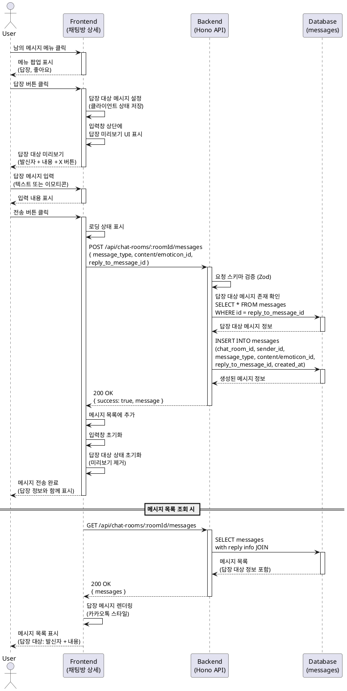

# 유스케이스: UC-011 메시지 답장

## 제목
특정 메시지에 대한 답장 전송

---

## 1. 개요

### 1.1 목적
사용자가 채팅방 내에서 특정 메시지를 선택하여 답장을 보낼 수 있도록 하여, 대화 맥락을 명확하게 유지하고 원활한 소통을 지원한다.

### 1.2 범위
- 채팅방 상세 페이지에서 남의 메시지에 대한 답장 버튼 제공
- 답장 대상 메시지 선택 및 미리보기 표시
- 답장 대상 설정 취소 기능
- 텍스트 또는 이모티콘 메시지 전송 시 답장 대상 정보 포함
- 메시지 목록에서 답장 정보 표시 (카카오톡 스타일)

**제외 사항**:
- 내 메시지에 대한 답장 (답장 버튼이 표시되지 않음)
- 답장의 답장 (중첩 답장 없음, 1단계만 지원)
- 답장 메시지 편집 또는 삭제 (일반 메시지 삭제 규칙 동일)

### 1.3 액터
- **주요 액터**: 로그인된 사용자
- **부 액터**: 메시지 데이터베이스, 답장 대상 메시지 발신자

---

## 2. 선행 조건

- 사용자는 로그인 상태여야 한다.
- 사용자는 채팅방 상세 페이지(`/chat-rooms/:id`)에 접근한 상태여야 한다.
- 채팅방에 최소 1개 이상의 메시지가 존재해야 한다.
- 답장하려는 메시지는 남의 메시지여야 한다 (본인 메시지는 제외).

---

## 3. 참여 컴포넌트

- **프론트엔드 (FE)**:
  - 채팅방 상세 페이지 (`/chat-rooms/:id`)
  - 메시지 메뉴 컴포넌트 (답장 버튼 포함)
  - 답장 대상 미리보기 컴포넌트 (입력창 상단)
  - 메시지 전송 API 호출 (`@/lib/remote/api-client`)

- **백엔드 (BE)**:
  - Hono 라우터 (`POST /api/chat-rooms/:roomId/messages`)
  - 메시지 전송 서비스 로직 (`src/features/messages/backend/service.ts`)
  - 답장 대상 메시지 검증

- **데이터베이스 (DB)**:
  - `messages` 테이블 (답장 대상 메시지 ID 저장)
  - `user_profiles` 테이블 (답장 대상 발신자 정보 조회)

---

## 4. 기본 플로우 (Basic Flow)

### 4.1 단계별 흐름

1. **사용자**: 답장하려는 메시지 선택
   - 입력: 메시지 메뉴 버튼 클릭 (남의 메시지)
   - 처리: 메뉴 팝업 표시 (답장, 좋아요 버튼)
   - 출력: 메뉴 팝업 화면

2. **사용자**: 답장 버튼 클릭
   - 입력: 답장 버튼 클릭
   - 처리:
     - 선택한 메시지를 답장 대상으로 설정 (클라이언트 상태 저장)
     - 입력창 상단에 답장 대상 미리보기 UI 표시
   - 출력: 답장 대상 미리보기 표시
     - 발신자 닉네임 + 메시지 내용 (텍스트는 원본, 이모티콘은 이모티콘 표시)
     - 우측 X 버튼 (답장 취소)

3. **사용자**: 답장 메시지 입력
   - 입력: 텍스트 입력 또는 이모티콘 선택
   - 처리: 일반 메시지 입력과 동일
   - 출력: 입력창에 메시지 내용 표시

4. **사용자**: 전송 버튼 클릭
   - 입력: 전송 버튼 클릭 또는 Enter 키
   - 처리:
     - 답장 대상 메시지 ID를 포함한 메시지 전송 요청
     - `POST /api/chat-rooms/:roomId/messages`
     - 요청 본문: `{ message_type, content/emoticon_id, reply_to_message_id }`
   - 출력: API 요청 전송

5. **백엔드**: 메시지 전송 요청 처리
   - 입력: `{ chat_room_id, sender_id, message_type, content/emoticon_id, reply_to_message_id }`
   - 처리:
     - 요청 스키마 검증 (Zod)
     - 답장 대상 메시지 존재 여부 확인
     - `messages` 테이블에 INSERT (reply_to_message_id 포함)
   - 출력: 성공 응답 또는 에러 응답

6. **데이터베이스**: 메시지 저장
   - 입력: 메시지 데이터 (답장 대상 ID 포함)
   - 처리: `messages` 테이블에 레코드 삽입
   - 출력: 생성된 메시지 정보

7. **프론트엔드**: 전송 완료 처리
   - 입력: 성공 응답
   - 처리:
     - 메시지 목록에 새 메시지 추가
     - 입력창 초기화
     - 답장 대상 상태 초기화 (미리보기 UI 제거)
   - 출력: 메시지 목록 업데이트, 답장 정보와 함께 표시

8. **메시지 목록 표시**: 답장 메시지 렌더링
   - 입력: 메시지 데이터 (reply_to_message_id 포함)
   - 처리:
     - 답장 대상 메시지 정보 조회 (발신자 닉네임 + 내용)
     - 카카오톡 스타일로 답장 정보 표시
   - 출력: 메시지 말풍선 내 답장 대상 정보 렌더링

### 4.2 시퀀스 다이어그램



---

## 5. 대안 플로우 (Alternative Flows)

### 5.1 대안 플로우 1: 답장 취소

**시작 조건**: 사용자가 답장 대상을 설정한 상태

**단계**:
1. 사용자가 답장 미리보기 UI의 X 버튼 클릭
2. 프론트엔드가 답장 대상 상태 초기화
3. 답장 미리보기 UI 제거
4. 일반 메시지 입력 모드로 전환

**결과**: 답장 대상이 해제되고 일반 메시지 전송 모드로 복귀

---

### 5.2 대안 플로우 2: 다른 메시지에 답장 변경

**시작 조건**: 사용자가 이미 답장 대상을 설정한 상태에서 다른 메시지의 답장 버튼 클릭

**단계**:
1. 사용자가 다른 메시지의 메뉴에서 답장 버튼 클릭
2. 프론트엔드가 기존 답장 대상을 새 메시지로 교체
3. 답장 미리보기 UI 업데이트 (새 메시지 정보 표시)

**결과**: 답장 대상이 새 메시지로 변경됨

---

### 5.3 대안 플로우 3: 답장 대상이 삭제된 메시지인 경우

**시작 조건**: 답장 대상 메시지가 설정된 상태에서 해당 메시지가 삭제됨

**단계**:
1. 답장 대상 메시지가 다른 사용자에 의해 삭제됨
2. 프론트엔드가 메시지 목록 업데이트 감지
3. 답장 대상 상태 자동 초기화
4. 답장 미리보기 UI 제거

**결과**: 답장 대상이 자동으로 해제되고 일반 메시지 입력 모드로 전환

**참고**: 실시간 업데이트가 없는 경우, 전송 시점에 백엔드에서 답장 대상 메시지 존재 여부를 확인하고 없으면 일반 메시지로 처리

---

## 6. 예외 플로우 (Exception Flows)

### 6.1 예외 상황 1: 답장 대상 메시지가 존재하지 않음

**발생 조건**: 메시지 전송 시점에 답장 대상 메시지가 삭제됨

**처리 방법**:
1. 백엔드가 답장 대상 메시지 존재 여부 확인
2. 존재하지 않을 경우:
   - Option A: 답장 대상 정보를 무시하고 일반 메시지로 저장
   - Option B: 에러 응답 반환
3. 프론트엔드가 에러 처리 (Option B인 경우)

**에러 코드**: `REPLY_TARGET_NOT_FOUND` (HTTP 404)

**사용자 메시지**: "답장 대상 메시지가 삭제되었습니다. 일반 메시지로 전송됩니다."

**비즈니스 결정**: Option A (일반 메시지로 저장) 권장 - 사용자 경험 우선

---

### 6.2 예외 상황 2: 내 메시지에 답장 시도

**발생 조건**: 클라이언트 측 제어를 우회하여 내 메시지에 답장 시도

**처리 방법**:
1. 프론트엔드에서 내 메시지에는 답장 버튼을 표시하지 않음
2. 만약 API 직접 호출로 시도 시 백엔드에서 검증 (선택 사항)

**에러 코드**: `INVALID_REPLY_TARGET` (HTTP 400)

**사용자 메시지**: "본인 메시지에는 답장할 수 없습니다."

**참고**: 기획상 내 메시지에도 답장 허용 가능성이 있으므로, 현재는 프론트엔드 제어만으로 충분

---

### 6.3 예외 상황 3: 답장 메시지 전송 실패

**발생 조건**: 네트워크 오류 또는 서버 오류로 메시지 전송 실패

**처리 방법**:
1. API 클라이언트가 에러 감지
2. 프론트엔드가 에러 메시지 표시
3. 답장 대상 상태는 유지 (재전송 가능)
4. 입력 내용도 유지 (데이터 손실 방지)

**에러 코드**: `MESSAGE_SEND_FAILED` (HTTP 500 또는 네트워크 에러)

**사용자 메시지**: "메시지 전송에 실패했습니다. 다시 시도해주세요."

---

### 6.4 예외 상황 4: 답장 대상 메시지가 다른 채팅방의 메시지

**발생 조건**: 클라이언트 측 버그 또는 악의적 요청으로 다른 채팅방 메시지 ID 전송

**처리 방법**:
1. 백엔드에서 답장 대상 메시지의 `chat_room_id` 검증
2. 현재 채팅방과 다를 경우 에러 응답

**에러 코드**: `INVALID_REPLY_TARGET_CHAT_ROOM` (HTTP 400)

**사용자 메시지**: "잘못된 답장 대상입니다."

---

## 7. 후행 조건 (Post-conditions)

### 7.1 성공 시

- **데이터베이스 변경**:
  - `messages` 테이블에 새 메시지 레코드 생성
  - `reply_to_message_id` 필드에 답장 대상 메시지 ID 저장

- **시스템 상태**:
  - 답장 대상 상태 초기화 (클라이언트)
  - 입력창 초기화
  - 메시지 목록에 답장 메시지 추가

- **외부 시스템**:
  - 실시간 업데이트 활성화 시 다른 사용자에게도 메시지 전파

### 7.2 실패 시

- **데이터 롤백**:
  - 메시지 저장 실패 시 DB 트랜잭션 롤백

- **시스템 상태**:
  - 답장 대상 상태 유지 (재전송 가능)
  - 입력 내용 유지 (데이터 손실 방지)
  - 에러 메시지 표시

---

## 8. 비즈니스 규칙 (Business Rules)

### 8.1 답장 대상 선택 규칙

- **허용**:
  - 남의 메시지에만 답장 가능
  - 텍스트/이모티콘 모든 유형의 메시지에 답장 가능
  - 이미 답장된 메시지에도 답장 가능 (중첩 답장은 1단계만 표시)

- **제한**:
  - 내 메시지에는 답장 버튼이 표시되지 않음 (기획상 제한)
  - 삭제된 메시지에는 답장 불가

### 8.2 답장 메시지 저장 규칙

- 답장 대상 메시지 ID는 `reply_to_message_id` 필드에 저장
- 답장 대상 메시지가 삭제될 경우 `reply_to_message_id`는 NULL로 설정 (ON DELETE SET NULL)
- 답장 메시지 자체는 삭제되지 않음 (답장 정보만 제거)

### 8.3 UI 표시 규칙

- 답장 대상 미리보기:
  - 발신자 닉네임 + 메시지 내용 (20자 이내로 요약 가능)
  - 이모티콘 메시지인 경우 이모티콘 아이콘 표시
  - X 버튼으로 취소 가능

- 메시지 목록에서 답장 표시:
  - 카카오톡 스타일: 메시지 말풍선 내 상단에 답장 대상 정보 표시
  - 답장 대상 메시지가 삭제된 경우: "삭제된 메시지" 또는 답장 정보 생략

---

## 9. 비기능 요구사항

### 9.1 성능
- 답장 메시지 전송 응답 시간: 평균 500ms 이하 (일반 메시지와 동일)
- 메시지 목록 조회 시 답장 정보 JOIN 쿼리 최적화

### 9.2 보안
- 답장 대상 메시지 ID 검증 (존재 여부, 채팅방 일치 여부)
- XSS 방지: 답장 대상 메시지 내용 sanitization

### 9.3 가용성
- 답장 대상 메시지 삭제 시에도 답장 메시지는 유지 (데이터 무결성)
- 실시간 업데이트 실패 시에도 수동 새로고침으로 답장 정보 확인 가능

---

## 10. UI/UX 요구사항

### 10.1 화면 구성

**메시지 메뉴 (남의 메시지)**:
- 답장 버튼
- 좋아요 버튼

**답장 미리보기 UI (입력창 상단)**:
- 발신자 닉네임
- 메시지 내용 미리보기 (텍스트 또는 이모티콘)
- X 버튼 (답장 취소)

**메시지 목록 - 답장 메시지 표시**:
- 메시지 말풍선 내 상단에 답장 대상 정보 표시
- 답장 대상: 발신자 닉네임 + 메시지 내용 (요약)
- 카카오톡과 유사한 스타일 (배경색, 폰트 크기 등)

### 10.2 사용자 경험

- **답장 선택 시**:
  - 메뉴에서 답장 버튼 클릭 → 즉시 미리보기 표시
  - 입력창으로 자동 포커스 이동

- **답장 취소 시**:
  - X 버튼 클릭 → 미리보기 제거
  - 입력 내용은 유지 (선택 사항)

- **답장 전송 시**:
  - 일반 메시지 전송과 동일한 UX
  - 전송 완료 후 답장 대상 자동 해제

- **메시지 목록 표시**:
  - 답장 정보는 메시지 내용 위에 작게 표시
  - 답장 대상 메시지 클릭 시 해당 메시지로 스크롤 (선택 사항)

---

## 11. API 명세

### 11.1 메시지 전송 API (답장 포함)

**Endpoint**: `POST /api/chat-rooms/:roomId/messages`

**요청 스키마 (텍스트 답장)**:
```typescript
{
  message_type: "text",
  content: string,            // 1~1000자
  reply_to_message_id?: string // UUID (선택)
}
```

**요청 스키마 (이모티콘 답장)**:
```typescript
{
  message_type: "emoticon",
  emoticon_id: string,         // 이모티콘 ID
  reply_to_message_id?: string // UUID (선택)
}
```

**응답 스키마 (성공)**:
```typescript
{
  success: true,
  message: {
    id: string,              // UUID
    chat_room_id: string,
    sender_id: string,
    message_type: "text" | "emoticon",
    content?: string,
    emoticon_id?: string,
    reply_to_message_id?: string,
    created_at: string       // ISO 8601
  }
}
```

**응답 스키마 (실패)**:
```typescript
{
  success: false,
  error: {
    code: string,    // REPLY_TARGET_NOT_FOUND, MESSAGE_SEND_FAILED 등
    message: string  // 사용자에게 표시할 메시지
  }
}
```

---

### 11.2 메시지 목록 조회 API (답장 정보 포함)

**Endpoint**: `GET /api/chat-rooms/:roomId/messages`

**응답 스키마 (성공)**:
```typescript
{
  success: true,
  messages: [
    {
      id: string,
      sender_id: string,
      sender_nickname: string,
      message_type: "text" | "emoticon",
      content?: string,
      emoticon_id?: string,
      created_at: string,

      // 답장 정보 (있는 경우)
      reply_to?: {
        message_id: string,
        sender_nickname: string,
        message_type: "text" | "emoticon",
        content?: string,
        emoticon_id?: string
      },

      // 좋아요 정보
      like_count: number,
      is_liked_by_me: boolean
    }
  ]
}
```

---

## 12. 테스트 시나리오

### 12.1 성공 케이스

| 테스트 케이스 ID | 입력값 | 기대 결과 |
|----------------|--------|----------|
| TC-011-01 | 남의 텍스트 메시지에 답장 버튼 클릭 → 텍스트 메시지 전송 | 답장 대상 정보와 함께 메시지 저장, 목록에 표시 |
| TC-011-02 | 남의 이모티콘 메시지에 답장 버튼 클릭 → 이모티콘 메시지 전송 | 답장 대상 정보와 함께 메시지 저장, 미리보기에 이모티콘 표시 |
| TC-011-03 | 답장 대상 설정 후 X 버튼 클릭 | 답장 대상 해제, 미리보기 제거, 일반 메시지 모드 |
| TC-011-04 | 답장 대상 A 설정 후 다른 메시지 B에 답장 버튼 클릭 | 답장 대상이 B로 변경, 미리보기 업데이트 |

### 12.2 실패 케이스

| 테스트 케이스 ID | 입력값 | 기대 결과 |
|----------------|--------|----------|
| TC-011-05 | 답장 대상 메시지가 삭제된 상태에서 전송 | 일반 메시지로 저장 또는 에러 메시지 (비즈니스 결정에 따라) |
| TC-011-06 | 다른 채팅방 메시지 ID로 답장 시도 (악의적 요청) | HTTP 400, "잘못된 답장 대상입니다." |
| TC-011-07 | 네트워크 오류로 전송 실패 | 에러 메시지 표시, 답장 대상 및 입력 내용 유지 |

### 12.3 UI 테스트

| 테스트 케이스 ID | 입력값 | 기대 결과 |
|----------------|--------|----------|
| TC-011-08 | 내 메시지 메뉴 확인 | 답장 버튼이 표시되지 않음 (삭제 버튼만) |
| TC-011-09 | 남의 메시지 메뉴 확인 | 답장, 좋아요 버튼 표시 |
| TC-011-10 | 답장 미리보기에서 긴 텍스트 표시 | 20자 이내로 요약 또는 말줄임표 처리 |

---

## 13. 관련 유스케이스

- **선행 유스케이스**:
  - UC-007 채팅방 상세 조회
  - UC-008 메시지 목록 조회

- **후행 유스케이스**:
  - UC-009 텍스트 메시지 전송
  - UC-010 이모티콘 메시지 전송
  - UC-012 메시지 좋아요

- **연관 유스케이스**:
  - UC-013 메시지 삭제 (답장 대상 메시지 삭제 시 동작)

---

## 14. 변경 이력

| 버전 | 날짜 | 작성자 | 변경 내용 |
|------|------|--------|-----------|
| 1.0  | 2025-10-20 | Claude Code | 초기 작성 |

---

## 부록

### A. 용어 정의

- **답장 대상 메시지**: 사용자가 답장을 보내려는 원본 메시지
- **답장 메시지**: 답장 대상 메시지에 대한 응답으로 전송되는 메시지
- **답장 미리보기**: 입력창 상단에 표시되는 답장 대상 메시지 정보 UI
- **중첩 답장**: 답장의 답장 (현재 기획에서는 미지원, 1단계만 표시)

### B. 참고 자료

- PRD 문서: `/docs/prd.md` (3.4 메시지 답장)
- Userflow 문서: `/docs/userflow.md` (3.4 메시지 답장)
- 데이터베이스 설계: `/docs/database.md` (messages.reply_to_message_id)
- 카카오톡 답장 UI 참고: [KakaoTalk UI/UX](https://www.kakaocorp.com/)
